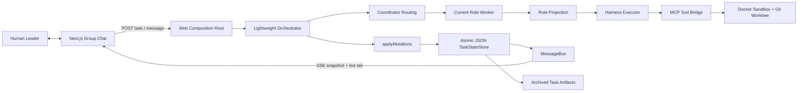

# 🏛️ Agora

### A human-led, group-chat workspace where AI agents plan, code, test, and review together.

**Current scope: local use.** Run Agora on your own computer and open its local address in your browser. The backend, Docker sandboxes, and Git worktrees run on that machine, and application data is stored locally. Cloud hosting is outside the current product scope. Model requests go to your chosen online API or local model service; local operation does not mean offline operation. The product installation and startup commands currently support macOS. The Linux product launcher and automatic credential setup are outside that task’s current scope; existing Linux sandbox support is separate.

**Credential setup on macOS.** The local launcher creates a random encryption key in your macOS Keychain on first use and reuses it after restart. In the model settings dialog, enter your service's Base URL, API key, and model name, either for one Agent or the whole team. Keychain access may require macOS authorization. Existing encrypted connections remain unavailable when the original key cannot be accessed; the application shows recovery instructions and never silently replaces it.

**Agora** takes its name from the ancient Greek *agorá*: the public gathering place where people met to exchange ideas and make decisions. This project brings that idea to software development—specialized AI agents work in a shared, visible space, while the human Leader remains present and makes the final call.

[](https://www.typescriptlang.org/)
[](https://nodejs.org/)
[](https://nextjs.org/)
[](https://modelcontextprotocol.io/)
[](https://github.com/logan-suu/Agora)

## Live Phase 5 Demo


This is a real browser-triggered Task 5.5 run—not a scripted chat animation. In the recording, Agora:

1. accepts a goal to implement a TTL-aware LRU cache;
2. routes the task through `CODER → TESTER → REVIEWER`;
3. streams persisted progress into the group chat over SSE;
4. runs the generated test suite successfully;
5. reaches `done`, archives the artifact, and restores the same nine-message timeline after refresh.

The recorded run used DeepSeek through the Harness executor, a real Docker sandbox, MCP tools, host Git, JSON state persistence, and the same production composition root used by the web application.

## What is Agora?

Agora is an opinionated multi-agent coding product, not a generic agent-chat SDK. It presents software delivery as a group conversation among six roles:

- **Coordinator** routes work and tracks progress.
- **PM** clarifies requirements when the task needs it.
- **Architect** produces implementation boundaries and decisions.
- **Coder** changes the code in an isolated workspace.
- **Tester** runs acceptance checks and reports evidence.
- **Reviewer** accepts the result or sends it back for rework.
- **Leader (you)** can observe, redirect, approve, or overrule the team.

The visible chat is a control surface, not the agents' raw context. Each role receives a structured projection of shared state, including only the facts, decisions, file references, and local channel context it needs. This keeps long conversations from turning into an ever-growing prompt shared by every agent.

Agora's central design rules are:

- **One collaboration surface:** communication appears as channels in a group-chat UI.
- **One final authority:** agents may object, but the human Leader decides; agents do not vote themselves into consensus.
- **Role-projected context:** display messages and model payloads are separate, and raw chat logs are never injected wholesale.
- **Unified Harness agents:** every role uses Agora’s own agent implementation built on DeepSeek Harness. Harness supplies the agent loop, session persistence, and compaction; Agora implements role projections and collaboration control. External coding-agent executors are outside the product scope.
- **Real execution evidence:** coding tasks run through sandbox, MCP, Git, test, persistence, and recovery paths rather than UI-only simulations.

## Recorded Phase 5 Baseline

The historical Phase 5 recording demonstrates a complete, sequential MVP loop:

- browser-based task creation and explicit start;
- adaptive Tier 0/1/2 routing through a four-node orchestration loop;
- structured handoffs, decision ledger, test/review feedback, and iteration limits;
- role-specific context projection enforced before each Harness step;
- DeepSeek Harness execution with typed role outputs;
- Docker task sandboxing plus host-managed Git worktrees;
- MCP filesystem, test, Git, lint, and sandbox tools;
- state mutation through commutative, idempotent reducers;
- atomic JSON snapshots under `.data/projects/{projectId}/tasks/{taskId}`;
- persisted-message-first delivery through MessageBus and SSE;
- refresh and server-restart recovery for completed task state, messages, and archived artifacts;
- validated, idempotent leading `@ROLE` assignment through the normal message endpoint;
- responsive desktop and mobile group-chat UI.

That Phase 5 baseline used a **trusted, single-user, single-instance, self-hosted** boundary. It supported one fixed `main` channel and at most one active run across the backend instance. Those historical results do not establish later channel, gate or parallel-worker features. Current installation and workflow instructions appear below; public authentication and horizontal scaling remain outside the product scope.

## Agora vs. AutoGen and AgentScope

AutoGen and AgentScope are capable general-purpose frameworks. Agora addresses a narrower product question: **what should a human-led AI coding team feel like, and which collaboration invariants should the product enforce by default?**

| Dimension | Agora | AutoGen | AgentScope |
| --- | --- | --- | --- |
| Primary focus | Opinionated coding collaboration product and UI | General multi-agent framework with Core, AgentChat, extensions, and Studio | General platform for building and operating agent applications |
| Collaboration model | Group chat is the product control surface; a lightweight Coordinator routes coding roles | Offers several team patterns; `SelectorGroupChat` can use shared team context and model-based speaker selection | Supplies agents, teams, messaging, tools, sandboxing, deployment, and observability primitives |
| Context policy | Role projections are a system invariant; raw display history is not an agent prompt | Context management is configurable by the application/team pattern | Context and memory policy are framework/application concerns |
| Human authority | The Leader is always present and is the sole final authority; blocking disagreement must escalate to the human | Supports human-in-the-loop agents and feedback, while the final authority policy is application-defined | Supports human participation and team construction, while authority policy is application-defined |
| Coding execution | A prescribed Harness → projection → MCP → Docker/worktree → test/review → persisted artifact path | Extensible code executors and general agent/tool workflows | General tools, workspaces/sandboxes, services, and deployment capabilities |
| Orchestration stance | Four generic nodes plus deterministic routing; collaboration scale follows task complexity | Provides high- and low-level orchestration APIs and multiple team patterns | Provides flexible agent/team construction and runtime services |

The point is not that Agora replaces either framework. It deliberately borrows proven patterns—AutoGen's termination conditions, code-executor boundary, Magentic-One ledger, and handoffs; AgentScope's message semantics, write ownership, interrupt structure, and separation of storage from context—while enforcing a different product contract around role projection and human authority.

Comparison notes:

- The AutoGen description follows its [official repository](https://github.com/microsoft/autogen) and [`SelectorGroupChat` documentation](https://microsoft.github.io/autogen/dev/user-guide/agentchat-user-guide/selector-group-chat.html). As of September 2026, the repository describes AutoGen as community-maintained and recommends Microsoft Agent Framework for new, long-term-supported projects.
- The AgentScope description follows its [official repository](https://github.com/agentscope-ai/agentscope).
- Agora's detailed source-level comparison is a dated 2026-08-24 research snapshot in [Framework Research and Adoption Decisions](docs/框架调研与借鉴决策.md), so it should not be read as a permanent claim about future versions of either project.

## Architecture



The recorded Phase 5 runtime was sequential. Phase 9 subsequently added concurrent workers, cooperative preemption at Harness step boundaries, and integration checkpoints; current state and evidence are tracked in `docs/task-status.json`.

## Quick Start (macOS)

### Prerequisites

- macOS with Node.js **24** and **pnpm 9.15.9** (the version pinned in `package.json`)
- Git and Xcode Command Line Tools (`clang`)
- Docker Desktop with its daemon running
- an OpenAI-compatible model service, or a local compatible service

The new product launcher currently reports unsupported platforms on Linux. The existing POSIX sandbox's Linux support is separate; Linux product setup is deferred as DEF-017.

### Install, check, and start

```bash
git clone https://github.com/logan-suu/Agora.git
cd Agora
pnpm install --frozen-lockfile
pnpm run setup
pnpm run doctor
pnpm start
```

Use **`pnpm run setup`** explicitly: `pnpm setup` is pnpm's own shell-configuration command. Agora's setup checks dependencies, builds the trusted sandbox and Keychain helpers, and creates the Next.js production build. It does not install system dependencies or launch Docker Desktop for you. Run setup again after updating the source.

Open [http://127.0.0.1:3000](http://127.0.0.1:3000). If that port is occupied, use `pnpm start --port 3100` and open the address printed by the launcher. The server binds only to the loopback interface and rejects cross-site writes. Duplicate launchers for the same data directory are rejected.

1. Choose **Set model for all Agents**, or an Agent's **Model** button.
2. Enter the Base URL and model name. Enter an API key, or explicitly choose no authentication for a local service.
3. Save. Saving does not call the model; **Test connection** sends a short model request.
4. Enter a task ID and goal, then start the task.
5. Follow the team in the main/sub channels and Trace. Complete any required Leader gate; Reviewer approval produces a completion candidate, followed by your final approval.

Settings changes apply to new tasks. Existing tasks and paused sessions retain their original model bindings. Multiple tasks share the existing global worker limit; this does not change the single-user, single-backend-instance boundary.

### Stop and restart

Press **Ctrl+C** in the launch terminal, or run **`pnpm stop`** from another terminal in this checkout. If you use a custom `AGORA_DATA_ROOT`, supply the same value when stopping.

Stopping closes admission to new work and waits for active model requests and tasks to finish or reach an existing human gate. It can take time; watch the terminal's draining message. No timeout forcibly kills an in-flight model. If resource cleanup fails, keep the process open and retry stop. Data, paused worktrees, sessions, artifacts, and the Keychain item are retained. `pnpm start` reopens the same data and credentials.

An unexpected process exit retains the existing recovery rules: a durable human gate can resume through its persisted receipt; other unfinished work is shown as interrupted, with no promise of automatic continuation. After a crash, a stale local control socket may remain. The startup error prints its exact path. Verify that the old Agora process has exited before removing that socket; do not remove it while an instance is active.

### Configuration and recovery

| Setting | Purpose |
| --- | --- |
| Model settings dialog | Per-Agent or team-wide Base URL, API key, model name and optional token limits |
| `AGORA_DATA_ROOT` | Optional data directory; defaults to this checkout's `.data` |
| `AGORA_MODEL` | Optional legacy default model, used when no saved connection is selected |
| `DEEPSEEK_API_KEY` | Optional legacy default-provider credential; required by the repository's live DeepSeek tests |
| `AGORA_CREDENTIALS_KEY` | Advanced compatibility override: a canonical base64-encoded 32-byte key, used only for that process |

Normal startup requires no master-key environment variable or `.env` editing. The macOS Keychain identity is service `com.agora.local.credentials`, account equal to the current macOS username, preserving the prior local setup. An explicitly supplied override takes precedence; an empty/invalid override fails instead of falling back. Overrides do not automatically replace Keychain items or re-encrypt history.

For an existing advanced environment setup, **`pnpm credentials:adopt`** explicitly imports that same key into Keychain after checking all saved encrypted connections. It only creates a missing item or reuses an identical item; a conflicting Keychain key is rejected. Remove the override from your launching environment afterward. This operation never prints the key.

If the Keychain is locked, unlock it and restart. If access is denied, allow the trusted Agora helper in macOS and restart. Missing or mismatched historical keys require restoring the **original** key, not generating a replacement. Damaged configuration requires a valid backup. Other paths, including no-auth model connections, remain available when encrypted credentials are unavailable.

Back up both `.data` and the original macOS Keychain using protected backup facilities. Copying `.data` alone preserves API-key ciphertext but does not include its decryption key. Stopping or updating Agora does not delete either. Keep both backups private; never commit API keys or environment files.

### Verify the repository

```bash
pnpm build:sandbox-native
pnpm build:keychain-native
pnpm typecheck
pnpm lint
pnpm test
pnpm --filter @agora/web build
```

The macOS suite includes a disposable, password-protected Keychain and preserves the user's login Keychain. Docker and configured live model tests must run; missing permissions/dependencies are reported as incomplete verification, not skipped passes. Explicit task 10.4 launcher and live-model G5 commands and results are recorded in [the local startup evidence](docs/evals/phase10-local-startup-evidence.md).

## Tech Stack

| Layer | Technology |
| --- | --- |
| Language/runtime | TypeScript 5.9+, Node.js 24 |
| Web UI | Next.js 15, React 19 |
| Single-agent kernel | DeepSeek Harness/Cordis ecosystem |
| Coordination | Self-developed lightweight four-node orchestrator |
| Tool protocol | MCP TypeScript SDK |
| Sandbox | Docker per task, with a LocalTemp adapter retained for lower-phase tests |
| Source isolation | Git worktrees managed through `simple-git` |
| Persistence | Atomic JSON snapshots and archived task artifacts under `.data/` |
| Realtime transport | SSE for receive, HTTP POST for send |
| Testing/quality | Vitest 3, TypeScript, Biome 2 |
| Workspace | pnpm 9 monorepo |

## Repository Layout

```text
Agora/
├── apps/web/                       # Next.js group-chat UI and Phase 5 server composition
├── packages/
│   ├── core/
│   │   ├── domain/                 # State, mutations, roles, and pure domain logic
│   │   ├── orchestration/          # Coordinator routing and four-node loop
│   │   └── preemption/             # Cooperative-preemption domain primitives
│   ├── runtime/
│   │   ├── executor/               # Harness executor and role projection
│   │   ├── sandbox/                # Docker and local-temp sandbox adapters
│   │   └── state/                  # TaskStateStore port and JSON adapter
│   ├── comm/{bus,channels}/        # MessageBus and channel/inbox logic
│   ├── roles/definitions/          # Data-driven role specifications
│   ├── tools/{bridge,fs,git,lint,sandbox,test}/
│   └── shared/
├── tests/integration/              # Phase and cross-phase acceptance suites
├── docs/                           # Blueprint, detailed design, plans, decisions, status
├── .agents/skills/                 # Project workflow skills for Codex
└── README.md
```

## Roadmap

| Phase | Outcome | Status |
| --- | --- | --- |
| 0 | State/reducer skeleton, Harness worker, local sandbox | ✅ Complete |
| 1 | Docker sandbox and MCP execution tools | ✅ Complete |
| 2 | Six-role coding, testing, review, and feedback loops | ✅ Complete |
| 3 | Role projection, structured handoffs, and decision ledger | ✅ Complete |
| 4 | Adaptive Tier 0/1/2 orchestration | ✅ Complete |
| 5 | Recoverable group-chat MVP and real browser-triggered loop | ✅ Complete |
| 6 | Dynamic channels, participants, threads, and server-side authorization | ✅ Complete |
| 7 | Role recruitment, hot-swapping, and mandatory handoff | ✅ Complete |
| 8 | HumanGate, blocking/advisory objections, and arbitration UI | ✅ Complete |
| 9 | True parallel workers and cooperative preemption | ✅ Complete |
| 10 | Unified Harness agents, macOS setup and startup, hardening, final benchmark, and portfolio demo | In progress |

The detailed task graph and current evidence live in [`docs/task-status.json`](docs/task-status.json). The final README and portfolio recording remain a separate Phase 10 deliverable; the Phase 5 recording above remains historical evidence, while Quick Start describes the current macOS launcher.

## Design Documents

- [Project Blueprint](docs/项目蓝图.md) — product positioning, architecture, roadmap, and ratified decisions
- [Detailed Design](docs/详细设计方案.md) — state schemas, role contracts, orchestration, execution, projection, and validation
- [System Architecture](docs/系统架构设计文档.md) — layers, dependency direction, consistency, resilience, and deployment
- [Technology Decisions](docs/技术选型文档.md) — locked stack, rejected alternatives, sandboxing, SSE, and persistence
- [Development Plan](docs/开发计划安排.md) — Phase 0–10 task breakdown and exit criteria
- [Framework Research](docs/框架调研与借鉴决策.md) — dated AutoGen and AgentScope source-level research

## Project Status and Scope

Agora is a personal portfolio project for the 2026 graduate recruitment season. It is being developed in small, evidence-backed phases: each phase must produce a demonstrable outcome before the next one begins.

The current product targets trusted, single-user local operation. Public hosting, cloud sandboxes, and multi-instance scaling are outside the current scope. Any future change to that scope requires a separate architecture and security review.

Feedback and architecture discussions are welcome. Automated PR merges are intentionally not part of the project workflow: changes are reviewed and merged by a human.
