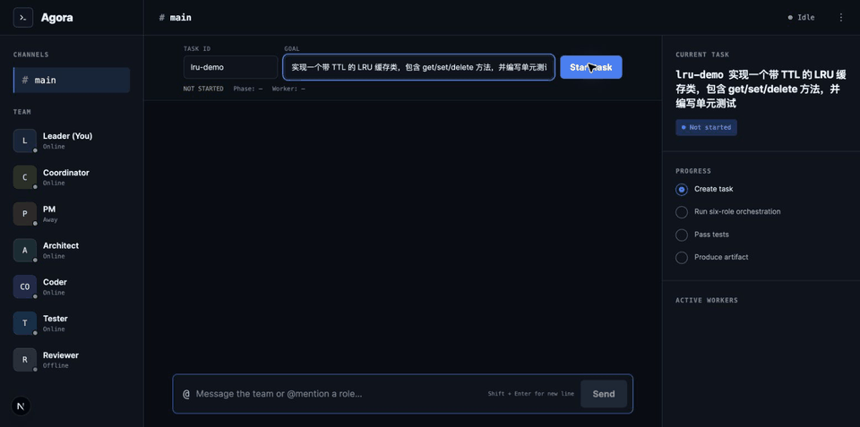
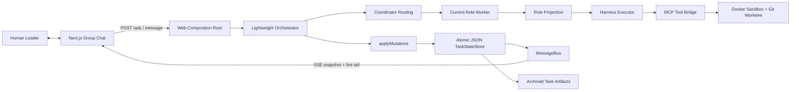

# 🏛️ Agora

### A human-led, group-chat workspace where AI agents plan, code, test, and review together.

**Agora** takes its name from the ancient Greek *agorá*: the public gathering place where people met to exchange ideas and make decisions. This project brings that idea to software development—specialized AI agents work in a shared, visible space, while the human Leader remains present and makes the final call.

[](https://www.typescriptlang.org/)
[](https://nodejs.org/)
[](https://nextjs.org/)
[](https://modelcontextprotocol.io/)
[](https://github.com/logan-suu/Agora)

## Live Phase 5 Demo



This is a real browser-triggered Task 5.5 run—not a scripted chat animation. In the recording, Agora:

1. accepts a goal to implement a TTL-aware LRU cache;
2. routes the task through `CODER → TESTER → REVIEWER`;
3. streams persisted progress into the group chat over SSE;
4. runs the generated test suite successfully;
5. reaches `done`, archives the artifact, and restores the same nine-message timeline after refresh.

The recorded run used DeepSeek through the Harness executor, a real Docker sandbox, MCP tools, host Git, JSON state persistence, and the same production composition root used by the web application.

## What is Agora?

Agora is an opinionated multi-agent coding product, not a generic agent-chat SDK. It presents software delivery as a group conversation among six roles:

- **Coordinator** routes work and tracks progress.
- **PM** clarifies requirements when the task needs it.
- **Architect** produces implementation boundaries and decisions.
- **Coder** changes the code in an isolated workspace.
- **Tester** runs acceptance checks and reports evidence.
- **Reviewer** accepts the result or sends it back for rework.
- **Leader (you)** can observe, redirect, approve, or overrule the team.

The visible chat is a control surface, not the agents' raw context. Each role receives a structured projection of shared state, including only the facts, decisions, file references, and local channel context it needs. This keeps long conversations from turning into an ever-growing prompt shared by every agent.

Agora's central design rules are:

- **One collaboration surface:** communication appears as channels in a group-chat UI.
- **One final authority:** agents may object, but the human Leader decides; agents do not vote themselves into consensus.
- **Role-projected context:** display messages and model payloads are separate, and raw chat logs are never injected wholesale.
- **Thin executors:** the project reuses Harness for the single-agent loop and implements only the coordination layer above it.
- **Real execution evidence:** coding tasks run through sandbox, MCP, Git, test, persistence, and recovery paths rather than UI-only simulations.

## What Works Today

Phase 5 provides a complete, sequential MVP loop:

- browser-based task creation and explicit start;
- adaptive Tier 0/1/2 routing through a four-node orchestration loop;
- structured handoffs, decision ledger, test/review feedback, and iteration limits;
- role-specific context projection enforced before each Harness step;
- DeepSeek Harness execution with typed role outputs;
- Docker task sandboxing plus host-managed Git worktrees;
- MCP filesystem, test, Git, lint, and sandbox tools;
- state mutation through commutative, idempotent reducers;
- atomic JSON snapshots under `.data/projects/{projectId}/tasks/{taskId}`;
- persisted-message-first delivery through MessageBus and SSE;
- refresh and server-restart recovery for completed task state, messages, and archived artifacts;
- validated, idempotent leading `@ROLE` assignment through the normal message endpoint;
- responsive desktop and mobile group-chat UI.

Phase 5 intentionally runs in a **trusted, single-user, single-instance, self-hosted** boundary. It supports one fixed `main` channel and at most one active run across the backend instance. Authentication, dynamic channel membership, active-run restart, horizontal scaling, and true parallel workers are not claimed yet.

## Agora vs. AutoGen and AgentScope

AutoGen and AgentScope are capable general-purpose frameworks. Agora addresses a narrower product question: **what should a human-led AI coding team feel like, and which collaboration invariants should the product enforce by default?**

| Dimension | Agora | AutoGen | AgentScope |
| --- | --- | --- | --- |
| Primary focus | Opinionated coding collaboration product and UI | General multi-agent framework with Core, AgentChat, extensions, and Studio | General platform for building and operating agent applications |
| Collaboration model | Group chat is the product control surface; a lightweight Coordinator routes coding roles | Offers several team patterns; `SelectorGroupChat` can use shared team context and model-based speaker selection | Supplies agents, teams, messaging, tools, sandboxing, deployment, and observability primitives |
| Context policy | Role projections are a system invariant; raw display history is not an agent prompt | Context management is configurable by the application/team pattern | Context and memory policy are framework/application concerns |
| Human authority | The Leader is always present and is the sole final authority; blocking disagreement must escalate to the human | Supports human-in-the-loop agents and feedback, while the final authority policy is application-defined | Supports human participation and team construction, while authority policy is application-defined |
| Coding execution | A prescribed Harness → projection → MCP → Docker/worktree → test/review → persisted artifact path | Extensible code executors and general agent/tool workflows | General tools, workspaces/sandboxes, services, and deployment capabilities |
| Orchestration stance | Four generic nodes plus deterministic routing; collaboration scale follows task complexity | Provides high- and low-level orchestration APIs and multiple team patterns | Provides flexible agent/team construction and runtime services |

The point is not that Agora replaces either framework. It deliberately borrows proven patterns—AutoGen's termination conditions, code-executor boundary, Magentic-One ledger, and handoffs; AgentScope's message semantics, write ownership, interrupt structure, and separation of storage from context—while enforcing a different product contract around role projection and human authority.

Comparison notes:

- The AutoGen description follows its [official repository](https://github.com/microsoft/autogen) and [`SelectorGroupChat` documentation](https://microsoft.github.io/autogen/dev/user-guide/agentchat-user-guide/selector-group-chat.html). As of September 2026, the repository describes AutoGen as community-maintained and recommends Microsoft Agent Framework for new, long-term-supported projects.
- The AgentScope description follows its [official repository](https://github.com/agentscope-ai/agentscope).
- Agora's detailed source-level comparison is a dated 2026-08-24 research snapshot in [Framework Research and Adoption Decisions](docs/框架调研与借鉴决策.md), so it should not be read as a permanent claim about future versions of either project.

## Architecture



The Phase 5 runtime is deliberately sequential even though the domain model can describe more than one worker. True concurrent workers, cooperative preemption at Harness step boundaries, and integration checkpoints belong to Phase 9.

## Quick Start

### Prerequisites

- Node.js 20 or newer
- Corepack with pnpm 9.15.9
- a running Docker daemon (Docker Desktop is sufficient)
- a DeepSeek API key
- Git

### Install and run

```bash
git clone https://github.com/logan-suu/Agora.git
cd Agora

corepack enable
pnpm install

export DEEPSEEK_API_KEY="your-key-here"
pnpm --filter @agora/web dev
```

Open [http://localhost:3000](http://localhost:3000), then:

1. enter a stable **Task ID** such as `ttl-lru-demo`;
2. enter a concrete **Goal**;
3. select **Start task**;
4. follow the active role, messages, test result, review result, and artifact path;
5. refresh after completion to verify persisted recovery;
6. send a message beginning with one valid mention, such as `@TESTER re-check the acceptance criteria`, to exercise the current Phase 5 Leader-intent path.

The web UI currently uses the fixed project ID `agora` and fixed channel ID `main`. Only one task may be actively running at a time. Starting another active task returns a visible conflict instead of silently creating unsupported parallel work.

### Configuration

| Variable | Required | Purpose |
| --- | --- | --- |
| `DEEPSEEK_API_KEY` | Yes for live agent runs | Read by the Harness executor for model requests |
| `AGORA_DATA_ROOT` | No | Overrides the default repository-local `.data` persistence root |

Never commit API keys or `.env` files. Agora currently assumes a trusted local deployment and should not be exposed directly to untrusted users.

### Verify the repository

```bash
pnpm typecheck
pnpm lint
pnpm test
pnpm --filter @agora/web build
```

## Tech Stack

| Layer | Technology |
| --- | --- |
| Language/runtime | TypeScript 5.9+, Node.js 20 |
| Web UI | Next.js 15, React 19 |
| Single-agent kernel | DeepSeek Harness/Cordis ecosystem |
| Coordination | Self-developed lightweight four-node orchestrator |
| Tool protocol | MCP TypeScript SDK |
| Sandbox | Docker per task, with a LocalTemp adapter retained for lower-phase tests |
| Source isolation | Git worktrees managed through `simple-git` |
| Persistence | Atomic JSON snapshots and archived task artifacts under `.data/` |
| Realtime transport | SSE for receive, HTTP POST for send |
| Testing/quality | Vitest 3, TypeScript, Biome 2 |
| Workspace | pnpm 9 monorepo |

## Repository Layout

```text
Agora/
├── apps/web/                       # Next.js group-chat UI and Phase 5 server composition
├── packages/
│   ├── core/
│   │   ├── domain/                 # State, mutations, roles, and pure domain logic
│   │   ├── orchestration/          # Coordinator routing and four-node loop
│   │   └── preemption/             # Cooperative-preemption domain primitives
│   ├── runtime/
│   │   ├── executor/               # Harness executor and role projection
│   │   ├── sandbox/                # Docker and local-temp sandbox adapters
│   │   └── state/                  # TaskStateStore port and JSON adapter
│   ├── comm/{bus,channels}/        # MessageBus and channel/inbox logic
│   ├── roles/definitions/          # Data-driven role specifications
│   ├── tools/{bridge,fs,git,lint,sandbox,test}/
│   └── shared/
├── tests/integration/              # Phase and cross-phase acceptance suites
├── docs/                           # Blueprint, detailed design, plans, decisions, status
├── .agents/skills/                 # Project workflow skills for Codex
└── README.md
```

## Roadmap

| Phase | Outcome | Status |
| --- | --- | --- |
| 0 | State/reducer skeleton, Harness worker, local sandbox | ✅ Complete |
| 1 | Docker sandbox and MCP execution tools | ✅ Complete |
| 2 | Six-role coding, testing, review, and feedback loops | ✅ Complete |
| 3 | Role projection, structured handoffs, and decision ledger | ✅ Complete |
| 4 | Adaptive Tier 0/1/2 orchestration | ✅ Complete |
| 5 | Recoverable group-chat MVP and real browser-triggered loop | 🚧 Exit review |
| 6 | Dynamic channels, participants, threads, and server-side authorization | Planned |
| 7 | Role recruitment, hot-swapping, and mandatory handoff | Planned |
| 8 | HumanGate, blocking/advisory objections, and arbitration UI | Planned |
| 9 | True parallel workers and cooperative preemption | Planned |
| 10 | Optional thick executors, deployment, hardening, and final portfolio demo | Planned |

The detailed task graph and current evidence live in [`docs/task-status.json`](docs/task-status.json). The final README and portfolio recording remain a separate Phase 10 deliverable; this document describes the Phase 5 MVP truthfully.

## Design Documents

- [Project Blueprint](docs/项目蓝图.md) — product positioning, architecture, roadmap, and ratified decisions
- [Detailed Design](docs/详细设计方案.md) — state schemas, role contracts, orchestration, execution, projection, and validation
- [System Architecture](docs/系统架构设计文档.md) — layers, dependency direction, consistency, resilience, and deployment
- [Technology Decisions](docs/技术选型文档.md) — locked stack, rejected alternatives, sandboxing, SSE, and persistence
- [Development Plan](docs/开发计划安排.md) — Phase 0–10 task breakdown and exit criteria
- [Framework Research](docs/框架调研与借鉴决策.md) — dated AutoGen and AgentScope source-level research

## Project Status and Scope

Agora is a personal portfolio project for the 2026 graduate recruitment season. It is being developed in small, evidence-backed phases: each phase must produce a demonstrable outcome before the next one begins.

The current MVP is intended for trusted local evaluation. Before public multi-user deployment, it still needs authentication, participant authorization, broader security hardening, external durable state for horizontally scaled backends, and cross-instance event delivery.

Feedback and architecture discussions are welcome. Automated PR merges are intentionally not part of the project workflow: changes are reviewed and merged by a human.
