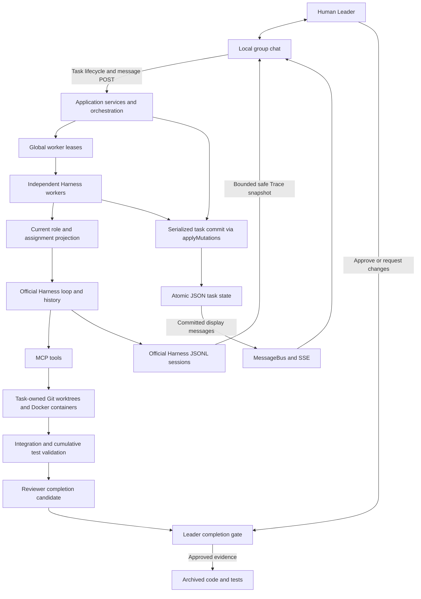

# 🏛️ Agora

### A human-led, group-chat workspace where AI agents plan, code, test, and review together.

**Current scope: local use.** Run Agora on your own computer and open its local address in your browser. The backend, Docker sandboxes, and Git worktrees run on that machine, and application data is stored locally. Cloud hosting is outside the current product scope. Model requests go to your chosen online API or local model service; local operation does not mean offline operation. The product installation and startup commands currently support macOS. The Linux product launcher and automatic credential setup are outside that task’s current scope; existing Linux sandbox support is separate.

**Credential setup on macOS.** The local launcher creates a random encryption key in your macOS Keychain on first use and reuses it after restart. In the model settings dialog, enter your service's Base URL, API key, and model name, either for one Agent or the whole team. Keychain access may require macOS authorization. Existing encrypted connections remain unavailable when the original key cannot be accessed; the application shows recovery instructions and never silently replaces it.

**Agora** takes its name from the ancient Greek *agorá*: the public gathering place where people met to exchange ideas and make decisions. This project brings that idea to software development—specialized AI agents work in a shared, visible space, while the human Leader remains present and makes the final call.

[](https://www.typescriptlang.org/)
[](https://nodejs.org/)
[](https://nextjs.org/)
[](https://modelcontextprotocol.io/)
[](https://github.com/logan-suu/Agora)

## Current product

Agora runs a six-role coding team on your Mac. Independent Coder workers can execute concurrently in separate Git worktrees and Docker containers. The team validates cumulative work before review; the human Leader approves final completion.

- **Direct the work:** describe requirement changes in ordinary chat, review a before-and-after proposal, and click **Confirm changes**. Ambiguous requests can ask for clarification; proposals never apply themselves. Existing decision commands remain available through the same chat entry.
- **Read the discussion:** messages support Markdown headings, lists, quotes, links, code blocks and tables. Requirements and reviews appear as readable sections with their original JSON available on demand.
- **Inspect execution:** view persisted progress and session timelines, including concurrent workers and resumed session lineage.
- **Keep authority:** ordinary test failures return for repair; blocking objections and final completion require the Leader.
- **Choose models:** configure an OpenAI-compatible service for the whole team or individual roles. New verified DeepSeek V4 connections default to a 1M context window and 384K maximum output with automatic Harness history compaction; custom limits remain independently editable.
- **Keep artifacts:** completed code and tests remain available after execution resources are released.

Start with [Quick Start](#quick-start-macos). See the [final benchmark report](docs/evals/phase10-opencode-go-final-report.md), [engineering interview notes](docs/portfolio/engineering-notes.md), and [current product demo](#product-demo). Task 10.6 is complete; Phase 10 final acceptance remains separate.

## Product demo

https://github.com/user-attachments/assets/d24f4192-8353-43b8-b164-0cbcf700abc2

One real task: describe a goal, change the ticket price in plain English, review and confirm the proposal, repair issues found in verification, then approve completion and keep the artifact. The English recording includes real rework and cuts waiting periods. Rework and final approval use the existing gate command; no JSON is pasted into chat. See the [recording evidence, editing notes and downloadable artifact](docs/demo/task106-natural-chat-demo.md). The archived output passes 18 project tests plus 8 independent checks.

## What is Agora?

Agora is an opinionated multi-agent coding product, not a generic agent-chat SDK. It presents software delivery as a group conversation among six roles:

- **Coordinator** routes work and tracks progress.
- **PM** clarifies requirements when the task needs it.
- **Architect** produces implementation boundaries and decisions.
- **Coder** changes the code in an isolated workspace.
- **Tester** runs acceptance checks and reports evidence.
- **Reviewer** recommends completion or requests rework; the Leader makes the final decision.
- **Leader (you)** can observe, redirect, approve, or overrule the team.

The visible chat is a control surface, not the agents' raw context. Each role receives a structured projection of shared state, including only the facts, decisions, file references, and local channel context it needs. This keeps long conversations from turning into an ever-growing prompt shared by every agent.

Agora's central design rules are:

- **One collaboration surface:** communication appears as channels in a group-chat UI.
- **One final authority:** agents may object, but the human Leader decides; agents do not vote themselves into consensus.
- **Role-projected context:** display messages and model payloads are separate, and raw chat logs are never injected wholesale.
- **Unified Harness agents:** every role uses Agora’s own agent implementation built on DeepSeek Harness. Harness supplies the agent loop, session persistence, and compaction; Agora implements role projections and collaboration control. External coding-agent executors are outside the product scope.
- **Real execution evidence:** coding tasks run through sandbox, MCP, Git, test, persistence, and recovery paths rather than UI-only simulations.

## Evidence and limits

The final evaluation uses a fixed four-task Aider Polyglot JavaScript subset and two internal collaboration tasks, with three independent attempts per task and variant. These are small exploratory comparisons, not a full benchmark ranking.

| Frozen group | Variant | Overall pass / attempts |
| --- | --- | --- |
| Public v11 | Single Harness Agent | 12 / 12 |
| Public v11 | Multiple roles, one model | 11 / 12 |
| Public v11 | Multiple roles, mixed models | 10 / 12 |
| Internal v14 | Serial execution of the same DAG | 6 / 6 |
| Internal v14 | Parallel execution | 4 / 6 |
| Internal v14 | Sparse structured channel context | 4 / 6 |

Public v11 and internal v14 use different frozen source versions and are reported separately. All non-mixed variants use `deepseek-v4-flash` through OpenCode Go; mixed variants use `deepseek-flash` for PM, Architect and Reviewer. Provider model aliases are not fixed-weight guarantees.

Among four internal pairs where both serial and parallel runs passed, the mean speed ratio was **1.38 ± 0.20 sample SD**. Parallel passed 4/6 attempts, compared with serial's 6/6; the selected successful pairs do not establish a general speed or reliability advantage. On the public subset, multiple roles added an average 176.12 seconds across 11 successful pairs. Multi-agent coordination has measurable overhead.

Failures include interrupted review, exhausted request/time budgets and streaming disconnections. An attempt that never reached independent grading is not proof of incorrect code. Worker Fork and history compaction were not triggered in these final groups; separate functional checks cover those mechanisms. Unknown usage remains unknown; subscription quota estimates and conservative budget reservations are not cash billing totals.

The [full report](docs/evals/phase10-opencode-go-final-report.md) includes configuration, failures, mechanism coverage and historical attempts. [Public metrics](docs/evals/phase10-opencode-go-public-metrics.json) and [internal metrics](docs/evals/phase10-opencode-go-internal-metrics.json) provide individual results, sample sizes and variance. These frozen measurements are not a fresh evaluation of every later source revision.

Current boundaries:

- macOS product installation; Linux launcher and automatic credential setup are deferred.
- Local, single-user, single-backend operation; model APIs can be online.
- Chat Completions, SSE and function tools through the configured compatible provider; Responses-only and OAuth-only services are not claimed compatible.
- Custom roles can be registered and explicitly assigned where supported. Arbitrary custom-role autonomous routing is deferred; parallel plans reject assignments without the required wave/subtask binding.
- Unexpected process exits do not promise automatic continuation of all unfinished work.
- Role projections and sandbox controls enforce specific boundaries; they do not guarantee unlimited context, perfect model decisions or immunity to every attack.

See [deferred items](docs/deferred-items.json) and the [engineering notes](docs/portfolio/engineering-notes.md) for evidence and tradeoffs. The [framework research](docs/框架调研与借鉴决策.md) is a dated design input, not a current feature ranking of other frameworks.

## Architecture



Model and tool calls can overlap; shared task commits are serialized. Each worker holds a global scheduler lease and receives only its role/assignment slice. Independent code is integrated in waves, and Tester evidence binds the validated cumulative commit. Reviewer approval creates a candidate; only the Leader's approval can finalize it.

A nonblocking instruction updates structured state at a safe point and reprojects the existing worker context. A blocking gate persists checkpoints, releases executable resources and later resumes paused workers in fresh Harness contexts with verified session lineage. Trace is derived from official session logs; it does not expose raw prompts, reasoning or tool arguments/results.

## Quick Start (macOS)

### Prerequisites

- macOS with Node.js **24** and **pnpm 9.15.9** (the version pinned in `package.json`)
- Git and Xcode Command Line Tools (`clang`)
- Docker Desktop with its daemon running
- a compatible Chat Completions service with SSE and function-tool support, online or local

The new product launcher currently reports unsupported platforms on Linux. The existing POSIX sandbox's Linux support is separate; Linux product setup is deferred as DEF-017.

### Install, check, and start

```bash
git clone https://github.com/logan-suu/Agora.git
cd Agora
pnpm install --frozen-lockfile
pnpm run setup
pnpm run doctor
pnpm start
```

Use **`pnpm run setup`** explicitly: `pnpm setup` is pnpm's own shell-configuration command. Agora's setup checks dependencies, builds the trusted sandbox and Keychain helpers, and creates the Next.js production build. It does not install system dependencies or launch Docker Desktop for you. Run setup again after updating the source.

Open [http://127.0.0.1:3000](http://127.0.0.1:3000). If that port is occupied, use `pnpm start --port 3100` and open the address printed by the launcher. The server binds only to the loopback interface and rejects cross-site writes. Duplicate launchers for the same data directory are rejected.

1. Choose **Set model for all Agents**, or an Agent's **Model** button.
2. Enter the Base URL and model name. Enter an API key, or explicitly choose no authentication for a local service.
3. Save. Saving does not call the model; **Test connection** sends a short model request.
4. Enter a task ID and goal, then start the task.
5. Follow the team in the main/sub channels and Trace. Complete any required Leader gate; Reviewer approval produces a completion candidate, followed by your final approval.

Settings changes apply to new tasks. Existing tasks and paused sessions retain their original model bindings. Multiple tasks share the existing global worker limit; this does not change the single-user, single-backend-instance boundary.

### Stop and restart

Press **Ctrl+C** in the launch terminal, or run **`pnpm stop`** from another terminal in this checkout. If you use a custom `AGORA_DATA_ROOT`, supply the same value when stopping.

Stopping closes admission to new work and waits for active model requests and tasks to finish or reach an existing human gate. It can take time; watch the terminal's draining message. No timeout forcibly kills an in-flight model. If resource cleanup fails, keep the process open and retry stop. Data, paused worktrees, sessions, artifacts, and the Keychain item are retained. `pnpm start` reopens the same data and credentials.

An unexpected process exit retains the existing recovery rules: a durable human gate can resume through its persisted receipt; other unfinished work is shown as interrupted, with no promise of automatic continuation. After a crash, a stale local control socket may remain. The startup error prints its exact path. Verify that the old Agora process has exited before removing that socket; do not remove it while an instance is active.

### Configuration and recovery

| Setting | Purpose |
| --- | --- |
| Model settings dialog | Per-Agent or team-wide Base URL, API key, model name and optional token limits |
| `AGORA_DATA_ROOT` | Optional data directory; defaults to this checkout's `.data` |
| `AGORA_MODEL` | Optional legacy default model, used when no saved connection is selected |
| `DEEPSEEK_API_KEY` | Optional legacy default-provider credential; required by the repository's live DeepSeek tests |
| `AGORA_CREDENTIALS_KEY` | Advanced compatibility override: a canonical base64-encoded 32-byte key, used only for that process |

Normal startup requires no master-key environment variable or `.env` editing. The macOS Keychain identity is service `com.agora.local.credentials`, account equal to the current macOS username, preserving the prior local setup. An explicitly supplied override takes precedence; an empty/invalid override fails instead of falling back. Overrides do not automatically replace Keychain items or re-encrypt history.

For an existing advanced environment setup, **`pnpm credentials:adopt`** explicitly imports that same key into Keychain after checking all saved encrypted connections. It only creates a missing item or reuses an identical item; a conflicting Keychain key is rejected. Remove the override from your launching environment afterward. This operation never prints the key.

If the Keychain is locked, unlock it and restart. If access is denied, allow the trusted Agora helper in macOS and restart. Missing or mismatched historical keys require restoring the **original** key, not generating a replacement. Damaged configuration requires a valid backup. Other paths, including no-auth model connections, remain available when encrypted credentials are unavailable.

Back up both `.data` and the original macOS Keychain using protected backup facilities. Copying `.data` alone preserves API-key ciphertext but does not include its decryption key. Stopping or updating Agora does not delete either. Keep both backups private; never commit API keys or environment files.

### Verify the repository

```bash
pnpm build:sandbox-native
pnpm build:keychain-native
pnpm typecheck
pnpm lint
pnpm test
pnpm --filter @agora/web build
```

The macOS suite includes a disposable, password-protected Keychain and preserves the user's login Keychain. Docker and configured live model tests must run; missing permissions/dependencies are reported as incomplete verification, not skipped passes. Explicit task 10.4 launcher and live-model G5 commands and results are recorded in [the local startup evidence](docs/evals/phase10-local-startup-evidence.md).

## Tech Stack

| Layer | Technology |
| --- | --- |
| Language/runtime | TypeScript 5.9+, Node.js 24 |
| Web UI | Next.js 15, React 19 |
| Single-agent kernel | DeepSeek Harness/Cordis ecosystem |
| Coordination | Self-developed lightweight four-node orchestrator |
| Tool protocol | MCP TypeScript SDK |
| Sandbox | Docker per worktree, with a LocalTemp adapter retained for lower-phase tests |
| Source isolation | Git worktrees managed through `simple-git` |
| Persistence | Atomic JSON snapshots, official Harness JSONL sessions and archived task artifacts under `.data/` |
| Realtime transport | SSE for receive, HTTP POST for send |
| Testing/quality | Vitest 3, TypeScript, Biome 2 |
| Workspace | pnpm 9 monorepo |

## Repository Layout

```text
Agora/
├── apps/web/                       # Next.js group-chat UI and local server composition
├── packages/
│   ├── core/
│   │   ├── domain/                 # State, mutations, roles, and pure domain logic
│   │   ├── orchestration/          # Coordinator routing and four-node loop
│   │   └── preemption/             # Cooperative-preemption domain primitives
│   ├── runtime/
│   │   ├── executor/               # Harness executor and role projection
│   │   ├── sandbox/                # Docker and local-temp sandbox adapters
│   │   └── state/                  # TaskStateStore port and JSON adapter
│   ├── comm/{bus,channels}/        # MessageBus and channel/inbox logic
│   ├── roles/definitions/          # Data-driven role specifications
│   ├── tools/{bridge,fs,git,lint,sandbox,test}/
│   └── shared/
├── tests/integration/              # Phase and cross-phase acceptance suites
├── docs/                           # Blueprint, detailed design, plans, decisions, status
├── .agents/skills/                 # Project workflow skills for Codex
└── README.md
```

## Roadmap

| Phase | Outcome | Status |
| --- | --- | --- |
| 0 | State/reducer skeleton, Harness worker, local sandbox | ✅ Complete |
| 1 | Docker sandbox and MCP execution tools | ✅ Complete |
| 2 | Six-role coding, testing, review, and feedback loops | ✅ Complete |
| 3 | Role projection, structured handoffs, and decision ledger | ✅ Complete |
| 4 | Adaptive Tier 0/1/2 orchestration | ✅ Complete |
| 5 | Recoverable group-chat MVP and real browser-triggered loop | ✅ Complete |
| 6 | Dynamic channels, participants, threads, and server-side authorization | ✅ Complete |
| 7 | Role recruitment, hot-swapping, and mandatory handoff | ✅ Complete |
| 8 | HumanGate, blocking/advisory objections, and arbitration UI | ✅ Complete |
| 9 | True parallel workers and cooperative preemption | ✅ Complete |
| 10 | Unified Harness agents, macOS setup and startup, hardening, final benchmark, and portfolio demo | In progress |

The detailed task graph and current evidence live in [`docs/task-status.json`](docs/task-status.json). Tasks 10.2–10.6 are complete. Task 10.7 is ready and will independently verify the final product exit criteria.

## Design Documents

- [Project Blueprint](docs/项目蓝图.md) — product positioning, architecture, roadmap, and ratified decisions
- [Detailed Design](docs/详细设计方案.md) — state schemas, role contracts, orchestration, execution, projection, and validation
- [System Architecture](docs/系统架构设计文档.md) — layers, dependency direction, consistency, resilience, and deployment
- [Technology Decisions](docs/技术选型文档.md) — locked stack, rejected alternatives, sandboxing, SSE, and persistence
- [Development Plan](docs/开发计划安排.md) — Phase 0–10 task breakdown and exit criteria
- [Framework Research](docs/框架调研与借鉴决策.md) — dated AutoGen and AgentScope source-level research

## Project Status and Scope

Agora is a personal portfolio project for the 2026 graduate recruitment season. It is being developed in small, evidence-backed phases: each phase must produce a demonstrable outcome before the next one begins.

The current product targets trusted, single-user local operation. Public hosting, cloud sandboxes, and multi-instance scaling are outside the current scope. Any future change to that scope requires a separate architecture and security review.

Feedback and architecture discussions are welcome. Automated PR merges are intentionally not part of the project workflow: changes are reviewed and merged by a human.
