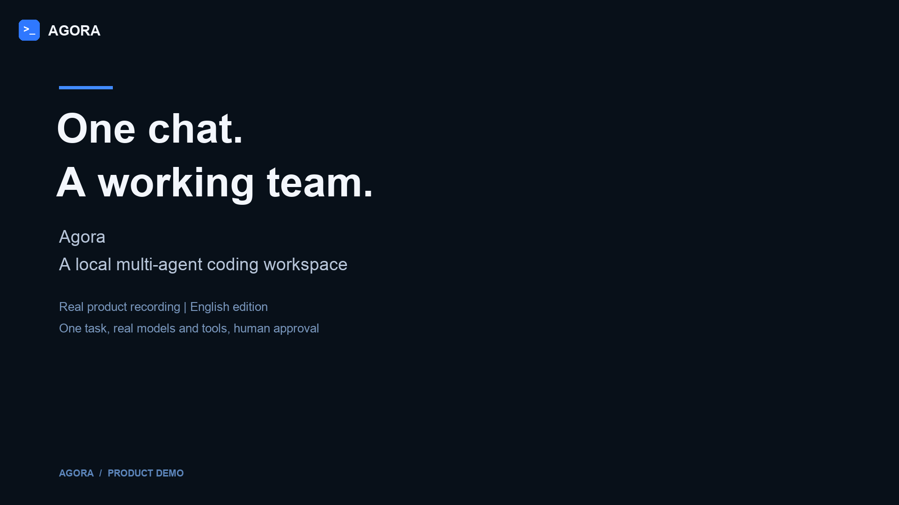

# Agora: natural-language product demo

**Leader accepted this video on 2026-09-12 (local time).** The accepted 202-second cut has SHA-256 `dfd8f4fa545f858f60d092b2e18aaa6c5388419c0a707302ace512345aa03e72`. This records video acceptance; the T10.6 development delivery and human PR process remain separate.

This English recording follows one real local task, `quote-en-take-9`, from a plain-language goal through a confirmed requirement change, repairs, verification, human completion approval and archive. It includes real rework; it is a selected demonstration, not a benchmark or a reliability estimate.

[Video](Agora-Natural-Chat-Demo-2026-09-12.webm) · [Editing timeline](Agora-Natural-Chat-Demo-2026-09-12.timeline.json) · [Six-file artifact](Agora-Natural-Chat-Artifact-2026-09-12.zip)

## The interaction

The Leader starts an event quote calculator and asks: “Change the ticket price to 900 cents per person. Keep the other rules unchanged.” The product proposes readable before-and-after requirements. The Leader reviews both changes and clicks **Confirm changes**. No JSON is pasted into the message input. Completion and rework still use the existing `/resolve-gate` user command, which remains visible in the footage; this recording does not imply those decisions already have a natural-language confirmation flow.

Two Coder executions overlap by 6.3 seconds. Cumulative checks catch the old ticket price, and Reviewer sends the ticket module and its dependants back while preserving the venue work. The resulting candidate passes 15 tests, but independent checks find unsafe input string conversion in error messages. With Leader authorization, the same task repairs both modules and adds regression coverage while retaining all inherited tests. The repaired artifact passes 18 project tests and 8 independent checks, and Reviewer recommends completion. The Leader then approves it through the product interface.

The final `quote(2, 3)` returns `{ ticketCost: 1800, venueCost: 15000, total: 16800 }` in cents. Zero is accepted. Invalid inputs, including `Symbol` and `Object.create(null)`, throw `RangeError` from both pricing functions and either quote argument. After archive, the same 26 checks pass in a read-only, network-disabled Docker container. All six archived files match the approved commit byte for byte. The completed state remains available after refresh; no task containers or linked worktrees remain.

## Evidence

| Item | Recorded fact |
| --- | --- |
| Project / task | `agora` / `quote-en-take-9` |
| Environment | Local macOS product, browser, Harness/MCP, Git and Docker |
| Model | OpenCode Go `deepseek-v4-flash`; six roles, 1M context / 384K output capacity |
| Product source | Base `45ae0985b69d0173c01e5f08fc0db71415975fdb` plus uncommitted T10.6 changes; 420-file manifest SHA-256 `b0ad1cc27a33ba16410ab91356a32aad1965b4f2126f49c75f278d77e5a82e4a` |
| Product regression | 166 files / 1,246 tests passed, zero skipped; typecheck, lint and production build passed |
| Approved artifact | `15b4aa964c9c91de8795edf92dd7475cda9dd2ec` |
| Final validation receipt | `wave-validation:0ea6bcbd-6e52-47a1-a87f-84f313cadf5b` |
| Reviewer verdict | `rv-0ea6bcbd-quality`, approved |
| Leader approval action | `2332c948-df05-408b-93f2-2c5bcc6645ec`, HTTP 202 applied |
| Final state | `done`, gate cleared; SHA-256 `05087cb0c1c34d9e4c4f635a4c8e832e7ffc655db5b29a3ad0c1f771bba1090d` |
| Archive checks | 26 passed / 0 failed / 0 skipped; log SHA-256 `61e1d4691dbaeb940958b1df6aa0e005490372c4aef5f83e4c028bf749cbf5ad` |
| Artifact ZIP | SHA-256 `9e2641c3139c0e18292150b208b9647ead46e12899e88addb4c0e7e595e4e9a7` |
| Model requests | 135 requests, all HTTP 200 with known usage; completion approval needed no additional model request |
| Usage estimate | USD 0.273997680 at the recorded conservative Go peak rates, not a provider invoice |

## Editing and limits

The video uses English editorial chapter panels around actual 1440 × 1000 browser footage. Three raw segments belong to the same task; no other run supplies frames or approvals. Retained footage plays at 1×, with waiting periods cut. A card summarizes the first price-related repair; the subsequent edge-case repair and final approval are shown. Human approval gaps are disclosed. The timeline contains source offsets and media hashes. Editorial cards are explanatory material, not product UI. There is no audio.

When the Leader scrolls through the requirement proposal, automatic following pauses and new-message counts accumulate. The retained frames preserve this real behavior. The Architect still emitted a test-only node despite role guidance; the guidance is not a deterministic plan validator. Inherited test paths and assertions were preserved in the final repair. The demonstration does not establish automatic history compaction or a paused worker's true Fork: those need their separate execution evidence.

The withdrawn JSON-input recording and failed earlier takes were deleted as requested; their canonical task records remain private. The earlier approved artifact remains separate. T10.6 stays `in_progress` until its normal delivery and human PR process completes. Phase 10 final acceptance and [benchmark results](../evals/phase10-opencode-go-final-report.md) remain separate.
