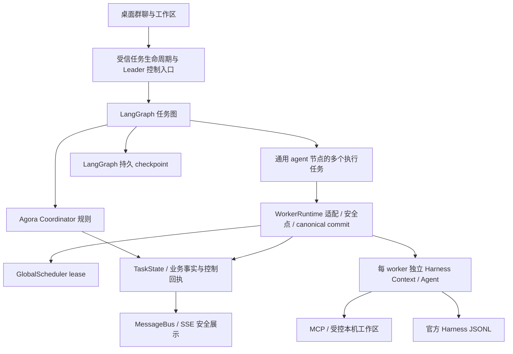
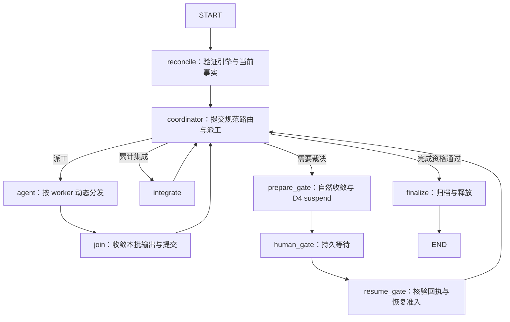
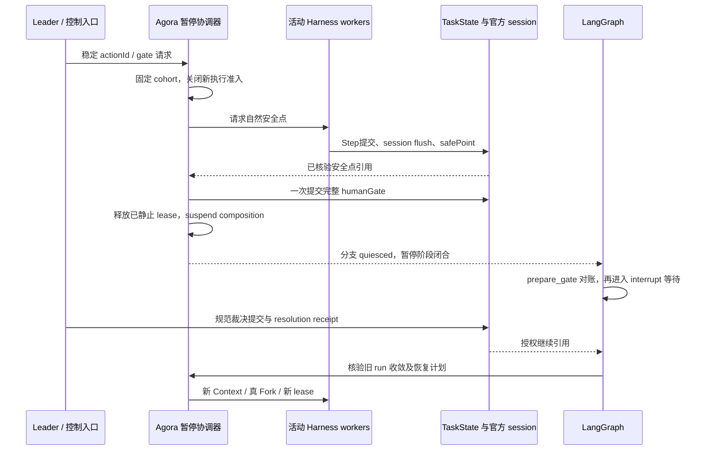

# LangGraph 持久编排与完整 Harness Agent 接入方案

**版本：** 1.0 · **日期：** 2026-09-17（America/Chicago）
**性质：** 独立完整方案与实验解释。2026-09-17按Leader要求完成契约定稿与正式任务登记，纳入PR #87待人工合入；蓝图§21 D19、详细设计§13及开发计划§18.13–18.14为正式决策/落码/任务来源。本文保留方案解释和限界证据，引用正式契约，不维护第二份当前任务状态。
**需求来源：** 本次讨论确认“LangGraph编排多个完整Harness Agent”，采用持久编排、重启后手动继续、旧任务不跨引擎续跑等建议。本次交付独立方案及后续获授权的前置实验证据；已在隔离目录安装测试依赖并运行真实模型（§24–25），当时未将LangGraph登记为产品选型或引入产品依赖。随后D9修复见§26，现已发布PR #87；本轮正式登记Phase14新路线，但未安装产品依赖或切换引擎。
**历史编号：** §24–27的实验叙述按发生时点读取；原19.2/19.3等未开工任务现为20.2/20.3，全部对照见开发计划§18.14；实验原始文件与hash不改写。

**代码观察基线：** `55d6385a8387634864886dfdec38a8d9b1fa804e`。研发进度只查`task-status.json`，本文不维护第二份任务状态。

**目录**

- [1. 目标与成功标准](#section-1)
- [2. 已确认范围与技术建议](#section-2)
- [3. 控制规格与当前实现](#section-3)
- [4. 总体结构](#section-4)
- [5. 图拓扑与节点职责](#section-5)
- [6. 身份映射与状态所有权](#section-6)
- [7. 双存储提交与崩溃对账](#section-7)
- [8. Checkpointer、版本与本地运行](#section-8)
- [9. 动态并行、汇合与公平额度](#section-9)
- [10. Leader更新、humanGate与恢复](#section-10)
- [11. 启动、正常退出与意外恢复](#section-11)
- [12. 重试、返工与错误分类](#section-12)
- [13. 文件、集成、验证与完成终审](#section-13)
- [14. 安全展示、Trace与数据保护](#section-14)
- [15. 工程模块与接口演进](#section-15)
- [16. 旧任务、切换与升级回退](#section-16)
- [17. 分步实施与交付包](#section-17)
- [18. 前置Spike：必须先证明的机制](#section-18)
- [19. 验收矩阵](#section-19)
- [20. 性能、成本与维护收益](#section-20)
- [21. 风险、停止条件与排期输入](#section-21)
- [22. 后续实施时的规格影响与本文检查](#section-22)
- [23. 官方来源与证据边界](#section-23)
- [24. 前置实验结果与方案修订](#section-24)
- [25. 生产本机接缝与打包实验](#section-25)
- [26. D9修复与真实双存储窗口复验](#section-26)
- [27. 派工回执故障矩阵与恢复准入](#section-27)
- [28. 派工回执与 Continue 授权 v1 契约](#section-28)
- [29. 定稿结果与正式任务登记](#section-29)

<a id="section-1"></a>

## 1. 目标与成功标准

让LangGraph.js承担Agora的团队任务持久编排：动态派工、并行分发与汇合、条件路由、流程checkpoint及等待/恢复。每个被派工的Agent仍是完整DeepSeek Harness Agent，保留独立Context/session、模型与工具循环、原生压缩、官方JSONL会话及Fork恢复。

Agora继续定义“允许做什么、谁拥有责任、什么证据才算完成”；LangGraph执行获准的团队流程；Harness执行单Agent工作。LangGraph不会自动理解Agora的Leader权威、工作区授权、投影、验证版本和副作用回执。

成功必须同时满足：

1. 图在进程重启后能找到待执行分支和等待位置，不从任务开头盲跑。
2. 已完成分支有可复用的持久结果；恢复不重复计费调用、Git合并或归档来“补进度”。不承诺所有崩溃窗口恰好一次执行。
3. 多个独立Harness Agent能并发推进，同岗位可多worker；额度、写所有权、暂停与身份约束保持。
4. Leader需求变更、异议裁决、完成终审、累计验证及定向返工的既有产品语义保持。
5. 应用重启本身不启动模型或文件副作用；只有显式继续且核验通过才恢复执行。
6. 新生产路径只由LangGraph驱动；原`while/switch`与原批次pump退出新路径，避免两个运行时同时调度。
7. 工程报告列出实际删除/替换的职责、适配器新增复杂度和恢复结果，不能仅以“使用了LangGraph”宣称维护成本下降。

<a id="section-2"></a>

## 2. 已确认范围与技术建议

| 项目 | 本方案采用的边界 | 确认性质 |
| --- | --- | --- |
| 编排引擎 | LangGraph.js接管任务级持久编排 | Leader已确认 |
| Agent内核 | 多个完整Harness Agent，不拆模型/工具内循环 | Leader已确认 |
| 状态分工 | 图进度、Agora业务事实/回执、Harness会话分开所有 | Leader已确认 |
| 节点粒度 | 一次明确派工，包含若干Harness步骤 | Leader已确认 |
| 并行 | 图分发，GlobalScheduler控制真实执行额度 | Leader已确认 |
| 人工介入 | 非阻塞安全点reproject；blocking沿用D4 | Leader已确认 |
| 重试 | Harness管理请求重试，图节点先对账再决定续办 | Leader已确认 |
| 意外退出 | 自动只读检查，用户手动继续实际执行 | Leader已确认 |
| 旧任务 | 历史可读，首版不跨引擎续跑；活动任务先处理 | Leader已确认 |
| checkpoint落盘 | 首选官方本地SQLite saver；与TaskState JSON分开 | D19正式选型；基础Spike已有，生产验收14.1/14.6 |
| 领域回执 | 新版本内部控制收据与业务效果同一TaskState原子提交 | D19/详设§13定稿；14.2实现验收 |
| 图边界 | 首版每个工作项一条持久图，不把整个项目/产品会话塞入一个图 | D19已登记，14.3实施 |
| 实施时机 | 13.4后新增Phase14，14.7出口切新任务 | 正式登记，原14–30顺延15–31 |

不引入Python服务、云端Agent Server、LangSmith托管依赖或新的模型调用框架。LangGraph可在本地Node进程中运行；不将LangChain的Agent内循环与Harness再套一层。官方安装示例涉及`@langchain/core`基础依赖，不等于采用其Agent框架。[S1]

<a id="section-3"></a>

## 3. 控制规格与当前实现

### 3.1 必须保留的原文

> “角色、上下文和协作控制由 Agora 自研，loop、事件溯源、会话持久化与单 agent 压缩复用 Harness。”——[蓝图§四](项目蓝图.md)

> “禁止合并多个完整 AppState 快照”——[AGENTS.md R1](../AGENTS.md)

> “一次执行可跨 D4 暂停/真 Fork，关联多个 Harness session；终态后重新派发创建新 worker，仍可履行原 assignment。”——[详细设计§12.1.1](详细设计方案.md)

> “只有模型 Step/工具自然结束、commit+flush/checkpoint 闭合后才可以释放/切换。”——[详细设计§12.1.5.3](详细设计方案.md)

> “先经 applyMutations 与 TaskStateStore 持久提交，再由 MessageBus 发布展示事件；总线不写 State/inbox，SSE 不携带 payload。”——D6摘要，完整定义见蓝图§10/§21及详细设计§5。

新方案调整编排引擎的选型，不撤销上述约束。历史“只有四个通用节点”是已交付核心能力分组；新增纯控制接缝节点并不新增业务角色。R9冻结公开端口保持，新增能力走明确版本化companion。

### 3.2 源码落点与迁移职责

| 当前文件 | 观察到的职责 | 新路径处置 |
| --- | --- | --- |
| [orchestrator.ts](../packages/core/orchestration/src/orchestrator.ts) | `runOrchestration`循环、decide后按route派工/集成/gate | 以图驱动替换，legacy入口仅用于旧路径和适用回归 |
| [coordinator.ts](../packages/core/orchestration/src/coordinator.ts)、[parallel-coordinator.ts](../packages/core/orchestration/src/parallel-coordinator.ts) | 确定性业务路由、波次与派工决策 | 保留规则，输出受信派工计划供图执行 |
| [worker-runtime.ts](../packages/core/orchestration/src/worker-runtime.ts) | Harness执行、canonical join、lease、批次pump与all-settled | 保留执行/资源/提交/安全点；拆出单派工入口，批次pump退出新路径 |
| [global-scheduler.ts](../packages/core/orchestration/src/global-scheduler.ts) | 跨项目worker额度 | 保留；图并发配置不授予lease |
| [human-gate.ts](../packages/core/orchestration/src/human-gate.ts) | gate物化、规范裁决与恢复计划 | 保留；图等待绑定其规范回执 |
| [integrate.ts](../packages/core/orchestration/src/integrate.ts) | 集成身份、合并与冲突处理 | 通过图节点调用；恢复仍校验Git或本机版本事实 |
| [TaskStateStore](../packages/runtime/state/src/base.ts) | initialize/load/commit | 签名不变；持久图进度不由该端口伪造 |
| [Executor](../packages/runtime/executor/src/base.ts) | step/saveSafePoint/loadSafePoint/injectInbox | 签名不变，不新增LangGraph参数 |
| [task-orchestration-runtime.ts](../apps/web/src/server/task-orchestration-runtime.ts) | start/resume/drain、composition生命周期 | 注入图执行端口，保留单owner、准入与安全释放 |
| [local-task-composition.ts](../apps/web/src/server/local-task-composition.ts) | 本机授权、MCP、Harness组合 | 为图节点提供受信绑定，继续失效关闭 |

以上是静态阅读结论，不代表已验证这些模块可直接并发调用。尤其不能将现有`runOne()`原样多次并发调用，绕开共享批次提交队列和暂停控制。

<a id="section-4"></a>

## 4. 总体结构



### 4.1 三层管理权

- **LangGraph：** 已激活图任务、节点输出、super-step、pending writes、等待位置和合法继续路径。使用官方Graph API，不自研图调度器。
- **Agora：** 需求/决策/责任/派工/波次/验证/裁决/交付；本机访问授权、身份、资源、对账。模型提议经过原规范校验，不能直接`Command.goto`到任意能力。
- **Harness：** 当前worker的模型/工具循环、会话历史、原生思考协议、压缩与session lineage。

恢复是跨三层的受控续办：图知道哪个调用尚待完成，Agora核验该调用是否已执行及是否仍被授权，Harness从合法会话边界继续。不能把图checkpoint当作JS调用栈、OS进程、文件系统或Harness Context的快照。

### 4.2 图粒度与边界

首版一条持久图对应一个`{projectId, taskId}`工作项。多个task可以各有图，但全实例共享同一个GlobalScheduler和composition admission管理器。后续`conversationId`用于产品会话关联，`memberId`用于稳定成员；二者都不替换task/worker。

任务终态后新工作项新建图。首版不提供“任意checkpoint时间旅行后继续改用户代码”；开发期只读查看历史可以，重新执行必须走规范新派工/恢复授权。文件、业务事实和图历史没有统一时光回滚能力。

<a id="section-5"></a>

## 5. 图拓扑与节点职责



图是概念拓扑，不是可直接复制的LangGraph调用代码；具体`Send`/条件边/汇合接线必须以固定版本API验证。`prepare_gate`等是控制接缝，不是新岗位或新增审批。

| 节点 | 输入 | 允许副作用 | 返回与重放要求 |
| --- | --- | --- | --- |
| reconcile | 作用域、固定图版本、授权继续引用 | 初次执行可续办已授权控制记录；启动只读扫描不调用此可执行节点 | 校验最新业务事实，缺失/冲突拒绝，不能从旧图覆盖State |
| coordinator | 最新规范State和受信协作/派工视图 | 同一TaskState commit写决策mutation及派工回执 | 同操作重放复用原派工，不能重新生成worker或计数 |
| agent | invocation及绑定引用 | 取得lease后执行完整Harness与受控工具；通过串行队列提交合法mutation | 完成/暂停/失败的结构化回执引用；未知副作用不盲重试 |
| join | 当前batch的预期调用集合、各分支结果引用 | 排空共享提交队列后写控制收敛回执 | 全集合和规范worker核对，不能拿结果数组最后一份State |
| integrate | 固定integration/波次/输入版本引用 | 既有受控集成 | 部分成功逐步对账，冲突abort完成后才能gate |
| prepare_gate | 已规范请求与固定cohort | 停新准入、等安全点、flush、完整gate提交、释放及suspend | 阶段幂等；清理未闭合不进入“可恢复”状态 |
| human_gate | gateId与完整暂停回执引用 | 官方`interrupt`的checkpoint；节点本身不运行Harness/Git | interrupt前只有只读校验；裁决重放同回执 |
| resume_gate | canonical resolution receipt或显式继续回执 | 校验授权、建立/接管合法新composition和lineage；模型执行仍需lease | 旧cohort未收敛不得运行；重复动作不创建第二个child |
| finalize | 同一累计验证/Leader批准/产物引用 | 归档、资源释放、终态提交 | 复用不可变归档映射；END不是完成授权 |

TESTER/REVIEWER也通过通用`agent`节点执行；进入集成验证和审阅的条件由既有Coordinator规则决定。所有路由使用显式允许的枚举，模型输出不能成为未经校验的节点名、图配置或恢复参数。

### 5.1 一次派工与一次激活

一次派工对应稳定worker执行身份；D4暂停后仍是同worker，但产生新的恢复激活。图节点调用以`invocationKey`标识一次初始或恢复激活。一个节点可以跨多个Harness Step；只在明确完成、规范暂停或失败时结束该次调用。

完整Agent不等于一个永久运行的图节点。会话保存在Harness JSONL，可在节点调用之间继续关联；运行中的Context只属于当前合法composition。终态worker不能为了图重试而重新置running。

<a id="section-6"></a>

## 6. 身份映射与状态所有权

### 6.1 身份

| 身份 | 唯一含义 | 禁止混用 |
| --- | --- | --- |
| projectId/taskId | 项目与工作项作用域 | 不以路径、群名或图版本代替 |
| conversationId/memberId/assignmentId | 按§12.1分阶段生效的产品会话、成员、责任 | 尚未实现时使用显式roleSlot，不伪造成员/会话 |
| workerId | 一次派发执行，D4跨Fork保持 | 不能等于角色模板或额外另存等值executionId |
| sessionId/safePointRef | 官方Harness会话及可核验安全点 | 不作为产品会话或图threadId |
| graph thread_id | 工作项在该引擎中的稳定持久游标 | 不等于群聊问答threadId；resume不能换新thread |
| graphDefinitionVersion | 图拓扑/节点语义版本 | 与应用版本、State schema版本分别管理 |
| graph内部task id/checkpoint_id | 框架调度任务/检查点 | 不授予worker身份，不直接作为工具副作用ID |
| invocationKey | 某worker的初始/恢复激活去重键 | 不是新顶层执行身份，不重置预算 |

`thread_id`由受信控制面按带版本的作用域编码生成，例如对`["agora-langgraph-v1", projectId, taskId]`规范编码并hash；保存原scope映射且读取时反向核验，不能仅凭hash认领。`invocationKey`由scope/规范dispatch/worker/initial或resumeActionId产生，首次提交后不可变；同键异输入直接冲突。ID生成不使用随机重试或当前时间作为恢复身份。

### 6.2 唯一权威

| 数据 | 唯一权威来源 | 图可以保存的内容 |
| --- | --- | --- |
| 需求、决策、Subtask、波次、验证、完成资格 | TaskStateStore及其规范回执 | 引用与执行所需指纹 |
| 派工效果、节点业务提交、D4/继续授权 | TaskState内部受信控制收据 | 收据ID、类型、规范hash |
| 当前图执行任务、pending writes、等待位置 | 官方LangGraph checkpointer | 完整框架调度数据，由saver管理 |
| 项目成员、会话归属、责任认领 | D12/D18协作聚合 | revision与引用，每次准入复核 |
| 会话历史、压缩、lineage | 官方Harness JSONL | session/safePoint等opaque引用 |
| 文件与Git提交、授权及命令journal | 本机workspace/Git受信服务 | 不可变版本、验证和操作回执引用 |
| lease与活动资源 | 当前进程受信运行时与正式恢复核验 | 只读审计引用，不能反序列化为能力 |

图不保存完整AppState、原始群聊、prompt、reasoning、工具参数/结果、文件正文、API Key、执行中的Context或OS句柄。图snapshot不会下发给模型；投影从当前规范事实重新生成。

### 6.3 正式最小契约引用

以下为[详细设计§13.2](详细设计方案.md#langgraph-contract-d19)的数据契约摘要；运行时schema、写权限和能力校验按详设§13.4。仅设计定稿，尚未实现端口。

```ts
interface GraphScope {
  projectId: string;
  taskId: string;
}

interface GraphBinding {
  engine: 'langgraph';
  schemaVersion: 1;
  graphDefinitionVersion: string;
  threadKey: string;
  checkpointNamespace: '';
}

interface AgentInvocation {
  scope: GraphScope;
  invocationKey: string;
  runAuthorizationId: string;
  dispatchReceiptId: string;
  workerId: string;
  activation:
    | { kind: 'initial' }
    | { kind: 'resume'; resumeReceiptId: string };
}

type AgentNodeOutcome =
  | { kind: 'completed'; invocationKey: string; receiptId: string }
  | { kind: 'quiesced'; invocationKey: string; receiptId: string }
  | { kind: 'failed'; invocationKey: string; receiptId: string }
  | { kind: 'not_started'; invocationKey: string; receiptId: string };

interface GraphControlState {
  scope: GraphScope;
  binding: GraphBinding;
  routeReceiptId?: string;
  activeBatchReceiptId?: string;
  outcomeReceiptIds: string[];
  gateReceiptId?: string;
}

interface HarnessWorkerInvocationPort {
  execute(input: AgentInvocation): Promise<AgentNodeOutcome>;
}
```

role、workspace、model、member/assignment不由图输入另存一份可编辑配置；适配器从dispatchReceipt和当前规范绑定加载。`quiesced`是该次激活的停止结果，不是worker已完成，也不是独立创建完整gate的权力。无法读取/写入规范回执的异常不能编造`failed`收据返回。

图中并行输出字段仅存不可变回执引用，reducer按稳定ID去重；同ID异内容拒绝。当前batch/wave由串行节点设置；历史引用不允许参与当前汇合。LangGraph reducer不替代`applyMutations()`，worker不通过图字段写共享业务State。

### 6.4 领域控制收据

按详设§13在新路径AppState增加受信`orchestration`扩展，包含不可变GraphBinding及内部控制收据集合。集合仅存派工/激活/节点业务完成/批次收敛/继续授权等结构化事实；复用已有D4、验证、归档回执时只引用，不复制其完整定义。

控制收据共同字段及各kind精确字段以详设§13.4.1–13.4.3为准；统一使用封闭kind，不再保留早期stage/effectRefs概念字段。不能让调用者提交任意字符串。不同阶段写不同不可变收据，状态从已验证阶段推导，不另存可漂移的worker状态表。模型不能产生、覆盖或投影这类内部控制字段。

新增内部mutation由受信服务构造，并在reducer和commit前同时校验调用权限/结构。派工与WorkerState注册/assignment、业务结果与对应完成收据必须在同一次TaskState commit中提交。保持TaskStateStore签名，不用“先写业务JSON，再写旁路receipt文件”假装原子。

副作用执行前必须按§28持久化prepared/started收据；started只证明开始意图被登记，不能证明模型/命令已经或尚未执行。成功必须由Harness/工具/业务证据闭合后写完成收据。内部收据数量与响应分页按详细设计§13.4.9限制；活动任务不可删除恢复仍依赖的收据。超过准入水位则停止新工作并保留收尾容量，不能静默丢弃或自动换存储。

<a id="section-7"></a>

## 7. 双存储提交与崩溃对账

### 7.1 正常提交顺序

1. 同task控制队列读取规范State，核验操作键、当前授权、作用域和输入指纹。
2. 已有同操作完成收据：交叉验证引用与输入，直接返回原结果引用。
3. 无完成收据：登记必要的prepared/started意图，执行仍由正式能力入口准入。
4. 通过Harness/MCP/workspace端口执行。模型请求预算和安全点语义仍由Harness/Agora控制。
5. 在同一个TaskState原子commit写入已验证业务效果及完成收据；先持久化再发布允许展示的消息。
6. 节点返回收据引用；LangGraph保存pending writes和后续checkpoint，然后驱动下游。

这里没有跨SQLite、JSON、Harness日志、文件系统的全局事务。依赖的是稳定身份、单系统内原子提交和跨系统对账；不宣称分布式恰好一次。

### 7.2 恢复判定矩阵

| 崩溃窗口 | 可相信的证据 | 恢复行为 |
| --- | --- | --- |
| 派工commit前 | 无规范派工 | 不执行图里孤立的worker输入；重读控制事实 |
| 派工已提交，图尚未发出Send | 不可变dispatch/worker绑定 | 在显式继续后重建相同输入并调度一次 |
| started已写，外部调用是否发生不明 | started本身不足 | 查session、工具journal和safePoint；不明则needs_attention |
| 工具已改文件，Agent节点未完成 | 受信文件事务/命令journal及Harness事件 | 只在证明可收敛边界后续办；不能通过重跑节点“找回结果” |
| 业务效果+完成收据已提交，图pending write丢失 | 规范完成收据与实际版本 | 节点重放只返回原引用，不再调用模型/工具 |
| 图pending write存在，后续checkpoint未写 | 官方saver的pending writes及业务收据 | 交叉核验后由框架恢复，不能仅凭图结果认定业务完成 |
| 图记录成功，业务收据缺失/损坏 | 不符合正常提交顺序 | 视为损坏/错误版本，停止；不从图反向伪造业务事实 |
| gate已提交，图尚未interrupt | 完整D4 gate与暂停阶段收据 | 补到等待位置；不得重建活worker或再发模型请求 |
| Leader已裁决，图尚未收到resume | canonical resolution receipt | 同进程续办同动作；重启后先等待显式继续 |
| child已建立，恢复完成收据未写 | 官方header、完整seed及规范恢复计划 | 严格核验后接管同child；不生成第二个child |
| 产物已归档，图未END | 不可变artifact映射与完成资格 | 续办控制收尾，不重新归档/重新评审或重开worker |

### 7.3 新鲜性与不可变输入

操作指纹绑定的是执行所需的控制切片与版本，不是每条消息都变化的完整AppState hash。至少覆盖scope、worker/assignment、操作种类、波次/attempt、模型绑定版本、授权/工作区身份、有关需求决策版本、验证输入版本和恢复来源。

同操作键异输入拒绝；需求变更或返工形成新的规范操作，不能更改旧完成回执。重放旧已完成节点可复用其历史结果，但下游必须按最新业务事实判断它是否仍有效；“曾完成”不等于“满足当前需求”。D16批准本身不应令既有验证指纹自我失效，沿用现有指纹范围。

禁止为了让图与State看起来一致而整体覆盖其中一方。图checkpoint缺失、格式不支持或存储被回滚时，仅允许已定义且可证明的恢复路径；不能从当前phase猜出任意图执行历史。

### 7.4 图调用前的独立核验

恢复入口先核验规范业务回执，再调用`invoke/resume`；节点内部仍保留执行前核验。二者分别覆盖“框架复用pending writes/终态，不再执行节点”与“核验之后事实又发生变化”这两个边界。只在节点函数内校验不足以证明恢复安全，§27的官方saver实验已观察到pending write可让`getState`直接呈现结果且next为空。

外层核验按顺序处理：

1. 有效宿主owner与该task单一runner；图/业务schema、scope和不可变引擎绑定匹配。
2. 校验dispatch、worker/assignment、activation及前置收据链；同操作键异输入拒绝。规范派工缺失时只能回到有依据的串行控制节点重新核验，不能执行图中的孤立worker输入。
3. 完成收据存在时核验实际业务后置事实与引用；图结果引用不存在或损坏的业务收据时停止，不从图反向补造。
4. 有started而无闭合结果时，查询已有受信session/工具事务证据；不能确认结果则needs_attention。无效果文件、无完成回执或图还停在节点起点，都不足以证明外部调用未发生。
5. 展示可恢复后仍须有效Continue/当次裁决授权；执行前重新核验当前授权及必要版本。历史已完成操作复用原结果，新的下游工作另行判断当前有效性。

这些是方案契约；生产实现必须给出受信schema、写权限、大小上限和错误DTO。§27的专用消息payload只是实验载体，不能直接成为模型可写的控制事实源。

<a id="section-8"></a>

## 8. Checkpointer、版本与本地运行

### 8.1 已定后端

D19采用官方`@langchain/langgraph-checkpoint-sqlite`，在受管Node后端进程使用本地数据库，仅保存LangGraph状态。TaskState继续JSON原子快照，Harness继续官方JSONL。选型§10.2/§12已明确新图必需SQLite与旧查询可选项的阶段区别。采用它的理由是复用官方持久checkpoint适配器，避免自研完整saver。

本轮已验证官方SQLite saver及原生驱动在Node24/Apple Silicon、已安装Agora受管Node和搬迁依赖目录中运行，具体版本与结果见§24；新DMG打包、安装升级和最低系统覆盖仍未验收。不能假定Electron内置Node与独立服务Node有相同ABI；如果官方saver不适配，先记录根因并复评选型，禁止静默退回MemorySaver、临时目录或云端数据库。可评估既有Node原语实现本地saver，但那是额外维护成本，须更新本节后实施。

MemorySaver只适合不验证重启持久性的单元场景，不能作为产品或G5恢复证据。[S4][S5]

### 8.2 持久语义

官方saver需要处理checkpoint、pending writes、父子关联和读取历史等完整语义；不能把`JSON.stringify(graphState)`当等价实现。关注`put`、`putWrites`、`getTuple`、`list`及锁定版本要求的其他方法。[S4]

新路径要求：进入依赖前一步进度的后续执行前，所需checkpoint写入已经确认。优先使用固定版本支持的同步耐久模式；是否支持`durability: 'sync'`、pending-write故障处理和SQLite事务/同步配置必须在Spike实测，不照搬Python参数。进程崩溃恢复与断电耐久承诺分开：没有断电实测不能声明整机任意断电零丢失。

选择按task分库，落在受信应用state root的该task子目录`orchestration/checkpoints.sqlite`。目录不从图配置/renderer输入拼接，不暴露给Agent工具。SQLite的WAL/SHM属于同一存储集合，正常备份使用一致性备份或经确认停用后的完整复制，不能运行中只复制主文件。

### 8.3 并发与owner

复用桌面单后端owner；每task同一时刻最多一个合法graph invoke/resume执行者。HTTP重试、SSE重连与多个UI窗口不能产生第二个runner。串行化生命周期动作与模型执行周期区分：锁不能在等待Leader时占住所有项目。

当前桌面实现对陈旧`.desktop-owner`保持`state_in_use`，符合详细设计§12.3“不自动清除陈旧锁”的契约。图恢复逻辑不删除owner文件、不凭PID/文件年龄抢占、不以SQLite连接成功代替宿主所有权。启动的只读任务展示以应用已合法取得owner或既有获批只读诊断入口为前提；不能绕开未知写者自行打开产品状态。宿主恢复衔接须在13.2及相关异常恢复设计中定稿，独立实验不自动调整阶段依赖。

SQLite busy只允许有界的纯存储重试，不重跑Agent；磁盘满、写权限失败、损坏或未知schema使新准入关闭，活动Harness自然收敛，保留失败证据。不能在未知写入结果时重命名坏数据库后新建空图。

### 8.4 版本锁定清单

实施前记录并固定：LangGraph.js、`@langchain/core`、checkpoint包、SQLite saver及驱动的精确版本；对应上游commit/包完整性；Node版本、OS/CPU、图定义版本、State扩展版本、saver schema与序列化版本。更新pnpm catalog/lockfile和技术选型§12。本轮实验已固定具体版本及完整性，见§24及实验lockfile；该锁定仅用于隔离实验，尚未修改产品依赖，也没有将移动的官方main分支当作安装版本。

<a id="section-9"></a>

## 9. 动态并行、汇合与公平额度

1. Coordinator在串行控制面选取当前满足依赖的工作，按既有优先级/稳定ID规则形成固定batch与worker绑定，并原子提交。
2. LangGraph通过受信`Send`输入为通用agent节点创建各个执行任务。`Send`只负责框架分发，不分配工作区或授予lease。[S2]
3. 每个节点通过同一task级提交/暂停协调器进入WorkerRuntime适配器；获取真实全局lease后才激活Harness和工具。
4. 并行Step提交仍按task串行，保留D17合法append/自身生命周期分区，拒绝模型set、他人worker和subtask控制写入。
5. 业务失败返回规范failed outcome，让其他已启动分支自然settle；join排空队列后重载canonical State，再决定集成、返工或暂停。
6. graph并发参数只能限制本图的在途节点任务数，不能替代全局cap或composition cap；不要在持有task提交锁时等待lease。

LangGraph的super-step会形成并行屏障。[S2] 首版维持既有波次语义：同波次必需分支都收敛才集成，不借本次框架迁移同时实现Phase20/28的增量集成或Tester提前准备。多个task图之间可以独立推进。后续“某成员先完成就接另一项”需按对应产品任务设计，不能从Send自动推导。

### 9.1 异常与取消

可预期业务失败转换为结构化outcome；未知异常、saver失败或框架内部错误交给任务supervisor处理。supervisor先关闭新准入并请求现有安全点，等待已启动worker自然闭合，再返回最终失败。LangGraph取消信号不能直通Harness请求的AbortSignal而硬杀token流。

上述要求必须以“一个分支抛错、另一个仍在模型流/工具中”的真实场景验证。若固定版本默认行为提前取消兄弟节点且无法在官方扩展边界适配，暂停采用该拓扑；不能吞掉未知异常或以测试替身掩盖。排队未开始worker保持pending/not_started，不能伪造failed或paused。

<a id="section-10"></a>

## 10. Leader更新、humanGate与恢复

### 10.1 非阻塞更新

继续由现有Leader消息入口解析/校验稳定actionId。任务外部控制服务固定active cohort、关闭本次新准入、等待自然安全点，原子提交消息和控制mutation，再对活动Agent重新投影。原Context、lease和admission保持；不借图checkpoint将其变成完整suspend/Fork。

控制服务独立于被阻塞的super-step运行，不能等待所有长Agent节点返回后才接收Leader暂停请求。图的旧路由/派工引用不是授权：每个准入及下一控制节点都核验最新规范State，过期派工拒绝或按既有规则续办。

### 10.2 Blocking暂停顺序



单个Agent发现blocking异议时请求任务级屏障，不在该分支直接调用`interrupt()`。每个分支只能报告自己的安全点；完整gate与cohort闭合由任务控制服务负责。这样避免一个分支已被图中断、兄弟分支仍自由执行。

### 10.3 图等待与裁决竞态

`human_gate`是专用节点，interrupt前只读取并核对完整gate/暂停回执。官方文档说明中断恢复会从节点开头重新执行，因此Git操作、模型调用、资源释放不能放在interrupt前重复运行。[S3]

若Leader在图尚未进入interrupt前已裁决：先完成旧run收敛；等待节点看到规范resolution receipt可走等价继续分支，不再次要求裁决。若interrupt已经落盘：由受信桥接以同thread、正确interrupt映射发送`Command({resume: ...})`，载荷只携带规范裁决回执引用；框架值本身不构成Leader授权。

重复裁决/重复resume以同actionId、gateId及receipt核验；陈旧gate、错scope、异内容拒绝。清gate后仍从receipt保留的safePointRefs/workerResumes恢复，不能依赖内存或已清空的gate字段。

### 10.4 D4恢复

旧composition清理未闭合时，即使裁决已耐久提交也不能继续。核验每个paused worker的原scope、assignment、模型绑定、cwd、工作区版本、源安全点以及官方session header/完整seed。创建或接管固定lineage child，写稳定恢复事实；实际执行时重新获取lease。历史done/failed worker不重开，pending worker不伪造Fork。

恢复建立资源的任一步失败，仅补偿本次创建物并保留原证据。不能因已写graph checkpoint就显示“运行中”。展示恢复完成必须同时满足canonical恢复事实、资源准入与真实执行状态。

<a id="section-11"></a>

## 11. 启动、正常退出与意外恢复

### 11.1 应用启动默认只读

启动可枚举task引擎绑定、读取checkpoint/回执/工作区隔离状态，呈现：等待裁决、需要继续、需要处理、已完成或旧引擎历史。不调用graph invoke来“扫描”，因为invoke可能执行节点副作用；不创建Harness Context、不运行清理命令、不自动支付模型费用。

“需要继续”必须有足够可恢复证据；存在半工具交换、未知命令副作用、坏日志或资源未收敛时显示“需要处理”，不能把所有有checkpoint的任务都标可恢复。

### 11.2 手动继续

用户点击Continue后，受信生命周期入口以稳定actionId写继续授权收据，绑定scope、图定义版本、当时checkpoint游标、待恢复操作及必要的工作区/控制版本。重放先复核原收据，不因第一次执行已推进checkpoint而重复创建授权；新动作引用过期事实则拒绝并刷新视图。

此操作是任务生命周期继续，不是Leader需求/裁决新旁路；用户消息和裁决仍走D9单入口。Continue不能代替未决gate的裁决，不能扩大workspace授权，不能自动跳过D16。请求/响应、竞争处理、进程重启后的旧请求重放及实际执行准入见详细设计§13.4.5–详细设计§13.4.7。

等待gate的任务重启后仍等待。用户在重启后的当前界面提交裁决，裁决动作可以同时表达继续该任务的意图；若裁决已在退出前提交，则启动后仍需Continue。不能利用启动时重投旧HTTP请求恢复执行。

### 11.3 正常退出与事故边界

正常退出沿用所属阶段获批的drain/暂停协议：停止新写入/准入，等在途自然收敛，flush State/session/checkpointer，释放资源后关闭服务；未闭合明确退出失败。本方案的编排适配不得单方面改变13.2正常退出产品契约。

事故中断只从已证明闭合的安全边界恢复。正在进行的模型请求可能已计费且结果未持久化；无法证明的外部命令可能已产生效果。保存checkpoint并不能消除这种不确定性；系统先保全、核查，再决定显式恢复或新的合法派工。不得将任意半段Harness JSONL尾部直接当可Fork的安全点。

<a id="section-12"></a>

## 12. 重试、返工与错误分类

| 层次/错误 | 拥有重试权的一方 | 本方案规则 |
| --- | --- | --- |
| 模型请求暂时失败 | Harness官方adapter | 沿用已锁定请求重试/期限/预算；图不包一层同样的请求重试 |
| 角色输出格式恢复 | Harness现有有界协议 | 保留原校验和次数，不借节点重跑重新获得额度 |
| checkpoint临时busy | saver/存储适配 | 有界纯存储重试，不能重新执行节点业务 |
| 节点完成收据已存在 | Agora节点适配 | 复用并交叉验证，不调用模型 |
| 尚未准入的派工 | Graph + Agora | 同绑定可重新排队，不增worker，不伪造Fork |
| 有闭合安全点的暂停 | D4/继续授权 + Graph | 同worker、新激活、新Context/child/lease |
| 测试失败/评审返工 | Coordinator领域规则 | 新规范派工/attempt，保留累计基线、原失败与预算 |
| session/receipt损坏、授权漂移 | Agora | needs_attention，禁止自动换后端或重新开始 |
| 资源释放/归档失败 | 生命周期与正式归档服务 | 幂等续办未完成阶段，不重开已完成Agent |

初版agent、integrate、finalize节点不配置对未知异常的通用自动重试。纯读取/计算节点只有在固定版本语义和幂等性验证后才可配置有界策略。业务`iterationCount`与LangGraph super-step/recursion计数不是同一个概念；继续保留既有8轮和升级规则，不把graph recursion limit设为8代替业务限制。框架递归上限另行按实际拓扑测定，有上限并可诊断，不关闭保护。

<a id="section-13"></a>

## 13. 文件、集成、验证与完成终审

### 13.1 工作区与并行写入

复用D18本机APFS/Seatbelt/受信版本事务、根身份、凭据隔离和残留保全。图节点只持工作区引用；执行许可由当次活lease、canonical binding及授权端口核验。根/父链漂移立即关闭新准入，失效当前成功/验证/交付资格，按现有协议收敛，不因图显示running继续写。

direct普通目录和Git Worktree能力分别按已定契约执行，不能因为Send创建多个图任务就允许多个CODER无约束写同一direct根。首版派工并行度还受workspace冲突/claim限制。

### 13.2 集成与累计验证

join完成只表示本批执行已收敛，不代表代码可交付。既有activeWave/attempt/base、Integration输入前缀、独立validation工作区、固定测试输入、累计acceptedReceiptId及REVIEWER版本绑定继续生效。图只传这些引用，不复制一份DAG业务状态。

Git merge或本机版本提交是外部副作用，节点重放先核验已有操作journal/HEAD/父提交和规范进度。冲突abort未闭合时不得开放普通integration_conflict裁决继续。旧验证成功不能因图缓存被用于新的需求或版本。

### 13.3 终态顺序

TESTER pass与REVIEWER approved只形成completionCandidate。Leader completion_confirmation经D9提交，D4真Fork后按D16复核同一累计产物，才允许finalize。归档使用原不可变source→artifact回执，资源回收/任务终态按当前正式服务顺序收敛；图END必须等正式收尾完成。图退出、递归结束或所有节点返回都不能自行置`isRequestSatisfied=true`。

<a id="section-14"></a>

## 14. 安全展示、Trace与数据保护

群聊消息继续TaskState提交后MessageBus→SSE，Agent节点运行期间即可更新，不等待整个节点或super-step结束。前端不得直接消费`graph.stream(values)`或内部graph snapshot；官方文档明确private schema字段并不自动从流中隐藏。[S2]

LangGraph流程状态只提供白名单DTO：task作用域、当前控制阶段、已开始/完成分支数、等待原因、安全错误码和可用动作。内部threadKey、checkpoint载荷、模型输入和工具结果不直接发给浏览器。

D15模型/工具Trace仍只从官方Harness JSONL派生。图调度状态是不同层次的控制信息，不复制token/工具日志，不将两者合成第二份执行事实源。首版不启用LangSmith tracing、云端导出或框架默认回调上传；以后如需外传单独确定范围。

checkpoint与控制收据位于受信应用状态根，Agent文件/MCP能力不可访问。序列化只接受本方案白名单基础数据与框架必需类型；不能反序列化任意模型提供的对象、代码、函数或客户端资源。恶意ID、路径穿越、错scope、篡改checkpoint及过大载荷必须在执行前拒绝。

<a id="section-15"></a>

## 15. 工程模块与接口演进

| 层 | 建议落点 | 内容 |
| --- | --- | --- |
| L1 | `packages/core/domain/src/` | 新版本GraphBinding/控制收据类型、纯校验、受信mutation规则；无LangGraph导入/I/O |
| L2 | `packages/core/orchestration/src/langgraph/` | 图构建、节点与路由适配、回执引用reducer；I/O只经L3端口 |
| L2 | 既有worker-runtime及相关控制服务 | 拆出单派工执行、共享canonical提交队列、暂停supervisor；保留领域逻辑 |
| L3 | `packages/runtime/executor/src/graph-execution-port.ts`等新companion | 图start/inspect/continue/drain与单派工契约；与冻结Executor分开 |
| L3/L4 | `packages/runtime/state/src/` | 图checkpoint端口/官方SQLite saver适配、schema与作用域验证；不改变TaskStateStore签名 |
| 组合根 | `apps/web/src/server/` | Graph runner、单owner、continue入口、D9裁决桥接及安全DTO |
| 桌面 | `apps/desktop/`及受管服务打包入口 | 依赖随包交付、数据库升级/备份、启动只读检查 |
| 测试 | 包内测试与`tests/integration/` | 下文故障矩阵；正式phase目录在任务登记时确定 |

不新建平行顶层应用或独立Python后端。新接口数据、职责及错误在详设§13定稿，14.1按届时实现基线复核映射；保留现有Executor、SandboxManager、TaskStateStore、MessageBus签名。`HarnessWorkerInvocationPort`由runtime适配，不能将框架RunnableConfig传进领域层。

### 15.1 必须退出新生产路径的旧职责

- `runOrchestration`的手写while/switch驱动。
- `runParallel`内部承担本批框架任务分发的pump；额度和单worker生命周期保留。
- 仅为记住下一节点/分支完成情况存在的重复内存调度状态。

仍需保留的复杂度：权限和身份、Step提交、D4资源收敛、业务版本对账、Leader终审。不能把这些当“框架已经负责”删掉。14.7报告应逐项列出真正删除的代码和新增的适配成本。

<a id="section-16"></a>

## 16. 旧任务、切换与升级回退

### 16.1 引擎绑定

新任务创建时原子固定GraphBinding。缺少该字段的既有任务按已知历史schema识别为legacy；显式未知engine或损坏绑定不能按legacy降级。新引擎不得为旧任务补一个threadKey后续跑。

legacy历史使用旧格式的只读投影，保留消息、决策、测试、审阅、artifact与必要session引用。只读不意味着全量公开原始内部数据。保留新桌面已保存的配置、凭据、项目/会话关系和安装连续性，不把编排迁移等同于清空产品状态；D18 Docker退役与本方案的编排切换是两条独立边界。

### 16.2 切换前检查

1. 枚举所有legacy非终态工作，包括正在运行、等待gate、paused和needs_attention。
2. 在仍支持旧引擎的版本中完成、按正式流程停止/取消或处理这些工作；不能仅kill进程或改status。
3. 无法证明已经收敛的任务阻止自动切换。用户仍可留在旧版本处理；不静默丢失未完成工作。
4. 校验工作区/授权/进程保全和数据库备份；切换只改变新任务的引擎入口。
5. 用新任务完成真实全流程验收后开放新引擎；不提供运行时失败自动回旧引擎。

### 16.3 图版本升级

GraphBinding固定graphDefinitionVersion。新版应用必须知道是否能执行该版本；未知版本保留只读并说明需要兼容版本，不能用新版拓扑直接恢复旧checkpoint。首版发布升级前要求活动图收敛；未来增加图版本迁移必须有显式转换和恢复证据，不将官方图迁移能力等同于业务/文件迁移。

回退只使用完整兼容备份和匹配应用版本，并保证外部工作区没有在新版本下形成无法对应的后续修改。不能只回滚SQLite而保留较新的TaskState、Harness或源码；不自动覆盖用户文件。首版没有证据支持的跨版本原地恢复保持禁止。

<a id="section-17"></a>

## 17. 正式分步实施与交付

**[2026-09-17 D19定稿]** 13.4出口后进入新增Phase14，14.1–14.7分别对应原LG01–LG07。原Phase14–30移为15–31；LG标签只保留方案溯源，执行工作流使用正式任务ID。完整范围、前置、test_file与矩阵归属见[开发计划§18.13–18.14](开发计划安排.md#langgraph-phase14)。当前进度只查task-status；本次登记不启动14.1或切换产品入口。

| 正式任务 | 原包 | 交付边界 |
| --- | --- | --- |
| 14.1 | LG01 | 13.4后的实现基线/版本与S01–S03、S06基础机制复验；本次文档定稿不等于此任务完成 |
| 14.2 | LG02 | 纯schema、可信控制收据、唯一任务队列、同commit及官方SQLite；容量与坏证据拒绝 |
| 14.3 | LG03 | 顺序图与完整Harness单派工，真实工具/业务窗口；未接桥接前遇gate停止，不伪造D16通过 |
| 14.4 | LG04 | 同岗位多worker、真正lease与工作区、公平/混合失败和安全点监督 |
| 14.5 | LG05 | D9/完整D4暂停恢复与D16/归档；裁决先落盘、执行后准入 |
| 14.6 | LG06 | 只读inspect/显式Continue、安全DTO与浏览器、完整桌面打包/升级/回退 |
| 14.7 | LG07 | 累计S/C/V与G1–G7，独立发布候选验收；出口后仅新任务默认图引擎 |

生产接缝验收随对应实现完成，不能要求尚未实现的UI/新schema在14.1前全部通过；14.7不减少S04–S08的真实执行要求。每阶段保持小步TDD、故障留证及TEST-CLEANUP，不重写整个编排层后才验证。新路径无旧while/pump共同调度，运行失败不自动回旧引擎。

<a id="section-18"></a>

## 18. 前置Spike：必须先证明的机制

| 编号 | 最小实验 | 必须回答的问题 |
| --- | --- | --- |
| S01 | 固定版本Send两个长异步节点，一个失败 | 兄弟节点是否被取消，如何让Harness自然收敛；下一super-step何时发生 |
| S02 | SQLite pending writes写入后进程退出再恢复 | 已完成分支是否复用，未完成分支如何重新进入；记录实际模型调用次数 |
| S03 | 单独interrupt节点，裁决重复/提前到达 | 节点重入、interrupt标识及resume映射精确行为 |
| S04 | 正式Harness跑多工具步骤并D4暂停/Fork | session/seed/工具交换能否核验；图节点与真实安全点的对应 |
| S05 | 模拟业务commit成功、图存储失败 | 原收据是否足以避免重复外部操作 |
| S06 | 受管Node24 + Apple Silicon打包官方SQLite saver | 驱动ABI、离线安装、可写根、WAL、升级/备份是否可用 |
| S07 | graph运行途中只读inspect与安全SSE | UI持续更新且无内部State/prompt/工具结果泄漏 |
| S08 | 全实例多个task图、有限lease与暂停 | 无饥饿/死锁/额度越界，暂停控制不被super-step阻塞 |

S01–S03可先用确定性探针理解官方框架；S04–S08涉及执行能力的结论必须使用真实Harness、正式工具/工作区及本地持久存储。真实模型遵循当前Leader测试提供方/模型配置，不因失败换模型或跳过。正式Benchmark保持冻结，不为本次选型自动恢复。

<a id="section-19"></a>

## 19. 验收矩阵

| 编号 | 场景 | 核心断言 |
| --- | --- | --- |
| V01 | 新任务顺序运行 | 图驱动完整Harness，多工具步骤非拆散Agent；所有事实规范提交 |
| V02 | 两个同岗位worker | Context/session/workspace/assignment独立，无串话和越区写 |
| V03 | 多项目满额度 | 全局cap、公平与admission生效；图任务数不等于活worker数 |
| V04 | 一分支完成、一分支失败 | 成功结果保留，兄弟自然settle，失败保留；禁止fail-fast泄漏资源 |
| V05 | 多分支同一super-step | join精确收齐当前集合，排空commit后load；不合并AppState快照 |
| V06 | 完成收据有、graph输出无 | 重放只返回原引用，模型/工具调用次数不增加 |
| V07 | 图成功、业务收据损坏 | fail-closed，不能从图重建成功事实 |
| V08 | started后事故退出 | 根据真实session/journal分类；不确定不显示可恢复 |
| V09 | 非阻塞需求变更 | 安全点后重投影，保持原Context/lease，不丢新要求/扩大assignment |
| V10 | blocking暂停 | 固定cohort，所有在途Step自然结束，完整gate后释放/销毁 |
| V11 | 排队worker遭暂停 | 不调用模型，保持pending，恢复重新取lease |
| V12 | gate已写、图未interrupt时退出 | 重启显示等待，不启动Agent，规范等待位置可续办 |
| V13 | 裁决早于interrupt / 重复裁决 | 一份规范resolution；无双Fork、双运行或重复要求批准 |
| V14 | 裁决已写、resume前退出 | 重启不执行；手动Continue后核验并恢复 |
| V15 | child已写、恢复收据缺失 | 校验header+完整seed后复用同child，错scope/坏seed拒绝 |
| V16 | 多次重复Continue/并发窗口 | 单owner单runner，动作幂等，过期/异输入拒绝 |
| V17 | lease或composition释放失败 | 已静止额度按D4处理，admission/needs_attention如实保留，不假报暂停完成 |
| V18 | 目录根漂移/撤回/残留进程 | 关闭新准入、资格失效、保全，无裸跑/后端降级 |
| V19 | Git合并或文件事务完成后崩溃 | 真实HEAD/journal对账；不重复合并，不猜版本 |
| V20 | 测试失败与定向返工 | 当前及传递后继按原规则返工，累计验证保留，无旧pass复用 |
| V21 | REVIEWER approved未获Leader批准 | 不finalize；伪造resume值不能通过D16 |
| V22 | 归档后图未END | 复用首次artifact映射，收尾一次，无重复执行/删除源证据 |
| V23 | 磁盘满/SQLite busy/损坏/WAL恢复 | 存储重试有界，Agent不重跑，不初始化空库掩盖坏库 |
| V24 | graph schema/定义版本不支持 | 只读或明确不支持，不用新拓扑执行旧图 |
| V25 | legacy运行/等待/paused/needs_attention | 切换检查全部覆盖，无跨引擎续跑或自动丢弃 |
| V26 | legacy已结束历史 | 正常查看已有安全数据，原始内部载荷仍受投影限制 |
| V27 | DMG安装、升级及重启 | 受管Node/SQLite正确，Keychain/配置/任务连续性，启动无模型费用 |
| V28 | graph stream/错误/序列化攻击 | 无prompt/reasoning/tool results/secrets泄漏，错scope与超限载荷拒绝 |
| V29 | 迭代上限/重试预算 | 业务8轮及Harness预算跨节点/恢复不重置，图递归限制独立 |
| V30 | 备份/回退一致性 | 数据库/WAL、TaskState、session与外部版本一致；不可证明时拒绝覆盖 |
| V31 | 现有测试与阶段回归 | 所有适用既有断言通过，不skip、不替身冒充G5、不静默换模型 |
| V32 | 新路径职责核验 | 没有旧while/pump同时调度；资源控制和业务规则仍有唯一所有者 |

故障注入用受控测试进程/明确临时工作区；记录崩溃点、源版本、实际提交/收据/session身份、模型调用与命令次数、恢复结果及清理。模拟异常退出属于恢复验证，不能在生产Leader暂停路径硬杀token流。

验收报告区分确定性探针、真实Harness、真实本机工具、浏览器/桌面操作及最低系统覆盖。当前已获批的某任务macOS15例外不自动继承到新迁移出口；不将开发机结果写成全平台通过。

<a id="section-20"></a>

## 20. 性能、成本与维护收益

对比当前固定基线与新版本的同类受控场景：顺序小任务、两个worker并行、暂停/继续、进程重启、分支失败和累计返工。记录模型调用数/token/费用、有效worker并发、checkpoint写次数/逻辑字节/延迟、State提交延迟、恢复耗时、lease/admission占用和遗留资源。

不设置无依据的“提升百分比”或工期承诺。确定性回放用于测编排开销，真实模型用于验证执行语义，不能将模型随机差异归因于框架性能。将正常无故障路径新增checkpoint成本与故障后少做的重复工作分别报告。

本次允许的维护收益是替换手写任务图驱动和部分恢复进度管理。权限、D4安全点、文件对账和业务终审仍由Agora承担；如果新适配器/双存储复杂度超过可证明收益，先修订设计，不能为保持选型结论削减验收。

<a id="section-21"></a>

## 21. 风险、停止条件与排期输入

| 风险 | 应对与停止条件 |
| --- | --- |
| 两套持久化不一致 | 同TaskState业务+收据原子写，框架输出后写，故障矩阵对账；不可证明则停止恢复 |
| graph失败硬取消Harness | 单派工适配与独立安全点supervisor；S01/S04无法满足即停止依赖实现 |
| SQLite驱动/打包失败 | 先固定版本实测；不静默降级，必要时明确复评saver方案 |
| super-step影响响应 | 外部控制独立接收，维持首版波次边界；后续细粒度调度另按任务设计 |
| 旧/new控制器同时运行 | 不可变engine绑定、唯一生产入口、单owner、V32；无自动回旧引擎 |
| graph重放扩大副作用 | 控制回执与正式工具journal双重核验；started不当作未执行证据 |
| 后续身份/会话路线冲突 | 复用§12.1 scope/worker/assignment/member约定，不创建平行身份体系 |
| 计划跨阶段抢跑 | LG只是交付分解；实施前正式登记与出口依赖，不借设计批准直接开工 |

技术版本、saver支持和可测行为是工程验证项，不把它们伪装成已成功。实施phase/task映射是排期输入；本文完成不依赖当场安排具体日期。上述已确认行为不重复索取授权；新增实质架构取舍、费用或外传范围变化另行说明。

<a id="section-22"></a>

## 22. 正式来源同步与实施边界

本轮已将D19写入蓝图§21，将§28契约移入详设§13；架构§11、选型§5.2/§10.2/§12、计划§18.13–18.14、任务索引与AGENTS已同步。阶段14的7任务登记为pending，原未开工94项保持原范围和依赖并顺延；Phase0–13、已有历史和当前Phase12保持。

所有“自研编排/不上框架”的旧措辞按D19区分历史与切换前路径。Harness、MCP、Leader裁决、投影、安全点、工作区能力与冻结端口继续有效。只为新图批准SQLite，不修改TaskState为数据库或增加云服务。旧任务只读仅指Phase13原生任务，不复活Docker旧产品兼容。

D9修复已提交到PR #87，来源与测试hash可核验；LangGraph完整生产接入、Continue、UI和打包仍未实现。此PR合并不能当作14.1–14.7验收通过。完整设计审阅、编号迁移核对及证据边界见[登记审阅记录](reviews/langgraph-registration-20260917.md)。

<a id="section-23"></a>

## 23. 官方来源与证据边界

2026-09-16核对官方JavaScript文档与官方源码。以下支持框架行为，不替代Agora适配实测；网页和main会更新，14.1必须复核锁定发行包及源码身份。2026-09-17复核官方interrupt/persistence文档；interrupt重入和pending writes语义仍须以本地固定版本实验核验，不自动引入新文档中的新版API。没有采纳第三方博客作为技术依据。

- **S1：** [LangGraph.js overview](https://docs.langchain.com/oss/javascript/langgraph/overview)——独立使用、普通函数节点及与Agent框架的分工。
- **S2：** [Graph API](https://docs.langchain.com/oss/javascript/langgraph/graph-api)——Send、super-step、reducer、运行上下文与stream隐私边界。
- **S3：** [Interrupts](https://docs.langchain.com/oss/javascript/langgraph/interrupts)——持久thread、Command恢复、节点从头执行及中断前副作用要求。
- **S4：** [官方checkpoint接口](https://github.com/langchain-ai/langgraphjs/blob/main/libs/checkpoint/src/base.ts)与[持久化文档](https://github.com/langchain-ai/langgraphjs/blob/main/docs/docs/concepts/persistence.md)——checkpoint/pending writes与saver协议。
- **S5：** [官方SQLite saver源码](https://github.com/langchain-ai/langgraphjs/blob/main/libs/checkpoint-sqlite/src/index.ts)——本地适配候选；受管Node与最小原生包实测见§24–25，完整产品发布验收仍待完成。
- **S6：** [官方Pregel loop源码](https://github.com/langchain-ai/langgraphjs/blob/main/libs/langgraph-core/src/pregel/loop.ts)——durability和pending writes实现核验入口，具体参数及失败传播须固定版本验证。

本方案的状态分工、同commit控制收据、D4桥接、手动继续、旧任务只读及工作区恢复限制属于Agora架构设计，不能引用框架文档冒充已经具备这些产品能力。


<a id="section-24"></a>

## 24. 前置实验结果与方案修订

**实验日期：2026-09-16（America/Chicago）。** 用户授权开始前置实验。结果证据与复现源码见[实验记录](reviews/langgraph-spike-20260916/README.md)、[机器可读结果](reviews/langgraph-spike-20260916/results.json)。本轮只更新本独立方案并保存实验附件，没有同步现有架构规格/任务状态，也没有修改产品依赖或实现。

### 24.1 结论

**LangGraph编排完整Harness Agent的接缝已跑通，但不能直接把现有Agent函数放进图就认为暂停与失败收尾已解决。** 最重要的实测发现是：LangGraph默认在一个分支异常时取消兄弟分支的signal，并在未响应取消的兄弟调用尚未结束时返回错误。它不会强制停止任意JS Promise；若将该signal转发至Harness模型请求，则可能破坏安全点约束。

两种适配已分别验证：预期业务失败返回结构化outcome，图等待兄弟完成后汇合；未知异常由外层supervisor保存活动调用集合，请求Harness自然安全点、等待all-settled并释放资源后才结束任务。真实Harness/MCP故障探针确认graph abort没有传给模型，真实工具自然完成，安全点持久化且最终活lease为0。

### 24.2 固定实验环境

| 项目 | 实际值 |
| --- | --- |
| Agora代码基线 | `55d6385a8387634864886dfdec38a8d9b1fa804e` |
| 系统 | macOS26.5 / build25F71 / Apple Silicon arm64 |
| Node | 开发Node及已安装Agora受管Node均为24.20.0；ABI137 |
| LangGraph | `@langchain/langgraph@1.4.15` |
| 配套基础包 | `@langchain/core@1.2.11`、`@langchain/langgraph-checkpoint@1.1.5`、`zod@4.6.5` |
| SQLite | saver `1.0.4`、better-sqlite3 `12.11.1`、SQLite `3.53.2` |
| 持久配置 | 实际使用`durability: 'sync'`；官方saver设置WAL |
| 模型 | OpenCode Go / `deepseek-v4-flash`，复用仓库既有helper与原生配置 |
| Harness | 仓库锁定的`0.1.1-rc.2`组件，真实官方loop、会话与MCP bridge |

所有npm精确版本、registry完整性、lockfile及关键已安装源码hash已保存。安装期间出现prebuild-install弃用提示；原生模块实际加载成功，不能据此推导未来驱动版本兼容。

### 24.3 本轮覆盖

| 实验 | 实际结果 | 证据边界 |
| --- | --- | --- |
| S01 并行失败 | 默认路径发abort且早退；结构化outcome路径兄弟未被取消，join一次；真实Harness故障supervisor安全收尾通过 | 证明适配必要性；不是生产supervisor已落地 |
| S02 pending writes | A已持久、B中断；新进程只读查看未执行节点；继续后A调用仍为1，B为2，结果完整且join一次 | 独立进程、官方SQLite；没有断电耐久承诺 |
| S03 interrupt/resume | 等待跨进程保留；恢复从gate节点开头重入；重复resume未再次执行finish | 尚未接生产D9裁决/提前裁决竞态 |
| S04 完整Harness接合 | 两Agent真实MCP读取→自然安全点→释放→图等待；新进程手动恢复到各自child→真实文件写入；重复恢复不新增执行，错scope拒绝 | 使用实验生命周期适配器；未接完整生产WorkerRuntime/TaskState/D4控制面 |
| S05 双存储窗口 | 文件效果及fixture业务收据已写、图输出未写时，恢复复用回执，文件操作总计1次；收据异输入拒绝；效果存在而无收据时进入needs_attention | 固定fixture事务，不等于生产Git/TaskState事务已验证 |
| S06 本地运行 | 开发Node、已安装Agora受管Node及搬迁依赖包均能保存/恢复SQLite图状态 | 新DMG/升级回退/macOS15/断电测试未执行 |
| S07 展示与流 | custom进展在节点完成前可读；原始values流确实包含内部测试字段 | 验证不能直通图State；未做新产品UI浏览器验收 |
| S08 公平额度 | 三个图12个任务共用真实GlobalScheduler，最大活lease为2；初始A占2后按B/C/A轮转；排队取消未执行、结束活lease0 | 节点工作为确定性探针；完整多项目真实模型/workspace admission压力待验 |

真实成功路径共7个native Harness Step、5次MCP文件工具调用；源会话继承事件不重复计量。提供方报告inputTokens7275、outputTokens506、cacheReadTokens3584，保留字段原语义，不自行推算费用。恢复Agent复用了已读的文件历史并完成fs_write，最终两个answer.txt与各自虚构token精确相等；没有执行模型生成的代码。

### 24.4 失败与修复事实

1. **网络权限失败保留。** 首轮真实请求在受限环境得到TRANSPORT；DNS检查为ENOTFOUND。提高网络权限后的DNS/HTTPS可用，相同提供方/模型通过。没有切换供应商、降低断言或更改原生模型容量。
2. **实验收尾缺口已修复。** 首轮探针依赖graph返回结束，兄弟调用没有独立drain证明；先补活动Promise追踪和安全点supervisor，再进行网络重试。随后真实故障场景验证graph已返回时仍有1个活调用，supervisor完成后安全点和释放闭合。
3. **类型检查错误已修复。** 探针`map(JSON.parse)`回调签名不满足TypeScript，改成单参数包装。定向tsc通过，最终只读重复resume仍无新模型执行。

这些记录不改写为“首轮全部通过”。确定性测试中预期退出码73/74/75是受控故障注入；fixture收据损坏后的拒绝是正确保护结果，不是被忽略的失败。

### 24.5 对实施方案的约束补充

- supervisor必须独立于图Promise管理活Harness调用；保存错误后关闭新准入，等待自然安全点/all-settled，再释放/关闭saver。不得把graph返回或abort事件当作worker已停止。
- graph signal与Harness模型传输取消必须分离；需要的取消转换为现有安全点请求。预期业务失败和未知框架异常分别处理，不能统一吞错。
- 图节点结果只能引用已核验业务收据。已发生但无充分回执的副作用需要处理，不能通过重跑“恢复”进度；生产TaskState/Git原子性仍必须单独验证。
- 继续使用官方pending writes、interrupt与SQLite saver；不能只持久化自定义State对象冒充官方恢复能力。
- 核心可行性实验通过不代表可以直接切换产品。下一步实施前仍须完成正式端口/schema审阅，并在生产D4/D9、本机Worktree、资源失败、升级及安全展示路径执行V矩阵。

### 24.6 检查、留证与清理

本轮定向TypeScript检查、探针JS语法检查及6个真实接缝/只读模式均通过；正式全量pnpm test、产品G5和Benchmark未执行，不标记通过。按TEST-CLEANUP保留最小源码、版本lockfile、结果/时间线、session hash及失败原因；删除已停用的实验依赖、专用npm缓存、搬迁副本与原始fixture输出，实际路径/数量/字节与停用证据见[清理回执](reviews/langgraph-spike-20260916/cleanup.json)。正常项目依赖、已安装应用、产品数据和Keychain保持不变。


<a id="section-25"></a>

## 25. 生产本机接缝与打包实验

以下保留第二轮实验当时结论；后续D9修复与复验见§26。

**日期：2026-09-17。** 第二轮证据见[实验记录](reviews/langgraph-spike-20260917/README.md)、[结果与hash](reviews/langgraph-spike-20260917/results.json)。结论为**部分通过，发现一个生产D9重放缺陷**，不能报告暂停恢复全链路验收通过。产品实现、依赖与规格未改动。

### 25.1 新增证据

| 检查 | 实际结果 | 限定 |
| --- | --- | --- |
| 图→正式本机WorkerRuntime | LangGraph节点直接调用生产local composition/WorkerRuntime；真实授权、MCP读取、安全点flush、State gate落盘、释放lease与composition通过 | 一个CODER，测试适配器连接生命周期；没有替换产品TaskOrchestrationRuntime |
| 重启与裁决分离 | 独立进程只读加载不执行模型；真实D9裁决先落盘、清gate，图仍等待显式继续 | 未注入native进程突然崩溃，不是断电耐久证明 |
| 生产Fork与工具重绑 | 正式工厂从source创建新Context/child；恢复前lease=0，实际工具执行lease=1；受控编辑后在Seatbelt内运行受管Node，5项固定测试全通过 | 未经过TESTER/REVIEWER/D16终审；12.4本机Worktree并行尚未实现 |
| 完成后重复D9裁决 | **失败**：正常done worker被paused-only校验器拒绝；参数/ref/child身份一致 | 必须修复后复验，不得靠graph-only no-op掩盖 |
| 完成后重复图resume | 无新增派工或工具调用 | 仅证明图自身，不修复上行D9缺陷 |
| 原生资源裁剪/签名/DMG | NFT追踪722文件，native模块保留，无warning；最小Node app签名验签、只读镜像加载SQLite、搬迁后继续及重复继续通过，work调用总计1 | 独立npm依赖布局；未覆盖完整Electron/Next/pnpm构建、升级回退、公证、macOS15 |

真实模型仍为OpenCode Go / deepseek-v4-flash。6个native Harness Step、6次本机工具调用；提供方inputTokens=7260、outputTokens=3698、cacheReadTokens=30720，parent seed不重复计量。原测试文件和假凭据文件保持不变。首次受限hdiutil创建失败，单独取得宿主权限后同一staged包与checkpoint通过；失败摘要保留。

### 25.2 必须补入实现契约的区别

现有`MessageRuntime`对重复裁决调用`validateHumanGateWorkerResumes`，后者要求当前paused集合与receipt一一对应。该条件适用于开始Fork前，却不适用于已经正常恢复、运行、完成后的历史请求。

正式实现应分离两类校验：

1. **恢复前准入：** 保持当前paused worker、source refs、任务/派工身份及全新child的严格校验，不放宽既有安全条件。
2. **恢复后请求重放：** 验证不可变receipt、规范resumed事实和对应lineage/派工身份；允许合法状态进展，返回已应用结果或续办真实未完成阶段，done/failed不重启。不能只看到msgId或marker就放行，也不能把worker状态倒退回paused来满足旧断言。

正式修复必须覆盖running/done/failed、后续新pause、多worker混合状态、篡改receipt/marker/source、跨任务引用。最小诊断已证明当前done场景缺陷；其余项目是待验收要求。实验没有修改生产代码，不新增静默绕行。

### 25.3 对推进顺序的影响

图引擎、官方SQLite及完整Harness内核接合具备进一步实现的依据。开始正式迁移前，应先修复并回归上述生产D9重放问题，再将§7双存储收据协议落实为真实TaskState事务，完成故障窗口验收。原生Worktree累计集成、D16、多任务压力、完整应用安装升级与版本回退仍是后续产品验收，不能由本轮普通目录或最小DMG实验替代。

本轮已清理测试专用下载/依赖、临时工作区、应用副本与DMG，保留版本、源码、hash、唯一失败与必要执行回执；详见[清理回执](reviews/langgraph-spike-20260917/cleanup.json)。V01–V32仍为正式迁移验收要求。

<a id="section-26"></a>

## 26. D9修复与真实双存储窗口复验

**日期：2026-09-17。** Leader明确授权开始下一步后，先修复既有D9重复裁决，再继续隔离实验。详细结果见[修复报告](reviews/d9-replay-fix-20260917/README.md)。本节不将LangGraph切换为生产引擎，不提前执行本机Worktree并行任务。

### 26.1 D9修复

首次恢复继续要求paused/ref一一对应；规范resumed事实后的旧请求则验证不可变receipt、marker、当前worker及连续session身份，只确认已应用。允许正常running/done/failed、新pause和有规范后续裁决证明的child，不再重复创建composition或执行worker；篡改、跨任务、失去身份依据和原gate被异常恢复为active均拒绝。恢复记录已经持久之后的另一次进程中断，仍须通过独立任务恢复能力处理，不能用原source回放冒充恢复。

原失败的真实本机路径已经复验通过；failed状态下的重复请求也不重启执行。定向4文件57项通过，新增16项覆盖；全量`pnpm test`通过7项脚本测试、227文件/1768项测试，0失败/skip，typecheck与589文件lint通过。修复仅涉及既有D4/D9、内部只读safe-point metadata及回归测试，产品无新增LangGraph依赖；代码尚未提交或合并。

### 26.2 真实状态对账证据

真实CODER完成APFS版本编辑和Seatbelt内5项固定测试后，TaskState中的done状态、Harness会话及工作区命令回执均已持久。实验从官方图历史中选择记录过的待派工checkpoint构造业务领先图进度的窗口，然后同时拦截最终checkpoint与pending-writes，在没有模型、工具或lease活动时终止独立测试进程。

恢复后图确实仍待`continued`，业务worker已done。对账器核验D9身份、现有命令receipt/inputVersion和当前授权后只补图结果；再次重复D9/图resume，真实派工仍为1，三时点命令回执相同、文件hash不变。实验选择历史checkpoint仅用于构造故障，不提供产品time-travel入口，不允许依据旧checkpoint重跑模型。

原来的`process.exit`注入被Vitest拦截，且只失败`putWrites`并不足以阻止最终checkpoint提交；该失败保留，不算崩溃通过。第一次真实模型还发生STREAM_CLOSED并按原边界失败，未切换提供方或重启failed worker，另建固定输入任务后成功。

### 26.3 新发现的前置边界

真正杀死进程会留下现有desktop owner锁，新进程正确报`state_in_use`。本实验核对PID退出、无句柄和锁身份后，仅回收自己fixture的遗留锁再继续，TaskState hash不变。因此本轮证明的是**具备有效宿主owner后的图与业务回执对账**，不是整应用自动冷启动恢复。正式迁移前必须与既定宿主/整队恢复契约衔接，不能直接在生产中删锁或回退无owner运行。

通用dispatch receipt schema、效果已发生但回执缺失的生产窗口、完整多worker Worktree累计集成、D16、完整安装包升级/回退仍待实现验收。本轮证据支持继续收敛这些契约，不替代V01–V32。

<a id="section-27"></a>

## 27. 派工回执故障矩阵与恢复准入

**日期：2026-09-17。** Leader要求继续后，补做单独协议实验。报告及可复现源码见[派工回执故障窗口实验](reviews/langgraph-receipts-20260917/README.md)。使用真实TaskStateStore、applyMutations及锁定官方LangGraph/SQLite；外部效果是固定计数文件，没有Harness/模型/用户代码调用，不能替代生产G5。

38个独立runner进程完成矩阵，其中32次正常退出并通过断言，6次为有明确窗口标记和退出证据的SIGKILL。覆盖派工提交前/后、started后、效果已发生但完成收据未写、业务提交后图未写，以及pending writes已写但后续checkpoint未写。每次只读检查均不改业务State；可安全继续的路径最终计数为1，重复继续不改State；两种started未闭合路径均needs_attention、不再执行。

另验正常完成、同操作键异输入、图完成但业务完成收据缺失、输入指纹损坏和效果hash漂移；不一致均由图调用前的外层校验拒绝。pending writes窗口实测`getState`已显示完成结果且next为空，因此节点内校验不能覆盖所有恢复入口。该结论已纳入§7.4。

本轮不增加正式控制schema，不写产品owner恢复器，也不把计数文件视为真实工具journal。测试控制器保证单写者；上轮fixture遗留锁人工回收不升级为生产自动恢复能力。JSON write/rename与SQLite的进程崩溃实验没有证明断电零丢失或跨系统全局事务。

下一实施前置依次为：受信dispatch/activation/completion与Continue收据契约定稿；owner/安全退出恢复与既有阶段任务衔接；在正式Harness和workspace端口重做缺失回执窗口；再验多worker Worktree累计集成及D16。此前D9修复的六份来源hash保持不变，本轮不重跑无新增产品变更的全量真实模型回归，不提交或切换引擎。

<a id="section-28"></a>

## 28. 派工回执与 Continue 授权 v1 契约

**[2026-09-17正式定稿]** 完整字段、收据kind、写权限、同task队列、HTTP DTO/错误、竞态、D4/D9边界、端口、限额及C01–C12已移入[详细设计§13](详细设计方案.md#langgraph-contract-d19)，作为唯一落码定义。此处保留设计摘要，避免两份可独立修改的schema。

| 契约 | 正式来源 |
| --- | --- |
| GraphBinding / AgentInvocation / GraphControlState | 详设§13.2；invocation须绑定当前runAuthorizationId，图namespace首版固定空字符串 |
| 规范编码、共同字段与封闭kind | 详设§13.4.1–13.4.3；prepared/started/finished/settled分别证明不同事实 |
| 写权限与完整提交队列 | 详设§13.4.4；覆盖读/校验/规划/commit，队列内不等模型/工具/lease |
| 只读GET / Continue POST / 错误及重放 | 详设§13.4.5–13.4.7；重启不执行，旧动作不授权新进程 |
| companion职责与实现顺序 | 详设§13.4.8；冻结旧接口，WorkerRuntime保留完整Harness生命周期 |
| 容量预留与资源保全 | 详设§13.4.9/13.4.11；finished不释放未收敛资源的预留，准入先证明最坏收尾 |
| C01–C12验收 | 详设§13.4.10；生产分工在计划§18.13，当前未宣称全部通过 |

<a id="section-29"></a>

## 29. 定稿结果与正式任务登记

Leader明确要求“先完成2和3，完成后一起到这个PR中再合并”。本轮据此完成§28契约审阅与来源同步，并登记Phase14真实任务；将方案与必要实验、D9维护放入PR #87共同审阅，人类合并。

1. **D19职责已定稿**：LangGraph负责团队持久编排；完整Harness负责单Agent。Agora独占业务事实、投影、授权、安全点、lease及Leader裁决。
2. **接口已对齐**：统一kind，invocation绑定run授权，图namespace固定，Continue/D9跨进程区别和32份/512KiB收尾预留的证明门禁已写入详设§13；旧公开端口不变。
3. **验收已分工**：S01–S03及基础ABI在14.1复验；新schema/真实执行/控制桥接/恢复UI与完整打包在14.2–14.6实测；14.7汇总所有S/C/V，保留全部真实依赖。矩阵逐项主责见开发计划§18.13。
4. **阶段已登记**：13.4后新增14.1–14.7，原94项未开工任务顺延至Phase15–31，前后映射见§18.14；当前阶段和所有已完成状态不变。14.1仍需在13.4后验证实际基线，不能因本文定稿提前done。
5. **交付边界**：PR包含正式设计和固定实验来源，不包含LangGraph产品依赖、运行时实现或阶段开工。已有CodeRabbit0issues只覆盖D9六份代码/测试，不覆盖本轮新增全部设计。

冻结实验结果、失败、源码/锁文件hash和清理证据保留原值；必要原始证据链接见§24–27。[登记审阅记录](reviews/langgraph-registration-20260917.md)记录本轮检查、编号迁移与产物用途；后续当前状态只在task-status，不在本文累积实现进度。
