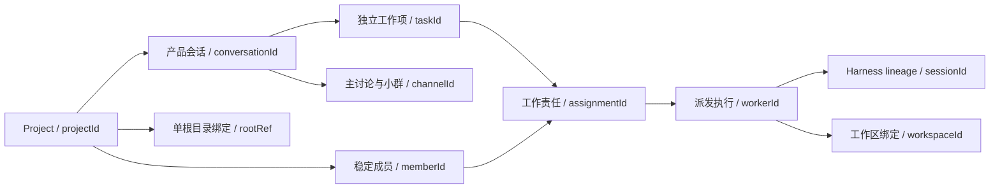

# 11.1 基础身份与跨批次契约审阅快照（已接受）

日期：2026-09-14。类型：design。来源：项目蓝图 §21 D18、§22.4.1、§22.4.3、§22.5.1；详细设计 §12.1；系统架构 §10；开发计划 §18.2、§18.3、§18.11。

**审阅接受记录：** Leader于2026-09-14回复“确认”，接受本稿方案。正式产品决策已落入蓝图§21 D18，完整技术契约见[详细设计§12.1](../详细设计方案.md#identity-contract-111)，执行证据见[11.1历史](../task-history/11.1.md)。以下§1–§9固定保存接受前的审阅内容，其中“建议”“待确认”等是当时措辞，不表示当前仍待批准；本快照不滚动维护，后续以正式来源为准。任务当前状态只查`docs/task-status.json`。

## 1. 需要确认的设计结论

1. **工作项保留 `taskId`，产品会话新增 `conversationId`。** 一个项目一个根目录；一个会话可先咨询并先后承接多个独立工作项。工作项仍使用一份 `AppState`，不另建重复的 WorkItem 状态机，也不把 Harness session 暴露为产品会话。
2. **责任用 `assignmentId`，一次派发执行沿用 `workerId`。** 稳定 `memberId` 只属于项目成员；角色模板和显示名称不作成员主键。执行实例的规范 ID 就是 `workerId`，不另存等值 `executionId`。一次执行可跨 D4 暂停/真 Fork，关联多个 Harness session；终态后重新派发创建新 worker，仍可履行原 assignment。
3. **项目控制事实采用一个有版本的协作聚合。** 成员、会话/Channel 注册、工作项归属、主工作位置及成员责任认领同一 revision CAS；任务内容仍归 TaskStateStore，执行额度仍归 GlobalScheduler，文件仍归受控 workspace。跨聚合通过持久操作阶段和规范回执收敛，不宣称多个 JSON 文件天然原子。
4. **现有公开接口保留，新语义明确走新版本能力。** Executor 和 TaskStateStore 的调用形态可复用；单项目 main、role 身份的 Channel/roster 契约不能假装兼容完整多会话/同岗位多成员，需新增版本化协作端口。SandboxManager 本机语义由 12.2 定稿，11.1 不批准宿主执行。

这四项是一组推荐方案。主要取舍是新增版本化协作聚合，而非分别维护会话、成员和占用三个可独立漂移的注册表。它增加项目级 CAS 的负载；单实例和当前产品规模下，只把低频控制事实放入聚合，模型 Step、消息正文、文件内容和工具日志不进入它，避免每个 token/Step 重写项目快照。

## 2. 已确认约束与现有实现证据

控制原文：

> 设计需区分 Project、产品会话、独立工作项、稳定项目成员、assignment、一次 execution、工作区及 Harness session。

> 对冻结接口的变更建议须明确列出并先确认；未受影响的旧路径继续回归。

> 产品会话与底层 Harness session 分属不同概念：一个产品会话可能关联多个成员及其执行历史，不应直接暴露底层 session 作为用户组织工作的唯一单位。

| 现有证据 | 当前真实含义 | 设计影响 |
| --- | --- | --- |
| [AppState / WorkerState / RosterEntry](../../packages/core/domain/src/state.ts) | AppState 按 projectId/taskId 分区；WorkerState 有 role、subtaskId、worktree、sessionId；RosterEntry 的身份经 spec.role 表示 | 不另造工作项 State；稳定成员不能由 role 或 sessionId 代替 |
| [Assignment](../../packages/core/orchestration/src/coordinator.ts)、[startWave](../../packages/core/orchestration/src/parallel-coordinator.ts) | 当前 Assignment 是 `{workerId, role, subtaskId?}`，`worker:${message.msgId}:${index}` 绑定一次 dispatch；同角色能有多个 worker | 当前类型是执行派发描述，不是跨会话长期责任记录；本文称其为“派发描述”，不直接改现有类型名 |
| [Channel 验证](../../packages/core/domain/src/channel.ts) | 项目内 Channel ID 唯一，恰一个 `main`，main 无 taskId；participants 为 leader/role | 每会话 main 与同岗位多人都需要显式新契约，不能只往旧快照加数组 |
| [协作端口](../../packages/comm/channels/src/base.ts) | roster+channels 在同一 revision 下提交；ProjectChannelStore 是旧 Channel 视图 | 延续唯一协作所有权，旧视图不能将多个会话/成员有损压成一个 main/role |
| [TaskStateStore](../../packages/runtime/state/src/base.ts)、[WorkerRuntime](../../packages/core/orchestration/src/worker-runtime.ts) | 任务 mutation 持久提交；WorkerRuntime 管理 worker 分区和 canonical join | 新关系通过受信控制面提交；模型不能伪造绑定、成员占用或恢复回执 |
| [GlobalScheduler](../../packages/core/orchestration/src/global-scheduler.ts) | 进程内 `{projectId,taskId,workerId}` lease，默认全局 3；对象 capability 验真 | 成员责任、进程额度和 composition admission 是三件事；持久 leaseId 字符串不恢复执行权 |
| [sandbox 端口](../../packages/runtime/sandbox/src/sandbox-manager.ts)、[companion](../../packages/runtime/sandbox/src/recoverable-sandbox-manager.ts) | 六个冻结方法，suspend/resume 与终态 teardown 分开 | 路径字符串不是权限；不以改名 Worktree 为普通目录绕过现行保护 |
| [Web 组合根](../../apps/web/src/server/task-runtime.ts) | 统一 scheduler；需求解释也取得 `leader-input:<sourceMsgId>` lease | 辅助模型活动需要真实用途身份；不能伪装新成员或逃避执行额度 |

已交付 D4/D6/D12/D13/D16/D17 的来源分别按详细设计 §1、§3、§5、§6、§8 定义。未来产品规则按 D18 分阶段适用。旧文档里的 Project 全量示意不是所有字段已实现的证明；不为 repos/KB/cost 等未来字段填假数据。

## 3. 身份关系、键与基数



图表示关联，不表示每项创建时必须执行、必须创建文件或持有 lease。

本表描述完整目标模型。Phase11–13的新桌面版本仍允许明确标记的task-only执行模型，只保存projectId/taskId/workerId及必要workspace/Harness绑定，不虚构conversationId或memberId；它不宣称已支持产品会话/稳定成员。Phase14启用会话模型后，新工作项必须有唯一会话归属；已有新桌面task-only记录按14.1和11.2升级协议显式处理，未转换记录不能混入会话队列。Phase15之后新成员执行必须引用真实memberId，旧roleSlot历史不事后猜作者。

| 对象 | 规范身份与范围 | 基数与不变量 |
| --- | --- | --- |
| Project | 安全不透明 `projectId`；安装状态空间内唯一 | 恰一个用户根目录绑定，可是普通目录或 Git/monorepo；安装目录/状态目录不属于用户根 |
| 产品会话 | `{projectId, conversationId}` | 属于且永远回指一个项目；0..N 工作项；创建时有一个主讨论，0..N 小群；尚无工作项时也可交流 |
| 独立工作项 | `{projectId, taskId}`，业务用语 WorkItem | 恰属于一个产品会话；一份 AppState；0..N Subtask/assignment/worker。需求修改沿用 taskId，独立新工作取得新 taskId |
| 成员 | `{projectId, memberId}` | 属于一个项目；岗位模板、名称、配置版本可变而成员 ID 不变；复制得到新 ID，不复制责任和历史 |
| RoleSpec | 现有 role 标识及后续配置版本引用 | 描述职责/模型/工具/投影；不充当具名成员唯一身份；一个岗位可供多个成员使用 |
| 工作责任 | `{projectId, assignmentId}` | 固定目标 taskId、成员和责任范围版本；一个工作项可分配多人。转给另一成员时新建 assignment，以交接回执连接前后记录，不覆盖历史 owner |
| 执行实例 | `{projectId, taskId, workerId}` | 一次规范 dispatch 的执行尝试；一个主要 assignment 可先后产生多次执行，一个执行不跨任务或偷偷换成员；workerId 不因进程重建变化 |
| Subtask | `{projectId,taskId,subtaskId}` | 任务 DAG 节点；同一节点可先后由 CODER、TESTER、REVIEWER 执行；ownerRole 不是其他角色的执行排他门禁 |
| Workspace | `{projectId,workspaceId}` 与不可变 task 归属/用途绑定 | 0..N 执行可先后使用；同一文件写入域的并发访问须受保护。集成/验证工作区可独立存在，无须伪造编码成员 |
| Harness session | `{projectId,taskId,sessionId}` | 官方 JSONL 所有者；同一执行通过 D4 可关联一条 lineage；不同 worker 不共享可执行 Context；产品 conversationId 不参与伪造官方 session 格式 |

ID 不含名称、路径或角色语义；同一项目内各类 ID 分开命名空间，所有引用携带上表作用域。新持久对象 ID 建议使用现有安全 scope 字符集 `[A-Za-z0-9][A-Za-z0-9._-]{0,127}` 并排除 `.`/`..`；由受信控制面生成并检验碰撞，不从显示文本生成。当前含冒号的 workerId/msgId 和官方 sessionId 保持各自既有校验，作为逻辑 ID 通过受信编码映射到目录，不能直接拼接路径。Project 身份不随目录改名改变；根移动/重绑需重新确认并核验，不因路径字符串相同就复用权限。

同一个目录或 Git common-dir 通过不同路径/项目打开时，不能获得两套独立写权限。12.2 必须按规范文件身份协调同一写入域；在无法证明隔离时拒绝并发写，并指向已有项目或等待处理。11.1 固定这一安全不变量，不在此选择 OS 强制机制或批准自动合并项目。

## 4. 唯一所有权与最小数据契约

以下是目标模型的最小关系合同，非当前生产类型声明；具体完整 schema/序列化版本在对应任务扩充。任何扩充不能改写这里确认后的归属、主键或权威关系。

| 唯一持久所有者 | 保存的权威事实 | 不保存的重复事实 | 可写入口 |
| --- | --- | --- | --- |
| 版本化 ProjectControlSnapshot（协作聚合的后续形态） | 单根项目元数据；会话/Channel 注册；任务到会话归属；主工作指针；成员/岗位关联；assignment 责任及当前成员认领；跨聚合操作阶段 | 不复制 AppState 内容、WorkerState 状态、测试结果、token 日志、凭据、活 lease | 项目控制服务经 revision CAS；请求经权限/当前事实/稳定 actionId 校验 |
| TaskStateStore / AppState | 需求、决策、工作计划、worker 生命周期、执行绑定及其恢复引用、验证/完成/归档事实；与该任务有关的规范控制消息 | 不放成员 roster、会话列表、第二份队列或成员 busy 状态 | 任务串行控制面与受限 WorkerRuntime 经 applyMutations/commit；并行模型只写既有获准 append |
| 会话交流记录（14.1 定稿端口） | 无工作项的咨询/材料讨论及其稳定来源；指向任务规范消息的引用 | 不另存任务审批/需求的权威副本，不将聊天自动变成任务 | 同一用户控制入口；工作变更转任务控制面；展示流按规范来源合成 |
| Workspace 受信注册/文件系统 | 逻辑 workspace 到实际根的验证绑定、模式/用途/生命周期、文件/Git 真实内容 | State 中的 path/HEAD 是核验引用，不是新文件真相；项目聚合不存完整代码 | runtime/sandbox 内端口及受信 companion；12.2 定稿执行授权 |
| Harness 官方 persistence | session 元数据、事件、parent/seed lineage | 不复制事件到 State/Channel；执行绑定只保存必要索引引用 | HarnessExecutor/官方插件，D4 flush 与 factory seed |
| GlobalScheduler / 运行注册表 | 当前进程活 lease capability / composition admission | 持久责任认领不等于持有执行额度；历史 lease 信息不等于恢复令牌 | 全实例 scheduler 和生命周期组合根；后续16.1扩充额度算法 |
| 配置/凭据存储 | 模型配置版本与安全存储中的秘密 | Project/assignment/执行记录只持不可变配置引用，不持明文 key | 既有模型配置服务与11.2/12.6后续适配 |

最小关系字段（均为建议字段；`Ref` 表示经过作用域复核的引用，不是凭证）：

```ts
interface WorkItemRegistration {
  taskId: string;
  conversationId: string;
  creationActionId: string;
}

interface WorkResponsibility {
  assignmentId: string;
  taskId: string;
  memberId: string;
  scope: { subtaskIds: readonly string[]; purpose: 'primary' | 'response' };
  scopeRevision: number;
  createdByActionId: string;
  predecessorAssignmentId?: string;
}

interface ExecutionBinding {
  workerId: string;
  taskId: string;
  dispatchId: string;
  actor:
    | { kind: 'member'; memberId: string; assignmentId: string }
    | { kind: 'roleSlot'; role: string };
  scopeRevision: number;
  modelBindingRef: string;
  workspaceId?: string;
}
```

记录所属聚合提供 projectId，跨边界引用必须补足它并交叉校验。WorkItemRegistration 不保存 goal、phase 或完成状态；ExecutionBinding 不保存第二份 running/paused 状态，其生命周期取规范 WorkerState/恢复事实。字段变更须经受信 mutation，禁止由普通 worker 输出 `ExecutionBinding`。派发的不可变身份、目标、责任版本与配置不能以“merge 更新”重写。

`roleSlot` 只标识 Phase 11–14 仍按既有岗位执行的能力，不构造伪 memberId 或工作责任。Phase15 实装稳定成员后，新的成员执行必须为 `member`；能力版本不允许的 actor 直接拒绝。

辅助模型调用与WorkerRuntime执行分开识别：当前需求解释有自己的scope/sourceMsgId、官方session及scheduler逻辑key，未登记WorkerState；不能为统一报表伪造一位成员或一条worker生命周期。后续辅助调用记录至少关联projectId、目标taskId（无工作项的咨询由14.1提供conversation来源）、受信purpose、sourceRef及官方session引用；此类记录不属于ExecutionBinding。它们仍取得真实调用额度/预算，不能持成员写权限或编码workspace；把成员实际工作改标为辅助用途属非法身份。新增辅助用途及无task的额度入口由相应设计任务定稿，不在本稿启用。

`scope.subtaskIds=[]` 只允许经控制面明确批准的整工作项职责（例如最终审阅），不是任意任务/文件访问权。非空时每一 Subtask 必须属于该 task 并通过派发条件校验。response 责任只供16.1/17.1定稿后启用；它不替换主要责任，也不允许同一成员同时执行两件工作。

ProjectControlSnapshot 包含一个且仅一个协作原子域；成员加入/离职与相关 Channel 参与资格同时 CAS。任务的执行绑定可带 assignmentId/成员 ID 作为不可变历史引用，但不能据此更新 roster。主工作指针表示谁有资格推进，任务 phase 表示该工作进展，二者不是两份完成状态。UI busy/等待原因由当前责任、合法活执行及 lease/门禁事实派生，不写独立 UI 状态作为调度依据。

成员责任的可变控制状态与上述不可变WorkResponsibility内容分开但归同一项目聚合；至少区分认领已准备、责任已接受、等待/交接中、已释放，并保留原action与闭合回执。状态不从WorkerState.status反推：worker done只代表一次执行完成，assignment是否结清由任务串行控制面核验责任产出后显式闭合。主要责任释放必须同时撤销其新增执行资格；旧worker仍未证明静止时不得把成员标成可认领。

## 5. 生命周期、控制入口与故障闭合

### 5.1 工作项创建、选择与完成

建议新增项目控制操作协议，所有操作携带 `{projectId, actionId, expectedRevision, payload}`；同 actionId 同规范输入返回原回执，异输入返回冲突。业务输入指纹排除传输重试元数据，但包含目标及授权范围。重试先找原 operation，再校验其持久阶段，不因原 expectedRevision 过期而生成另一条工作。客户端 ID 不直接授予执行权。

创建工作项：

1. 项目 CAS 记录 `prepared` 操作，保留目标 conversationId、唯一 taskId、规范输入/来源引用；该记录只是创建意图，不是可运行任务。
2. TaskStateStore.initialize 在该 scope 创建 AppState；若已存在，只允许完整验证其 creationActionId/初始目标绑定后复用。重复请求目标不同为冲突，不覆盖已有 State。
3. 项目 CAS 写入 WorkItemRegistration 并将操作闭合为 `committed`。启动必须同时验证该关联和规范 State。未闭合的创建可显示“正在创建/需处理”，不得启动 worker。
4. 只有已关联的任务可竞争本会话主工作位置；一次 CAS 选择一个非终态候选。队列次序由14.1定稿；本稿不额外批准自动开始独立需求。每次启动重新检查位置和任务事实，不能依据 stale UI。

prepared操作中为续办保存的初始请求是不可变幂等输入，不是另一份可编辑goal/requirement；工作创建后当前需求只以TaskState为准。责任scopeRevision只描述批准的职责范围版本，不充当当前需求指纹；非阻塞reproject可更新当前需求投影而不改变原职责范围，改变范围需控制面重新授权并处理既有执行。

崩溃在1后：从原意图继续初始化；在2后：核对原 State 后补关联；在3后：只复用既有工作。不能证明原输入、引用损坏或发现孤儿 State 时不自动认领/删除，保持 needs_attention。项目 CAS 冲突重读并重新验证条件；不重放已执行工具来修复控制记录。

工作项内部测试/审阅不改变 conversationId/taskId。D16 Leader approve 与最终规范产物闭合后，项目控制服务才释放主工作位置；在任务终态提交后崩溃，可以根据同一终态/归档回执幂等释放。gate 等待或工具暂时空闲不等于主工作完成，不允许后排独立需求抢占它。取消流程需先安全点收敛，14.1定稿具体状态及用户操作；引用保留策略由18.1/18.4细化。阶段11不实现这些产品控制操作。

### 5.2 成员责任、派发与离职

15.1/15.2 必须在项目协作原子域认领责任，并在同一 CAS 中检验成员 enabled、目标有效、依赖、当前主要责任及未闭合控制操作。已接受的主要责任每成员最多一份；未接受提议/队列候选不算认领。单次派发前，任务控制面登记不可变 ExecutionBinding 和规范 WorkerState；启动再复核 assignment 及其版本，而非缓存 RoleSpec。

责任认领已提交但任务派发未提交：该成员仍被认领，只能续办原操作或经受控取消释放，不能被另一会话再次认领。派发已提交而模型未调用：pending 的同 worker 可继续取 lease；取消 acquire 不伪造 done。无法证明是否已调用时，核验 session/安全点/副作用事实，不能当作未运行自动重放。

责任改变使用 drain 屏障：先把对应认领置为不可新增执行的转换状态，再等待当前 Step 完整结束及任务持久提交，最后闭合换人/交还。Step 开始检查与控制请求经同一项目成员执行入口串行；检查通过后到来的变更只可等待当前已准入 Step，不能追溯否决后硬杀 token 流。运行注册丢失时按不可证明已收敛处理，不仅凭 Project busy 字段解除屏障。

暂停/等待答复可释放 lease，主要责任保留；成员恢复不能因有责任记录就直接执行。离职按 D12/D13 的收敛和交接原则演进，目标成员变更产生新的 assignment 与 predecessor 引用；原成员/原 worker/原产物的作者归属保留。没有接任者时明确 awaiting_replacement，不抹去责任。具体状态字面量和请求 API 在15.1固定，但上述原子域与历史规则由11.1固定。

### 5.3 执行、Harness session 与恢复

| 情形 | 责任 / worker 身份 | Harness 与资源 |
| --- | --- | --- |
| 同 dispatch 幂等重试，尚未真正启动 | 复用 assignment 和 worker | 不重复建立并行 Context；先核验规范状态 |
| 非阻塞需求 reproject | 原 assignment/worker，更新有效控制投影；不扩大原写范围 | 当前 Context/session/lease/admission 延续，按D17安全点协议 |
| humanGate suspend → Leader resolve → resume | 同 assignment/worker；历史运行绑定不改成另一成员 | 必须完整 checkpoint/receipt；新 Context、官方 lineage child、新 lease；原 worktree 校验后复用 |
| 一次执行 done/failed 后合法返工 | 原责任可继续，新 dispatch/new worker；旧终态不重开 | 新执行绑定；不得重置既有预算/迭代限制，产物基线按D17可信引用 |
| 安全点短回应其他工作（后续能力） | 主要责任保留，独立 response assignment/worker 引用目标工作 | 不借用原任务 lease/session/workspace；串行切换，回答后核验原工作再恢复 |
| 复制成员或离职接手 | 新 member/assignment；原责任通过受控交接结清 | 不复制他人的活 Context、lease 或身份；提供结构化交接投影 |

每次真正重建的运行激活使用稳定恢复动作标识（例如 canonical resolution receipt + workerId）去重；它表示同执行的一次激活，不引入可绕过 worker 配额的顶层身份。执行到 Harness 的绑定为不可变引用链：初始 session；每次恢复的 sourceRef/childSessionId/触发回执。重放必须核对官方 child header、完整 seed 前缀、cwd、模型配置引用和 task/worker；不能只看 session 文件存在。WorkerState.sessionId 是当前关联的兼容字段，必须与规范恢复事实一致，不独立成为 lineage 来源。

只有模型 Step/工具自然结束、commit+flush/checkpoint 闭合后才可以释放/切换。成员认领不等于 lease，lease 不等于 composition admission。恢复从安全事实重新排队；保存的 leaseId 只可审计，绝不重新装入 scheduler 当成 capability。身份恢复不改变迭代计数、provider retry 预算或D16终审资格。异常/副作用不明时只开放审查、清理或用户授权的恢复路径；正常退出由13.2定稿，多成员异常恢复由19.2定稿。

### 5.4 Channel、消息与权限

新 Channel 主键建议为不透明 channelId，显式带 conversationId，`kind='main'|'sub'`；每个产品会话恰一个 main。参与者在稳定成员阶段使用 leader/memberId，而不是岗位名称。旧 `threadId` 继续表示问答链/具体关联，不冒充 conversationId。Phase14的角色执行使用明确的 roleSlot 参与者版本，Phase15升级为成员参与者；映射和新桌面状态升级需真实验证，不猜历史发言属于哪一位同岗位成员。

新版本项目聚合创建会话时原子创建其 main，所有群 Leader 恒在。成员邀请只改变参与资格，不复制成员或授予执行资格。历史消息保留当时作者身份/责任引用；当前是否可发言/取上下文按最新 roster、Channel、assignment 和权限重新判断。TaskState.messages 中的任务控制事实只存一次；会话主讨论将这些规范引用与纯咨询记录合成展示，不能将任务审批结果再复制一份作为会话控制事实。

工作变更仍统一经过用户消息控制入口，先验证 conversationId/channelId/taskId 归属、目标事实版本和授权，再走 D9 安全点与 commit。普通咨询不自动变成需求。私聊确认的完整多源控制协议由17.1/17.5实现；11.1不启用旁路。MessageBus 仅投递已持久化来源，SSE/DTO不透传 payload；原始会话日志不进入 Harness 历史，投影只取结构化、经引用核验的当前事实。

## 6. Workspace、版本与证据引用

Project root 是用户代码入口；workspace 是经授权的具体操作能力。安装目录（受信二进制）、状态目录（控制记录/官方session/证据）、用户根和隔离目录分离身份与权限。运行模型时不能因为 projectId 正确就读完整状态目录。

Workspace 最小绑定需要 projectId、taskId、workspaceId、用途（coding/validation/integration）、模式（direct/linked-worktree）、受信根引用及创建动作。路径是可核验定位信息；只有受信注册和实际根身份一致才可操作。直编普通目录无 Git commit 时不伪造 WorktreeRef.branch/baseCommit；12.2应提供有类型区别的文件版本证据及端口能力。Git 路径继续核对 common-dir、规范 worktree 列表的唯一 path/branch/HEAD；直接目录不得被当成受验收的 linked worktree。

同一 assignment 的 D4 resume 可复用经验证的 workspace；新的返工 attempt 是否复用/重建由其可信基线和12.2契约决定，不能因为名称相似自动选目录。不同编码工作并行隔离；Tester/Reviewer 不覆盖 Coder 的工作区绑定。验证/集成 workspace 可以关联多个来源执行，但 task 归属不可变，读入的源分支和版本逐项绑定。

证据引用最少包含 projectId/taskId、生产者 workerId（或受信服务用途）、workspaceId、精确版本描述、控制事实指纹及验证/审阅回执身份。成员/assignment、conversation 从规范绑定解析；保存的历史引用可帮助审计，但不能覆盖其当前所有者。Git 版本是实测 HEAD；普通目录版本须能证明实测文件集合/内容和外部修改失效（12.2/13.1定稿），不能把时间戳或“测试绿了”当版本。D16完成、累计验证与交付引用同一有效产物；新改动使旧证明失效，回到必要验证。

释放 lease、销毁 Context、暂停 workspace、终态归档是不同操作。D4不归档；关闭视图不回收文件；显式删除需要展示引用影响。Docker退役不自动删除旧数据/容器/用户代码；新桌面升级也不得借此丢弃自己的持久状态。

## 7. 冻结接口影响与拟议接入

现有签名原文：

```ts
interface Executor {
  step(context: StepContext): Promise<StepResult>;
  saveSafePoint(): Promise<string>;
  loadSafePoint(cursor: string): Promise<void>;
  injectInbox(view: ProjectionView): void;
}

interface TaskStateStore {
  initialize(scope: TaskScope, initial: AppState): Promise<AppState>;
  load(scope: TaskScope): Promise<AppState | undefined>;
  commit(scope: TaskScope, mutations: readonly Mutation[]): Promise<TaskStateCommit>;
}

interface SandboxManager {
  createWorktree(taskId: string, role: string): Promise<Worktree>;
  read(worktree: Worktree, path: string): Promise<string>;
  write(worktree: Worktree, path: string, content: string): Promise<void>;
  run(worktree: Worktree, cmd: string, timeout?: number): Promise<RunResult>;
  integrate(base: string, branches: string[]): Promise<IntegrationResult>;
  teardown(taskId: string): Promise<void>;
}
```

| 接口/类型 | 11.1 推荐处理 | 最晚细化/实装点与验证 |
| --- | --- | --- |
| Executor、SafePointExecutor | 四个方法和安全点 companion 保留；受信工厂注入完整执行绑定，opaque checkpoint保持可核验 | 13.2 /15.1/19.2恢复接缝；不得把memberId挤进sessionId参数 |
| TaskScope / TaskStateStore | 保留 projectId/taskId 和方法签名；AppState/Mutation需增加创建/执行绑定字段，属于显式schema演进 | 本机必要绑定12.2/12.3；会话14.1；成员15.1。全部新字段/mutation写权限、版本校验和索引须在实装前定稿；并非“签名没改所以无需审查” |
| ProjectCollaborationStore / ProjectChannelStore | 旧接口保留且只服务原有shape；新增 ProjectControlStoreV2 承载新版协作原子域。旧视图对无法无损表达的新版本明确拒绝，不聚合多个main或合并同岗位成员 | 14.1/14.3会话版本，15.1/15.2成员版本；逐版本adapter验证，旧Docker任务不建设兼容产品入口 |
| Channel / ParticipantId / RosterEntry / RoleSpec | 新版区分conversation/member/roleSlot及模板；这是类型与语义变更，不能声称现有Channel已支持 | 14.1和15.1；角色/成员鉴权、离职与投影同时改，不能只改UI |
| SandboxManager / RecoverableSandboxManager / Worktree | 维持旧六签名；workspace注册由companion提供；direct目录需要独立类型/能力，禁止虚构Git字段 | 12.2列出精确companion与必要变更，12.3/12.4/12.5实测。11.1不宣称六接口足以表达所有direct语义 |
| GlobalScheduler / SlotLease | workerId继续作执行额度身份；成员责任CAS在lease之前核验；不持久恢复capability | 15.2接成员占用；16.1/16.2两层上限。当前cap=3保留，不能凭本设计改成全局6 |
| MessageBus / MessageCommitted | 当前任务展示事件签名保留；将来新增会话咨询事件应独立带来源类型和scope，不伪造TaskState消息 | 14.1定稿伴随事件/快照尾流协议；17.1跨讨论控制；仍先commit再publish |
| project()/assignment投影、D4 receipt、验证/归档引用 | 显式解析新身份，保留D1/D4/D15/D16/D17校验；无损适配才复用，拒绝以role推断member | 各对应实现任务同步领域/编排/runtime/Web；恢复引用/验证版本迁移必须纳入真实回归 |

拟议新端口的控制形态（完整聚合字段按上述阶段补齐；此处确认原子域、CAS和幂等约束）：

```ts
interface ProjectControlStoreV2 {
  initialize(initial: ProjectControlSnapshot): Promise<ProjectControlSnapshot>;
  load(projectId: string): Promise<ProjectControlSnapshot | undefined>;
  commit(
    projectId: string,
    expectedRevision: number,
    command: ProjectControlCommand,
  ): Promise<ProjectControlCommit>;
}
```

ProjectControlSnapshot 包含 schemaVersion、projectId、revision及§4中的低频控制集合；schemaVersion不支持时明确拒绝。ProjectControlCommand是受信控制面已验证的封闭操作联合（创建/闭合作用域关联、选择/释放主工作、认领/转换责任、成员与参与资格变更），每项带actionId与规范输入；不是任意 JSON patch 或 LLM 直写快照。ProjectControlCommit返回规范snapshot、changed和持久operation receipt。首次定义完整联合由14.1负责，会话之外的成员操作由15.1版本化扩充。11.1不引入该端口生产文件或新包。

范围相同且actionId相同的重放先核对已有receipt；未命中才检验expectedRevision并应用纯领域变更。revision冲突、未知版本、坏引用、异输入重放返回可区分错误且无副作用。已有receipt与当前权威事实矛盾时拒绝“幂等成功”。initialize同projectId只复用经校验的一致初始化身份，不覆盖已有项目。操作回执不因UI通知已读而删除；有界查询/安全保留策略由具体设计任务规定。

L1负责类型、引用规则及纯变更验证；L2负责控制服务、saga与safe-point调度；L3端口仍放既有comm/channels与runtime相关包；L4 JSON适配/受信workspace/Harness组合实现。GUI不持有第二份权威聚合，不直接写宿主或拼接命令。

## 8. 分阶段落地与后续设计输入

| 阶段/任务 | 当前必须固定或落地 | 明确尚未启用 |
| --- | --- | --- |
| 11.1 | 本文八类身份、作用域、原子所有权、映射和接口影响，经确认后形成基础契约 | 全部生产schema/存储/执行能力未因设计产生 |
| 11.2–11.5 | 安装/状态/用户目录概念分离；平台/版本/受管工具链/新桌面状态升级协议按11.2定稿 | 不开放本机编码、Docker模式、多会话或稳定人力；不为未来对象填虚假记录 |
| 12.1–13.4 | 单根项目、本机workspace绑定、当前task/worker/Harness/版本引用与权限保护；当前可执行六角色作为明确roleSlot；13.2安全退出，13.3退役Docker | 新多会话聚合/具名成员/全局6配额/Librarian写入尚未实装 |
| 14.1–14.5 | 实装conversation、WorkItemRegistration、每会话main、主工作队列及咨询来源；项目控制聚合首个所需版本 | 仍按当前岗位执行，不宣称member占用；不得隐式放宽当前全局3额度 |
| 15.1–15.6 | member/assignment/执行绑定、原子认领和离职交接；明确从新桌面roleSlot到member模型的升级 | 不猜旧消息作者；新版本角色槽记录保留其原身份，新增具名执行用新的映射 |
| 16.1–20.6 | 双层lease/短回应、协作请求消费、附件来源、异常恢复、波次/返工；原有工作/成员身份连续 | 不以短回应复制成员，不启用preparation；真实副作用恢复须专门验证 |
| 21–24 | KB/技能/MCP绑定项目、成员和配置版本；工作证据引用稳定，复制成员不复制活责任 | 按D3及对应阶段门禁启用知识写入；跨项目复用必须显式 |
| 25–30 | 工作地图、来源追溯、实验/撤回/增量集成/办公室/插件引用同一套身份 | 展示节点不新增调度实体；实验必须有独立已批准工作范围和资源归属 |

新桌面旧版升级是需要保留的数据契约，与“不兼容旧Docker产品任务”严格分开。11.2定义持久格式/升级失败协议；14.1、15.1提供其版本转换、角色槽保留和活动工作处理。无法无损转换的活动工作必须先按正式退出/终态流程收敛或明确阻止升级，不能丢弃或自动重跑。具体操作策略由11.2和相关任务确认，11.1固定不得破坏已有新桌面身份/证据的约束。

## 9. 验证矩阵与本任务验收

以下是必须交给实现任务执行的真实案例，不是已运行的测试结果。

| ID | 场景与预期 | 主要后续任务 |
| --- | --- | --- |
| I01 | 两项目使用相同局部ID，跨项目引用/读写/恢复被拒绝；路径别名不能绕过同根写入保护 | 12.3、12.5、14.2 |
| I02 | 无工作项会话可咨询；连续完成两项工作，conversation保持、task不同、历史不混；不创建无意义编码worker | 14.3、14.4 |
| I03 | 并发争抢同会话主工作仅一个成功；gate等待不释放主工作，终态后补写项目回执不重复推进 | 14.3、14.5 |
| I04 | 同岗位两成员可分别认领；同一成员同时跨会话认领只一份主责任，邀请/复制不能增加其执行实例 | 15.2、15.3 |
| I05 | 在每个项目CAS/TaskState提交间中断并重启，原action只创建一个task/assignment/worker；坏输入和孤儿记录不启动执行 | 14.3、15.2、19.3 |
| I06 | D4暂停时State/flush/receipt任一失败不开放恢复；成功恢复同worker/新官方child/新lease；错成员或跨task引用拒绝 | 13.2、15.2、19.3 |
| I07 | done/failed worker不得重开；合法返工新dispatch保留旧责任/作者，迭代和provider预算不重置 | 13.4、20.4 |
| I08 | 满载时等待成员释放额度，短回应串行切换；保留主责任，回答后核验原工作，不借用跨task lease | 16.2、17.3 |
| I09 | 离职和下一Step同时竞争，只有已准入Step可自然闭合；缺接任者等待，交接后旧成员无法继续普通写入 | 15.5、15.6 |
| I10 | 多会话各一main；同岗位成员鉴权独立；旧视图不能无损表达时明确错误；重复消息/重连不重复控制动作 | 14.3、15.2、17.5 |
| I11 | 普通目录无Git也有真实文件版本证据；外部修改令旧测试失效；Tester独立workspace，最终产物和D16批准精确绑定 | 12.4、12.5、13.1 |
| I12 | schema升级成功保留新桌面配置/身份/历史；失败保留可恢复原状态；旧Docker数据不导入也不自动删除 | 11.2、各阶段出口、13.3、14.5、15.6 |
| I13 | 需求解释等辅助模型调用计入实际额度；禁止辅助用途冒充member写代码/修改责任，也不伪造WorkerState，投影与Trace无原始聊天/工具正文泄漏 | 12.6、16.5、17.4 |
| I14 | 并发提交和恢复后workspace/验证/审阅/归档引用仍指同一累计产物；路径和相似显示名不能选错产物 | 12.4、13.1、20.6 |

11.1设计验收对照：八类身份和基数见§3；所有权与最小关系字段见§4；控制入口、幂等、权限和故障恢复见§5；文件与证据见§6；冻结接口逐项影响见§7；第一批适配和所有后续批次输入见§8；可观察错误和真实验证案例见§5/§7/本节。没有该任务强制要求的打包/协议Spike；Electron真实Spike属于11.2，本机保护实测属于12.2之后的任务，不能在11.1报告为通过。

本稿核对使用只读代码/规格证据、索引校验及Markdown来源链接检查。纯设计不运行或声称产品G3/G4/G5；如后续请求提交，仍按agora-commit执行AGENTS.md §3.1.3的完整提交门禁。Leader确认本稿并完成正式来源同步后，11.1才可按非代码规则记done；未获确认时保持in_progress。
