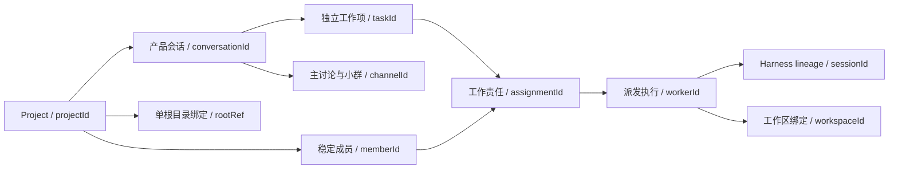

## 多 Agent 代码协作系统 · 详细设计方案

**[2026-09-13 架构决策更新 · D18 适用范围]** Phase 0–10 的记录保留为阶段基线；第一批（Phase 11–13）已决定移除 Agora Docker 后端且不兼容旧产品任务，旧 Docker 约束仅适用于退役前实现；后续已确认产品规则以《项目蓝图》§22 为准，交付与待决任务见《开发计划安排》§18。目标能力按所属任务定稿并验收后启用，不把未来规则伪装成现有能力，也不因局部问题未决阻止无关设计任务。正文中带日期的执行、待合并和阶段状态补记保留当时证据，不替代task-status.json的当前状态；已有阶段实现约束在适用阶段继续有效。正文已有阶段规则不是对未来演进的永久否决；新路径的接口与安全边界未定稿前不得绕过旧实现。


**[2026-09-12 T10.6 Go 推理回放兼容修复]** opencode.ai 的 deepseek-v4-flash/pro 自定义路由启用锁定 PiAi/Harness 原生 reasoningEfforts 与 requiresReasoningContentOnAssistantMessages：非空推理原样回放，无推理的 assistant 消息由原生序列化补空 reasoning_content。thinkingFormat=deepseek；不提供 off 映射，不显式关闭思考，保留提供方默认模式及1M/384K容量。其他提供方/模型不变，不改上游依赖或自研循环。原始推理不进入群聊/Trace。此为协议兼容补齐；录制2原HTTP400未能以合成对照复现，不宣称该次失败根因已确认。验证及限制见 https://github.com/logan-suu/Agora/blob/83fe416c1015d86616acdead7af2ebbad82e8384/docs/demo/task106-english-recording-evidence.md。

> **当前版本 v3.12 / 2026-09-13：** D18 后续规划正式落位，第一批（Phase 11–13）确定本机单一路径与 Docker 退役，不兼容旧产品任务；具体范围见新增后续章节。**此前 v3.11 / 2026-09-08：** 对齐蓝图 v1.10，新增 §6.1 的 10.2 韧性与最小 retry DTO 规格；纠正上版计划的跨 turn 重试假设；10.2 本地实现与验收证据已留档，待 PR 合并。**此前 v3.10：** 对齐蓝图 v1.9/D2，统一 Harness 执行路线并撤销外部简报/投影例外；旧 external 类型仅为兼容表示，本轮未改源码。**此前 v3.9：** 上游对齐蓝图 v1.8，补齐 canonical Git worktree path/branch/HEAD 精确成员证明、主工作区拒绝、不可变 artifact receipt 重试与 locale 无关稳定排序；既有 Integration 前缀状态机、单步丢失回执、补偿清理与当前波次投影规则保持。下方单行版本串仅保留历史沿革，凡与当前标记规格冲突均以本文后续最新的 `[日期 架构决策更新]` 为准。

版本 v3.3（详细设计，不含最终实现代码，但含精确接口/schema/伪代码）· 日期 2026-09-03 上游文档：《多 Agent 代码协作系统 · 项目蓝图 v1.2》。本文把蓝图的设计决策落成可直接照着写代码的精确规格。 语言/框架基线：**纯 TypeScript（Node 20+）**、**DeepSeek Harness**（薄 agent 内循环）、**自研轻量编排与并发层**、**MCP（TS SDK）**（工具层）、**Docker（dockerode）+ git worktree（simple-git）**（执行隔离）、**Next.js/React**（群聊前端，与后端同栈）。 v3.3 相对 v3.2 的变化：D9/D12 补齐 Phase 7 离职协议，新增持久 departure 阶段、目标角色 drain、确定性交接、孤儿责任阻断与跨存储 saga 恢复边界；完整抢占仍留 Phase 9。v3.2 相对 v3.1 的变化：D12 将项目 roster 与 Channel 收敛为同一 `ProjectCollaborationSnapshot`，拆分 `RoleSpec` 与 `RosterEntry` 生命周期，移除任务 State 的 roster 双重所有权，并锁定 Phase 7 动态角色与历史 Channel 的合法性边界。 v2.3 相对 v2.2 的变化（新增顶层项目/多租户层）：加入 `Project` **顶层容器**（`AppState` 降为任务级 + `projectId` 回指，项目内允许多任务、初期退化单任务）；**独立世界隔离 +** `GlobalScheduler` **全局并行配额（默认上限 3、每项目保底 1）与成本核算**；**两层项目知识库** `KnowledgeBase`**（精炼层注入投影 + 归档层 RAG），由 Librarian 职责在任务收尾自动蒸馏回灌**；**跨项目默认隔离、复用走受控导入** `ImportRecord`；**leader 收件箱混合口径**（队列归项目、`GlobalInbox` 汇总归全局、仅 blocking 上全局、[2026-08-23 架构决策更新]进 humanGate 时终止 Harness 进程、裁决后按安全点重 Fork（终止并分叉，见第 8 节））。新增第 8 节，原阶段 0/校验顺延为第 9/10 节（详见第 8 节）。 v2.2 相对 v2.1 的变化（更深地复用 Harness 现成能力）：worker 的**构建与作用域**改为复用 Harness 的 `ctx.subagents`（spawn-in-process：`inheritsParentContext=false` + `toolFilter/persona/outputSchema/depthLimit` 正好映射 RoleSpec）——`[2026-08-26 实测校准]` 真实 API 无 `runStep`，阶段 0 改经 `ctx.agents.create()` 事件驱动（`followup`→`whenIdle`）实现，`ctx.subagents` 留作阶段 9+ 真并行构建/作用域；**文件隔离仍靠 Docker+worktree**（subagent 只做进程内上下文隔离，补充而非替代 sandbox）；**单 agent 历史压缩改为委托 Harness** `ctx.compaction`（`CompactionEngine`，`agent/pre-step` 按 `ctx.tokenMeter` 阈值自动触发），自研摘要只保留给**跨 agent 投影切片**（详见第 0、6、7 节）。 v2.1 相对 v2.0 的变化：通信收敛为**单一 Channel 原语**（群聊=参与者集合，leader 恒为成员），取代原先的 `broadcast/direct/subgroup` 三类通道枚举；`Message.channel+convId` 改为 `channelId`，`Conversation` 合并为 `Channel`，`AppState.conversations` 当时改为 `channels`（该双重所有权已由 v2.4/D7 撤销），投影改为按 channel 成员资格切片（详见第 1、5、7 节）。 v2.0 相对 v1.0 的最大变化：技术栈从 Python/LangGraph 切为纯 TS + Harness + 自研轻编排。State 从 TypedDict 改为 TS interface；编排从 LangGraph 图改为在 Harness 事件流之上自研轻编排；抢占从 asyncio 事件改为 Harness 的 inbox steering + turn-stopping + 安全点。 阅读顺序：先看第 0 节工程结构与 Harness 集成约定，再按 State → 角色 → 编排 → 并发/抢占 → 通信 → 执行器/工具 → 投影 逐节展开。所有接口均为「按落地阶段先退化实现、后续阶段只替换实现体」。

> **[2026-09-03 架构决策更新] D4 恢复协议复评：** 将原 `GlobalScheduler.terminateAndFork(): void` 拆为跨 Leader 等待的持久 `suspend → resolve → resume` 生命周期；明确 Harness 当前为进程内 context，safePoint 必须指向已 flush 的项目/任务级 session 与已完成 turn boundary，全新 context 内必须真正 load + fork。gate 生产者只给瞬态请求，完整 gate 在 checkpoint 落盘后一次提交；裁决消息以 resolution receipt 复制 refs，确保清 gate 后仍可重启续办。Phase 8 只落回合制单任务与本地容量释放，Phase 9 再接 GlobalScheduler/多 worker 抢占。AutoGen `TerminationCondition` 仅由现有 `iterationCount` + humanGate 确定性路由具体化，8.1 不新建重复的隐藏状态框架。本条与后续 §1/§5/§6/§8 的 D4 定义优先于页首版本沿革中的旧描述。
>
> **[2026-09-03 架构决策更新] 宿主运行时校准：** Phase 8 锁定的官方 JSONL persistence plugin 在入口直接依赖 Node 原生 Zstandard API，Node 22.14/20 无法加载，Node 24.19 实测通过。因此页首沿革中的 Node 20+ 被宿主 Node 24+ 取代；Docker 用户代码沙箱继续固定 `node:20-slim`，两者职责不混用。
>
> **[2026-08-31 架构决策更新] v2.4 通信所有权校准：** D6 将消息事实提交与实时投递分离，新增 TaskStateStore / MessageCommitted / 展示信封精确接口；D7 规定 `Project.channels` 为 Channel 注册表唯一真相源，撤销上方 v2.1 曾把 Channel 复制进 `AppState.channels` 的历史口径。Phase 5 固定 main + JSON 快照，Phase 6 动态 Channel/participants；本文后续 §1/§5/§7/§8 的更新定义优先于版本沿革中的旧描述。
>
> **[2026-09-01 架构决策更新] v2.5 Channel 恢复与路由校准：** D7 新增 `ProjectChannelStore` 原子 JSON 快照、sub `taskId` 绑定、`{taskId,msgId}` 局部引用、提交前 Channel 策略与可重建 inbox；MessageBus 不存 inbox。D8 的外部耐久存储前提同步扩展为 TaskStateStore + ProjectChannelStore。
>
> **[2026-09-01 架构决策更新] v2.6 PR 复评校准：** D7 增加 Phase 5 持久任务缺失 `channels.json` 时的 main backfill、roster 保留身份约束与对象属性顺序无关的 no-op 语义；D9 收紧为 planned message 服务只提交一个主消息，动作 mutations 禁止追加 `messages`。损坏 Channel 快照继续 fail-fast，完整账号认证仍不进入 Phase 6 范围。
>
> **[2026-09-01 架构决策更新] v2.8 Sub 生命周期复评：** participants 改为集合标准化；sub 增 `threadId/topic/createdBy`；定稿可信 actor、稳定 actionId、同 thread 去重、权限关闭、project/task 串行与 Channel-first/D6-message-second 可重试 saga。channelId 改用长度前缀消除拼接碰撞；agent open 允许显式稳定 threadId；生命周期公告按 Channel 实例去重；控制块审计 Message 保留且纯控制回复生成非空 display。6.2 只关闭并公告，6.3 才冒泡摘要，Phase 8 才处理 humanGate/resume。
>
> **[2026-09-01 架构决策更新] v2.9 6.3 上下文与冒泡复评：** 删除持久 `Channel.localContext` 与摘要字符串副本；`ChannelContextBuilder` 从 Channel 快照 + 任务消息按 participant/task 派生结构化、限额、无 display 的角色切片。closed sub 通过既有薄 Harness 生成结构化 `channel_summary` main 消息，Channel 只保存 `bubbledSummaryRef`；稳定 msgId、D6 first-write-stays 与 revision CAS 组成可恢复的 message-first/ref-second saga。本文的当前有效版本以本条 v2.9 更新为准。
>
> **[2026-09-01 架构决策更新] v3.0 PR #50 有界上下文与摘要复评：** ChannelContext 的动态消息内容改为 `{entries,omittedRefs,omittedRefCount}` 共用 4000 字符预算，禁止引用列表无界回涨；摘要改为完整 entry/结构化 fragment 输入、chunk-local 来源校验、有界中间输出与预算内多轮归并；`ChannelSummaryGenerator` 定位为 L3 端口，空摘要归 pure domain；decision 不再重复来源集合，唯一来源列表保留在摘要顶层。reconcile 返回前重新加载规范 State，异步 ChannelContext 构建后复查 pause。本文当前有效版本以本条 v3.0 更新为准。
>
> **[2026-09-02 架构决策更新] v3.1 Eval 可复现性与隔离复评：** D11 明确“可重复”是版本化输入与环境可重跑、可追溯，不是模型输出逐字节确定；Phase 6 分离 deterministic/model profile；结果改为统一 grader check、显式 `unknown` 指标、任务/runner/环境指纹与带哈希 artifact 引用。生产组合根只可在 `.data/evals/<runId>/` 隔离 data root/workspace 中生成评测专用 State，禁止触碰用户项目 `.data/projects/` 或 KB；Eval wrapper/observer 不修改任何冻结生产端口签名。本文当前有效版本以本条 v3.1 更新为准。

------

### 0. 工程结构、Harness 集成与总体约定

#### 研发任务查询工具（2026-09-13）

本节只定义仓库研发工具，不属于 Agora 产品 State 或 L1–L4 运行时。`scripts/task-status.mjs` 使用 Node 内置模块读取唯一索引，不写文件、不执行模型、不自动改变状态。无需 pnpm install，可从任意 cwd 运行脚本绝对路径。

- `summary`（默认）：当前阶段、全局及当前阶段状态计数、进行中/阻塞任务、当前阶段首个 ready、可级联 ID、当前阶段出口、未完成里程碑及决策 ID 目录；不输出历史或所有已完成任务。
- `task <id>`：该任务完整索引字段、直接依赖当前状态、前一阶段出口任务状态、当前阶段出口条件与按固定路径派生的历史引用；不展开全部依赖 notes。
- `phase <id>`：该阶段元数据与任务 id/title/status/dependencies/last_updated；不展开 notes。
- `decisions [id ...]`：全部或指定决策的短摘要与 source；仅供定位，不能替代来源章节。
- `history <id> [--offset N] [--limit N]`：显式读取单任务历史；默认返回最近 6000 个 Unicode 码点，limit 范围 1–12000，指定 offset 从零开始；返回总长度、起点、前后省略字符数与前后分页 offset，不静默截断，不自动读取历史引用的正文。
- `check`：检查任务/阶段/决策唯一 ID、状态取值、依赖存在与无环、当前阶段与出口引用、摘要长度；校验已有历史指针、迁移归档区 SHA-256 及决策旧摘要快照。异常、未知 ID/参数、历史缺失或损坏以非零退出码失败，不输出虚构空结果。

索引字段白名单不变；历史路径为 `docs/task-history/<id>.md`，无需添加任务字段。notes 上限 800 码点、决策 rule 上限 500 码点。未来任务可无历史，首次产生执行记录时创建并在 notes 引用；迁移任务的原文区不可改写，新事件只追加。详细读写与迁移规范见 [任务追踪维护](task-tracking.md)，来源为蓝图 §21 的 2026-09-13 决策。


**为什么用 Harness 当薄 agent 内核（先对齐认知）。** Harness 的设计与我们的需求高度同构，直接复用可省掉最难的自研：其一，**agent loop 本身是可替换插件**（默认 `ReactLoopAgent` 实现 `Agent` 接口）——薄执行器就是"配置好扩展点的一个 Harness loop 实例"。其二，**Turn/Step 两层模型**里 Step = 一次模型请求 + 它调用的工具——与我们"安全点 = 一次 LLM/工具调用结束"完全一致。其三，**事件溯源会话日志 +** `deriveMessages()` **从日志投影历史、"从不单独存储"**——就是我们"共享黑板作唯一真相源 + 角色投影"。其四，**Inbox（**`next-turn`**/**`next-step` **队列）+** `steer`**/**`inject` **+** `agent/turn-stopping`——就是我们的配合式抢占。其五，**fork/resume/replay 从同一事件流派生**——就是我们的 checkpoint。我们只在它之上写"多 worker 协作层"。

**Harness 四个扩展点的用法映射（关键）：**

| Harness 扩展点        | 类型      | 我们用它做什么                                               |
| --------------------- | --------- | ------------------------------------------------------------ |
| `agent/pre-step`      | waterfall | 准入本步新增消息：每 turn 一次固定启动、官方工具交换及有界格式恢复；或拒绝本步（抢占）。当前角色投影由官方 SystemPrompt scoped section 每次组装 |
| `agent/request`       | waterfall | 按角色**路由不同模型/推理档位**（规划用强推理、编码用代码模型） |
| `agent/request-error` | waterfall | 失败重试（`{kind:'retry'}`）                                 |
| `agent/turn-stopping` | serial    | **配合式抢占落点**：leader 注入新指令后，通过 steering 反对关轮 → 循环重读 inbox 再开一步 |

**Harness 服务复用边界（除扩展点外的"再省一块自研"）：**

| Harness 服务                                                 | 我们用它做什么                                               | 边界（不替代什么）                                           |
| ------------------------------------------------------------ | ------------------------------------------------------------ | ------------------------------------------------------------ |
| `ctx.agents.create()` + 每 worker 独立 HarnessExecutor/Context | worker 的**构建与作用域**：RoleSpec systemPrompt、`agentCtx.tools.restrict({allow})`、D1 当前 system 投影与独立 session 在同一个已验证 adapter 中组合；WorkerRuntime 只并发多个 Executor，不复制 agent loop | D17：这是 Phase 9 正式 worker 路径；独立 Context/session 不继承其他 worker 对话，文件隔离仍由 9.3 Docker+worktree 提供 |
| `ctx.subagents.start()`（spawn-in-process）                 | 只保留为 worker 内可选的一次性委派能力，不作为 Agora 顶层 WorkerRuntime 的 worker 构造器 | 锁定版本的 spawn provider 只实现 one-shot `start()`，没有 continuable creation；调用方拿到的是最终 result/dispose，而非可逐 step 驱动、持久 suspend/Fork 的 Executor。用它构建长跑 worker 会破坏 D4/D17，Phase 9 禁止 |
| `ctx.compaction`（`CompactionEngine`：`compactIfNeeded/compactNow/compactRegion`） | **单 agent 自身历史压缩**：`agent/pre-step` 按 `ctx.tokenMeter` 比阈值（默认 0.8）自动触发，溢出时在 `agent/request-error` 兜底，保持 turn 无关且不拆 tool-pairing；`summarize()` 可覆写。省掉自研单 agent 压缩 | **不负责跨 agent 投影切片的压缩**——那部分仍走我们第 7 节的自研摘要。注意 compaction 与我们的投影注入**同挂** `agent/pre-step` **waterfall**，需定序（见第 7 节） |

> **[2026-09-05 架构决策更新] D17 Harness API 复评：** 本地锁定 `@deepseek-ai/dsh-subagent-spawn-in-process@0.1.1-rc.2` 的官方类型/README 明确 `start()` 是 one-shot，provider 无 `prepareContinuable()`；现有 `HarnessExecutor` 已用 `ctx.agents.create()`、`followup()`、`whenIdle()`、JSONL persistence 与 D4 lineage 通过真实链。Phase 9 因此并发多个独立 HarnessExecutor，而不为“用了 subagents”重写一套不可逐步控制的 worker。该修订仍是 Harness 薄执行器，不触犯 D2/R5；`ctx.subagents` 可留作 worker 内部边界清晰的一次性委派，但不得占用顶层 worker 身份或绕过 GlobalScheduler lease。

工具侧我们挂在 `ctx.tools` scheduler 上做超时、审批门、限流、观测；工具执行走 Harness 的 `tools/pre-execute → tools/execute → tools/post-execute` 三段流水线，MCP 工具即 execute 阶段的实现。`[2026-08-27 实测校准]` 任务 1.5 已落地：① MCP→Harness 桥（`packages/tools/bridge`，fs/test/git server 经 InMemoryTransport+Client 进程内桥接，模型可见 wire 名沿用 `fs_read`/`test_run`/`git_applyPatch`，`worktree` 参数由组合根注入不外露）；② 超时 = `ToolDefinition.timeoutMs`（fs/git 默认 30s，R7）+ `@deepseek-ai/dsh-tool-call-timeout-policy` 插件（`tools/execute` 包装，deadline 获胜替换为 `TOOL_TIMEOUT` 结构化结果；工具体须在 abort 时优雅落定而非 reject）；③ 审批门 = executor 注册 `tools/pre-execute` 瀑布监听（选项 `approval`，Phase 1 默认放行，Phase 8 humanGate 缝）；④ 限流 = `ctx.tools.guard()` 单调守卫（每 turn 调用预算，`maxToolCallsPerTurn` 默认关，step 入口重置）；⑤ 作用域化 = agent `setup` 内 `agentCtx.tools.restrict({ allow })`（Phase 1 toolFilter 等价物，空数组隐藏全部全局工具适配 COORDINATOR；subagent 留 Phase 9）。

**目录结构（monorepo，pnpm workspaces；[2026-08-24 选型同步]对齐《系统架构设计文档》L1–L4 分层）：**

```
agora/
├── packages/
│   ├── core/                     # [L1+L2] 领域模型与编排内核（纯类型/纯函数，无 I/O 副作用）
│   │   ├── domain/               # state.ts、reducer.ts、roster.ts、ledger.ts、coordination-ledger.ts、handoff.ts
│   │   ├── orchestration/        # orchestrator.ts(主循环)、coordinator.ts(路由)、worker-runtime.ts、complexity.ts、integrate.ts、human-gate.ts
│   │   └── preemption/           # preemptor.ts 配合式抢占信号控制
│   ├── runtime/                  # [L3+L4] 执行与隔离
│   │   ├── executor/             # base.ts(Executor 接口)、harness-executor.ts(统一 Harness 适配)
│   │   ├── sandbox/              # sandbox-manager.ts(SandboxManager 接口)、local-temp-sandbox.ts(LocalTempSandbox)
│   │   └── state/                # base.ts(TaskStateStore 接口)、json-task-state-store.ts(JSON 原子快照)
│   ├── comm/                     # [L3+L4] 通信总线
│   │   ├── bus/                  # MessageBus 接口(Port：只投递已提交事件)
│   │   └── channels/             # ProjectChannelStore + JSON 适配器 + Channel/Inbox 读模型
│   ├── tools/                    # [L4] MCP servers(TS SDK)：git/fs/test/lint/sandbox 各一个 server
│   ├── roles/                    # [L1 数据] RoleSpec 定义(yaml/ts)；Phase 7 不虚构未落地模板目录
│   │   └── definitions/
│   └── shared/                   # 类型与常量
├── apps/
│   └── web/                      # Next.js/React 群聊前端 + SSE/HTTP POST 总线
└── package.json
```

> **路径映射（旧 → 新，下文正文旧路径均按此理解）**：`core/state.ts`→`core/domain/state.ts`；`core/orchestrator.ts`、`core/coordinator.ts`、`core/worker-runtime.ts`→`core/orchestration/`；`core/preemption.ts`→`core/preemption/preemptor.ts`；`core/projection.ts`、`core/ledger.ts`、`core/roster.ts`→`core/domain/`；`executors/`→`runtime/executor/`；`sandbox/`→`runtime/sandbox/`；`comm/bus.ts`→`comm/bus/`；`comm/intent.ts`→`apps/web/src/lib/intent.ts`（Phase 5 服务端解释入口）；`TaskStateStore`→`runtime/state/`（D6，Phase 5）；`ProjectChannelStore`→`comm/channels/`（D7，Phase 6）。

**命名约定：** State 字段 camelCase；角色标识用字符串字面量联合 `'COORDINATOR'|'PM'|'ARCHITECT'|'CODER'|'TESTER'|'REVIEWER'`（可被 roster 扩展为 `string`）；消息类型/群类型(ChannelKind)/phase 用字符串字面量联合（Channel 本身是携带 participants 的接口）；所有对外副作用只走 MCP，业务代码内不直接 `child_process`（沙箱/worktree 的 dockerode/simple-git 调用集中在 sandbox 包内、并同样以 MCP server 暴露给 agent）。

**退化实现原则：** 阶段 0–8 并发层用「单 worker 顺序执行」——`WorkerRuntime.spawn()` `await` 跑完一个再下一个，`preemption` 在回合边界检查暂停标志即可；阶段 9 才切成真正的并行 Promise 池。接口签名从一开始就按并行设计，退化只是实现体。

------

### 1. 共享状态 State 精确 Schema（TS interface）

State 是唯一真相源。它是一个纯数据对象，配一组**合并函数（reducer 语义）处理并行 worker 的字段级更新。注意：Harness 自己维护每个 agent 的事件溯源日志；我们的 State 是多 agent 协作层的共享黑板**，两者分工——Harness 管单 agent 历史，State 管跨 agent 结构化真相。另注：`AppState` 是**任务级**工作集，其上还有**项目级容器** `Project`（持久团队/仓库/知识库）与**全局调度层**，见第 8 节；故下面 `AppState` 带一个 `projectId` 回指。

```
type Phase = 'clarifying' | 'planning' | 'coding' | 'testing' | 'review' | 'integrating' | 'done';
type RoleId = 'COORDINATOR' | 'PM' | 'ARCHITECT' | 'CODER' | 'TESTER' | 'REVIEWER' | (string & {});
type ExecutorType = 'harness' | 'external';   // Legacy wire type; only harness is executable (D2).
type WorkerStatus = 'pending' | 'running' | 'paused' | 'done' | 'failed';
type Authority = 'leader' | 'agent';
type MsgType = 'handoff' | 'feedback' | 'question' | 'escalation' | 'objection' | 'chat' | 'announce';
type ChannelKind = 'main' | 'sub';   // main=默认大群(全体+leader)；sub=子集群(即"私聊/小群"，仍恒含 leader)
type ParticipantId = 'leader' | RoleId;
type ObjectionTrack = 'blocking' | 'advisory';
type ObjectionClaim = 'contradiction' | 'concern';
type ObjectionTarget =
  | { kind: 'decision'; id: string }
  | { kind: 'requirement'; id: string };


interface Requirement {
  id: string; story: string; acceptance: string[ ]; nonGoals: string[ ];
  withdrawnByDecisionId?: string;             // D14 Leader 接受 blocking objection 后撤回；缺省=active
}

interface HumanGateRequest {                    // L2 瞬态请求，不得作为半成品写入 AppState
  triggerMsgId: string; triggerTs: number;      // gateId/openedTs 的稳定来源
  reason: string; options: string[ ]; phase: Phase;
}

interface WorktreeRef {
  path: string;                                // 宿主规范绝对路径，仅作受信组合根/工具引用
  branch: string;                              // 由逻辑 isolationKey 确定性编码的 Git-safe 分支
  baseCommit: string;                          // 创建 worktree 时锁定的完整 Git object id
  headCommit?: string;                         // worker 提交后填写；进入 integrate 前必填
}

// Phase 0–8 已持久快照的字符串 worktree 只作兼容读。进入 Phase 9 文件并行前，
// 必须对真实 Git 仓库查询 branch/base/head 并原子升级为 WorktreeRef；不得根据路径猜测。
type PersistedWorktreeRef = WorktreeRef | string;


interface Subtask {
  id: string; title: string; ownerRole: RoleId;

  dependsOn: string[ ];                       // Coordinator 建依赖序

  status: 'todo' | 'in_progress' | 'blocked' | 'done';
  priority?: number;                         // 0-100 整数；旧快照缺省按 0
  worktree?: PersistedWorktreeRef;            // Phase 9 canonical writer 只写 WorktreeRef
}

interface Decision {
  id: string; topic: string; decision: string; rationale: string;
  authority: Authority;                      // leader 最高，可覆盖 agent 级
  by: string;                                // 角色或 'leader'
  supersedes?: string;                       // 仅覆盖同 topic 的 current 历史决策
  objectionResolution?: {                    // 仅规范 Leader objection 裁决使用
    objectionId: string;
    outcome: 'accepted' | 'rejected';
    target?: ObjectionTarget;
  };
  ts: number;
}

interface ObjectionDraft {
  id: string; threadId: string; fromRole: RoleId;
  target?: ObjectionTarget;                  // concern 可不指向具体事实；contradiction 必须提供
  claim: ObjectionClaim;                     // 语义判断由 Coordinator 明确声明
  argument: string;
  ts: number;
}

interface Objection extends ObjectionDraft {
  track: ObjectionTrack;                     // 只能由 classifyObjection() 计算
}

// [2026-09-05 架构决策更新] Decision 写入边界必须同时校验 supersedes 目标存在、仍为 current、
// authority 合法且 topic 与新 Decision 完全相同。跨 topic supersedes 一律 fail-fast；D14 接受
// decision-target 时 resolution Decision 继承目标 topic。历史跨 topic fixture 不再属于合法 mutation。

interface Message {
  msgId: string; threadId?: string;          // 问答/升级/异议会话链
  channelId: string;                         // 所属群聊；广播=main 群，"私聊"=对应 sub 群

  fromRole: string; to?: string[ ];           // 群内 @定向(影响 inbox 优先级)，省略=群内全员

  type: MsgType;
  payload: Record<string, unknown>;          // 面向 agent 的结构化内容
  display: string;                           // 面向人的可读摘要(群聊呈现)
  ts: number;
}

// [2026-09-07 实装校验] messages append 在读取字段及去重前通过共享 isMessage 检查完整消息外壳，
// 无效值（含同 msgId 重放）明确拒绝；payload 只校验为非 null、非数组对象，领域语义继续由对应校验器负责。
// JsonTaskStateStore 初始化、读取及写入快照使用同一校验，损坏消息不静默修复；失败批次不部分落盘。
// ts 必须为有限 number，type 为 MsgType，threadId/to 存在时分别为 string/string[]；自定义角色仍合法。

interface HandoffPacket {
  fromRole: string; toRole: string;

  done: string; keyDecisions: string[ ];      // 关联 decisionLedger 的 id


  openIssues: string[ ]; fileRefs: string[ ];  // 路径+行号引用，不贴代码

  ts: number;
}

// Phase 7 离职交接继续复用该结构：done=安全点时的当前进展；openIssues 同时承载
// 未完成事项与以 "Recommendation: " 开头的建议；无人接手时 toRole='leader' 托管。
// 稳定身份由同一 Task State commit 中的 handoff Message.msgId 提供，不改旧 packet schema。

interface RoleOnboardingReceipt {
  actionId: string;                         // Leader Message.msgId；同一逻辑重试必须复用
  role: RoleId;                             // 必须在项目持久 roster 中为 enabled
  handoffRefs: MessageRef[ ];               // 仅同任务规范 role_departure_handoff Message
}

interface RoleOnboardingIntent {
  kind: 'onboard_role';
  targetRole: RoleId;
  entrustedHandoffMsgIds: string[ ];        // /role onboard ... from ...；缺省 []
}

// D13：addRole 是项目成员登记，不写本结构；/role onboard 继续使用既有
// payload={kind:'leader_intent',intent,action,onboarding} 外壳。onboarding:RoleOnboardingReceipt
// 只保存引用、不复制 packet；project() 读时交叉校验并派生 onboardingContext。

interface WorkerState {
  workerId: string;                         // D17 稳定 assignment 身份，不能以 role 代替
  role: RoleId; executor: ExecutorType;
  status: WorkerStatus; subtaskId?: string;
  worktree?: PersistedWorktreeRef;
  sessionId?: string;                        // Harness 会话 id(事件溯源日志)
  safePoint?: string;                        // 最近安全点(step/end 的事件游标)
  startedTs: number;
}

interface MessageRef { taskId: string; msgId: string; }

// 唯一通信原语：群聊 = 参与者集合。铁律不变量：'leader' ∈ participants 恒成立。
// 项目内只允许一个 channelId='main'；sub channelId 项目内唯一且必须绑定 taskId。
interface ChannelBase {
  channelId: string;
  participants: ParticipantId[ ];             // main=全体在编角色+leader；sub={A,B,leader}
  closed: boolean;
}

type Channel =
  | (ChannelBase & { kind: 'main'; channelId: 'main'; taskId?: never })
  | (ChannelBase & {
      kind: 'sub';
      taskId: string;
      threadId: string;                         // 同一任务内议题/生命周期去重键
      topic: string;                            // 非空的人类可读议题
      createdBy: ParticipantId;                 // 由组合根绑定，禁止信任模型/浏览器自报
      bubbledSummaryRef?: MessageRef;            // main 中唯一 channel_summary 事实的引用
    });

// 项目 roster 以规范化 role 为身份键：大写、匹配 [A-Z][A-Z0-9_-]*、全局唯一，且不得等于保留身份 leader。
// COORDINATOR 必须存在且 status='enabled'。main participants 精确等于 leader + enabled roster。
// sub participants/createdBy 可引用任意已知 roster 身份以保留历史；新建 sub、agent 发言和普通 worker 执行只允许 enabled。
// departing 仅允许 Phase 7 离职服务等待既有活动 Step 完成并保存安全点，不得启动新工作。

interface RoleSpec {
  role: string; executor: ExecutorType;
  systemPrompt: string;

  tools: string[ ];                           // 允许的 MCP 工具名


  projection: string[ ];                      // 可读的 State 字段/切片键

  routeWhen: string;                         // 可被路由的条件
  externalCmd?: string;                      // Legacy compatibility field; not an executable command (D2).
  model?: string;                            // agent/request 路由用
  modelConnectionId?: string;                // Project-scoped immutable model connection (10.3)
}

type RosterStatus = 'enabled' | 'disabled' | 'departing' | 'departed';
type DepartureStage = 'draining' | 'handoff_committed' | 'awaiting_replacement' | 'completed';
interface RoleDeparture {
  actionId: string; taskId: string; requestedTs: number;
  successorRole?: RoleId;
  stage: DepartureStage;
  handoffRef?: { taskId: string; msgId: string };
}
interface RosterEntry {
  spec: RoleSpec;
  status: RosterStatus;
  departure?: RoleDeparture;                  // 仅 departing/departed；跨存储 saga 恢复锚点
}

interface TestResults {
  passed: boolean; total: number; failed: number;

  failures: { test: string; message: string; file: string; line: number }[ ];

  coverage?: number;
}

interface Integration {
  integrationId: string;                       // task+wave+baseCommit+ordered workerIds 确定性派生
  waveId: string;
  base: { branch: string; commit: string };
  integrationWorktree: WorktreeRef;             // 专用集成 worktree，绝不是用户 checkout
  pendingBranches: {
    workerId: string; subtaskId: string;
    worktree: WorktreeRef;                       // headCommit 必填且与 Git 现场一致
    topologicalRank: number;
  }[ ];                                          // 按 topologicalRank 再 workerId 稳定排序
  mergedBranches: {
    workerId: string; subtaskId: string; branch: string;
    headCommit: string; mergeCommit: string;          // 该步后的 integration HEAD；可为 FF 结果
  }[ ];
  conflicts: {
    workerId: string; subtaskId: string; branch: string;
    headCommit: string; files: string[ ];
  }[ ];                                           // 持久后打开 integration_conflict gate
  resultCommit?: string;
  status: 'idle' | 'merging' | 'conflict' | 'done';
}

interface BranchOrIntegrationProjection {
  worktrees: {
    workerId: string;
    subtaskId: string;
    worktree: WorktreeRef;
  }[ ];
  integration: null | {
    integrationId: string;
    waveId: string;
    base: { branch: string; commit: string };
    integrationWorktree: WorktreeRef;
    pendingBranches: Integration['pendingBranches'];
    mergedBranches: Integration['mergedBranches'];
    conflicts: Integration['conflicts'];
    resultCommit?: string;
    status: Integration['status'];
  };
  validation?: {
    dispatchId: string; integrationId: string; inputCommit: string;
    worktree: WorktreeRef;
  };
  reviewScope?: {
    planId: string; validationReceiptId: string; worktree: WorktreeRef;
    subtasks: { subtaskId: string; title: string; dependsOn: string[] }[];
  };
}

interface AppState {
  // 任务层（AppState 是任务级工作集，隶属某项目，见第 8 节）
  projectId: string; taskId: string; goal: string;

  requirements: Requirement[ ]; subtasks: Subtask[ ];

  phase: Phase; complexity?: { tier: 0 | 1 | 2; signals: Record<string, unknown> };
  iterationCount: number;
  // 设计层
  architecture?: Record<string, unknown>; conventions?: Record<string, unknown>;
  // 代码层(引用而非全量)

  repoSnapshot: { branch: string; commit: string; files: string[ ] };


  appliedHistory: Record<string, unknown>[ ];

  // 反馈层

  testResults?: TestResults; reviewComments: Record<string, unknown>[ ];

  // 并发层

  workers: WorkerState[ ]; integration?: Integration; // 旧快照缺省=idle；Phase 9 开始集成时落完整快照
  parallelExecution?: ParallelExecution;             // 9.4 串行控制面，精确契约见 §3.1

  // 协作层

  messages: Message[ ];                       // roster/Channel 归项目协作快照，任务 State 不复制


  nextRole?: string;
  humanGate?: {
    gateId: string;                             // Leader 裁决必须绑定的稳定卡点身份
    reason: string; options: string[ ]; phase: Phase;
    openedTs: number;
    safePointRefs: string[ ];                   // opaque 持久 checkpoint refs
  };


  objections: Objection[ ];                  // append-only；未决视图由规范 Leader 裁决消息派生
  handoffPackets: HandoffPacket[ ]; decisionLedger: Decision[ ];

}
```

Channel 注册表边界必须统一校验：`channelId` 项目内唯一；恰有一个 main，其 `closed=false`、不带 `taskId`、participants 为 leader + 当前 enabled roster；sub 的 `taskId/threadId/topic` 为非空字符串，`createdBy` 与 participants 必须是 leader 或当前项目 roster 中的**已知身份**，不要求历史成员仍 enabled。participants 是集合；main 按 enabled roster 顺序标准化，sub 按完整 roster 的稳定身份顺序标准化。新建 sub 至少包含 leader 与一个 enabled 角色；已有 sub 可保留 disabled/departing/departed 成员，但这些成员不得发新消息或启动 worker。`bubbledSummaryRef` 只允许出现在 `closed=true` 的 sub；其 `taskId` 必须等于 sub.taskId，`msgId` 必须精确等于 `channel-bubble:${channelId}`。closed 且暂无引用表示待 reconciliation，是合法中间态；open sub 或 main 携带该字段均为损坏快照。`ProjectChannelStore` 作为 D12 协作快照的 Channel 视图验证上述本地 shape/作用域不变量，`ChannelBubbleReconciler` 才负责跨端口确认目标 Task State 中存在严格的 main `channel_summary` 消息。读取已关闭 sub 的历史允许，但关闭后不得再提交新消息。

> **[2026-09-02 架构决策更新] D12 消除 roster 双重所有权：** 早期 Schema 同时在任务 `AppState.roster` 与项目 `Project.roster` 声明团队，且 reducer 预留了任务级 `roster` mutation；这与“项目是持久团队、任务只是工作单元”冲突。自 Phase 7 起删除任务级字段与 mutation 预留，所有成员变更改走项目级 `ProjectCollaborationStore`。该变更不是放宽 R1：任务 State 仍只经 `applyMutations()`，项目协作事实则经 revision CAS 的专用 L3 端口原子提交。

**合并函数（reducer 语义，**`core/domain/state.ts`**）。** 因为并行 worker 会各自更新 State，我们不直接赋值，而是通过 `applyMutations(state, mutations)` 把各 worker 产生的变更按字段合并：

```
type Mutation =
  | { field: 'messages' | 'decisionLedger' | 'objections' | 'handoffPackets' | 'appliedHistory' | 'reviewComments';
      op: 'append'; value: unknown }
  | { field: 'workers' | 'subtasks' | 'requirements'; op: 'mergeById'; value: { id: string } }
  | { field: 'testResults' | 'phase' | 'nextRole' | 'iterationCount' | 'humanGate' | 'integration' | 'parallelExecution' | 'architecture' | 'conventions' | 'complexity';
      op: 'set'; value: unknown };
// append: 追加；mergeById: 按 id 字段级更新(不重复追加)；set: 串行控制面覆盖
// D17：只有并行 worker 获准的 identity-partitioned op 必须可交换、幂等；
// set 与同一实体同一字段的多写者更新不具交换律，只允许 Coordinator/专用服务串行提交
// append 幂等经由身份键/深相等去重达成；同键不同内容视为生产者违约并 fail-closed
```

> **[2026-09-05/06 架构决策更新] D17 并行写入边界：** Phase 9 启用 `workers` 的 `mergeById` 写入；每个 assignment 必须在启动前以稳定 `workerId` 注册自己的完整 `WorkerState`，同一逻辑 dispatch 重放不得生成第二个 worker。并行 agent step 输出仅可 append 由该 step 产生、带稳定身份且通过既有生产者校验的事实，不得提交任何 `workers` merge；`WorkerState` 的注册以及当前 worker 的 `status/safePoint` 等生命周期进展只由 `WorkerRuntime` 内部生成并在 canonical queue 提交，不能接受模型提供的 role/executor/subtaskId/startedTs 等 assignment 字段。当前 `Subtask` 的 `title/ownerRole/dependsOn/status/worktree/priority` 全是拓扑、所有权或集成控制面字段，不存在可并行写的非控制面进展字段；任何并行 subtask merge、`requirements`、他人 worker 分区和任何 `set` mutation 均拒绝。`priority` 是可选的 0–100 整数，旧快照缺省按 `0`，只由 Leader/Coordinator 专用服务在串行控制面更新。`phase/testResults/nextRole/iterationCount/humanGate/integration/parallelExecution/architecture/conventions/complexity` 继续由 Coordinator 或专用服务在任务串行控制面提交。`mergeById` 只有在 WorkerRuntime 对不同 worker 身份分区、或同一 worker 内保持程序序时才具交换语义；旧“所有 set 也可交换”表述无效。并行 mutation 权限在 TaskStateStore commit 前校验，违规不落盘。

> **[2026-09-03 架构决策更新] Phase 8 `humanGate` 活动字段规则：** gate 生产者只向 L2 生命周期服务返回瞬态 `HumanGateRequest`；不得先把缺少 checkpoint 的半成品写入 `AppState`。服务在已提交 `step/end` 边界先 flush 所有 session，再把完整 `{gateId,reason,options,phase,openedTs,safePointRefs}` 一次提交为当前待裁决 gate；`gateId` 由 `triggerMsgId`、`openedTs` 由 `triggerTs` 稳定派生，同语义重放必须得到相同值。Leader 裁决服务在同一 Task State commit 追加规范裁决 Message、应用 reason-specific mutations，并以 `set('humanGate', undefined)` 清除活动 gate；该 Message 的 resolution receipt 必须复制 `{gateId,option,argument?,safePointRefs,resumeSessionId}`，其中 `resumeSessionId` 从 actionId 确定性派生，成为清 gate 后 resume/retry 的持久恢复锚点。reducer 仅对该可选字段接受 `undefined` 作为清除值，序列化后字段缺省。权限与幂等由 D9 应用服务绑定，不由 reducer 猜 actor；无当前 gate、`gateId` 不匹配、option 不在允许集、同 actionId 不同参数或原因特定后置条件不成立时 fail-closed。已裁决历史以 Message/decisionLedger 保留，不在 `humanGate` 中累积第二份台账。

> [2026-09-01 架构决策更新] D7 消除 Channel 双重所有权并补齐恢复边界：`Project.channels` 是项目级 Channel 注册表唯一真相源，`AppState.messages` 只保存任务级消息事实，故 `AppState` 与其 Mutation 联合不再声明 `channels`。跨项目/任务投递以 `TaskScope={projectId,taskId}` 信封定位；阶段 6 的 Channel 写入由项目级 `ProjectChannelStore` 按项目串行化并原子替换 JSON 快照，不借任务 reducer 伪装成任务字段，也不以进程内 Map 充当真相源。sub 群必须绑定 `taskId`；局部上下文索引不持久化，统一从 Channel 快照与任务消息按 role 派生。Channel 仅可保存指向 main 摘要事实的 `{taskId,msgId}` 引用，禁止复制摘要正文。

> [2026-08-28 实装记录] 任务 2.2 补规格缺口：AppState 定义了 `requirements`（PM 产出、条件路由信号「需求已定」），但上方 Mutation 联合原未给任何写入 op。按 Requirement 为带 id 实体数组，归入 mergeById 家族（幂等 upsert），与 subtasks 同语义。Phase 2 同步解锁启用面：append=messages/reviewComments，mergeById=subtasks/requirements，set=testResults/phase/nextRole/iterationCount/architecture（其余字段维持阶段门控显式 throw）。缺口已记 GitHub Issue（R12）。
>
> [2026-08-28 实装记录] 任务 2.4 补规格缺口：AppState 定义了 `conventions`（设计层字段，ARCHITECT 产出），但上方 Mutation 联合原未给任何写入 op。与 architecture 同语义归入 set 家族（非数组对象守卫），Phase 2 解锁启用面（ENABLED_SET_FIELDS+=conventions）。`pendingPatch` 同样缺写入 op——2.4 投影仅只读（显式 null 缺省），writer 待消费方（2.5 e2e 评估 CODER 提交补丁流）落地时解锁。缺口已记 GitHub Issue（R12）。
>
> **[2026-09-07 架构决策更新] D17/DEF-010 处置：** Phase 2–8 实测始终以 worktree/Git diff 为代码事实，`pendingPatch` 没有 writer 也没有独立消费者。Phase 9 以结构化 `WorktreeRef` + `Integration` 持久分支/提交/冲突引用，故删除 `AppState.pendingPatch`、Mutation 预留、RoleSpec 切片与显式 null 投影；不以另一份 patch 快照制造双重真相。延期项只在实现与迁移测试落地后标 resolved。

> **[2026-09-07 架构决策更新] D17 集成快照规则：** `integration` 是 Coordinator/专用集成服务独占的 set 字段。创建时必须一次写入完整 `integrationId/waveId/base/integrationWorktree/pendingBranches/status`，`pendingBranches` 与 canonical WorkerState/Subtask/WorktreeRef 逐项交叉验证。每个成功 merge 以新完整 `Integration` 快照串行提交；Git 成功但 State commit 未确认时，重试必须用 integration HEAD/ancestry 与已持久进度对账，不得再盲合并。任何 base/head/顺序漂移、重复 worker/subtask 或未完成 worker 一律 fail-closed。

> **[2026-09-07 架构决策更新] Integration 状态机精化：** `pendingBranches` 非空并按 `{topologicalRank,workerId}` 严格递增；`mergedBranches` 逐项完整匹配 pending 的前缀，禁止交叉配对、重复、跳步或乱序。`status='merging'` 只允许此前缀且无 conflicts/result；`status='conflict'` 要求恰一个 conflict 完整匹配下一个 pending，且 integration worktree 已确认回到此前缀 HEAD；`status='done'` 要求前缀覆盖全部 pending、无 conflict，`resultCommit` 与最后 `mergeCommit` 相同；`status='idle'` 是 Leader 已裁决、等待从原 base 物理 reset 的唯一过渡态，只允许空 progress/conflicts/result。除 idle 的待 reset 现场外，`integrationWorktree.baseCommit` 必须等于 `base.commit`，持久 `headCommit` 必须等于当前前缀 HEAD。
>
> [2026-08-28 实装记录] 任务 3.1 解锁启用面：`decisionLedger` 归 append 家族（上方 Mutation 联合原已定义 op），Phase 3 解锁写入（ENABLED_APPEND_FIELDS+=decisionLedger），AppState 补 `decisionLedger: Decision[]` 字段（本节 L216 原有，实现落位）。域层新增 `core/domain/ledger.ts`：`Decision`/`Authority`/`addDecision()`——追加 + 幂等重放 + 同 id 异内容生产者违约 throw + supersedes 指向校验 + agent 级不得推翻 leader 级（蓝图 §14 数据化），同 topic 冲突以原始信号返回（`DecisionConflict{existingId,incomingId,topic}`），冲突分类逻辑留 Phase 8。
>
> [2026-08-28 PR 评审加固] 任务 3.1（PR #28 预审）：applyAppend 的 decisionLedger 分支在 reducer 边界复用域层校验 `assertAppendableDecision(ledger, decision)`——shape 完整性、supersedes 指向存在性、agent 级不得推翻 leader 级（蓝图 §14），违规一律 throw（对齐 set 族边界校验先例）。两级契约定稿：生产者侧 `addDecision()` 严格（同 id 异内容 throw + conflict 原始信号返回），reducer 侧容错可重放（同 id 异内容「先到先留」+ dedup 幂等）。conflict 信号不在 reducer 传播（applyMutations 返回结构无落点，丢弃即静默降级），分类逻辑仍留 Phase 8。
>
> [2026-08-29 PR 复审澄清] 任务 3.1（PR #28 CodeRabbit 复审两条 Minor）：① 交换律不变量（本节上方「所有 op 必须可交换、幂等」）适用于**合法 mutation** 的正常写入路径；生产者契约违规场景（同 id 不同内容的重放撞车）**显式豁免**——reducer 层「先到先留」按到达序保留首个，反转到达顺序可能保留不同内容（reducer 测试已锚定该语义），不视为交换律破坏。② 冲突契约作用域定稿：`DecisionConflict[]` 仅由生产者 API `addDecision()` 返回并由其调用方处理；编排层经 `applyMutations()` 直传的 mutation 路径职责限定为「边界校验（assertAppendableDecision）+ 幂等去重（deduplicatedAppend）」，不要求也不传播冲突信号；冲突分类与消费面待 Phase 8 落地时一并接入。
>
> **[2026-09-05 架构决策更新] D17 对上述历史澄清的收紧：** “先到先留”的同 id 异内容只属于旧 Phase 3 reducer 容错记录，不能作为 Phase 9 合法并行写语义；并行提交前的生产者/权限校验必须把同 id 异内容、set 与越区 merge 拒绝在 commit 之外。当前交换/幂等要求只覆盖身份唯一、分区无冲突的合法并行 mutation。
>
> **[2026-09-05 实装记录] 任务 8.5 / DEF-011：** `assertSupersedesIsLegal()` 已在 L1 生产者与 reducer 共用边界同时强制 target 为 current 且 topic 相同；未知、已被后继覆盖或跨 topic 的 supersedes 均 fail-fast。Phase 3 的历史长上下文夹具已移除非法跨 topic 边，读侧 topic-scoped 压缩仍保留为旧快照防御。`ledger.test.ts` 与 `reducer.test.ts` 分别锚定写侧拒绝及幂等重放。
>
**[2026-09-11 T10.6 正式入口修复]** 任务模型绑定只显式选取 `projectId/taskId` 身份字段；生命周期 `TaskStartInput` 的 `requestId` 属请求回执，不得通过对象展开混入严格的 `TaskModelBinding` 持久记录。保留存储 exact-key 校验及首次绑定不可变规则；真实Web创建与设置服务组合必须覆盖此接缝。

**[2026-09-11 T10.6 回归修复]** `testResults` 的 `set` 在 reducer 边界校验非负整数计数、boolean passed 和完整 failures 对象；每个失败须有 string test/message、string file 及非负整数 line，非法反馈不得先进入 State 再在 Coordinator 交接时崩溃。保留测试工具既有 `file=""、line=0` 无源码位置表示；Coordinator/离职交接与投影仅为满足既有 fileRefs 语法的位置生成引用，完整失败仍留在 testResults/openIssues，不伪造路径或丢弃失败。保留 `undefined` 清理上轮结果的既有串行语义；不自动填造缺失的文件/行号，不删除失败以获得通过。TESTER 的产品/Phase 0 回归提示同时给出失败对象格式。此形状校验不替代 D17 精确 HEAD 的真实测试 receipt，也不把模型自报 passed 当作可信验证。

> [2026-08-29 实装记录] 任务 3.2 解锁启用面：`handoffPackets` 归 append 家族（上方 Mutation 联合原已定义 op），Phase 3 解锁写入（ENABLED_APPEND_FIELDS+=handoffPackets），AppState 补 `handoffPackets: HandoffPacket[]` 字段（本节上方协作层行原有，实现落位，置于 reviewComments 与 decisionLedger 之间对齐本节相对顺序）。域层新增 `core/domain/handoff.ts`：`HandoffPacket`（接口逐字，无 id 字段）/`assertValidHandoff()`（形状校验：非空 fromRole/toRole/done + string[] 三数组 + 有限 ts）/`assertAppendableHandoff(ledger, packet)`（形状 + keyDecisions 引用完整性——悬空 decision id 在 reducer 边界 throw，镜像 3.1 supersedes 先例）。因无 id 字段，append 幂等经 deduplicatedAppend 深相等去重达成（同 packet 重放收敛为一条，不同 packet 各自成条）。Coordinator 角色切换时的生成接线按批准裁决延后至 3.3/3.5（投影消费方就位后一并落地，避免先写无读者）。PR #29 预审补强：① `fileRefs` 边界语法门禁定稿——条目须匹配 `path:line` / `path:start-end`（`L` 前缀可选，路径段不含空白与冒号），粘贴代码即 throw（铁律②的边界防线）；② `handoffPackets` 数组序语义定稿——数组序 = 到达序（对齐 messages 先例与 3.1「先到先留」家族语义），交换律以多重集合等价锚定（reducer 测试归一化比较，与 3.1 `sortById` 同款），事件重放确定性由事件日志序保证（D4 分叉重放按日志序），投影侧（3.3）如需时间序按 `ts` 自行排序。
> [2026-08-30 实装记录] 任务 4.1 解锁启用面：`complexity` 归 set 家族（AppState `complexity?` 字段本节 L189 原有；§1 Mutation 联合 set 行本次补列 `'complexity'`——规格缺口对齐 2.2/2.4 先例，已记 GitHub Issue #34），Phase 4 解锁写入（SET_FIELDS/ENABLED_SET_FIELDS+=complexity），AppState 补 `complexity?: Complexity` 字段（本节上方 phase 行原有 `complexity?: { tier: 0 | 1 | 2; signals: Record<string, unknown> }`，实现落位为 `core/domain/state.ts` 导出接口 `Complexity`，HumanGate 先例）。reducer 边界守卫 `isComplexity`：非数组对象 + `tier` ∈ {0,1,2} 整数 + `signals` 非数组对象，违规 throw `complexity must be { tier: 0 | 1 | 2; signals: Record<string, unknown> }`（镜像 humanGate/conventions 先例）；初始 State 不置（entry 恰评估一次的幂等语义）。

**[2026-09-12 T10.6 英文复杂度识别修复]** 英文多模块目标与中文“模块”使用相同的既有Tier2启发式：TIER2_KEYWORDS补齐module，沿用大小写不敏感的包含匹配，覆盖module/modules。不改变Tier阈值、DAG校验、Worker执行额度或已有complexity的幂等恢复；真实并行仍须合法独立assignment和Trace重叠证据。录制前必须把实际goal传入生产evaluateComplexity检查Tier2，不能凭题面或Architecture已给DAG推断入口会并行。

**[2026-09-12 T10.6 累计测试职责修复]** D17依赖波次中，ARCHITECT角色指令要求executionPlan只安排CODER业务实现，不另建测试、验证、审阅或批准专用子任务；每波集成后的独立validation TESTER负责累计验收测试，测试约定放conventions。创建新测试时遵循与当前波次兼容的路径约定；既有累计测试保持原路径，CODER/TESTER不得删除、改名、迁移或合并为替代文件，REVIEWER反馈不构成例外。仅与Architect建议布局不同、但当前需求及测试覆盖已满足的差异作为审阅comment，不以此要求破坏累计测试；Leader显式要求额外入口时采用保留原测试的追加方案，不兼容的计划走architecture反馈。既有删除检测、精确HEAD验证、累计测试和D16权威保持不变。 此项是角色计划指导，不是新增的节点语义分类器或schema拒绝规则；录制9的偏离按事实保留，不能仅按节点名称拒绝合法DAG。实际越权、删测试、验证漏项或自动批准仍须失败。

**为什么这样切分。** 每个字段归属明确写入者，配合投影（第 7 节）让每个角色只读自己需要的切片——落实蓝图"共享黑板 + 角色投影"的上下文纪律。

------

### 2. 角色定义：System Prompt 与工具清单

角色是**数据（RoleSpec）**，存在 `packages/roles/`；项目成员关系是 `RosterEntry`，运行时只装载 `status='enabled'` 的条目。6 个默认角色规格要点（prompt 为骨架）：

**[2026-09-03 架构决策更新] D12 Phase 7 角色契约：** `RoleSpec` 是不含启停状态的能力定义，`RosterEntry={spec,status,departure?}` 才是项目成员。role id 入库前转大写并校验 `[A-Z][A-Z0-9_-]*`，按规范化值唯一，`leader` 保留；`COORDINATOR` 必须存在且恒 enabled。`addRole` 对同 id、同 spec、enabled 的重放为 no-op；同 id 不同 spec，或同 id 已为 disabled/departing/departed（即使 spec 相同）均冲突。`enableRole` 只接受 disabled，`disableRole` 只接受 enabled，同态重放为 no-op；departing/departed 只能由阶段 7.2 的离职状态机推进，普通 enable/disable 不得越过。`departure` 只允许随 departing/departed 存在，稳定记录 action/task、接任者、阶段与 handoffRef；completed 记录随 departed 身份永久保留。任何消费 roster 的 Coordinator、Leader Intent、WorkerRuntime、Channel 生命周期和消息提交入口都必须把持久 roster 作为必需权威源并检查普通工作仅允许 enabled；departing 只允许离职服务执行受限 drain。缺失依赖时 fail-closed。已 applied 的 Leader 指派若在消费前变为非 enabled，返回 `required_role_unavailable:<role>` humanGate，不抛未处理异常。

Phase 7 的自定义 RoleSpec 可进入持久 roster、通过 `project()` 投影和工具白名单装载，并由 Leader 显式 `@ROLE` 指派给通用 worker。默认六角色仍走已定 Coordinator 状态机；任意自定义角色的自主调度需要另行定义多候选优先级、预期 mutation/output 契约与失败回退，按 DEF-016 延期。`routeWhen` 在此之前只是默认角色与显式装载的声明数据，不得被解释为已经支持任意角色自动加入拓扑。

**[2026-09-03 架构决策更新] D13 入职边界：** `RoleSpec.projection` 只声明角色业务切片；`channels`、`decisions` 等系统约束切片继续由投影器统一附加。任务存在该角色的有效 applied `leader_intent/onboard_role` 事实时，投影器必须再附加系统级 `onboardingContext`，自定义 spec 不得关闭或伪造它。加入项目不等于接手任务：`ProjectRosterService.addRole(projectId,spec)` 只负责 D12 成员登记；任务接手必须由 Leader 对具体 `TaskScope` 显式 onboard，不能因为角色刚加入项目就扫描或注入其他任务的 State。

**COORDINATOR（薄，不可删）**——调度，不产出业务内容。评估复杂度、选并发档位、派 subtask、判收敛/升级、路由通信、异议归类。工具：无副作用工具，只读全 State 摘要 + 写 `nextRole`/`workers`/`humanGate`/`complexity`。投影：全局结构化信号摘要。Prompt：「你是团队协调者，基于复杂度与最近结果决定下一步激活谁、是否并行、是否升级 leader。你不写需求/设计/代码。输出 `{nextRoles, parallel, reason, escalate?}`。」

**PM（薄，条件触发）**——`goal`→`requirements`。leader 新决策与既有 requirement 矛盾时发 `blocking` objection。工具：无（纯推理）。投影：goal、requirements、相关 leader 决策。触发：`goal` 含糊才激活。Prompt：「你是产品经理，产出带验收标准的结构化需求。若 leader 新指令与已确认需求冲突，提 blocking 异议说明冲突点、等 leader 裁决，不擅自改需求。」

**ARCHITECT（薄）**——模块划分、接口、数据结构、选型，产出 `architecture`+`conventions`。工具：只读仓库（fs.read/git.log）。投影：requirements、repo 结构、conventions；反馈升级重设计时额外读取当前 architecture 与结构化 `reviewFeedback`。Prompt：「你是架构师，给出可实现的设计与约定；重设计时逐条回应结构化 reviewFeedback，关键决策附理由写入台账。」

**CODER（Phase 0–9 固定薄 Harness，并行主力）**——按 subtask+architecture 写/改代码，提交 worktree，读测试/评审反馈迭代。工具：fs.read/write、sandbox.run、git（自己 worktree 内）、sandbox.applyPatch、lint。投影：分配的 subtask、architecture、conventions、当前失败测试、相关 fileRefs、最新一轮结构化 `reviewFeedback`。Prompt：「你是编码者，只在被分配的 subtask 与 worktree 范围内工作。基于架构、失败测试与结构化评审反馈迭代提交补丁。小技术分歧可提 advisory 异议但继续干活。」

**TESTER（Phase 0–9 固定薄 Harness）**——按 acceptance 写并跑测试，回填 `testResults`；失败推回对应 Coder。工具：fs.read/write、sandbox.run、git。投影：requirements.acceptance、当前 `branchOrIntegration` 引用、接口约定。Prompt：「你是测试者，以验收标准为客观判据编写并运行测试，产出结构化结果，不修业务代码。」9.4 只启用 validation（在独立验证 worktree 编写并执行测试）；preparation 固定关闭，其只读结构化计划契约仅为未来保留；角色名称与 RoleSpec 身份不分裂，输出权限由组合根收窄，见 §3.1。

**REVIEWER（薄，人工卡点载体）**——质量/规范/安全审查或连续失败根因审查，产出 `reviewComments`；通过与否需 leader 确认。工具：fs.read、git.diff、lint。投影：当前集成结果或已校验 worktree/branch/commit diff 引用、conventions、architecture、结构化 `reviewContext`；根因模式同时读取当前失败测试与相关 fileRefs。Prompt：「你是评审者，按结构化 reviewContext 审查质量/规范/安全或连续失败根因，结合 failingTests/fileRefs 产出可执行修改意见，通过结论需 leader 最终确认。」

**工具-角色权限矩阵（默认，即 RoleSpec.tools 白名单）：**

| 工具\角色     | COORD | PM   | ARCH | CODER | TESTER  | REVIEWER  |
| ------------- | ----- | ---- | ---- | ----- | ------- | --------- |
| fs.read       | 摘要  | ✗    | ✓    | ✓     | ✓       | ✓         |
| fs.write      | ✗     | ✗    | ✗    | ✓     | ✓(测试) | ✗         |
| git(worktree) | ✗     | ✗    | 只读 | ✓     | ✓       | 只读 diff |
| sandbox.run   | ✗     | ✗    | ✗    | ✓     | ✓       | ✗         |
| lint          | ✗     | ✗    | ✗    | ✓     | ✗       | ✓         |

> [2026-08-28 澄清] PM 无任何工具（本节 bullet「工具：无（纯推理）」为准）：只消费投影切片 goal/requirements/leaderDecisions，与 COORDINATOR 同原则。矩阵 fs.read×PM 单元格已由 ✓ 更正为 ✗（Issue #21）。

通用 worker 装载角色时，把 `RoleSpec.tools` 注册到该 Harness loop 实例的 `ctx.tools` scheduler（含超时/审批/限流）。

`[2026-08-27 实测校准]` 任务 1.5 已将本矩阵数据化落地：① 装载器 `resolveRoleTools`（`packages/tools/bridge`）把 `RoleSpec.tools` 逻辑名展开为 wire 名——`git` 是一个能力组（展开为 createWorktree/applyPatch/diff/merge 四工具）、`sandbox.applyPatch` 别名 `git.applyPatch`（Phase 1 以 git worktree 实现补丁概念）、`lint` 无实现按 DEF-005 跳过并在 `unavailable` 上报；② `PHASE0_ROSTER` 中 CODER 增加 `sandbox.run`（对齐本矩阵 sandbox.run 行 CODER ✓ 与 Phase 0 组合根既有行为）；③ 桥接目录注册全部工具到 executor ctx，再经 agent `setup` 的 `ctx.tools.restrict({ allow })` 做角色级作用域化（空 allow 数组隐藏全部工具，适配 COORDINATOR 无工具角色）；`[2026-08-28 实测校准]` Phase 0 组合根另按阶段面过滤——`PHASE0_TOOL_SURFACE = {fs.read, fs.write, sandbox.run}`（§9「工具只接 fs + sandbox.run」，R7 Phase 0 无 git worktree），catalog 仍解析完整矩阵，但 Phase 0 运行时不授予 `git` 组/`sandbox.applyPatch`/`lint`；④ 超时/审批/限流治理见第 0 节实测校准。

`[2026-08-28 实装记录]` 任务 2.5（DEF-006 裁决，用户批准）落地 git 组拆分：`git` 组重定义为 **worktree 域内**操作（git_applyPatch + git_diff，对齐本矩阵 CODER/TESTER 格限定词「git(worktree)」），新增 `git.readonly` 组（仅 git_diff，对齐 ARCH「只读」/ REVIEWER「只读 diff」格）；main-repo 变更 git_createWorktree/git_merge 从逻辑组移除，**不授予任何模型角色**（前者组合根职责、后者 integrate 节点 Phase 3+）。RoleSpec 层仅 ARCHITECT/REVIEWER 的 `git` 条目改为 `git.readonly`（roles-definitions 数据变更）；CODER/TESTER 的 `git` 条目语义收窄为 worktree 组，PHASE0_ROSTER 数据不动（R9）。wire 工具全集不变，createWorktree/merge 仍可在直链目录链以真实 git 二进制验证（phase1-exit 先例）。

`[2026-08-28 实装记录]` 任务 2.5（DEF-005 解决，用户指示在当前 PR 内落地）实现 lint-server（§6 签名 `check(worktree, paths) -> issues[ ]`）：`packages/tools/lint` 的 `WorktreeLintService` 以 `node <biome-bin> lint <paths> --reporter=json` 包裹 Biome CLI（cwd=注册 worktree 根；无 shell 派生 + worktree 相对路径校验 + registry allowlist/retarget 加固，镜像 fs/test service）；JSON diagnostics 解析为 `{file,line,message,rule,severity}`（行号 1-based）；biome exit≥2 显式 throw（§12 不静默降级）。bridge 逻辑组 `lint` → wire 名 `lint_check`，CODER/REVIEWER 的矩阵 `lint` 条目自此解析为真实工具；REVIEWER 在 phase2-exit 六角色回环内真实调用 lint_check（G5）。矩阵 lint 行 CODER ✓/REVIEWER ✓ 自此全格落地，loader 的 `unavailable` 通道保留给未来白名单先行、实现后置的条目。

------

[2026-09-08 角色交付指引修复] PM 输出保持明确范围/API/验收及依赖标识，需求精简且不重复，不自行增加需求或边界政策；ARCHITECT 用精简设计记录必要接口/依赖/约定，最终输出完整闭合的原始 JSON，避免全文实现与重复需求；提供完整双顶层键示例，模块采用小型扁平对象数组并引用需求ID，conventions与architecture为同级键。结构化解析和schema保持严格，缺括号/截断结果不由宿主猜补或写入State。

**[2026-09-10 Task10.5 后续评测连接]** 当前Eval profile为opencode-go，baseURL=https://opencode.ai/zen/go/v1，模型为deepseek-v4-flash/deepseek-flash（后者为Go当前的V4.1 Flash ID）；mixed中PM/ARCHITECT/REVIEWER用deepseek-flash，其余角色用deepseek-v4-flash，single/multi/parallel/sparse全部用deepseek-v4-flash，保留65536估算输入token与32768输出上限。API Key仅请求时从OPENCODE_API_KEY或OpenCode auth.json的opencode-go/api条目解析，不复制到仓库/配置/实验产物，不回退deepseek或Zen条目；已有DEEPSEEK_API_KEY保留。固定Harness原生User-Agent及x-deepseek-harness-session-id随每个主请求和compaction请求发送，缺sessionId在I/O前拒绝。Go计量使用官方Go价目表的subscription-quota-equivalent-usd，与历史官方费用分开；真实Go adapter拒绝旧账本，后续账本名phase10-opencode-go-quota-budget.json。正式执行入口modelRequestsEnabled=false；默认预留v4组/独立协议，未创建或冻结新组，后续运行与额度预算须单独获Leader授权。连接配置调整阶段仅离线；后续只按另行授权的诊断入口运行，未执行完整付费回归。

[2026-09-10 Go正式组授权] Leader确认新54次正式测评独立USD5订阅配额折算总上限，formal=5/diagnostic=0，不合并旧官方USD20或Go诊断USD0.094028250账本。仅phase10-final-v4配合AGORA_GO_FORMAL_AUTHORIZATION=phase10-final-v4-usd5显式入口可执行；默认modelRequestsEnabled=false仍防误运行。冻结模型/任务/源码/镜像及预算后顺序执行；每次请求前检查持久停止标记，请求异常、缺有效usage、异常finish或系统性工具错误立即禁止后续请求，在途流自然结束；任一attempt非pass先停止整组审查，原失败与费用保留，源码修复须重新冻结新组。非空未知工具名仅允许一次原生纠正。预算不足请求上界时提前停止，绝不扩额。

[2026-09-10 Eval公开契约修正] Leader要求修复PM无法读取公开测试导致的需求歧义。四个公开题的接口和行为澄清从固定公开starter/测试/题面提炼，以固定SHA256绑定原始来源；澄清进入各变体相同goal投影，对冲突原题面明确优先，不投原测试代码全文，不读取参考解或holdout。PM保持无工具，生产RoleSpec/投影接口/异议解析不改。grade-school仅说明公开断言证明的事实：两次跨年级添加后原年级为空、不抛错，add返回值未断言；不得补造false/异常/名册不变要求。正式public task version升4，协议与组升v5；旧v4四次失败和费用保留，新54次共用现有USD5正式账本而非重置。修复先离线回归、真实Docker预检，保持异常停组。

[2026-09-10 Eval工具循环修复] Leader授权发现问题后先审查并直接修复，不对既定范围内的修复重复询问。v5停止原因已留档；Git MCP工具说明明确空patch只stage/commit现有fs_write变更，单模型与多角色获得一致工具语义，不改接口或权限。Eval每个attempt允许一次普通工具错误纠正，第二个独立toolCallId的工具错误（含shell126/127，普通业务测试退出1除外）在下次provider I/O/费用预留前持久停组；历史重放幂等，基础设施错误仍立即停止。single在成功/失败时均从已闭合官方session保存安全trace，缺trace的路由指标标unknown而非已证失败。先离线故障回放及真实Docker验证，再另冻新组，不覆盖v5结果或重置USD5账本。

[2026-09-10 Eval年级排序澄清] v6第二轮multi的PM将grade()顺序写为nonGoal，公开独立验题仅此断言失败。原公开澄清排序条目落在roster()句下，工具为空的PM可误读为只限定roster()；直接修正为逐API明确：grade(grade)同样按姓名字母序返回，即使输入顺序不同。原始公开测试和评分不变，所有变体同用该事实，公开version升5/组v7，holdout/version不变；v6两pass两fail及费用保留，不混算成功率。复核其余wordy/book-store/forth公开测试后未发现同类API范围歧义；仅进行明确行为澄清，不增加未被公开证据约束的行为。

**[2026-09-12 产品Git环境指引修复]** 全英文预演4的验证TESTER已获git_applyPatch/git_diff，却连续通过sandbox_run查找容器Git。固定Docker镜像没有Git CLI符合既有环境；此前no-Git说明仅在Eval题面，产品角色指令存在缺口。产品文件角色和独立波次验证指令统一明确：Git只能经已授权MCP工具，git_*不是shell命令；不搜索/安装Git或追踪.git内部指针，不扩大工具授权。使用投影的branch/commit引用，精确HEAD与干净树由可信服务复核；测试无须修改时可结束验证交接，保留累计测试交由可信服务重跑。不新增自研循环或模型重试。

[2026-09-10 Eval运行环境说明] v6/v7中TESTER多次尝试容器内git log/status，固定镜像没有Git CLI；单次先记模型使用错误，重复证据表明应向所有配置明确共同环境约束。为public和holdout的goal/TASK.md统一增加Node20/no-network/no-Git-CLI说明：Git仅经已授予MCP工具操作，git_*不是shell命令，fs_write后可用空patch提交；不新增产品验收要求，不改变权限、不在容器装Git。真实Docker预检必须证实Node20与Git CLI缺失并绑定镜像/说明hash。公开version6/holdout包装version2、组v8；holdout任务本体/隐藏验题仍原样，只有共同环境前缀改变。旧v7一pass一fail及全部费用保留，同一USD5账本，不放宽错误停止阈值。

[2026-09-10 ARCHITECT交付边界修复] v8的mixed第三次将executionPlan错放顶层，旧解析器静默丢弃该字段，先写入缺计划的architecture，再在编排legacy modules校验时报错；此为严格交付边界缺口。ARCHITECT最终对象只接受architecture/conventions两个顶层键；显式计划仅允许architecture.executionPlan并复用领域DAG校验。无显式计划时，交付入口复用领域executionPlanFromArchitecture验证legacy modules（仅非空字符串数组；空/缺省保留原单任务退化语义），对象modules必须配有效显式计划。错误在纯validateTurnOutput阶段拒绝并走既有最多两次、无工具、同turn的官方格式修复，不由宿主搬动字段或猜补计划；通过后才读取mutations并提交一次。提示同时明确legacy modules字符串限制，接口与D17/D16不变。旧v8结果/费用/源码快照保留，修复验证后另冻新组并共用USD5账本。

**[2026-09-10 Go兼容修复]** Go Eval 的标准 adapter usage 缺缓存细项但输入/输出有效时，以全部输入未缓存计算明确标注的配额上界，原 usage 不变；无输入/输出或非法数据仍停止。Go工具流对同一block index保留已知非空id/name，修复延续片段空id/null name覆盖；冲突/始终缺失身份拒绝，先自然读完provider流再发布工具块，不自研loop。诊断中已有真实SSE/Harness离线证据，在线进展见docs/evals/phase10-go-diagnostic-evidence.md。

**[2026-09-10 Go完整流程诊断授权]** Leader继续授权自有answer42的single/mixed各一次顺序试跑，复用正式Docker/Git/MCP/Harness与D16链路，独立Docker验题。沿用前一阶段同一USD0.50诊断配额，本阶段累计最多40次请求（含停止后重跑，不随进程重置）；一组失败不启动下一组。非空未知工具名只允许一次原生错误反馈纠正，重复或空身份/基础设施错误停止；不增加工具权限、不造别名或新loop。详见docs/evals/phase10-go-flow-evidence.md，正式54次组保持暂停。

**[2026-09-10 Go小规模在线诊断授权]** Leader同意先开始在线诊断。独立入口go-diagnostic.eval.ts要求显式授权环境标识，最多20次请求、USD0.50订阅配额折算诊断额度；按两个模型接入/工具调用→两个模型自动压力压缩顺序执行，任一失败停止后续单元，未知usage或请求失败禁止再次进入provider。使用真实Harness、模型及LocalTempSandbox只读审计文件，长文件为自有压力夹具，不使用正式题或holdout。下一请求前检查时限，不取消在途token流。正式54次入口继续暂停；诊断账本独立放在本次run目录，不复用旧官方账本。结果见docs/evals/phase10-go-diagnostic-evidence.md。

**[2026-09-10 Task 10.5 缺陷修复契约]** REVIEWER 合法 advisory 结束且当前 dispatch 后没有 verdict 时，顺序与并行协调器核对规范 Message 与 immutable Objection 完整对应后重新派发 REVIEWER；仅当前 dispatch 后事实有效，缺失/不一致事实和非控制交付缺 verdict 仍 fail-closed。并行 assignment 投影核对来源 advisory 引用后注入固定续评指令，避免通用指令覆盖；不投原始群聊或异议正文。新 dispatch 引用来源 advisory，保留 root-cause reason/当前验证 receipt、commit 与控制指纹，重置 review cursor，使用新 worker 身份且计入 iterationCount；8 轮上限升级 Leader。已有 verdict 仍走原 D16 校验，blocking 优先于续评。评测 MeteredAdapter 的 resolveModel 透传底层模型元数据并将 contextWindow 限定到配置上限与底层容量的较小值，让官方 BasicCompactionEngine 获得压力阈值；请求前原有完整上下文计量与费用门禁保持。旧 v3 数据不重新分级或覆盖，修复验证单列。

[2026-09-08 结构化交付失败恢复] 生产组合根为PM/ARCHITECT/REVIEWER配置独立的同步纯校验回调 `validateTurnOutput({text}):void`，复用原有严格角色解析器，不调用带I/O的mutation/test-results读取回调。校验失败只允许由官方 `agent/turn-stopping` → `agent.steer` 启动同一turn内最多两个额外模型Step，不自研loop、不自动修补JSON。补充上下文只有当前角色投影和固定格式反馈；自身历史继续由官方Harness管理，不复制原始群聊或解析错误文本。纠正期间撤下全部工具权限，原有模型请求/时间/费用预算继续累计；最终失败直接拒绝，mutation读取只在通过最终校验后执行一次。异议/Channel控制块不进入普通格式恢复，禁止以重新生成改变异议目标或绕过Leader；其错误仍fail-closed。合法控制块通过控制协议校验后提交规范消息并返回控制结果，不执行普通正文最终校验及readTurnMutations交付解析；独立文件事实读取readTestResults/readSubtaskStatus保留既有契约，可与控制消息共同提交，不能因advisory丢失实测失败结果，文件新鲜性由原组合根读取器负责。抢占请求在下一pre-step先于纠正生效，不启动新模型请求；D4 Fork后是新的Executor.step预算，已消耗请求仍计入任务/Eval全局限额。空白新turn不得读取此前turn的成功文本冒充新结果。此为薄执行器实现修复，不改变Executor公开端口或D4/D16裁决协议。

[2026-09-10 提示范围校准] 角色的最终JSON格式只约束普通交付。每个turn必须明确选择普通交付、异议或获准的Channel action之一；合法控制turn优先于普通交付格式，输出可选解释及恰一个末尾控制块，不同时交付requirements/architecture/verdict。控制事实提交后，普通交付只在后续规范路由再次要求时完成。REVIEWER的一般代码改进建议可放入普通review comment；需要D14异议处理时使用独立控制turn，不在verdict前后混放控制块。此为既有“合法控制结果跳过普通交付解析”的提示一致性修正，不放宽非末尾/畸形/混合控制的拒绝条件，不给异议错误增加重生成，不改变Leader权威或D16终审。

**[2026-09-10 架构决策更新] D14普通返工与异议的提示边界。** contradiction用于质疑当前需求或决策本身、请求Leader裁决是否撤回该目标；提示必须说明accept blocking会撤回目标。实现未满足仍被认可的需求、单元测试失败或普通质量问题，分别通过CODER修复、TESTER失败结果、REVIEWER changes_requested及既有有界返工闭环处理，不能仅因代码不符合需求就要求撤回需求。真正的需求/决策冲突仍按D14升级；解析器不根据自然语言重分类或屏蔽已发出的合法异议，Leader权威与严格控制块协议不变。


### 3. 自研轻编排：通用节点、路由、自适应

**不上重框架**（理由见蓝图第十六节）。编排是一个小状态机 + coordinator 路由函数，只有 4 个通用节点：

- `entry`：初始化 State、评估复杂度、写 `complexity`。
- `coordinator`：唯一决定 `nextRole(s)` 与是否并行。
- `worker`：**通用执行节点**——按 `nextRole` 从 roster 加载 RoleSpec，实例化基于 DeepSeek Harness 的 HarnessExecutor 运行。所有业务角色共用它，故增删角色不改编排。
- `integrate`：集成检查点——合并并行分支、跑整体测试、冲突升级。
- `humanGate`：暂停等 leader 指令的落点。
- `finalize`：产出最终代码+测试+评审报告，phase→done。

> [2026-08-30 实装记录] 任务 4.1 落地 `entry` 复杂度评估：`core/orchestration/complexity.ts` 纯函数 `evaluateComplexity({goal, estimatedFileCount?, dependencyCount?}) → {tier, signals}`（R8 零 I/O；文件数/依赖数为可选输入位，Phase 4 无估算器、entry 仅传 goal，消费方 4.2 起可扩展）。Tier 启发式（规格未给量化阈值，用户批准）：自上而下 R1 goal 命中任一多模块关键词（模块/微服务/数据库/系统/api/rest/… 常量 `TIER2_KEYWORDS`，英文大小写不敏感）→ Tier 2 `tier2.multi_module`；R2 `estimatedFileCount≥5` 或 `dependencyCount≥2` → Tier 2 `tier2.scale_inputs`；R3（命中单实体关键词 `TIER0_KEYWORDS` 或 `estimatedFileCount≤1`）且 goal≤80 字符 → Tier 0 `tier0.single_entity`；R4 其余默认 Tier 1 `tier1.default`。signals={rule, goalLengthChars, matchedTier2Keywords, matchedTier0Keywords, estimatedFileCount, dependencyCount}（理由随决策走，全 JSON 可序列化）。`orchestrator.entry()` 签名不变（R9）：`complexity` 已置则原样返回（幂等重放，用户裁决②），未置则经 `applyMutations+[set('complexity',…)]` 写入（R1）。Tier 消费（分层拓扑路由）归 4.2；`project()` 的 `global.summary.complexity` 占位接线同延至 4.2（用户裁决③）。

**关键：角色不是节点。** 编排里没有任何角色节点；"谁来干"是 `worker` 运行时按 `nextRole` 动态装载 RoleSpec 决定的（supervisor 模式）——这是热插拔与不改编排的根本。

**编排主循环（**`core/orchestration/orchestrator.ts`**，伪代码）：**

```
async function run(state: AppState) {
  state = await entry(state);
  while (state.phase !== 'done') {
    const route = coordinator.decide(state);          // 见下
    if (route.kind === 'human_gate') { state = await humanGate(state); continue; }
    if (route.kind === 'integrate')  { state = await integrate(state); continue; }
    if (route.kind === 'finalize')   break;
    // worker：单个或并行批
    if (route.parallel && route.batch.length > 1) {
      state = await workerRuntime.runParallel(state, route.batch);  // 阶段9启用
    } else {
      state = await workerRuntime.runOne(state, route.batch[0]);    // 早期退化路径
    }
  }
  return finalize(state);
}
```

> **[2026-09-05 架构决策更新] D17 Phase 9 路由接缝：** `Assignment` 从 `{role,subtaskId?}` 扩展为 `{workerId,role,subtaskId?}`；`workerId='worker:'+dispatchId+':'+ordinal`，其中 `dispatchId` 必须先随 Coordinator 控制事实持久化，ordinal 按本批稳定排序编号，使同一 dispatch 重放身份不变。`Route.worker.batch` 改为非空 readonly 数组，`parallel` 必须等价于 `batch.length>1`。9.1 只打通该路由形状、稳定身份、GlobalScheduler lease 与无文件副作用的 runtime 并发测试；9.3 之前不得把共享 worktree 上的模型写文件演示成安全真并行。
>
> Tier 2 真实流水线按**拓扑波次**推进：Coordinator 从 `todo` 中选择 `dependsOn ⊆ doneIds` 的全部就绪 subtask；依赖可执行性优先，只有该就绪集合按 `priority ?? 0` 降序、再按稳定 `id` 的直接 code-unit 比较排序后生成 CODER batch。9.4 TESTER preparation 固定关闭、不提供启用入口；只追加结构化计划的模式是未来保留契约；测试文件统一由集成后的 validation TESTER 负责。同波次全部 worker 成功 settled 后进入 integrate；集成结果冻结，单一 TESTER 从结果提交创建独立验证 worktree。只有当前验证 receipt 证明精确提交通过，Coordinator 才将该波次 subtasks 标 `done` 并推进累计基线。持久身份、失败、返工与恢复以 §3.1 为准。

**coordinator 路由 + 自适应（**`core/orchestration/coordinator.ts`**）：**

*前置分类（entry 估算* `complexity.tier`*）：*

- Tier 0（单文件/单函数、无接口设计）：直接 CODER→TESTER 小环，跳过 PM/ARCH。
- Tier 1（小型多文件、需简单设计）：PM(条件)→ARCH→CODER↔TESTER→REVIEWER。
- Tier 2（复杂、多模块、可并行）：全队，coding 阶段拆多 subtask 并行。

> [2026-08-30 实装记录] 任务 4.2 落地 Tier 消费（分层拓扑路由）：coordinator `tierOf = complexity?.tier ?? 1`（complexity 未置视为 Tier 1，存量行为零漂移）。Tier 0：clarifying 直接派发 CODER 跳过 PM/ARCH（不受 roster 门控；REVIEWER 仍 roster 门控，裁决①）。Tier 2：`dispatchAfterPlanning` → `dispatchTier2Coder`，从 `architecture.modules`（string[]，全仓 fixture 既有惯例）派生多 subtask（`dependsOn: []`，首个 `in_progress` 其余 `todo`，mergeById 写入；`architecture` schema 为 `Record<string, unknown>`，暂无依赖边承载结构，故 Phase 4 以 modules 数组序即预期实现序为约定——激活门控仍按 `dependsOn ⊆ doneIds` 通用实现，真实依赖边派生随 Phase 9 并行调度的 schema 扩展一并落地）；modules 缺失/单值退化为单 subtask 且 announce payload 记 `{tier:2, degraded:true, reason}`（不静默）；Tier 1 行为不变。顺序激活按 §0 退化实现原则（接口按并行设计，Phase 9 只换调度体）：testing pass 腿闭合当前 subtask（`done`——subtask 生命周期自此归 coordinator 所有）并激活下一就绪者（`todo` 且 `dependsOn ⊆ doneIds` 拓扑门控通用实现，不增 iterationCount），无就绪者 → REVIEWER/finalize；`assignedCoderSubtaskId` 收紧为 `activeCoderSubtaskId`（不变量：每轮恰一个 in_progress CODER subtask）。裁决③：REVIEWER `changes_requested` 重开全部 subtask（保守超集，首个重新激活；DEF-013 记 Phase 9 按 reviewComments 引用细化）。配套退役：runtime 组合根不再向 CODER 传 `readSubtaskStatus`（`subtask-status.json` 完成信号退役——CODER 不自标 done；executor 选项保留不传，R9）。Route/reducer/公开签名零变更（R9），写路径全走 applyMutations（R1）。

*反馈式升级（每轮回到 coordinator）：*

```
若 test 连续失败 N 轮且未加 REVIEWER → 加 REVIEWER 审查根因
若 REVIEWER 指出设计问题 → 拉 ARCHITECT 重设计(tier 升级)
若 iterationCount >= 上限(默认8) → 置 humanGate 升级 leader
若 subtask 之间无依赖且数量>1 且 tier==2 → 触发并行批，上限3
```

> [2026-08-30 实装记录] 任务 4.3 锁定反馈式升级的确定性语义：① 连续 TESTER 失败阈值 `N=2`；“连续”不复用全局 `iterationCount`，而是从 append-only `messages` 的最新 Coordinator 控制事件恢复——`reason='tests_failed'` 携带 `failureStreak`，任何其他控制事件开启新失败链，不新增 State 字段。第二次失败且 roster 有 REVIEWER 时派其做根因审查（`reason='repeated_test_failures'`）；角色缺席则继续 CODER 且 payload 显式记录 `degraded=true/degradedReason='reviewer_not_rostered'`。② REVIEWER verdict 增可选 `issueScope: 'implementation'|'architecture'`，缺失按 implementation 向后兼容；Coordinator 只消费结构化字段，禁止从自然语言推断。重复测试失败的根因审查不得以 `approved` 静默 finalize，必须返回 `changes_requested`。③ architecture 问题触发 `tier=min(2,currentTier+1)`，经 `applyMutations` + `set('complexity', …)` 持久化；原 `signals` 保留并追加 `escalation={reason:'reviewer_architecture_issue',previousTier,reviewCommentId}`，随后派 ARCHITECT 重设计。ARCHITECT 缺席则回 CODER、显式记录 `architect_not_rostered`，但 tier 升级仍持久化。④ `iterationCount>=8` 的既有 humanGate 检查优先于 REVIEWER/ARCHITECT 升级。所有路由保持单 worker 退化路径；Route/AppState/Mutation 公开签名不变（R9），共享 State 写入仍全走合并函数（R1）。

> [2026-08-30 PR #37 评审修复；2026-09-05 PR #62 契约补齐] 反馈升级的角色输入补齐为结构化切片（不投原始 messages/review log，R2）：REVIEWER 增 `reviewContext={mode,reason,failureStreak}` + `failingTests` + `fileRefs`，从而能真实审查连续失败根因；ARCHITECT 增当前 `architecture` + 最新一轮 `reviewFeedback={verdict,entries}`，CODER 同步消费 `reviewFeedback`，从而能逐条落实评审意见。`reviewerTurnMutations` 接缝收紧为每 turn **恰一个** verdict，且 verdict `id` 必须对本轮 dispatch 唯一并满足 `[A-Za-z0-9][A-Za-z0-9._:-]*`；Coordinator 每次派发 REVIEWER 时在结构化 announce payload 记录 `reviewCommentCursor=reviewComments.length`，回到 review 路由后只消费该游标之后恰好一个 verdict，并只向 CODER 投递本轮评审 entries，从而消除暂停/重试或重复 verdict ID 被幂等去重时复用 append-only 历史旧结论的风险，同时保证 complexity escalation 的 `reviewCommentId` 可安全绑定 D16 gate。新增真实 WorkerRuntime/Harness/MCP/LocalTempSandbox 集成链：两次真实 node 测试失败 → REVIEWER 根因审查 → architecture scope → ARCHITECT 重设计 → CODER 修复 → TESTER 通过 → REVIEWER 批准；断言两角色收到的投影内容且无 `channelId/fromRole` 原始日志字段。

> **[2026-08-31 架构决策更新] 任务 4.4 Coordinator Ledger + 角色切换交接定稿。** 采用 MagenticOne 双循环的结构但拒绝其 LLM 裁决：L1 `core/domain/coordination-ledger.ts` 定义并严格校验 JSON schema；L2 `core/orchestration/progress-ledger.ts` 以纯函数 `buildCoordinationLedger(state, observation)` 生成外层 `task={confirmedFacts,hypotheses,plan[]}` 与内层 `progress={isRequestSatisfied,isInLoop,isProgressBeingMade,nextSpeaker,instructionOrQuestion}`。字段遵 R10 使用 camelCase；`plan[]` 为 `{id,revision,role,instruction,status,dependsOn}`。台账不新增 AppState/Mutation 字段，而作为 `Message{fromRole:'COORDINATOR',type:'chat',payload.kind:'coordination_ledger'}` 经 `appendMutation('messages',...)` 持久化：`chat` 类型确保不污染 4.3 只扫描 announce/feedback/escalation 的控制事件恢复；读取端只接受完整 shape，畸形嵌套 plan/facts 直接忽略。每次 `decide()` 先产生原 Route/Mutation，再由统一 `attachCoordinationArtifacts` 基于 mutation 后的结构化 State 追加 Ledger，故 `nextSpeaker` 与实际 Route 同源。
>
> 停滞语义：显式 `tests_failed` / `repeated_test_failures` / `review_changes_requested` / `reviewer_architecture_issue` 回环，或 progressMarker（phase/complexity/requirements/architecture/subtask 状态/test/review/humanGate；明确排除 iterationCount）未变化，均令 `isInLoop=true`、`isProgressBeingMade=false` 并累计 stall；有结构化进展则清零；`maxStalls=3` 时 revision+1、重建 facts/plan、stall 清零。机器只能置 `completionCandidate`；Phase 4–7 的 `isRequestSatisfied.answer` 恒为 false，完成候选理由为 `awaiting_leader_confirmation` 且 `authority='leader'`。自 Phase 8/D16 起，当前 REVIEWER `approved` 先进入绑定该 verdict 的 `completion_confirmation` D4 gate；只有经规范 Leader completion resolution 交叉验证后才可置真。`request_changes` 保持 false 并进入返工，旧 review 的裁决不得越轮复用。
>
> 同一统一接缝解决 DEF-012：当 `state.nextRole` 存在且新 worker role 不同时，Coordinator 通用追加 `HandoffPacket`（同角色重派/初次派发不生成），`done` 记录阶段交接，`keyDecisions` 引用 State 中 leader 决策 id，`openIssues/fileRefs` 从结构化测试失败提取；所有包仍过 reducer 的 shape/引用完整性门禁。不是只硬编码旧五条 flip，4.2/4.3 新增 REVIEWER/ARCHITECT 路径也自动覆盖。真实 Phase 2 Harness/MCP/LocalTempSandbox 链在无 seed 情况下验证 PM→ARCHITECT→CODER→TESTER→REVIEWER 四次交接和每个安全点 Ledger 事件。
>
> [2026-08-31 PR #38 评审修复] Ledger 的“严格 JSON schema”收紧为各对象层级 exact-key：payload/task/fact/plan/progress 及五个 reasoned answer 只接受声明字段，额外属性整条 Ledger 判无效；`project()` 再显式重建白名单字段而非对象展开，形成 R2 双重防线。plan 状态以当前 `nextSpeaker` 优先：即使旧 architecture/test/review artifact 已满足完成启发式，本轮被重新路由的角色仍标 `active`，避免返工角色同时收到 `done` 与当前指令。开发计划 §7.3 同步补回 worker 的 confirmed facts 契约。

*收敛：* Phase 0–8 顺序退化为 test 全过 + REVIEWER 通过只生成 `completionCandidate` → D16 `completion_confirmation` gate → Leader `approve_completion` → finalize/done。Phase 9 必须先完成 `并行 CODER → integrating（冻结合并提交）→ 单一 TESTER（独立 validation worktree）`；全部波次通过后才进入最终累计产物 REVIEWER 与 D16 Leader 终审。Leader `request_changes <rationale...>` 保守全量重开并等待新一轮集成、测试、review 与新 gate。9.3 的显式 integrate hook 不是 9.4 的自动闭环验收证据。

**[2026-09-09 架构决策更新] 10.3 范围确认：** 模型路由不在编排层做，而是下沉到 Harness `agent/request` 扩展点。用户在产品界面为每个 Agent 配置兼容 OpenAI API 服务的 Base URL、API Key 与模型名，实际执行必须消费已保存配置；`RoleSpec.model` 继续表达模型选择。同时提供统一配置当前项目全部 Agent 的快捷入口，填写一次连接与模型后批量保存，随后仍可逐 Agent 单独调整；批量更新的原子性、冲突处理与目标成员范围见下述已批准契约。规划/评审用强推理、编码用代码模型仅为建议，不能覆盖用户配置。凭据不得明文落盘、进入投影/群聊/Trace；连接与凭据引用、持久化和生效/恢复按下述 10.3 契约执行。全 Flash/全 Pro/角色混合预设与九次实验不属于已确认交付，最终 Benchmark 归 10.5。

------

**[2026-09-09 架构决策更新] 10.3 已批准实施契约。** Team 提供单 Agent 与全部 Agent 设置；批量目标为同一 collaboration revision 的 enabled/disabled 成员，含 COORDINATOR/自定义角色，排除 departing/departed/人类 Leader，单次 CAS 整体保存，冲突不部分更新。RoleSpec 可选 `modelConnectionId` 必须同时携带非空 `model`；连接先写入，随后提交 roster 引用，未引用版本不参与执行，恢复默认只清除当前角色 model/connectionId，不删除旧任务引用。

- **存储与凭据：** runtime/state 新 ModelConfigStore 端口，JSON 连接字段 `version/projectId/id/baseURL/contextWindow/maxTokens/auth`，项目内版本不可变。auth 为 none 或 AES-256-GCM 密文；AAD 绑定项目、连接身份与全部连接参数，10.3 当前由本机后端进程的环境变量 `AGORA_CREDENTIALS_KEY` 提供主密钥（32 字节 base64），不随数据落盘；10.4 的自动管理目标见下述补充。目录和文件拒绝符号链接，记录原子创建、文件权限 0600。服务端发模型请求时解密；GET/群聊/投影/session 配置/Trace 均不得出现 API Key 或密文。
- **任务生效：** 首次启动在重资源创建前固定 `model-bindings.json`：`version/projectId/taskId/goal/defaultModel/roles`，每项 `role/model/connectionId?`，不复制职责、权限或 roster。首次原子创建获胜，同 task 不同 goal 拒绝；worker/后续波次/D4 Fork 复用原模型和连接版本，项目设置修改仅影响新任务。任务开始后入职的新角色使用该任务固定的本机默认模型 defaultModel，D13 入职能力保留；新角色的项目自定义连接对新任务生效。无绑定历史任务只尝试原本机默认模型，不猜测新连接；恢复逐条校验 source/child 官方 `request/header` 的 provider/model，损坏或不匹配 fail-closed。
- **兼容传输：** 公开 Harness pi-ai plugin + 独立 CredentialProvider，不使用私有导出或重写 loop。范围为 Chat Completions/SSE/function tools；未知兼容服务初始 context=32768/output=4096，用户可编辑上限；已核实DeepSeek容量填入规则见下文，agent/request 固定 maxTokens。HTTPS 或回环 HTTP，拒绝 URL userinfo/query/fragment；[2026-09-09 PR #70 审查补充] 持久化入口与执行器直接配置入口都校验该规则，HarnessExecutor 在创建 Context 前预检，installCompatibleModel 在注册 provider/安装传输策略前再次守住入口，非法 URL 抛通用错误而不回显输入。官方 adapter 不公开 fetch 接缝，因此服务端 fetch 包装只在 AsyncLocalStorage 当前模型请求范围校验精确目标地址、删除 cookie/无鉴权 Authorization 并禁重定向，其他 HTTP 调用不变；normal 最多 2 次重试；[2026-09-12 Go兼容等待修正] opencode.ai 的 SDK 请求等待与 stream-idle 均为 300s，后者恢复锁定 Harness 插件原生默认值；其他兼容服务保持 SDK 120s / stream-idle 30s。持续有有效内容的流允许总时长超过 300s，取消必须传递至实际请求，禁止重试与未取消的旧请求重叠。超时继续复用官方 adapter，既不无限等待也不扩充重试；空闲等待与 SDK 请求配置不等于整任务总时限。保留 attribution headers。提供商终态错误仅保留白名单错误码与通用消息，不保留原始错误文本。
- **Web：** `GET /api/model-settings?projectId=...` 只回脱敏 roster 模型视图；`POST /api/model-settings` 的 save/reset/test 校验同源（浏览器 Origin 对照实际 Host/协议，兼容 Next 内部 URL）、20KB 请求上限、project/revision/目标。保存与恢复默认不调用模型；test 是用户主动短文本请求，不代表工具能力已经验证。选定旧连接且选择 keep 时才保留既有密钥，修改其 Base URL 必须重新输入 key 或明确 none，批量不能猜成员密钥。对外不声称 Responses-only/OAuth-only 或任意厂商扩展兼容。独立工具/Fork/live-model/UI 验收见 `docs/evals/phase10-model-settings-evidence.md`。

**[2026-09-11 架构决策更新·完整模型输出]** 按Leader发布阶段授权，已核实官方/Go DeepSeek V4 Flash/Pro容量预设为contextWindow=1000000、maxTokens=384000（官方Models & Pricing与OpenCode models.dev）。新连接地址/模型变化分别更新尚未手动编辑的context/output；两项手动编辑独立保留。已保存连接读入时两项均视为显式设置，不自动迁移；Use model limits明确同时恢复模型上限。若用户选择较小context，maxTokens不能超过context，沿用既有表单/服务端校验。当前Go六角色通过save/keep、CAS与新连接版本从1M/8192升级至1M/384000，保留密钥与旧task binding。官方默认适配器保持锁定Harness的256000默认，不擅改第三方库。此前仅恢复context保留8192是已完成历史操作，不再作为当前产品配置。短文本连接测试的32输出是该操作的功能范围，不限制任务执行。费用计量与异常止损保留，原发布准备临时费用硬阈值解除；历史Eval冻结预算/结果不改。

**[2026-09-11 架构决策更新·正常模型容量（首次恢复历史；当前输出及按钮契约以上节为准）]** 设置页仅对精确匹配的HTTPS官方DeepSeek（api.deepseek.com，根路径或/v1）和OpenCode Go（opencode.ai/zen/go/v1）的deepseek-v4-flash/deepseek-v4-pro提供1,000,000上下文容量；不匹配userinfo/query/fragment/未知端点或模型。来源为DeepSeek官方V4文档、OpenCode models.dev目录及锁定dsh-llm-deepseek DEFAULT_CONTEXT_WINDOW。新连接在用户未手动编辑容量时随模型/地址填入已知容量，未知组合回到可编辑的32768初始值；手动输入和已保存连接的值保留，已知组合提供显式Use model capacity操作恢复。读取/保存不发起模型请求，不安装运行时在线目录依赖。Leader本次授权通过现有model-settings save/keep及revision CAS将当前Go项目六角色65,536升级为1,000,000，保留8192输出、原密钥、模型和URL；创建新连接版本、旧task binding/State不变。官方自动压缩默认0.8阈值不改；不将1M元数据验证冒充1M真实长上下文质量测试。

**[2026-09-11 T10.6 取消信号修正]** 兼容传输包装重建 Request 以校验地址和修改头时，必须将调用方原始 AbortSignal 作为 fetch 的显式 init.signal 转发，不能仅依赖临时 Request 克隆产生的 signal 链。Node 原生 HTTP + 强制 GC 复现表明，中间 Request 回收后该链可能不再传播取消，导致官方 idle 已超时而 HTTP 流仍继续。修复只保持既有取消语义，超时与重试仍由官方 adapter/SDK 负责；不添加自研 timer、硬杀用户抢占中的 token 流或修改 loop。辅助计量器同样透传原 signal；真实 HTTP 回归必须验证超时关闭旧连接后才重试。

**[2026-09-11 T10.6 失败诊断修正]** 任务运行接口已返回的安全 `error` 必须在任务区显示，包括刷新恢复及轮询取得的 `needs_attention`；当前 HTTP 操作错误优先，清除后回显运行错误。嵌套 worker/cleanup 异常中的可信 `ExecutorRequestError.code=TIMEOUT` 映射为固定英文超时提示，不能误导为凭据错误；未知代码继续使用通用固定提示，不插入提供商原始文本、URL、密钥或任意错误码。不据此伪造恢复入口或重开已失败任务。

**[2026-09-11 T10.6 Go兼容修复]** `compatible-model`在官方`llm/stream`接缝读取真实`GenerateOptions.sessionId`，仅对`opencode.ai`连接转发`x-opencode-session`。同一worker后续轮次保持同一身份，并行worker及Fork新会话使用各自身份；不以连接ID、角色名或全局常量冒充会话。缺身份在供应商I/O前拒绝，其他供应商与非模型fetch不添加Go头；保持已有目标URL/POST、认证、禁止重定向和cookie隔离。设置页每次连接测试创建独立临时Harness session ID。真实错误`MissingSessionID`及供应商[公开要求](https://opencode.ai/docs/go/#where-can-i-use-it)（2026-09-11核对）是修复依据；不修改上游loop或把临时录制计量器作为产品补丁。

**[2026-09-09 架构决策更新] 10.4 本地主密钥生命周期（本地实现待合并，来源：蓝图 §21 D8）。** 自动初始化在本机启动/基础设施边界完成，L1 领域与 L2 编排不访问系统安全存储；保留 10.3 的 AES-256-GCM、不可变连接版本及 task binding 契约。**[2026-09-09 架构决策更新·Leader 平台范围确认] 本任务仅实现和验收 macOS 启动与钥匙串管理；Linux 后续适配见 DEF-017，不阻塞本任务。新启动入口在非 macOS 宿主明确报告暂不支持，不回退到明文配置或伪装自动管理可用；既有底层 Linux 沙箱支持不变。**

- **默认入口：** 未显式提供高级配置时，自动读取当前用户的系统安全存储；仅确认无既有密钥且无需要该密钥的历史加密连接时，首次生成 32 字节随机值，安全保存并验证可读取后供后端使用。macOS 使用钥匙串；重复或并发初始化不得覆盖既有密钥。普通用户只填写模型服务配置，不接触主密钥字符串。
- **重启与兼容：** 后续启动复用既有主密钥，历史连接及旧任务保持可解密。显式 `AGORA_CREDENTIALS_KEY` 是高级兼容入口，须校验格式；无效值不得静默回退或覆盖系统密钥。现有环境密钥或手动钥匙串配置的接管、选择优先级按下述已批准实施契约执行，必须以保留历史密文可读为前提，不在启动时隐式轮换/重加密。
- **错误与隔离：** 安全存储锁定/不可用、拒绝访问或密钥与旧密文不匹配时，界面/启动反馈提供解锁、重新授权或恢复原密钥的操作指引；受影响的加密凭据路径保持不可用，不阻断无需该凭据的其他路径。禁止静默改用明文 `.env`/普通配置文件、输出主密钥或将其传给浏览器、模型、MCP 工具与用户代码沙箱。
- **验收：** 在未设置 `AGORA_CREDENTIALS_KEY` 的干净用户环境验证自动创建→界面保存 API Key→真实存储加密→停止/重启→解密并消费原连接；覆盖既有密钥复用、重复初始化、访问拒绝/锁定、密钥丢失/不匹配、有效与无效高级配置。检查日志、配置文件、响应及沙箱环境无主密钥；系统安全存储真实链路按本轮 macOS 范围留证，不能只用替身或既有单机临时脚本证明完成；不要求或宣称 Linux 产品启动验收。停止不删除主密钥或 `.data`，数据备份/迁移说明须明确仅复制 `.data` 不含解密主密钥。

**[2026-09-09 架构决策更新·10.4 批准计划实装]**

- 正式 macOS 入口为 `pnpm run setup`（注意 `pnpm setup` 是包管理器自有命令）、`pnpm run doctor`、`pnpm start [--port N]`、`pnpm stop`。setup 检查 Node24/pnpm9.15.9/Git/clang/Docker，构建两个受信 helper 和 Next 生产产物；不自动安装系统软件。新启动器拒绝非 macOS，Linux 范围见 DEF-017。
- **[2026-09-12 安装诊断修复]** 同一setup/doctor/start预检复用`apps/web/scripts/local-diagnostics.mjs`，使用既有`runTool`固定子进程与主密钥环境隔离。macOS下汇总Node主版本、pnpm缺失/精确版本、Git/clang、Docker CLI检查；CLI可用后才检查引擎，不可达提供打开Desktop、等待引擎、检查context/socket权限的提示，不将其误判为未安装。失败只输出静态修复说明及`docs/install-macos.md`入口，不回显原始子进程输出；不执行安装命令。系统检查通过后，缺少Next/TypeScript包提示先`pnpm install --frozen-lockfile`再setup，缺失/不安全构建产物保持拒绝并提示setup/doctor。直接`node apps/web/scripts/local.mjs doctor`可诊断pnpm不可用或包未安装的checkout；Node本身缺失由安装指南解决。终端命令和包版本不变；诊断不访问钥匙串、不发模型请求。
- `apps/web/scripts/local.mjs` 使用 Next 官方自定义服务器入口，固定回环监听、端口和规范数据根；按用户/规范数据根散列的权限0600 Unix socket控制同一实例，不通过PID猜测或终止其他进程。重复/陈旧socket和端口冲突明确失败；崩溃后的陈旧socket只能在确认旧进程退出后按提示移除，不静默夺取实例身份。
- 启动通过私有进程内 capability 注入系统存储，等待 Next instrumentation 完成密钥初始化后才接入HTTP。密钥不进argv/普通文件/浏览器；构建/Git/沙箱子进程不继承主密钥，高级环境入口也执行该隔离。设置页只增加安全恢复提示，不增加用户主密钥输入框。
- Keychain helper 链接系统 Security.framework，service 固定为 `com.agora.local.credentials`、account 为当前用户名；文件钥匙串先列匹配引用再逐项读取，检查锁定与冲突。创建仅用原子 `SecItemAdd`，重复项重读规范胜者，调用者复核格式及历史解密；不靠进程内锁覆盖系统原子语义，不提供默认更新或删除接口。测试仅使用独立临时钥匙串。
- `initializeLocalCredentials(root, system, explicit?, adopt?)` 先扫描当前规范数据根内全部不可变连接版本（含未被当前roster引用的旧版本），校验目录/文件/JSON/身份；损坏不等于空库。显式环境值存在即优先校验（空值无效），只作用当前进程。系统密钥缺失且当前根有历史密文时禁止创建。密钥不匹配或系统异常仅阻断加密凭据路径；无认证配置仍可用。
- `pnpm credentials:adopt` 是显式高级接管入口，需有效既有环境密钥且能解密当前根全部历史连接；系统项不存在才保存同一密钥，已存在同值幂等、异值拒绝；不轮换或重加密，不打印密钥。
- 停止先全局拒绝新HTTP写入与runtime start/resume，等待已接收写请求（含连接测试）与全部在途run自然完成/进入既有gate；再suspend残留composition并关HTTP/SSE。清理失败保留服务与重试入口；不硬杀LLM、不生成新的停机gate、不承诺任意崩溃自动续跑。停止保留密文数据与系统密钥，两者须分别纳入受保护备份。
- 验收入口为 `tests/integration/phase10/phase10-local-startup.test.ts`、显式 `tests/evals/phase10/local-launcher.eval.ts` 与 `local-keychain-live.eval.ts`；全量回归、真实钥匙串/产品重启/工具与live模型、浏览器证据见 `docs/evals/phase10-local-startup-evidence.md`。本地通过不等于任务done或PR已合并。


[2026-09-09 PR #71 评审修复] 停机遇到 pendingFinalization 时先重试既有终态归档/释放流程，沿用 artifactArchived 防止重复归档；再次失败保留 composition 与待办并返回失败，后续 stop 可继续重试，不将此类终态误作普通 suspend 清除。覆盖归档失败和释放失败两个红绿回归，重复 drain 成功后无重复归档/释放。

#### 3.1 Phase 9 拓扑波次与验收契约（任务 9.4）

**[2026-09-07 架构决策更新]** 本节为 9.4 已接入的生产波次契约；优先于 §3 的 Phase 4 顺序实装记录，实际验证记录见 §11 与 task-status。保留四个通用节点、D4/D16/D17、现有 L3 冻结端口，不增加调度框架、数据库或第三方依赖。

**显式计划输入。** ARCHITECT 的 `architecture` 保留既有描述字段，新增精确的 `executionPlan` 子对象：

```ts
interface ExecutionPlan {
  version: 1;
  subtasks: { id: string; title: string; dependsOn: string[] }[];
}

interface ParallelExecution {
  version: 1;
  planId: string;
  initialBase: { branch: string; commit: string };
  acceptedReceiptId?: string;
  activeWave?: {
    waveId: string;
    attempt: number;
    base: { branch: string; commit: string };
    subtaskIds: string[];
    coderWorkerIds: string[];
    preparationWorkerId?: string;
    validation?: {
      dispatchId: string;
      workerId: string;
      integrationId: string;
      inputCommit: string;
      worktree?: WorktreeRef;
      receiptId?: string;
    };
  };
}
```

`executionPlan` 与每个子项必须 exact-key 校验；任务集合非空，id 满足 `[A-Za-z0-9][A-Za-z0-9._:-]*` 且唯一，title 非空，dependsOn 为无重复同计划 id 数组，允许前向引用但拒绝未知引用、自环和任何环。Coordinator 在一个串行 commit 中固定 `planId`（首次采纳该计划的控制消息 id）、创建 ownerRole=CODER 的 Subtask、记录真实 initialBase；模型不能指定 status/worktree/workerId 或借计划覆盖 Leader priority。后续调度只消费 canonical Subtask DAG，不每轮重新从 modules 生成并覆盖状态。

没有 executionPlan 的旧 `modules:string[]` 只允许显式 degraded 的顺序依赖链（第 i 项依赖第 i-1 项）；缺少多模块信息时保留单任务降级。已提供但无效的 executionPlan 必须报错，不能过滤坏项后偷偷走降级。旧 Phase 0–8 快照缺少 parallelExecution 时保持历史顺序路径；恢复中不得为已开工任务猜波次或基线，无法证明兼容条件则 needs_attention。新计划修订只可在 activeWave 已安全收敛且无活动 gate 时原子采纳，使用新 planId、保留既存 subtask id，不删除有历史责任的任务；改变依赖/内容的任务及全部传递后继重开，旧测试/评审不再授权完成。需要删除/替换历史任务的重规划超出此最小契约，明确拒绝而非猜迁移。

**[2026-09-12 T10.6 录制修复·D17 assignment 范围]** 同波次并行CODER的assignment.subtaskId和assignment.subtaskIds均只标识自身canonical subtask，后者为单元素数组；完整波次仍由串行State控制，finalWave仍按实际波次计算，不把自己一项完成解释成整个波次完成。TESTER继续取得当前波次及保留贡献者的累计验收范围。失败receipt的完整反馈继续保留，但累计失败、其他需求和architecture只提供协作背景，不扩大CODER写入责任；返工仅修自身模块，若自身正确而失败来自兄弟模块，保持文件不变并报告，由集成/累计验证核验。初始投影、D9 reproject和D4恢复同路，不删除失败或弱化测试来制造通过。此为既有assignment隔离规则的实现补齐，不新增文件级授权模型或保证LLM永不越界。

**波次与累计基线。** 每个新 wave 选择当前全部就绪 CODER subtask，先按 priority 降序再按 id code-unit 排序；subtaskIds 与 coderWorkerIds 等长、一一对应、非空且唯一。waveId 使用创建波次的稳定控制消息 id，attempt 从 1 开始；新 dispatch 持久化后才按 `worker:<dispatchId>:<ordinal>` 建 WorkerState。未来若启用 preparation（9.4 保持关闭），使用最后一个 ordinal，最多一个、没有 subtaskId，不挤掉 CODER batch 尾部，同样取得全局 lease；未启用时不创建空 worker。WorkerState 注册只接受可信控制面生成的 assignment，生命周期仍由 WorkerRuntime 更新，模型不能伪造。

初波 base 等于真实 initialBase；新波 base 等于 acceptedReceiptId 指向的通过验证的累计 worktree HEAD，不能再次从 canonical repo 初始 HEAD 开工。同波所有 CODER 从共同 base 创建独立 linked worktree，哪怕 batch 只有一个 CODER 也走 integrate→validation。对 workerId→baseCommit 的绑定通过 companion workspace capability 传入组合 adapter；`SandboxManager.createWorktree(taskId,string)` 六个签名不变，不通过 checkout/移动 canonical 主分支传递 base。已存在同 identity worktree 必须复核 base/branch/HEAD，不能重建覆盖。canonical repo 与既有 sandbox Git 初始化必须使用 repository-root 检查；仅 checkIsRepo 默认 tree 模式会误命中上层 checkout，严禁据此创建任务分支。真实嵌套目录测试必须证明任务分支不含父仓库文件且父 HEAD/branches 不变。

activeWave、subtasks 的激活、完整 dispatch 控制事实与 WorkerState assignment 同一次 canonical commit。`phase` 与当前对象决定阶段：coding→全部成功 settled→integrating→Integration.done→testing；Integration.status 不复制到 parallelExecution。pending/paused 的恢复仅取 activeWave 声明的 worker，D4 真 Fork 保留原 workerId 与原 attempt；历史 done/failed worker 永不重新运行。新 wave 前，旧 Integration 的结果引用必须已进入 validation receipt；替换当前 Integration 后仍可从 receipt 审计旧结果。不得以 iterationCount 充当 waveId，不得从全部历史 WorkerState 推导集成输入。

**准备与工作区所有权。** 9.4 生产 preparation 固定关闭且不暴露启用参数；以下为保留字段的启用约束，任何未来启用必须有独立验收。preparation 只接收本波 acceptance/接口约定/只读 baseline，工具只读，不装配 fs.write、sandbox.run、git 写入或 readTestResults；只允许追加经严格 shape 校验的 `test_preparation` 消息（payload 为 `{kind, waveId, attempt, checks:string[]}`），kind 固定为 `test_preparation`、checks 非空，worker/wave 身份由可信接缝绑定。它不占用任何 CODER 的 Subtask.worktree，也不进入 Integration.pendingBranches。validation TESTER 则绑定 activeWave.validation，subtaskId 缺省；只有 CODER 的当前实现 assignment 能更新 Subtask.worktree，TESTER/REVIEWER 的 WorkerState.worktree 保存各自读写目标，不回写覆盖实现归属。phase/testing、TESTER role 或恰一个 worker 都不是权威结果写入的充分条件。

**冻结集成与精确验证。** Integration.done 固定合并 resultCommit 及其 worktree HEAD，TESTER 不在该目录增加测试或提交。validation worker 从 resultCommit 创建独立 linked worktree，独占写测试文件与运行测试，禁止修业务代码；发现业务问题走返工。其测试产物进入 Git，最终实际测试命令必须运行于已提交的验证 HEAD；结果文件/构建缓存放入明确的运行产物目录，不得以忽略整个业务目录掩盖未提交改动。最终命令前后核对 HEAD 与业务/测试树无变化；测试失败同样保存可追溯提交和失败结果，命令失败/超时/报告缺失不得默认通过。

**[2026-09-07 实测校准] 累计复验基线。** 首次 validation 的 inputCommit 等于冻结 Integration.resultCommit；同一 wave/attempt 的指纹失效复验（含 D9/D14 与尚未消费的测试回执）必须以被替换 receipt.worktree.headCommit 为 inputCommit，保留此前全部测试。新 wave_validation_dispatch 增可选 sourceReceiptId，必须引用该 dispatch 之前的规范回执，waveId/attempt/integrationId/subtaskIds 一致且 inputCommit 精确匹配其 HEAD；严格拒绝未知、前向、自引用或漂移来源。来源允许旧 planId/控制指纹，不能据此复用其通过资格；新执行仍产生当前身份与指纹的新回执。可信验证前重新校验源 receipt 的证据 hash、实际 HEAD 与干净树，同时保持原 Integration 冻结不变。引用仅存在于规范 dispatch，不复制第二份历史；receipt 按 dispatch 交叉验证来源链。

**9.4 可信命令。** `WaveValidationService` 从 Git tracked files 选出路径尾部为 `*.test.mjs/cjs/js` 或 `*.spec.mjs/cjs/js` 的全集，每个参数独立 shell quote，固定运行 `node --test --test-reporter=tap <files>`（30s；任一路径以 `-` 开头时在文件列表前添加 `--`），复用现有 parseTap 严格校验实际 RunResult。当前不承诺 TS/自定义 runner；无测试即失败。TESTER 相对 inputCommit 只可改上述测试和 `tests/fixtures/`，拒绝业务改动及所有未跟踪/忽略文件；证据置于 task artifacts 的 `validation/<dispatchId>.json` 并记录 SHA-256，评审及归档前重新校验该文件、HEAD 和干净树。`git_applyPatch({patch:""})` 支持提交先前 fs_write 的文件，不对空 patch 调 git apply。

validation dispatch 时清除旧全局 testResults，并固定不可复用的 dispatchId；每次只接受该 dispatch 的新结果。可信应用服务从当前 WorkerState、实际 Git 与该 worker 的真实 Sandbox RunResult 生成不可变 `wave_validation` Message，payload 精确为：

```ts
interface WaveValidationReceipt {
  kind: 'wave_validation'; version: 1;
  planId: string; waveId: string; attempt: number;
  dispatchId: string; workerId: string;
  integrationId: string; inputCommit: string;
  worktree: WorktreeRef;
  subtaskIds: string[];
  controlFingerprint: string;
  results: TestResults;
  evidence: {
    path: string; sha256: string;
    exitCode: number; timedOut: boolean;
  };
}
```

receipt 的 msgId=`wave-validation:<dispatchId>`，fromRole=COORDINATOR、type=announce；evidence.path 仅为当前 task artifacts 内相对路径，其内容来自实际测试执行观察与结构化报告，不是模型自报工具成功。模型 report 不能自选可信 identity。严格校验 TestResults 的计数、failures 与 passed 一致，total 必须大于 0；passed 必须同时要求真实 exitCode=0、timedOut=false 且完整报告无失败。旧 `test-results.json` 即使被复制到新分支也无当前 dispatch 证据，不能被消费。

controlFingerprint 是对 `{goal,activeRequirements,currentDecisions,executionPlan}` 规范 JSON 的 SHA-256；对象键排序、集合按稳定 id 排序，排除 priority、WorkerState、日志时间及经 canonical receipt 验证的 D16 completion Decision/纯恢复控制事实，纳入有效需求和技术决策完整语义（含 D14 撤回效果）。不能因 Leader 写入本次完成批准而使批准对象自身失效，也不能只凭 id 前缀排除模型伪造的决策。TESTER 最终执行、receipt commit、REVIEWER 派发和 D16 完成消费时复核同一 fingerprint 与 HEAD。D9 requirement/decision 更新仍走现有安全点 reproject；更新后旧 test/review 不再授权通过，必须重新验证当前累计代码及 validationScope 当前/已完成任务范围内的全部有效验收标准；后续任务进入范围时补齐其验收，最终累计 review 覆盖全部有效需求。若代码波次已完成，保留其 Integration 并创建新 validation dispatch 复验（不虚构空 CODER batch）；复验只更新 accepted receipt，不重复闭合 subtasks。priority 更新只影响下一次尚未派发的集合排序，不修改已持久 wave 成员或已有 workerId。

receipt、全局 testResults 和 validation.receiptId 同一次 canonical commit；随后 Coordinator 仅从此经交叉验证的 receipt 闭合当前波次 subtask，并在一次 commit 中更新 acceptedReceiptId、清 activeWave 与登记 wave 完成控制事实。幂等重放不重复闭合或重复推进，旧 accepted receipt 保留为 Message 事实。测试必须覆盖本波新增验收及此前已完成部分的累计回归，不能在前置波次要求尚未实现的后继功能通过；最终 wave 必须覆盖全部有效验收。验证结果分支包含累积代码与测试，是下一波 base、最终 REVIEWER 和 artifact 的唯一主产物来源。测试过程改变输入、报告损坏或 Git/receipt 漂移时保留 State/source worktree/JSONL/证据并进入 needs_attention，不把基础设施错误当业务测试失败。无 gate 的失败在 all-settled 后 recoverable suspend 可执行资源；成功释放 admission，失败保存 pendingSuspension 供同任务 start 幂等重试清理，始终不做终态归档或自动重跑失败任务；已有 gate 的 D4 路径保持不变。

**失败与返工。** 同批任一 worker 失败时 all-settled 后不进入 integrate；保留成功 worker 的提交，缺失/未启动结果显式记录。最小自动重试只给失败或未启动的 CODER 新 workerId，仍从本 attempt 的共同 base 开始，保留其旧分支作为修复参考；未来启用后的 preparation 失败只重试 preparation。每次重新启动失败批/测试返工/评审返工消耗一次 iterationCount，正常成功波次推进与同事实重放不增加计数；到 8 优先使用既有 iteration_limit gate，不能无限重试。

integration_conflict 继续只接受 Leader `request_rework <workerId>`；目标必须来自当前冲突记录。增加 attempt、用新 workerId 替换对应输入，保留其余成功贡献者，集成仍从原共同 base 重建；派发前清除该 subtask 对旧 worktree 的当前引用，旧 WorkerState 保留审计，完整旧 Integration 存入规范 Leader resolution receipt.integrationRework；不额外 append 第二条控制消息，replacement workerId=`worker:integration-rework:<actionId>:0`。重放校验 gate/冲突贡献者/新 assignment 与原 base。不要把所有历史 pending worker 重新启动。业务测试失败则重开当前波次全体 CODER，以失败验证 receipt 的 HEAD 为新 attempt 共同 base（保留已写测试和已实现代码），重新集成和验证；这一显式失败基线例外不推进 acceptedReceiptId，不能作为下一独立波次或终态产物。新 attempt 的控制 commit 清当前 integration/validation 引用并登记新 assignment，旧结果先由 receipt 留档；指纹变化后的最终累计复验失败没有活动代码波次时，保守重开全部计划任务。每次修复投影从被绑定的失败 receipt 提取反馈，不因启动验证清了全局 testResults 而丢失失败原因。

REVIEWER `changes_requested` 的 verdict 增可选 `subtaskIds:string[]`，绑定当前 review dispatch、planId、validation receipt 与该累计 HEAD（final 引用 accepted receipt，root-cause 引用失败 receipt）。refs 若存在必须非空、唯一且全部属于当前计划；未知、空数组、畸形、旧计划或旧 review 引用 fail-closed。refs 有效时重开目标及**全部传递后继，包含已 done 后继**；无 refs 时才记 degraded=true/reason=`missing_subtask_refs` 并全量重开。返工保留累计代码作为修复基线，用新 wave/worker 身份，不删除历史事实，不因任务状态已 done 而漏掉失效后继。root-cause REVIEWER 只允许 changes_requested，不得批准完成；architecture scope 沿用重设计升级。Leader D16 request_changes 继续全量重开，不解析自由文本猜 refs。DEF-013 仍 open，9.4 实装、9.5 验证后再关闭。

只有全部计划任务 done、无 activeWave/pending 或 paused 工作、当前累计 receipt 通过且 fingerprint/HEAD 一致时才派发最终 REVIEWER。其投影含累计验证 worktree 与全计划 `{subtaskId,title,dependsOn}` 审阅索引，分支明细仍只允许当前 Integration 波次；不能仅凭最后一波 pendingBranches 限定反馈目标。D16 gate、Leader completion Decision/receipt 及 resumed 事实仍必需，并额外绑定该 validation receipt/HEAD/fingerprint；REVIEWER 只读，不允许在通过测试后改变文件。有未完成任务却没有 ready 集合时明确 needs_attention/依赖诊断，禁止路由 REVIEWER/finalize，既有角色缺席使用 required_role_unavailable gate，不静默跳过 REVIEWER。

**[2026-09-12 波次验收范围投影修复]** 验证TESTER必须获得不可由旧RoleSpec关闭的 `validationScope={currentSubtasks,completedSubtasks,deferredSubtasks}` 系统切片，条目仅含canonical Subtask的 `subtaskId/title/dependsOn` 防御性副本。current来自既有validationSubtaskIds（含返工保留成员，排除done），completed来自已done任务，其余明确为后续工作。全量currentRequirements仍传递最新有效需求，但不会扩大当前可验证特性范围，旧任务标题中的数值也不能覆盖最新需求。验证指令要求先对照scope再添加测试或import；禁止在当前波次为尚未进入scope的依赖模块创建失败测试，不能因这些文件尚不存在而判当前实现失败。后续任务实际进入当前或已完成集合后必须覆盖其验收；最终累计验收不漏项。已继承的错误越界测试不得通过删除、skip、弱化断言或抢写未来业务代码规避，应报告范围错误进行根因评审。此补齐不改变测试全发现、不可变receipt、DAG推进、权限或写所有权。

**[2026-09-07 审查修复] 返工保留成员。** root-cause REVIEWER 对失败 A/B 波次仅要求返工 A 时，A 与传递后继按 refs 重开，B 的实现已经存在于失败验证 HEAD，但 B 尚无通过资格。新的 coding_wave 以 `reworkSourceMsgId` 引用更早的规范 review_rework，后者已有 failedReceiptId 与返工闭包；不在 parallelExecution 再存一份保留成员列表。L1 从该来源推导累计验收集合：当前 CODER 成员加来源失败 receipt 中未命中返工闭包的成员，并交叉校验计划、消息先后、闭包与来源回执。CODER assignment 仍只有 A，validation dispatch/receipt 覆盖 A+B，成功消费后一次闭合 A+B 才能激活 C；不得未经测试先将 B 置 done，也不得遗留无 assignment 的 in_progress。后续同波重试和累计复验保留这一验收范围，重建 CODER 波次成员依据 Integration.pendingBranches，不能从扩大后的 receipt 范围反推 CODER。失败反馈从当前 assignment 的 retry/rework 来源提取；新 C 波次不继承已通过的 A/B 失败记录。

**[2026-09-07 审查修复] 验证文件与证据重放。** 测试文件按完整路径后缀选取全部 Git tracked `*.test/spec.(mjs|cjs|js)`，中文、空格、引号均是合法文件名；独立 shell quote 并使用参数终止符，不能因 basename 白名单漏跑。Node TAP 的 `type: suite` 包装失败不重复计入叶测试失败，普通父测试的真实失败仍保留，严格计数与实际 exitCode 校验不放宽。首次执行完成后将不可变证据写到 dispatch 固定路径；若证据已存在而 State receipt 尚未提交，必须先验证其完整 shape、task/dispatch/控制指纹、实际 worktree/HEAD、Git 测试全集派生的命令、RunResult 与重新解析的测试报告，再据首次证据生成原回执，不再次运行命令、不覆盖原证据。损坏、漂移或无法证明来源时保持 needs_attention。回执已在 State 时仍复核证据与 HEAD；只有模型/执行器 Step 本身的可重试失败才参与 CODER 重试，状态提交、lease 释放等基础设施失败不能被误吞成自动重试。

architecture issueScope 属计划级重设计，显式全量重开当前计划，规范 `parallel_replan_dispatch.replanSourceReceiptId` 绑定该 REVIEWER 的累计验证来源；Web 组合根先复核来源证据和实际 HEAD，重采纳计划后的首波从该累计 HEAD 开工，禁止回退初始仓库或猜跨计划保留成员。同一历史 repair wave 的验收范围依其 coding_wave 绑定的历史计划推导，当前计划换了 planId 不得重解释既有范围。CODER 的 Executor Step 失败前可能已完成 Git 提交；可重试失败也必须在静止边界刷新并持久化实际 worktree HEAD，再标 failed，保留旧分支的可恢复引用。HEAD 读取或该状态提交失败按基础设施错误处理。

**[2026-09-07 PR #66 修复] 累计测试与 CODER 完成。** Git companion 返回 uncommittedChanges（porcelain，包括 untracked）、dirty（另含 ignored）和 removedPaths（inputCommit 的 tracked 路径在当前 HEAD 消失）。CODER 只以 uncommittedChanges 判断提交完整，缓存可保留且不进入集成 Git；validation 继续使用严格 dirty。两者均拒绝 removedPaths 中继承的 `*.test/spec.(mjs|cjs|js)`，包括中文/空格路径和改名，不允许靠删除失败测试减少累计验收集合。新波次以 accepted HEAD 为 CODER base，复验以 sourceReceiptId HEAD 为 validation base，因此保护逐波传递；当前无自动删除旧测试的授权协议。

**控制入口边界。** parallelExecution 已采纳后，`@ROLE` 与 `/role onboard` 缺少可证明的 wave/subtask 执行绑定，明确返回 rejected 且不写 nextRole；D9 requirement/decision/priority、D4 resolve-gate 与普通聊天继续可用。旧顺序快照保留原指派/入职协议。

**输出与恢复边界。** 每次 step、D9 reproject 与 D4 resume 都经 §7 的 assignment 投影；最终 artifact 主目录必须复制 accepted validation worktree，冻结 receipt 中原始 source 引用不改写，归档映射通过既有不可变 artifact receipt 解析。可变 State 的 WorktreeRef 按既有串行归档规则更新，历史证据不能被改写成新执行身份。无进程内 run 的刷新读侧通过 accepted receipt.workerId 解析该 worker 已持久化的归档路径，不能回退显示已释放的 integration 目录。D4 暂停保留 activeWave/验证分支/全部必要 refs，不以终态归档代替暂停。9.4 要证明边界重放与 D4 恢复，不新增任意活动进程崩溃自动重启承诺。

parallelExecution 是单一串行控制字段，拒绝任何模型 set；其 acceptedReceiptId 只是指向不可变 Message 的引用，不另存第二份历史。所有新增对象及 receipt 要逐层校验 shape、引用和状态转换，不能仅做 TS 类型断言。旧字段缺省只用于兼容，没有合法 wave/control 事实不得猜成已完成。最终累计复验将最后一个已接受 wave 的身份及完成成员恢复为 activeWave，只含新 validation（不重新派发 CODER），通过后清 activeWave；这些已 done 成员只作复验范围，不能再次标记进展。它与正常 coding wave 的可执行性条件必须分开校验。

`phase`/wave 与恢复的一致性矩阵：coding 只能运行当前 coder assignment（preparation assignment 为关闭的预留能力）；integrating 不运行模型 worker；testing 只运行当前 validation worker；review 只运行持久 review dispatch；D4 当前 receipt 指定的 paused worker 依原阶段恢复。最终 REVIEWER/PM/ARCHITECT 等非 wave dispatch 也必须有自己的持久控制消息，不能因为不在 activeWave 就遗漏或反向扫描历史恢复。

REVIEWER dispatch 在现有 announce payload 增 `reviewBinding={planId,validationReceiptId,commit,controlFingerprint}`，final 模式必须引用 acceptedReceiptId，root-cause 模式引用失败 receipt。verdict 的可信接缝绑定当前 dispatch，不信任模型自报 binding。D16 resolution receipt 增可选 `completionEvidence`，shape 与 reviewBinding 相同；parallelExecution 存在时为必填，并与本轮 REVIEWER dispatch、gate reviewId、accepted receipt 交叉校验。Phase 0–8 receipt 缺该字段保持兼容，不得借此豁免新并行任务的证明要求。finalize 前仍需校验实际 HEAD/干净树；归档后通过不可变 artifact receipt 校验映射与已冻结内容。

### 4. 并发 Worker 生命周期与配合式抢占（基于 Harness）

**[2026-09-07 实装校准]** 真实 Harness `step()` 驱动完整 turn；仅在 WorkerRuntime 设置暂停标记无法截住该 turn 内的下一模型 Step。新增可选 `SafePointExecutor.requestSafePoint()` companion，冻结 Executor 方法不变：请求后等待当前模型/工具 Step 自然结束，在下一 `agent/pre-step` 返回 reject，官方 loop 闭合当前 turn；Executor 返回非完成边界，WorkerRuntime 在每个返回的安全边界刷新并提交实际 HEAD（包括工具提交后、最终文本前的暂停），再 flush/checkpoint。D9 原 context reproject 清标记继续；D4 释放后全新 Context/Agent factory 真 Fork。验收以实际工具流中暂停的 validation worker 证明，不能以脚本化 Executor 代替。

这是蓝图第十三节的落地。Harness 已经把单 worker 内部最难的事（事件溯源、resume、inbox steering、turn 边界）给了，我们只写"多 worker 之上的协作调度"。

**Worker 运行时（**`core/orchestration/worker-runtime.ts`**）：**

```
class WorkerRuntime {
  private active = new Map<string, WorkerHandle>();
  private pauseEpoch?: {
    actionId: string;
    mode: 'reproject' | 'human_gate';
    targets: ReadonlySet<string>;
  };                                          // task-scoped 稳定抢占世代，非可变全局布尔值
  constructor(private deps, private scheduler: GlobalScheduler,
              private maxParallel = 3) {}     // 本任务上限，不创造全局额度

  async runOne(state: AppState, assign: Assignment): Promise<AppState> {
    return this.runBatch(state, [assign]);
  }

  async runParallel(state: AppState, batch: Assignment[ ]): Promise<AppState> {
    assertNonEmptyUniqueAssignments(batch);  // workerId 唯一、role enabled、依赖已满足
    const join = new CanonicalTaskJoin(state, this.deps); // 每 task 一条 commit queue
    const queue = [...batch];                 // 不 slice；全部 assignment 恰好取出一次
    const pumps = Array.from(
      { length: Math.min(this.maxParallel, queue.length) },
      () => this.pump(queue, join),
    );
    const settled = await Promise.allSettled(pumps); // 等已启动 worker 自然收敛
    const canonical = await join.drainAndLoad();     // 排空 commit queue 后重载 State
    const failures = collectWorkerFailures(settled, join.failures);
    if (failures.length > 0) throw new ParallelBatchError(canonical, failures);
    return canonical;
  }

  private async pump(queue: Assignment[], join: CanonicalTaskJoin): Promise<void> {
    while (queue.length > 0) {
      if (join.hasFailure) {
        for (const pending of queue.splice(0)) {
          join.recordNotStarted(pending.workerId, 'not_started_due_to_batch_failure');
        }
        return;
      }
      const assign = queue.shift()!;
      // acquireUnlessPaused 以 epoch AbortSignal 取消排队等待；竞态取得 lease 时，
      // 必须在 buildExecutor/Step 前重检并立即释放，WorkerState 仍为 pending。
      let lease = await this.acquireUnlessPaused(join, assign.workerId);
      if (!lease) {
        join.recordPending(assign.workerId, 'pending_due_to_pause_epoch');
        continue;
      }
      try {
        if (join.hasFailure || this.pauseEpoch) {
          if (this.pauseEpoch) {
            join.recordPending(assign.workerId, 'pending_due_to_pause_epoch');
          } else {
            join.recordNotStarted(assign.workerId, 'not_started_due_to_batch_failure');
          }
          await this.scheduler.release(lease);
          lease = undefined;
          continue;
        }
        await this.runAssignment(join, assign);
      } catch (error) {
        join.recordFailure(assign.workerId, error); // 阻止尚未取得 lease 的 assignment 启动
      } finally {
        // done/failed 直接释放；humanGate paused 将 capability 交给 pause epoch，
        // 完整 gate 落盘后由该 epoch 释放，绝不跨 Fork 复用。
        if (lease) await this.finishOrHoldLease(lease, assign.workerId, join);
      }
    }
  }

  private async runAssignment(join: CanonicalTaskJoin, assign: Assignment): Promise<void> {
    const spec = await this.enabledSpec(assign.role);
    const executor = this.deps.buildExecutor(spec, assign); // Phase 0–9 只能构建薄 Harness
    const handle = new WorkerHandle(assign.workerId, assign.role, executor, assign.subtaskId);
    this.active.set(handle.id, handle);
    try { await this.loop(join, handle); }
    finally { this.active.delete(handle.id); }
  }

  private async loop(join: CanonicalTaskJoin, h: WorkerHandle): Promise<void> {
    while (!h.done) {
      if (this.pauseEpoch?.targets.has(h.id)) { await this.pauseAtSafePoint(join, h); return; }
      const state = await join.latest();        // 每一步投影当前已提交 canonical State
      const step = await h.executor.step({
        sessionId: h.sessionId,                 // worker 生命周期内稳定 session
        view: project(state, h.role),
      });
      await join.commitStep(h, step);            // 串行重读、校验、处理输出并原子提交
      if (step.kind === 'done') h.done = true;
      else if (this.pauseEpoch?.targets.has(h.id)) {
        await this.pauseAtSafePoint(join, h); return;
      }
    }
  }
}
```

`CanonicalTaskJoin.commitStep()` 是 D17 的关键接缝：它只串行化 step 边界的 `handleOutput → planOutput → validateParallelMutations → transitionStep`，不包住模型/工具调用。进入队列后必须重读最新 State，重新确认 worker/role/subtask 仍有效，再把该 step 的 assistant Message、objection/channel action 与业务 mutations 按既有原子性规则提交；不能使用 worker 启动时的旧 State 规划副作用。无持久 store 的单元组合可在同一队列上以 `applyMutations()` 维护 canonical State；Web 组合根必须以 `TaskStateStore.commit()` 返回值为准，并在 join 时调用 `load()`。`runParallel()` 不再存在 `mergeStates(AppState[])`。

`ParallelBatchError` 必须携带 join 后的 canonical State 与按 workerId 稳定排序的失败摘要；首个 reject 不得令 `runParallel()` 提前返回，也不得取消仍处于 token/tool 流中的同批 worker。尚未取得 lease 的排队 assignment 在批次进入失败收敛后不再启动，必须以明确 `not_started_due_to_batch_failure` 结果出现，不能静默消失。空 batch、重复 workerId、无 subtask 身份的重复 role assignment、非正整数 `maxParallel` 或超过全局配置的本地上限均在启动任何 worker 前 fail-fast。

**[2026-09-03 架构决策更新] Phase 7 目标角色 drain（离职专用退化接缝）：** 完整 `Preemptor` 仍归阶段 9；阶段 7 只在 `WorkerRuntime` 暴露一个由离职服务注入的 `RoleDrainPort.awaitSafePoint(scope, role)`。离职服务先把成员 CAS 为 `departing`，阻断该角色的新指派、发言与普通 step；若已有活动 handle，runtime 允许它完成当前 `executor.step()`、先提交该 Step 的 mutations，再调用 `saveSafePoint()` 并使 `runOne()` 返回。此提交走仅绑定该活动 handle/role 的 `commitWorkerStepMutations` 受限接缝：只允许发送者等于该目标 departing role，并仅对已从 main participants 移除这一情形放宽当前 Step 的 main Channel 校验；不得供普通消息、其他角色、新 Step 或 departed 身份复用，结构化 Channel 副作用在 drain 已请求或 roster 已非 enabled 时不再执行。若 drain 在 ChannelContext 构建期间到达，则不启动新 Step，直接保存安全点。若没有活动 handle，端口立即返回 quiescent。该接缝只等待一个目标角色，不设置全局 `paused`，不广播、不运行额外 LLM 交接 Step、不 inject inbox、不 terminate/fork，也不 resume 离职目标；其他顺序工作在离职事实提交后按正常 Coordinator 路由继续。

离职交接由 `RoleDepartureService` 在安全点后从**重新加载的已提交 AppState** 确定性构造，而不是要求已暂停 Worker 再自报一次：`done` 汇总当前 phase 与按 id 稳定排序的已完成 subtask，`keyDecisions` 按 State 事实顺序引用已有 decisionLedger id，`openIssues` 按 id 稳定排序列未完成职责并可包含 `Recommendation:` 后跟一个空格与建议正文，`fileRefs` 去重后稳定排序且只取结构化产物/失败位置引用，`ts=departure.requestedTs` 保证重试构造相同 packet；有接任者时 `toRole=successorRole`，无人接手时 `toRole='leader'`。同一次 `TaskStateStore.commit()` 必须追加 packet、完成 subtask 转移或阻塞/humanGate mutations，并追加以下稳定 handoff Message；D6 要求 commit 成功后才发布展示消息：

```ts
{
  msgId: 'role-departure:' + actionId,
  channelId: 'main',
  fromRole: 'COORDINATOR',
  to: [packet.toRole],
  type: 'handoff',
  payload: { kind: 'role_departure_handoff', actionId, packet },
  display: 'Role <ROLE> handoff is ready for <TO_ROLE>.',
  ts: departure.requestedTs,
}
```

跨项目 collaboration 与任务 State 不伪造原子事务，采用持久、可重试 saga：①稳定 actionId 将 roster 写为 `departing/departure.stage='draining'` 并从 main participants 移除；②等待目标安全点；③重读 State 并幂等提交交接与责任结果；④ CAS 写 `handoffRef`，有 enabled 接任者或无未完成责任则进入 `departed/completed`，否则进入 `departing/awaiting_replacement`。重试每一步前必须重读两份事实，从已完成阶段继续；同 actionId 参数不一致明确冲突。已有派生 handoff `msgId` 只能在 Message 的 `channelId/fromRole/type/to/ts/payload.kind/payload.actionId/payload.packet` 均与持久 departure 相符、同 packet 也存在于 `handoffPackets`，且责任后置条件成立时，才可视为交接已提交；任一不符视为 id 冲突或事实损坏并 fail-closed。存在未完成 subtask 且没有 enabled 接任者时，subtask 保留原 owner、转为 `blocked`，角色保持 departing，不能把升级本身误当作责任转移。Phase 7 实现曾在此处直接写入缺 checkpoint 的旧 `humanGate={reason,options,phase}`；自 Phase 8/D4 起该生产路径必须改为向 humanGate 生命周期服务提交瞬态 `HumanGateRequest{reason:'role_departure_requires_replacement:<role>',options:['assign_enabled_successor'],phase:state.phase,triggerMsgId,triggerTs}`，由服务 flush 全部 session 后一次持久化完整 active gate。旧不完整 gate 不是可恢复事实，8.1 不得将其原样沿用或补猜 checkpoint。通用 humanGate 裁决/清除及离职续办归 Phase 8；7.2 的成功完成路径必须由初始命令提供 enabled successor，或目标没有未完成责任。

**配合式抢占（**`core/preemption/preemptor.ts`**）——落在 Harness 的 turn-stopping + inbox：**

**[2026-09-06 架构决策更新]** 旧 `requestPause(reason)` + `applyAndResume((state)=>state)` 伪代码无法表达任务作用域、稳定重放、暂停 cohort 和 canonical commit，且函数式整体 State 改写违反 R1，本节以下列协议取代：

```ts
type PauseMode = 'reproject' | 'human_gate';

interface PauseRequest {
  scope: { projectId: string; taskId: string };
  actionId: string;                 // D9 safe token，同语义重放稳定
  reason: string;
  mode: PauseMode;
}

interface WorkerPauseReceipt {
  workerId: string;
  status: 'paused' | 'done' | 'failed';
  safePointRef?: string;            // paused 且已参与 Step 时必有；done/failed 可携带审计 ref
}

interface PauseReceipt extends PauseRequest {
  cohort: string[];                 // 请求接受时的 active worker，按 workerId 稳定排序
  workers: WorkerPauseReceipt[];    // 仅固定 active cohort；取消 acquire 的项以 canonical pending 为准
}

class Preemptor {
  requestPause(request: PauseRequest): Promise<PauseReceipt>;
  complete(receipt: PauseReceipt): Promise<void>; // reproject 注入或 humanGate 释放 lease
  abort(receipt: PauseReceipt): Promise<void>;    // canonical commit 未成立时恢复 paused worker
}
```

`requestPause()` 必须在 task 串行区建立一个 active pause epoch，固定当时 cohort，并立即阻止该 task 启动新 Step。同 `actionId/mode/reason/scope` 重放共用同一 Promise/receipt；同 ID 异参数 fail-fast；另一 action 必须等待当前 epoch 闭合，不得覆盖标志。尚在 `GlobalScheduler.acquire()` 排队的本 task assignment 通过 `AbortSignal` 取消等待，保持 canonical `WorkerState.status='pending'`，不记为 batch failure；若 acquire 与 pause 竞态授予 lease，必须在创建 Executor/启动 Step 前重检 epoch 并立即交还。

已在模型/工具流中的 worker 继续到自然 `step/end`，先经 `CanonicalTaskJoin` 提交当前 Step 全部合法 mutations，再 `saveSafePoint()` flush 持久 session，最后由 WorkerRuntime 在同一 canonical queue 内为自身分区写 `status='paused',safePoint=ref`。若 Step 自然返回 done，保留 `status='done'` 并 flush ref，不回写 paused；失败保留 failed。checkpoint 或 WorkerState commit 失败时该 worker 不可被视为已持久 suspend，也不可释放为可恢复成功。

**非阻塞 reproject 时序（Leader 中途改需求/决策/优先级且无 blocking gate）：**

1. D9 HTTP 边界校验 scope、Channel、稳定 `msgId=actionId` 并构造“单一 Leader 主消息 + 非 messages 控制 mutations”计划，此时不写 State。
2. `requestPause(mode='reproject')` 等 cohort 全部达到上述边界；原 worker lease 与 composition admission 仅在这个秒级临界区内保留。
3. D9 `MessageRuntime` 重读最新 canonical State，复核 action、cohort 与 `leaderMessage.msgId===actionId`，再通过 `commitPlannedMessage()` 把唯一 Leader 主消息+控制 mutations 一次原子提交；禁止 `(AppState)=>AppState`、完整 State 替换或越过 `applyMutations()/TaskStateStore.commit()`。
4. 组合根仅在 canonical commit 成立后调用 `WorkerRuntime.completePause(receipt)`；按 cohort worker 从新 State 构建 D1 投影并 `injectInbox()`，WorkerRuntime 仅为自身分区将 paused 恢复为 running，关闭 epoch；原 context/session/lease 继续，不 dispose、不 Fork、不重排队。commit 未成立则调用 `abortPause(receipt)`，不得把未提交指令注入 worker。原生 pre-step 在 yield 时消费并清除请求；abort 还通过 SafePointExecutor.cancelSafePoint companion 取消尚未消费的请求，避免恢复后重复空安全点；既有 Executor 方法不变。

**blocking/humanGate 时序：** worker 已在 Step commit 中写入 objection/escalation 事实时，gate 生产者仅交瞬态 `HumanGateRequest`；Preemptor 以 `mode='human_gate'` 停稳 cohort。所有需恢复 worker 的 safePoint 与 canonical WorkerState 一对一验证后，由 D4 生命周期服务一次提交完整 gate。gate 提交成功后才按 workerId 稳定顺序幂等释放该 epoch 持有的旧 scheduler lease；任一释放失败均保持 `needs_attention` 并可用原 capability 重试。随后 suspend composition 的 Executor/catalog/Git/沙箱资源；该清理失败保留 composition admission 与恢复锚点，但不重新占用已静止 worker 的 lease。Leader resolve 后按第 8 节的 per-worker 计划真 Fork，每个 paused worker 实际重开执行前重新进入 GlobalScheduler 公平队列，旧 lease 不跨 Fork。

**安全点定义：** 一个 Harness Step（一次模型请求 + 它调用的工具）的 `step/end`。绝不在 assistant token 流中途打断。代价秒级延迟，换状态不撕裂。

> **[2026-09-07 架构决策更新] 9.4 worker 绑定：** runBatch、重试、D9 reproject 与 D4 resume 均验证 §3.1 的 canonical wave/非 wave dispatch。CODER 只从其声明 base 创建工作区；预留 preparation 将只读该 base；validation 用自己的 workerId 创建 resultCommit 的验证分支，REVIEWER 只读 accepted receipt 指定目录。TESTER/REVIEWER 不更新 Subtask.worktree，避免破坏 Integration 输入与原 CODER 引用的交叉校验。paused validation 从自身 checkpoint 与验证 worktree 真 Fork，不能复用原 integration 目录或重新执行历史 CODER。

**worktree 分配 / 依赖序 / 集成：** 9.3 以 `createWorktree(taskId, workerId)` 语义调用冻结的双字符串端口；第二参数是逻辑 isolationKey，复合 workspace adapter 必须对 `{projectId,taskId,workerId}` 做确定性 Git-safe 编码，不得把含 `:` 的 canonical workerId 直接作为 Git ref。每个 worker 得到真实 linked worktree，Git 与 Docker 必须引用同一规范路径，同 role 不复用目录。Coordinator 按 `subtask.dependsOn` 形成就绪拓扑波次；专用集成服务从持久 `base.commit` 创建 integration worktree，按 `topologicalRank`、再按 workerId 稳定顺序合并带 head commit 的 `integration.pendingBranches`。它不 checkout 用户源仓，不在冲突后留下未闭合 `MERGE_HEAD`。

**[2026-09-07 架构决策更新] 集成重放与 Leader 冲突 gate：** `integrationId` 由 taskId/waveId/baseCommit/有序 workerIds 确定性派生。每次 merge 前复核 worker branch 实际 HEAD 等于 State `headCommit`、integration HEAD 等于上一步 `mergeCommit`；已落 Git 但 State commit 响应丢失的重放，只能在 ancestry 与持久进度一致时补记，否则 fail-closed。冲突时收集 `{workerId,subtaskId,branch,headCommit,files}`，执行 `merge --abort`，串行提交 `integration.status='conflict'`，再产生 `HumanGateRequest{reason:'integration_conflict:'+integrationId,options:['request_rework'],...}`。Leader 以 `/resolve-gate ... request_rework <workerId>` 裁决；resolver 要求 workerId 恰命中冲突贡献者，将其 subtask 退回 `todo`，清除本轮 integration 中间态并从原 base 重建。本阶段不支持从 Leader 自由文本猜手工冲突 commit。

> **[2026-09-07 架构决策更新] 单步重放与资源补偿：** 当实际 integration HEAD 不等于持久 previous HEAD 时，只可补记当前 next branch 的一个未回执步骤：合法 fast-forward 为 `actualHead===branchHead` 且 previous 是其祖先；合法 merge commit 必须恰有两个父提交，按 Git merge 方向为 `[previousHead,branchHead]`。若 actualHead 已含任一后续 pending head、含额外提交或父提交不符则 fail-closed。`merge --abort` 必须成功并以真实 `git rev-parse --git-path MERGE_HEAD` 证明无开放 merge 后，才能返回结构化 conflict；abort 失败是基础设施错误，不得伪装成可裁决冲突。Git worktree add 后到 adapter bind/remember 完成前属于一个补偿区：取消、bind 失败或后续初始化失败须仅针对本次创建物移走目录、prune worktree metadata 并删除临时 branch，使同 identity 重试可成功。恢复注册必须比较 worktree 与 canonical repo 的规范 Git common-dir，并在 canonical repo 的 `git worktree list --porcelain -z` 中找到唯一、精确匹配规范 path、`refs/heads/<branch>` 与 HEAD 的 linked-worktree 记录；canonical 主工作区必须拒绝，不能只验证目录位于 task root 或同属一个仓库。legacy 字符串迁移调用方也必须提供预期 branch，不得把现场任意 branch 当成持久身份。

> **[2026-09-07 实装记录] task 9.3：** `WorkspaceAdapter` 已作为 task-owned Git/Docker 复合所有者落地：workerId 先做确定性 Git-safe 编码，再创建 linked worktree，并将同一 realpath 绑定到一任务一容器；State 在 worker 启动前持久化 base，在 Step 完成后刷新 HEAD。`IntegrationService` 持久化初始化、逐分支 merge 进度与 done/conflict 终态，支持 ancestry 对账重放；`WorktreeGitService` 只在专用 integration worktree 合并，冲突收集后总是尝试 `merge --abort`。Web 组合根已接显式 integrate hook，但 Coordinator 自动生成拓扑波次仍按边界留给 9.4。真实验收见 `tests/integration/phase9/phase9-worktree-integration.test.ts`；DEF-010 已关闭，DEF-004 保持 open。

------

### 5. 通信模型：一切皆群聊（单一 Channel 原语）

展示层（给人看）与 context 层（给 agent 用）解耦。**核心简化：不存在"私聊/群/广播"三种通道类型，只有一个原语——群聊（Channel = 参与者集合）。** 大群是 `kind:'main'`、participants 覆盖全体角色的那个特例；agent 拉"私聊"= 新建一个 `kind:'sub'`、participants={A,B,leader} 的 Channel。**不变量：leader 恒为每个 Channel 的成员**——因此 leader 全知（任意群的讨论都对它可见）且随时可在任意群在场发言，不存在瞒着 leader 的对话。

**[2026-08-31 架构决策更新]消息提交与投递分离（D6/D7）。** `State` 是事实源，SSE 与 worker inbox 都是派生投递面。应用服务必须先提交、持久化，成功后才能投递；投递失败不回滚事实，消费者可从持久化 State 重建。L3 `MessageBus` 不得持有或直接赋值共享 State。

**恢复与幂等契约。** SSE 建连必须覆盖“持久快照 + 建连期间提交 + 后续实时尾流”：实现可先订阅后读快照，或用持久游标重放快照之后的事件。允许快照与尾流重叠，但不允许两者之间出现消息空洞；UI 必须按 `msgId` 去重。`msgId` 标识一次逻辑发送，客户端在超时、断网或响应丢失后重试同一条消息时必须复用原 `msgId`；只有用户明确发起新消息才能生成新 `msgId`。

**消息提交应用服务（L2/组合根）：**

```ts
interface TaskScope { projectId: string; taskId: string; }

interface MessageCommitted {
  projectId: string;
  taskId: string;
  message: Message;
}

interface DisplayMessageEvent {
  msgId: string;
  channelId: string;
  fromRole: string;
  type: MsgType;
  display: string;
  ts: number;
}

interface TaskStateStore {
  initialize(scope: TaskScope, initial: AppState): Promise<AppState>; // create-if-absent，幂等
  load(scope: TaskScope): Promise<AppState | undefined>;
  commit(scope: TaskScope, mutations: readonly Mutation[]): Promise<{ state: AppState; changed: boolean }>;
}

interface MessageBus {
  publish(event: MessageCommitted): Promise<void>;
}

async function publishMessage(scope: TaskScope, msg: Message): Promise<AppState> {
  // 1. store.commit([appendMutation('messages', msg)]) —— 唯一事实写入；内部按 task 串行并原子替换 JSON 快照
  // 2. changed=false（同 msgId 幂等重放）则不重复投递
  // 3. changed=true 才 bus.publish({ ...scope, message: msg })
  // 4. UI adapter 只投 DisplayMessageEvent；worker adapter 才可消费 payload
}
```

**项目协作快照 + Channel 兼容视图 + Inbox 读模型（**`comm/channels/`**，阶段 6→7）：**

```ts
interface ProjectChannelSnapshot {
  projectId: string;
  revision: number;
  channels: Channel[];
}

interface ProjectChannelStore {
  initialize(projectId: string, initial: readonly Channel[]): Promise<ProjectChannelSnapshot>;
  load(projectId: string): Promise<ProjectChannelSnapshot | undefined>;
  commit(
    projectId: string,
    expectedRevision: number,
    channels: readonly Channel[],
  ): Promise<{ snapshot: ProjectChannelSnapshot; changed: boolean }>;
}

interface ProjectCollaborationSnapshot {
  projectId: string;
  revision: number;
  roster: RosterEntry[];
  channels: Channel[];
}

interface ProjectCollaborationStore {
  initialize(
    projectId: string,
    initialRoster: readonly RosterEntry[],
    initialChannels: readonly Channel[],
  ): Promise<ProjectCollaborationSnapshot>;
  load(projectId: string): Promise<ProjectCollaborationSnapshot | undefined>;
  commit(
    projectId: string,
    expectedRevision: number,
    next: { roster: readonly RosterEntry[]; channels: readonly Channel[] },
  ): Promise<{ snapshot: ProjectCollaborationSnapshot; changed: boolean }>;
}

interface InboxItem {
  message: Message;
  priority: 'direct' | 'normal';
}

interface ChannelInbox {
  inboxFor(project: ProjectChannelSnapshot, task: AppState, role: ParticipantId): InboxItem[ ];

    // 只返回当前任务中、所属 Channel 与 task 作用域匹配、且 role 为 participant 的消息。
    // 保留 AppState.messages 事实顺序；to 只标注 direct 优先级，不重排消息或改变可见性。
    // 是否最终纳入上下文仍由投影(第7节)裁定。
}
```

阶段 7 起，`ProjectCollaborationStore` 是 roster 与 Channel 的统一 L3 写端口，首次落地后按 R9 冻结；它必须在同一项目串行区内校验 role id、生命周期、Coordinator、main/sub 与引用不变量，再以一个 revision CAS 原子替换 `.data/projects/{projectId}/collaboration.json`。`ProjectChannelStore` 的既有公开签名不变，作为统一快照的 Channel 兼容视图；其 Channel commit 必须读取最新 roster、保留 roster 原值并提交统一快照。任一 `expectedRevision` 不匹配都明确失败，不得 last-write-wins 静默覆盖。所有返回值必须防御性复制。

Roster 操作是纯函数产生下一份 `{roster,channels}`：`addRole` 新增 enabled 条目并重算 main，仅现有 enabled 且规范化 spec 完全相同的重放为 no-op；现有 disabled/departing/departed 即使 spec 相同也冲突。`enableRole`/`disableRole` 只做合法状态转换并重算 main，同态操作为 no-op；Coordinator 的非 enabled 转换、同 id 异 spec、普通操作触碰 departing/departed 均明确失败。`removeRole` 不属于该底层管理器，而由 7.2 `RoleDepartureService` 用稳定 actionId 驱动。纯领域转换只负责校验并产出 `enabled|disabled → departing`、离职阶段推进及 `departing → departed` 的下一份 roster；L2 服务负责按第 4 节 saga 调用冻结的 `ProjectCollaborationStore.commit()`。最终转换前必须能从 `departure.handoffRef` 找到规范 handoff Message，且未完成 subtask 已转给 enabled 接任者或确实不存在；否则保持 `awaiting_replacement`，禁止 departed。每次状态变化都与 main participants 重算在同一个 collaboration revision CAS 中提交。

**[2026-09-03 架构决策更新] D13 任务级入职接手：** 项目成员登记与任务接手不得组合成跨 `ProjectCollaborationStore`/`TaskStateStore` 的伪原子操作。Leader 在目标任务 main 群使用同一 D9 入口：`/role onboard <ROLE> [from <HANDOFF_MSG_ID>[,<HANDOFF_MSG_ID>...]]`。服务端绑定 actor=`leader`，复用主消息 `msgId` 为 actionId；浏览器提交的 `msgId` 及显式 `HANDOFF_MSG_ID` 都必须满足 D9 安全 token 语法 `[A-Za-z0-9][A-Za-z0-9._:-]*`，HTTP 边界在读取任务或产生副作用前拒绝其他形态。目标角色必须从最新 collaboration 快照确认 enabled。该 planned message 的唯一主消息同时承担可见入职公告，继续使用既有 `payload={kind:'leader_intent',intent,action}` 外壳，并仅在 applied onboarding 上增加 `onboarding:RoleOnboardingReceipt`；非 message mutation 只写 `nextRole=<ROLE>`，因此沿用 D9 单主消息的一次 Task State commit 与 D6 持久化后投递，不产生跨文件 saga。

```ts
function planRoleOnboarding(
  state: AppState,
  roster: readonly RosterEntry[], // L2 从最新 ProjectCollaborationSnapshot 传入
  actionId: string,
  intent: RoleOnboardingIntent,
): { receipt: RoleOnboardingReceipt; mutations: readonly Mutation[] };
```

选择器先扫描当前任务中既有、`payload.kind==='leader_intent' && payload.intent.kind==='onboard_role' && payload.action.status==='applied'` 且 receipt 完整的消息，建立已认领 `{taskId,msgId}` 集，再按 State 消息事实顺序自动加入未认领、`packet.toRole===role` 的规范 `role_departure_handoff` Message；显式 `from` 只能追加未认领、`packet.toRole==='leader'` 的同任务 Message。每个引用必须同时验证 Message 类型/payload/actionId、内嵌 packet、`AppState.handoffPackets` 深等事实与离职稳定 msgId 形态；重复参数归一化后只保留一次，但引用已被不同 applied onboarding action 认领、跨任务、未知或任一事实不一致均抛业务拒绝。普通 Coordinator handoff packet 没有稳定 Message 身份，不进入本协议。相同 msgId 重放遵守 Message first-write-stays：完整语义相同返回既有结果，不得重新选择后来新增的 handoff；同 msgId 异语义冲突。若既存 onboarding 为 applied，重放返回前必须针对该条消息重新校验 canonical Leader envelope、intent/action、完整 receipt、handoff Message/packet/`AppState.handoffPackets` 当前事实；任一畸形或漂移 fail-closed。既存 rejected onboarding 不要求 receipt，但仍必须满足同 msgId 同 intent/channel 的 first-write 语义。

`[2026-09-03 实装记录·任务 7.3]` D13 已落地为 L1 `planRoleOnboarding`/`deriveOnboardingContext` 纯函数、D9 `/role onboard` 严格解析与既有 Leader 主消息原子提交接线；规范离职 Message/packet/roster anchor、同任务引用、跨 action 认领、重放冲突均 fail-closed。`project()` 无条件提供系统级 `onboardingContext`，因此进程重启后的新 Harness 首个 D1 pre-step 仍能取得完整交接切片。专属 Phase 7 G5 使用真实 HTTP、JSON stores、MessageService、WorkerRuntime 与 HarnessExecutor 验证该恢复链；只脚本化外部计费 LLM stream，且模型输入负向断言不含原始 Leader/交接 display。

**[2026-09-01 架构决策更新] Phase 6 历史恢复与 no-op 定义。** 下述 `channels.json` create-if-absent 规则只适用于 Phase 6：若任务 `state.json` 已存在而同项目 `channels.json` 缺失，恢复入口先用当时启用 roster 幂等补建 main。自 Phase 7/D12 起该规则由下一段替代：入口不得在 `collaboration.json` 已存在时重建 `channels.json`；仅当 collaboration 与 legacy 均缺失时，才由 `ProjectCollaborationStore.initialize` 以当前初始 roster 创建统一快照。JSON 损坏、projectId/revision/Channel 不变量不合法仍必须 fail-fast。Channel 语义比较递归忽略普通对象属性顺序；participants 是集合，提交前标准化为 `leader` 在前、其余角色按 enabled roster 顺序，成员相同而输入顺序不同属于 no-op。Channel 注册表数组顺序保留；语义相同的 commit 返回 `changed=false` 且 revision 不变。

**[2026-09-02 架构决策更新] D12 Phase 6→7 迁移：** 仅当 `collaboration.json` 缺失而 `channels.json` 合法时，以六角色 `DEFAULT_ROSTER` 生成 enabled `RosterEntry[]`，连同原 channels 写入临时文件并原子 rename；随后必须从正式 `collaboration.json` 路径重新读取，核对 projectId、revision、roster、channels 与全部不变量，确认一致后才可移除 legacy 文件。崩溃导致两文件并存时，仅当 legacy channels 与 collaboration channels 语义相同才允许 `initialize` 或 `load` 幂等补写 legacy summary 暂存并完成清理；该副作用是显式迁移恢复，不改变普通单文件 load 的只读结果。内容不一致必须 fail-fast。`channels.json` 损坏、协作快照损坏或任一不变量失败都不得回退默认值。迁移完成后 `channels.json` 不再是事实源，也不得继续双写。

`[2026-09-02 实装记录]` 任务 7.1 已按 D12 落地：L1 `RoleSpec` 删除 `enabled`，新增 `RosterEntry/RosterStatus` 与规范化、add/enable/disable 纯函数，任务 reducer 同步撤销 `roster` mutation 预留；L3 `ProjectCollaborationStore`/`JsonProjectCollaborationStore` 接口及 JSON+revision CAS 实现定稿，原 `JsonProjectChannelStore` 保持 Phase 6 公开签名并改为协作快照 Channel 视图；L2 `ProjectRosterService` 在一次 commit 中同时更新 roster 与 main participants。旧 `channels.json` 经临时文件+rename 迁入 `collaboration.json` 后删除；旧 `bubbledSummary` 内容只在迁移期间暂存为 `legacy-channel-summaries.json`，reconciler 先写 main 唯一摘要事实并提交 `bubbledSummaryRef` 后立即逐项确认清理，暂存文件不承担 roster/Channel/摘要事实源。Leader Intent、Channel 生命周期、消息入口、Coordinator、WorkerRuntime 与 Web 组合根均改从持久快照装载 enabled RoleSpec；运行中 disable 在当前 Harness step 完成后保存安全点并阻止下一 step，缺少必需角色进入 Leader humanGate。Phase 7 自定义角色已通过 Leader `@ROLE`→持久 State→通用 Worker→真实 HarnessExecutor 的确定性 G5 链验证，外部计费 LLM 响应是唯一 test double。

`[2026-09-02 PR 复评加固]` 规格先行复评确认 D12 方向不变并补齐四个边界：仅 enabled+同 spec 的 add 重放 no-op；持久 roster 依赖必需且消息权限 fail-closed；已应用指派消费前失效进入 Leader humanGate；迁移正式文件读回核对成功后才删除 legacy，同内容双文件允许 initialize/load 幂等恢复清理。实现同步规范化既有 spec 后比较、收紧 MessageService 构造契约、复用 unavailable-role gate，并增加迁移读回核验与回归测试。

**6.1→6.2 legacy sub 迁移：** 6.1 已允许内部注册并持久化 sub，但当时 schema 尚无生命周期三字段。缺少全部 `threadId/topic/createdBy` 的旧 sub 在 6.2 首次项目初始化时，于同一项目队列内标准化为 `threadId='legacy-'+channelId`、`topic='Legacy channel '+channelId`、`createdBy='leader'`，并通过正常 expectedRevision commit 一次性写回；三项只缺一部分代表撕裂数据，必须 fail-fast。迁移不重写消息、不生成 lifecycle announce、不改变 closed；完成后所有新写入都必须满足完整 schema。

**[2026-09-01 架构决策更新]6.1/6.2→6.3 Channel schema 迁移：** 旧快照中的 `localContext` 是可从 `AppState.messages` 重建的派生索引，不再属于 Channel 持久真相；6.3 初始化时必须先校验其元素仍是合法 `{taskId,msgId}` 且 sub taskId 匹配，再从规范化快照移除。旧 `bubbledSummary` 若不存在则直接升级；若已存在字符串，禁止丢弃，reconciler 必须先把它转换为稳定 main `channel_summary` 消息，再以 `bubbledSummaryRef` 替换。任一非法 legacy shape 均 fail-fast，不得静默清空。

> [2026-09-01 实装记录·任务 6.1] `core/domain/channel.ts` 已落 Channel/MessageRef schema 与注册表不变量；`comm/channels` 已落 `ProjectChannelStore` 端口、`JsonProjectChannelStore` 原子快照适配器、`DerivedChannelInbox` 纯读模型和提交前寻址策略。JSON 适配器按项目串行，使用 revision 乐观并发控制与同目录临时文件原子替换，返回防御性拷贝；Web 组合根按启用 roster 幂等初始化 main，并允许 HTTP/SSE 对已注册 sub 动态寻址。`MessageService` 在任务 State commit 前加载项目注册表并校验 Channel 存在、sub task 绑定、sender participant 与 closed；失败路径测试确认既不追加 `AppState.messages`，也不发布 `MessageCommitted`。`project(state,role,roster)` 未改；6.1 当时落下的持久 `localContext` 字段由 6.3 按上方迁移规则撤销并改为读时派生。

阶段 5 退化规则：每个 `TaskScope` 只派生一个固定 `channelId='main'`，HTTP/SSE 均显式携带 `projectId/taskId/channelId`；浏览器 POST 不接受可信的 `fromRole`，受信任单用户边界内由服务端标记为 `leader`。阶段 6 在 `.data/projects/{projectId}/channels.json` 落地 `ProjectChannelStore`：初始化必须幂等，提交必须按项目串行、校验 `expectedRevision` 并原子替换快照，进程重启后可恢复。任务 6.1 只落注册表、不变量、持久化与 inbox 读模型；sub 群创建/关闭属 6.2，读时 `ChannelContext` 投影和结构化冒泡属 6.3。完整账号认证不在项目范围；阶段 6 只对服务端固定的 leader 与 worker 角色执行注册表校验，不得因 DEF-015 的 Channel 部分解决而宣称可公开无认证部署。[2026-09-09 架构决策更新] 按 D8，当前产品全栈仅在用户本机单实例运行，浏览器访问本机服务，不提供云端前端或后端。

**寻址与提交前校验（统一为"选一个群发言"）：** 发言必带 `channelId`。应用服务在任务 State commit **之前**必须从 `ProjectChannelStore` 验证：Channel 存在；sub 的 `taskId` 与当前任务一致；`fromRole` 是 participant；Channel 未关闭。任一失败都不得写入 `AppState.messages` 或发布 `MessageCommitted`。发到 main 群 = 广播（全员 + leader 可见）；发到 sub 群 = 仅该群 participants（含 leader）可见。`to` 只让对应 `InboxItem.priority='direct'`，不改变可见范围，不重排 `AppState.messages` 的事实/因果顺序。

**threadId 会话链（问答/升级/异议）：**

```
// Coder 问 PM
publish({ type:'question', threadId:'t1', fromRole:'CODER', to:['PM'], ... });
// PM 挂起该 thread 作答
publish({ type:'feedback', threadId:'t1', fromRole:'PM', to:['CODER'], ... });
// 答不了→沿同一 threadId 级联升级给 leader → 落 humanGate
publish({ type:'escalation', threadId:'t1', fromRole:'PM', to:['leader'], ... });
```

**[2026-09-04 架构决策更新] D14 异议双轨（**`core/domain/objection.ts`**）：**

```
function classifyObjection(
  draft: ObjectionDraft,
  ledger: readonly Decision[ ],
  requirements: readonly Requirement[ ],
): Objection {
  // 1. 校验 id/threadId/fromRole/argument/ts 与可选 target；id 同时是 objection Message.msgId。
  // 2. claim='concern' → advisory；target 若存在仍须解析为合法当前事实。
  // 3. claim='contradiction' 必须带 target：requirement id 必须存在；decision id 必须存在且未被任何后续项 supersede。
  // 4. 通过校验的 contradiction → blocking；未知/错种类/已失效 target 抛 producer-contract error。
  // 5. 返回带计算后 track 的不可变 Objection；调用方不得信任 agent 自报 track。
}
// advisory → 在一次 TaskStateStore.commit 中追加 objections + 同 id 可见 Message，随后继续 worker。
// blocking → 先同上原子提交事实，再向 D4 lifecycle 提交 HumanGateRequest：
//   reason=`blocking_objection:${objection.id}`，options=['accept_objection','reject_objection']。
//   Phase 8 单 worker 只在已提交 step/end 边界 suspend；Phase 9 才广播多 worker 暂停。
// 语义拿不准 → Coordinator 产出 claim='concern'；明确引用损坏不得降级为 advisory。
```

`objections` 保持 append-only，并以 `Objection.id` 去重；同 id 异内容是生产者违约。异议消息与异议事实必须在同一个任务串行区的一次 commit 中提交，成功后才按 D6 投递。blocking 的事实提交成功、D4 gate 尚未完整持久化属于可恢复中间态：恢复入口扫描“尚无规范 Leader 裁决且没有对应活动 gate”的 blocking objection，重新驱动 D4 suspend；不得重复异议/消息，也不得把半成品 gate 写入 State。任务 8.2 到此为止；`blocking_objection:*` 的 reason-specific resolution、最高权威 `decisionLedger` 写回与未决视图闭合由依赖它的任务 8.3 定稿并实现。在 8.3 完成前，通用 resolver 对该 reason 继续 fail-closed，禁止临时 clear gate。

**[2026-09-04 架构决策更新] 任务 8.3 objection 裁决闭合：** resolution Decision 固定 `id='objection-resolution:'+actionId`、`authority='leader'`、`by='leader'`、`decision='accept_objection'|'reject_objection'`，并保存 exact-key `objectionResolution={objectionId,outcome,target?}`；`rationale` 必须来自 Leader 非空自由文本，`ts` 与规范 Leader 消息一致。应用服务只从持久 objection/gate 构造这些字段，浏览器只提供 actionId、命令和 rationale。blocking accept 的 decision target 要求目标仍 current，并令该 resolution Decision 的 `topic` 继承目标 topic、`supersedes=target.id`；requirement target 要求目标 active，resolution Decision 的 `topic='requirement:'+target.id`，同 commit 以 `mergeById` 写 `withdrawnByDecisionId=resolutionDecision.id`。blocking reject 的 `topic='objection:'+objection.id` 且不改目标。advisory accept/reject 同样追加 resolution Decision 以闭合审计，但不得自动 supersede/withdraw target，因为 concern 未证明控制事实矛盾；普通目标变更仍走 Phase 9。

`deriveObjectionResolutions(state)` 是未决视图唯一读侧：按 objection id 查找规范 Leader resolution 消息和 `objection-resolution:<actionId>` Decision，验证 actor/main channel/action/outcome/rationale/target/ts 全部一致；blocking 还验证 gate receipt 与 accept/reject 的 target 后置事实。零条为 unresolved，恰一条为 resolved，多条冲突、缺 Decision、错误 authority、漂移 target effect 或已撤回 Requirement 指向未知/非 Leader resolution Decision 都抛损坏错误。同 actionId 重放在恢复前调用同一验证，不以“主消息已存在”跳过配套事实。`activeRequirements(state)` 只返回无 `withdrawnByDecisionId` 的 Requirement；旧快照字段缺省即 active。`project()` 不依赖 RoleSpec 开关，向每个角色加入结构化 `objectionResolutions` 系统切片，只包含已交叉验证的 resolution Decision 字段，不含 Leader message display/raw log；使 D4 真 Fork 后的接手角色实际获得最新裁决。`assertAppendableDecision` 还必须拒绝 supersedes 非 current Decision，避免从历史项产生第二条活动分支。

`[2026-09-04 实装修正·任务 8.2 PR 评审]` 同 id、同内容的已持久异议重放必须先按不可变事实判定幂等，再对全新异议校验 target 当前性；否则 target 后续被 supersede 会让合法恢复重放失败。同 id 异内容仍 fail-fast。`JsonTaskStateStore` 在 L4 读取 D14 之前缺少 `objections` 字段的旧任务快照时，必须在返回前归一化为 `objections: []`；字段存在但不是数组时明确报损坏，不得静默清空。

薄 Worker 的线协议是在 assistant 正文末尾放置至多一个严格控制块，且与 `<agora-channel-action>` 互斥：

```text
<agora-objection>{"claim":"contradiction","target":{"kind":"requirement","id":"req-1"},"argument":"..."}</agora-objection>
```

控制块只允许 `claim/target?/argument`，不得接受模型自报的 `id/fromRole/threadId/track/status`。角色 prompt 必须明确：没有具体异议时完全省略控制块；存在异议时只输出合法紧凑 JSON，`target.kind` 必须从 `decision` 或 `requirement` 中选择一个实际值，不得输出联合类型占位符、注释、Markdown 围栏或类 JSON 文本。Harness adapter 从已持久 assistant turn 绑定 `id=msgId`、`threadId=msgId`，WorkerRuntime 绑定当前 RoleSpec 为 `fromRole`，再在 L2 以当前完整 State 调用分类器；不能用可能被裁剪的投影视图代替 State 做 target 校验。adapter 把控制块从人类正文剥离，并把该 assistant Message 标为 `type='objection'`、payload 只放结构化异议字段；L2 计算出的 `Objection` mutation 与这条 Message mutation 合并到同一个 `commitWorkerStepMutations()`。普通文本、Channel action 和 objection 各自维持唯一语义，多个/非末尾/畸形/混合控制块一律明确失败。

`[2026-09-04 实测校准]` Harness 的异议协议 prompt 必须给出恰好一个完整成对、可直接解析的 `<agora-objection>...</agora-objection>` 语法模板，不得只展示开始标签；模板的 `argument` 必须在输出前替换为本次真实、具体的异议内容，禁止把示例指令或占位文本原样当作有效异议。同时明确禁止模型在普通正文中提及、引用或解释控制标签，避免正文回显被严格解析器视为畸形/多重控制块。此校准不改变 fail-closed 线协议：解析器仍须拒绝残缺、重复、非末尾或混合控制块，不得以宽松提取、静默删除或重试掩盖模型协议错误。

**[2026-09-01 架构决策更新]Sub 群生命周期应用服务（任务 6.2）：** Channel 是项目级事实，不得写入 `AppState` 或扩权 `MessageBus`。`ProjectChannelStore` 冻结签名保持不变；L2/组合根增加应用服务并按 project 串行执行 open/close：

```ts
type ChannelLifecycleAction =
  | {
      kind: 'open_sub_channel';
      actionId: string;                       // 安全、稳定；重试必须复用
      threadId?: string;                      // 缺省为 actionId
      topic: string;
      requestedRoles: RoleId[];
    }
  | {
      kind: 'close_sub_channel';
      actionId: string;
      channelId: string;
    };

interface TrustedChannelAction {
  scope: TaskScope;
  actor: ParticipantId;                       // 组合根由 leader/当前 Worker 绑定
  action: ChannelLifecycleAction;
}

interface ChannelLifecycleResult {
  snapshot: ProjectChannelSnapshot;
  channel: Channel;
  changed: boolean;
}

interface ChannelLifecycleService {
  apply(input: TrustedChannelAction): Promise<ChannelLifecycleResult>;
}
```

open 的 `actionId/threadId/topic/requestedRoles` 必须先校验；`channelId='sub-'+taskId.length+'-'+taskId+'-'+actionId`，长度前缀使允许 `-` 的 taskId/actionId 组合保持一一映射。participants 取 `{leader, actor（若非 leader）, requestedRoles}`，校验所有非 leader 角色 enabled 后按 roster 标准化。相同 `taskId+threadId` 且 topic/participants 一致返回既有 Channel（`changed=false`）；语义不同明确冲突；不同 thread 若仍命中既有 channelId 必须抛 `ChannelLifecycleRejectedError`；已关闭实例不得以相同 threadId 静默复活。close 只接受 sub，且 actor 必须为 leader 或该群 participant；main 永不关闭；重复 close 返回 no-op。所有写在服务的 project 队列内 load→校验→commit，避免并发调用用同一 revision 丢失更新；store 自身仍以 expectedRevision fail-fast 守住端口边界。

agent 发起以薄执行器现有通用 `StepResult.output` 在 Step 安全边界产出上述结构化 action，Worker/组合根绑定当前 RoleSpec 为 actor 后调用服务；它不是 Mutation，也不是代码执行工具，因此不修改 Executor 签名且不绕过 MCP 工具边界。Leader 发起仍经 D9 单入口，Phase 6 激活确定性语法：`/channel open ROLE[,ROLE...] <topic>`、`/channel close <channelId>`；服务端绑定 actor=`leader`，使用 Leader 消息 `msgId` 作为 actionId，不调用 LLM 猜命令参数。

**Agent 输出线协议：** 每个 Step 至多请求一个 Channel 动作，且只能把下列严格 JSON 控制块作为最终回复的最后一个非空片段；普通展示文本位于控制块之前：

```text
<agora-channel-action>{"kind":"open_sub_channel","threadId":"cache-investigation","requestedRoles":["TESTER"],"topic":"reproduce cache bug"}</agora-channel-action>
<agora-channel-action>{"kind":"close_sub_channel","channelId":"sub-task-a-action-1"}</agora-channel-action>
```

控制块不得携带 actor 或 actionId；open 可选携带经安全 segment 校验的稳定 `threadId`，省略时取 actionId。HarnessExecutor 以本 Step 生成的 assistant `Message.msgId` 作为 actionId，把控制块从 `display` 中剥离，并在该 Message 的 payload 留结构化 request 审计，同时返回 `StepResult.output.channelAction`。若控制块前没有普通文本，审计 Message 的 display 由执行器按动作类型生成确定性非空摘要；不得删除该 Message 或把原控制 JSON 暴露给展示层。畸形 JSON、未知字段/kind、多个控制块、控制块后还有非空文本均令 Step 明确失败，既不提交 Message mutation 也不执行 Channel 动作。WorkerRuntime 在 State transition 前调用可选 `handleOutput(state, role, output)`；组合根用 `role` 绑定 actor 并执行 Channel-first saga，之后才提交该 Step 的普通 mutations。无 channelAction 时行为与既有 worker loop 完全一致。该扩展只使用 `StepResult.output` 既有开放结构，不修改 Executor 签名。

**跨存储提交与恢复：** Leader 生命周期入口先在同任务串行区读取持久 State；若 `msgId` 已存在，必须在任何 Channel 副作用前直接返回既有消息。若不存在，再幂等提交 ProjectChannelStore，并以稳定 msgId 经 MessageService/D6 提交原 Leader 消息或 main 群 lifecycle `announce`。消息提交/投递失败不回滚 Channel；同 actionId 重试先读取既有 Channel，再补齐缺失消息，禁止重复开/关群。lifecycle announce 表示 Channel 状态转换而非每次请求，创建 msgId=`channel-open:${channelId}`，关闭 msgId=`channel-close:${channelId}`；actionId 仍保留在原 Leader/assistant 审计 Message 中。UI/HTTP 以 Channel 快照为事实，announce 是可恢复审计/展示面。

**Channel 列表读 API（6.2）：**

```ts
interface ChannelListItem {
  channelId: string;
  kind: 'main' | 'sub';
  taskId?: string;
  threadId?: string;
  topic?: string;
  participants: ParticipantId[];
  closed: boolean;
}

GET /api/channels?projectId=...&taskId=...
// leader 视图：唯一 main + taskId 匹配的 sub；不返回 bubbledSummaryRef 指向的摘要内容或消息 payload
```

该 API 先执行既有 main backfill/legacy migration，再从持久快照派生防御性 DTO；未知 task 返回 404，损坏快照 fail-fast。前端在任务初始化、applied lifecycle 响应后及 active run 的短轮询中刷新列表；选择群后复用现有 `GET /api/stream` 与 `POST /api/messages` 的 channelId 作用域。不得为列表另存 Map 或扩展 MessageBus；Channel-first saga 的 announce 失败时，列表仍必须从快照发现新群。

**[2026-09-01 架构决策更新]关闭与冒泡阶段边界：** 6.2 close 只置 `closed=true`、阻止后续 sub 消息并写 main 生命周期公告；6.3 的 reconciler 处理 `closed && bubbledSummaryRef===undefined`。`threadId` 在 6.2 只保证问答/升级消息的持久链与路由；异议挂起、humanGate 裁决和 resume 仍归 Phase 8。

```ts
interface ChannelSummaryDecision {
  decision: string;
  rationale: string;
}

interface ChannelSummary {
  conclusion: string;
  keyDecisions: ChannelSummaryDecision[];
  openQuestions: string[];
  sourceMsgIds: string[];
}

interface ChannelSummaryGenerator {
  generate(input: {
    channel: SubChannel;
    entries: readonly ChannelContextEntry[];
  }): Promise<ChannelSummary>;
}
```

`ChannelSummaryGenerator` 是独立 L3 端口，定义落在 `runtime/executor/base.ts`，不得把薄 Harness 生产实现反向暴露给 L2 reconciler；确定性空摘要构造属于纯 domain。生产实现必须复用阶段 0–9 的薄 `HarnessExecutor` 并使用空工具白名单。当前锁定 Harness 不提供 provider-native response schema，因此生成器以 system prompt 要求纯 JSON，并在服务端执行 exact-key JSON 解析、字段完整性、输出预算与来源归属校验；任何畸形、多余字段、超额输出或越界引用均 fail-fast，不得宣称或模拟模型侧原生 schema 强制。输入只取目标 sub 经同一 type-specific allowlist projector 得到的**全部**结构化条目，禁止读取 `display` 或项目其他 Channel。

**摘要分块与归并精确规则：** 所有 Harness turn 的 `summaryInput` 序列化结果均不得超过 4000 字符。生成器按消息事实顺序把完整 entry 装入结构化 chunk；单个 entry 超额时，先序列化该 entry，再切成 `{ref,fromRole,type,fragmentIndex,fragmentCount,serializedFragment}` envelope，每个 envelope 仍是完整 JSON 且保留同一来源 ref。chunk 阶段的 `sourceMsgIds` 只允许引用该 chunk 实际包含的 ref，不得使用全局来源集合兜底。每个中间摘要还须满足派生输出上限，使两个中间摘要连同 merge envelope 必然可装入一次 4000 字符请求；超额输出直接拒绝。归并按完整中间摘要作预算内批次，多轮收敛到一个摘要，奇数尾项原样带入下一轮；每一轮必须至少减少一个待归并项，禁止一次性无界 merge 或单项循环。`return` 前必须等待 turn 完成，随后才允许 dispose Harness。不得仅总结 runtime ChannelContext 中较新的 entries 而忽略被投影预算省略的旧事实。禁止直接调用模型 SDK。确定性单元测试可注入注明原因的 fake，G5 必须跑真实薄 Harness 摘要链。

**唯一摘要事实与恢复顺序：** main 摘要消息固定 `msgId='channel-bubble:'+channelId`、`threadId=sub.threadId`、`channelId='main'`、`fromRole='COORDINATOR'`、`type='announce'`、`payload.kind='channel_summary'`，payload 携带上述 `ChannelSummary` 与 source channel/thread 引用；`display` 只由服务端从已校验 conclusion 生成。其内容是唯一摘要真相。若目标 sub 没有任何允许的结构化条目，不调用模型，确定性写入 `{conclusion:'No conclusion recorded.',keyDecisions:[],openQuestions:[],sourceMsgIds:[]}`。generator 输出必须严格校验：conclusion 非空；数组字段完整；decision/rationale 非空；所有 sourceMsgIds 唯一且确实指向该 task/sub 的既有消息；多余字段拒绝。reconciler 必须：①先加载 Task State，若稳定 msgId 已存在则严格校验并复用其 payload；②仅在不存在时调用 generator；③经 MessageService/D6 将消息提交 main；④重新读取 first-write-stays 后的规范消息；⑤重新加载 Channel 快照，以 expectedRevision CAS 写入 `bubbledSummaryRef={taskId,msgId}`。步骤 ③ 后崩溃、publish 失败或步骤 ⑤ revision 冲突均不得覆盖摘要消息；重试只补缺失投递/引用并有限重试 CAS。close 成功后与任务运行时恢复入口都调用 reconciliation，不依赖进程内常驻扫描器；一个 sub 的摘要失败不得把引用写成已完成，也不得静默吞错。

**[2026-08-31 架构决策更新]Leader Intent 契约（D9，**`apps/web/src/lib/intent.ts`**）：** 识别与执行分层。浏览器只提交 `{projectId, taskId, channelId, msgId, display}`；服务端以 `display` 为唯一意图输入并生成 `Message.payload`，不得信任浏览器自报的结构化意图。Leader 普通发言与指令统一经 `POST /api/messages`，`POST /api/commands` 的临时 SSE 旁路退役。

```ts
type DeferredLeaderIntent =
  | 'requirement_change'
  | 'decision_change'
  | 'remove_role'
  | 'human_gate_resolution'
  | 'priority_change'
  | 'objection_resolution'
  | 'open_sub_channel';

type LeaderIntent =
  | { kind: 'assign'; targetRole: string; instruction: string }
  | { kind: 'remove_role'; targetRole: string; successorRole?: string }
  | { kind: 'chat'; text: string }
  | {
      kind: 'deferred';
      requestedKind: DeferredLeaderIntent;
      targetPhase: 6 | 7 | 8 | 9;
      reason: string;
    }
  | { kind: 'invalid'; reason: string };

type LeaderActionStatus =
  | { status: 'applied' }
  | { status: 'none' }
  | { status: 'rejected'; reason: string }
  | { status: 'blocked'; reason: string }
  | { status: 'deferred'; targetPhase: 6 | 7 | 8 | 9; reason: string };
```

**Phase 5 确定性规则：**

1. 去除前后空白后，只有第一个 token 精确匹配单一 `@ROLE` 才识别为 `assign`；多目标 token 或畸形 mention 返回 `rejected`。显式阶段命令只按确定性语法识别：`/requirement`、`/decision`、`/priority` → Phase 9；`/resolve-gate` 自 Phase 8 执行；`/resolve-objection` 在 Phase 8 只执行 advisory 裁决；`/channel` → Phase 6；`/role remove <ROLE> [to <SUCCESSOR>]` → Phase 7。旧 `/approve`/`/reject` 因无法绑定 gateId 而返回 `rejected`，其他未知 `/command` 亦返回 `rejected`，其余文本为 `chat`。Phase 5 不调用 LLM 猜意图，不从任意自然语言关键词臆造必填字段。
2. `ROLE` 大小写归一化后必须命中当前已启用 roster；未知或禁用角色返回 `rejected`。`state.phase==='done'` 或 `state.humanGate!==undefined` 时不得以 @ 指令绕过终态/裁决，消息仍保存但动作返回 `rejected`。
3. 有效 `assign` 生成 `setMutation('nextRole', targetRole)`；`instruction` 保留 @ 之后的原文供后续角色消费。普通 `chat` 不产生编排 mutation。
4. 同一 `msgId` 的 Leader 输入在应用服务的同任务串行区内先检查持久 State，再把 `appendMutation('messages', serverBuiltMessage)` 与有效动作 mutations 交给**一次** `TaskStateStore.commit()`；重复 `msgId` 不得重新应用动作或重复投递。planned message 服务一次只允许上述一个主消息，`planned.mutations` 只能写非 `messages` 字段；发现任何附加 `messages` mutation 必须在 State commit 前整体拒绝。需要提交多条消息的编排路径必须改走批量 mutation 服务，由其逐条执行 Channel 校验并在提交后逐条发布。提交成功且发生变化后才 `MessageBus.publish(MessageCommitted)`。
5. Coordinator 每次 `decide()` 只考察消息序列中**最新**的 `{kind:'assign', action.status:'applied'}` Leader Intent：仅当 `state.nextRole===targetRole` 且尚无 `payload.reason='leader_assignment' && sourceMsgId===msgId` 的 Coordinator 确认事件时，先于普通 phase 路由定向派发一次；派发 mutations 必须追加该确认事件，并让统一 Ledger 接缝把 `instruction` 写入目标角色的 `instructionOrQuestion`。确认后不得重复派发；更早的未确认 assignment 由最新指令覆盖，不得倒序补跑。
6. 新需求/新决策/优先级变更需在 Phase 9 通过安全点抢占、重投影与 resume 执行；humanGate/objection 裁决归 Phase 8；角色离职归 Phase 7；动态 sub Channel 归 Phase 6。Phase 5 可识别显式命令并返回 `deferred`，但不得修改对应 State 或宣称动作已完成。
7. HTTP 响应必须同时报告消息接收结果与 `LeaderActionStatus`；`rejected/deferred` 是正常、可展示的产品状态，不可吞掉或退化为 `{accepted:true}` 的模糊成功。

**Phase 6 D9 扩展：** `/channel` 不再返回 deferred，而按上述确定性 open/close 语法生成 `ChannelLifecycleAction`。Channel 不是 AppState 字段，所以不塞入 `planned.mutations`；先提交 Channel、再提交带最终 `LeaderActionStatus` 的原消息。若第二步失败，同 `msgId` 重试必须识别已完成的 Channel 动作并仅补消息。非法角色、空 topic、非 participant close、main close、跨 task Channel 或同 thread 语义冲突均返回 `rejected`：不得改写 Channel 或非消息 State，但仍须按 D9 保留并投递带 rejected 状态的 Leader 原始消息。

**[2026-09-03 架构决策更新] Phase 7 D9 扩展：** `/role remove <ROLE> [to <SUCCESSOR>]` 不再返回 deferred，严格生成 `RoleDepartureAction`；ROLE/SUCCESSOR 规范化后必须是已知成员，目标不得为 COORDINATOR，接任者必须 enabled 且不得等于目标。`state.phase==='done'` 或已有无关 `state.humanGate` 时拒绝启动新离职，不能覆盖既有裁决。服务端绑定 actor=`leader`，Leader 消息 `msgId` 即 actionId。该动作不得塞进假装跨存储原子的 `planned.mutations`；按第 4 节持久 saga 推进，并在每次重复 msgId 时先检查 roster 的 departure 阶段与 Task State 的稳定 handoff Message，以持久 action 参数从断点继续；不得先因原 Leader Message 已存在而返回。同 actionId、同参数重放为续办/no-op；同 actionId 参数不同，或目标已由另一 action departing/departed，均明确冲突。仅限 departure 事实尚未建立的终态业务拒绝保存原 Leader 消息并返回 `rejected`；saga 已启动后的接任者失效、存储/CAS/安全点失败必须 fail-fast，保留持久阶段供重试且不得写入伪终态 rejected Message 或伪报 applied。只有 `departed/completed` 才返回 applied；`awaiting_replacement` 返回带明确 reason 的 blocked 结果，不宣称离职完成。通用 humanGate 裁决/清除及离职续办归 Phase 8，Phase 9 完整抢占仍保持 deferred。

**[2026-09-03 架构决策更新] Phase 8 D9 扩展：** `/resolve-gate <gateId> <option> [argument]` 不再返回 deferred，并是唯一可执行的通用 gate 裁决语法。`gateId`/`option` 必须是 D9 安全 token，`option` 必须存在于当前 `humanGate.options`；`argument` 只由 gate reason 对应的显式 resolver 解析，禁止 LLM 猜测。服务端绑定 actor=`leader`、主消息 `msgId=actionId`，重读持久 gate/checkpoint 后，在一次 Task State commit 中追加规范 `leader_intent` 消息、应用 reason-specific non-message mutations 并 `set('humanGate',undefined)`；commit 后才按 D6 投递。消息 payload 必须含 `intent:{kind:'resolve_human_gate',gateId,option,argument?}`、`action:{status:'applied'}` 与 `resolution:{gateId,option,argument?,safePointRefs,resumeSessionId}`；`resumeSessionId` 从 actionId 确定性派生，resolution receipt 是清 gate 后重建 composition 的唯一 Task State 恢复锚点。run 在 lineage child Agent 创建并持久化稳定 `human-gate-resumed:<actionId>` 控制消息前持续为 `needs_attention`；重启或同 actionId 重放从最新规范 receipt 续办，并复核其参数、checkpoint refs、resumeSessionId 与当前 State 后置事实。若该 child session 已持久存在则用 `ctx.agents.resume()` 接管，不存在才从 source prefix 重建；同 ID 内容/lineage 不符 fail-closed。陈旧 gate、同 ID 不同参数、非允许 option、后置条件失败或恢复事实漂移都 fail-closed。旧 `/approve`/`/reject` 不含 gateId，Phase 8 起明确 rejected，避免延迟重放请求误裁新 gate。

**[2026-09-03 Leader 确认·8.1 裁决语义收敛]** Phase 8 只开放三种可持久验证的 resolver，替换旧的含混选项：`iteration_limit` 仅允许无 argument 的 `continue`，同 commit 把 `iterationCount` 置 `0`；`required_role_unavailable:<ROLE>` 仅允许无 argument 的 `retry`，提交前从最新 collaboration 复核该 ROLE 已为 enabled，Task State 除清 gate 外无额外 mutation；`role_departure_requires_replacement:<ROLE>` 仅允许 `assign_enabled_successor <ROLE>`，argument 必须是不同于离职目标的 enabled 角色，同 commit 把该目标名下 blocked subtasks 转给接任者，随后以既有持久 departure action 续办 collaboration saga。其他 reason/option/argument 组合 fail-closed。旧 `extend/take-over/abort`、`enable-role/reassign/abort` 不再可执行；尤其 `abort` 在尚无持久 task outcome 语义时不得把 `phase='done'` 伪报为成功完成，正式取消任务另行立项。

**[2026-09-04 架构决策更新] Phase 8 D9 objection 裁决扩展：** `blocking_objection:<id>` 是第四种 resolver，只允许 `/resolve-gate <gateId> <accept_objection|reject_objection> <rationale...>`；rationale 是有界非空自由文本，不参与任何 ID/路径/命令派生。resolver 必须复核 gateId 精确对应同 id blocking objection、目标仍满足 option 所需后置条件，并在规范 Leader 消息、resolution Decision、accept target effect 与 clear gate 的同次 commit 后才 resume。`/resolve-objection <id> <accept_objection|reject_objection> <rationale...>` 仅处理未决 advisory，不建 gate、不触发 D4 resume；同次 commit 原子写 Leader 消息与 resolution Decision。两条入口都以 msgId=actionId，重复 actionId 必须复核完整派生事实；同一 objection 已有任一规范裁决时拒绝第二次裁决。argument 对既有 iteration/role/departure resolver 仍按原安全 token/无参数规则验证。

**[2026-09-05 架构决策更新] Phase 8 D16 completion resolver：** 当前轮唯一 REVIEWER `approved` verdict 的 id 必须对本轮 dispatch 唯一并满足 `[A-Za-z0-9][A-Za-z0-9._:-]*`，且只产生 `HumanGateRequest{reason:'completion_confirmation:<reviewId>',options:['approve_completion','request_changes'],triggerMsgId:reviewId,...}`。Leader 继续使用 `/resolve-gate <gateId> approve_completion [rationale...]` 或 `/resolve-gate <gateId> request_changes <rationale...>`；批准缺省 rationale 时服务端写规范固定文本，退回理由必须非空且有界。resolver 在一次 Task State commit 中追加规范 Leader 消息、`Decision{id:'task-completion-resolution:'+actionId,topic:'task-completion:'+taskId,decision:option,rationale,authority:'leader',by:'leader',ts}`、D4 resolution receipt 并 clear gate，不直接信任浏览器自报 verdict/reviewId/authority。L1 builder 必须独立校验 option 与安全 ID，不以 TypeScript 联合类型或 L2 调用方前置校验替代运行时领域边界。`deriveCompletionResolution(state,reviewId)` 必须交叉验证 Leader 消息、Decision、receipt、当前 REVIEWER verdict 与 gate 绑定，缺失/重复/跨轮/内容漂移 fail-closed。D4 resumed 事实提交后，Coordinator 对 approve 路由 finalize 并令新 Coordination Ledger 的 `isRequestSatisfied={answer:true,authority:'leader',reason:'leader_approved_completion'}`；对 request changes 保持 false，复用现有 `reopenForRework` 保守重开策略并路由 CODER。下一轮 REVIEWER verdict 使用新 reviewId/gate；旧 resolution 不得再次消费。

**[2026-09-12 D16 投影修复同步]** 完成终审的 Leader 返工理由必须经 `completionFeedback` 系统切片交给所有角色，不依赖旧 RoleSpec 是否声明 leaderDecisions，也不依赖原始群聊或旧验收失败列表。读取时按最新规范 completion resolution 的历史 REVIEWER cursor 校验 Message/Decision/receipt、D4 resumed 事实；并行任务同时验证原 reviewBinding 与不可变验证 receipt/HEAD/fingerprint，不能用返工中的新 activeWave 或 acceptedReceipt 覆盖历史绑定。只投最新已 resumed 裁决的结构化 actionId/reviewId/option/resolutionDecisionId/rationale/resumed，理由保持既有2000字符上限，缺省为null，事实漂移fail-closed。后续CODER/TESTER/REVIEWER及持久恢复/reproject沿同一路径取得反馈；不重放裁决、不更改任务状态、角色写入范围或D16保守全量返工策略。新一轮尚未裁决时仍保留上一轮返工要求，新裁决替换旧反馈。

**[2026-09-05 实装记录] 任务 8.5 / D16：** L1 `completion-resolution.ts`、L2 Coordinator/human-gate、D9 intent/MessageRuntime 与 Web 恢复组合根已接通上述协议。恢复 run 现以提交 `human-gate-resumed:<actionId>` 后的最新 State 作为新编排输入，避免用重建 composition 的旧 initialState 丢失 Leader resolution。approve 与 request-changes 均由真实 HTTP→JSON State→D4 receipt→全新 Harness lineage child→Coordinator 交叉验证链覆盖；旧 review、缺 resumed marker、Message/Decision/receipt 漂移与同 actionId 参数冲突均 fail-closed。

**[2026-09-06 架构决策更新] Phase 9 D9 主动指挥扩展：** 下列三种 intent 取代 `DeferredLeaderIntent` 中同名请求的 Phase 9 deferred 结果；它们只允许 Leader 在当前任务 `main` Channel、任务非 `done` 且没有活动 `humanGate` 时执行：

```ts
type Phase9LeaderIntent =
  | {
      kind: 'requirement_change';
      requirementId: string;
      requirement: { story: string; acceptance: string[]; nonGoals: string[] };
    }
  | {
      kind: 'decision_change';
      topic: string;
      decision: string;
      rationale: string;
      supersedes?: string;
    }
  | { kind: 'priority_change'; subtaskId: string; priority: number };
```

1. `/requirement <requirementId> <JSON>`：`requirementId` 满足 D9 安全 token；JSON 必须完整且只含 `{story,acceptance,nonGoals}`，`story` 为非空字符串，`acceptance` 为非空且元素均非空的字符串数组，`nonGoals` 为元素均非空的字符串数组。动作在串行控制面以 `mergeById('requirements', {id:requirementId,...})` 完整 upsert；若既有 Requirement 带 `withdrawnByDecisionId`，明确拒绝而不是删除撤回事实或静默复活。
2. `/decision <topic> <JSON>`：`topic` 满足 D9 安全 token；JSON 必须且只含 `{decision,rationale,supersedes?}`，`decision/rationale` 都是非空字符串，`supersedes` 若存在也须为安全 token。新 topic 禁带 `supersedes`；已有 topic 必须恰有一个 current Decision，且调用者必须显式令 `supersedes` 等于其 id。未知引用、非 current、跨 topic、遗漏覆盖声明或既有 current 分叉均 fail-closed。新事实固定为 `Decision{id:'leader-decision:'+actionId,topic,decision,rationale,authority:'leader',by:'leader',supersedes?,ts:leaderMessage.ts}`，以 append 写入。
3. `/priority <subtaskId> <0-100>`：id 满足 D9 安全 token，值只接受十进制整数；目标 subtask 必须存在且未 `done`，由串行控制面 `mergeById` 写入 `priority`。`Subtask.priority` 为可选 0–100 整数以兼容旧快照，缺省按 `0`；9.4 只在 `dependsOn` 已满足的同一就绪集合内按降序消费，稳定 id 破平局。
4. 三类动作均以 `msgId=actionId`，服务端先产生并完整预校验“唯一 Leader 主消息 + non-message 控制 mutations”，随后才调用 task-scoped pause epoch；active cohort 为空时屏障立即完成。屏障后在 per-task canonical queue 重读 State 并再次校验目标前置条件，以一次 `TaskStateStore.commit()` 原子写消息与动作；成功且非重放后才按 D6 publish，然后向每个 paused worker inject 最新 D1 投影并 reproject。校验失败不建立 pause epoch，不产生部分消息或 mutation。
5. 规范消息 payload 沿用 `kind:'leader_intent'`，其 `intent` 保存上述归一化结构，`action` 至少为 `{status:'applied'}`。同 actionId 同语义重放必须交叉验证 canonical Leader envelope、intent、action 与当前 Requirement/Decision/Subtask 后置事实后才返回 applied；同 actionId 异语义/异内容、或当前效果漂移一律冲突。不得仅凭已有 msgId 跳过业务事实复核。
6. `project()` 必须从最新一条通过上述交叉验证的 applied Phase 9 Leader action 派生所有角色共有的 `leaderDirective={actionId,kind,data,messageRef}` 系统切片；`data` 只含归一化 requirement/decision/priority 数据，`messageRef` 只含任务与消息身份。不得复制 `display`、原始 chat/log 或任意客户端 payload。该切片不由 `RoleSpec.projection` 关闭，确保安全点后的每个原 context，以及 D4 后的新 lineage child，都消费同一 canonical 控制事实。

**[2026-09-11 架构决策更新] D9 连续需求调整的当前事实补齐：** `leaderDirective`保留最新动作与引用的兼容语义，不能充当完整需求快照。所有角色另获得不可由旧RoleSpec关闭的`currentRequirements`系统切片，从当前任务`activeRequirements(state)`逐项防御性复制`id/story/acceptance/nonGoals`，不含原始消息、撤回项、代码或其他任务事实。它使后启动的worker、安全点reproject及D4恢复都看到所有当前有效需求；当前需求优先于architecture/任务标题中复制的旧需求值，改变实现不自动改写架构或扩大assignment/worktree权限。D14撤回仍经既有规范裁决验证后过滤，D17验证与D16终审仍必须绑定当前控制指纹。

**[2026-09-03 任务 7.4 规格复评澄清] 同任务 Leader 队列与离职门控：** D9 的同任务串行区在 Phase 7 继续成立。一个 `/role remove` 正等待目标 Step drain 时，随后到达的同任务 Leader 指派可留在同一 `MessageRuntime` 队列中等待，不要求绕过队列并发响应；排队期间不得提交该指派消息、改写 `nextRole` 或启动新 Worker。离职 action 收敛后，服务必须重读最新持久 roster，再经同一 `POST /api/messages` 入口把该指派提交为规范 `rejected` 审计消息。目标角色的 Agent 发言和 Worker 新 Step 不经过 Leader 队列等待，看到 `departing` 后立即 fail-closed。G5 验收必须复用单一组合根与同一 JSON store 实例，不得创建第二个 `MessageRuntime` 绕过进程内串行队列；这只是 D8/D9/D12 既有边界的测试口径澄清，不改变冻结接口或阶段路线。

**[2026-09-01 架构决策更新]Phase 5 Web 编排桥接契约（D10）：**

1. 创建/启动全新任务是生命周期操作，输入至少包含稳定的 `projectId/taskId`、非空 `goal` 与可用于幂等重试的请求标识；它不解析为 D9 Leader Intent。任务一旦存在，同 scope 以不同 goal 重建必须明确拒绝，不得静默覆盖既有 State。
2. 单实例运行注册表以 `projectId/taskId` 保存任务终态，但 Phase 5 的活动执行采用全实例串行退化：任意时刻最多一个活动 run。相同 scope 重复启动返回既有 run/终态；另一 scope 已活动时返回明确容量冲突（HTTP `409`），不得在 GlobalScheduler 与 Phase 9 有界并行池落地前启动第二个 run。任务 5.5 已按获批计划锁定以下应用接口与 checkpoint 接缝，不修改既有 TaskStateStore/MessageBus/Executor/SandboxManager 签名：

   **[2026-09-05 架构决策更新] D17 Phase 9 升级：** 上述容量冲突是 Phase 5–8 的退化行为。9.1 起删除跨 scope 的单 run 闸门；不同 task 可同时持有运行注册项，但各组合根创建的 WorkerRuntime 必须共享同一个 GlobalScheduler，只有有效 lease 才能进入模型/工具执行。相同 scope 幂等和不同 goal 的 `409` 冲突保持；`POST /api/tasks` 不再为“另一个 scope 正在运行”返回 `409`。为避免在 worker lease 外无限预分配 Docker/worktree/MCP/Git/Harness，运行注册表另以默认 3 个的 lifecycle admission cap 限制 active executable composition；满载必须在调用 factory 前返回可重试 `429`，且不创建占位 State。该 admission 不授予 worker 执行额度。Web 组合根还必须向 canonical join 注入 `TaskStateStore.load(scope)`，每次 step 提交以 store commit 返回值为准，join 后重载持久 State。

```ts
type StateTransition = (
  state: AppState,
  mutations: readonly Mutation[],
) => Promise<AppState>;

POST /api/tasks  // { projectId, taskId, requestId, goal } → 202 started / 200 idempotent terminal-or-active / 409 same-scope goal conflict / 429 executable-composition capacity exhausted（D17 起无跨 scope 409）
GET  /api/tasks?projectId=...&taskId=... // → runStatus/phase/currentRole/testResults/artifactPath/messageCount

class TaskOrchestrationRuntime {
  start(input: TaskStartInput): Promise<TaskStartResult>;
  summary(scope: TaskScope): Promise<TaskSummary | undefined>;
}
```

`runOrchestration()` 的 entry/coordinator/finalize 与 `WorkerRuntime` 每个 Step 均调用同一个可选 `StateTransition`；纯内存组合根缺省仍退化为 `applyMutations()`。Web 组合根把该接缝绑定到 `MessageService.commitMutations()`，后者在同任务串行区调用 `TaskStateStore.commit()`，比较提交前后消息 ID，只发布本次新增消息。刷新时 `phase==='done'` 映射为 `completed`；无进程内 run 且未完成的快照映射为 `interrupted`。
3. 组合根必须调用既有 `runOrchestration()`、HarnessExecutor、SandboxManager 与角色投影，不复制路由、worker loop 或 reducer。为实时展示新增的接缝只能观察/提交既有安全边界产生的 State 变化，不得令 Web 层直接赋值共享 State。
4. Coordinator/Worker 新增的 `messages` 与同一步状态 mutations 必须经 `TaskStateStore.commit()` 持久化后再发布 `MessageCommitted`；SSE 仍只接收 display envelope。持久化或发布失败按 D6 处理，不允许客户端伪造 Agent 消息补画面。
5. 最终 State、消息与产物引用必须支持页面刷新恢复，但刷新恢复不得依赖活着的 Harness 或 Docker 容器。run 进入真正终态 `completed|failed` 后，组合根必须先把待展示产物从沙箱 worktree 复制到 `.data/projects/{projectId}/tasks/{taskId}/artifacts/`，经 reducer/TaskStateStore 把耐久引用写回既有任务字段，再释放 HarnessExecutor、MCP catalog、Git client 与 DockerSandbox；注册表只保留终态摘要，不保留可执行 composition。Phase 8/D4 的 gate 等待虽然对外状态为 `needs_attention`，但不是终态：按第 8 节释放 executable composition 与可重建运行资源，保留 TaskState、worktree 和 Harness session，且不得调用终态 `archiveArtifact()`。其他不具备完整 gate/checkpoint 的遗失活动 run 仍映射为 `interrupted`，不得伪报可恢复或 running。Phase 5 不承诺普通活动 run 在后端进程重启后自动续跑。

> **[2026-09-07 架构决策更新] Phase 9 终态归档来源：** `archiveArtifact()` 必须先重读 canonical Task State，不得读取“最后 resolve/refresh 的 worker”这类受 Promise 完成顺序影响的进程变量。有 `integration.status='done'` 时只归档其 integration worktree；无 Integration 且所有已验证候选收敛到一个相同 WorktreeRef 时归档该顺序兼容 worktree；若存在多个不同且尚未集成的 worker worktree，失败终态必须按 `{subtaskId,workerId}` 的直接 UTF-16 code-unit 顺序（不得依赖 locale/ICU）将**全部**候选复制到同一 artifact bundle 并写不含代码正文的结构化 manifest，不能静默挑一个。首次成功物化还必须写入不可变的 source→archived path receipt；同一目标重试时先读取并严格校验 receipt 与所有 archived path，只能返回首次映射，禁止根据后来已改写的 State 重算。目标目录已存在而 receipt 缺失/损坏、路径越界或文件不存在时 fail-closed。State 中每个被归档引用须在同一串行提交中改写到 bundle 内对应耐久路径；归档或引用提交失败时不得回收源 worktree，run 保持 needs_attention 以便重试。

> **[2026-09-07 PR 复审实装校准] pending finalization 与 D4 suspend：** 归档/回收失败留下 `pendingFinalization` 后，若随后完整 humanGate 生命周期已合法 suspend 并释放原 composition，普通同 scope `start` 必须保留 pending receipt、原终态错误与 `needs_attention`，不得伪报 `running/started` 或调用依赖已释放 composition 的 finalize 形成 rejecting promise。active gate 或 canonical resolution receipt 仍是重建 composition 的唯一入口；composition 尚在时则继续允许原有显式终态重试。
6. G5 必须从浏览器创建并启动同一真实任务，贯穿 Tier 路由、Harness/沙箱、Coder→Tester→Reviewer、State 提交、MessageBus→SSE 与最终产物；静态种子消息、纯测试脚本输出或两条彼此独立的链路均不计通过。

------

### 6. 统一 Harness 执行器接口、MCP、沙箱/worktree

**[2026-09-08 架构决策更新·9.5 Leader授权安全方案]** Phase 9 执行容器逐 worktree 独立挂载，只暴露该 Git linked worktree 的同一宿主目录，不挂载 taskRoot、canonical repo、兄弟目录或 State/session。仅登记不执行的 integration worktree 不预分配容器；task-scoped suspend/teardown 管理全部所属容器，失败保留可重试资源记录。正式宿主文件入口采用 runtime/sandbox 内受信 POSIX C helper 的目录句柄相对访问，核对注册根 dev/inode，以 openat/readlinkat/mkdirat/fstatat 有界解析根内链接，拒绝逃逸/特殊文件/危险硬链接，不回落到检查后 pathname I/O。新增构建依赖为 macOS clang 或 Linux cc，显式构建受信 helper，无 setuid、新 npm 库或 Windows 支持；缺失产物明确失败。Git 元数据固定于可信 canonical 管理目录；生产组合根通过 L3 companion 在宿主 Git 操作及验证 HEAD→归档复制整个区间冻结该 worktree 容器的全部后台文件写进程，操作后恢复，并与同 worktree 的 run 串行化；进程冻结只作用于容器，不中断宿主 Harness/LLM token 流。验证/归档采用受控读取边界；冻结公开接口不变。此为获批实现方向，DEF-004 仍须正式入口与生命周期实测通过才能关闭。

[2026-09-08 PR #68 评审修复] 冻结窗口同时覆盖正式宿主文件写入口：共享规范根写入屏障在容器 pause 前建立，直到 unpause 完成才释放；同根 SecureFiles（包括独立 fs-server 与 SandboxManager capability）写入立即拒绝，读取/受信 Git 操作继续，其他根不受影响。屏障可嵌套并在异常退出时清理，不以它替代容器后台进程冻结。沙箱文件 capability 以规范路径为身份，记录注册别名的不可变映射；规范/别名访问共用原 dev/inode 校验，重绑不刷新身份，别名重定向拒绝。公开端口签名及单实例部署边界不变。

**[2026-09-08 9.5 实装与安全验收]** 上述方案已落地：正式文件入口与独立进程竞态、真实逐 worktree 挂载及后台写入冻结、Git metadata 固定、暂停/Fork/恢复/归档和停止失败重试均有当前回归证据。支持 macOS/Linux 受信宿主；不把 LocalTemp.run 描述为任意代码的系统隔离。DEF-004/010/013 的最终状态与逐项依据只查 `deferred-items.json`；此前阶段的 open 记录保留为历史。构建部署命令与 capability 兼容约定见详细设计 §6、技术选型 §12。

[2026-09-08 9.5 清理回归修复] Git回收目录采用每次独立staging slot，保留被移动树且不覆盖同名历史目录。测试只检查本次新slot中的准确树，验证保留内容与inode及调用者仓库仍存在；不依赖共享staging中的旧命名或历史残留。

[2026-09-08 9.5 构建与兼容约定] 安装现有 workspace 依赖后，先执行 `pnpm build:sandbox-native`，再运行测试或构建 Web；目标机需 macOS clang/Linux cc。受信产物为 `packages/runtime/sandbox/build/secure-files-<platform>-<arch>`，不得放入模型可写目录。跨目录部署 Next 构建产物时，必须在目标机重新编译并以受信绝对路径 `AGORA_SECURE_FILES_HELPER` 指定同平台 helper；缺失/相对路径不回退。LocalTemp 借用 Git 创建的目录时，组合根通过 `bindFiles(worktree, registry.filesFor(path))` 显式传递已固定根身份的 capability，不在读写调用时重新授权。禁用宿主全局 Git 配置后，新任务仓库显式初始化为 `main`，避免依赖用户 init.defaultBranch。终态回收必须先成功停止全部执行容器，之后才处置 Git 工作树；停止失败保留文件与重试能力。

**Executor 抽象（**`runtime/executor/base.ts`**）——统一执行端口：**

```
interface Executor {
  step(context: StepContext): Promise<StepResult>;   // 执行一步
  saveSafePoint(): Promise<string>;                   // flush 后返回 opaque 持久 checkpoint ref
  loadSafePoint(cursor: string): Promise<void>;
  injectInbox(view: ProjectionView): void;            // 抢占 resume 时塞新上下文
}

interface StepResult {
  kind: 'llm' | 'tool' | 'message' | 'done';
  output: Record<string, unknown>;
  reachedSafeBoundary: boolean;

  mutations: Mutation[ ];                              // 要写回 State 的变更(合并函数)

}
```

`Executor` 公开签名按 R9 保持不变，但 D4 对其语义作强制收紧：`saveSafePoint()` 必须调用并等待 Harness `ctx.sessions.flush(activeSession)`，且返回值必须证明至少一个持久化 listener 参与；随后返回不透明引用，至少可解析到项目/任务/角色作用域、source session 和已完成 turn 的 boundary seq。仅返回进程内 `sessionId`，或 flush 返回 `false`，均不合格。`loadSafePoint(ref)` 只用于已加载同配置 JSONL persistence plugin 的全新 Executor/Harness context：以 `ctx.sessionPersistence.load(sourceId)` 取得经校验、必要时已完成 cold-repair 的 `{meta,events}`，复核 cwd/agentPreset/role 与 ref、原 worktree 和新 RoleSpec 一致，截取 `seq <= boundary` 的连续 completed-turn prefix；再调用公开 Agent factory `ctx.agents.create({sessionId:newSessionId,seed:prefix,meta:{cwd,parentSession:sourceId,seedLength:prefix.length,agentPreset},agentOptions,setup})`，由 Harness 在发布前验证 seed 并原子创建带 lineage 的 child Session + Agent。直接 `ctx.sessions.fork()` 只产生 live child Session，公开 API 没有把该 Session 再原子绑定到 Agent 的路径，因此不得作为本流程实现；`ctx.agents.resume()` 复用原 sessionId，也不满足 D4 的新 lineage。no-op、复用已 dispose context 或仅以 State 开新会话均 fail-closed。恢复后第一步必须经 D1 注入最新投影，不得把原始群聊当恢复载荷。

**薄执行器（**`runtime/executor/harness-executor.ts`**）——构建骑 Harness 事件驱动 loop、逐步映射用「send + 等 quiescence」：**

worker 的**构建与作用域**在程序内组合 Harness 的 Cordis 插件集（`AgentRegistry`/`SessionStore`/`LlmRuntime`/`SystemPrompt`/`ToolRuntime`/`TokenMeter`/`AgentLoop`/`BasicCompactionEngine`，`dsh-base` 是 CLI profile bundle、**不可在代码中加载**），经 `ctx.agents.create()` 建 agent，`setup` 回调里挂扩展点钩子（`agent/pre-step` 投影注入、`agent/request` 模型路由、`agent/turn-stopping` 抢占落点）。`[2026-08-26 实测校准]` 真实 Harness 是**事件驱动自驱 loop，不存在 `runStep` 逐步骤 API**：我们不做逐步驱动，而是每个 `step()` = 「`agent.followup(投影消息)` → `await agent.whenIdle()`」= 一个 turn 边界（阶段 0 退化语义：一次 worker 调用 = 一个 turn），回合制的安全点由 turn 边界近似；`ctx.compaction` 在 `agent/pre-step` 自动做单 agent 历史压缩。

```
class HarnessExecutor implements Executor {
  private ctx: Context;                    // 程序内组合的最小插件集
  private handle: AgentHandle | null;
  constructor(spec: RoleSpec, options: { adapter?: LlmAdapter }) {
    // 插件集加载（顺序尊重 inject 依赖）；可选注入 fake adapter 供测试
  }
  async step(context: StepContext): Promise<StepResult> {
    const agent = await this.ensureAgent(context.sessionId);
    agent.followup(projectionMessage(context.view));   // 唤醒自驱 loop
    await agent.whenIdle();                            // turn 边界 = 阶段 0 安全点
    const text = lastAssistantText(agent);             // 无产出时为 null
    return { kind: 'done', output: text === null ? {} : { text },
             reachedSafeBoundary: true,
             mutations: text === null ? [] : [append('messages', asAgoraMessage(text))] };
  }
  async saveSafePoint() {                       // 8.1: 官方 flush 屏障后编码 opaque ref
    const persisted = await ctx.sessions.flush(activeSession);
    if (!persisted) throw new Error('session persistence listener missing');
    return encodeSafePointRef({ projectId, taskId, roleId: spec.id,
      sourceSessionId: activeSession.id, boundary: completedBoundary });
  }
  async loadSafePoint(ref) {                    // 8.1: 全新 context 中建 lineage child agent
    const checkpoint = decodeAndValidateScope(ref, projectId, taskId);
    const source = await ctx.sessionPersistence.load(checkpoint.sourceSessionId);
    const seed = validatedCompletedPrefix(source, checkpoint, spec, worktree);
    this.handle = await ctx.agents.create({
      sessionId: newSessionId,
      seed,
      meta: { cwd: source.meta.cwd, parentSession: checkpoint.sourceSessionId,
              seedLength: seed.length, agentPreset: source.meta.agentPreset },
      agentOptions: mappedAgentOptions(spec),
      setup: buildRoleScopedSetup(spec),
    });
    this.resumeSessionId = newSessionId;
  }
  injectInbox(view) { this.pendingInbox = view; }   // 下一轮 step 优先消费注入视图（preempt 路径）
  //   step(): this.view = this.pendingInbox ?? context.view; this.pendingInbox = null  // 注入优先于 step 实参
  // setup 回调里挂钩子：
  //   SystemPrompt scoped section/variable: render the current structured view once in each request's system prompt.
  //   agent/pre-step: (p) => ({ kind:'enter', messages:[...oneTurnStart(), ...toolExchangeOf(p.messages), ...boundedFormatRepair()] })
  //   agent/request:  (p,next) => ({ ...await next(), provider, model: spec.model ?? env.AGORA_MODEL ?? deepseek-v4-flash })
}
```

**[2026-09-08 架构决策更新] D2：** 所有阶段、所有 Worker 统一绑定 HarnessExecutor。`RoleSpec.executor` 的 `external` 字面量与 `externalCmd` 是源码尚保留的旧兼容表示，不是执行入口或后续接入计划；生产执行只支持 `harness`。本次取消外部执行器路线，不改变既有序列化字段或冻结接口，也不宣称完成源码清理。

薄执行器的"每一步可抢占""上下文从事件流投影""模型按角色路由""构建/作用域/单 agent 压缩"全部落在 Harness 的现成机制上，我们只写胶水与「send + 等 quiescence」的 turn 映射。`[2026-08-26 实测校准]` 阶段 0 以 turn 边界近似安全点；配合式抢占的精确 `step/end` 安全点 + `turn-stopping` 落点在阶段 9.2 接入真并行时细化。**隔离是两层且分工明确：**D17 以每 worker 独立 HarnessExecutor/Context/session 做进程内隔离，文件系统隔离另由 Docker+worktree（sandbox 包）负责；one-shot `ctx.subagents.start()` 不替代任一层。

**[2026-09-04 架构决策更新] D15 Trace 只读投影（`runtime/executor/trace.ts`）。** `TraceReader` 是 L3 查询端口，`HarnessTraceReader` 是读取锁定版本 `dsh-session-persistence-jsonl` 的 L4 适配器；Web 组合根只传入经 `TaskStateStore.load(scope)` 验证存在的安全 scope 与该任务规范 session root。适配器必须调用官方 `list()/inspect()` 得到已校验 header/events，不解析物理 JSONL、不安装 telemetry 后端、不复制日志。默认最多投影 500 个白名单事件、硬上限 2000；较旧条目被裁剪时返回精确 `omittedEventCount`，不得静默截断。

```ts
interface TraceReader {
  read(scope: { projectId: string; taskId: string }, options?: { maxEvents?: number }): Promise<TraceSnapshot>
}
interface TraceSnapshot {
  projectId: string
  taskId: string
  sessions: TraceSessionView[]
  omittedEventCount: number
}
interface TraceSessionView {
  sessionId: string
  role: string
  createdAt: number
  parentSessionId?: string
  seedLength?: number
  turns: TraceTurnView[]
}
interface TraceTurnView {
  turn: number
  startedAt: number
  endedAt?: number
  status: 'running'|'completed'|'blocked'|'aborted'|'error'|'max_tokens'|'interrupted'
  steps: TraceStepView[]
}
interface TraceStepView {
  step: number
  startedAt: number
  endedAt?: number
  status: 'running'|'completed'|'aborted'|'error'|'interrupted'
  tools: TraceToolCallView[]
  retries?: TraceRetryView[]; // Phase 10.2; see section 6.1.
}
interface TraceToolCallView {
  callId: string
  name: string
  startedAt: number
  endedAt?: number
  status: 'running'|'succeeded'|'failed'
  errorCode?: string
}
```

基础投影读取 canonical append 的 `turn/start|turn/end|step/start|step/end|tool/call|tool/result` 结构字段；10.2 按 §6.1 增加官方 `llm/retry|llm/retry-started` 的最小投影；`tool/result` surface replacement 不创建第二条生命周期事实。`tool/call.arguments`、`tool/result.message/meta` 及所有 message/chunk/request/header 内容禁止进入返回对象。role 只接受规范 header `agentPreset='agora-role:<ROLE>'`；未知 preset、重复 session、非连续事件、child 缺 parent、`seedLength` 越界、seed 前缀不一致、parent 自环或任意多节点环均拒绝。child 的 native 事件从 `seq >= seedLength` 起投影，父 session 自身保留一次。

官方 persistence 的 `list()/inspect()` 负责格式、事件 envelope、surface 与可恢复开放尾部；Trace 仍必须对完整 session 执行锁定 Harness 语义的跨事件校验。turn 从 1、每个 turn 的 step 从 1 连续递增，同一时刻至多一个 open turn/step；`tool/call` 只可进入当前 open step，真实启动过的调用必须由 canonical `tool/result` 恰好闭合一次。官方 crash-repair 生成、同时带 `message.content[0].isError=true` 与 `error.code='TOOL_NOT_STARTED'` 且没有同 id `tool/call` 的 synthetic result 是唯一无 call 例外：它表示工具从未开始，不进入 Trace 工具列表；只伪造 error code、重复 synthetic result 或与真实 call id 冲突仍视为损坏。日志可在 open turn/step/tool 尾部结束并显示 `running`；但 `step/end` 前已启动工具必须全部闭合，`turn/end` 前 step 必须闭合，任何重复结束或闭合父节点后的后代事件均视为损坏并 fail-closed。闭合项按权威结束事件映射，不能用 assistant message 猜完成。Web `GET /api/traces?projectId&taskId&maxEvents?` 返回该 DTO；任务不存在为 404，非法查询为 400，损坏日志为 500。UI 在右侧栏以 session/role→turn→step→tool 层级呈现，运行中短轮询、终态最后刷新；错误独立显示且不回退静态假数据。Phase 8 不增加 Trace SSE 或并行泳道。

**[2026-09-08 架构决策更新] D2 执行边界：** 撤销 `ExternalAgentExecutor` / `runExternalAgent` / `buildSelfContainedBrief` 设计。所有角色沿用上方 HarnessExecutor 的逐 turn 映射及 D17 安全点 companion；安全点、持久 checkpoint、恢复 lineage、工具授权、规范工作区与 State mutation 所有权不因任务较重而放宽。扩展角色能力通过 RoleSpec、Harness 扩展点和 MCP 工具实现，不启动外部编码 Agent 子进程。

**MCP 工具接口签名（**`packages/tools/`**，TS SDK，每类一个 server）：**

```
git-server:    applyPatch(worktree, patch) -> commitId
               diff(worktree, ref?) -> unifiedDiff
               createWorktree(taskId, name) -> {path, branch}
               merge(base, branch) -> {ok, conflicts?}
fs-server:     read(worktree, path, range?) -> content
               write(worktree, path, content) -> ok       // 限 worktree 内

               list(worktree, glob) -> paths[ ]

test-server:   run(worktree, cmd) -> {passed,total,failed,failures,coverage}

lint-server:   check(worktree, paths) -> issues[ ]

sandbox-server:exec(container, cmd, timeout) -> {stdout,stderr,code}  // 限网/限资源
```

> [2026-09-03 实测校准] `test-server` 的结构化输出解析同时支持 Node 20 默认 TAP v13 与 Node 24 默认 spec reporter；失败位置为相对路径时，在 `WorktreeTestService` 边界按已校验的 worktree 根解析为规范路径。非测试 reporter 仍按进程退出码 fail-closed，不把未解析输出伪造成结构化通过。

> [2026-09-04 实测校准] `git-server` 在调用方提供 `mainRepoPath` 时，worktree 根必须按 main repo 身份分区（当前为同父目录下 `<main-basename>-worktrees/`），不能让不同 main repo 共用无命名空间的 `../worktrees/`。同一父目录下的独立仓库即使收到相同 `taskId/name` 也必须落入不同路径并可并发创建；同一 main repo 内仍以 `taskId-name` 保持稳定身份。

所有 server 遵守文件保护：写限 worktree、不执行危险脚本、网络/资源受限。

**沙箱 + worktree（**`packages/runtime/sandbox/`**，Phase 0 = LocalTempSandbox，Phase 1+ = dockerode + simple-git）：**

```
interface SandboxManager {
  createWorktree(taskId: string, role: string): Promise<Worktree>;   // 参数名为历史兼容；Phase 9 第二参数是 workerId isolationKey，适配器内编码 Git-safe 名
  read(worktree: Worktree, path: string): Promise<string>;           // 读时拉取(文件真相在沙箱,不缓存于 State)
  write(worktree: Worktree, path: string, content: string): Promise<void>; // 写限 worktree 内
  run(worktree: Worktree, cmd: string, timeout?: number): Promise<RunResult>; // 执行命令,默认超时 30s
  integrate(base: string, branches: string[ ]): Promise<IntegrationResult>;   // 顺序合并,冲突→升级
  teardown(taskId: string): Promise<void>;                   // 清理(移动而非删除,遵守文件保护)
}

interface RecoverableSandboxManager extends SandboxManager { // D4 companion capability；不修改冻结基接口
  suspend(taskId: string): Promise<void>;                    // 停止/移除运行容器，保留 host worktree
  resume(taskId: string, bindings: readonly { role: string; worktree: Worktree }[]): Promise<void>;
                                                              // 校验并把既有持久目录重新挂入全新运行时
}
```

`SandboxManager` 的六个既有签名继续按 R9 冻结。D4 不能调用 `teardown()` 来暂停：该终态操作会移动 worktree，与恢复所需的原目录身份冲突。Phase 8 在 `runtime/sandbox` 增加上述 companion capability，并由组合根显式要求；`LocalTempSandbox.suspend()` 无运行容器可停，但必须保留并在 `resume()` 校验/重新登记既有目录，`DockerSandbox.suspend()` 只 stop/remove container、保留 host root，`resume()` 校验所有 binding 位于同一既有 task root 后以原安全配置重新 bind mount 并恢复 role 映射。普通终态仍只走 `teardown()`；不支持该 capability 的自定义 Sandbox 在 D4 suspend 前 fail-closed，不得假装释放资源或复制成终态 artifact。

> [2026-08-24 选型同步] 接口对齐《技术选型文档》§7.1（`createWorktree` + `read/write/run` + `integrate` + `teardown`）。原 `createTaskSandbox(container)` 是 Phase 1+ Docker 专属扩展，阶段 0 不保留；`LocalTempSandbox` 实现 `createWorktree` 返回本地临时目录句柄（决策 5：接口签名保持不变，仅实现体替换）。

> **[2026-09-05 架构决策更新] D17 worktree 身份校准：** 为遵守 R9，`createWorktree(taskId:string, role:string)` 的两个字符串类型与公开方法名不变；第二参数在 Phase 0–8 顺序退化时可继续传 role，Phase 9 真并行必须传稳定且经校验的 `workerId` 作为隔离 key，并在 `WorkerState.role` 单独保存角色。9.1 只验证独立 Executor/session 与无文件副作用的并发；9.3 才负责按 workerId 创建/恢复 worktree、写入 `Subtask.worktree/WorkerState.worktree` 引用、分支集成与清理，避免 9.1/9.3 重复所有权。

> **[2026-09-07 架构决策更新] D17 复合 workspace adapter：** 旧 DockerSandbox `mkdir` 目录与 WorktreeGitService linked worktree 不得并存为两个真相。Phase 9 生产组合根必须装配一个对外实现冻结 `SandboxManager`/`RecoverableSandboxManager` 的复合 adapter：它先在 `.data/projects/{projectId}/tasks/{taskId}/repository/` 物化 task-owned canonical repo，由注入的 Git worktree capability 在同任务 `worktrees/` 中创建真实 linked worktree，再把该规范路径绑到 Docker 执行后端。内部 Git/Docker capability 只由组合 adapter 协调，上层不得分别调两次 create。task-owned repo 可从受信 seed 快照初始化；未提供 seed 时建空仓。不得将用户 checkout 作为 merge 工作目录，也不得自动 push 回源仓。`integrate()` 只在专用 integration worktree 中调 Git capability，按调用方已校验的顺序执行。增加内部 companion capability 用于将既有 Git worktree 绑入/重绑 Docker 不属于修改六个冻结公开签名。

> **冻结 `integrate(base,branches)` 的 Phase 9 语义：** `base` 传复合 adapter 已登记的 integration branch 标识，adapter 将它解析到当前 task 的专用 integration worktree；`branches` 是已校验的 worker branch 标识。为让每个成功步骤都能写入 canonical `Integration`，集成服务规范调用一次只传下一条分支，即 `integrate(integration.integrationWorktree.branch,[next.worktree.branch])`，成功后立刻持久化新的 integration HEAD/progress，再处理下一条。adapter 可以兼容多元素数组，但仍须按输入顺序逐条合并、遇首个冲突立即 abort/返回，不得越过冲突继续。上层在每次调用前后经 Git capability 复核 State 记录的 expected head；这些校验不靠未冻结的新公开参数偷偷传入。

**[2026-08-23 架构决策更新] `LocalTempSandbox`（阶段 0 实现类）。** 阶段 0 不接 Docker 容器与 Git worktree：使用 Node.js 原生 `fs.mkdtempSync` 在系统临时目录创建独立沙箱目录，`child_process.spawn` 执行命令，文件操作限定该目录内。**Dockerode 与 Simple-git 依赖在阶段 0 的 `package.json` 中为可选（optionalDependencies，不强制安装）**；`SandboxManager` 接口签名保持不变（`createTaskSandbox` 容器创建延后至 Phase 1+ Docker 实现），`LocalTempSandbox` 先返回本地临时目录句柄，后续阶段再替换为 Docker/worktree 实现体。

[2026-08-23 架构决策更新；2026-09-09 本地范围同步] 阶段 0 由上述 `LocalTempSandbox`（真实临时目录实现）承担，本地 Docker（dockerode）实现体自阶段 1 起接入；当前不安排 E2B/远程沙箱或 Firecracker 迁移，接口可替换不等于已经承诺新增运行时。

**[2026-08-27 架构决策更新] `DockerSandbox`（阶段 1 实现类）接入。** 见《技术选型文档》§7.2 落地参数：一任务一容器（首次 `createWorktree` 惰性创建，host 根 bind mount 至 `/workspace`，role 子目录隔离）；`Worktree.path` 仍返回 host 绝对路径（R9 组合根/模型零改动），`read/write` 走 host 侧共享文件、`run` 经 `docker exec`；默认 `NetworkMode:'none'` 禁网 + 512MiB 内存 + 512 CpuShares + `no-new-privileges`；默认镜像 `node:20-slim`；run 超时 30s（R7）经容器内 coreutils `timeout -s KILL` 包装（Docker API 无 `/exec/{id}/kill`），超时仅杀 exec 进程组、容器存活可复用；integrate 显式 not-implemented（Git 归 `packages/tools/git`，Phase 9 实现）；teardown stop+remove 容器并把 host 根移入 trash。**配置切换**经 `createSandbox(config)`（默认 `{kind:'local'}` 保持 Phase 0 行为，`{kind:'docker'}` 启用 Docker），供 1.6 出口测试验证双模式。**路径防护统一**至共享 `path-guard.ts`（realpath 加固防 symlink 逃逸含 dangling，解决 DEF-001；`dirnameOf/basenameOf` 替换为 `node:path` 解决 DEF-002）。

**[2026-09-01 架构决策更新] 终态 artifact 复验边界。** `archiveArtifact()` 可由宿主侧文件 API 将 worktree 复制到耐久目录，宿主 Git client 也可读取/管理该 worktree 的元数据；但这些能力不授权宿主进程执行 artifact 内的任何 Agent 产出。出口或恢复验收如需“独立测试归档产物”，必须创建不同于原任务容器的 fresh `DockerSandbox`（或等价隔离容器），把 artifact 快照复制/只读挂载进去，再经 `SandboxManager.run()` 执行并断言结构化 `RunResult.exitCode===0`、`timedOut===false` 与测试输出。测试用确定性 LLM adapter 可以决定下一次工具调用，但不得忽略真实 `sandbox_run` 结果后硬编码通过。

------

#### 6.1 Task 10.2 韧性与日志契约

**[2026-09-08 架构决策更新]** 本节经规格评审后实施；10.2 本地实装及验收证据见 `docs/evals/phase10-resilience-evidence.md`，任务状态仍待 PR 人工合并。来源为蓝图 §21、架构 §6 与本地锁定 Harness `0.1.1-rc.2` 的实际分发 JS；同包 README 的 closed-step/new-turn 描述与 JS/invariant 冲突，不能据此设计恢复协议。

**请求重试与安全点。** `agent-loop.step()` 在内部循环中处理 `agent/request-error`；返回 `{kind:'retry'}` 后继续同一 turn/step 的下一次 provider attempt，最终才由外层 finally 写 `step/end`。官方 retry invariant 同样要求 open turn/open step。失败 partial chunks 不构成有效最终正文；不得把上一次成功 turn 的正文当本次成功，也不得将“收到 retry-started”当作请求成功。沿用 D1 投影与已经完成的工具事实，不在模型重试层重跑整个 worker、重新注入原始群聊或重复应用 State mutations；模型后续主动重复工具调用仍受现有工具授权/幂等契约约束，不宣称工具 exactly-once。

复用 `@deepseek-ai/dsh-llm-retry@0.1.1-rc.2`，不另写 sleep/retry loop；只采用官方 normal 有限策略：每个 turn/step/provider/policy 链最多 5 次额外请求（共最多 6 次），仅 `EMPTY_RESPONSE|RATE_LIMIT|SERVER|TIMEOUT|TRANSPORT` eligible，初始 500ms、上限 10000ms、jitterRatio=0.1；正常范围内的 providerRetryAfterMs 按官方规则覆盖本地退避，超上限时停止该自动恢复并交上层处理。运行组合创建时固定 provider/model/完整 retryPolicy，活动链不得变更配置来重置预算。[2026-09-08 PR #69 实装校准] 先完成 adapter/内置 provider 注册，再通过 ctx.llm.providerRetryPolicy(provider) 校验注册表实际捕获的策略；禁止在注册前额外调用 adapter 的策略方法充当校验，以免校验值与执行值分离。初始化拒绝由执行入口报告，dispose 仍须释放已装配插件。测试可经官方配置降低次数/时延，但须记录实际测试值；产品默认与执行配置同源。

认证/权限/额度/协议错误及 unknown 不加入可重试白名单；正常无工具空回复/JSON 格式失败不等同于 provider 的 EMPTY_RESPONSE。格式修复沿用最多 2 次、纯 validator、禁工具的既有方案；compaction 只用官方上下文恢复且有独立有限预算。三类请求恢复事件分别保留，均不清零 `iterationCount`。provider 预算耗尽或永久 provider 故障必须携带明确类别传播，不能被 `WorkerStepError` 的泛化包装变成新的自动业务返工；不通过创建新 worker、重新 start 或重新建 Context 绕过限制。真正 TESTER 失败/REVIEWER 返工按既有 D16/D17 规范新 dispatch 处理并计入 8 轮限制。

退避时仍属于当前 open Step，worker 保留 lease；暂停请求只登记，等当前 Step 自然结束并由原生边界闭合 turn 后，才 canonical commit/flush/写 safePoint。本任务不承诺“暂停瞬时生效”或所有模型请求有固定总时长；provider 请求 deadline/stream-idle timeout 与沙箱默认 30s 是不同概念。不得为了缩短等待取消活跃模型流，或在 open Step 直接释放 lease/dispose 伪造安全点。正常资源释放必须先 quiescent；进程退出或明确取消的官方 timer 清理，不等同于 Agora 的 humanGate 协议。

**失败分类、写入与收敛。** 有身份的 executor、输出处理、worktree、canonical commit 等失败由 WorkerRuntime/组合根捕获；失败状态只通过当前 worker 分区的合并函数提交。failed 写入失败时保留原始执行原因与写入原因，并明确“状态未成功持久化”；不得声称 worker 已耐久 failed。lease release、suspend、archive/dispose 的后续失败分别保留，不能被 finally 抛错覆盖，也不能用按 workerId 去重丢弃同 worker 的不同阶段错误。错误因果可在进程内保留；不向公共 DTO 输出原始堆栈或 cause 文本，不增加通用 State 错误日志字段。

并行批次等待所有已启动 worker 与提交队列收敛，保留成功兄弟事实，未取到 lease 的 assignment 保持未启动；安全校验失败、状态损坏、未知异常和 provider 耗尽不自动重放。已有 D17 可证明的返工路径才可创建新身份继续。并行非 gate 失败沿用 recoverable suspend，保留 State/worktree/官方 JSONL/验证证据；清理失败保留 pendingSuspension/admission 的事实，显式 start 仅重试清理，不能偷偷重跑业务。D4 gate/receipt 恢复独立遵循现有规则，缺 checkpoint 时保持 needs_attention 而非伪造 gate。

顺序终态 failed 沿用诊断归档与 dispose；诊断文件必须随 failed 结果展示，不能设置 isRequestSatisfied 或当作 accepted/completed 产物。成功仅来自 D16 批准及同一已验证产物。诊断归档或回收失败保留 pendingFinalization/needs_attention，不重复执行已完成归档。真正进程崩溃可能来不及写 State：重启只读持久真相与官方允许的 crash repair，未结束任务显示 interrupted/needs_attention，不根据遗留 running worker 猜成功、猜 lease 存活或自动续跑。

**最小日志与 Trace DTO。** 不建第二份事件日志。官方 `llm/retry` 是一次等待已安排，`llm/retry-started` 仅表示该次退避完成并将返回 retry 决定；不保证 provider 已收到下一次请求。`retryId` 在同一链内复用，一次等待身份为 `(sessionId,retryId,retry)`。在既有 `TraceStepView` 增可选 `retries`（旧 session 无字段也合法），不在 session 再复制 turn/step 索引：

```ts
interface TraceRetryView {
  retryId: string;
  retry: number;
  maxRetries: number;
  delayMs: number;
  scheduledAt: number;
  backoffEndedAt?: number;
  status: 'waiting' | 'backoff_completed' | 'closed_without_start';
  errorCode: 'EMPTY_RESPONSE' | 'RATE_LIMIT' | 'SERVER' | 'TIMEOUT' | 'TRANSPORT' | 'UNKNOWN';
}
```

waiting 仅用于已安排、没有匹配 started 且所属 Step 仍开放；backoff_completed 要求唯一匹配 started；closed_without_start 要求所属 Step/turn 已合法闭合且无 started。Step 的最终状态由既有 step/end、turn/end 事实派生；不在单次 retry 上猜测 succeeded/exhausted/cancelled，也不把“没有 started”自动判为故障或取消。合法 open tail 可见；进程退出后没有新结束事实时仍只呈现已观察的开放尾部，不虚构终态。

读侧先使用官方 JSONL `list/inspect` 的格式检查，再执行 D15 与本节的有界字段/完整历史关系校验。官方 retry invariant 是依赖 Cordis invariants 服务的注册插件，不是接收 inspect 数组的纯校验函数；仅加载 persistence 不代表执行了 retry companion。写侧已显式装配同版本官方 InvariantRegistry 与 retry companion；只读投影仍必须针对 inspect 结果显式检查 open step/provider header、链身份与连续编号、稳定完整 policyKey/maxRetries、有限 delay、唯一 scheduled/started 配对以及 started 不得越过 step/end，不启动 Agent 来验日志、不修改物理 JSONL。校验算法只实现读侧安全投影所需语义，不复制 provider 恢复循环。

DTO 只允许上述字段；retryId 限安全 ASCII token 且不超过 128 字符，code 只能映射固定枚举，其余未知代码显示 UNKNOWN。禁止 failure.message/detail/requestId、provider headers、policyKey、prompt/reasoning/arguments/results/环境变量流入 DTO、展示消息或角色投影。内部用 header/provider/policy 验证身份不授权对外输出这些字段。每条 child 只计 seed 后的 native retry 事件；`llm/retry` 与 `llm/retry-started` 均计入现有 500 默认/2000 硬上限，沿用按完整 turn 裁剪与准确 omittedEventCount，避免链拆开或无限嵌套列表。数值、配对、范围或生命周期异常 fail-closed，不回退空日志假成功。

Web run/cleanup 错误展示使用受信的有限错误码与预定义说明，未知原因映射通用失败，不透传 provider/Error.message、stack 或任意 String(error)。作用域与阶段来自已验证运行注册信息；额外原始诊断不进入浏览器。进程内原因不会因本条变成跨重启持久事实；重启只能呈现官方会话和 State 已有证据，缺失原因明确未知，不另存一套原始错误档案。

**10.2 验收边界。** 先证明官方同 Step 重试序列及预算/Retry-After/partial output，再证明它与 D1、格式修复、compaction、D4 pause/Fork、D17 lease 与错误分类兼容。永久错误及 provider 耗尽须验证不会被外层 worker 重试绕过；重复 retryId 的不同 retry 序号合法，重复同序号/越界 started 非法。真实沙箱死循环、failed+持久化失败+释放失败、诊断归档失败、并行成功兄弟保留和公共摘要泄漏均须有证据。既有 Phase 0–9 测试可按覆盖表复用但不代替独立 10.2 组合链；不改 skip/凭证/断言绕过全量回归。协议故障注入与 live model 证据分开报告；本次规格评审不授权新增模型实验预算、不标任务 done。实施期发现锁定代码契约不成立，先修正规格并记录证据，不改依赖来迎合预想结果。

------

### 7. 上下文投影规则（防上下文割裂的核心）

投影 = 从全 State 为某角色切出「它该看的」，喂进薄执行器的 `agent/pre-step`。

```ts
interface ChannelContextEntry {
  ref: MessageRef;
  fromRole: ParticipantId;
  type: MsgType;
  content?: unknown;       // 仅 type-specific allowlist projector 的防御性结构化输出
}

interface ChannelProjection {
  channelId: string;
  kind: ChannelKind;
  threadId?: string;
  topic?: string;
  entries: ChannelContextEntry[];
  omittedRefs: MessageRef[];
  omittedRefCount: number;
}

interface ChannelContextBuilder {
  build(
    project: ProjectChannelSnapshot,
    task: AppState,
    role: ParticipantId,
  ): ChannelProjection[];
}

function project(
  state: AppState,
  role: RoleId,
  roster: readonly RoleSpec[],
  channelContext: readonly ChannelProjection[] = [], // 6.3 由 comm/channels 读时派生
): ProjectionView {
  const spec = getRoleSpec(roster, role);
  const view: ProjectionView = {};
  for (const key of spec.projection) view[key] = slice(state, key, role); // 声明的可读切片
  view.channels = channelContext;                                         // 仅本角色所属群
  view.decisions = relevantDecisions(state, role);                        // 带 rationale
  view.blockingObjections = openBlocking(state);
  view.onboardingContext = deriveOnboardingContext(state, role);          // D13 系统级接手事实
  view.currentRequirements = activeRequirements(state).map(({id,story,acceptance,nonGoals}) => structuredClone({id,story,acceptance,nonGoals}));
  view.leaderDirective = deriveLeaderDirective(state);                    // D9 Phase 9 系统级控制事实
  return view;
}
```

> [2026-09-01 架构决策更新] 阶段边界校准：任务 6.1 只落地持久 Channel 注册表与 inbox 读模型，不修改现有 `project(state, role, roster)` 调用面。任务 6.3 在不改变前三个参数语义的前提下增加可选 `channelContext`；该输入必须由 `comm/channels` 的 `ChannelContextBuilder` 从 `ProjectChannelSnapshot + AppState.messages + role` 读时派生，投影层不直接扫项目全量 Channel 或原始群聊 log。Channel 不持久 `localContext` 消息索引。

**ChannelContextBuilder 精确规则：** 先拒绝 projectId/taskId 不匹配，再只选择 `role ∈ participants` 且 `main || channel.taskId===task.taskId` 的 Channel；随后按 `AppState.messages` 事实顺序筛选对应 `channelId`。每条消息必须经 `type` 对应的白名单 projector 映射为 `{ref,fromRole,type,content?}`：永不复制 `display`，未知/不合法 payload 只保留 ref 与元数据，不得透传任意对象。main 只纳入明确允许的共享结构化事件（包括 `channel_summary`），不纳入普通 chat 全量历史；sub 纳入该群允许的结构化条目。每个 Channel 的动态消息切片 `{entries,omittedRefs,omittedRefCount}` 复用 `SLICE_COMPRESSION_THRESHOLD_CHARS=4000`：先从较新条目向前保留完整结构化 entries，再用剩余空间保留最接近 retained 边界的旧 refs，二者均保持原事实顺序；`omittedRefCount` 等于全部未保留为完整 entry 的条目数，即使引用列表也被预算截断仍能显式暴露遗漏规模。预算计算必须覆盖数组与计数字段的实际 JSON envelope，不得令 `omittedRefs` 无界增长；不得在每个 pre-step 调用 LLM。返回值与嵌套对象全部防御性复制。

**[2026-09-03 架构决策更新] D13 `onboardingContext` 精确规则：** 这是从 Task State 结构化事实派生的系统切片，不属于 Channel 动态窗口，也不由 `RoleSpec.projection` 声明。投影器只读取该角色最新一条完整的 applied `leader_intent/onboard_role` 消息及其 `onboarding` receipt；按其中 `handoffRefs` 顺序逐条找到同任务规范 `role_departure_handoff` Message，交叉校验其 actionId/packet 与 `AppState.handoffPackets` 后返回 `{actionId,role,handoffs:[{ref,packet}]}` 的防御性拷贝。缺少 onboarding 事实时返回显式空 shape；畸形、跨任务、重复 ref、被另一 onboarding 认领或引用事实漂移必须 fail-closed，不得回退扫描原始 chat/display。后续新 action 成为该角色当前接手上下文，旧事实仍留 State 审计但不重复投影。由于切片来自持久 State，每个 D1 pre-step 都可重建；“初始上下文”因此定义为新 Harness executor 首个请求即可取得，而非只在进程内注入一次后丢失。

**各角色投影切片（默认）：**

| 角色        | 投影包含                                                     | 明确不含                            |
| ----------- | ------------------------------------------------------------ | ----------------------------------- |
| COORDINATOR | 全局结构化信号摘要(phase/complexity/workers/test 概要) + 完整 `coordinationContext` | 各角色长对话、代码全文              |
| PM          | goal、requirements、相关 leader 决策 + 本角色 `coordinationContext` | 代码、测试细节                      |
| ARCHITECT   | requirements、repo 结构、conventions；重设计时含当前 architecture + 最新结构化 reviewFeedback + 本角色 `coordinationContext` | PM 讨论全文、原始评审/测试 log      |
| CODER       | 分配的 subtask、architecture、conventions、**当前失败测试**、相关 fileRefs、最新结构化 reviewFeedback + 本角色 `coordinationContext` | PM 讨论全文、其他 worker 的 subtask |
| TESTER      | requirements.acceptance、当前 `branchOrIntegration`（结构化 worktree/integration 引用）、接口约定 + 本角色 `coordinationContext` | 实现内幕、评审意见                  |
| REVIEWER    | 当前 `branchOrIntegration`（结构化 worktree/integration 引用）、conventions、architecture、结构化 reviewContext；根因模式含 failingTests/fileRefs + 本角色 `coordinationContext` | PM 讨论全文、原始群聊/测试 log      |

上述默认业务切片之外，所有角色都可能获得系统级 `currentRequirements`、`channels`、`decisions`、`blockingObjections`、`objectionResolutions` 与 `leaderDirective`；仅当存在有效 D13 入职事实时获得 `onboardingContext`。其中 `objectionResolutions` 必须先完成 D14 的 Leader 消息、Decision、receipt 与 target effect 交叉验证；`leaderDirective` 必须从最新规范 applied Phase 9 Leader action 及当前状态效果交叉验证后派生。二者都不得投原始 Leader display/log。这些系统切片仍须遵守角色身份、任务作用域与防御性复制，不扩大工具权限。

> **[2026-09-07 架构决策更新] `branchOrIntegration` 切片：** 9.3 删除旧 `pendingPatch` 与 `branchOrPatch` 占位，TESTER/REVIEWER 改读同名 `branchOrIntegration`，返回上方精确 `BranchOrIntegrationProjection` shape。有 canonical Integration 时，`worktrees` 必须且只能按其 `pendingBranches` 取当前波次条目，并逐项与同 workerId 的 WorkerState、同 subtaskId 的 Subtask 和完整 WorktreeRef 交叉验证，再按 `{subtaskId,workerId}` 稳定排序；禁止扫描全部历史 subtask。无 Integration 仅保留 Phase 0–8 顺序兼容：所有完成交叉验证的候选必须收敛到一个完全相同 WorktreeRef，再选择 `startedTs` 最新且 workerId 稳定破平局的代表；出现多个不同 worktree 表示尚未集成，必须 fail-closed。`integration` 只含当前 canonical Integration 的结构化引用与进度。所有层级都作防御性拷贝，不携带代码、patch 或 diff 全文；调用方凭 branch/head/resultCommit 用 git 工具按需取 diff。字符串 legacy worktree 未完成真实 Git 迁移时 fail-closed，不得投影猜测值。

**三条投影铁律：**

> **[2026-09-07 架构决策更新] 9.4 assignment 投影与累计审阅：** 保留现有 `project(state,role,roster,channels)` 作为顺序兼容调用，新增纯函数 companion `projectForAssignment(state,assignment,roster,channels)`；WorkerRuntime 的初始 Step、pre-step/reproject 和 D4 resume 全部使用同一 assignment-aware 路径。必须先用 canonical WorkerState 与当前 wave/dispatch 校验 workerId、role、subtaskId，再生成该 worker 的 `assignedSubtask`、plan step、当前指令与唯一写入 worktree。不能先把所有同 role 未完成任务投给模型再要求它自行选择；role 仍决定能力/Channel 成员资格，workerId 决定具体任务与文件写入范围。未来启用的 preparation 将获得本波验收与接口；validation 获得当前冻结 integration 和自己独占的 validation 引用；CODER 的失败反馈来自绑定的测试/评审 receipt。
>
> `BranchOrIntegrationProjection` 的既有 worktrees/integration 继续表示当前合并波次，不扫描历史工作区；9.4 增加可选 validation 与 reviewScope 白名单字段（见 §1）。最终 REVIEWER 的 reviewScope.validationReceiptId 引用 acceptedReceiptId，并给出累计验证 WorktreeRef 和全计划 subtask 索引，可对早期波次任务提出 refs；这不等于暴露所有历史 worker 分支。根因评审使用当前失败验证 receipt 的累计目录，不虚构 accepted pass。逐项交叉验证、结构化引用、防御性复制、无 raw log 的规则不变。9.3 的“当前波次”限制约束分支明细，不能再解释为最终评审只能看到最后一波的任务。

1. **永不投影原始群聊 log**——只投结构化切片 + 该角色所属 Channel 的 `ChannelContext`（按成员资格裁定，非成员群不可见；leader 因恒在每个群故可见全部）。上下文不含 `display`，未知 payload 只留引用；持久真相仍是 `AppState.messages`，Channel 不复制消息索引。
2. **代码传引用不传全文**——fileRefs（路径+行号），真相在 worktree，按需 fs.read 检索，避免版本漂移。
3. **理由随决策走**——投影 decisionLedger 时带 rationale，防下游推翻上游。

> [2026-08-29 实装记录] 任务 3.3 落地铁律 3：`leaderDecisions` 切片自 `state.decisionLedger` 投影 **authority='leader'** 条目（切片名 + §2 PM 行「相关 leader 决策」的字面语义；3.3 计划裁决），逐条防御性拷贝，`rationale`/`supersedes`/`ts` 随行。按角色相关性细化延至 Phase 6 channels（届时才有成员资格信息基础，R9 升级点）；当时尚未落视图级 ChannelContext / `blockingObjections`（Phase 6/8）。6.3 已把前者修订为从 Channel 快照 + Task State 读时派生，而非 State 字段或持久 localContext。铁律 1/2 守卫测试 2.4 已有，3.3 补铁律 3 正向/负向/空缺省/拷贝守卫（`runtime/executor/test/project.test.ts`）。
>
> [2026-08-29 实装记录] 任务 3.4 落地跨 agent 投影切片压缩（自研侧，"一分为二"的第二半）：`runtime/executor/src/slice-compression.ts` 提供 `compressWhenOverThreshold`（通用原语，切片 `JSON.stringify` 字符长度阈值默认 4000，常量 `SLICE_COMPRESSION_THRESHOLD_CHARS`）+ `collapseSupersededDecisions`（确定性 supersede 链塌缩：head 全文保真含 rationale，被 supersede 条目塌缩为墓碑 `{id, topic, supersededBy}`，保持原始追加序；id 即 msgId 的 Phase 3 检索入口等价物）。压缩发生在**投影读时**（`leaderDecisions` 切片内，低于阈值原样投影），State 保持完整 append-only 真相——避免破坏 supersedes 校验与 first-write-stays 契约（R1），且 State 体积不进模型上下文（R2）；head 永不丢弃为规模下界（铁律 3），超阈值且零 superseded 条目时 best-effort 全保留。摘要器可插拔（`SliceSummarizer` 类型）；Phase 6 的 ChannelContext 复用 4000 字符预算，但按较新 entries + 旧 omittedRefs 裁剪，不在 pre-step 调 LLM，closed sub 才以专用薄 Harness 一次性分块摘要并持久化 main 事实。分工边界不变：单 agent 历史压缩归 Harness `ctx.compaction`。测试：`slice-compression.test.ts` 9 例 + `project.test.ts` 集成 2 例（阈值边界/链式塌缩/多 topic 独立/铁律 3 硬边界/确定性/墓碑形状）。[2026-08-29 PR #31 预审加固] 塌缩改为 **topic 域内塌缩**（PR 预审发现：`assertSupersedesIsLegal` 不校验 topic，跨 topic supersede 经 `addDecision` 可合法构造，原实现会将某 topic 的唯一决策全文塌缩为指向另一 topic 的墓碑，违反裁决③「每 topic 保留 head」的 per-topic 语义）：仅同 topic 的 supersedes 指针记录塌缩，跨 topic 指向被忽略、目标保持全文（永不丢信息，最坏情况少压缩）；补 2 例回归测试（跨 topic 不塌缩 / 同 topic 指针与跨 topic 指针同目标时同 topic 优先）。写侧是否禁止跨 topic supersede 属 L1 域语义新规则（规格未定义，冲突分类逻辑本节 L239 定于 Phase 8），延至 Phase 8（DEF-011）。

> **[2026-08-31 架构决策更新] 任务 4.4 `coordinationContext` 投影落地。** `project(state, role)` 只读取最新一条通过 L1 严格 shape 校验的 Coordinator Ledger message，并返回防御性拷贝。COORDINATOR 获得完整 task/progress 台账；worker 仅获得 `revision`、已确认 facts、分配给本角色的 plan steps、`completionCandidate`，且仅当自己是 `nextSpeaker` 时获得 `instructionOrQuestion`。不存在有效台账时返回显式空 shape，不回退读取原始消息。该切片已加入六角色 roster 白名单；由此台账遵 R2 按角色投影，而非 MagenticOne 原版的全员文本广播。

**[2026-09-10 架构决策更新] D1 请求投影与新增消息边界（取代2026-08-23/26的API误读）。** `agent/pre-step.messages` 仅为当前领取的 inbox 消息，官方 loop 将准入批次追加到 session surface，再派生完整请求。不得每个工具 Step 都追加完整投影：这会在工具结果之后反复形成新的 user 指令，而非替换旧上下文。`HarnessExecutor` 在 agent scope 注册官方 `SystemPrompt.section` 与 `variable`，每次组装把最新结构化 `view` 放入固定系统段；变量值为 `JSON.stringify(view)`，仅单次插值，用户数据中的 `{{...}}` 保持字面值。投影标记为当前任务事实，历史摘要不得覆盖它；不投原始群聊/display、不扩大角色或 assignment 切片。每次 `step()` 对应一个角色 turn，仅发送一次固定启动消息；pre-step 只准入这条消息、官方 tool exchange 和既有有界格式恢复消息，未知原始 inbox 文本不透传。工具历史仍由官方 session/loop 派生，压缩后的伪历史是预期行为；当前完整投影位于每请求重建的系统段，不会被历史压缩吞掉。初始 Step、injectInbox/reproject、D4 新 Context/Fork 同路验证；每个独立 executor/context 只提供自己的 view，不共享投影缓存。测试必须覆盖实际序列化消息顺序、普通工具 Step 不新增任务指令、历史/调用ID保留、模板字面值、压缩后权威投影仍可见，以及新投影替换旧投影。

**长历史压缩（一分为二，别混）：**

- **单 agent 自身历史 → 委托 Harness** `ctx.compaction`**，不自研**：`agent/pre-step` 按 `ctx.tokenMeter` 比阈值（默认 0.8）自动触发，溢出时 `agent/request-error` 兜底，保持 turn 无关且不拆 tool-pairing；需定制时覆写 `summarize()` 即可。
- **跨 agent 投影切片 → 自研裁剪/摘要**：决策台账超阈值时继续用确定性摘要/墓碑保留检索入口；ChannelContext 在 6.3 读时按 4000 字符预算保留较新结构化条目、把较旧条目降为 `omittedRefs`，不在 pre-step 调 LLM。closed sub 的一次性 `channel_summary` 由专用薄 Harness 生成并持久化为 main 消息，不与 Harness `ctx.compaction` 混用。
- **压缩与投影边界（关键）**：官方 compaction 只管理 session surface 历史，当前完整投影在每请求重建的 SystemPrompt scoped section 中；不再依赖“先压缩、再追加投影”的错误定序假设。pre-step 保留工具交换与安全点拒绝，不能重发任务或自行删改官方历史。

**[2026-09-08 架构决策更新] D2 投影统一：** 所有角色的初始 Step、reproject 与 D4 resume 都消费经 D1 校验的结构化角色/assignment 投影；没有外部 Agent 简报路径或绕过精细投影的例外。

------

### 8. 项目与多租户：隔离、知识库、全局调度与收件箱

前 7 节都在**单个项目内部**展开。本节加最顶层容器——**项目（Project）**，解决三件事：一个用户**同时做多个项目**时的隔离、每个项目**团队知识的长期沉淀**、以及多项目并存时**资源与人力（leader）的统一协调**。

**分层（重新定位 State）：** 三层容器——`Project`（持久租户：团队/仓库/知识库/群聊）⊃ `Task`（一次工作单元，即前述 `AppState`）⊃ `Worker`（角色实例）。`AppState` 降为**任务级**、加 `projectId` 回指。**项目内允许多任务并存**，但阶段 0–N 退化为"同一时刻单个活动任务"（`activeTaskIds` 恒长度 ≤ 1），接口按多任务设计、退化只是实现体。

**新增 Schema（**`core/domain/project.ts`**）：**

```
interface RepoRef { name: string; url: string; defaultBranch: string; }

interface TaskDigest {                          // 任务收尾蒸馏出的摘要(进归档层)
  taskId: string; goal: string; outcome: string;

  keyDecisions: string[ ]; lessons: string[ ]; fileRefs: string[ ]; ts: number;

}

interface KnowledgeBase {
  // 精炼层(小·常注入投影)
  conventions: Record<string, unknown>;
  architecture: Record<string, unknown>;

  glossary: { term: string; def: string }[ ];


  moduleMap: { path: string; owner?: RoleId; summary: string }[ ];


  decisions: Decision[ ];                        // 项目级长期决策(区别于任务级 decisionLedger)


  rosterDefaults: RoleSpec[ ];                   // 新项目的角色定义模板，不是成员状态真相

  // 归档层(大·不注入·按需 RAG 检索)

  taskArchive: TaskDigest[ ];                    // 历史任务摘要

  retrieval: { index: string; store: string };  // 检索索引/向量库句柄(全量消息/handoff 入此)
}

interface ImportRecord {                        // 受控跨项目导入的台账条目
  id: string; fromProject: string;
  kind: 'convention' | 'code' | 'decision' | 'kbEntry';
  ref: string;                                  // 源引用(KB条目id / 文件路径+行号 / decision id)
  snapshot: unknown;                            // 拷贝进本项目的内容快照(非活引用)
  approvedBy: 'leader'; ts: number;
}

interface Project {
  projectId: string; name: string;

  repos: RepoRef[ ]; sandboxRoot: string;        // 独立容器/worktree 根(按 projectId 命名防冲突)


  roster: RosterEntry[ ];                        // 项目级成员真相(定义与生命周期分离)

  knowledgeBase: KnowledgeBase;

  channels: Channel[ ];                          // 该项目群聊(leader 恒在)


  activeTaskIds: string[ ];                      // 初期恒 ≤1(退化单任务)


  imports: ImportRecord[ ];                      // 从别项目受控导入的痕迹

  cost: { tokens: number; usd: number };        // 按项目核算
  createdTs: number;
}
```

> [2026-09-02 架构决策更新] Phase 6 未为落 Channel 提前实现全量 Project/KB/成本/调度能力；D12 在 Phase 7 只把已解锁的 `Project.roster + Project.channels` 收敛为 `ProjectCollaborationSnapshot`，持久化于 `.data/projects/{projectId}/collaboration.json`，仍不为未实现字段填假数据。后续全量 Project Store 必须嵌入该协作切片，不得并存第二份 roster 或 Channel 注册表。

**隔离维度（一律按** `projectId` **命名空间切开，默认 default deny）：** 共享黑板 State、沙箱容器/worktree 根、Harness ctx/session、群聊与消息、roster、成本核算——任一项目读不到别项目的对应资源。subagent 的 `inheritsParentContext=false` 已保证 **agent 级**上下文不串，项目层再加一层 **ctx 边界**兜住 worker 之外的一切。

**运行时：独立世界 + 全局调度器。** 每个项目是一个自包含的 `ProjectRuntime`；其上唯一的跨项目协调者是 `GlobalScheduler`（只管并行配额与成本，不碰项目内部逻辑）：

```
class ProjectRuntime {              // 每项目一个"独立世界"，故障不互扩
  orchestrator; workerRuntime; sandbox; ctx; kb: KnowledgeBase;

  channels: Channel[ ];
  activePauseEpochs: Map<string, { actionId: string; mode: 'reproject' | 'human_gate' }>;
  // key=taskId；运行控制面不作为第二份持久 State


  humanGateQueue: InboxItem[ ];      // 本项目自己的待裁决队列(所有权归项目)

}

class GlobalScheduler {             // 所有项目之上唯一的跨项目调度者
  private cap = 3;                  // 全局并行 worker 上限
  acquire(projectId: string, taskId: string, workerId: string, signal?: AbortSignal): Promise<SlotLease>;
  release(lease: SlotLease): Promise<void>; // 同一进程内同 capability 幂等；完成/失败/suspend 都必须释放
  account(projectId: string, usage): void; // 按项目成本出账
}
```

> **[2026-09-05 架构决策更新] D17 GlobalScheduler lease 与公平性：** `grantSlot(): boolean` 无法表达等待、公平、取消和幂等释放，Phase 9 改为异步 lease 端口。`SlotLease={leaseId,projectId,taskId,workerId,grantedTs}`，逻辑 worker 身份为 `{projectId,taskId,workerId}`，同一 worker 的未释放 acquire 幂等返回同一 lease；释放时必须传回 scheduler 返回的同一个进程内 capability，重复释放该对象 no-op，克隆/伪造/错配对象 fail-closed。scheduler 可用弱引用记录已释放 capability，不得用永久强引用 tombstone 换取跨进程幂等；进程重启后活动 run 本就按既有规则视为 interrupted。调度队列按 project 轮转：有空闲槽时先让每个有等待工作的项目各取得一个，再把剩余槽位继续轮转分配；队列项目被取空或取消时轮转游标仍须指向其原后继，不能回退到首项目。当等待项目数大于 cap 时后来的项目排队，因此旧“每个活跃项目同时保底 1”只表示防饿死目标，不是不可实现的容量承诺。`WorkerRuntime.maxParallel` 只限制单 task 同时发起数且不得超过 scheduler cap；全局在跑 worker 数只由有效 lease 计数。
>
> 任务 9.1 落 scheduler 核心、稳定 lease、正常/失败释放和 WorkerRuntime 队列；任务 9.2 再把 D4/全局抢占接入。**[2026-09-06 架构决策更新]** 非阻塞 reproject 在安全点后复用原 context/lease/admission；只有进入 humanGate 无界等待的 cohort 才持久 suspend。此路径中，worker 必须先到 `step/end`、提交 Step、flush checkpoint 并由 WorkerRuntime 写入自身 safePoint；全部引用经完整 gate 一次落盘后，先释放已静止 worker lease，再收尾 composition 资源。composition 清理失败保留 admission/`needs_attention`，但不得占用已静止 worker 的执行 lease。resume 重新排队取得新 lease，旧 lease 不跨 Fork 复用。进程重启后的普通活动 run 仍按既有边界视为 interrupted；[2026-09-08 架构决策更新] 10.2 不承诺普通活动 run 的进程重启自动续跑，仅按 §6.1 增强有界请求恢复、错误收敛与日志；不得从残留内存 lease 推断仍在运行。

> **[2026-09-06 PR 复审实装校准] D17 身份索引与完成态 drain：** scheduler 内部对 `{projectId,taskId,workerId}` 的 active/queued 索引必须使用可证明单射的 tuple 编码，不得用输入仍可包含的裸分隔符拼接，否则不同逻辑 worker 会错误复用同一 lease。若目标 worker 收到 drain 后，当前已启动 Step 自然返回 `kind='done'`，应先保留已提交的 canonical `WorkerState.status='done'`，继续 flush `saveSafePoint()` 并完成 drain receipt，但不得再写 `paused`；只有未完成的 worker 才进入 paused/resumable 状态。

> **[2026-09-05 架构决策更新] D17 TaskComposition admission：** 不同 task 可并发登记，但 Docker/worktree/MCP/Git/Harness 等 executable composition 资源不得在 worker lease 外无限预分配。`TaskOrchestrationRuntime` 对 `composition !== undefined` 的活动任务设置独立生命周期 cap（默认 3）；此 cap 只限制组合根资源数量，不授予 worker 执行额度。新 start/resume 满载时在调用 `TaskCompositionFactory` 前 fail-fast，HTTP start 映射为可重试 `429`，不创建占位 State 或半成品 composition；已有 composition 进入 terminal dispose 或 D4 suspend 并置空后归还 admission。获准创建 composition 后，实际 worker 仍必须经唯一 `GlobalScheduler` 公平队列取得 lease。

**[2026-09-03 架构决策更新] D4 持久 suspend/resolve/resume（取代原 `terminateAndFork(): void`）：** Phase 8 不实现尚未落地的 GlobalScheduler，而由单实例任务运行注册表负责本地生命周期。进入 gate 前的 worker mutation 必须已提交，且当前运行已在 `step/end`；随后按以下三段式协议执行：

1. `suspend(scope, request)`：gate 生产者只提供瞬态 `HumanGateRequest`。生命周期服务对每个需恢复的 Executor 调 `saveSafePoint()` 并等待持久 session flush；只有全部成功后，才在同任务串行区一次提交完整 `{gateId,reason,options,phase,openedTs,safePointRefs}`，随后 dispose HarnessExecutor/MCP catalog/Git client，并调用 `RecoverableSandboxManager.suspend()` 停止沙箱运行资源但保留 host worktree，使 run 进入 `needs_attention`。不得调用会移动 worktree 的终态 `teardown()`，不得持久化缺少 refs 的半成品 gate；保留 TaskState、worktree 和 Harness session JSONL，不调用终态 `archiveArtifact()`。
2. `resolve(scope, action)`：Leader 以 `POST /api/messages` 提交 `/resolve-gate <gateId> <option> [argument]`，HTTP 边界绑定 actor=`leader`、`msgId=actionId`。服务重读当前 gate，校验 ID/option/参数与原因特定后置条件，在一次 Task State commit 中追加含 `{gateId,option,argument?,safePointRefs,resumeSessionId}` resolution receipt 的规范 `leader_intent` 裁决 Message、应用状态 mutations 并清除 `humanGate`；`resumeSessionId` 从 actionId 确定性派生，commit 成功后才按 D6 发布展示信封。同 actionId 重放必须复核规范消息与当前事实，不同参数或陈旧 gate 明确冲突。
3. `resume(scope, resolutionReceipt)`：以持久 State 与原 worktree 新建 composition，先由 `RecoverableSandboxManager.resume()` 校验并重新挂载 State 所引用的既有目录，再从最新规范 receipt 取得 checkpoint refs 与确定性 child id。Phase 8 旧 receipt 的单 `resumeSessionId` 必须兼容读；Phase 9 多 worker receipt 另带按 workerId 稳定排序的 `workerResumes:{workerId,sourceSafePointRef,resumeSessionId}[]`，其 child id 由 `actionId+workerId` 确定性派生。每项必须与 canonical `WorkerState{status:'paused',safePoint}` 交叉验证，不得按 role/ref 位置猜测映射。若该 child 尚无持久 session，则对每个 ref 调全新 Executor 的 `loadSafePoint()`，加载 source log、截取已完成 turn prefix，并由 Agent factory 原子创建 lineage child Agent + Session；若 child 已存在，则复核 header 的 parent/seed/cwd/agentPreset 与完整 seed 前缀后用 `ctx.agents.resume()` 接管。WorkerRuntime 内部在任务串行区更新该 worker 的 child `sessionId`并将可恢复项重置为待排队；`done/failed` 不重开，未启动 `pending` 不创建伪 lineage。随后暂存 D1 最新投影，并经 D6 提交稳定 `Message{msgId:'human-gate-resumed:'+actionId,fromRole:'COORDINATOR',type:'announce',payload:{kind:'human_gate_resumed',actionId,gateId,resumeSessionId,workerResumes?}}`；只有全部 lineage child 和该控制事实就绪后才把 run 改为 running，各 worker 实际执行前再分别取得新 GlobalScheduler lease。后端重启后也必须能从 TaskState 中的 receipt/resumed 消息 + checkpoint refs 重建，不依赖旧进程内 Map。

任一 checkpoint 未 flush 时不得打开完整 gate；boundary 仍处于 open turn、作用域错误、source session 缺失或 fork/load 失败时均保持 `needs_attention` 并 fail-closed。裁决前由 active gate 保存恢复事实，裁决并清 gate 后由 canonical resolution receipt 保存同一 refs 与确定性 child id/多 worker 计划；`human_gate_resumed` 控制事实区分“裁决已提交、恢复未完成”和“D4 已完成”。只有 lineage child、D1 待注入视图与该控制事实均就绪后才把 run 改为 running。Phase 9 把这一生命周期接入 task-scoped pause epoch、`GlobalScheduler.release(lease)` 与多 worker 安全点协调；非 blocking reproject 保留活 composition/lease/admission 直接 inject/resume，不借用 D4 无界等待流程。

**[2026-09-03 架构决策更新] D4 线性化、部分失败与身份约束：** `suspend()` 提交完整 gate 后到 executable composition 完全释放前属于同一 task 的 suspend 收尾区间。`resolve()` 可以在该区间提交耐久裁决，但 `resume()` 必须等待旧 run promise 收敛、重新读取 State/receipt，再创建新 composition；不得仅因注册表中的旧 run 仍为 `running` 就返回。完整 gate 已提交后，任何 dispose/sandbox suspend/组合根清理错误都只能令 run 保持 `needs_attention` 并暴露错误，不得进入 `failed`、不得 `archiveArtifact()`、不得删除 checkpoint/worktree；后续重试从 active gate 或 resolution receipt 继续。composition 重建任一步失败必须释放本次已经取得的 Executor/catalog/Git/沙箱资源后再抛错。

稳定 `msgId=actionId` 一旦持久化为 resolution，就只能由参数完全一致的 `resolve_human_gate` 重放；解析为 chat/invalid 或其他 intent 的同 ID 请求必须在返回既有 `applied` 前报冲突。接管已存在 child 时，除 `parentSession/seedLength/cwd/agentPreset` header 外，还必须加载 child 的持久事件并逐项核对其前 `seedLength` 个事件与 source completed-turn prefix 完全一致；允许 child 在该前缀后已有续跑事件，不允许只凭 header 接管。`RecoverableSandboxManager.resume(taskId,bindings)` 必须验证每个目录位于当前 `taskId` 的规范 task root，不能只验证“位于公共 baseDir”或“目录存在”；跨 task 绑定 fail-closed。离职 saga 已有规范 handoff 且没有匹配 active gate 时，重试必须以同一稳定 request 重新调用 D4 `suspend()`，然后再做 canonical handoff 校验与阶段推进。

> **[2026-09-03 实装记录] 任务 8.1：** `HumanGate` 已收紧为完整耐久 schema，Coordinator/离职服务只产生瞬态 request；Web 组合根以 `TaskOrchestrationRuntime` 实现 checkpoint、非终态 suspend、canonical Leader resolution 与重建恢复。`HarnessExecutor` 接入官方 JSONL persistence，safe-point ref 绑定 project/task/role/cwd/source/boundary/preset；全新 context 创建确定性 lineage child，重复恢复严格核对后 `ctx.agents.resume()`。`RecoverableSandboxManager` companion 已由 LocalTemp/Docker 实现，暂停不移动 worktree。三种已确认 resolver、离职 successor 续办、重启下 `needs_attention` 判定与稳定 resumed marker 均已落地；真实 Phase 8 集成测试只替换付费 LLM 响应，实际跑通 flush→dispose→rebuild→lineage child→继续完成。

**知识库两层 + Librarian 自动蒸馏。** 精炼层小、常注入投影；归档层大、只按需 RAG 检索——继续守第 9 节投影三铁律。维护由 **Librarian 职责**（默认 Coordinator 代管，可按需招募为独立角色）承担：在每个任务的 `integrate`/`finalize` 检查点，把本任务沉淀**蒸馏进精炼层**（更新 conventions/architecture/moduleMap/decisions）+ **原始记录归档**（`TaskDigest` 入 taskArchive、全量消息/handoff 入检索库）。这与本项目自身的"日志→精炼"两层记忆维护完全同构。

**[2026-08-23 架构决策更新] 知识库写入锁（Write-Block，强制约束）。** 阶段 0 至阶段 N（直至另行启用），**KnowledgeBase 写入功能被全局禁用（Write-Block）**，Librarian 仅作为**空桩**。将来启用写入时，必须满足**双重门控**：① 相关任务的所有测试全绿；② Leader 在群聊中显式发出 `/approve-kb` 命令——否则蒸馏结果**直接丢弃**。

**投影扩展（第 9 节** `project()` **增补）：**

```
// 从当前项目 KB 精炼层按角色相关性取切片；归档层只按需检索(不注入)
view.knowledge = sliceKB(project.knowledgeBase, role);
```

**[2026-08-23 架构决策更新] `sliceKB` 实现原则（阶段 0）。** 阶段 0 的 `sliceKB` **返回空对象或极简硬编码默认值**，不依赖向量检索；归档层 RAG 检索随 KB 写入解禁后一并启用。

**跨项目复用：默认隔离 + 受控导入。** 默认 deny，任何项目看不到别项目的 State/KB/沙箱。要把 A 的某条约定/组件/决策给 B，走一次**显式 import 动作** → 生成 `ImportRecord`（`approvedBy:'leader'`）→ 把内容**快照拷贝进 B**（非活引用），杜绝跨项目运行时耦合，并留审计痕迹。

**Leader 收件箱：队列归项目、汇总归全局（混合）。**

- **存储/所有权按项目**：每个 `ProjectRuntime` 拥有自己的 `humanGateQueue`（守隔离，数据不跨项目混）。
- **呈现/触达按全局**：`GlobalInbox` 聚合各项目队列、打 `projectId` 标签、按优先级排序；**只有 blocking 类**（卡住工作、必须裁决）上全局并触发提醒，**advisory/FYI 留项目本地**（进该项目才看到）。点某条把 leader **带进该项目上下文**去处理，不在全局流就地决策（避免脱离语境拍错板）。这直接复用异议双轨：blocking→全局、advisory→项目本地。

```
class GlobalInbox {

  aggregate(): InboxItem[ ];   // 扫各 ProjectRuntime 的 blocking 队列 → 打 projectId 标签 + 排序

  // 优先级：blocking > advisory；同级按 [阻塞的 worker 数] / [等待时长] 排序
}
```

**阶段落地：** 阶段 0 为**单项目、无 KB、无全局调度**的退化形态（`GlobalScheduler` 恒发名额、`GlobalInbox` 直通单项目队列）；项目层、知识库与全局调度在后续阶段按蓝图阶段划分接入，接口签名从阶段 0 起即按多项目设计。

------

### 9. 阶段 0 的最小可运行切片（照此开工）

把上面接口在阶段 0 退化到最小、但签名不变：

- 工程：pnpm monorepo，先只 `packages/core` + `packages/runtime`。
- Harness：起单个 agent（程序内组合最小 Cordis 插件集，经 `ctx.agents.create()` 建 agent；`[2026-08-26 实测校准]` 真实 Harness 无 `runStep`，阶段 0 用事件驱动「`followup` → `whenIdle`」= turn 边界近似安全点），配 官方 `SystemPrompt.section/variable`（D1 当前投影）+ `agent/pre-step`（新 inbox 过滤） + `agent/request`(固定模型)，先不接 turn-stopping 抢占；`ctx.compaction` 直接挂默认 `BasicCompactionEngine`（零配置即用）。
- State：只启用 taskId/goal/phase/subtasks/testResults/messages/nextRole/iterationCount；`pendingPatch` 已由 2026-09-07 D17 决策删除，代码事实始终以 worktree/Git 引用为准。
- 角色：[2026-08-24 架构决策更新：Phase 0 采纳三角色闭环（对齐《开发计划安排》）]只 COORDINATOR + CODER + TESTER，roster 三条 RoleSpec。
- 编排：entry→coordinator→worker(CODER)→coordinator→worker(TESTER)→coordinator→finalize，无 integrate/humanGate（后补）。`[2026-08-28 实装记录]` 任务 2.3 激活 humanGate **路由与升级钩子**（本体仍留 Phase 8）：coordinator 三个回环（PM 澄清 / 测试失败 / 评审退回）在 `iterationCount >= 上限(默认8)` 时不再 throw，改返回 `{kind:'human_gate'}` 决策——mutations 置 `humanGate={reason:'iteration_limit',options,phase}`（§1 字段解锁）+ 追加 `escalation` 消息；orchestrator 对 human_gate 路由以**停机返回**代替 §3 伪代码的 `await humanGate(state); continue;`（裁决循环 Phase 8 才存在，continue 会无限重触发；届时换 terminate-and-fork 本体，决策 D4）。`integrate` 路由仍显式 throw（Phase 9）。
- Worker：单 worker 顺序执行（`runOne` 直接 await），`paused` 恒 false（不抢占）。
- 执行器：只薄 `HarnessExecutor`，工具只接 fs + sandbox.run（阶段 0 由 `LocalTempSandbox` 承担，不依赖 Docker）。`[2026-08-26 实测校准]` ① **[2026-09-10 D1 实测纠正] 新 inbox 与历史分离**：pre-step 参数只是本 Step 新 claim 的 inbox，历史由官方 loop 独立保留和压缩。当前完整结构化投影通过 agent-scoped 官方 SystemPrompt.section/variable 每次请求刷新；每个角色 turn 只投一次固定启动用户消息，工具 Step 保留原工具交换，不重复追加投影；② **角色 systemPrompt 注入**：`agentOptions` 只有 provider/model，角色 prompt（含工作约定）默认不到达模型，需以 `SystemPrompt` 插件 `persona: spec.systemPrompt` 加载；③ **wire-safe 工具名**：DeepSeek 函数名 pattern `^[a-zA-Z0-9_-]+$` 拒绝点号（`fs.read` 直接 400），RoleSpec.tools 保留规格 §6 MCP 风格名（Phase 1 对齐），组合根经 `wireToolName`（点→下划线）映射为 `fs_read` 等注册；④ **结构化 handoff 文件协议**：薄执行器只折叠 messages 突变，TESTER 的 state 回填走 worktree 根 `test-results.json`（执行器 `readTestResults` → `set('testResults')`），CODER 走 `subtask-status.json`（`readSubtaskStatus` → `mergeById('subtasks',{status:'done'})`）；⑤ **错误透出**：dsh `kick()` 内部吞掉 turn 错误（LLM 失败/工具错误），坏 turn 会被误判为空成功，执行器须监听 `agent/error` 并在 step 后抛出。
- 投影：CODER 只投 subtask + 失败测试；TESTER 只投 acceptance + 当前 `branchOrIntegration` 引用；无 sub 群/异议。`[2026-08-26 实测校准]` Phase 0 投影切片实际载荷：`assignedSubtask` 含 worktree 沙箱路径（组合根预置 subtask.worktree），`failingTests` 回传既往 testResults 供重试反馈，`acceptance` 含 goal + 既往 testResults。Phase 0–8 的 legacy `branchOrPatch` 名称只属历史实现事实，9.3 迁移后不得继续出现在 RoleSpec。

`[2026-08-28 实装记录]` 任务 2.5 六角色组合根（`packages/core/__tests__/e2e/phase2-runtime.ts`）三点扩展：① **git worktree 组合根机制**（任务 1.6 预留的 getWorktree 指针落地）——组合根经 `WorktreeGitService` 预建真 git worktree（lazily init main repo + 身份配置 + 初始空提交，自动注册 allowlist），与 catalog 共享同一 `WorktreeRegistry`；fs/git/sandbox_run 与交接文件全部落位于该 worktree，CODER `git_applyPatch` 提交与 REVIEWER `git_diff` 审阅成为 in-loop 真实链路（G5）；② **结构化回写双通道**——CODER/TESTER 沿用文件协议（test-results.json / subtask-status.json）；PM（§2 无工具）/ARCHITECT/REVIEWER（§2 矩阵无 fs.write）以**终局结构化文本**为唯一输出通道：执行器新增 `readTurnMutations` 接缝（接收末条 assistant 文本，组合根解释器校验形状后产出 mutations，仍全走 applyMutations/R1），形状违约显式 throw（§12 不静默）；③ **DEF-008 组合根不变量**——routing roster 与 WorkerRuntime 执行 roster 共用 DEFAULT_ROSTER 单一常量，`assertRosterBinding` 装配期校验覆盖相等（WorkerRuntime 增只读 `roster` getter），错配 fail-fast 而非 dispatch 期 UnknownRoleError。

`[2026-09-01 实测校准]` 终局结构化文本允许两种等价传输：裸 JSON，或一个无围栏外文字的 `json` Markdown 代码围栏。组合根仅剥离这层确定性包装后继续执行既有严格形状校验；围栏外自然语言、多个代码块或形状不符仍显式 throw，禁止从说明文字猜测结构化字段。 [2026-09-07 实测校准] 闭合围栏允许紧跟 JSON 末字符，也允许独占下一行；两者只移除同一外层包装，不能放宽内部 JSON、唯一 verdict 或字段校验。
- 验证任务：**单文件小工具/算法**（如"实现带测试的 LRU 缓存"）——CODER 写代码→TESTER 跑测试→失败回 CODER→通过→finalize。G5 产物检查必须递归覆盖 worktree 内的实现与测试文件；任务未限定语言时接受 Harness 工具链支持的 JavaScript/TypeScript 扩展名，不得把“根目录存在 `.ts`”当作产物完整性的替代条件。

跑通即证明 State 传递 + Harness 接入 + 投影覆写三件事成立，之后按蓝图阶段 1–10 逐层填充上面已定义好的接口。

------

### 10. 与蓝图决策的对应校验

纯 TS 全栈（第0节 monorepo）；薄 agent = Harness loop（第6节 HarnessExecutor + 四扩展点映射 + 每 worker 独立 `ctx.agents.create()`/session + `ctx.compaction` 单 agent 历史压缩；one-shot `ctx.subagents.start()` 不作为顶层 worker）；自研轻编排不上重框架（第3节 4 通用节点 + coordinator 路由）；真并行（第4节 WorkerRuntime.runParallel）；配合式抢占（第4节 turn-stopping + injectInbox + 安全点=step/end，阶段 0 以 turn 边界近似）；worktree 隔离 + 集成检查点（SandboxManager + integrate 节点）；leader 唯一裁决（humanGate + authority='leader'）；异议双轨（classifyObjection blocking/advisory）；决策权威级别（Decision.authority + supersedes）；角色热插拔（RoleSpec 数据 + 通用 worker 节点，编排不含角色）；基于 Harness 的统一执行器（Executor 冻结接口）；上下文投影（project 三铁律，借 Harness deriveMessages 哲学）；自适应编排（coordinator tier + escalation）；多形态通信（单一 Channel 原语 + threadId）；MCP 解耦（tools/ 各 server，TS SDK）；项目与多租户隔离 + 两层知识库 + 全局调度/全局收件箱（第8节 Project/KnowledgeBase/GlobalScheduler/GlobalInbox）；LocalTempSandbox（阶段0，不依赖 Docker）+ Docker(dockerode)/worktree(simple-git)（阶段1+）+ 确定性阻塞/D16 完成终审卡点（普通阶段不逐段审批）+ 首批单文件任务（第9节）。全部覆盖。

### 11. 渐进式工程 Eval（D11）

#### 11.1 定位与边界

Eval Suite 是研发与作品集证据层，不进入 Agent 的生产决策回路，不修改 `AppState`、`Mutation`、`Executor`、`SandboxManager`、`TaskStateStore`、`ProjectChannelStore` 或 `MessageBus` 签名。确定性 Vitest/阶段集成测试与 G5 仍是合并阻断门禁；模型 Eval 允许非确定性，只输出测量结果和失败分类，单次通过不得替代门禁。“可重复”只表示版本化输入、系统变体、模型配置、预算与环境可重跑并可追溯，不保证模型输出逐字节相同。

复用边界遵循 D11：公开 Coding Agent Benchmark 提供真实任务、容器/仓库 fixture 与 Outcome Grader；Agora 自建其独有协作机制的 Process/Efficiency/Safety Grader。外部 Benchmark 通过 adapter 转为统一任务，不允许其类型或运行时依赖反向进入 L1/L2。

#### 11.2 核心契约

```ts
type EvalProfile = 'deterministic' | 'model';
type EvalStatus = 'pass' | 'fail' | 'unknown';
type EvalLifecycle = 'provisional' | 'final';
type MetricValue = number | 'unknown';

interface AgoraEvalTask {
  schemaVersion: 1;
  id: string;
  version: string;
  source: 'agora' | 'swe-bench-verified' | 'terminal-bench' | string;
  profiles: EvalProfile[];
  goal: string;
  repository: { fixture: string; revision: string };
  leaderEvents?: Array<{
    at: { kind: 'phase' | 'step'; value: string | number };
    display: string;
  }>;
  expectedOutcome: {
    testCommand?: string;
    requiredFiles?: string[];
    assertions?: string[];
  };
  expectedInvariants: string[];
  limits: {
    maxIterations: number;
    maxDurationMs: number;
    maxModelCalls: number;
    maxToolCalls: number;
    maxCostUsd?: number;
  };
}

interface EvalArtifactRef {
  path: string; // 相对本次 run root，禁止用户项目绝对路径
  sha256: string;
  mediaType?: string;
}

interface GraderCheck {
  id: string;
  category: 'outcome' | 'process' | 'efficiency' | 'safety';
  status: EvalStatus;
  value?: boolean | number | string;
  detail: string;
  evidenceRefs: EvalArtifactRef[];
}

interface EvalResult {
  schemaVersion: 1;
  lifecycle: EvalLifecycle;
  overallStatus: EvalStatus;
  runId: string;
  startedAt: string;
  finishedAt: string;
  taskId: string;
  taskVersion: string;
  taskFingerprint: string;
  runnerVersion: string;
  attempt: number;
  profile: EvalProfile;
  systemVariant: string;
  modelConfig: {
    provider: string;
    model: string;
    parameters: Record<string, string | number | boolean>;
    seed?: number;
  };
  environment: {
    sandbox: string;
    imageOrRuntime: string;
    platform: string;
  };
  limits: AgoraEvalTask['limits'];
  checks: GraderCheck[];
  efficiency: {
    durationMs: number;
    inputTokens: MetricValue;
    outputTokens: MetricValue;
    costUsd: MetricValue;
    modelCalls: MetricValue;
    toolCalls: MetricValue;
    iterations: MetricValue;
    repairIterations: MetricValue;
    humanInterventions: MetricValue;
  };
  failure?: EvalFailure;
  artifactRefs: EvalArtifactRef[];
}

interface EvalFailure {
  category: string;
  detail: string;
  causes?: EvalFailure[];
}
```

以上是 Eval 层契约，不是领域 State。所有从文件/外部 adapter 进入的任务必须先完整运行时校验嵌套 schema，再把完整任务定义规范化为 UTF-8 JSON（对象键递归字典序、数组顺序保留、不得省略字段），以 SHA-256 计算 `taskFingerprint`。Runner 为每次 attempt 创建规范的 `.data/evals/<runId>/`；创建前必须校验 `.data/evals` 的规范父子关系与真实路径，拒绝其他同名目录和符号链接转向，并把生产组合根的 data root、fixture workspace、临时凭据映射和 artifact 都限制在该目录内。`runnerVersion` 使用 Eval 契约/runner 的显式版本，不得用未解析的 `latest`；外部数据集还须记录解析后的 release/commit。生产链可在这里生成评测专用 Task/Channel State，这是被测行为；禁止加载或写入用户项目 `.data/projects/`，禁止触发 KB 写入。

Runner 生命周期为两阶段原子留档：执行结束（成功或失败）后先写 `lifecycle='provisional'` 的 `result.json`，再按逆序执行场景注册的清理动作并采集清理证据，最后原子覆写为 `lifecycle='final'`；单独清理失败写入 `failure.category='cleanup'`；若 execution 与 cleanup 或多个 cleanup 同时失败，则写入 `failure.category='multiple'` 并在 `causes` 中按发生顺序保留每个分类与详情。已知 observation/指标不得丢失。进程崩溃遗留的 provisional 只用于诊断，不能进入基线通过统计。`overallStatus` 只由 Runner 推导：execution/cleanup failure、任一 check 为 `fail`，或声明的 Outcome/Process/Safety check 为 `unknown` 时为 `fail`；仅不可可靠采集的 Efficiency check 可为 `unknown`，在其余必需 check 全部通过且无 failure 时总状态才为 `pass`。未映射 task driver 或缺失声明 check 的 observation 必须 fail-fast/失败收口，禁止默认路由到其他场景。

原始结果默认 gitignored；仓库只提交任务定义、fixture/adapter 版本、runner 版本，以及不含 prompt/凭据/绝对路径的 baseline manifest 与聚合摘要。公开数据集的原始内容、许可证与大体积镜像不复制进仓库。`deterministic` profile 使用既有 Harness 的 adapter 注入缝隙和脚本化响应验证 runner、Process/Safety 与失败分类；`model` profile 使用真实 provider 测量实际 Outcome/Efficiency/协作行为。两个 profile 使用同一任务契约但必须分开报告，deterministic 结果不得宣称为模型能力。真实模型/环境的执行对象和 `EvalResult` 元数据必须从同一个不可变配置构造，禁止执行时读取未记录的模型覆写而在结果中写另一个值；专用 model profile 命令缺凭据时明确失败，不能以 skip 伪装完成。

#### 11.3 四类 Grader

- **Outcome**：真实测试、补丁应用、需求断言与产物完整性；凡涉及 Agent 代码执行必须复用 DockerSandbox/等价隔离并检查真实退出码、超时和输出。
- **Process**：角色投影不含原始 log、Channel participant/派生 ChannelContext 隔离、路由与 dependsOn、Leader authority、safePoint、handoff、State 写入与消息提交顺序等结构化不变量。
- **Efficiency**：端到端时延、模型/工具调用、token、费用、编排轮次 `iterations`、返工轮次 `repairIterations`、人工介入和资源峰值；`maxIterations` 只与 `iterations` 比较，不把返工次数冒充编排轮次。采集器优先通过 Eval 层 adapter/wrapper 与既有持久 trace 派生，不为采集指标修改生产端口；缺失指标显式为 `unknown`，不推算伪精度。
- **Safety**：宿主执行禁令、路径/符号链接逃逸、网络策略、敏感信息、工具白名单和资源回收。

LLM-as-judge 只能用于主观质量的补充判定，必须固定 rubric、保留 judge 模型版本并人工抽检；可由测试或不变量确定的结果不得改用 LLM 猜测。任何 check 的 `pass` 都必须由对应 run 的真实 State、Harness/工具结果、文件/命令输出或经过类型判别的预期错误派生，并引用带哈希 evidence；字面量 `true`、裸 `catch` 或调用方自报状态不能作为独立通过证据。

#### 11.4 阶段增量

- **Phase 6**：建立 Eval runner、任务/结果 schema、指标采集与 8–12 个 Phase 0–6 版本化基线任务；覆盖编码闭环、消息事实链、main/sub 作用域、派生 ChannelContext 与可恢复冒泡。每个任务声明支持的 profile；至少形成 deterministic 全目录结果与明确标注 attempt 数的 model 基线，二者分开汇总。
- **Phase 7**：加入角色增删、强制交接、接手与 Coordinator 不可删除；权威检查只覆盖 Leader 经 D9 发起离职/入职、Coordinator 恒 enabled、孤儿职责升级 humanGate。项目级 `addRole` Eval 从 D10 受信任单用户组合根内的项目管理服务边界开始，只验证 roster+main 原子提交，不虚构 `/role add` 消息协议或账号鉴权；Phase 8 的 authority 覆盖与异议裁决仍不提前验收。`[2026-09-03 规格澄清]`
- **Phase 8**：加入 blocking/advisory、Leader authority、回合制单任务的持久 suspend/Leader resolve/真 Fork resume 与 trace 完整性；销毁原 Harness context 后必须用项目/任务级 JSONL session 于全新 context 加载 source prefix，经 Agent factory 创建/接管 seed+lineage child，并持久化 resumed 控制事实；gate 等待期不归档终态产物。
- **Phase 8 D16 增量**：REVIEWER 通过只产生完成候选；固定脚本在该 review 对应 gate 出现后提交 Leader `approve_completion` 或带理由的 `request_changes`。Eval 必须观察 canonical completion Decision、receipt、`isRequestSatisfied`、返工或 finalize 后置事实，不得由 scenario/LLM 直接写成功值或扮演裁决者。
- **Phase 9**：加入串行/并行、并发 2/3、抢占、worktree 冲突与资源配额。
- **Phase 10**：按 §11.8 先完成候选兼容性预检，再接通至少一种成熟 Benchmark 的小型固定子集及内部 holdout，冻结四组对照与预算；每个纳入比较的 task×variant 至少三次独立 model attempt，报告均值、方差与失败分类。未实测指标不得对外使用。

#### 11.5 推荐对照与防污染

**[2026-09-07 PR 补充审查]** 并行路由的四处迭代门禁统一引用既有 `MAX_ITERATIONS`（仍为 8）；JSON 快照的并行状态校验失败保留操作前缀，读取错误含具体快照路径，并以 `cause` 保留领域校验错误。9.4 真实链路测试按逆序尝试全部已登记清理动作，单项失败不阻止后续清理，最后以 `AggregateError` 汇总失败；任何清理失败仍使测试失败。 [2026-09-09 PR #70 审查补充] 10.3 的显式 live G5 与 HTTP/Harness/Docker/Fork 集成同样先捕获测试体错误，再按依赖顺序尝试每个已登记清理动作；共享测试 helper `finishWithCleanup` 保留原始错误及全部清理错误，单错误原样抛出、多错误用 AggregateError，禁止 finally 遮蔽断言错误或裸 allSettled 吞错。故障注入回归只验证清理记账，不替代真实 G5。以上为诊断和验证可靠性修正，不改变波次或端口契约。

**[2026-09-07 审查后复验]** 9.4 的六项审查缺陷已转为正式回归并修复。专属生产链增 root-cause 两次失败→仅重写 A→累计验证 A+B→C，以及 architecture scope 全量重设计保留失败验证 HEAD，两路均走 D16 终审；原真实测试失败场景同时使用中文/空格文件名与 Node nested suite，当前共 9 条 Docker/Git/Harness 链通过。验证服务另以真实 Git/LocalTemp 覆盖首次证据复用、损坏/身份/HEAD/报告漂移拒绝；WorkerRuntime 覆盖 provider 抛错前已提交 Git 的实际 HEAD 持久化及基础设施失败不重试；cap=1 的失败批回归证明未启动成员换新身份，D4 paused 仍保留身份。全量与受影响文件补测的精确结果见 task-status.json，历史 live 结果保留，不把未重跑的模型链标为本轮新执行。

**[2026-09-07 架构决策更新] 任务 9.4 验收范围。** 9.4 先证明生产编排的正确性；串行/并发 2/3 的固定预算统计对照仍归 9.5，不以一次演示宣称加速比。`tests/integration/phase9/phase9-parallel-flow.test.ts` 至少覆盖 A/B 同波并行、C 依赖 A/B 的两波真实链：独立 Harness Context/session、Docker 内文件/测试执行、真实 Git linked worktree/merge、canonical TaskStateStore、D4/D9 和 D16 均使用真实实现；只允许在注明原因的外部 LLM 边界使用确定性 adapter，且必须实际消费工具执行结果，另留真实模型链证据。

**[2026-09-07 实装验证]** 专属生产链覆盖 A/B→C、同波失败仅重试失败者、实际测试失败从失败验证 HEAD 修复、真实 merge conflict 经单 Leader receipt 替换贡献者、REVIEWER A→已 done C 返工且保留 B、Leader 全量退回、D9 需求变更使旧 receipt/review 失效，以及 TESTER 在写测试后/提交测试后两种安全点真 Fork。最终归档在全新 Docker 内重跑，并用全新 TaskOrchestrationRuntime 检查刷新后的归档路径。Git nested-root 回归防止 .data 继承父仓库。独立 `tests/evals/phase9/phase9-live-flow.eval.ts` 只显式运行，启动外部模型前断言任务 repository 为独立空仓；真实模型结果与失败尝试均留 `.data/g5/task94-live-*`，不计作 9.5 Benchmark。


**[2026-09-07 live G5 通过]** 最终独立 DeepSeek 官方模型链已完成 A/B→C→12/12、31/31 累计验证→REVIEWER→D16→归档 fresh Docker 31/31；跨波测试文件逐字保留，8个官方 sessions、A/B turn 重叠9245ms。证据 `.data/g5/task94-live-1788821919615/{result,observations}.json`，资源清理完成；先前失败与 Leader 驳回异议的续跑记录保留。此为正确性证据，不宣称 9.5 的统计加速比。

验收矩阵必须包含：超过 cap 的完整 batch；DAG 无效/环/未知引用；legacy modules 显式顺序降级；同 role 投影与工作区隔离；C 的 base 含 A/B 的已验证代码及测试；单元素 wave 仍集成验证；准备模式拒绝测试结果写入；旧测试文件/错 dispatch/错 commit/指纹漂移拒绝；TESTER 写测试不改变冻结 merge HEAD；wave 接受与回执丢失重放不重复推进；worker 失败保留成功分支且有界重试；真实冲突 abort→Leader request_rework→同 base 新 worker；review 指向 A 时重开已 done 的 C、保留无关 B；缺 refs 显式全量、坏 refs fail-closed；最终审阅含早期任务与累计代码；Leader approve/request_changes 两路；验证中 D4 suspend/Fork、归档后新容器独立复验精确产物。前端泳道必须由同一 Web 触发链的真实 D15 JSONL 数据驱动，至少显示两个同 role session 时间重叠并经刷新保留，不能仅靠两个静态“running”标签。

**[2026-09-09 架构决策更新]** 最终对照保留单 Agent vs 多 Agent、合规结构化上下文保留策略、串行 vs 真并行、固定模型 vs 角色路由四组，具体变量与适用任务按 §11.8 定义；旧“全量历史 vs 角色投影”不构成 R2 例外。每组固定非目标变量，模型路由实验允许且必须明确模型映射差异。公开任务、开发回归集与 Agora 自定义 holdout 分开报告；已用于调参或故障诊断的旧任务不能重新命名为未见 holdout。对已知公开答案或疑似训练污染的任务单独标注，不把小型子集结果当作完整排行榜分数。

#### 11.6 Phase 8 出口与 Eval 分层（任务 8.5）

Phase 8 出口不是把 8.1–8.4 的单元测试简单汇总，也不能让 Eval 代替阻断门禁：

- `tests/integration/phase8/phase8-exit.test.ts` 负责确定性跨包阻断矩阵：D16 approve/request-changes 两条终审路径；D4 完整 gate、资源释放、跨重启真 Fork、lineage/seed/worktree 作用域与 actionId 重放；D14 blocking/advisory 与 Leader authority；D15 官方 JSONL→白名单 HTTP DTO、lineage 去重和损坏 fail-closed。关键安全边界可复用既有 8.1–8.4 测试，但出口文件必须至少串起一条从 REVIEWER candidate→Leader gate resolution→resume→返工或终态归档的真实组合根链。
- `tests/evals/phase8/{tasks.ts,tasks.test.ts,scenarios.ts,scenarios.test.ts,run-phase8-baseline.eval.ts,baseline-summary.json}` 与 `tests/evals/fixtures/phase8/README.md` 形成累计 Phase 0–8 catalog；根脚本增加 `eval:phase8:deterministic` 与 `eval:phase8:model`。Phase 8 新场景以 deterministic profile 为强制基线，Leader 事件由 task `leaderEvents` 固定 phase/step 触发；model profile 只运行任务声明支持的真实模型场景，不能为凑数量让模型扮演 Leader。
- Phase 8 增量至少声明并由实际 observation 证明：completion approval、completion rework、iteration-limit replay、blocking resolution、advisory resolution、durable restart/fork、resource release、trace sanitation/integrity。Outcome/Process/Safety 任一声明 check 缺失或 unknown 即失败；baseline manifest 必须绑定所有累计 task fingerprint。
- 出口必须处置 `docs/deferred-items.json` 中 target_phase=8 的 DEF-007/009/011：DEF-007 按 D16 实现；DEF-009 以“continue 原子重置 iterationCount + 重放不新增 escalation/gate”证据关闭；DEF-011 在 L1 写入边界拒绝跨 topic supersedes。三项只有实现与回归证据通过后才可标 resolved。
- 宿主门禁固定 Node 24+（官方 Harness JSONL persistence 依赖原生 Zstandard API）；Node 22/20 无法加载属于环境阻断，不能以 skip 或替代 persistence 伪装通过。Docker 用户代码沙箱仍为 `node:20-slim`。

> **[2026-09-05 实装记录] 任务 8.5：** 独立 `phase8-exit.test.ts` 已用真实 LocalTempSandbox、Harness 官方 JSONL、HTTP/TaskStateStore/MessageBus 与全新 lineage child 串起“初始 gate resume→完成候选→Leader 退回→新 review→Leader 批准→终态归档”，并覆盖 iteration-limit 幂等重放、异议与同 topic supersedes。Phase 8 Eval 累计 23 项 deterministic 全绿，独立 model profile 1/1；八个 Phase 8 新场景均以固定 Leader 事件驱动并绑定 fingerprint。DEF-007/009/011 已据相应回归证据关闭。

#### 11.7 Phase 9 出口、对照实验与安全处置（任务 9.5）

**[2026-09-08 架构决策更新]** 9.5 对已经落地的 D17 生产协议作独立出口验收，保持四节点、薄 Harness、D4/D16、只读 KB 与冻结 L3 端口。本节是 9.5 的可执行验收契约；§3.1/§7 继续定义被测产品行为，§11.1–11.3 继续定义 Eval 的隔离、证据与结果生命周期。以下是待实现要求，不是完成记录。

**三类证据与复用。** `tests/integration/phase9/phase9-exit.test.ts` 必须串起至少一条真实组合根出口链，不能仅 import 9.1–9.4 测试或汇总历史成功数字。已有正式回归可作为专项边界证据，不要求把每个单元断言复制到出口文件；建立“要求→测试文件/用例→本次运行结果/日志→源码版本”的覆盖表。G5 使用真实 HTTP/TaskStateStore/Harness 官方 JSONL/Git/Docker/工具实现；确定性测试仅在注明原因的外部 LLM 边界注入脚本，且消费实际工具结果。真实模型 Eval 使用相同生产链，单独报告。前端浏览器证据须来自同一 Web 运行的 D15 数据，不用后端测试冒充页面验收。

| 出口面 | 最低可观察证据 |
| :--- | :--- |
| 完整 batch 与容量 | 同波至少 4 个独立 CODER；cap=3 时实际存在 3 个重叠执行区间，尾部最终取得 lease 并完成，无丢任务/重复激活；执行 lease 峰值不超过配置 |
| 公平与失败收敛 | 至少两个项目共享同一 scheduler，在容量耗尽时均有等待队列；以受控释放验证按项目轮转及队列推进。失败 worker 与迟完成同批 worker 并存时，不提前 join、不硬杀，成功事实保留，最终 canonical State 重载 |
| 身份与写所有权 | 同 role assignment 的初始投影/reproject/Fork 都隔离任务和工作区；并行 set、模型 workers merge、subtask/越区写被拒绝；重复合法 append 幂等，未满足依赖不启动 |
| 波次与累计验证 | 宽 DAG→依赖后继→冻结 Integration→独立 TESTER 精确 HEAD receipt；累计测试跨波保留，单 CODER wave 不绕过验证；错 dispatch/HEAD/指纹、缺失/损坏证据拒绝；重放不重复执行或推进 |
| 抢占与恢复 | pause epoch 重放/冲突、排队 acquire 取消保持 pending、Step commit 在 checkpoint 前、done/failed 不被 paused 覆盖；非阻塞保留 lease；blocking 完整 gate 后释放 lease，多 paused worker 在新 context 真 Fork 后取新 lease；abort 和清理失败分别有证据 |
| Git 与返工 | canonical repo/linked-worktree 身份真实核验、legacy 迁移、同一路径 Docker mount、精确集成恢复与 merge abort；Leader request_rework 以原 base 新身份重做；REVIEWER A→已 done C 重开且无关 B 保留，缺 refs 全量、坏 refs 拒绝 |
| 完成与生命周期 | REVIEWER candidate→D16 approve/request_changes 两路；accepted validation HEAD→不可变归档 receipt→新容器复验；无 gate 异常 suspend、admission 释放/清理重试；清理所有已登记资源，失败仍留可追溯结果 |
| 展示 | 同一任务至少两个同 role session 的实际 JSONL 时间重叠与 Fork lineage，经浏览器刷新仍可见；截断显式、不含禁投内容；页面不以静态 running 标签证明并发 |

**对照设计。** 主对照沿同一 D17 多角色/DAG/波次/工具/集成/验证路径运行，仅通过既有组合根注入 `GlobalScheduler({cap: 1 | 2 | 3})` 改变执行额度；本任务局部上限不得额外压低该 cap。cap=1 不改用 Phase 0–8 顺序 fallback，不将同一波拆成多个验证波次，不更换角色或提示词。单 Agent 与多 Agent 的比较留 Phase 10。生命周期 admission 配置、单任务独占实验环境与 Docker 单容器资源配置在三组保持相同；由于容器个数随执行行为变化，须同时报告实际资源消耗，不能据此宣称固定总 CPU/内存下的效率优势。

至少一个版本化、可分别验收的主任务包含 4 个独立模块及依赖其累计结果的后继，覆盖正常输出、边界和错误输入；不能只用常量赋值的 A/B→C 演示推导并发 3 效果。任务的完整 DAG/模块责任/验收随 fixture 固定，三组必须相同；模型生成的计划若偏离规定结构，记过程失败而非改写模型结果。另设确定性的顺序依赖控制任务和跨项目饱和队列场景，分别检验不会错误并行及项目公平；不混入单任务性能汇总。脚本 barrier 仅用于确定性正确性测试，性能计时场景不得添加为凑并行/加速而设的 sleep 或等待。

真实 model 主任务每个 cap 至少 3 次独立 attempt，最低共 9 次；按预先记录的轮换顺序，例如 `(1,2,3)、(2,3,1)、(3,1,2)` 运行。每次创建独立 run root、State、session 与仓库，不复用前一组产物；模型 provider/实际 model id/参数与路由、源码 commit、任务 fingerprint、镜像实际 ID/digest、Node/Harness 版本、预算、warm/cold 策略及 attempt 顺序写入同一运行清单。预算具体数值在执行计划中预先固定，不根据失败结果临时提高；该清单与任务 fixture 的冻结是启动付费实验的前置条件。依赖安装/镜像准备若预热须三组一致，测量范围外的预热另记。

所有已启动 attempt（包括预算耗尽、模型/环境/安全/清理失败及中断）进入总台账，失败复跑使用新 attempt id 并保留原结果；provisional 不算成功，但不能从尝试总数中消失。汇总报告成功数/已启动数、失败分类、每次时延及 token/费用、均值/中位数/样本标准差与样本量。成功样本的时延必须标明筛选条件与分母；加速比只在同一固定任务及可比较成功轮次上计算，并同时呈现三组总体成功率，不填补失败为零时延。样本不足或不可比较时不报加速比。3 次仅为探索性基线，不构成显著性检验或普遍收益证明，不设必须快于串行的出口阈值。

**计时、费用和资源。** 保留现有 `EvalResult`/`EvalEfficiency` 签名；新增测量通过 Eval 层的版本化 observation artifact 和 `GraderCheck` 引用，不写入产品 State 或增加第二份产品 Trace。

- `durationMs` 沿用 runner 的原定义；额外记录请求启动至终态归档完成的端到端 wall time、Leader gate 等待累计值、扣除该等待的执行时间、fresh-container 归档复验时间与 cleanup 时间。各计时起止、是否包含初始化必须记录，不能把不同范围的数值相除。D16 在各组采用相同预声明 Leader 事件策略；意外 gate 不由模型或 runner 猜裁决，按预定预算保存失败/待人工结果。
- token 来自真实 provider usage 或有来源的 Harness 事件，Fork seed 不重复算作新的历史请求；每次真实请求重新发送的 seed/投影仍按该次实际 input usage 计入，不扣除真实计费输入。无法取得可靠 usage 时写 unknown 和原因；所有参与计价的token字段（含可选cacheWriteTokens）均须有限且非负，非法计数结算为unknown并阻止后续请求。费用按冻结的 provider 计价来源/日期、币种、输入/缓存/输出计数报告为估算值；缺计价或 usage 不填 0。模型输出的 token 自报不作证。模型/工具调用和返工计数包含失败尝试，统计去重依据请求/事件身份。
- 默认 cap=3 只约束 worker lease，admission cap 只约束 executable composition。分别观察 `workerLeasePeak`、`compositionPeak`、实际存活容器峰值、linked-worktree 峰值及结束后保留工作区/磁盘量。lease/composition 正确性必须有可信观察，不允许 unknown；CPU/内存/磁盘的采样指标记录采样范围/周期，无法取得时明确 unknown，不把采样最大值称为严格峰值，也不把 cap 当作实际资源测量。
- 预算包含每 attempt 的模型调用、工具调用、迭代、时间，以及整组总调用/时间和可取得时的费用上限。达到预算后不再发起新工作，已经进入的 LLM Step 仍按 R4 到自然安全点，记录实际超支及收敛时间；不得通过 token 流硬取消或缩减回归集满足预算。缺少运行条件不启动对应实验，记录未完成。修复验证历史目录尚不存在时按首次运行零历史处理；匹配模型目录缺manifest、既有修复attempt未final或费用未知/非法时明确阻断并要求核对记录，不能静默跳过可能已计费的中断。

**DEF 处置与安全前置。** 先在受信临时数据上核对 DEF-004 的攻击面与候选修复，再运行会执行模型产物的 9.5 实验；不得默认继承“已接受风险”。最低矩阵如下，均使用无敏感内容的根外 sentinel，禁止用真实宿主 secrets 复现：

- 实际 `FsService.read/write/list`、`SandboxManager.read/write` 的注册根、祖先目录、末级文件与 dangling symlink 替换；读/列举不得返回根外内容，写入不得创建/改动根外 sentinel。正常新建文件、根内合法路径与范围读取仍有效，不能靠禁用全部文件能力过关。
- 同 worktree 内的真实后台进程与宿主操作相交错；单次 shell/exec 返回或 WorkerRuntime 工具串行不等于所有可写进程已退出。若方案依赖静止窗口，须证明全部写入来源被阻止且操作全程不重新进入；应用内 mutex 或重复 realpath 不能约束独立进程。
- Git/验证/归档涉及宿主读取任务控制目录时，记录入口及其采用的安全保证，检验暂停/恢复/回收不会重新引入无保护窗口。既有 assertInside→独立 fs syscall 的正向风险复现继续用于说明旧缺陷，不能作为修复成功证据；关闭需要正式入口的负向回归与真实链。

默认路径为落地修复并通过上述验收。候选实现必须说明支持平台、目录身份/路径解析保证、失败策略、部署和兼容成本；不预设 Node 某个 flags 就解决所有祖先目录竞态。若选择原生 helper/受审服务，先按选型 §12 讨论依赖；若 Leader 选择缩小后续支持范围，必须另有明确书面裁决，写清禁止的执行模式、可执行的强制措施、仍可发生的风险、target_phase/复评条件，并在对应配置实测。单有风险提示、跨 worker 隔离或无攻击成功的短时压力测试都不足以关闭 DEF-004。接受后续边界时该项仍 open，不伪记 resolved；未选定方案前，该安全实现单元与真实模型实验不开始。

DEF-010 已 resolved，复核 schema/RoleSpec/投影删除及 legacy 迁移证据，不重开无消费者的 pendingPatch writer。DEF-013 保持 open，以上定向闭包、缺省全量、坏 refs 拒绝三路及 done 后继失效都有正式运行证据后才关闭。延期项状态只在 deferred-items.json 保存，任务 notes 仅引用，不因本次文档修改关闭任何 DEF。

**[2026-09-08 失败审查修复约定]** provider 输出上限同时容纳推理与最终回复；Eval 的模型参数、实际请求与费用预留必须同源，并在 observation 记录 provider 结束原因和截断标志。模型命令先将全部计划 attempt 完成 final 留档，再对失败 Outcome 返回非零状态，避免把“台账已写完”误报成“模型测试通过”；这不新增成功率或加速比的阶段出口阈值。参数或角色提示修复后先作独立诊断，再冻结新组，原失败组保留且不同配置不混算。固定DAG不要求整个历史只有两条coding_wave或每次历史验证均成功；合法返工和失败回执保留。通过要求首波仍为完整四宽集合、依赖后继单独执行、已修复依赖的后继重跑、当前accepted回执是最终验证且通过，另保持D16绑定及独立产物验收。不得用历史某次通过代替最终证据。

**交付与完成。** 新增 Phase 9 的 tasks/scenarios/runner entry、相应单元测试、fixture 说明与无敏感数据的 baseline-summary，复用 Phase 8 累计目录并用明确 `eval:phase9:deterministic` / `eval:phase9:model` 脚本区分执行；`.eval.ts` 继续不匹配默认测试。默认全量回归和已配置真实模型测试按 AGENTS.md §3.1.3 执行，不移除凭据或用 skip/exclude 凑绿。出口覆盖表与聚合摘要绑定源码版本、task fingerprint、配置与全部 attempt；失败结果如实报告，模型成功率或速度不设事后门槛，但确定性出口/G5/安全要求和规定实验必须完成。环境/预算不足、关键证据缺失或 DEF-004 无有效处置均不记完成。9.5 仍按 G1–G7、人工 PR 合并与收尾推进 Phase 10；本次规格评审不推进任务状态。

#### 11.8 Phase 10 最终 Benchmark（任务 10.5）

**[2026-09-11 最终Go对照实测]** Task10.5公开v11的36项全部归档、33通过；新内部v14的18项全部归档、14通过，两组源码不同且独立汇总。内部4个失败保留，涵盖重复审阅人工停止、两次流式断连及一次20分钟准入时限；不把未独立判题当作已证实代码错误。全部原始未知usage保留，Go原USD5保守预算占用USD3.089997504（含历史组与显式审计预留上界），无新增模型调用。完整报告和逐次指标见`docs/evals/phase10-opencode-go-final-report.md`，修复及1175项全回归证据见`docs/evals/phase10-recovery-scope-repair-evidence.md`。任务在PR人工合并前保持in_progress，10.7仍独立验收产品出口。

**[2026-09-10 D11入口预检补充]** 多角色宽DAG对照在任何付费请求前必须使用实际生产evaluateComplexity({goal})验证Tier2，不以题面声明五模块推定入口会启用DAG。冻结入口与真实验证器预检均校验该准入，模型实际executionPlan和波次仍由既有check验收。v12仅一次内部入口失败作为开发证据保留，不补成有效对照；后续使用未运行的新内部题，已完成公开36项保持单独版本引用。

**[2026-09-10 失败恢复与分组修正]** v11内部首步多文件探查暴露全attempt工具错误计数的作用域错误。普通错误按session及生成步骤记录：同一assistant消息tool-call ID集合稳定标识一次结果批次；历史重读幂等，投影和消息窗口变化不重置已记批次。第一个失败步骤允许官方loop读取完整结果并修正，同session第二个独立失败步骤阻止后续provider I/O；不同worker/session不共享恢复次数。缺失调用批次信息时保守按独立call ID计数；空工具身份、权限/连接/不支持协议错误立即停组，业务测试exit1仍属正常可调试结果。费用未知、输出不完整及所有原调用/工具/时限仍fail-closed。v11保留38final（公开36、内部2）及16pending；内部已用于排查，不再当作新留出集。修正版单独冻结18项新内部任务，不重复公开36项；报告按对照组绑定版本、保留全部历史失败/费用/未启动原因，不给跨版本合并成功率。

**[2026-09-10 费用补充审计]** 已确认某次真实回归漏开请求审计时，可用身份匹配的供应商账单时段覆盖该运行，并按原已审查费率的最大峰值计算保守美元上界。必须保留原账单hash、时区/时间范围、token分类、计价公式及重复计入可能性；只写独立、正值、幂等不可变的billing-window-upper-bound审计debit，不伪造逐请求usage或将unknown记零。debit纳入总额度和对应formal/diagnostic子额度，重启仍生效；原请求记录与预算上限不变。只有该上界覆盖原运行且剩余额度足够，才解除预算阻塞。

**[2026-09-10 Go 压缩请求修正]** v9 的 forth-multi-1 中一次官方压缩请求以 tool-calls 结束，随后官方 compact 报 summarization produced no text summary content；停止标记在该在途摘要请求发出后写入，原流自然闭合。锁定 Harness 允许 adapter 按 GenerateOptions.purpose 区分辅助请求；Go Eval 计量适配器仅对 purpose=compaction 去掉可调用 tools，保留原 system/messages（含历史工具证据）、模型、session/purpose 与费用门禁，由官方引擎继续生成和提交纯文本摘要。普通任务请求保留原工具清单；计量记录增加安全 purpose 分类，实际发送参数与输入估计同源。不重写 compaction loop，不把旧空摘要改报成功；Go wire 正反例及真实官方压力压缩离线验证后方可重新冻结。 正式组另校验摘要请求必须正常stop并形成非空文本；tool-calls、空白或空摘要在当前流自然闭合和费用结算后持久停组，后续官方压缩重试在provider I/O前被拒绝，不让无效摘要继续消耗。

**[2026-09-09 实测补记（2026-09-10 UTC收尾）]** Task10.5的v3冻结组54/54次已归档：公开23/36、内部holdout 2/18整体通过，原v1/v2的16条记录独立保留。结果、逐次指标与失败分类见`docs/evals/phase10-final-benchmark-report.md`及同名metrics JSON；总预算占用USD8.352819564（含保守审计上界），未提高原USD20/17/3限制。20次上下文限额、4次额外Leader裁决、2次传输、2次输出契约异常及1次合法advisory后的评审续行缺口均保留；不宣称整体产品验收通过或并行提速，未修复既有产品续行缺口。任务保持in_progress，不能据此推进10.6/10.7。

**[2026-09-09 可读契约落盘修正]** 公开源文件仍按上游`.spec.js`读取和校验哈希，模型seed将同一完整激活文本保存为`<exercise>.spec.txt`，goal/fileRefs同步该实际路径。生产可信验证保持原`TEST_FILE`收集规则，独立Jest判定仍使用原私有`.spec.js`；不得要求模型修复、移除或跳过本不应执行的契约文件。增加真实多角色验证回归：从正式taskDefinition得到seed，将其带入实际D17累计Node验证，断言流程通过、只读契约文本留存且独立源不变。v2的`.spec.js`自动收集缺陷单列记录，修正版使用新task/protocol/group版本，不混算。

**[2026-09-09 架构决策更新]** 本节将 D11 最终评测目标收敛为可实施、可审计的契约，取代旧四组对照的含混口径。继续复用 §11.1–11.3 的任务/结果、隔离、fail-closed 与 provisional→cleanup→final 生命周期；§11.7 是历史 9.5 的专属矩阵，不把其特定 fixture、模型或美元额度直接继承为 10.5 配置。本次是规格评审，不是实现、环境验证或付费实验授权。

**[2026-09-09 实施锁定]** Leader已确认Task10.5实施计划及USD20总模型预算（正式17、诊断/既有真实回归3）。选择Aider Polyglot JavaScript的grade-school、wordy、book-store、forth，来源commit `7e0611e77b54e2dea774cdc0aa00cf9f7ed6144f`；按Aider helper commit `5dc9490bb35f9729ef2c95d00a19ccd30c26339c`完整启用xtest，共99测试。独立Jest验证器使用原测试/config与隔离候选代码。**[2026-09-09 Leader修正确认]** 新组Agent得到题面/stub及原上游公开`.spec.js`，通过fileRef读取精确接口并消解题面歧义；Agent工作区采用type=module以便生产Node/TAP测试直接导入原JS ESM，公开Jest文件只作为可读契约，自写Node测试仍走生产可信验证。参考解、内部holdout验证与verifier-only配置不提供给Agent；模型改写工作区公开测试不能改变独立verifier。四题公开集×single/multi/mixed×3=36，新订单审计/排班冲突holdout×multi/parallel/sparse×3=18；cap分别1/3，sparse只裁剪既有授权Channel条目且保留最新两条，必要权威/assignment投影不变。混合组PM/ARCHITECT/REVIEWER为Pro，其余Flash；请求模型不被meter覆写。上下文采用已锁定Harness TokenMeter的固定启发式（4字符/token及结构开销）限制为65536估算tokens，完整计入system/messages/tools；它不是精确tokenizer，实际usage另存。费用预留独立采用序列化UTF-8字节数加每消息1024的协议余量作为保守输入上界，不能把字节门禁误当token门禁；输出32768、高推理、temperature 0.2。

完成gate与worker Fork分开统计：若终审时所有worker均done，恢复composition后直接完成且不重新Fork，符合D17 done/failed不重开；只有规范恢复计划存在paused worker才要求对应新Context/lineage，不能把完成gate触达记为真Fork。订单需求在首个CODER canonical step commit后经正式POST和cohort barrier提交，不在该worker自己的commit内等待屏障；固定场景前史以COORDINATOR的eval_scenario_background结构化handoff经正式MessageService提交后才构建Channel切片，不冒充本次模型输出；所有Leader指令仍只走POST /api/messages。默认pnpm test仍不匹配.eval.ts，既有真实模型回归保留；可设置AGORA_EVAL_BUDGET_FILE启用原消费流逐块、字节不变的计费审计（不能用response.clone().text等待完整流，官方正常完成时会主动关闭流），并以单worker执行测试避免跨进程预算预留歧义。正式attempt在首个I/O前登记，所有模型请求先耐久预留，未知费用阻止后续请求；预算耗尽的未启动attempt单列，不伪记为已执行失败。

**[2026-09-09 新组与暂停]** v1已按Leader指令停止，保留11次正常完成、2次操作暂停影响记录及41次未启动；旧模型费用USD0.489798432继续占用正式预算，不转记或混入新协议成绩。新组v2在原USD20总上限/正式17/诊断3内重新执行54次；两个内部holdout尚未暴露，继续沿原隐藏验证。groupId只允许受限本地标识，预算trial以groupId+trialId区分；manifest显式记录公开测试可见性、每次模型seed文件和哈希。可在组目录写入stop-requested.json请求停止：runner等待当前attempt模型/工具/verifier/清理闭合后，在下一attempt登记前停止，保留未启动清单；不取消在途流，也不将人工停止计作模型能力失败。

**A. 候选预检与适配保真。** 至少接通一种成熟基准的小型固定子集，不要求同时接入 SWE-bench Verified 和 Terminal-Bench/Harbor。选择依据是代码任务与本机能力的匹配，不是品牌或预期得分。实施计划先给出候选清单，固定来源 release/commit、任务 ID、仓库 base revision、指令/环境/验证器哈希、许可证和工具版本；预检记录主机与容器架构、是否仿真、镜像 ID/digest、依赖安装、CPU/内存/磁盘、网络及超时要求，不能从“支持 Docker”推定支持任意任务。

当前 `DockerSandbox` 可配置镜像，但默认无网络、单 worktree 挂载并依赖 `/bin/sh`、`timeout` 等容器能力；`WaveValidationService` 目前使用 Node 内置测试与 TAP，仅有 `.test.mjs/.test.cjs/.test.js` 等受限入口。外部任务若需要 Python/系统服务、多容器、根目录改动或不同验收工具，必须先明确执行环境与产物移交方案。不能仅换镜像或让 TESTER 输出 passed 来绕过可信验证；也不能将宿主或 Docker socket 暴露给模型。若所选任务需要扩展生产验证能力，实施计划须明确受影响的 L3 companion/实现与回归要求并同步对应规格，冻结端口不自动解冻。若候选不兼容，保留原因并在冻结模型结果前换候选；全部候选不可行则报告范围取舍，不能仅靠内部任务宣布完成外部适配。

外部 Outcome 必须实际使用版本固定的上游验证逻辑与所需环境，验证接收的 patch/产物须绑定 base/HEAD/hash。先用隔离的参考解/已知正确结果和无解/已知错误结果检查正反判定，再执行被测模型；这种验证器预检不是模型能力样本。参考解、隐藏测试及 verifier-only 文件不得进入模型工作区、提示词或可访问工具；参考解预检与模型 attempt 使用不同容器/目录，不能复用已解状态。上游原有公开测试可保留。若更改题面、验收语义或环境行为影响结果，只能另标 adapted/internal 结果，不计入官方兼容子集；环境差异须列出依据，不宣称完整排行榜可比。上游 verifier 超时、reward 缺失/损坏、补丁移交错误各自失败，不将命令 exit 0 直接等同于任务通过。

**B. 任务分层。** 公开子集评价代码产物；内部 holdout 评价角色上下文、Channel/Leader/交接、D4/Fork、抢占和并行一致性。已有 Phase 6–9 fixtures/历史结果属于开发回归证据。新 holdout 在调参前冻结任务、验收与控制事件，开发期间用独立任务调试；一旦根据 holdout 结果改提示词/实现，该版本就转为开发/诊断样本，修订实验须另留未用于调参的任务并保留原结果。公开任务只称固定公开子集，不能承诺模型训练未见。

任务数量、分层理由、适用比较组与排除规则写入预注册 manifest；单任务 smoke 只证明适配链，不是最终子集报告。不要求所有公开题都强拆宽 DAG 或执行四种不相关消融；四组均须在其预先声明的适用任务集完成。冻结后失败任务不得移出分母，换配置/任务用新 groupId，开发集、公开集和 holdout 不混算。

**C. 四组比较与控制变量。** 各组是独立的成对或少量变体实验，可共享严格相同配置与任务的基线，manifest 显式引用同一 attempt，不重复计作独立样本；不要求全变量笛卡尔积。

| 比较 | 唯一目标变化 | 必须固定与解释的边界 |
| --- | --- | --- |
| 单 Agent / 多 Agent | 单个 Harness Agent 的解题循环 / Agora 多角色编排 | 相同任务、可用工具能力、基础模型、沙箱限制和总预算；角色职责拆分与编排成本是该组处理的一部分。单 Agent 是 Eval 专用 Harness driver，不接外部编码 Agent、不冒充 cap=1 的多角色系统；是否保留其原生单 Agent 历史须记录，结果只支持系统整体差异解释。 |
| 结构化上下文保留策略 | 当前角色切片 / 相同可见范围内的结构化历史选取或保留策略 | 固定角色、模型、任务、assignment、工具和上下文预算上限。只改变允许裁剪的结构化上下文；两侧均先执行 project/task/Channel participant/assignment 边界校验及类型白名单。不得扩大私有区、投 display/raw log/代码全文或保留已撤回事实冒充当前决策；最新权威裁决、安全规则和必需系统切片始终保留。记录实际输入量、保留策略与截断，不能宣称测得“原始全量群聊”的收益。 |
| 串行 / 并行 | 相同 D17 DAG 的 GlobalScheduler cap=1 / cap=3；cap=2 可追加 | 相同拆分、角色、提示词、模型、波次/累计验证、Docker 配额和 admission；至少在有独立就绪工作的任务上评价，记录实际重叠与排队。不能用旧顺序 fallback 作 cap=1，也不能把容器数变化称为相同总资源下的性能优势。 |
| 固定模型 / 角色路由 | 各角色共用模型 / 冻结的逐角色模型映射 | 固定任务、拓扑、上下文策略、工具、cap 和总预算上限；记录每个模型 provider/id/参数、连接配置的非秘密指纹与计价来源，实际任务绑定和 Fork 使用同一映射。模型构成变化正是处理变量，不将结果归因于独立的路由算法收益。 |

模型别名无法锁定权重时明确限制并冻结调用日期/参数；不把同一 alias 当作权重不变的保证。上下文策略变体仅在 Eval driver/wrapper 显式选择，不增加产品开关或更改生产默认投影；实际接缝为生产buildChannelContext完成授权切片后由Eval wrapper应用保留策略，首次执行、重投影和恢复同路。R2/D1 的授权范围与禁止内容不因 Eval 放宽。

**D. 完成权威与判定。** 分别报告 `upstream Outcome`、Agora 多角色路径的 D16 完成事实、Process/Safety 与运行/清理错误。官方任务测试通过不能代替 Leader 终审；D16 批准也不能代替官方测试。多角色组沿真实生产组合根与可信验证，D16 事件策略在运行前固定，只经 D9 提交且由实际 gate/receipt/产物验证事实证明。意外阻塞按预定预算等待或记未完成，不由模型/runner 猜裁决。单 Agent driver 终止后运行独立 Outcome verifier，不向产品 State 伪写 completionCandidate/done 或伪造角色协作。

各变体在冻结前声明适用 Process 检查及理由；单 Agent 没有 Channel/多 worker/Fork 的事实只在覆盖矩阵写“不适用”，不生成虚假通过 check，也不能以此宣称协作覆盖。作用域、工具权限、秘密隔离、独立 Outcome 和资源回收对所有变体适用。既有已声明检查缺失仍按 §11.2 fail-closed，禁止在看到失败后删除检查。机制尚未触达（如规划失败导致无 CODER 并行）须单独统计，保留失败分母但结论为无法判断该机制效果。

**E. 重复、预算与统计。** 每个纳入比较的 task×variant 至少三次独立 model attempt；这是小样本探索下限，不是显著性或稳定成功率保证。预注册清单含完整任务/变体映射、基线复用、顺序轮换、attempt 数、源码与依赖指纹、镜像身份、模型配置、计价来源/日期、warm/cold 策略，以及每 attempt 和整组的时间、模型/工具调用、迭代、输出/推理与费用预算。工具超时与任务/verifier 总时限分开，不以放宽产品默认沙箱 30s 掩盖基准不兼容。不得自动继承旧 9.5 的预算授权；实际模型及费用上限由实施计划确认。无可靠价格/usage 时记录 unknown；依赖费用硬上限的组不得在无法计账时继续无限调用，须有明确的保守限额或暂停条件。

每次 attempt 隔离 State/session/workspace；开始执行前即将 runId 写入 durable 总台账，所有已启动失败/中断/provisional 均保留，失败重跑使用新 ID。组预算耗尽时停止发起新工作，在途模型按 R4 自然收敛并记录超支；未启动次数与原因单列，计划未完成不能记任务完成。prompt/配置/代码变更后形成新组，不能与旧组混算。原始错误与清理错误均保留且脱敏。

报告每任务、每变体的成功/已启动数、机制触达数、逐次结果、失败类别、token/成本、端到端与分段时延、均值/样本方差/样本标准差/中位数及样本量。成功时延和失败终止时延分列；只在同任务、可比成功样本上计算配对差值/加速比，并同时列总体成功率，不将失败记作零时延或只报告最佳 attempt。三次样本不做普遍优越性结论，不以整批至少成功一次冒充单次成功率。未知效率不填 0；lease/admission 可信观察与容器/磁盘采样分别报告。§11.7 的计时/费用字段原则可复用，但旧结果只能作为历史旁证，不能冒充当前版本的新对照。

**F. 交付门槛。** 交付候选预检与排除记录、版本化 adapter/任务 manifest、独立验证器正反校验、四组完整 attempt 台账、公开集/holdout 分开的聚合报告与覆盖矩阵；入口 `tests/evals/phase10/run-final-benchmark.eval.ts` 显式运行，不进入默认 `pnpm test`。复用现有 `AgoraEvalTask/EvalResult`、runner 和 artifactRef 扩展清单/观测，不为外部工具改生产 State/冻结端口。源码改动仍须 TDD、全量回归、适配边界真实 G5 与 G7；不必重写所有历史测试，但必须说明要求→证据映射。

每次失败 attempt 仍是失败；CLI/报告必须区分实验执行完整与模型任务通过，保留既有模型验收命令失败返回非零的约定。低成功率/无提速不是事后否决阈值，也不能用全失败掩盖 adapter bug、权限泄漏、验证器失真或必需实验未运行。只有正确性/安全门禁通过、预定实验完整、已知缺陷处置且限制如实披露后，才可交付 10.5；PR 人工合并前保持 in_progress，10.7 仍独立做产品出口。

#### 11.9 README、终版演示与作品集证据（任务 10.6）

**[2026-09-12 D9自然语言交互定稿]** Leader确认使用自然语言聊天→可读草案→显式确认。POST /api/messages仍为唯一Leader入口；普通main消息先按稳定msgId持久化，解释服务通过L3端口消费本条受信输入与结构化当前事实。草案/澄清/回复是带稳定来源引用的追加Message事实，普通worker不读取原始消息或草案作为有效需求。草案包含一个或多个完整Requirement变更及修改前事实；修改前快照按既有Requirement读模型校验，可保留尚在澄清的空验收数组，不套用新upsert的非空限制；拟提交的新变更仍严格满足D9完整upsert契约。保持非目标和未请求的验收条件，不从演示题面硬编码数值/ID。语义不唯一或不在需求变更范围时返回明确澄清/回应，不假报已执行。当前输入与明确提供的前一草案/澄清须足以定位修改对象和单位；没有该上下文的代词加数值先澄清，不从原始目标与当前需求的差异猜测指代，旧目标不能覆盖当前需求。最近尚未处理的草案通过有界只读任务DTO展示，刷新可恢复；新解释替代旧草案的可确认资格。确认/取消提交proposalId与动作，服务端取规范草案；确认只接受当前未处理草案，原需求/决策指纹一致、main、无gate且非done。在安全点后重新检查指纹，按单个requirements_change Leader意图原子merge所有Requirement，保留既有验证失效/上下文更新行为；取消只记事实。重复确认交叉核验同一proposalId、来源、意图和已提交效果，不另起模型解释。完整确认结果及人类可读确认消息一次提交，SSE仍只发送display，payload不向浏览器透传。执行错误必须明确可恢复，不能因为原消息已存在就丢失尚未完成的解释。读DTO只投来源id、状态、可读说明与需求前后字段，不投模型原文推理或工具数据；正文保持Leader实际语言，summary/澄清/回复以当前leaderInput.text的语言为准，不跟随旧目标或前一澄清语言；既有需求的未改字段保留原语言，避免无关翻译。无模型连接/服务异常时明确失败，保留原文以同msgId重试；不回退为“已修改”。需求变更录制通过自然语言及真实Confirm changes控件演示，不在输入框粘贴JSON。返工及D16完成终审仍允许已有/resolve-gate用户命令；需求草案确认不能代替gate裁决，本轮未提供全部控制操作的自然语言映射或通用gate按钮。

**[2026-09-12 验收范围校准]** 来源为蓝图 §18 与既有 D1/D8/D9/D11/D14/D16/D17。本节最初只定义对外材料；Leader 后续批准的展示层、自然语言需求确认和执行链修复已成为本节及相应来源章节的当前生产契约，不能再以最初的“不新增生产能力”排除。10.7 的优化验收对照见 §11.10，不增加 Eval 变体或弱化既有门禁。历史实测段中的待合并/暂停状态只描述当时情形；当前任务状态从 task-status 读取。

**README 与事实材料。** 在现有 README 上核验正式 macOS 安装、启动/停止、首次模型设置和完成终审流程，不重写已经落地的启动器或将真实仓库地址当作占位符。正式入口为 `pnpm run setup`、`pnpm run doctor`、`pnpm start`、`pnpm stop`；首次安装与已配置环境复验分开记录，不能将复用现有依赖/钥匙串称为全新机器验证。架构图和能力描述对齐当前多 worker、逐 worktree Docker、官方 JSONL 与 Leader 完成终审；Phase 5 图像和结果标为历史。说明 macOS 本机单用户/单实例、可调用在线模型 API、兼容服务范围及 DEF-016/017，避免承诺云端、离线或任意模型服务兼容。面试材料按“问题→机制/取舍→源码/规格→证据→限制”组织；不要求制作完整简历或新增竞品研究。

**数据引用。** 最终比较以 `docs/evals/phase10-opencode-go-final-report.md` 及对应 public/internal metrics 为入口。公开 v11 与内部 v14 分版本报告，不合并成功率、不把旧快照成绩标为录屏版本的新测量。引用比较数字时同时给出任务范围、变体/模型、样本量、失败分母与离散度；成功配对时延须标明筛选条件。未知 usage/方差保持 unknown，Go 配额折算、用量费用与保守预算占用不能混称实际账单。单次演示耗时、测试计数或功能观察允许明确标为本次记录，不能推广为性能/成功率结论；既有真实功能验证可单独引用，不被“只允许最终 Eval 数字”排除。未触达压缩/Fork不宣称效果，选出的演示成功也不进入冻结 Benchmark 分母。

**[2026-09-11 界面修复]** 正式消息提交成功后必须重新读取当前任务快照，即使提交前是needs_attention；按服务端返回的runStatus决定是否恢复状态/Trace轮询，不乐观伪造running。消息已成功但快照刷新失败时只显示读取错误，不重发已提交动作。切换任务或effect清理后不得把旧异步读结果写入当前界面。

**[2026-09-11 群聊可读性优化]** PM/ARCHITECT/REVIEWER的普通交付仍使用既有严格JSON协议，机器事实及完成权威不变。群聊展示层仅从已有display识别对应角色的完整交付结构，将PM内容显示为需求/验收/不在范围内清单、ARCHITECT内容显示为分组方案/约定、REVIEWER内容显示为评审结论/说明；approved明确表示评审通过，不表示Leader已批准完成。历史快照与新增SSE消息共用同一呈现组件，不向浏览器增加payload、不修改持久消息。原文默认折叠且可展开；未知或畸形JSON结构保留原文，不猜测或自动修正协议；普通文本与代码的Markdown呈现按下段执行。原始HTML及代码按文本转义，识别/嵌套呈现有界，窄屏不产生横向页面溢出。此次优化不启动重新录制。

**[2026-09-11 Leader确认·Markdown展示]** 在上述可读交付上补充统一Markdown呈现：所有角色和Leader的普通消息，以及交付的story/acceptance/nonGoals/summary和方案说明字符串，支持CommonMark与GFM（标题、强调、列表、引用、链接、代码块、表格、只读任务清单）。原文字符串及机器协议不变；未知JSON保持原样，原始交付JSON仍默认折叠。原始HTML按文字显示，不执行HTML/MDX；链接仅允许安全协议，图片先显示为可点击链接，不自动加载远程资源。正文中的@角色继续高亮，行内代码及代码块不作提及解析。标题限制为聊天字号，长代码和表格局部横向滚动，窄屏不撑宽页面；超大消息回退保留完整纯文本。历史快照和实时SSE共用渲染，无新增模型调用需求。使用react-markdown与remark-gfm，版本与依赖归属见技术选型§12；不启动重新录制。

**[2026-09-11 任务侧栏可读性优化]** Current task不再将taskId与完整goal拼成大号标题。独立显示任务ID、服务端任务状态和目标预览；目标默认最多三行，可通过原生可键盘操作的展开控件阅读完整Markdown，再收起。预览直接来自原目标，不生成或持久化另一个摘要，不将初始goal冒充D9更新后的当前需求事实。切换taskId重置展开状态；Progress、Active workers、Artifact、Trace保持原有数据来源及入口。桌面侧栏与移动端任务抽屉共用该组件，长ID/代码/表格不撑宽页面。优化不启动模型任务或重新录屏。

**[2026-09-11 群聊滚动可见性]** 消息列表是独立纵向滚动区域，历史较长时提供可见的原生滚动条及稳定轨道；桌面Chromium/WebKit使用明确宽度和对比度的轨道/滑块，其他浏览器保留原生滚动及标准颜色回退。支持滚轮、原生滑块拖动，以及消息区聚焦后的Home/End等键盘滚动；不以自制JS滚动条替代浏览器滚动。消息区边界不将滚动传递到页面，输入框及任务启动区域保持原位；代码/表格的局部横向滚动不变。不得在回看历史时因新增消息强制跳到末尾；不新增消息截断或分页，不修改持久消息/SSE协议。

**[2026-09-11 Leader确认·消息跟随与简短通知]** 初次载入历史以及切换project/task/channel后定位最新消息并清空本地未读提示；当消息区距底部不超过32px时，新消息及内容/视口尺寸变化保持底部跟随。上翻超过阈值时停止跟随，新增消息保留阅读位置，显示英文Back to latest按钮及未读新增消息数；依据稳定msgId去重，同ID重放不重复计数。点击或键盘激活按钮回到底部、清提示并将焦点留在消息区；手动回到底部也恢复跟随。提示浮于消息区内，不移动输入框或覆盖最新消息正文，无平滑动画依赖。切换作用域销毁旧滚动观察器及本地计数，不增加服务端已读状态。Coordinator派发通知只描述角色/动作/必要的稳定subtask引用，不再反复复制完整goal或冗长title；任务goal、Subtask字段、payload、路由和历史canonical消息保留，完整目标仍在Current task展开查看。此项按Leader后续授权替代此前暂不新增自动跟随的范围限制；当前验收状态见§11.10。

**[2026-09-11 终态回收实测修正]** D4重建后的终态回收不能仅依赖当前进程登记过的工作树。容器全部停止后，由Git端口补登记规范repository的worktree list中属于当前task的历史工作树：必须同时满足配置worktrees目录的直接子路径、精确taskId/branch命名、规范目录身份及既有common-dir/path/branch/HEAD校验。全部校验后才按既有移入staging策略回收，保留canonical repository、State、session和已归档产物；不扫任意目录、不回收其他task或外部工作树。此为既有终态清理契约补全，六个SandboxManager公开签名不变，不新增运行或模型调用。


**[2026-09-12 T10.6预演展示修复]** 真实英文预演暴露CODER说明后附JSON代码块及Leader正式/requirement命令仍直接铺开的问题。保留现有已知角色交付卡片；Markdown中显式json围栏且JSON语法合法的内容默认折叠为View JSON details，正文说明仍显示，普通代码/畸形JSON不隐藏。Leader的合法/requirement命令复用生产意图解析器，只从display派生Requirement update卡片，默认展示ID/故事、展开查看验收和非目标，再提供完整原文；其他角色/非法命令不按Leader指令解释，卡片不宣称动作已applied或任务已完成。不改SSE/State/payload/模型投影，不增加依赖；历史原文逐字保留。

**[2026-09-12 T10.6 结果标签展示修复]** 正式录制5中TESTER正常说明后附带`<agora-result>`包裹的JSON；原有json围栏折叠不覆盖这一表现形式。展示层经现有Markdown语法树识别完整、JSON为对象或数组的结果HTML节点，默认显示View result details折叠控件，正文说明照常渲染，展开保留标签与JSON原文。此标签仅为展示格式，不是可信协议或通过凭证；畸形/未闭合/未知标签、普通代码示例仍保留可见转义文字，不执行HTML、不猜测业务状态，不修改State/SSE/payload/模型投影，不增加依赖。已解析的代码节点不作标签扫描。


**[2026-09-11 Leader确认·英文演示]** 来源为蓝图§18。终版录屏面向全球用户：界面标签与系统通知、任务goal、需求与验收、Leader消息、各角色人类可读交付、展示的代码注释/测试名称/产物说明，以及封面/字幕/片尾/旁白（如有）均使用英文。Coordinator新生成的派发、测试反馈、评审返工及升级通知改为英文模板，payload、路由、消息身份、计数和完成权威不变；插入的用户goal/title保持原文，不强制翻译其他用户任务。演示的英文语言要求写入新任务goal，要求PM将其保留在每条需求的验收标准中，再通过既有currentRequirements投影传递给全部角色；goal本身并非所有角色的直接切片，录制须检查PM实际保留了语言验收；PM/ARCHITECT/REVIEWER继续遵守严格JSON协议，字符串说明使用英文，不为了语言要求输出协议外散文。不修改已有canonical消息或将历史中文运行翻译后冒充新运行。录制前逐项检查可见文案及实际Agent回复，语言偏离时停止受影响录制并查因，不能把脚本准备或离线验证称为全英文真实闭环已完成。暂停及原尝试/预算仅是当时的操作状态，现已完成并获Leader接受的录制见docs/demo/task106-natural-chat-demo.md；后续新运行按当时有效的用户授权执行。

**录屏最小闭环。** 用当前源码的正式本机产品入口和隔离的演示数据创建任务；使用真实模型、Harness/MCP/Git/Docker，由浏览器启动，经持久消息/SSE呈现进展，完成生产测试/评审→Leader 在界面裁决 D16→归档产物→刷新后恢复同一任务。演示任务应有可观察的独立工作及依赖后继，展示同 role worker 的实际 Trace 重叠，以及一次经正式消息入口提交的中途需求或决策调整；不能以静态 running 标签或仅排队记录代替并行。安全点后的非阻塞 reproject 与阻塞 gate 的真 Fork 分开讲解，普通指令更新和完成 gate 均不自动等同于发生 worker Fork。

主录屏聚焦上述闭环；模型设置、sub Channel、离职/接手、blocking gate/Fork和异常恢复可用标明日期/版本的补充片段或既有真实证据说明，不强求全部在同一任务触发，也不为镜头制造阻塞异议或假失败。新任务先做离线入口/权限/可验收性预检，再按当前有效授权确定题面、模型、执行范围与停止条件；有显式次数/费用上限时遵守上限，不把已撤销的T10.6临时额度重新设为产品限制；不把10.5剩余额度视为新录制授权。失败保留原因和尝试记录，发现实现缺陷先停受影响录制并修复、同步及验证，不带已知缺陷继续试拍。

**可追溯与交付。** 保存可播放的终版录屏和同一运行的本地原片，标注剪辑/加速及时间轴映射，不拼接不同运行伪装一次连续成功。证据索引记录源码 commit/工作区差异、日期、环境、非秘密模型配置、project/task 标识、操作顺序、完成裁决/验证/归档引用、刷新与清理结果，以及媒体路径/hash。原始 State/session 与原片留在私有本地证据区，公开索引只引用脱敏事实；不展示密钥、原始模型推理、工具参数/结果或无关用户项目。正式材料引用的产物需能定位并核验测试结果，缺实际媒体或同任务证据则录屏项未完成，脚本/截图不能替代录屏。可剪辑的展示片不替代原始链路证据。

实施时验证 README 命令、文件链接和当前界面操作，检查媒体播放、文字可读与敏感内容；只改文档/媒体时不为新成功数字重跑付费 Benchmark 或完整源码回归。若修改代码，仍按原 G1–G7 和 Leader 测试约定执行受影响验证及要求的完整回归。10.6交付状态遵守既有非代码产物人工确认/PR流程；10.7仍独立核对五条成功标准与延期项，不因录屏成功自动完成。


2026-09-12 录制3暴露发送中UI竞态：按钮未禁用、旧响应清空新草稿。真实浏览器已复现并修复Sending…/aria-busy、防重复提交及新草稿保留；失败重试msgId相同，浏览器绿及隔离生产构建通过，typecheck/lint通过，完整回归仍在运行。正式stop等待旧Go请求有界收敛，录像停止，验证后按Leader要求删除重录。两条需求已逐字段canonical核对，早先辅助脚本回执误判已更正。

**[2026-09-12 结构化交接恢复修复]** 预演5的ARCHITECT连续将conventions嵌入architecture；JSON可解析但双顶层字段契约不满足。保留严格校验及原生turn内最多两次、无工具的格式恢复；组合根可传受信角色定义的静态outputFormatHint，让恢复请求明确字段层级。ARCHITECT提示conventions必须是顶层并列字段，不是architecture.conventions；modules/executionPlan仍位于architecture，保留原值与决策。不把解析器异常、模型原文或群聊追加为诊断；执行器不理解角色schema、不自动搬字段、不放宽断言。Executor/SandboxManager冻结接口不变，只增加组合根可选配置。

**[2026-09-12 架构决策更新·PR73修复边界]**

- 解释消息的`requirement-proposal:`前缀为服务端保留；Leader提交（含直接runtime调用）在持久化及动作前返回400，避免后续来源消息与内部草案ID冲突。proposalId引用仍允许该前缀，规范草案及确认重试行为不变。
- 发送/草案确认及任务启动响应须绑定发起时project/task/channel界面作用域；切换后清理提示、错误、busy和重试引用，旧响应不得修改新作用域，即使离开后返回相同task。不取消后端已受理的动作，不硬杀LLM；同一作用域内重试仍复用msgId，未发送草稿保留。
- Git历史工作树恢复区分有效目录和`prunable`且lstat不存在的记录。后者须满足当前task精确命名/配置root范围、非locked、branch tip与该Git记录HEAD一致，才登记仅用于回收的身份；不注册不存在的目录。有效目录保留common-dir/path/branch/HEAD校验；其他失效记录不参与该目录匹配。回收采用指定路径的worktree remove，不做全局prune；其他task记录/分支不动，残存symlink、与路径不匹配的branch及无法核验身份继续失败。
- testResults仅在passed=true时要求failed=0且failures为空。passed=false的无位置失败（file为空串、line=0）或没有具体失败位置/数量的工具失败继续保留，不为了凑计数伪造文件或改变失败语义。

**[2026-09-12 演示材料同步]** 当前docs/demo仅保留最新发行MP4、封面、时间线、产物和说明。删除旧演示文件及Historical Phase5展示入口；旧验证/失败/协议记录在固定Git版本83fe416中保留可访问链接。E01–E12的历史证据可以从该版本读取，不以当前checkout缺失旧文件判定验证丢失。发行MP4为原接受视频的编码转换，不改变帧序、时长或剪辑；分别记录原始WebM和发行MP4的hash。浏览器验证GitHub附件播放器实际播放，不能只证明本地解码或链接返回200。

#### 11.10 T10.6 优化的 Phase 10 出口验收对照（任务 10.7 必读）

**[2026-09-12 架构决策更新·验收同步]** 来源为蓝图 §10/§18/§21、本文 §3/§6/§7/§11.9 与 Leader 已确认的优化。以下将当前行为、不能沿用的旧预期和现有验证入口放在一起，供10.7编写/评审出口测试前核对。它不覆盖来源章节，不把模型偏离或实现缺陷改写成正确，也不要求删除历史兼容测试。若测试预期只来自旧截图、旧提示文字或历史临时额度，应先追溯适用范围，再按R11修正错误预期；安全、权威、幂等、精确HEAD及累计测试断言继续保留。

| 验收项 | 当前预期与必须保留的边界 | 不应据此判错的旧预期 | 已有实现与验证入口（仓库相对路径） |
| --- | --- | --- | --- |
| E01 可读交付与Markdown | 已知角色交付显示可读卡片并保留折叠原文；普通文本支持CommonMark/GFM。合法json围栏与完整对象/数组结果标签折叠；畸形、未知结构和普通代码保留。HTML不执行，安全链接、图片不自动加载，payload与推理不进展示 | 不要求群聊默认铺开JSON，不要求正文DOM等于逐字display；原文展开后仍应一致。卡片不是新的机器协议或完成凭据 | `apps/web/src/app/message-content.tsx`、`message-markdown.tsx`；`apps/web/test/message-content.test.ts`、`message-markdown.test.ts`；本文§11.9、选型§9/§12 |
| E02 任务侧栏与Team布局 | taskId、服务端状态、三行goal预览分开；完整Markdown目标可键盘展开；切换任务重置。桌面/移动抽屉共用，Model按钮不能挤坏角色名称/状态 | 不要求整段goal首屏常显。初始goal保留旧值不是当前有效需求丢失；不能把它当成D9更新后的需求快照 | `apps/web/src/app/chat-workspace.tsx`、`styles.css`；`apps/web/test/task-overview.test.ts`、`chat-ui.test.ts`；`https://github.com/logan-suu/Agora/blob/83fe416c1015d86616acdead7af2ebbad82e8384/docs/demo/task106-preflight-evidence.md` |
| E03 滚动与跟随 | 原生纵向滚动、键盘和稳定轨道；初载/切换定位最新，距底部≤32px跟随；回看历史保留位置、按msgId计新增并提供Back to latest。代码/表格只局部横滚，输入框固定 | 回看时不跳底、出现未读数是正确行为；不能要求每次新消息强制滚到底，也不能沿用早期“完全无自动跟随”要求 | `apps/web/src/app/chat-history.tsx`、`styles.css`；真实浏览器证据 `https://github.com/logan-suu/Agora/blob/83fe416c1015d86616acdead7af2ebbad82e8384/docs/demo/task106-english-rehearsal-evidence.md` 与录制9。出口须实际交互验证，静态SSR不证明滚动行为 |
| E04 发送、刷新与错误 | Sending/aria-busy禁重复发送；成功只清同一草稿，失败重用逻辑msgId；提交后读规范任务状态，needs_attention恢复及终态最终刷新有效；旧作用域响应失效。任务错误使用安全固定文案 | 不要求提交后乐观running；不能重发已成功但刷新失败的动作；超时不能显示为密钥错误，也不得暴露provider原文 | `apps/web/src/app/chat-workspace.tsx`；`apps/web/test/chat-ui.test.ts`、`run-error.test.ts`；本文§3/§11.9及录制发送竞态/刷新浏览器证据 |
| E05 自然语言需求确认 | main普通消息由工具隔离Harness解释，草案/澄清持久；只显式确认当前草案后原子应用关联需求。校验来源、事实指纹、稳定msgId、gate/done及安全点后二次检查；取消/重试不重复解释或应用 | 普通自然语言不再一律action none；浏览器可以发送proposalId/动作引用并接收白名单草案DTO，但不能自报Requirement mutations。草案或成功解释不等于需求已更新 | `apps/web/test/requirement-input.test.ts`、`requirement-proposal-card.test.ts`；`packages/core/domain/test/requirement-proposal.test.ts`；`packages/runtime/executor/test/requirement-interpreter.test.ts`；`https://github.com/logan-suu/Agora/blob/83fe416c1015d86616acdead7af2ebbad82e8384/docs/demo/task106-natural-language-evidence.md` |
| E06 Leader权威与返工理由 | D16完成仍经独立gate；既有/resolve-gate继续有效。completionFeedback以历史review cursor及Message/Decision/receipt/resumed事实验证，送达后续角色、reproject和恢复；新review未裁决时保留上轮返工要求 | 不要求所有控制都自动识别自然语言或具备按钮；不能以REVIEWER approved、草案确认或仅有新review就宣布完成/清除返工理由 | `packages/runtime/executor/test/completion-feedback.test.ts`；`packages/core/domain/src/completion-resolution.ts`；本文§3.1、蓝图D16；录制9返工/批准/归档证据 |
| E07 当前需求与assignment | 所有角色获得不可由旧RoleSpec关闭的currentRequirements；最新有效需求优先于旧架构/标题复制值。CODER的activeWave.subtaskIds缩到自身assignment；validationScope明确当前/完成/后续任务 | 不因系统切片多了当前需求就判泄漏原始群聊；不能要求仅保留最后一次改价。可见全局需求不授权修改兄弟worktree或提前实现未来模块 | `packages/runtime/executor/test/assignment-project.test.ts`、`project.test.ts`；本文§3.1/§7，蓝图D9/D17 |
| E08 波次与累计测试 | TESTER验收当前及已完成范围，后续任务进入范围后补齐；最终全覆盖。继承测试不得删除、改名、迁移替代或弱化。布局建议不能要求破坏既有测试；无位置失败保留file空串/line=0，只过滤非法fileRefs | 尚未进入范围的未来模块缺文件不能让当前波次失败；保留原测试位置不因不符建议布局而拒绝。ARCHITECT不建测试节点是角色指导，不是现有节点语义拒绝器；模型偏离须记录，实际越权/漏测仍拒绝 | `apps/web/src/server/wave-validation.ts`；`packages/runtime/executor/test/assignment-project.test.ts`；`packages/core/domain/test/reducer.test.ts`、`packages/core/orchestration/test/coordinator.test.ts`；`tests/integration/phase9/phase9-parallel-flow.test.ts`；本文§3.1/§1 |
| E09 模型容量与压缩 | 精确已知官方/Go V4 Flash/Pro新配置提供1M context/384000 output；独立手动输入及保存值保留，Use model limits显式恢复；旧task binding不迁移。未知组合32768/4096；默认官方适配器仍采用锁定Harness默认。压缩继续由官方执行 | 不恢复65K/8192演示限制，不把384000当作每次必然输出量；不能强制所有旧连接/自定义模型也变1M。短连接测试32输出、历史Eval预算/容量和小容量压力夹具不是产品全局限制 | `apps/web/src/lib/model-capacity.ts`；`apps/web/test/model-capacity.test.ts`、`model-settings.test.ts`；`tests/integration/phase10/phase10-model-settings.test.ts`；本文§3及选型§4.1 |
| E10 Go协议与有界恢复 | 当前hostname=opencode.ai兼容连接的SDK等待/stream-idle均300s；其他兼容服务120s/30s。真实Harness session对应Go头；V4原生reasoning回放；AbortSignal传到实际fetch，旧请求关闭后才重试。最多两次官方重试，持续有效内容可超过300s | 不拿早期30/120秒Go idle或整任务300秒作为现行上限；取消临时费用限制不等于无限重试。reasoning在provider协议内回放不是准许在群聊/Trace展示推理 | `packages/runtime/executor/test/compatible-timeout.test.ts`、`compatible-cancellation.test.ts`、`compatible-session.test.ts`、`compatible-reasoning.test.ts`；本文§3/§6.1、选型§4.1 |
| E11 角色指令与格式恢复 | 英文module/modules沿既有Tier2启发式；仍需合法DAG/依赖和实际Trace证明并行。Git使用已授权MCP，容器无Git CLI；静态outputFormatHint辅助官方有界无工具修复，不改JSON schema | 不要求英文模块目标回Tier1、不要求容器安装Git；格式修复的附加静态契约不是重复投影/原始聊天，错误字段仍必须拒绝 | `packages/core/orchestration/test/complexity.test.ts`；`packages/runtime/executor/test/output-repair.test.ts`；`packages/roles/definitions/src/runtime-contracts.ts`；本文§2/§3/§11.9 |
| E12 英文演示、归档与证据 | 当前英文视频已获Leader接受；112条显示英文，同任务三段，真实返工和剪辑披露。批准提交15b4aa96、6文件归档、18+8检查及刷新/清理独立核验；历史资源经严格task路径/Git身份验证回收 | 不要求改写历史中文或翻译所有用户任务；不要求一次无返工、同一次展示压缩/Fork；不把旧视频删除判为证据丢失。视频接受不等于10.7通过，当前改进不重写10.5冻结成绩 | `docs/demo/task106-natural-chat-demo.md`及其媒体/时间线/ZIP；`packages/runtime/sandbox/test/workspace-adapter.test.ts`；`docs/evals/phase10-opencode-go-final-report.md` |

**执行与证据规则。** 10.7须先核对上述条目及其来源，再评审新增`tests/integration/phase10/phase10-exit.test.ts`的计划。**[2026-09-12 10.7实测补记]** 计划已获Leader确认；该独立出口现已实现，2项真实跨包验证及168文件/1259项完整回归通过，另有1项真实官方模型自然语言解释G5通过。两宽度浏览器、32/33px边界、真实State/SSE/Trace及冻结Benchmark只读审计通过；模型夹具、真实模型与合成UI响应严格分列，完整证据见`docs/evals/phase10-exit-evidence.md`。PR #76评审修复进一步收紧live G5的字段数值/未改约束检查，并为进入等待增加失败/截止出口与runner结束清理钩子；失败清理实测及最新门禁记录在同一证据文档。已有1,246项全量回归、浏览器实测、合成输入真实Go验证和演示26项产物检查分别提供不同层次的证据，不能互相替代。出口仍运行适用的完整回归和真实跨包/G5链；不得skip、移除凭据或改断言来凑绿。已明确自定义小容量的模型设置测试保留原值，新增已知模型预设检查与之并存；旧的冻结Eval不得重算或混入本轮数据。发现未覆盖行为应记为待验，不因文档已写就记pass。

**状态及范围。** 10.6现已完成人类PR合并及收尾，10.7依赖均done，已确认开工并完成本轮实现/验证；当前保持in_progress，交付PR与最新门禁记录在task-status notes，不提前推进Phase10出口。DEF-016任意自定义角色自主调度与DEF-017 Linux产品适配继续从延期台账读取，不能将已知边界当成本轮新增承诺。D16每个新候选仍须真实Leader裁决；本轮费用临时硬阈值已取消，历史Eval冻结账本不变，新的任务/外传范围或不可逆操作不由此扩大。


### 12. Phase 11 起的契约定稿与实施边界

**[2026-09-13 架构决策更新 · D18]** 本节给出设计任务必须交付的契约及实现任务的约束，不预先发明未审阅的 schema 或改变现有接口。产品行为完整定义见项目蓝图 §22；任务状态只查 task-status.json。

<a id="identity-contract-111"></a>
#### 12.1 基础身份契约（11.1）

设计需区分 Project、产品会话、独立工作项、稳定项目成员、assignment、一次 execution、工作区及 Harness session。项目一个根目录；同会话一次主工作、内部可多成员并行；同成员默认一件执行工作。提出新模型映射、唯一所有权和生命周期，覆盖 State/Channel/roster/lease/工作区/证据引用；不建设旧产品任务身份或数据迁移。第一批只实现本机闭环必要部分；多会话和稳定人力调度第二批落地，不能用 workerId 改名冒充迁移完成。对冻结接口的变更建议须明确列出并先确认；未受影响的旧路径继续回归。

**[2026-09-14 架构决策更新] D18 / 11.1正式定稿。** Leader已接受基础身份、原子所有权、生命周期、阶段适配及冻结接口影响方案。以下§12.1.1–§12.1.9为完整技术契约；§1–§8继续约束适用的已交付路径，新类型/端口依所属任务实施。完整命令联合、本机权限机制、版本升级等留给明确绑定的后续设计任务，不重复开放本次已定身份与所有权选择。设计接受和静态证据见[任务历史](task-history/11.1.md)，[审阅快照](reviews/task111-identity-contract.md)仅保存当时依据。

##### 12.1.1 已确认的设计结论

1. **工作项保留 `taskId`，产品会话新增 `conversationId`。** 一个项目一个根目录；一个会话可先咨询并先后承接多个独立工作项。工作项仍使用一份 `AppState`，不另建重复的 WorkItem 状态机，也不把 Harness session 暴露为产品会话。
2. **责任用 `assignmentId`，一次派发执行沿用 `workerId`。** 稳定 `memberId` 只属于项目成员；角色模板和显示名称不作成员主键。执行实例的规范 ID 就是 `workerId`，不另存等值 `executionId`。一次执行可跨 D4 暂停/真 Fork，关联多个 Harness session；终态后重新派发创建新 worker，仍可履行原 assignment。
3. **项目控制事实采用一个有版本的协作聚合。** 成员、会话/Channel 注册、工作项归属、主工作位置及成员责任认领同一 revision CAS；任务内容仍归 TaskStateStore，执行额度仍归 GlobalScheduler，文件仍归受控 workspace。跨聚合通过持久操作阶段和规范回执收敛，不宣称多个 JSON 文件天然原子。
4. **现有公开接口保留，新语义明确走新版本能力。** Executor 和 TaskStateStore 的调用形态可复用；单项目 main、role 身份的 Channel/roster 契约不能假装兼容完整多会话/同岗位多成员，需新增版本化协作端口。SandboxManager 本机语义由 12.2 定稿，11.1 不批准宿主执行。

这四项是Leader于2026-09-14确认的方案。主要取舍是新增版本化协作聚合，而非分别维护会话、成员和占用三个可独立漂移的注册表。它增加项目级 CAS 的负载；单实例和当前产品规模下，只把低频控制事实放入聚合，模型 Step、消息正文、文件内容和工具日志不进入它，避免每个 token/Step 重写项目快照。

##### 12.1.2 已确认约束与现有实现证据

控制原文：

> 设计需区分 Project、产品会话、独立工作项、稳定项目成员、assignment、一次 execution、工作区及 Harness session。

> 对冻结接口的变更建议须明确列出并先确认；未受影响的旧路径继续回归。

> 产品会话与底层 Harness session 分属不同概念：一个产品会话可能关联多个成员及其执行历史，不应直接暴露底层 session 作为用户组织工作的唯一单位。

| 现有证据 | 当前真实含义 | 设计影响 |
| --- | --- | --- |
| [AppState / WorkerState / RosterEntry](../packages/core/domain/src/state.ts) | AppState 按 projectId/taskId 分区；WorkerState 有 role、subtaskId、worktree、sessionId；RosterEntry 的身份经 spec.role 表示 | 不另造工作项 State；稳定成员不能由 role 或 sessionId 代替 |
| [Assignment](../packages/core/orchestration/src/coordinator.ts)、[startWave](../packages/core/orchestration/src/parallel-coordinator.ts) | 当前 Assignment 是 `{workerId, role, subtaskId?}`，`worker:${message.msgId}:${index}` 绑定一次 dispatch；同角色能有多个 worker | 当前类型是执行派发描述，不是跨会话长期责任记录；本节称其为“派发描述”，不直接改现有类型名 |
| [Channel 验证](../packages/core/domain/src/channel.ts) | 项目内 Channel ID 唯一，恰一个 `main`，main 无 taskId；participants 为 leader/role | 每会话 main 与同岗位多人都需要显式新契约，不能只往旧快照加数组 |
| [协作端口](../packages/comm/channels/src/base.ts) | roster+channels 在同一 revision 下提交；ProjectChannelStore 是旧 Channel 视图 | 延续唯一协作所有权，旧视图不能将多个会话/成员有损压成一个 main/role |
| [TaskStateStore](../packages/runtime/state/src/base.ts)、[WorkerRuntime](../packages/core/orchestration/src/worker-runtime.ts) | 任务 mutation 持久提交；WorkerRuntime 管理 worker 分区和 canonical join | 新关系通过受信控制面提交；模型不能伪造绑定、成员占用或恢复回执 |
| [GlobalScheduler](../packages/core/orchestration/src/global-scheduler.ts) | 进程内 `{projectId,taskId,workerId}` lease，默认全局 3；对象 capability 验真 | 成员责任、进程额度和 composition admission 是三件事；持久 leaseId 字符串不恢复执行权 |
| [sandbox 端口](../packages/runtime/sandbox/src/sandbox-manager.ts)、[companion](../packages/runtime/sandbox/src/recoverable-sandbox-manager.ts) | 六个冻结方法，suspend/resume 与终态 teardown 分开 | 路径字符串不是权限；不以改名 Worktree 为普通目录绕过现行保护 |
| [Web 组合根](../apps/web/src/server/task-runtime.ts) | 统一 scheduler；需求解释也取得 `leader-input:<sourceMsgId>` lease | 辅助模型活动需要真实用途身份；不能伪装新成员或逃避执行额度 |

已交付 D4/D6/D12/D13/D16/D17 的来源分别按详细设计 §1、§3、§5、§6、§8 定义。未来产品规则按 D18 分阶段适用。旧文档里的 Project 全量示意不是所有字段已实现的证明；不为 repos/KB/cost 等未来字段填假数据。

##### 12.1.3 身份关系、键与基数



图表示关联，不表示每项创建时必须执行、必须创建文件或持有 lease。

本表描述完整目标模型。Phase11–13的新桌面版本仍允许明确标记的task-only执行模型，只保存projectId/taskId/workerId及必要workspace/Harness绑定，不虚构conversationId或memberId；它不宣称已支持产品会话/稳定成员。Phase14启用会话模型后，新工作项必须有唯一会话归属；已有新桌面task-only记录按14.1和11.2升级协议显式处理，未转换记录不能混入会话队列。Phase15之后新成员执行必须引用真实memberId，旧roleSlot历史不事后猜作者。

| 对象 | 规范身份与范围 | 基数与不变量 |
| --- | --- | --- |
| Project | 安全不透明 `projectId`；安装状态空间内唯一 | 恰一个用户根目录绑定，可是普通目录或 Git/monorepo；安装目录/状态目录不属于用户根 |
| 产品会话 | `{projectId, conversationId}` | 属于且永远回指一个项目；0..N 工作项；创建时有一个主讨论，0..N 小群；尚无工作项时也可交流 |
| 独立工作项 | `{projectId, taskId}`，业务用语 WorkItem | 恰属于一个产品会话；一份 AppState；0..N Subtask/assignment/worker。需求修改沿用 taskId，独立新工作取得新 taskId |
| 成员 | `{projectId, memberId}` | 属于一个项目；岗位模板、名称、配置版本可变而成员 ID 不变；复制得到新 ID，不复制责任和历史 |
| RoleSpec | 现有 role 标识及后续配置版本引用 | 描述职责/模型/工具/投影；不充当具名成员唯一身份；一个岗位可供多个成员使用 |
| 工作责任 | `{projectId, assignmentId}` | 固定目标 taskId、成员和责任范围版本；一个工作项可分配多人。转给另一成员时新建 assignment，以交接回执连接前后记录，不覆盖历史 owner |
| 执行实例 | `{projectId, taskId, workerId}` | 一次规范 dispatch 的执行尝试；一个主要 assignment 可先后产生多次执行，一个执行不跨任务或偷偷换成员；workerId 不因进程重建变化 |
| Subtask | `{projectId,taskId,subtaskId}` | 任务 DAG 节点；同一节点可先后由 CODER、TESTER、REVIEWER 执行；ownerRole 不是其他角色的执行排他门禁 |
| Workspace | `{projectId,workspaceId}` 与不可变 task 归属/用途绑定 | 0..N 执行可先后使用；同一文件写入域的并发访问须受保护。集成/验证工作区可独立存在，无须伪造编码成员 |
| Harness session | `{projectId,taskId,sessionId}` | 官方 JSONL 所有者；同一执行通过 D4 可关联一条 lineage；不同 worker 不共享可执行 Context；产品 conversationId 不参与伪造官方 session 格式 |

ID 不含名称、路径或角色语义；同一项目内各类 ID 分开命名空间，所有引用携带上表作用域。新持久对象 ID 使用现有安全 scope 字符集 `[A-Za-z0-9][A-Za-z0-9._-]{0,127}` 并排除 `.`/`..`；由受信控制面生成并检验碰撞，不从显示文本生成。当前含冒号的 workerId/msgId 和官方 sessionId 保持各自既有校验，作为逻辑 ID 通过受信编码映射到目录，不能直接拼接路径。Project 身份不随目录改名改变；根移动/重绑需重新确认并核验，不因路径字符串相同就复用权限。

同一个目录或 Git common-dir 通过不同路径/项目打开时，不能获得两套独立写权限。12.2 必须按规范文件身份协调同一写入域；在无法证明隔离时拒绝并发写，并指向已有项目或等待处理。11.1 固定这一安全不变量，不在此选择 OS 强制机制或批准自动合并项目。

##### 12.1.4 唯一所有权与最小数据契约

以下是目标模型的最小关系合同，非当前生产类型声明；具体完整 schema/序列化版本在对应任务扩充。任何扩充不能改写本节固定的归属、主键或权威关系。

| 唯一持久所有者 | 保存的权威事实 | 不保存的重复事实 | 可写入口 |
| --- | --- | --- | --- |
| 版本化 ProjectControlSnapshot（协作聚合的后续形态） | 单根项目元数据；会话/Channel 注册；任务到会话归属；主工作指针；成员/岗位关联；assignment 责任及当前成员认领；跨聚合操作阶段 | 不复制 AppState 内容、WorkerState 状态、测试结果、token 日志、凭据、活 lease | 项目控制服务经 revision CAS；请求经权限/当前事实/稳定 actionId 校验 |
| TaskStateStore / AppState | 需求、决策、工作计划、worker 生命周期、执行绑定及其恢复引用、验证/完成/归档事实；与该任务有关的规范控制消息 | 不放成员 roster、会话列表、第二份队列或成员 busy 状态 | 任务串行控制面与受限 WorkerRuntime 经 applyMutations/commit；并行模型只写既有获准 append |
| 会话交流记录（14.1 定稿端口） | 无工作项的咨询/材料讨论及其稳定来源；指向任务规范消息的引用 | 不另存任务审批/需求的权威副本，不将聊天自动变成任务 | 同一用户控制入口；工作变更转任务控制面；展示流按规范来源合成 |
| Workspace 受信注册/文件系统 | 逻辑 workspace 到实际根的验证绑定、模式/用途/生命周期、文件/Git 真实内容 | State 中的 path/HEAD 是核验引用，不是新文件真相；项目聚合不存完整代码 | runtime/sandbox 内端口及受信 companion；12.2 定稿执行授权 |
| Harness 官方 persistence | session 元数据、事件、parent/seed lineage | 不复制事件到 State/Channel；执行绑定只保存必要索引引用 | HarnessExecutor/官方插件，D4 flush 与 factory seed |
| GlobalScheduler / 运行注册表 | 当前进程活 lease capability / composition admission | 持久责任认领不等于持有执行额度；历史 lease 信息不等于恢复令牌 | 全实例 scheduler 和生命周期组合根；后续16.1扩充额度算法 |
| 配置/凭据存储 | 模型配置版本与安全存储中的秘密 | Project/assignment/执行记录只持不可变配置引用，不持明文 key | 既有模型配置服务与11.2/12.6后续适配 |

最小关系字段（已确认的最小关系字段；`Ref` 表示经过作用域复核的引用，不是凭证）：

```ts
interface WorkItemRegistration {
  taskId: string;
  conversationId: string;
  creationActionId: string;
}

interface WorkResponsibility {
  assignmentId: string;
  taskId: string;
  memberId: string;
  scope: { subtaskIds: readonly string[]; purpose: 'primary' | 'response' };
  scopeRevision: number;
  createdByActionId: string;
  predecessorAssignmentId?: string;
}

interface ExecutionBinding {
  workerId: string;
  taskId: string;
  dispatchId: string;
  actor:
    | { kind: 'member'; memberId: string; assignmentId: string }
    | { kind: 'roleSlot'; role: string };
  scopeRevision: number;
  modelBindingRef: string;
  workspaceId?: string;
}
```

记录所属聚合提供 projectId，跨边界引用必须补足它并交叉校验。WorkItemRegistration 不保存 goal、phase 或完成状态；ExecutionBinding 不保存第二份 running/paused 状态，其生命周期取规范 WorkerState/恢复事实。字段变更须经受信 mutation，禁止由普通 worker 输出 `ExecutionBinding`。派发的不可变身份、目标、责任版本与配置不能以“merge 更新”重写。

`roleSlot` 只标识 Phase 11–14 仍按既有岗位执行的能力，不构造伪 memberId 或工作责任。Phase15 实装稳定成员后，新的成员执行必须为 `member`；能力版本不允许的 actor 直接拒绝。

辅助模型调用与WorkerRuntime执行分开识别：当前需求解释有自己的scope/sourceMsgId、官方session及scheduler逻辑key，未登记WorkerState；不能为统一报表伪造一位成员或一条worker生命周期。后续辅助调用记录至少关联projectId、目标taskId（无工作项的咨询由14.1提供conversation来源）、受信purpose、sourceRef及官方session引用；此类记录不属于ExecutionBinding。它们仍取得真实调用额度/预算，不能持成员写权限或编码workspace；把成员实际工作改标为辅助用途属非法身份。新增辅助用途及无task的额度入口由相应设计任务定稿，不在本节启用。

`scope.subtaskIds=[]` 只允许经控制面明确批准的整工作项职责（例如最终审阅），不是任意任务/文件访问权。非空时每一 Subtask 必须属于该 task 并通过派发条件校验。response 责任只供16.1/17.1定稿后启用；它不替换主要责任，也不允许同一成员同时执行两件工作。

ProjectControlSnapshot 包含一个且仅一个协作原子域；成员加入/离职与相关 Channel 参与资格同时 CAS。任务的执行绑定可带 assignmentId/成员 ID 作为不可变历史引用，但不能据此更新 roster。主工作指针表示谁有资格推进，任务 phase 表示该工作进展，二者不是两份完成状态。UI busy/等待原因由当前责任、合法活执行及 lease/门禁事实派生，不写独立 UI 状态作为调度依据。

成员责任的可变控制状态与上述不可变WorkResponsibility内容分开但归同一项目聚合；至少区分认领已准备、责任已接受、等待/交接中、已释放，并保留原action与闭合回执。状态不从WorkerState.status反推：worker done只代表一次执行完成，assignment是否结清由任务串行控制面核验责任产出后显式闭合。主要责任释放必须同时撤销其新增执行资格；旧worker仍未证明静止时不得把成员标成可认领。

##### 12.1.5 生命周期、控制入口与故障闭合

###### 12.1.5.1 工作项创建、选择与完成

新增项目控制操作协议，所有操作携带 `{projectId, actionId, expectedRevision, payload}`；同 actionId 同规范输入返回原回执，异输入返回冲突。业务输入指纹排除传输重试元数据，但包含目标及授权范围。重试先找原 operation，再校验其持久阶段，不因原 expectedRevision 过期而生成另一条工作。客户端 ID 不直接授予执行权。

创建工作项：

1. 项目 CAS 记录 `prepared` 操作，保留目标 conversationId、唯一 taskId、规范输入/来源引用；该记录只是创建意图，不是可运行任务。
2. TaskStateStore.initialize 在该 scope 创建 AppState；若已存在，只允许完整验证其 creationActionId/初始目标绑定后复用。重复请求目标不同为冲突，不覆盖已有 State。
3. 项目 CAS 写入 WorkItemRegistration 并将操作闭合为 `committed`。启动必须同时验证该关联和规范 State。未闭合的创建可显示“正在创建/需处理”，不得启动 worker。
4. 只有已关联的任务可竞争本会话主工作位置；一次 CAS 选择一个非终态候选。队列次序由14.1定稿；本节不额外批准自动开始独立需求。每次启动重新检查位置和任务事实，不能依据 stale UI。

prepared操作中为续办保存的初始请求是不可变幂等输入，不是另一份可编辑goal/requirement；工作创建后当前需求只以TaskState为准。责任scopeRevision只描述批准的职责范围版本，不充当当前需求指纹；非阻塞reproject可更新当前需求投影而不改变原职责范围，改变范围需控制面重新授权并处理既有执行。

崩溃在1后：从原意图继续初始化；在2后：核对原 State 后补关联；在3后：只复用既有工作。不能证明原输入、引用损坏或发现孤儿 State 时不自动认领/删除，保持 needs_attention。项目 CAS 冲突重读并重新验证条件；不重放已执行工具来修复控制记录。

工作项内部测试/审阅不改变 conversationId/taskId。D16 Leader approve 与最终规范产物闭合后，项目控制服务才释放主工作位置；在任务终态提交后崩溃，可以根据同一终态/归档回执幂等释放。gate 等待或工具暂时空闲不等于主工作完成，不允许后排独立需求抢占它。取消流程需先安全点收敛，14.1定稿具体状态及用户操作；引用保留策略由18.1/18.4细化。阶段11不实现这些产品控制操作。

###### 12.1.5.2 成员责任、派发与离职

15.1/15.2 必须在项目协作原子域认领责任，并在同一 CAS 中检验成员 enabled、目标有效、依赖、当前主要责任及未闭合控制操作。已接受的主要责任每成员最多一份；未接受提议/队列候选不算认领。单次派发前，任务控制面登记不可变 ExecutionBinding 和规范 WorkerState；启动再复核 assignment 及其版本，而非缓存 RoleSpec。

责任认领已提交但任务派发未提交：该成员仍被认领，只能续办原操作或经受控取消释放，不能被另一会话再次认领。派发已提交而模型未调用：pending 的同 worker 可继续取 lease；取消 acquire 不伪造 done。无法证明是否已调用时，核验 session/安全点/副作用事实，不能当作未运行自动重放。

责任改变使用 drain 屏障：先把对应认领置为不可新增执行的转换状态，再等待当前 Step 完整结束及任务持久提交，最后闭合换人/交还。Step 开始检查与控制请求经同一项目成员执行入口串行；检查通过后到来的变更只可等待当前已准入 Step，不能追溯否决后硬杀 token 流。运行注册丢失时按不可证明已收敛处理，不仅凭 Project busy 字段解除屏障。

暂停/等待答复可释放 lease，主要责任保留；成员恢复不能因有责任记录就直接执行。离职按 D12/D13 的收敛和交接原则演进，目标成员变更产生新的 assignment 与 predecessor 引用；原成员/原 worker/原产物的作者归属保留。没有接任者时明确 awaiting_replacement，不抹去责任。具体状态字面量和请求 API 在15.1固定，但上述原子域与历史规则由11.1固定。

###### 12.1.5.3 执行、Harness session 与恢复

| 情形 | 责任 / worker 身份 | Harness 与资源 |
| --- | --- | --- |
| 同 dispatch 幂等重试，尚未真正启动 | 复用 assignment 和 worker | 不重复建立并行 Context；先核验规范状态 |
| 非阻塞需求 reproject | 原 assignment/worker，更新有效控制投影；不扩大原写范围 | 当前 Context/session/lease/admission 延续，按D17安全点协议 |
| humanGate suspend → Leader resolve → resume | 同 assignment/worker；历史运行绑定不改成另一成员 | 必须完整 checkpoint/receipt；新 Context、官方 lineage child、新 lease；原 worktree 校验后复用 |
| 一次执行 done/failed 后合法返工 | 原责任可继续，新 dispatch/new worker；旧终态不重开 | 新执行绑定；不得重置既有预算/迭代限制，产物基线按D17可信引用 |
| 安全点短回应其他工作（后续能力） | 主要责任保留，独立 response assignment/worker 引用目标工作 | 不借用原任务 lease/session/workspace；串行切换，回答后核验原工作再恢复 |
| 复制成员或离职接手 | 新 member/assignment；原责任通过受控交接结清 | 不复制他人的活 Context、lease 或身份；提供结构化交接投影 |

每次真正重建的运行激活使用稳定恢复动作标识（例如 canonical resolution receipt + workerId）去重；它表示同执行的一次激活，不引入可绕过 worker 配额的顶层身份。执行到 Harness 的绑定为不可变引用链：初始 session；每次恢复的 sourceRef/childSessionId/触发回执。重放必须核对官方 child header、完整 seed 前缀、cwd、模型配置引用和 task/worker；不能只看 session 文件存在。WorkerState.sessionId 是当前关联的兼容字段，必须与规范恢复事实一致，不独立成为 lineage 来源。

只有模型 Step/工具自然结束、commit+flush/checkpoint 闭合后才可以释放/切换。成员认领不等于 lease，lease 不等于 composition admission。恢复从安全事实重新排队；保存的 leaseId 只可审计，绝不重新装入 scheduler 当成 capability。身份恢复不改变迭代计数、provider retry 预算或D16终审资格。异常/副作用不明时只开放审查、清理或用户授权的恢复路径；正常退出由13.2定稿，多成员异常恢复由19.2定稿。

###### 12.1.5.4 Channel、消息与权限

新 Channel 主键为不透明 channelId，显式带 conversationId，`kind='main'|'sub'`；每个产品会话恰一个 main。参与者在稳定成员阶段使用 leader/memberId，而不是岗位名称。旧 `threadId` 继续表示问答链/具体关联，不冒充 conversationId。Phase14的角色执行使用明确的 roleSlot 参与者版本，Phase15升级为成员参与者；映射和新桌面状态升级需真实验证，不猜历史发言属于哪一位同岗位成员。

新版本项目聚合创建会话时原子创建其 main，所有群 Leader 恒在。成员邀请只改变参与资格，不复制成员或授予执行资格。历史消息保留当时作者身份/责任引用；当前是否可发言/取上下文按最新 roster、Channel、assignment 和权限重新判断。TaskState.messages 中的任务控制事实只存一次；会话主讨论将这些规范引用与纯咨询记录合成展示，不能将任务审批结果再复制一份作为会话控制事实。

工作变更仍统一经过用户消息控制入口，先验证 conversationId/channelId/taskId 归属、目标事实版本和授权，再走 D9 安全点与 commit。普通咨询不自动变成需求。私聊确认的完整多源控制协议由17.1/17.5实现；11.1不启用旁路。MessageBus 仅投递已持久化来源，SSE/DTO不透传 payload；原始会话日志不进入 Harness 历史，投影只取结构化、经引用核验的当前事实。

##### 12.1.6 Workspace、版本与证据引用

Project root 是用户代码入口；workspace 是经授权的具体操作能力。安装目录（受信二进制）、状态目录（控制记录/官方session/证据）、用户根和隔离目录分离身份与权限。运行模型时不能因为 projectId 正确就读完整状态目录。

Workspace 最小绑定需要 projectId、taskId、workspaceId、用途（coding/validation/integration）、模式（direct/linked-worktree）、受信根引用及创建动作。路径是可核验定位信息；只有受信注册和实际根身份一致才可操作。直编普通目录无 Git commit 时不伪造 WorktreeRef.branch/baseCommit；12.2应提供有类型区别的文件版本证据及端口能力。Git 路径继续核对 common-dir、规范 worktree 列表的唯一 path/branch/HEAD；直接目录不得被当成受验收的 linked worktree。

同一 assignment 的 D4 resume 可复用经验证的 workspace；新的返工 attempt 是否复用/重建由其可信基线和12.2契约决定，不能因为名称相似自动选目录。不同编码工作并行隔离；Tester/Reviewer 不覆盖 Coder 的工作区绑定。验证/集成 workspace 可以关联多个来源执行，但 task 归属不可变，读入的源分支和版本逐项绑定。

证据引用最少包含 projectId/taskId、生产者 workerId（或受信服务用途）、workspaceId、精确版本描述、控制事实指纹及验证/审阅回执身份。成员/assignment、conversation 从规范绑定解析；保存的历史引用可帮助审计，但不能覆盖其当前所有者。Git 版本是实测 HEAD；普通目录版本须能证明实测文件集合/内容和外部修改失效（12.2/13.1定稿），不能把时间戳或“测试绿了”当版本。D16完成、累计验证与交付引用同一有效产物；新改动使旧证明失效，回到必要验证。

释放 lease、销毁 Context、暂停 workspace、终态归档是不同操作。D4不归档；关闭视图不回收文件；显式删除需要展示引用影响。Docker退役不自动删除旧数据/容器/用户代码；新桌面升级也不得借此丢弃自己的持久状态。

##### 12.1.7 冻结接口影响与分阶段接入

现有签名原文：

```ts
interface Executor {
  step(context: StepContext): Promise<StepResult>;
  saveSafePoint(): Promise<string>;
  loadSafePoint(cursor: string): Promise<void>;
  injectInbox(view: ProjectionView): void;
}

interface TaskStateStore {
  initialize(scope: TaskScope, initial: AppState): Promise<AppState>;
  load(scope: TaskScope): Promise<AppState | undefined>;
  commit(scope: TaskScope, mutations: readonly Mutation[]): Promise<TaskStateCommit>;
}

interface SandboxManager {
  createWorktree(taskId: string, role: string): Promise<Worktree>;
  read(worktree: Worktree, path: string): Promise<string>;
  write(worktree: Worktree, path: string, content: string): Promise<void>;
  run(worktree: Worktree, cmd: string, timeout?: number): Promise<RunResult>;
  integrate(base: string, branches: string[]): Promise<IntegrationResult>;
  teardown(taskId: string): Promise<void>;
}
```

| 接口/类型 | 11.1 已确认处理 | 最晚细化/实装点与验证 |
| --- | --- | --- |
| Executor、SafePointExecutor | 四个方法和安全点 companion 保留；受信工厂注入完整执行绑定，opaque checkpoint保持可核验 | 13.2 /15.1/19.2恢复接缝；不得把memberId挤进sessionId参数 |
| TaskScope / TaskStateStore | 保留 projectId/taskId 和方法签名；AppState/Mutation需增加创建/执行绑定字段，属于显式schema演进 | 本机必要绑定12.2/12.3；会话14.1；成员15.1。全部新字段/mutation写权限、版本校验和索引须在实装前定稿；并非“签名没改所以无需审查” |
| ProjectCollaborationStore / ProjectChannelStore | 旧接口保留且只服务原有shape；新增 ProjectControlStoreV2 承载新版协作原子域。旧视图对无法无损表达的新版本明确拒绝，不聚合多个main或合并同岗位成员 | 14.1/14.3会话版本，15.1/15.2成员版本；逐版本adapter验证，旧Docker任务不建设兼容产品入口 |
| Channel / ParticipantId / RosterEntry / RoleSpec | 新版区分conversation/member/roleSlot及模板；这是类型与语义变更，不能声称现有Channel已支持 | 14.1和15.1；角色/成员鉴权、离职与投影同时改，不能只改UI |
| SandboxManager / RecoverableSandboxManager / Worktree | 维持旧六签名；workspace注册由companion提供；direct目录需要独立类型/能力，禁止虚构Git字段 | 12.2列出精确companion与必要变更，12.3/12.4/12.5实测。11.1不宣称六接口足以表达所有direct语义 |
| GlobalScheduler / SlotLease | workerId继续作执行额度身份；成员责任CAS在lease之前核验；不持久恢复capability | 15.2接成员占用；16.1/16.2两层上限。当前cap=3保留，不能凭本设计改成全局6 |
| MessageBus / MessageCommitted | 当前任务展示事件签名保留；将来新增会话咨询事件应独立带来源类型和scope，不伪造TaskState消息 | 14.1定稿伴随事件/快照尾流协议；17.1跨讨论控制；仍先commit再publish |
| project()/assignment投影、D4 receipt、验证/归档引用 | 显式解析新身份，保留D1/D4/D15/D16/D17校验；无损适配才复用，拒绝以role推断member | 各对应实现任务同步领域/编排/runtime/Web；恢复引用/验证版本迁移必须纳入真实回归 |

已确认新端口的控制形态（完整聚合字段按上述阶段补齐；此处确认原子域、CAS和幂等约束）：

```ts
interface ProjectControlStoreV2 {
  initialize(initial: ProjectControlSnapshot): Promise<ProjectControlSnapshot>;
  load(projectId: string): Promise<ProjectControlSnapshot | undefined>;
  commit(
    projectId: string,
    expectedRevision: number,
    command: ProjectControlCommand,
  ): Promise<ProjectControlCommit>;
}
```

ProjectControlSnapshot 包含 schemaVersion、projectId、revision及§12.1.4中的低频控制集合；schemaVersion不支持时明确拒绝。ProjectControlCommand是受信控制面已验证的封闭操作联合（创建/闭合作用域关联、选择/释放主工作、认领/转换责任、成员与参与资格变更），每项带actionId与规范输入；不是任意 JSON patch 或 LLM 直写快照。ProjectControlCommit返回规范snapshot、changed和持久operation receipt。首次定义完整联合由14.1负责，会话之外的成员操作由15.1版本化扩充。11.1不引入该端口生产文件或新包。

范围相同且actionId相同的重放先核对已有receipt；未命中才检验expectedRevision并应用纯领域变更。revision冲突、未知版本、坏引用、异输入重放返回可区分错误且无副作用。已有receipt与当前权威事实矛盾时拒绝“幂等成功”。initialize同projectId只复用经校验的一致初始化身份，不覆盖已有项目。操作回执不因UI通知已读而删除；有界查询/安全保留策略由具体设计任务规定。

L1负责类型、引用规则及纯变更验证；L2负责控制服务、saga与safe-point调度；L3端口仍放既有comm/channels与runtime相关包；L4 JSON适配/受信workspace/Harness组合实现。GUI不持有第二份权威聚合，不直接写宿主或拼接命令。

##### 12.1.8 分阶段落地与后续设计输入

| 阶段/任务 | 当前必须固定或落地 | 明确尚未启用 |
| --- | --- | --- |
| 11.1 | 本节八类身份、作用域、原子所有权、映射和接口影响，已确认的基础契约 | 全部生产schema/存储/执行能力未因设计产生 |
| 11.2–11.5 | 安装/状态/用户目录概念分离；平台/版本/受管工具链/新桌面状态升级协议按11.2定稿 | 不开放本机编码、Docker模式、多会话或稳定人力；不为未来对象填虚假记录 |
| 12.1–13.4 | 单根项目、本机workspace绑定、当前task/worker/Harness/版本引用与权限保护；当前可执行六角色作为明确roleSlot；13.2安全退出，13.3退役Docker | 新多会话聚合/具名成员/全局6配额/Librarian写入尚未实装 |
| 14.1–14.5 | 实装conversation、WorkItemRegistration、每会话main、主工作队列及咨询来源；项目控制聚合首个所需版本 | 仍按当前岗位执行，不宣称member占用；不得隐式放宽当前全局3额度 |
| 15.1–15.6 | member/assignment/执行绑定、原子认领和离职交接；明确从新桌面roleSlot到member模型的升级 | 不猜旧消息作者；新版本角色槽记录保留其原身份，新增具名执行用新的映射 |
| 16.1–20.6 | 双层lease/短回应、协作请求消费、附件来源、异常恢复、波次/返工；原有工作/成员身份连续 | 不以短回应复制成员，不启用preparation；真实副作用恢复须专门验证 |
| 21–24 | KB/技能/MCP绑定项目、成员和配置版本；工作证据引用稳定，复制成员不复制活责任 | 按D3及对应阶段门禁启用知识写入；跨项目复用必须显式 |
| 25–30 | 工作地图、来源追溯、实验/撤回/增量集成/办公室/插件引用同一套身份 | 展示节点不新增调度实体；实验必须有独立已批准工作范围和资源归属 |

新桌面旧版升级是需要保留的数据契约，与“不兼容旧Docker产品任务”严格分开。11.2定义持久格式/升级失败协议；14.1、15.1提供其版本转换、角色槽保留和活动工作处理。无法无损转换的活动工作必须先按正式退出/终态流程收敛或明确阻止升级，不能丢弃或自动重跑。安装升级策略按§12.3.6，具体schema转换由相关任务确认，11.1固定不得破坏已有新桌面身份/证据的约束。

##### 12.1.9 验证矩阵与本任务验收

以下是必须交给实现任务执行的真实案例，不是已运行的测试结果。

| ID | 场景与预期 | 主要后续任务 |
| --- | --- | --- |
| I01 | 两项目使用相同局部ID，跨项目引用/读写/恢复被拒绝；路径别名不能绕过同根写入保护 | 12.3、12.5、14.2 |
| I02 | 无工作项会话可咨询；连续完成两项工作，conversation保持、task不同、历史不混；不创建无意义编码worker | 14.3、14.4 |
| I03 | 并发争抢同会话主工作仅一个成功；gate等待不释放主工作，终态后补写项目回执不重复推进 | 14.3、14.5 |
| I04 | 同岗位两成员可分别认领；同一成员同时跨会话认领只一份主责任，邀请/复制不能增加其执行实例 | 15.2、15.3 |
| I05 | 在每个项目CAS/TaskState提交间中断并重启，原action只创建一个task/assignment/worker；坏输入和孤儿记录不启动执行 | 14.3、15.2、19.3 |
| I06 | D4暂停时State/flush/receipt任一失败不开放恢复；成功恢复同worker/新官方child/新lease；错成员或跨task引用拒绝 | 13.2、15.2、19.3 |
| I07 | done/failed worker不得重开；合法返工新dispatch保留旧责任/作者，迭代和provider预算不重置 | 13.4、20.4 |
| I08 | 满载时等待成员释放额度，短回应串行切换；保留主责任，回答后核验原工作，不借用跨task lease | 16.2、17.3 |
| I09 | 离职和下一Step同时竞争，只有已准入Step可自然闭合；缺接任者等待，交接后旧成员无法继续普通写入 | 15.5、15.6 |
| I10 | 多会话各一main；同岗位成员鉴权独立；旧视图不能无损表达时明确错误；重复消息/重连不重复控制动作 | 14.3、15.2、17.5 |
| I11 | 普通目录无Git也有真实文件版本证据；外部修改令旧测试失效；Tester独立workspace，最终产物和D16批准精确绑定 | 12.4、12.5、13.1 |
| I12 | schema升级成功保留新桌面配置/身份/历史；失败保留可恢复原状态；旧Docker数据不导入也不自动删除 | 11.2、各阶段出口、13.3、14.5、15.6 |
| I13 | 需求解释等辅助模型调用计入实际额度；禁止辅助用途冒充member写代码/修改责任，也不伪造WorkerState，投影与Trace无原始聊天/工具正文泄漏 | 12.6、16.5、17.4 |
| I14 | 并发提交和恢复后workspace/验证/审阅/归档引用仍指同一累计产物；路径和相似显示名不能选错产物 | 12.4、13.1、20.6 |

11.1设计验收对照：八类身份和基数见§12.1.3；所有权与最小关系字段见§12.1.4；控制入口、幂等、权限和故障恢复见§12.1.5；文件与证据见§12.1.6；冻结接口逐项影响见§12.1.7；第一批适配和所有后续批次输入见§12.1.8；可观察错误和真实验证案例见§12.1.5/§12.1.7/本节。没有该任务强制要求的打包/协议Spike；Electron真实Spike属于11.2，本机保护实测属于12.2之后的任务，不能在11.1报告为通过。

本节固定的是设计验收与后续实现输入；非代码设计接受证据见[11.1任务历史](task-history/11.1.md)。I01–I14仍需对应任务真实执行，不因设计确认宣称产品G3/G4/G5或阶段出口已通过。后续请求提交时，仍按agora-commit执行AGENTS.md §3.1.3的完整提交门禁。

#### 12.2 本机授权与文件边界（12.2 → 12.3、12.4、12.5）

设计明确直接工作区与 Worktree 模式、用户确认的目录和命令范围、工具链/cache 的必要访问、凭据隔离、未提交修改基线、外部编辑检测及原子写入/冲突/取消协议。普通目录可用，Worktree 并行前引导本地 Git。实际工具调用必须由受信端口校验，不能只靠提示词；L1 零 I/O、L2 只依赖端口不变。新执行器在正式定稿前不被普通任务启用。

并行工作按独立编码工作分配本机 worktree，测试/评审与最终交付继续绑定同一验证版本；目录隔离不代表命令、端口、数据库或系统权限隔离。人工接管等待安全点，保护原有修改，交还后重新读取和验证，不承诺阻止第三方编辑器自行写盘。

#### 12.3 桌面、工具链、模型、正常退出及 Docker 退役（11.2、12.1、11.3、11.4、12.6、13.1、13.2、13.3）

**[2026-09-14 架构决策更新] 11.2已获Leader接受。** Electron负责安装入口和本机进程生命周期，独立受管Node运行Next custom server、后端与Harness；不可假设 Web 静态导出就能承载现有 API。版本以[选型§12](技术选型文档.md#desktop-versions-112)为准，以下契约约束后续实现，不表示产品能力已交付。

用户自配模型，单连接可供全部当前成员使用，保留逐成员配置和钥匙串凭据保护。图片/PDF、可选视觉分析随附件任务落地，不在首批假装已支持。关闭窗口后台继续；明确退出时安全点保存，下次由用户选择恢复。运行中的工具、服务和不确定外部副作用需定义停止/保留/核验协议；异常恢复不沿用旧 lease，不以聊天可见代替执行恢复。**[2026-09-13 架构决策更新 · D18]** 已决定退役 Agora Docker 后端，不保留旧任务迁移、只读兼容或恢复能力。12.1 清点后端、依赖、配置、启动/恢复入口及受影响测试，制定本机替代覆盖和新状态入口；13.3 在新本机路径验收后完成移除，不提供 Docker fallback。退出/恢复协议只面向新本机任务。新状态入口不得自动删除原有本机数据或用户代码；旧数据无须导入新版本。研发任务历史与冻结证据保持。

<a id="desktop-contract-112"></a>
##### 12.3.1 生效范围与平台

Electron主进程自动管理受管Node服务，基础Node/Git/pnpm/helper随包提供；用户安装后双击启动，在应用内配置自己的模型连接。服务Node与项目工具链分离。最低产品系统为macOS15.0，arm64与x64独立构建/发布；不得以Universal、Rosetta或交叉编译产物代替对应平台运行证据。未完成目标平台实测时，该目标的发布保持未完成，不静默缩减支持承诺。

Phase11只开放安装、环境检查与故障反馈，11.3必须同时提供预览界面及服务端能力门禁；Phase12仅在已授权验收范围验证本机执行，Phase13才开放普通项目完整开发。版本、构建矩阵与许可证要求见选型§12；当前Spike仅证明arm64/macOS26.5，不等于正式安装验收。下文Spike发现属于契约的验证依据，完整结果保留在[接受报告](reviews/task112-desktop-packaging.md)及[任务历史](task-history/11.2.md)。

##### 12.3.2 目录和进程契约

已批准新增 `apps/desktop/` 作为交互层的 Electron 组合根，与 `apps/web/` 并列；它不是新的领域包。主进程只调用受信生命周期和既有服务入口，L1–L3 的依赖与 Executor/TaskStateStore/SandboxManager 公开方法不变。具体代码文件在 11.3 计划中确认。

| 位置/进程 | 唯一职责及边界 |
| --- | --- |
| `Agora.app/Contents/Resources/app.asar` | 正式 Electron 主进程、最小 preload、安装/故障界面等应用代码。受签名保护，不存状态或用户项目 |
| `Resources/service/` | Next 生产资源、自定义启动入口及完整运行依赖；普通 Node 不能把 ASAR 当普通目录，服务文件放在真实目录 |
| `Resources/toolchains/<platform>-<arch>/` | 固定版本 Node、pnpm/npm、Git 和 native helper；可执行文件不藏在 ASAR 中，不写入用户全局 PATH |
| `~/Library/Application Support/com.agora.desktop/` | 新桌面稳定应用目录，显式设置 Electron userData；子目录区分 `state/`、`profiles/`、`cache/`、`upgrade/`。产品版本和渠道不改变 canonical state 路径 |
| 用户项目目录/工作区 | 按 11.1 的项目、工作项、workspace 身份管理；应用升级不移动根目录、不重建 worktree、不重授文件权限 |
| Electron 主进程 | 单实例、窗口/菜单、受管服务 spawn 和 IPC、可信目录选择。没有模型工作循环，不读取 API Key 正文，不提供任意命令执行 IPC |
| Node 服务进程 | Next/API、凭据服务、领域/编排/Harness；在同一进程内建立既有 `__agoraLocalBootstrap` 后执行 Next instrumentation |
| Renderer | Web UI；`nodeIntegration=false`、`contextIsolation=true`、`sandbox=true`、`webSecurity=true`，preload 只暴露逐项校验的有限操作 |

应用服务、项目 Node 与 Git 使用受信绝对路径。服务环境由允许项重建，移除 `NODE_OPTIONS`、`NODE_PATH`、`ELECTRON_RUN_AS_NODE`、调试端口及供应商密钥等继承入口；项目命令不得继承 Agora 凭据。PATH 仅供具体受管子进程使用，保留必要系统工具，不读取 shell 初始化文件。是否允许项目 PATH 扩展由 12.2 的本机执行权限决定，不能在 11.4 默认放开。

##### 12.3.3 Next打包、连接和生命周期

###### 12.3.3.1 打包方式

保持既有 custom server 模式。Next 的自动 standalone 服务器不等同于现有启动器；后者初始化钥匙串、设置 bootstrap、验证请求来源并清理资源。官方说明 standalone 不追踪自定义 server，因此本契约不采用“复制 standalone/server.js 就完成迁移”。参见 [Next custom server](https://nextjs.org/docs/app/guides/custom-server) 与 [Output File Tracing](https://nextjs.org/docs/app/api-reference/config/next-config-js/output)。

构建必须从固定 Git 提交建立干净输入，安装锁定依赖并预编译 helper，然后生产构建。打包输入包括明确的 Next runtime files、`.next/server`、`.next/static`、`public`、custom server 和 instrumentation 依赖；对外部包依赖闭包和 pnpm 链接另作检查。禁止把整个工作区、整个 `.next` 缓存或任意 trace 列表未经审查塞进产品。构建脚本须对 `.env*`、`.data`、`.git`、测试凭据、外部绝对链接及未知额外文件失败关闭。

本次原开发目录 trace 有 35,016 个路径且包含 `.data`；clean HEAD 的 15 个 trace 仅收集到 3,889 个候选文件，没有禁入路径。第一版复制这些 trace 后仍缺 custom server 的 `next` 解析入口。补齐五个运行入口及其依赖后，在完全位于 `.app` 的服务目录中运行成功。它证明需要单独覆盖 custom server 依赖，不证明任意 API 的动态资源已完整覆盖。

Spike 为验证采用宽松的完整依赖包复制，约 2.2 GiB，含未裁剪分发和重复资源；**不是最终下载体积或可发布成本承诺**。11.3/11.4 使用正式 Packager、生产依赖闭包和单架构输入收敛体积，保留第三方声明，补测所有对外入口及 native module/外部包动态加载。不得靠删文件让体积达标却不重跑脱离源码的验证。

###### 12.3.3.2 本机通信

主进程启动绑定 `127.0.0.1:0` 的子服务，子服务只通过继承 IPC 返回本次启动的实际地址、协议版本和 readiness。仅拿到端口不代表服务可用：凭据初始化完成或得到明确受限状态、状态格式校验完成后才能报告 ready；凭据不可用时仅允许恢复/诊断和适用无认证连接，沿用既有错误语义。

每次启动随机生成的会话 capability 只在主进程和服务内存中，通过私有 IPC 传递。Electron 网络层仅为精确本机 origin 注入认证头，覆盖 HTTP、SSE 和资源请求，不放在 URL、localStorage、磁盘或通用 renderer IPC 中。服务验证 capability、精确 Host/Origin 和跨站来源；禁止外部导航、新窗口及未经批准的权限。新窗口或重定向不得把认证头带给其他 origin。Loopback 不代表 OS 沙箱，也不承诺防御同用户恶意进程的全部能力。Electron 的 renderer 隔离建议见 [官方安全指南](https://www.electronjs.org/docs/latest/tutorial/security)。

服务重启必须销毁旧 Web session/认证注入配置再建立新的 origin/capability，不重用旧端口作为服务身份。正式 CSP、nonce、webRequest 注册冲突、SSE 断线和 IPC sender/frame 验证由 11.3 测试；Spike 没有完成这些安全验收。

###### 12.3.3.3 单实例与失败

应用 ID 与 userData 根跨新桌面版本保持稳定，先取得 Electron 单实例锁，再建立服务资源。使用既有规范数据根的服务控制锁；无有效所有者证明的旧控制记录返回可恢复故障，不能凭 PID 数字或文件年龄删除后启动第二个服务。不同安装位置/版本仍不得同时写同一 state 根。[Electron app API](https://www.electronjs.org/docs/latest/api/app) 提供单实例原语，后台服务唯一写者仍需要 Agora 自身约束。

生命周期记录区分 `starting`、`ready`、`draining`、`stopped`、`failed`。ready、停止回执、子进程退出是三个独立事实；收到 stopped 后不得再次向已关闭 IPC 发送 stop，也不能在子进程未退出时报告所有资源已回收。崩溃/IPC 断开立即禁止新请求并进入安全收尾；不得自动重跑工作或自动重试不可确定的外部副作用。Phase 11 无模型工作和用户开发子进程，11.3 验证空闲正常关闭/崩溃反馈；Phase 13.2 接既有安全点、持久保存和用户主动恢复，不用 timeout/强杀冒充安全暂停。

##### 12.3.4 受管工具链准备协议

- 应用启动依赖随安装包齐备；安装检查不得要求用户先安装全局 Node/Git/pnpm/clang/Docker。依赖缺失或签名损坏显示具体组件和修复方式，不能回退到全局命令。
- 便携 Git 同时指定 `GIT_EXEC_PATH` 和 `GIT_TEMPLATE_DIR`；本次第一次运行出现默认 template 前缀无效的警告，指定分发内路径后消失。任务内部 Git 操作继续隔离全局配置、禁止未经授权 push。用户项目自身的 Git 配置处理由既有工作区契约及 12.2 决定，不能把 Spike 的 `/dev/null` 测试配置直接覆盖用户配置。
- 项目准备读取已授权的 `packageManager`、lockfile、`.node-version`/`.nvmrc`、`engines`；互相矛盾或未支持的版本明确阻塞。服务 Node 版本保持固定，用户项目版本切换不重写全局环境或修改项目声明。具体支持的附加版本进入受管清单后再启用。
- 基础 pnpm/npm 随包提供；其他管理器/特殊编译依赖属于明确的项目准备结果。下载进入应用 cache staging，校验来源/版本/架构/hash，成功后原子发布到版本目录；失败/取消只清理本次未发布 staging，不动已可用版本或用户文件。活动工作引用固定工具链版本，升级不得替换它正在使用的可执行文件。
- `install`/构建脚本是执行用户项目代码，不属于纯环境检查。必须等本机授权和文件/命令保护生效；11.4 可以在批准的临时测试项目验证准备能力，不能据此开放普通项目执行。用户模型凭据不进入工具链或项目进程。

##### 12.3.5 签名、公证和更新来源

正式发布按架构独立构建，应用 bundle 标记产品最低系统。预编译 helper 和所带 Node/Git/native modules 进入受信清单；签名需覆盖 Electron helpers/frameworks、应用自有 helper 与外部工具可执行文件。按嵌套顺序签名后验证整个 bundle，逐类评估最小 Hardened Runtime entitlement，不给普通文件 helper 加 JIT/调试能力。正式构建不以 `codesign --deep --force` 代替明确的嵌套签名计划；本轮该命令只用于 ad-hoc Spike。

优先使用 Developer ID 签名、notarytool 公证和 stapler；再验证隔离属性下首次启动与离线 ticket。上游说明见 [Electron macOS 签名流程](https://www.electronforge.io/guides/code-signing/code-signing-macos) 和 [Apple 公证说明](https://developer.apple.com/documentation/security/notarizing-macos-software-before-distribution)。密钥/certificate/token 只由构建机安全存储或受控 CI 注入，不进入仓库、日志、应用或用户子进程。

当前宿主返回 `0 valid identities found`，本次没有签名账户、公证权限或 Intel/干净旧系统环境。ad-hoc 完整性检查通过不等于 Gatekeeper 接受或公证通过。§18.11 允许明确记录预览安装限制；如 Leader 选择受限预览发布，说明必须如实披露，并由人完成适用系统授权，不自动关闭 Gatekeeper、删除 quarantine 或宣称普通安装体验达标。正式签名和最低平台安装证据仍由 11.4/11.5 交付。

首版采用 **用户手动下载新版本并替换已退出的应用**；不引入 updater 服务、后台静默更新、自动发布或新账户体系。正式 Electron ASAR integrity 与相关 fuses（禁 run-as-node、Node options、inspect；启用 ASAR 完整性和限定载入）在 11.3 实现时通过构建工具配置并验证，不能破坏独立 Node 服务。当前 Spike 没有启用全部生产 fuses。[官方 fuses](https://www.electronjs.org/docs/latest/tutorial/fuses)。

##### 12.3.6 新桌面安装升级与持久状态协议

###### 12.3.6.1 不变项

安装包替换只影响 `.app`，稳定 `state/`、用户项目及工作区不跟随 app 版本改名或迁移。新桌面使用新的凭据 service ID，固定为 `com.agora.desktop.credentials`，当前用户 account 不变；所有后续新桌面版本保持此标识和签名身份关系。既有 `com.agora.local.credentials` 属旧产品配置，不自动导入、覆盖或删除。正式签名升级仍需验证同一钥匙串项的访问连续性，系统要求授权时明确提示。

模型连接、API Key 密文、角色/默认模型配置及不可变版本引用保留；不得重置为当前默认模型或重新加密掩盖旧 key 丢失。TaskState、project/control/collaboration 的 ID/revision、workspace 受信根引用、Harness JSONL/lineage、不可变验证与交付回执保留。安装目录可以变化，workspace 的 dev/inode/规范路径和 Git common-dir 不能因为升级被重建。

###### 12.3.6.2 格式和升级事务

应用版本、桌面持久格式版本、组件 schema 版本分开；首个新桌面格式为 `1`，每个应用版本声明可读范围、可写版本和允许的逐步迁移。根级格式清单只属于产品存储，不给研发 `task-status.json` 添加字段。

升级顺序：

1. 用户明确退出旧应用，等待正式停服与进程退出。新应用取得同一唯一写者锁；有旧运行/未闭合操作、未知 workspace 归属或安全点证据不完整，阻止迁移并保留恢复入口。
2. 读取格式清单及待迁移文件身份/hash/revision，确认存在适用转换；无转换、版本更新于本程序或无法无损处理的活动工作返回 `upgrade_required` / `unsupported_state_version` / `upgrade_requires_quiescence`。不尝试把未来字段当旧格式接受。
3. 在 `upgrade/<operationId>/` 写入受限权限的迁移清单和所需原文件备份；记 `prepared`、from/to、文件列表、原/目标 hash、源版本、转换器版本。备份只包含受影响状态文件及密文，不复制明文 key。先完成可恢复备份和校验，再开始正式替换。
4. 对可变 JSON 文件逐项执行受控临时写/flush/原子 rename，并以持久 journal 记录进度；所有读写入口在事务闭合前保持关闭。跨文件没有全局原子 rename 的假设，重启依据逐项 hash 和 journal 判断继续/回滚，异值失败关闭。最后复核所有目标、原子提交新格式清单及 `committed` 回执，再允许常规读取。
5. 校验引用闭合与凭据可用性，展示升级结果；未完成工作仍由用户主动选择恢复，不自动调用模型、重取 lease 或重跑命令。14.1/15.1 负责 task-only 向会话/成员模型的实际转换，不伪造历史作者。

不把整棵 state/workspace 复制到“新代目录”后切 symlink，因为这会改变 Git/workspace 路径或受信根身份。不可变会话和证据不覆写、不重新生成；确需改变格式时新建版本化表示并保持源引用，由对应设计明确。

###### 12.3.6.3 失败和回退

| 情形 | 必须行为 |
| --- | --- |
| 下载/校验/复制 app 失败 | 旧应用与状态保留；丢弃或保留本次下载 staging 供重试，不开始状态迁移 |
| 用户直接覆盖仍运行的 app | 启动检查发现旧进程/控制锁即拒绝并提示退出旧版；不并发迁移，不保证 Finder 外部覆盖行为可由应用拦截 |
| 磁盘不足/权限变化/迁移写失败 | 状态入口关闭，记录具体失败；依据 durable journal 恢复原文件或继续，不能仅改格式号宣称成功 |
| 新版本启动失败且迁移未提交 | 用可核验的旧文件备份回退本次改写；旧版本在确认回退完成后才能打开 |
| 迁移已提交后运行失败 | 保留新格式和备份，展示修复/恢复选择；禁止旧版静默写入新格式。回退必须有明确逆转换或完整、经过校验的升级前恢复方案 |
| 密钥缺失/锁定/拒绝/密文不匹配 | 保留配置与证据，沿用 D8 的明确恢复语义；不生成新 key 掩盖、不明文 fallback |
| 旧 Docker `.data` 存在 | 不导入、不执行、不删除；新桌面独立根。Docker 退役工程清单仍由 12.1/13.3 控制 |
| 第一次发布/没有前一桌面版本 | 升级安装测试记“不适用”，但新格式拒绝、事务失败和配置保留测试不能自动免除 |

升级备份在成功核验前保留；自动回收策略不在本契约默认开启。用户主动清理和磁盘配额需明确可恢复边界，不把升级当数据清理工具。

##### 12.3.7 后续验收归属

| 任务 | 必须完成的实测与交付 |
| --- | --- |
| 11.3 | 正式Packager和生产资源闭包、全部启用API/资源、预览门禁、CSP/fuses/IPC、本机认证、SSE、重复启动/崩溃/停服失败 |
| 11.4 | 两架构安装介质与受管工具链、无全局工具环境、项目准备成功/失败、签名钥匙串连续性、升级事务故障注入和配置保留 |
| 11.5 | 干净最低系统及当前系统实际安装、单实例/钥匙串/正常关闭跨包集成、适用累计G1–G7及发布候选证据 |
| 12.2/13.2/13.3 | 本机授权保护、安全退出与主动恢复、Docker移除及本机替代回归 |
| 14.1/15.1及后续出口 | 无损schema转换、身份/证据保留、前版安装升级；不可转换的活动工作先收敛或阻止升级 |

11.2最小Spike的16项检查及失败修复见[验证快照§8](reviews/task112-desktop-packaging.md)。它不替代上述正式验收，不授权自动开工，不代表已通过全量产品G1–G7或发布。

#### 12.4 后续批次的契约输入与任务绑定

| 批次 | 定稿入口 | 需要验证的关键不变量 |
| --- | --- | --- |
| 第二批 / Phase 14–20 | 14.1、15.1、16.1、17.1、18.1、16.4、19.2、20.1；完整定义入口见§12.6 | 新需求排队与当前需求修改区分；自动调配只消费已授权工作；项目/全局配额；短回应串行切换/释放重取额度；私聊确认与小群共享权威控制入口；附件解析能力与来源；费用估算/在途请求不伪装硬封顶 |
| 第三批 / Phase 21–24 | 21.1、22.3、23.1、24.1；完整定义入口见§12.7 | Librarian 按配额维护；正文/确认版本/索引一致；建议不自动成为规则；事件去重及失败追补；必要记录与非关键维护分级；配置安全点生效、权限撤销、模板升级保留个人覆盖、MCP 生命周期 |
| 第四批 / Phase 25–30 | 25.1、26.1、26.4、27.1、27.3、28.1、28.3、29.1、30.1、30.3；完整定义入口见§12.8 | 工作地图只读真实事实并走规范控制入口；原始模型推理不可展示；需求到代码/测试/交付证据精确关联；语义预警须实证；实验需批准；需求撤回保护共享改动及不可逆副作用 |

#### 12.5 验收与定稿节奏

设计类任务通过文档/接口一致性审阅形成可实现契约；不标称产品功能已验收。实现类任务遵循 TDD、静态检查、累计回归和真实 G5，禁止用 mock 替代执行闭环。Phase 13 出口在未安装 Docker 的干净受支持 Mac 验证安装、自配模型、标准 Web/Node 开发、未提交修改保护、测试/审阅/Leader 验收及正常退出恢复；完整跨前后端、需求调整和知识更新的综合场景随后续批次补齐。

局部问题在最晚阻塞点前解决，只阻止依赖它的实现；字段、参数和算法由设计任务提出方案，不要求 Leader 在任务安排前逐项回答。现有 Phase 0–10 来源与历史保持作为阶段证据，不作为永久保留 Docker 的要求；退役时为保留的协作、安全与交付契约提供本机真实回归，明确列出仅属于已删除 Docker 能力的测试退役范围，不以 skip 或弱化断言凑绿。新实现完成时将本节的任务输入落实为精确接口与相应章节正文，避免永久只引用路线。

**[2026-09-13 架构决策更新 · D18 全量任务拆分]** Phase 11–30全部任务已登记。下列是每个设计任务必须产出的规格清单；精确字段、接口签名、算法阈值与实现选型仍在对应任务定稿，本文不凭规划伪造已实现schema。设计应交付：所属真相源及写入所有权、类型/接口和控制入口、权限与幂等规则、生命周期及故障/恢复语义、可观察状态、真实验证案例、受影响旧契约的同步清单。实现依赖该设计完成，阶段出口继续执行，不因预登记而跨阶段开工。

#### 12.6 第二批（Phase 14–20）：会话、人力与协作

##### 12.6.1 项目与工作会话（设计14.1；实现14.2、14.3、14.4）

在11.1身份关系上固定Project/会话/工作项/主讨论与小群的归属，不复制第二份团队或任务状态。定义单主工作排队、需求补充与独立工作区别、用户纠正/确认、取消/归档/删除和设置继承；普通会话咨询不强制编码。产品自主推进规则不得替代仓库EPCC-V；共享需求仍走D9、完成仍走D16。

##### 12.6.2 稳定成员与交接（设计15.1；实现15.2、15.3、15.4、15.5）

同成员跨执行保持稳定身份及一件主要工作责任，同岗位可有多位成员。原子登记占用/指派与历史，不复制未完成责任；默认首项工作明确。用户招募与全员建议分别建模，建议可见、Coordinator去重、用户批准；离职先安全点收敛，缺接任者可恢复等待。首版模板与基本职责编辑先落地，通用能力和自然语言岗位由Phase23–24扩展。

##### 12.6.3 两层额度与短回应（设计16.1；实现16.2、16.3、17.3）

默认全局6/项目3，均可调整；同时定义资源/admission保护，配置不保证性能。计入所有实际成员执行，不预留回应名额；公平轮转结合依赖、用户优先级与等待时间。短回应只做有界只读核查，保存主要责任并在安全点串行切换；跨工作不得借用旧绑定lease，释放重取及D4协议需有精确持久回执。等待答复而无可做工作时释放额度，避免占满后无人可答，循环依赖仍需显式处理。

##### 12.6.4 协作请求、投影与私聊（设计17.1；实现17.2、17.4、17.5、17.6、18.5）

并行成员产生提议，由受控串行提交路径验证身份、范围和幂等性；请求必须绑定问题、目标成员、工作及结果消费。补充上下文按来源/版本/权限/预算提供切片；私聊共享变更由用户确认影响和摘要后走统一控制入口。每成员可主动建当前会话的小群，Leader恒在；总结、折叠、重开和未决状态不改变事实权威。全局待办与通知只派生规范状态。

##### 12.6.5 附件、视觉与保留（设计18.1；实现18.2、18.3、18.4）

只将图片、文本/代码、PDF列为首版，独立定义上传/提取/提供状态和版本引用；本机代码优先引用。视觉调用只用已配置能力并计费，OCR不冒充图像理解，能力缺失不阻塞文本开发。归档不删除材料，用户删除前显示已有引用影响；22.1再接知识引用。删除不作用于用户原始项目文件。

##### 12.6.6 费用（设计16.4；实现16.5）

逐调用关联成员/协调/视觉等实际用途，未来KB、配置辅助和实验同路计量。明确价格/usage可信来源、未知值、币种/周期、估算及在途费用；达到阈值停新调用，由用户决定继续，不宣称供应商硬封顶。并发额度与费用账本不可互相替代。

##### 12.6.7 多成员接管与整队恢复（设计19.2；实现19.1、19.3）

文件接管复用12.5保护，覆盖跨会话责任和传递影响。区分主动暂停、正常退出、异常退出及重启；有效State、Harness lineage、工作区、讨论和副作用证据必须可核验。恢复不复用旧lease/进程，无法证明的外部副作用需用户处理，不能全量重放；真实中断验证不以聊天保存充数。

##### 12.6.8 编排优化与效果（设计20.1；实现20.2、20.3、20.4；验证20.5、20.6）

模型建议只生成可校验计划，代码约束权限/依赖/资源与调整范围；波次改进不遗失batch或跳过精确累计验证。失败归属有证据才缩小修改范围，未知时保守扩大，测试自身错误按根因处理。动态增量集成及Tester preparation分别由28.1/28.3设计，不能在20.3提前启用。固定条件重复评估等待、返工、时间、费用和质量，收益未测不得宣称。

#### 12.7 第三批（Phase 21–24）：项目知识与成员能力

##### 12.7.1 知识权威、维护与有效性（设计21.1；实现21.2、21.3、21.4、21.5、22.1、22.2；门禁21.6）

正文在项目可读文件，索引/来源/确认版本与正文一致；不替代任务、代码或测试状态。客观事实与已确认记录可自动维护，新需求/架构/规范只能提案，经Leader确认才生效。Librarian拥有稳定成员身份，事件队列去重/重试/受配额及预算约束。必要决策、验证与交接齐全后开发可完成，非关键整理独立显示；过期、直接编辑及删除需传播到消费者并重新核验。D3写入须测试与显式/approve-kb双门禁，登记21.6不代表已经批准写入。

##### 12.7.2 显式知识复用（设计22.3；实现22.4）

先决定复用内容与复制/引用语义，再提供源/目标/权限/冲突预览和用户确认。跨项目不自动共享聊天或未确认知识，不把源规则自动提升为目标项目权威；来源变化、撤销访问及目标个人调整必须可解释。

##### 12.7.3 技能、MCP和配置版本（设计23.1；实现23.2、23.3、23.4、23.5）

项目安装/接入、成员分配、工具端可执行授权分离；Skill文本不授予权限。定义配置来源/版本、凭据存储、连接进程生命周期、工具能力与失败。普通变更在安全点生效，撤权阻止新的非法调用并规定在途收尾。模板升级展示差异且保留个人覆盖；恢复必须核对依赖和授权版本。通用插件包/市场后置到30.1、30.2、30.3、30.4，但现已具备任务编号。

##### 12.7.4 自定义岗位与综合验收（设计24.1；实现24.2、24.3、24.4；验证24.5、24.6）

自然语言生成可编辑配置，缺失或不支持能力明确提示，用户批准才招募。先显式指派/咨询/交接，再受控事件自动参与；各路径都校验输出契约、优先级、权限、预算、占用和失败回退。DEF-016保持原状态直至对应真实验收及台账收尾，不因规划自动关闭。验证默认七成员、知识接手、能力撤销及跨项目隔离。

#### 12.8 第四批（Phase 25–30）：展示与工程深化

##### 12.8.1 地图、上下文与证据（设计25.1；实现25.2、25.3、25.4）

统一事实读模型和控制入口，证据关联需求/决定/代码/测试/验收的精确版本。上下文面板需有实际请求关联证据，不能读取时重投影后冒充已提供；仅展示安全DTO和来源，不输出原始prompt/projection/reasoning/工具正文。地图不维护第二份状态，支持真实阻塞及操作处理中/失败。

##### 12.8.2 接口语义（设计26.1；实现26.2、26.3）

选择可实际验证的约定范围、变更与消费回执，模型预警需来源与疑似标记。通过联合测试校验Git无冲突但语义不同的案例，记录误报/漏报及沟通成本，争议仍交Leader。

##### 12.8.3 主动报告（设计26.4；实现26.5）

授权检查内有限排查、证据及影响、重复合并和新工作确认形成闭环；当前必要修复与额外问题分开，不借此启动未经授权监控、安装或扩大预算。

##### 12.8.4 多方案实验（设计27.1；实现27.2）

用户确认目标/标准/成员/预算后，独立本机工作区按同条件执行比较；纳入真实额度/费用、保留失败和局限，由Leader选案，不自动投票或合并。这里登记能力，不授权现在运行付费实验。

##### 12.8.5 需求撤回（设计27.3；实现27.4）

以需求归属、共享改动和传递依赖形成可审阅方案；执行保护用户修改与无关功能，更新知识及验收有效性，再运行必要验证。不可逆外部效果逐项说明补偿，不能按旧时间点盲目恢复全项目。

##### 12.8.6 增量集成与提前准备（设计28.1、28.3；实现28.2、28.4）

只有已验证单元可释放后继，基线/receipt/恢复/冲突与最终累计验收完整。Tester准备的权限、工作区与产出版本必须独立定稿；未完成对应实测前preparation继续固定关闭，讨论或准备不等于测试通过。改变D17精确契约须同步正式来源并提供真实回归。

##### 12.8.7 虚拟空间（设计29.1；实现29.2）

空间只呈现真实项目/成员/小群/待决事实，与地图共用控制入口。视觉/引擎/化身由设计任务决定，键盘、减少动态效果、性能预算和等价紧凑视图必须验收；动画不调度或额外调用模型。

##### 12.8.8 插件包与市场（设计30.1、30.3；实现30.2、30.4）

先包格式、权限/依赖/兼容与生命周期，再来源及分发契约。安装/更新/撤回进入23.1的授权与成员配置流程，不因安装自动向全员开放；不预选外部兼容标准、支付、账号SaaS或外部编码Agent。目录发现不等同于安全保证，来源不可用、离线、已安装版本和授权变化均应可解释。

##### 12.8.9 全路线出口（验证30.5、30.6）

依据开发计划§18.9逐项验证；干净Mac首次使用与已有Web前后端项目持续迭代分别覆盖，后者含中途需求调整、交接和知识维护。重复比较效率/费用/质量并保留实际条件，竞品仅以核实来源和实测路径表述，未找到资料不推断功能不存在。累计G1–G7、真实执行及Leader验收齐全才完成，候选项若需改变范围先同步获批决定，不静默从出口遗漏。

**[2026-09-13 研发工作流同步]** §12的设计任务产出为获批契约与必要验证证据，不因标为design强制编造产品测试；若实际修改产品代码、测试或构建/执行脚本，则按代码类任务门禁及PR收尾。validation依据真实验证对象执行，exit覆盖完整阶段；纯文档产出由Leader确认完成，详见AGENTS.md §8.1.2与task-tracking.md。已登记但未落地的测试路径只代表规划，不能宣称已经通过，也不得借此跳过已实现回归。

**[2026-09-13 架构决策更新 · D18 小阶段发布]** 四批主题按Phase11–13、14–20、21–24、25–30分阶段验收。每阶段最后一项集成测试验证该阶段可发布增量，完整契约与安装产物证据见开发计划§18.11。Phase11只开放安装/环境检查；Phase12受控本机执行只在获批验收范围运行，普通项目入口等待Phase13保护、证据、退出恢复与Docker退役完整验收。11.2已在§12.3定稿安装升级、配置/新桌面状态兼容策略；后续每阶段验证上一已发布版本升级及设置保留。旧Docker任务不兼容不扩大为新桌面版本任意丢弃状态。未交付部分不可用必须明确可见，不伪装通过。
