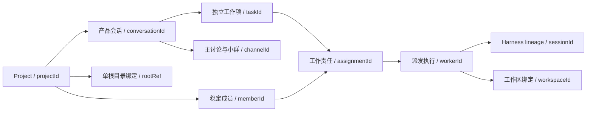

## 多 Agent 代码协作系统 · 详细设计方案

**[2026-09-13 架构决策更新 · D18 适用范围]** Phase 0–10 的记录保留为阶段基线；第一批（Phase 11–13）已决定移除 Agora Docker 后端且不兼容旧产品任务，旧 Docker 约束仅适用于退役前实现；后续已确认产品规则以《项目蓝图》§22 为准，交付与待决任务见《开发计划安排》§18。目标能力按所属任务定稿并验收后启用，不把未来规则伪装成现有能力，也不因局部问题未决阻止无关设计任务。正文中带日期的执行、待合并和阶段状态补记保留当时证据，不替代task-status.json的当前状态；已有阶段实现约束在适用阶段继续有效。正文已有阶段规则不是对未来演进的永久否决；新路径的接口与安全边界未定稿前不得绕过旧实现。


**[2026-09-12 T10.6 Go 推理回放兼容修复]** opencode.ai 的 deepseek-v4-flash/pro 自定义路由启用锁定 PiAi/Harness 原生 reasoningEfforts 与 requiresReasoningContentOnAssistantMessages：非空推理原样回放，无推理的 assistant 消息由原生序列化补空 reasoning_content。thinkingFormat=deepseek；不提供 off 映射，不显式关闭思考，保留提供方默认模式及1M/384K容量。其他提供方/模型不变，不改上游依赖或自研循环。原始推理不进入群聊/Trace。此为协议兼容补齐；录制2原HTTP400未能以合成对照复现，不宣称该次失败根因已确认。验证及限制见 https://github.com/logan-suu/Agora/blob/83fe416c1015d86616acdead7af2ebbad82e8384/docs/demo/task106-english-recording-evidence.md。

**[2026-09-14 选型同步]** 蓝图§21的Leader研发测试偏好采用OpenCode Go优先路由：通用G5实测由`tests/helpers/live-model.ts`选择已有Go凭据与`deepseek-v4.1-flash`，通过官方DeepSeekAdapter接入Harness，保留原生会话头、思考与默认容量；无Go配置时可使用既有官方配置，显式`AGORA_TEST_PROVIDER=deepseek-official`覆盖官方专属验证。已选Go失败不降级，不变更生产连接及既有任务绑定。兼容PiAi路径将Go的新V4.1名称纳入既有原生reasoning回放规则；仅补模型识别，用户配置的容量不变。历史评测与费用证据不重写。

**[2026-09-14 Leader测试选择同步]** 当前通用真实测试由`tests/helpers/live-model.ts`固定Go `deepseek-v4-flash`，取代上一段Go优先/V4.1默认/官方后备策略。`AGORA_TEST_PROVIDER`仅允许缺省或`opencode-go`；官方覆盖暂不启用，凭据仍保留。缺Go或调用失败直接失败，三项默认G5不跳过；继续使用原生DeepSeekAdapter、相同断言/思考/容量及期限，真实工具与LocalTempSandbox不变。产品V4.1协议识别及当前Eval的更名修复保留，但不启动V4.1实网调用或正式Benchmark。 测试侧Go adapter复用已验证的`normalizeGoToolStream`，在公开stream/prepareCall两入口保留同一block已知工具身份、先读完流再发布工具块；不改arguments、不猜缺失身份或吞冲突，参见`docs/evals/phase10-go-diagnostic-evidence.md`。

**[2026-09-15 研发回归兼容修复]** 通用Go测试切换官方DeepSeekAdapter后，锁定版本会省略空reasoning_content，未继承原PiAi路径的空字段兼容规则。tests/helpers/go-reasoning-transport.ts在官方序列化后的请求边界，仅为缺少该字段的assistant补空字符串；非空原样保留，原Harness历史不改写。作用域限定当前Go deepseek-v4-flash测试适配器的stream/prepareCall，AsyncLocalStorage隔离并发及非本适配器请求，原headers/signal直接传递；不修改上游依赖、思考/容量/重试/断言或期限，不扩大产品及冻结Benchmark路径。缺字段行为已由真实Harness与官方序列化的确定性测试复现；前次HTTP400和此前部分缺字段请求被接受的差异保留为上游条件未完全确定，不改写历史失败。验证证据见docs/task-history/11.5.md。

> **当前版本 v3.12 / 2026-09-13：** D18 后续规划正式落位，第一批（Phase 11–13）确定本机单一路径与 Docker 退役，不兼容旧产品任务；具体范围见新增后续章节。**此前 v3.11 / 2026-09-08：** 对齐蓝图 v1.10，新增 §6.1 的 10.2 韧性与最小 retry DTO 规格；纠正上版计划的跨 turn 重试假设；10.2 本地实现与验收证据已留档，待 PR 合并。**此前 v3.10：** 对齐蓝图 v1.9/D2，统一 Harness 执行路线并撤销外部简报/投影例外；旧 external 类型仅为兼容表示，本轮未改源码。**此前 v3.9：** 上游对齐蓝图 v1.8，补齐 canonical Git worktree path/branch/HEAD 精确成员证明、主工作区拒绝、不可变 artifact receipt 重试与 locale 无关稳定排序；既有 Integration 前缀状态机、单步丢失回执、补偿清理与当前波次投影规则保持。下方单行版本串仅保留历史沿革，凡与当前标记规格冲突均以本文后续最新的 `[日期 架构决策更新]` 为准。

版本 v3.3（详细设计，不含最终实现代码，但含精确接口/schema/伪代码）· 日期 2026-09-03 上游文档：《多 Agent 代码协作系统 · 项目蓝图 v1.2》。本文把蓝图的设计决策落成可直接照着写代码的精确规格。 语言/框架基线：**纯 TypeScript（Node 20+）**、**DeepSeek Harness**（薄 agent 内循环）、**自研轻量编排与并发层**、**MCP（TS SDK）**（工具层）、**Docker（dockerode）+ git worktree（simple-git）**（执行隔离）、**Next.js/React**（群聊前端，与后端同栈）。 v3.3 相对 v3.2 的变化：D9/D12 补齐 Phase 7 离职协议，新增持久 departure 阶段、目标角色 drain、确定性交接、孤儿责任阻断与跨存储 saga 恢复边界；完整抢占仍留 Phase 9。v3.2 相对 v3.1 的变化：D12 将项目 roster 与 Channel 收敛为同一 `ProjectCollaborationSnapshot`，拆分 `RoleSpec` 与 `RosterEntry` 生命周期，移除任务 State 的 roster 双重所有权，并锁定 Phase 7 动态角色与历史 Channel 的合法性边界。 v2.3 相对 v2.2 的变化（新增顶层项目/多租户层）：加入 `Project` **顶层容器**（`AppState` 降为任务级 + `projectId` 回指，项目内允许多任务、初期退化单任务）；**独立世界隔离 +** `GlobalScheduler` **全局并行配额（默认上限 3、每项目保底 1）与成本核算**；**两层项目知识库** `KnowledgeBase`**（精炼层注入投影 + 归档层 RAG），由 Librarian 职责在任务收尾自动蒸馏回灌**；**跨项目默认隔离、复用走受控导入** `ImportRecord`；**leader 收件箱混合口径**（队列归项目、`GlobalInbox` 汇总归全局、仅 blocking 上全局、[2026-08-23 架构决策更新]进 humanGate 时终止 Harness 进程、裁决后按安全点重 Fork（终止并分叉，见第 8 节））。新增第 8 节，原阶段 0/校验顺延为第 9/10 节（详见第 8 节）。 v2.2 相对 v2.1 的变化（更深地复用 Harness 现成能力）：worker 的**构建与作用域**改为复用 Harness 的 `ctx.subagents`（spawn-in-process：`inheritsParentContext=false` + `toolFilter/persona/outputSchema/depthLimit` 正好映射 RoleSpec）——`[2026-08-26 实测校准]` 真实 API 无 `runStep`，阶段 0 改经 `ctx.agents.create()` 事件驱动（`followup`→`whenIdle`）实现，`ctx.subagents` 留作阶段 9+ 真并行构建/作用域；**文件隔离仍靠 Docker+worktree**（subagent 只做进程内上下文隔离，补充而非替代 sandbox）；**单 agent 历史压缩改为委托 Harness** `ctx.compaction`（`CompactionEngine`，`agent/pre-step` 按 `ctx.tokenMeter` 阈值自动触发），自研摘要只保留给**跨 agent 投影切片**（详见第 0、6、7 节）。 v2.1 相对 v2.0 的变化：通信收敛为**单一 Channel 原语**（群聊=参与者集合，leader 恒为成员），取代原先的 `broadcast/direct/subgroup` 三类通道枚举；`Message.channel+convId` 改为 `channelId`，`Conversation` 合并为 `Channel`，`AppState.conversations` 当时改为 `channels`（该双重所有权已由 v2.4/D7 撤销），投影改为按 channel 成员资格切片（详见第 1、5、7 节）。 v2.0 相对 v1.0 的最大变化：技术栈从 Python/LangGraph 切为纯 TS + Harness + 自研轻编排。State 从 TypedDict 改为 TS interface；编排从 LangGraph 图改为在 Harness 事件流之上自研轻编排；抢占从 asyncio 事件改为 Harness 的 inbox steering + turn-stopping + 安全点。 阅读顺序：先看第 0 节工程结构与 Harness 集成约定，再按 State → 角色 → 编排 → 并发/抢占 → 通信 → 执行器/工具 → 投影 逐节展开。所有接口均为「按落地阶段先退化实现、后续阶段只替换实现体」。

> **[2026-09-03 架构决策更新] D4 恢复协议复评：** 将原 `GlobalScheduler.terminateAndFork(): void` 拆为跨 Leader 等待的持久 `suspend → resolve → resume` 生命周期；明确 Harness 当前为进程内 context，safePoint 必须指向已 flush 的项目/任务级 session 与已完成 turn boundary，全新 context 内必须真正 load + fork。gate 生产者只给瞬态请求，完整 gate 在 checkpoint 落盘后一次提交；裁决消息以 resolution receipt 复制 refs，确保清 gate 后仍可重启续办。Phase 8 只落回合制单任务与本地容量释放，Phase 9 再接 GlobalScheduler/多 worker 抢占。AutoGen `TerminationCondition` 仅由现有 `iterationCount` + humanGate 确定性路由具体化，8.1 不新建重复的隐藏状态框架。本条与后续 §1/§5/§6/§8 的 D4 定义优先于页首版本沿革中的旧描述。
>
> **[2026-09-03 架构决策更新] 宿主运行时校准：** Phase 8 锁定的官方 JSONL persistence plugin 在入口直接依赖 Node 原生 Zstandard API，Node 22.14/20 无法加载，Node 24.19 实测通过。因此页首沿革中的 Node 20+ 被宿主 Node 24+ 取代；Docker 用户代码沙箱继续固定 `node:20-slim`，两者职责不混用。
>
> **[2026-08-31 架构决策更新] v2.4 通信所有权校准：** D6 将消息事实提交与实时投递分离，新增 TaskStateStore / MessageCommitted / 展示信封精确接口；D7 规定 `Project.channels` 为 Channel 注册表唯一真相源，撤销上方 v2.1 曾把 Channel 复制进 `AppState.channels` 的历史口径。Phase 5 固定 main + JSON 快照，Phase 6 动态 Channel/participants；本文后续 §1/§5/§7/§8 的更新定义优先于版本沿革中的旧描述。
>
> **[2026-09-01 架构决策更新] v2.5 Channel 恢复与路由校准：** D7 新增 `ProjectChannelStore` 原子 JSON 快照、sub `taskId` 绑定、`{taskId,msgId}` 局部引用、提交前 Channel 策略与可重建 inbox；MessageBus 不存 inbox。D8 的外部耐久存储前提同步扩展为 TaskStateStore + ProjectChannelStore。
>
> **[2026-09-01 架构决策更新] v2.6 PR 复评校准：** D7 增加 Phase 5 持久任务缺失 `channels.json` 时的 main backfill、roster 保留身份约束与对象属性顺序无关的 no-op 语义；D9 收紧为 planned message 服务只提交一个主消息，动作 mutations 禁止追加 `messages`。损坏 Channel 快照继续 fail-fast，完整账号认证仍不进入 Phase 6 范围。
>
> **[2026-09-01 架构决策更新] v2.8 Sub 生命周期复评：** participants 改为集合标准化；sub 增 `threadId/topic/createdBy`；定稿可信 actor、稳定 actionId、同 thread 去重、权限关闭、project/task 串行与 Channel-first/D6-message-second 可重试 saga。channelId 改用长度前缀消除拼接碰撞；agent open 允许显式稳定 threadId；生命周期公告按 Channel 实例去重；控制块审计 Message 保留且纯控制回复生成非空 display。6.2 只关闭并公告，6.3 才冒泡摘要，Phase 8 才处理 humanGate/resume。
>
> **[2026-09-01 架构决策更新] v2.9 6.3 上下文与冒泡复评：** 删除持久 `Channel.localContext` 与摘要字符串副本；`ChannelContextBuilder` 从 Channel 快照 + 任务消息按 participant/task 派生结构化、限额、无 display 的角色切片。closed sub 通过既有薄 Harness 生成结构化 `channel_summary` main 消息，Channel 只保存 `bubbledSummaryRef`；稳定 msgId、D6 first-write-stays 与 revision CAS 组成可恢复的 message-first/ref-second saga。本文的当前有效版本以本条 v2.9 更新为准。
>
> **[2026-09-01 架构决策更新] v3.0 PR #50 有界上下文与摘要复评：** ChannelContext 的动态消息内容改为 `{entries,omittedRefs,omittedRefCount}` 共用 4000 字符预算，禁止引用列表无界回涨；摘要改为完整 entry/结构化 fragment 输入、chunk-local 来源校验、有界中间输出与预算内多轮归并；`ChannelSummaryGenerator` 定位为 L3 端口，空摘要归 pure domain；decision 不再重复来源集合，唯一来源列表保留在摘要顶层。reconcile 返回前重新加载规范 State，异步 ChannelContext 构建后复查 pause。本文当前有效版本以本条 v3.0 更新为准。
>
> **[2026-09-02 架构决策更新] v3.1 Eval 可复现性与隔离复评：** D11 明确“可重复”是版本化输入与环境可重跑、可追溯，不是模型输出逐字节确定；Phase 6 分离 deterministic/model profile；结果改为统一 grader check、显式 `unknown` 指标、任务/runner/环境指纹与带哈希 artifact 引用。生产组合根只可在 `.data/evals/<runId>/` 隔离 data root/workspace 中生成评测专用 State，禁止触碰用户项目 `.data/projects/` 或 KB；Eval wrapper/observer 不修改任何冻结生产端口签名。本文当前有效版本以本条 v3.1 更新为准。

------

### 0. 工程结构、Harness 集成与总体约定

**[2026-09-14 研发回归实现同步]** 根目录`vitest.config.ts`采用`fileParallelism: false`，默认`pnpm test`按文件串行调度共享宿主的真实Docker/Harness/Git回归，避免独立测试文件竞争同一宿主资源。场景内部的worker并发、全部测试匹配规则、原断言和期限保持不变；通用真实模型仍按当前Leader选择执行，不以跳过或提供方后备替代。诊断和验证见`docs/task-history/11.4.md`；历史单次超时的精确阻塞位置未复现，不归因为已证实的Git合并逻辑缺陷。

#### 研发任务查询工具（2026-09-13）

本节只定义仓库研发工具，不属于 Agora 产品 State 或 L1–L4 运行时。`scripts/task-status.mjs` 使用 Node 内置模块读取唯一索引，不写文件、不执行模型、不自动改变状态。无需 pnpm install，可从任意 cwd 运行脚本绝对路径。

- `summary`（默认）：当前阶段、全局及当前阶段状态计数、进行中/阻塞任务、当前阶段首个 ready、可级联 ID、当前阶段出口、未完成里程碑及决策 ID 目录；不输出历史或所有已完成任务。
- `task <id>`：该任务完整索引字段、直接依赖当前状态、前一阶段出口任务状态、当前阶段出口条件与按固定路径派生的历史引用；不展开全部依赖 notes。
- `phase <id>`：该阶段元数据与任务 id/title/status/dependencies/last_updated；不展开 notes。
- `decisions [id ...]`：全部或指定决策的短摘要与 source；仅供定位，不能替代来源章节。
- `history <id> [--offset N] [--limit N]`：显式读取单任务历史；默认返回最近 6000 个 Unicode 码点，limit 范围 1–12000，指定 offset 从零开始；返回总长度、起点、前后省略字符数与前后分页 offset，不静默截断，不自动读取历史引用的正文。
- `check`：检查任务/阶段/决策唯一 ID、状态取值、依赖存在与无环、当前阶段与出口引用、摘要长度；校验已有历史指针、迁移归档区 SHA-256 及决策旧摘要快照。异常、未知 ID/参数、历史缺失或损坏以非零退出码失败，不输出虚构空结果。

索引字段白名单不变；历史路径为 `docs/task-history/<id>.md`，无需添加任务字段。notes 上限 800 码点、决策 rule 上限 500 码点。未来任务可无历史，首次产生执行记录时创建并在 notes 引用；迁移任务的原文区不可改写，新事件只追加。详细读写与迁移规范见 [任务追踪维护](task-tracking.md)，来源为蓝图 §21 的 2026-09-13 决策。


**为什么用 Harness 当薄 agent 内核（先对齐认知）。** Harness 的设计与我们的需求高度同构，直接复用可省掉最难的自研：其一，**agent loop 本身是可替换插件**（默认 `ReactLoopAgent` 实现 `Agent` 接口）——薄执行器就是"配置好扩展点的一个 Harness loop 实例"。其二，**Turn/Step 两层模型**里 Step = 一次模型请求 + 它调用的工具——与我们"安全点 = 一次 LLM/工具调用结束"完全一致。其三，**事件溯源会话日志 +** `deriveMessages()` **从日志投影历史、"从不单独存储"**——就是我们"共享黑板作唯一真相源 + 角色投影"。其四，**Inbox（**`next-turn`**/**`next-step` **队列）+** `steer`**/**`inject` **+** `agent/turn-stopping`——就是我们的配合式抢占。其五，**fork/resume/replay 从同一事件流派生**——就是我们的 checkpoint。我们只在它之上写"多 worker 协作层"。

**Harness 四个扩展点的用法映射（关键）：**

| Harness 扩展点        | 类型      | 我们用它做什么                                               |
| --------------------- | --------- | ------------------------------------------------------------ |
| `agent/pre-step`      | waterfall | 准入本步新增消息：每 turn 一次固定启动、官方工具交换及有界格式恢复；或拒绝本步（抢占）。当前角色投影由官方 SystemPrompt scoped section 每次组装 |
| `agent/request`       | waterfall | 按角色**路由不同模型/推理档位**（规划用强推理、编码用代码模型） |
| `agent/request-error` | waterfall | 失败重试（`{kind:'retry'}`）                                 |
| `agent/turn-stopping` | serial    | **配合式抢占落点**：leader 注入新指令后，通过 steering 反对关轮 → 循环重读 inbox 再开一步 |

**Harness 服务复用边界（除扩展点外的"再省一块自研"）：**

| Harness 服务                                                 | 我们用它做什么                                               | 边界（不替代什么）                                           |
| ------------------------------------------------------------ | ------------------------------------------------------------ | ------------------------------------------------------------ |
| `ctx.agents.create()` + 每 worker 独立 HarnessExecutor/Context | worker 的**构建与作用域**：RoleSpec systemPrompt、`agentCtx.tools.restrict({allow})`、D1 当前 system 投影与独立 session 在同一个已验证 adapter 中组合；WorkerRuntime 只并发多个 Executor，不复制 agent loop | D17：这是 Phase 9 正式 worker 路径；独立 Context/session 不继承其他 worker 对话，文件隔离仍由 9.3 Docker+worktree 提供 |
| `ctx.subagents.start()`（spawn-in-process）                 | 只保留为 worker 内可选的一次性委派能力，不作为 Agora 顶层 WorkerRuntime 的 worker 构造器 | 锁定版本的 spawn provider 只实现 one-shot `start()`，没有 continuable creation；调用方拿到的是最终 result/dispose，而非可逐 step 驱动、持久 suspend/Fork 的 Executor。用它构建长跑 worker 会破坏 D4/D17，Phase 9 禁止 |
| `ctx.compaction`（`CompactionEngine`：`compactIfNeeded/compactNow/compactRegion`） | **单 agent 自身历史压缩**：`agent/pre-step` 按 `ctx.tokenMeter` 比阈值（默认 0.8）自动触发，溢出时在 `agent/request-error` 兜底，保持 turn 无关且不拆 tool-pairing；`summarize()` 可覆写。省掉自研单 agent 压缩 | **不负责跨 agent 投影切片的压缩**——那部分仍走我们第 7 节的自研摘要。注意 compaction 与我们的投影注入**同挂** `agent/pre-step` **waterfall**，需定序（见第 7 节） |

> **[2026-09-05 架构决策更新] D17 Harness API 复评：** 本地锁定 `@deepseek-ai/dsh-subagent-spawn-in-process@0.1.1-rc.2` 的官方类型/README 明确 `start()` 是 one-shot，provider 无 `prepareContinuable()`；现有 `HarnessExecutor` 已用 `ctx.agents.create()`、`followup()`、`whenIdle()`、JSONL persistence 与 D4 lineage 通过真实链。Phase 9 因此并发多个独立 HarnessExecutor，而不为“用了 subagents”重写一套不可逐步控制的 worker。该修订仍是 Harness 薄执行器，不触犯 D2/R5；`ctx.subagents` 可留作 worker 内部边界清晰的一次性委派，但不得占用顶层 worker 身份或绕过 GlobalScheduler lease。

工具侧我们挂在 `ctx.tools` scheduler 上做超时、审批门、限流、观测；工具执行走 Harness 的 `tools/pre-execute → tools/execute → tools/post-execute` 三段流水线，MCP 工具即 execute 阶段的实现。`[2026-08-27 实测校准]` 任务 1.5 已落地：① MCP→Harness 桥（`packages/tools/bridge`，fs/test/git server 经 InMemoryTransport+Client 进程内桥接，模型可见 wire 名沿用 `fs_read`/`test_run`/`git_applyPatch`，`worktree` 参数由组合根注入不外露）；② 超时 = `ToolDefinition.timeoutMs`（fs/git 默认 30s，R7）+ `@deepseek-ai/dsh-tool-call-timeout-policy` 插件（`tools/execute` 包装，deadline 获胜替换为 `TOOL_TIMEOUT` 结构化结果；工具体须在 abort 时优雅落定而非 reject）；③ 审批门 = executor 注册 `tools/pre-execute` 瀑布监听（选项 `approval`，Phase 1 默认放行，Phase 8 humanGate 缝）；④ 限流 = `ctx.tools.guard()` 单调守卫（每 turn 调用预算，`maxToolCallsPerTurn` 默认关，step 入口重置）；⑤ 作用域化 = agent `setup` 内 `agentCtx.tools.restrict({ allow })`（Phase 1 toolFilter 等价物，空数组隐藏全部全局工具适配 COORDINATOR；subagent 留 Phase 9）。

**目录结构（monorepo，pnpm workspaces；[2026-08-24 选型同步]对齐《系统架构设计文档》L1–L4 分层）：**

```
agora/
├── packages/
│   ├── core/                     # [L1+L2] 领域模型与编排内核（纯类型/纯函数，无 I/O 副作用）
│   │   ├── domain/               # state.ts、reducer.ts、roster.ts、ledger.ts、coordination-ledger.ts、handoff.ts
│   │   ├── orchestration/        # orchestrator.ts(主循环)、coordinator.ts(路由)、worker-runtime.ts、complexity.ts、integrate.ts、human-gate.ts
│   │   └── preemption/           # preemptor.ts 配合式抢占信号控制
│   ├── runtime/                  # [L3+L4] 执行与隔离
│   │   ├── executor/             # base.ts(Executor 接口)、harness-executor.ts(统一 Harness 适配)
│   │   ├── sandbox/              # sandbox-manager.ts(SandboxManager 接口)、local-temp-sandbox.ts(LocalTempSandbox)
│   │   └── state/                # base.ts(TaskStateStore 接口)、json-task-state-store.ts(JSON 原子快照)
│   ├── comm/                     # [L3+L4] 通信总线
│   │   ├── bus/                  # MessageBus 接口(Port：只投递已提交事件)
│   │   └── channels/             # ProjectChannelStore + JSON 适配器 + Channel/Inbox 读模型
│   ├── tools/                    # [L4] MCP servers(TS SDK)：git/fs/test/lint/sandbox 各一个 server
│   ├── roles/                    # [L1 数据] RoleSpec 定义(yaml/ts)；Phase 7 不虚构未落地模板目录
│   │   └── definitions/
│   └── shared/                   # 类型与常量
├── apps/
│   └── web/                      # Next.js/React 群聊前端 + SSE/HTTP POST 总线
└── package.json
```

> **路径映射（旧 → 新，下文正文旧路径均按此理解）**：`core/state.ts`→`core/domain/state.ts`；`core/orchestrator.ts`、`core/coordinator.ts`、`core/worker-runtime.ts`→`core/orchestration/`；`core/preemption.ts`→`core/preemption/preemptor.ts`；`core/projection.ts`、`core/ledger.ts`、`core/roster.ts`→`core/domain/`；`executors/`→`runtime/executor/`；`sandbox/`→`runtime/sandbox/`；`comm/bus.ts`→`comm/bus/`；`comm/intent.ts`→`apps/web/src/lib/intent.ts`（Phase 5 服务端解释入口）；`TaskStateStore`→`runtime/state/`（D6，Phase 5）；`ProjectChannelStore`→`comm/channels/`（D7，Phase 6）。

**命名约定：** State 字段 camelCase；角色标识用字符串字面量联合 `'COORDINATOR'|'PM'|'ARCHITECT'|'CODER'|'TESTER'|'REVIEWER'`（可被 roster 扩展为 `string`）；消息类型/群类型(ChannelKind)/phase 用字符串字面量联合（Channel 本身是携带 participants 的接口）；所有对外副作用只走 MCP，业务代码内不直接 `child_process`（沙箱/worktree 的 dockerode/simple-git 调用集中在 sandbox 包内、并同样以 MCP server 暴露给 agent）。

**退化实现原则：** 阶段 0–8 并发层用「单 worker 顺序执行」——`WorkerRuntime.spawn()` `await` 跑完一个再下一个，`preemption` 在回合边界检查暂停标志即可；阶段 9 才切成真正的并行 Promise 池。接口签名从一开始就按并行设计，退化只是实现体。

------

**[2026-09-16 研发留证同步]** 按蓝图§21 TEST-CLEANUP，测试原始输出写Git忽略的`test-outputs/`，`docs/reviews/`只保留交付筛选的最小充分证据；每次创建/更新PR清理临时、重复、过时产物并同步活动引用与固定提交追溯。规则见[维护规范](task-tracking.md)。

### 1. 共享状态 State 精确 Schema（TS interface）

**[2026-09-17 D19阶段接口同步]** 现有实现及冻结方法继续有效；Phase14新增受信orchestration聚合、任务共享提交队列、单派工companion及图等待/恢复适配，精确契约见[§13](#langgraph-contract-d19)。只在新路径启用，模型无权写控制收据，图不替代投影/授权/D4/D9/D16/lease。

State 是唯一真相源。它是一个纯数据对象，配一组**合并函数（reducer 语义）处理并行 worker 的字段级更新。注意：Harness 自己维护每个 agent 的事件溯源日志；我们的 State 是多 agent 协作层的共享黑板**，两者分工——Harness 管单 agent 历史，State 管跨 agent 结构化真相。另注：`AppState` 是**任务级**工作集，其上还有**项目级容器** `Project`（持久团队/仓库/知识库）与**全局调度层**，见第 8 节；故下面 `AppState` 带一个 `projectId` 回指。

```
type Phase = 'clarifying' | 'planning' | 'coding' | 'testing' | 'review' | 'integrating' | 'done';
type RoleId = 'COORDINATOR' | 'PM' | 'ARCHITECT' | 'CODER' | 'TESTER' | 'REVIEWER' | (string & {});
type ExecutorType = 'harness' | 'external';   // Legacy wire type; only harness is executable (D2).
type WorkerStatus = 'pending' | 'running' | 'paused' | 'done' | 'failed';
type Authority = 'leader' | 'agent';
type MsgType = 'handoff' | 'feedback' | 'question' | 'escalation' | 'objection' | 'chat' | 'announce';
type ChannelKind = 'main' | 'sub';   // main=默认大群(全体+leader)；sub=子集群(即"私聊/小群"，仍恒含 leader)
type ParticipantId = 'leader' | RoleId;
type ObjectionTrack = 'blocking' | 'advisory';
type ObjectionClaim = 'contradiction' | 'concern';
type ObjectionTarget =
  | { kind: 'decision'; id: string }
  | { kind: 'requirement'; id: string };


interface Requirement {
  id: string; story: string; acceptance: string[ ]; nonGoals: string[ ];
  withdrawnByDecisionId?: string;             // D14 Leader 接受 blocking objection 后撤回；缺省=active
}

interface HumanGateRequest {                    // L2 瞬态请求，不得作为半成品写入 AppState
  triggerMsgId: string; triggerTs: number;      // gateId/openedTs 的稳定来源
  reason: string; options: string[ ]; phase: Phase;
}

interface WorktreeRef {
  path: string;                                // 宿主规范绝对路径，仅作受信组合根/工具引用
  branch: string;                              // 由逻辑 isolationKey 确定性编码的 Git-safe 分支
  baseCommit: string;                          // 创建 worktree 时锁定的完整 Git object id
  headCommit?: string;                         // worker 提交后填写；进入 integrate 前必填
}

// Phase 0–8 已持久快照的字符串 worktree 只作兼容读。进入 Phase 9 文件并行前，
// 必须对真实 Git 仓库查询 branch/base/head 并原子升级为 WorktreeRef；不得根据路径猜测。
type PersistedWorktreeRef = WorktreeRef | string;


interface Subtask {
  id: string; title: string; ownerRole: RoleId;

  dependsOn: string[ ];                       // Coordinator 建依赖序

  status: 'todo' | 'in_progress' | 'blocked' | 'done';
  priority?: number;                         // 0-100 整数；旧快照缺省按 0
  worktree?: PersistedWorktreeRef;            // Phase 9 canonical writer 只写 WorktreeRef
}

interface Decision {
  id: string; topic: string; decision: string; rationale: string;
  authority: Authority;                      // leader 最高，可覆盖 agent 级
  by: string;                                // 角色或 'leader'
  supersedes?: string;                       // 仅覆盖同 topic 的 current 历史决策
  objectionResolution?: {                    // 仅规范 Leader objection 裁决使用
    objectionId: string;
    outcome: 'accepted' | 'rejected';
    target?: ObjectionTarget;
  };
  ts: number;
}

interface ObjectionDraft {
  id: string; threadId: string; fromRole: RoleId;
  target?: ObjectionTarget;                  // concern 可不指向具体事实；contradiction 必须提供
  claim: ObjectionClaim;                     // 语义判断由 Coordinator 明确声明
  argument: string;
  ts: number;
}

interface Objection extends ObjectionDraft {
  track: ObjectionTrack;                     // 只能由 classifyObjection() 计算
}

// [2026-09-05 架构决策更新] Decision 写入边界必须同时校验 supersedes 目标存在、仍为 current、
// authority 合法且 topic 与新 Decision 完全相同。跨 topic supersedes 一律 fail-fast；D14 接受
// decision-target 时 resolution Decision 继承目标 topic。历史跨 topic fixture 不再属于合法 mutation。

interface Message {
  msgId: string; threadId?: string;          // 问答/升级/异议会话链
  channelId: string;                         // 所属群聊；广播=main 群，"私聊"=对应 sub 群

  fromRole: string; to?: string[ ];           // 群内 @定向(影响 inbox 优先级)，省略=群内全员

  type: MsgType;
  payload: Record<string, unknown>;          // 面向 agent 的结构化内容
  display: string;                           // 面向人的可读摘要(群聊呈现)
  ts: number;
}

// [2026-09-07 实装校验] messages append 在读取字段及去重前通过共享 isMessage 检查完整消息外壳，
// 无效值（含同 msgId 重放）明确拒绝；payload 只校验为非 null、非数组对象，领域语义继续由对应校验器负责。
// JsonTaskStateStore 初始化、读取及写入快照使用同一校验，损坏消息不静默修复；失败批次不部分落盘。
// ts 必须为有限 number，type 为 MsgType，threadId/to 存在时分别为 string/string[]；自定义角色仍合法。

interface HandoffPacket {
  fromRole: string; toRole: string;

  done: string; keyDecisions: string[ ];      // 关联 decisionLedger 的 id


  openIssues: string[ ]; fileRefs: string[ ];  // 路径+行号引用，不贴代码

  ts: number;
}

// Phase 7 离职交接继续复用该结构：done=安全点时的当前进展；openIssues 同时承载
// 未完成事项与以 "Recommendation: " 开头的建议；无人接手时 toRole='leader' 托管。
// 稳定身份由同一 Task State commit 中的 handoff Message.msgId 提供，不改旧 packet schema。

interface RoleOnboardingReceipt {
  actionId: string;                         // Leader Message.msgId；同一逻辑重试必须复用
  role: RoleId;                             // 必须在项目持久 roster 中为 enabled
  handoffRefs: MessageRef[ ];               // 仅同任务规范 role_departure_handoff Message
}

interface RoleOnboardingIntent {
  kind: 'onboard_role';
  targetRole: RoleId;
  entrustedHandoffMsgIds: string[ ];        // /role onboard ... from ...；缺省 []
}

// D13：addRole 是项目成员登记，不写本结构；/role onboard 继续使用既有
// payload={kind:'leader_intent',intent,action,onboarding} 外壳。onboarding:RoleOnboardingReceipt
// 只保存引用、不复制 packet；project() 读时交叉校验并派生 onboardingContext。

interface WorkerState {
  workerId: string;                         // D17 稳定 assignment 身份，不能以 role 代替
  role: RoleId; executor: ExecutorType;
  status: WorkerStatus; subtaskId?: string;
  worktree?: PersistedWorktreeRef;
  sessionId?: string;                        // Harness 会话 id(事件溯源日志)
  safePoint?: string;                        // 最近安全点(step/end 的事件游标)
  startedTs: number;
}

interface MessageRef { taskId: string; msgId: string; }

// 唯一通信原语：群聊 = 参与者集合。铁律不变量：'leader' ∈ participants 恒成立。
// 项目内只允许一个 channelId='main'；sub channelId 项目内唯一且必须绑定 taskId。
interface ChannelBase {
  channelId: string;
  participants: ParticipantId[ ];             // main=全体在编角色+leader；sub={A,B,leader}
  closed: boolean;
}

type Channel =
  | (ChannelBase & { kind: 'main'; channelId: 'main'; taskId?: never })
  | (ChannelBase & {
      kind: 'sub';
      taskId: string;
      threadId: string;                         // 同一任务内议题/生命周期去重键
      topic: string;                            // 非空的人类可读议题
      createdBy: ParticipantId;                 // 由组合根绑定，禁止信任模型/浏览器自报
      bubbledSummaryRef?: MessageRef;            // main 中唯一 channel_summary 事实的引用
    });

// 项目 roster 以规范化 role 为身份键：大写、匹配 [A-Z][A-Z0-9_-]*、全局唯一，且不得等于保留身份 leader。
// COORDINATOR 必须存在且 status='enabled'。main participants 精确等于 leader + enabled roster。
// sub participants/createdBy 可引用任意已知 roster 身份以保留历史；新建 sub、agent 发言和普通 worker 执行只允许 enabled。
// departing 仅允许 Phase 7 离职服务等待既有活动 Step 完成并保存安全点，不得启动新工作。

interface RoleSpec {
  role: string; executor: ExecutorType;
  systemPrompt: string;

  tools: string[ ];                           // 允许的 MCP 工具名


  projection: string[ ];                      // 可读的 State 字段/切片键

  routeWhen: string;                         // 可被路由的条件
  externalCmd?: string;                      // Legacy compatibility field; not an executable command (D2).
  model?: string;                            // agent/request 路由用
  modelConnectionId?: string;                // Project-scoped immutable model connection (10.3)
}

type RosterStatus = 'enabled' | 'disabled' | 'departing' | 'departed';
type DepartureStage = 'draining' | 'handoff_committed' | 'awaiting_replacement' | 'completed';
interface RoleDeparture {
  actionId: string; taskId: string; requestedTs: number;
  successorRole?: RoleId;
  stage: DepartureStage;
  handoffRef?: { taskId: string; msgId: string };
}
interface RosterEntry {
  spec: RoleSpec;
  status: RosterStatus;
  departure?: RoleDeparture;                  // 仅 departing/departed；跨存储 saga 恢复锚点
}

interface TestResults {
  passed: boolean; total: number; failed: number;

  failures: { test: string; message: string; file: string; line: number }[ ];

  coverage?: number;
}

interface Integration {
  integrationId: string;                       // task+wave+baseCommit+ordered workerIds 确定性派生
  waveId: string;
  base: { branch: string; commit: string };
  integrationWorktree: WorktreeRef;             // 专用集成 worktree，绝不是用户 checkout
  pendingBranches: {
    workerId: string; subtaskId: string;
    worktree: WorktreeRef;                       // headCommit 必填且与 Git 现场一致
    topologicalRank: number;
  }[ ];                                          // 按 topologicalRank 再 workerId 稳定排序
  mergedBranches: {
    workerId: string; subtaskId: string; branch: string;
    headCommit: string; mergeCommit: string;          // 该步后的 integration HEAD；可为 FF 结果
  }[ ];
  conflicts: {
    workerId: string; subtaskId: string; branch: string;
    headCommit: string; files: string[ ];
  }[ ];                                           // 持久后打开 integration_conflict gate
  resultCommit?: string;
  status: 'idle' | 'merging' | 'conflict' | 'done';
}

interface BranchOrIntegrationProjection {
  worktrees: {
    workerId: string;
    subtaskId: string;
    worktree: WorktreeRef;
  }[ ];
  integration: null | {
    integrationId: string;
    waveId: string;
    base: { branch: string; commit: string };
    integrationWorktree: WorktreeRef;
    pendingBranches: Integration['pendingBranches'];
    mergedBranches: Integration['mergedBranches'];
    conflicts: Integration['conflicts'];
    resultCommit?: string;
    status: Integration['status'];
  };
  validation?: {
    dispatchId: string; integrationId: string; inputCommit: string;
    worktree: WorktreeRef;
  };
  reviewScope?: {
    planId: string; validationReceiptId: string; worktree: WorktreeRef;
    subtasks: { subtaskId: string; title: string; dependsOn: string[] }[];
  };
}

interface AppState {
  // 任务层（AppState 是任务级工作集，隶属某项目，见第 8 节）
  projectId: string; taskId: string; goal: string;

  requirements: Requirement[ ]; subtasks: Subtask[ ];

  phase: Phase; complexity?: { tier: 0 | 1 | 2; signals: Record<string, unknown> };
  iterationCount: number;
  // 设计层
  architecture?: Record<string, unknown>; conventions?: Record<string, unknown>;
  // 代码层(引用而非全量)

  repoSnapshot: { branch: string; commit: string; files: string[ ] };


  appliedHistory: Record<string, unknown>[ ];

  // 反馈层

  testResults?: TestResults; reviewComments: Record<string, unknown>[ ];

  // 并发层

  workers: WorkerState[ ]; integration?: Integration; // 旧快照缺省=idle；Phase 9 开始集成时落完整快照
  parallelExecution?: ParallelExecution;             // 9.4 串行控制面，精确契约见 §3.1

  // 协作层

  messages: Message[ ];                       // roster/Channel 归项目协作快照，任务 State 不复制


  nextRole?: string;
  humanGate?: {
    gateId: string;                             // Leader 裁决必须绑定的稳定卡点身份
    reason: string; options: string[ ]; phase: Phase;
    openedTs: number;
    safePointRefs: string[ ];                   // opaque 持久 checkpoint refs
  };


  objections: Objection[ ];                  // append-only；未决视图由规范 Leader 裁决消息派生
  handoffPackets: HandoffPacket[ ]; decisionLedger: Decision[ ];

}
```

Channel 注册表边界必须统一校验：`channelId` 项目内唯一；恰有一个 main，其 `closed=false`、不带 `taskId`、participants 为 leader + 当前 enabled roster；sub 的 `taskId/threadId/topic` 为非空字符串，`createdBy` 与 participants 必须是 leader 或当前项目 roster 中的**已知身份**，不要求历史成员仍 enabled。participants 是集合；main 按 enabled roster 顺序标准化，sub 按完整 roster 的稳定身份顺序标准化。新建 sub 至少包含 leader 与一个 enabled 角色；已有 sub 可保留 disabled/departing/departed 成员，但这些成员不得发新消息或启动 worker。`bubbledSummaryRef` 只允许出现在 `closed=true` 的 sub；其 `taskId` 必须等于 sub.taskId，`msgId` 必须精确等于 `channel-bubble:${channelId}`。closed 且暂无引用表示待 reconciliation，是合法中间态；open sub 或 main 携带该字段均为损坏快照。`ProjectChannelStore` 作为 D12 协作快照的 Channel 视图验证上述本地 shape/作用域不变量，`ChannelBubbleReconciler` 才负责跨端口确认目标 Task State 中存在严格的 main `channel_summary` 消息。读取已关闭 sub 的历史允许，但关闭后不得再提交新消息。

> **[2026-09-02 架构决策更新] D12 消除 roster 双重所有权：** 早期 Schema 同时在任务 `AppState.roster` 与项目 `Project.roster` 声明团队，且 reducer 预留了任务级 `roster` mutation；这与“项目是持久团队、任务只是工作单元”冲突。自 Phase 7 起删除任务级字段与 mutation 预留，所有成员变更改走项目级 `ProjectCollaborationStore`。该变更不是放宽 R1：任务 State 仍只经 `applyMutations()`，项目协作事实则经 revision CAS 的专用 L3 端口原子提交。

**合并函数（reducer 语义，**`core/domain/state.ts`**）。** 因为并行 worker 会各自更新 State，我们不直接赋值，而是通过 `applyMutations(state, mutations)` 把各 worker 产生的变更按字段合并：

```
type Mutation =
  | { field: 'messages' | 'decisionLedger' | 'objections' | 'handoffPackets' | 'appliedHistory' | 'reviewComments';
      op: 'append'; value: unknown }
  | { field: 'workers' | 'subtasks' | 'requirements'; op: 'mergeById'; value: { id: string } }
  | { field: 'testResults' | 'phase' | 'nextRole' | 'iterationCount' | 'humanGate' | 'integration' | 'parallelExecution' | 'architecture' | 'conventions' | 'complexity';
      op: 'set'; value: unknown };
// append: 追加；mergeById: 按 id 字段级更新(不重复追加)；set: 串行控制面覆盖
// D17：只有并行 worker 获准的 identity-partitioned op 必须可交换、幂等；
// set 与同一实体同一字段的多写者更新不具交换律，只允许 Coordinator/专用服务串行提交
// append 幂等经由身份键/深相等去重达成；同键不同内容视为生产者违约并 fail-closed
```

> **[2026-09-05/06 架构决策更新] D17 并行写入边界：** Phase 9 启用 `workers` 的 `mergeById` 写入；每个 assignment 必须在启动前以稳定 `workerId` 注册自己的完整 `WorkerState`，同一逻辑 dispatch 重放不得生成第二个 worker。并行 agent step 输出仅可 append 由该 step 产生、带稳定身份且通过既有生产者校验的事实，不得提交任何 `workers` merge；`WorkerState` 的注册以及当前 worker 的 `status/safePoint` 等生命周期进展只由 `WorkerRuntime` 内部生成并在 canonical queue 提交，不能接受模型提供的 role/executor/subtaskId/startedTs 等 assignment 字段。当前 `Subtask` 的 `title/ownerRole/dependsOn/status/worktree/priority` 全是拓扑、所有权或集成控制面字段，不存在可并行写的非控制面进展字段；任何并行 subtask merge、`requirements`、他人 worker 分区和任何 `set` mutation 均拒绝。`priority` 是可选的 0–100 整数，旧快照缺省按 `0`，只由 Leader/Coordinator 专用服务在串行控制面更新。`phase/testResults/nextRole/iterationCount/humanGate/integration/parallelExecution/architecture/conventions/complexity` 继续由 Coordinator 或专用服务在任务串行控制面提交。`mergeById` 只有在 WorkerRuntime 对不同 worker 身份分区、或同一 worker 内保持程序序时才具交换语义；旧“所有 set 也可交换”表述无效。并行 mutation 权限在 TaskStateStore commit 前校验，违规不落盘。

> **[2026-09-03 架构决策更新] Phase 8 `humanGate` 活动字段规则：** gate 生产者只向 L2 生命周期服务返回瞬态 `HumanGateRequest`；不得先把缺少 checkpoint 的半成品写入 `AppState`。服务在已提交 `step/end` 边界先 flush 所有 session，再把完整 `{gateId,reason,options,phase,openedTs,safePointRefs}` 一次提交为当前待裁决 gate；`gateId` 由 `triggerMsgId`、`openedTs` 由 `triggerTs` 稳定派生，同语义重放必须得到相同值。Leader 裁决服务在同一 Task State commit 追加规范裁决 Message、应用 reason-specific mutations，并以 `set('humanGate', undefined)` 清除活动 gate；该 Message 的 resolution receipt 必须复制 `{gateId,option,argument?,safePointRefs,resumeSessionId}`，其中 `resumeSessionId` 从 actionId 确定性派生，成为清 gate 后 resume/retry 的持久恢复锚点。reducer 仅对该可选字段接受 `undefined` 作为清除值，序列化后字段缺省。权限与幂等由 D9 应用服务绑定，不由 reducer 猜 actor；无当前 gate、`gateId` 不匹配、option 不在允许集、同 actionId 不同参数或原因特定后置条件不成立时 fail-closed。已裁决历史以 Message/decisionLedger 保留，不在 `humanGate` 中累积第二份台账。

> [2026-09-01 架构决策更新] D7 消除 Channel 双重所有权并补齐恢复边界：`Project.channels` 是项目级 Channel 注册表唯一真相源，`AppState.messages` 只保存任务级消息事实，故 `AppState` 与其 Mutation 联合不再声明 `channels`。跨项目/任务投递以 `TaskScope={projectId,taskId}` 信封定位；阶段 6 的 Channel 写入由项目级 `ProjectChannelStore` 按项目串行化并原子替换 JSON 快照，不借任务 reducer 伪装成任务字段，也不以进程内 Map 充当真相源。sub 群必须绑定 `taskId`；局部上下文索引不持久化，统一从 Channel 快照与任务消息按 role 派生。Channel 仅可保存指向 main 摘要事实的 `{taskId,msgId}` 引用，禁止复制摘要正文。

> [2026-08-28 实装记录] 任务 2.2 补规格缺口：AppState 定义了 `requirements`（PM 产出、条件路由信号「需求已定」），但上方 Mutation 联合原未给任何写入 op。按 Requirement 为带 id 实体数组，归入 mergeById 家族（幂等 upsert），与 subtasks 同语义。Phase 2 同步解锁启用面：append=messages/reviewComments，mergeById=subtasks/requirements，set=testResults/phase/nextRole/iterationCount/architecture（其余字段维持阶段门控显式 throw）。缺口已记 GitHub Issue（R12）。
>
> [2026-08-28 实装记录] 任务 2.4 补规格缺口：AppState 定义了 `conventions`（设计层字段，ARCHITECT 产出），但上方 Mutation 联合原未给任何写入 op。与 architecture 同语义归入 set 家族（非数组对象守卫），Phase 2 解锁启用面（ENABLED_SET_FIELDS+=conventions）。`pendingPatch` 同样缺写入 op——2.4 投影仅只读（显式 null 缺省），writer 待消费方（2.5 e2e 评估 CODER 提交补丁流）落地时解锁。缺口已记 GitHub Issue（R12）。
>
> **[2026-09-07 架构决策更新] D17/DEF-010 处置：** Phase 2–8 实测始终以 worktree/Git diff 为代码事实，`pendingPatch` 没有 writer 也没有独立消费者。Phase 9 以结构化 `WorktreeRef` + `Integration` 持久分支/提交/冲突引用，故删除 `AppState.pendingPatch`、Mutation 预留、RoleSpec 切片与显式 null 投影；不以另一份 patch 快照制造双重真相。延期项只在实现与迁移测试落地后标 resolved。

> **[2026-09-07 架构决策更新] D17 集成快照规则：** `integration` 是 Coordinator/专用集成服务独占的 set 字段。创建时必须一次写入完整 `integrationId/waveId/base/integrationWorktree/pendingBranches/status`，`pendingBranches` 与 canonical WorkerState/Subtask/WorktreeRef 逐项交叉验证。每个成功 merge 以新完整 `Integration` 快照串行提交；Git 成功但 State commit 未确认时，重试必须用 integration HEAD/ancestry 与已持久进度对账，不得再盲合并。任何 base/head/顺序漂移、重复 worker/subtask 或未完成 worker 一律 fail-closed。

> **[2026-09-07 架构决策更新] Integration 状态机精化：** `pendingBranches` 非空并按 `{topologicalRank,workerId}` 严格递增；`mergedBranches` 逐项完整匹配 pending 的前缀，禁止交叉配对、重复、跳步或乱序。`status='merging'` 只允许此前缀且无 conflicts/result；`status='conflict'` 要求恰一个 conflict 完整匹配下一个 pending，且 integration worktree 已确认回到此前缀 HEAD；`status='done'` 要求前缀覆盖全部 pending、无 conflict，`resultCommit` 与最后 `mergeCommit` 相同；`status='idle'` 是 Leader 已裁决、等待从原 base 物理 reset 的唯一过渡态，只允许空 progress/conflicts/result。除 idle 的待 reset 现场外，`integrationWorktree.baseCommit` 必须等于 `base.commit`，持久 `headCommit` 必须等于当前前缀 HEAD。
>
> [2026-08-28 实装记录] 任务 3.1 解锁启用面：`decisionLedger` 归 append 家族（上方 Mutation 联合原已定义 op），Phase 3 解锁写入（ENABLED_APPEND_FIELDS+=decisionLedger），AppState 补 `decisionLedger: Decision[]` 字段（本节 L216 原有，实现落位）。域层新增 `core/domain/ledger.ts`：`Decision`/`Authority`/`addDecision()`——追加 + 幂等重放 + 同 id 异内容生产者违约 throw + supersedes 指向校验 + agent 级不得推翻 leader 级（蓝图 §14 数据化），同 topic 冲突以原始信号返回（`DecisionConflict{existingId,incomingId,topic}`），冲突分类逻辑留 Phase 8。
>
> [2026-08-28 PR 评审加固] 任务 3.1（PR #28 预审）：applyAppend 的 decisionLedger 分支在 reducer 边界复用域层校验 `assertAppendableDecision(ledger, decision)`——shape 完整性、supersedes 指向存在性、agent 级不得推翻 leader 级（蓝图 §14），违规一律 throw（对齐 set 族边界校验先例）。两级契约定稿：生产者侧 `addDecision()` 严格（同 id 异内容 throw + conflict 原始信号返回），reducer 侧容错可重放（同 id 异内容「先到先留」+ dedup 幂等）。conflict 信号不在 reducer 传播（applyMutations 返回结构无落点，丢弃即静默降级），分类逻辑仍留 Phase 8。
>
> [2026-08-29 PR 复审澄清] 任务 3.1（PR #28 CodeRabbit 复审两条 Minor）：① 交换律不变量（本节上方「所有 op 必须可交换、幂等」）适用于**合法 mutation** 的正常写入路径；生产者契约违规场景（同 id 不同内容的重放撞车）**显式豁免**——reducer 层「先到先留」按到达序保留首个，反转到达顺序可能保留不同内容（reducer 测试已锚定该语义），不视为交换律破坏。② 冲突契约作用域定稿：`DecisionConflict[]` 仅由生产者 API `addDecision()` 返回并由其调用方处理；编排层经 `applyMutations()` 直传的 mutation 路径职责限定为「边界校验（assertAppendableDecision）+ 幂等去重（deduplicatedAppend）」，不要求也不传播冲突信号；冲突分类与消费面待 Phase 8 落地时一并接入。
>
> **[2026-09-05 架构决策更新] D17 对上述历史澄清的收紧：** “先到先留”的同 id 异内容只属于旧 Phase 3 reducer 容错记录，不能作为 Phase 9 合法并行写语义；并行提交前的生产者/权限校验必须把同 id 异内容、set 与越区 merge 拒绝在 commit 之外。当前交换/幂等要求只覆盖身份唯一、分区无冲突的合法并行 mutation。
>
> **[2026-09-05 实装记录] 任务 8.5 / DEF-011：** `assertSupersedesIsLegal()` 已在 L1 生产者与 reducer 共用边界同时强制 target 为 current 且 topic 相同；未知、已被后继覆盖或跨 topic 的 supersedes 均 fail-fast。Phase 3 的历史长上下文夹具已移除非法跨 topic 边，读侧 topic-scoped 压缩仍保留为旧快照防御。`ledger.test.ts` 与 `reducer.test.ts` 分别锚定写侧拒绝及幂等重放。
>
**[2026-09-11 T10.6 正式入口修复]** 任务模型绑定只显式选取 `projectId/taskId` 身份字段；生命周期 `TaskStartInput` 的 `requestId` 属请求回执，不得通过对象展开混入严格的 `TaskModelBinding` 持久记录。保留存储 exact-key 校验及首次绑定不可变规则；真实Web创建与设置服务组合必须覆盖此接缝。

**[2026-09-11 T10.6 回归修复]** `testResults` 的 `set` 在 reducer 边界校验非负整数计数、boolean passed 和完整 failures 对象；每个失败须有 string test/message、string file 及非负整数 line，非法反馈不得先进入 State 再在 Coordinator 交接时崩溃。保留测试工具既有 `file=""、line=0` 无源码位置表示；Coordinator/离职交接与投影仅为满足既有 fileRefs 语法的位置生成引用，完整失败仍留在 testResults/openIssues，不伪造路径或丢弃失败。保留 `undefined` 清理上轮结果的既有串行语义；不自动填造缺失的文件/行号，不删除失败以获得通过。TESTER 的产品/Phase 0 回归提示同时给出失败对象格式。此形状校验不替代 D17 精确 HEAD 的真实测试 receipt，也不把模型自报 passed 当作可信验证。

> [2026-08-29 实装记录] 任务 3.2 解锁启用面：`handoffPackets` 归 append 家族（上方 Mutation 联合原已定义 op），Phase 3 解锁写入（ENABLED_APPEND_FIELDS+=handoffPackets），AppState 补 `handoffPackets: HandoffPacket[]` 字段（本节上方协作层行原有，实现落位，置于 reviewComments 与 decisionLedger 之间对齐本节相对顺序）。域层新增 `core/domain/handoff.ts`：`HandoffPacket`（接口逐字，无 id 字段）/`assertValidHandoff()`（形状校验：非空 fromRole/toRole/done + string[] 三数组 + 有限 ts）/`assertAppendableHandoff(ledger, packet)`（形状 + keyDecisions 引用完整性——悬空 decision id 在 reducer 边界 throw，镜像 3.1 supersedes 先例）。因无 id 字段，append 幂等经 deduplicatedAppend 深相等去重达成（同 packet 重放收敛为一条，不同 packet 各自成条）。Coordinator 角色切换时的生成接线按批准裁决延后至 3.3/3.5（投影消费方就位后一并落地，避免先写无读者）。PR #29 预审补强：① `fileRefs` 边界语法门禁定稿——条目须匹配 `path:line` / `path:start-end`（`L` 前缀可选，路径段不含空白与冒号），粘贴代码即 throw（铁律②的边界防线）；② `handoffPackets` 数组序语义定稿——数组序 = 到达序（对齐 messages 先例与 3.1「先到先留」家族语义），交换律以多重集合等价锚定（reducer 测试归一化比较，与 3.1 `sortById` 同款），事件重放确定性由事件日志序保证（D4 分叉重放按日志序），投影侧（3.3）如需时间序按 `ts` 自行排序。
> [2026-08-30 实装记录] 任务 4.1 解锁启用面：`complexity` 归 set 家族（AppState `complexity?` 字段本节 L189 原有；§1 Mutation 联合 set 行本次补列 `'complexity'`——规格缺口对齐 2.2/2.4 先例，已记 GitHub Issue #34），Phase 4 解锁写入（SET_FIELDS/ENABLED_SET_FIELDS+=complexity），AppState 补 `complexity?: Complexity` 字段（本节上方 phase 行原有 `complexity?: { tier: 0 | 1 | 2; signals: Record<string, unknown> }`，实现落位为 `core/domain/state.ts` 导出接口 `Complexity`，HumanGate 先例）。reducer 边界守卫 `isComplexity`：非数组对象 + `tier` ∈ {0,1,2} 整数 + `signals` 非数组对象，违规 throw `complexity must be { tier: 0 | 1 | 2; signals: Record<string, unknown> }`（镜像 humanGate/conventions 先例）；初始 State 不置（entry 恰评估一次的幂等语义）。

**[2026-09-12 T10.6 英文复杂度识别修复]** 英文多模块目标与中文“模块”使用相同的既有Tier2启发式：TIER2_KEYWORDS补齐module，沿用大小写不敏感的包含匹配，覆盖module/modules。不改变Tier阈值、DAG校验、Worker执行额度或已有complexity的幂等恢复；真实并行仍须合法独立assignment和Trace重叠证据。录制前必须把实际goal传入生产evaluateComplexity检查Tier2，不能凭题面或Architecture已给DAG推断入口会并行。

**[2026-09-12 T10.6 累计测试职责修复]** D17依赖波次中，ARCHITECT角色指令要求executionPlan只安排CODER业务实现，不另建测试、验证、审阅或批准专用子任务；每波集成后的独立validation TESTER负责累计验收测试，测试约定放conventions。创建新测试时遵循与当前波次兼容的路径约定；既有累计测试保持原路径，CODER/TESTER不得删除、改名、迁移或合并为替代文件，REVIEWER反馈不构成例外。仅与Architect建议布局不同、但当前需求及测试覆盖已满足的差异作为审阅comment，不以此要求破坏累计测试；Leader显式要求额外入口时采用保留原测试的追加方案，不兼容的计划走architecture反馈。既有删除检测、精确HEAD验证、累计测试和D16权威保持不变。 此项是角色计划指导，不是新增的节点语义分类器或schema拒绝规则；录制9的偏离按事实保留，不能仅按节点名称拒绝合法DAG。实际越权、删测试、验证漏项或自动批准仍须失败。

**为什么这样切分。** 每个字段归属明确写入者，配合投影（第 7 节）让每个角色只读自己需要的切片——落实蓝图"共享黑板 + 角色投影"的上下文纪律。

------

### 2. 角色定义：System Prompt 与工具清单

角色是**数据（RoleSpec）**，存在 `packages/roles/`；项目成员关系是 `RosterEntry`，运行时只装载 `status='enabled'` 的条目。6 个默认角色规格要点（prompt 为骨架）：

**[2026-09-03 架构决策更新] D12 Phase 7 角色契约：** `RoleSpec` 是不含启停状态的能力定义，`RosterEntry={spec,status,departure?}` 才是项目成员。role id 入库前转大写并校验 `[A-Z][A-Z0-9_-]*`，按规范化值唯一，`leader` 保留；`COORDINATOR` 必须存在且恒 enabled。`addRole` 对同 id、同 spec、enabled 的重放为 no-op；同 id 不同 spec，或同 id 已为 disabled/departing/departed（即使 spec 相同）均冲突。`enableRole` 只接受 disabled，`disableRole` 只接受 enabled，同态重放为 no-op；departing/departed 只能由阶段 7.2 的离职状态机推进，普通 enable/disable 不得越过。`departure` 只允许随 departing/departed 存在，稳定记录 action/task、接任者、阶段与 handoffRef；completed 记录随 departed 身份永久保留。任何消费 roster 的 Coordinator、Leader Intent、WorkerRuntime、Channel 生命周期和消息提交入口都必须把持久 roster 作为必需权威源并检查普通工作仅允许 enabled；departing 只允许离职服务执行受限 drain。缺失依赖时 fail-closed。已 applied 的 Leader 指派若在消费前变为非 enabled，返回 `required_role_unavailable:<role>` humanGate，不抛未处理异常。

Phase 7 的自定义 RoleSpec 可进入持久 roster、通过 `project()` 投影和工具白名单装载，并由 Leader 显式 `@ROLE` 指派给通用 worker。默认六角色仍走已定 Coordinator 状态机；任意自定义角色的自主调度需要另行定义多候选优先级、预期 mutation/output 契约与失败回退，按 DEF-016 延期。`routeWhen` 在此之前只是默认角色与显式装载的声明数据，不得被解释为已经支持任意角色自动加入拓扑。

**[2026-09-03 架构决策更新] D13 入职边界：** `RoleSpec.projection` 只声明角色业务切片；`channels`、`decisions` 等系统约束切片继续由投影器统一附加。任务存在该角色的有效 applied `leader_intent/onboard_role` 事实时，投影器必须再附加系统级 `onboardingContext`，自定义 spec 不得关闭或伪造它。加入项目不等于接手任务：`ProjectRosterService.addRole(projectId,spec)` 只负责 D12 成员登记；任务接手必须由 Leader 对具体 `TaskScope` 显式 onboard，不能因为角色刚加入项目就扫描或注入其他任务的 State。

**COORDINATOR（薄，不可删）**——调度，不产出业务内容。评估复杂度、选并发档位、派 subtask、判收敛/升级、路由通信、异议归类。工具：无副作用工具，只读全 State 摘要 + 写 `nextRole`/`workers`/`humanGate`/`complexity`。投影：全局结构化信号摘要。Prompt：「你是团队协调者，基于复杂度与最近结果决定下一步激活谁、是否并行、是否升级 leader。你不写需求/设计/代码。输出 `{nextRoles, parallel, reason, escalate?}`。」

**PM（薄，条件触发）**——`goal`→`requirements`。leader 新决策与既有 requirement 矛盾时发 `blocking` objection。工具：无（纯推理）。投影：goal、requirements、相关 leader 决策。触发：`goal` 含糊才激活。Prompt：「你是产品经理，产出带验收标准的结构化需求。若 leader 新指令与已确认需求冲突，提 blocking 异议说明冲突点、等 leader 裁决，不擅自改需求。」

**ARCHITECT（薄）**——模块划分、接口、数据结构、选型，产出 `architecture`+`conventions`。工具：只读仓库（fs.read/git.log）。投影：requirements、repo 结构、conventions；反馈升级重设计时额外读取当前 architecture 与结构化 `reviewFeedback`。Prompt：「你是架构师，给出可实现的设计与约定；重设计时逐条回应结构化 reviewFeedback，关键决策附理由写入台账。」

**CODER（Phase 0–9 固定薄 Harness，并行主力）**——按 subtask+architecture 写/改代码，提交 worktree，读测试/评审反馈迭代。工具：fs.read/write、sandbox.run、git（自己 worktree 内）、sandbox.applyPatch、lint。投影：分配的 subtask、architecture、conventions、当前失败测试、相关 fileRefs、最新一轮结构化 `reviewFeedback`。Prompt：「你是编码者，只在被分配的 subtask 与 worktree 范围内工作。基于架构、失败测试与结构化评审反馈迭代提交补丁。小技术分歧可提 advisory 异议但继续干活。」

**TESTER（Phase 0–9 固定薄 Harness）**——按 acceptance 写并跑测试，回填 `testResults`；失败推回对应 Coder。工具：fs.read/write、sandbox.run、git。投影：requirements.acceptance、当前 `branchOrIntegration` 引用、接口约定。Prompt：「你是测试者，以验收标准为客观判据编写并运行测试，产出结构化结果，不修业务代码。」9.4 只启用 validation（在独立验证 worktree 编写并执行测试）；preparation 固定关闭，其只读结构化计划契约仅为未来保留；角色名称与 RoleSpec 身份不分裂，输出权限由组合根收窄，见 §3.1。

**REVIEWER（薄，人工卡点载体）**——质量/规范/安全审查或连续失败根因审查，产出 `reviewComments`；通过与否需 leader 确认。工具：fs.read、git.diff、lint。投影：当前集成结果或已校验 worktree/branch/commit diff 引用、conventions、architecture、结构化 `reviewContext`；根因模式同时读取当前失败测试与相关 fileRefs。Prompt：「你是评审者，按结构化 reviewContext 审查质量/规范/安全或连续失败根因，结合 failingTests/fileRefs 产出可执行修改意见，通过结论需 leader 最终确认。」

**工具-角色权限矩阵（默认，即 RoleSpec.tools 白名单）：**

| 工具\角色     | COORD | PM   | ARCH | CODER | TESTER  | REVIEWER  |
| ------------- | ----- | ---- | ---- | ----- | ------- | --------- |
| fs.read       | 摘要  | ✗    | ✓    | ✓     | ✓       | ✓         |
| fs.write      | ✗     | ✗    | ✗    | ✓     | ✓(测试) | ✗         |
| git(worktree) | ✗     | ✗    | 只读 | ✓     | ✓       | 只读 diff |
| sandbox.run   | ✗     | ✗    | ✗    | ✓     | ✓       | ✗         |
| lint          | ✗     | ✗    | ✗    | ✓     | ✗       | ✓         |

> [2026-08-28 澄清] PM 无任何工具（本节 bullet「工具：无（纯推理）」为准）：只消费投影切片 goal/requirements/leaderDecisions，与 COORDINATOR 同原则。矩阵 fs.read×PM 单元格已由 ✓ 更正为 ✗（Issue #21）。

通用 worker 装载角色时，把 `RoleSpec.tools` 注册到该 Harness loop 实例的 `ctx.tools` scheduler（含超时/审批/限流）。

`[2026-08-27 实测校准]` 任务 1.5 已将本矩阵数据化落地：① 装载器 `resolveRoleTools`（`packages/tools/bridge`）把 `RoleSpec.tools` 逻辑名展开为 wire 名——`git` 是一个能力组（展开为 createWorktree/applyPatch/diff/merge 四工具）、`sandbox.applyPatch` 别名 `git.applyPatch`（Phase 1 以 git worktree 实现补丁概念）、`lint` 无实现按 DEF-005 跳过并在 `unavailable` 上报；② `PHASE0_ROSTER` 中 CODER 增加 `sandbox.run`（对齐本矩阵 sandbox.run 行 CODER ✓ 与 Phase 0 组合根既有行为）；③ 桥接目录注册全部工具到 executor ctx，再经 agent `setup` 的 `ctx.tools.restrict({ allow })` 做角色级作用域化（空 allow 数组隐藏全部工具，适配 COORDINATOR 无工具角色）；`[2026-08-28 实测校准]` Phase 0 组合根另按阶段面过滤——`PHASE0_TOOL_SURFACE = {fs.read, fs.write, sandbox.run}`（§9「工具只接 fs + sandbox.run」，R7 Phase 0 无 git worktree），catalog 仍解析完整矩阵，但 Phase 0 运行时不授予 `git` 组/`sandbox.applyPatch`/`lint`；④ 超时/审批/限流治理见第 0 节实测校准。

`[2026-08-28 实装记录]` 任务 2.5（DEF-006 裁决，用户批准）落地 git 组拆分：`git` 组重定义为 **worktree 域内**操作（git_applyPatch + git_diff，对齐本矩阵 CODER/TESTER 格限定词「git(worktree)」），新增 `git.readonly` 组（仅 git_diff，对齐 ARCH「只读」/ REVIEWER「只读 diff」格）；main-repo 变更 git_createWorktree/git_merge 从逻辑组移除，**不授予任何模型角色**（前者组合根职责、后者 integrate 节点 Phase 3+）。RoleSpec 层仅 ARCHITECT/REVIEWER 的 `git` 条目改为 `git.readonly`（roles-definitions 数据变更）；CODER/TESTER 的 `git` 条目语义收窄为 worktree 组，PHASE0_ROSTER 数据不动（R9）。wire 工具全集不变，createWorktree/merge 仍可在直链目录链以真实 git 二进制验证（phase1-exit 先例）。

`[2026-08-28 实装记录]` 任务 2.5（DEF-005 解决，用户指示在当前 PR 内落地）实现 lint-server（§6 签名 `check(worktree, paths) -> issues[ ]`）：`packages/tools/lint` 的 `WorktreeLintService` 以 `node <biome-bin> lint <paths> --reporter=json` 包裹 Biome CLI（cwd=注册 worktree 根；无 shell 派生 + worktree 相对路径校验 + registry allowlist/retarget 加固，镜像 fs/test service）；JSON diagnostics 解析为 `{file,line,message,rule,severity}`（行号 1-based）；biome exit≥2 显式 throw（§12 不静默降级）。bridge 逻辑组 `lint` → wire 名 `lint_check`，CODER/REVIEWER 的矩阵 `lint` 条目自此解析为真实工具；REVIEWER 在 phase2-exit 六角色回环内真实调用 lint_check（G5）。矩阵 lint 行 CODER ✓/REVIEWER ✓ 自此全格落地，loader 的 `unavailable` 通道保留给未来白名单先行、实现后置的条目。

------

[2026-09-08 角色交付指引修复] PM 输出保持明确范围/API/验收及依赖标识，需求精简且不重复，不自行增加需求或边界政策；ARCHITECT 用精简设计记录必要接口/依赖/约定，最终输出完整闭合的原始 JSON，避免全文实现与重复需求；提供完整双顶层键示例，模块采用小型扁平对象数组并引用需求ID，conventions与architecture为同级键。结构化解析和schema保持严格，缺括号/截断结果不由宿主猜补或写入State。

**[2026-09-10 Task10.5 后续评测连接]** 当前Eval profile为opencode-go，baseURL=https://opencode.ai/zen/go/v1，模型为deepseek-v4-flash/deepseek-flash（后者为Go当前的V4.1 Flash ID）；mixed中PM/ARCHITECT/REVIEWER用deepseek-flash，其余角色用deepseek-v4-flash，single/multi/parallel/sparse全部用deepseek-v4-flash，保留65536估算输入token与32768输出上限。API Key仅请求时从OPENCODE_API_KEY或OpenCode auth.json的opencode-go/api条目解析，不复制到仓库/配置/实验产物，不回退deepseek或Zen条目；已有DEEPSEEK_API_KEY保留。固定Harness原生User-Agent及x-deepseek-harness-session-id随每个主请求和compaction请求发送，缺sessionId在I/O前拒绝。Go计量使用官方Go价目表的subscription-quota-equivalent-usd，与历史官方费用分开；真实Go adapter拒绝旧账本，后续账本名phase10-opencode-go-quota-budget.json。正式执行入口modelRequestsEnabled=false；默认预留v4组/独立协议，未创建或冻结新组，后续运行与额度预算须单独获Leader授权。连接配置调整阶段仅离线；后续只按另行授权的诊断入口运行，未执行完整付费回归。

[2026-09-10 Go正式组授权] Leader确认新54次正式测评独立USD5订阅配额折算总上限，formal=5/diagnostic=0，不合并旧官方USD20或Go诊断USD0.094028250账本。仅phase10-final-v4配合AGORA_GO_FORMAL_AUTHORIZATION=phase10-final-v4-usd5显式入口可执行；默认modelRequestsEnabled=false仍防误运行。冻结模型/任务/源码/镜像及预算后顺序执行；每次请求前检查持久停止标记，请求异常、缺有效usage、异常finish或系统性工具错误立即禁止后续请求，在途流自然结束；任一attempt非pass先停止整组审查，原失败与费用保留，源码修复须重新冻结新组。非空未知工具名仅允许一次原生纠正。预算不足请求上界时提前停止，绝不扩额。

[2026-09-10 Eval公开契约修正] Leader要求修复PM无法读取公开测试导致的需求歧义。四个公开题的接口和行为澄清从固定公开starter/测试/题面提炼，以固定SHA256绑定原始来源；澄清进入各变体相同goal投影，对冲突原题面明确优先，不投原测试代码全文，不读取参考解或holdout。PM保持无工具，生产RoleSpec/投影接口/异议解析不改。grade-school仅说明公开断言证明的事实：两次跨年级添加后原年级为空、不抛错，add返回值未断言；不得补造false/异常/名册不变要求。正式public task version升4，协议与组升v5；旧v4四次失败和费用保留，新54次共用现有USD5正式账本而非重置。修复先离线回归、真实Docker预检，保持异常停组。

[2026-09-10 Eval工具循环修复] Leader授权发现问题后先审查并直接修复，不对既定范围内的修复重复询问。v5停止原因已留档；Git MCP工具说明明确空patch只stage/commit现有fs_write变更，单模型与多角色获得一致工具语义，不改接口或权限。Eval每个attempt允许一次普通工具错误纠正，第二个独立toolCallId的工具错误（含shell126/127，普通业务测试退出1除外）在下次provider I/O/费用预留前持久停组；历史重放幂等，基础设施错误仍立即停止。single在成功/失败时均从已闭合官方session保存安全trace，缺trace的路由指标标unknown而非已证失败。先离线故障回放及真实Docker验证，再另冻新组，不覆盖v5结果或重置USD5账本。

[2026-09-10 Eval年级排序澄清] v6第二轮multi的PM将grade()顺序写为nonGoal，公开独立验题仅此断言失败。原公开澄清排序条目落在roster()句下，工具为空的PM可误读为只限定roster()；直接修正为逐API明确：grade(grade)同样按姓名字母序返回，即使输入顺序不同。原始公开测试和评分不变，所有变体同用该事实，公开version升5/组v7，holdout/version不变；v6两pass两fail及费用保留，不混算成功率。复核其余wordy/book-store/forth公开测试后未发现同类API范围歧义；仅进行明确行为澄清，不增加未被公开证据约束的行为。

**[2026-09-12 产品Git环境指引修复]** 全英文预演4的验证TESTER已获git_applyPatch/git_diff，却连续通过sandbox_run查找容器Git。固定Docker镜像没有Git CLI符合既有环境；此前no-Git说明仅在Eval题面，产品角色指令存在缺口。产品文件角色和独立波次验证指令统一明确：Git只能经已授权MCP工具，git_*不是shell命令；不搜索/安装Git或追踪.git内部指针，不扩大工具授权。使用投影的branch/commit引用，精确HEAD与干净树由可信服务复核；测试无须修改时可结束验证交接，保留累计测试交由可信服务重跑。不新增自研循环或模型重试。

[2026-09-10 Eval运行环境说明] v6/v7中TESTER多次尝试容器内git log/status，固定镜像没有Git CLI；单次先记模型使用错误，重复证据表明应向所有配置明确共同环境约束。为public和holdout的goal/TASK.md统一增加Node20/no-network/no-Git-CLI说明：Git仅经已授予MCP工具操作，git_*不是shell命令，fs_write后可用空patch提交；不新增产品验收要求，不改变权限、不在容器装Git。真实Docker预检必须证实Node20与Git CLI缺失并绑定镜像/说明hash。公开version6/holdout包装version2、组v8；holdout任务本体/隐藏验题仍原样，只有共同环境前缀改变。旧v7一pass一fail及全部费用保留，同一USD5账本，不放宽错误停止阈值。

[2026-09-10 ARCHITECT交付边界修复] v8的mixed第三次将executionPlan错放顶层，旧解析器静默丢弃该字段，先写入缺计划的architecture，再在编排legacy modules校验时报错；此为严格交付边界缺口。ARCHITECT最终对象只接受architecture/conventions两个顶层键；显式计划仅允许architecture.executionPlan并复用领域DAG校验。无显式计划时，交付入口复用领域executionPlanFromArchitecture验证legacy modules（仅非空字符串数组；空/缺省保留原单任务退化语义），对象modules必须配有效显式计划。错误在纯validateTurnOutput阶段拒绝并走既有最多两次、无工具、同turn的官方格式修复，不由宿主搬动字段或猜补计划；通过后才读取mutations并提交一次。提示同时明确legacy modules字符串限制，接口与D17/D16不变。旧v8结果/费用/源码快照保留，修复验证后另冻新组并共用USD5账本。

**[2026-09-10 Go兼容修复]** Go Eval 的标准 adapter usage 缺缓存细项但输入/输出有效时，以全部输入未缓存计算明确标注的配额上界，原 usage 不变；无输入/输出或非法数据仍停止。Go工具流对同一block index保留已知非空id/name，修复延续片段空id/null name覆盖；冲突/始终缺失身份拒绝，先自然读完provider流再发布工具块，不自研loop。诊断中已有真实SSE/Harness离线证据，在线进展见docs/evals/phase10-go-diagnostic-evidence.md。

**[2026-09-10 Go完整流程诊断授权]** Leader继续授权自有answer42的single/mixed各一次顺序试跑，复用正式Docker/Git/MCP/Harness与D16链路，独立Docker验题。沿用前一阶段同一USD0.50诊断配额，本阶段累计最多40次请求（含停止后重跑，不随进程重置）；一组失败不启动下一组。非空未知工具名只允许一次原生错误反馈纠正，重复或空身份/基础设施错误停止；不增加工具权限、不造别名或新loop。详见docs/evals/phase10-go-flow-evidence.md，正式54次组保持暂停。

**[2026-09-10 Go小规模在线诊断授权]** Leader同意先开始在线诊断。独立入口go-diagnostic.eval.ts要求显式授权环境标识，最多20次请求、USD0.50订阅配额折算诊断额度；按两个模型接入/工具调用→两个模型自动压力压缩顺序执行，任一失败停止后续单元，未知usage或请求失败禁止再次进入provider。使用真实Harness、模型及LocalTempSandbox只读审计文件，长文件为自有压力夹具，不使用正式题或holdout。下一请求前检查时限，不取消在途token流。正式54次入口继续暂停；诊断账本独立放在本次run目录，不复用旧官方账本。结果见docs/evals/phase10-go-diagnostic-evidence.md。

**[2026-09-10 Task 10.5 缺陷修复契约]** REVIEWER 合法 advisory 结束且当前 dispatch 后没有 verdict 时，顺序与并行协调器核对规范 Message 与 immutable Objection 完整对应后重新派发 REVIEWER；仅当前 dispatch 后事实有效，缺失/不一致事实和非控制交付缺 verdict 仍 fail-closed。并行 assignment 投影核对来源 advisory 引用后注入固定续评指令，避免通用指令覆盖；不投原始群聊或异议正文。新 dispatch 引用来源 advisory，保留 root-cause reason/当前验证 receipt、commit 与控制指纹，重置 review cursor，使用新 worker 身份且计入 iterationCount；8 轮上限升级 Leader。已有 verdict 仍走原 D16 校验，blocking 优先于续评。评测 MeteredAdapter 的 resolveModel 透传底层模型元数据并将 contextWindow 限定到配置上限与底层容量的较小值，让官方 BasicCompactionEngine 获得压力阈值；请求前原有完整上下文计量与费用门禁保持。旧 v3 数据不重新分级或覆盖，修复验证单列。

[2026-09-08 结构化交付失败恢复] 生产组合根为PM/ARCHITECT/REVIEWER配置独立的同步纯校验回调 `validateTurnOutput({text}):void`，复用原有严格角色解析器，不调用带I/O的mutation/test-results读取回调。校验失败只允许由官方 `agent/turn-stopping` → `agent.steer` 启动同一turn内最多两个额外模型Step，不自研loop、不自动修补JSON。补充上下文只有当前角色投影和固定格式反馈；自身历史继续由官方Harness管理，不复制原始群聊或解析错误文本。纠正期间撤下全部工具权限，原有模型请求/时间/费用预算继续累计；最终失败直接拒绝，mutation读取只在通过最终校验后执行一次。异议/Channel控制块不进入普通格式恢复，禁止以重新生成改变异议目标或绕过Leader；其错误仍fail-closed。合法控制块通过控制协议校验后提交规范消息并返回控制结果，不执行普通正文最终校验及readTurnMutations交付解析；独立文件事实读取readTestResults/readSubtaskStatus保留既有契约，可与控制消息共同提交，不能因advisory丢失实测失败结果，文件新鲜性由原组合根读取器负责。抢占请求在下一pre-step先于纠正生效，不启动新模型请求；D4 Fork后是新的Executor.step预算，已消耗请求仍计入任务/Eval全局限额。空白新turn不得读取此前turn的成功文本冒充新结果。此为薄执行器实现修复，不改变Executor公开端口或D4/D16裁决协议。

[2026-09-10 提示范围校准] 角色的最终JSON格式只约束普通交付。每个turn必须明确选择普通交付、异议或获准的Channel action之一；合法控制turn优先于普通交付格式，输出可选解释及恰一个末尾控制块，不同时交付requirements/architecture/verdict。控制事实提交后，普通交付只在后续规范路由再次要求时完成。REVIEWER的一般代码改进建议可放入普通review comment；需要D14异议处理时使用独立控制turn，不在verdict前后混放控制块。此为既有“合法控制结果跳过普通交付解析”的提示一致性修正，不放宽非末尾/畸形/混合控制的拒绝条件，不给异议错误增加重生成，不改变Leader权威或D16终审。

**[2026-09-10 架构决策更新] D14普通返工与异议的提示边界。** contradiction用于质疑当前需求或决策本身、请求Leader裁决是否撤回该目标；提示必须说明accept blocking会撤回目标。实现未满足仍被认可的需求、单元测试失败或普通质量问题，分别通过CODER修复、TESTER失败结果、REVIEWER changes_requested及既有有界返工闭环处理，不能仅因代码不符合需求就要求撤回需求。真正的需求/决策冲突仍按D14升级；解析器不根据自然语言重分类或屏蔽已发出的合法异议，Leader权威与严格控制块协议不变。


### 3. 自研轻编排：通用节点、路由、自适应

**[2026-09-17 D19阶段接口同步]** 现有实现及冻结方法继续有效；Phase14新增受信orchestration聚合、任务共享提交队列、单派工companion及图等待/恢复适配，精确契约见[§13](#langgraph-contract-d19)。只在新路径启用，模型无权写控制收据，图不替代投影/授权/D4/D9/D16/lease。

**不上重框架**（理由见蓝图第十六节）。编排是一个小状态机 + coordinator 路由函数，只有 4 个通用节点：

- `entry`：初始化 State、评估复杂度、写 `complexity`。
- `coordinator`：唯一决定 `nextRole(s)` 与是否并行。
- `worker`：**通用执行节点**——按 `nextRole` 从 roster 加载 RoleSpec，实例化基于 DeepSeek Harness 的 HarnessExecutor 运行。所有业务角色共用它，故增删角色不改编排。
- `integrate`：集成检查点——合并并行分支、跑整体测试、冲突升级。
- `humanGate`：暂停等 leader 指令的落点。
- `finalize`：产出最终代码+测试+评审报告，phase→done。

> [2026-08-30 实装记录] 任务 4.1 落地 `entry` 复杂度评估：`core/orchestration/complexity.ts` 纯函数 `evaluateComplexity({goal, estimatedFileCount?, dependencyCount?}) → {tier, signals}`（R8 零 I/O；文件数/依赖数为可选输入位，Phase 4 无估算器、entry 仅传 goal，消费方 4.2 起可扩展）。Tier 启发式（规格未给量化阈值，用户批准）：自上而下 R1 goal 命中任一多模块关键词（模块/微服务/数据库/系统/api/rest/… 常量 `TIER2_KEYWORDS`，英文大小写不敏感）→ Tier 2 `tier2.multi_module`；R2 `estimatedFileCount≥5` 或 `dependencyCount≥2` → Tier 2 `tier2.scale_inputs`；R3（命中单实体关键词 `TIER0_KEYWORDS` 或 `estimatedFileCount≤1`）且 goal≤80 字符 → Tier 0 `tier0.single_entity`；R4 其余默认 Tier 1 `tier1.default`。signals={rule, goalLengthChars, matchedTier2Keywords, matchedTier0Keywords, estimatedFileCount, dependencyCount}（理由随决策走，全 JSON 可序列化）。`orchestrator.entry()` 签名不变（R9）：`complexity` 已置则原样返回（幂等重放，用户裁决②），未置则经 `applyMutations+[set('complexity',…)]` 写入（R1）。Tier 消费（分层拓扑路由）归 4.2；`project()` 的 `global.summary.complexity` 占位接线同延至 4.2（用户裁决③）。

**关键：角色不是节点。** 编排里没有任何角色节点；"谁来干"是 `worker` 运行时按 `nextRole` 动态装载 RoleSpec 决定的（supervisor 模式）——这是热插拔与不改编排的根本。

**编排主循环（**`core/orchestration/orchestrator.ts`**，伪代码）：**

```
async function run(state: AppState) {
  state = await entry(state);
  while (state.phase !== 'done') {
    const route = coordinator.decide(state);          // 见下
    if (route.kind === 'human_gate') { state = await humanGate(state); continue; }
    if (route.kind === 'integrate')  { state = await integrate(state); continue; }
    if (route.kind === 'finalize')   break;
    // worker：单个或并行批
    if (route.parallel && route.batch.length > 1) {
      state = await workerRuntime.runParallel(state, route.batch);  // 阶段9启用
    } else {
      state = await workerRuntime.runOne(state, route.batch[0]);    // 早期退化路径
    }
  }
  return finalize(state);
}
```

> **[2026-09-05 架构决策更新] D17 Phase 9 路由接缝：** `Assignment` 从 `{role,subtaskId?}` 扩展为 `{workerId,role,subtaskId?}`；`workerId='worker:'+dispatchId+':'+ordinal`，其中 `dispatchId` 必须先随 Coordinator 控制事实持久化，ordinal 按本批稳定排序编号，使同一 dispatch 重放身份不变。`Route.worker.batch` 改为非空 readonly 数组，`parallel` 必须等价于 `batch.length>1`。9.1 只打通该路由形状、稳定身份、GlobalScheduler lease 与无文件副作用的 runtime 并发测试；9.3 之前不得把共享 worktree 上的模型写文件演示成安全真并行。
>
> Tier 2 真实流水线按**拓扑波次**推进：Coordinator 从 `todo` 中选择 `dependsOn ⊆ doneIds` 的全部就绪 subtask；依赖可执行性优先，只有该就绪集合按 `priority ?? 0` 降序、再按稳定 `id` 的直接 code-unit 比较排序后生成 CODER batch。9.4 TESTER preparation 固定关闭、不提供启用入口；只追加结构化计划的模式是未来保留契约；测试文件统一由集成后的 validation TESTER 负责。同波次全部 worker 成功 settled 后进入 integrate；集成结果冻结，单一 TESTER 从结果提交创建独立验证 worktree。只有当前验证 receipt 证明精确提交通过，Coordinator 才将该波次 subtasks 标 `done` 并推进累计基线。持久身份、失败、返工与恢复以 §3.1 为准。

**coordinator 路由 + 自适应（**`core/orchestration/coordinator.ts`**）：**

*前置分类（entry 估算* `complexity.tier`*）：*

- Tier 0（单文件/单函数、无接口设计）：直接 CODER→TESTER 小环，跳过 PM/ARCH。
- Tier 1（小型多文件、需简单设计）：PM(条件)→ARCH→CODER↔TESTER→REVIEWER。
- Tier 2（复杂、多模块、可并行）：全队，coding 阶段拆多 subtask 并行。

> [2026-08-30 实装记录] 任务 4.2 落地 Tier 消费（分层拓扑路由）：coordinator `tierOf = complexity?.tier ?? 1`（complexity 未置视为 Tier 1，存量行为零漂移）。Tier 0：clarifying 直接派发 CODER 跳过 PM/ARCH（不受 roster 门控；REVIEWER 仍 roster 门控，裁决①）。Tier 2：`dispatchAfterPlanning` → `dispatchTier2Coder`，从 `architecture.modules`（string[]，全仓 fixture 既有惯例）派生多 subtask（`dependsOn: []`，首个 `in_progress` 其余 `todo`，mergeById 写入；`architecture` schema 为 `Record<string, unknown>`，暂无依赖边承载结构，故 Phase 4 以 modules 数组序即预期实现序为约定——激活门控仍按 `dependsOn ⊆ doneIds` 通用实现，真实依赖边派生随 Phase 9 并行调度的 schema 扩展一并落地）；modules 缺失/单值退化为单 subtask 且 announce payload 记 `{tier:2, degraded:true, reason}`（不静默）；Tier 1 行为不变。顺序激活按 §0 退化实现原则（接口按并行设计，Phase 9 只换调度体）：testing pass 腿闭合当前 subtask（`done`——subtask 生命周期自此归 coordinator 所有）并激活下一就绪者（`todo` 且 `dependsOn ⊆ doneIds` 拓扑门控通用实现，不增 iterationCount），无就绪者 → REVIEWER/finalize；`assignedCoderSubtaskId` 收紧为 `activeCoderSubtaskId`（不变量：每轮恰一个 in_progress CODER subtask）。裁决③：REVIEWER `changes_requested` 重开全部 subtask（保守超集，首个重新激活；DEF-013 记 Phase 9 按 reviewComments 引用细化）。配套退役：runtime 组合根不再向 CODER 传 `readSubtaskStatus`（`subtask-status.json` 完成信号退役——CODER 不自标 done；executor 选项保留不传，R9）。Route/reducer/公开签名零变更（R9），写路径全走 applyMutations（R1）。

*反馈式升级（每轮回到 coordinator）：*

```
若 test 连续失败 N 轮且未加 REVIEWER → 加 REVIEWER 审查根因
若 REVIEWER 指出设计问题 → 拉 ARCHITECT 重设计(tier 升级)
若 iterationCount >= 上限(默认8) → 置 humanGate 升级 leader
若 subtask 之间无依赖且数量>1 且 tier==2 → 触发并行批，上限3
```

> [2026-08-30 实装记录] 任务 4.3 锁定反馈式升级的确定性语义：① 连续 TESTER 失败阈值 `N=2`；“连续”不复用全局 `iterationCount`，而是从 append-only `messages` 的最新 Coordinator 控制事件恢复——`reason='tests_failed'` 携带 `failureStreak`，任何其他控制事件开启新失败链，不新增 State 字段。第二次失败且 roster 有 REVIEWER 时派其做根因审查（`reason='repeated_test_failures'`）；角色缺席则继续 CODER 且 payload 显式记录 `degraded=true/degradedReason='reviewer_not_rostered'`。② REVIEWER verdict 增可选 `issueScope: 'implementation'|'architecture'`，缺失按 implementation 向后兼容；Coordinator 只消费结构化字段，禁止从自然语言推断。重复测试失败的根因审查不得以 `approved` 静默 finalize，必须返回 `changes_requested`。③ architecture 问题触发 `tier=min(2,currentTier+1)`，经 `applyMutations` + `set('complexity', …)` 持久化；原 `signals` 保留并追加 `escalation={reason:'reviewer_architecture_issue',previousTier,reviewCommentId}`，随后派 ARCHITECT 重设计。ARCHITECT 缺席则回 CODER、显式记录 `architect_not_rostered`，但 tier 升级仍持久化。④ `iterationCount>=8` 的既有 humanGate 检查优先于 REVIEWER/ARCHITECT 升级。所有路由保持单 worker 退化路径；Route/AppState/Mutation 公开签名不变（R9），共享 State 写入仍全走合并函数（R1）。

> [2026-08-30 PR #37 评审修复；2026-09-05 PR #62 契约补齐] 反馈升级的角色输入补齐为结构化切片（不投原始 messages/review log，R2）：REVIEWER 增 `reviewContext={mode,reason,failureStreak}` + `failingTests` + `fileRefs`，从而能真实审查连续失败根因；ARCHITECT 增当前 `architecture` + 最新一轮 `reviewFeedback={verdict,entries}`，CODER 同步消费 `reviewFeedback`，从而能逐条落实评审意见。`reviewerTurnMutations` 接缝收紧为每 turn **恰一个** verdict，且 verdict `id` 必须对本轮 dispatch 唯一并满足 `[A-Za-z0-9][A-Za-z0-9._:-]*`；Coordinator 每次派发 REVIEWER 时在结构化 announce payload 记录 `reviewCommentCursor=reviewComments.length`，回到 review 路由后只消费该游标之后恰好一个 verdict，并只向 CODER 投递本轮评审 entries，从而消除暂停/重试或重复 verdict ID 被幂等去重时复用 append-only 历史旧结论的风险，同时保证 complexity escalation 的 `reviewCommentId` 可安全绑定 D16 gate。新增真实 WorkerRuntime/Harness/MCP/LocalTempSandbox 集成链：两次真实 node 测试失败 → REVIEWER 根因审查 → architecture scope → ARCHITECT 重设计 → CODER 修复 → TESTER 通过 → REVIEWER 批准；断言两角色收到的投影内容且无 `channelId/fromRole` 原始日志字段。

[2026-09-30 PR #88身份准入修复] REVIEWER普通交接解析器在提交前拒绝与既存reviewComments身份重合的verdict ID，以及同回复内verdict与comment共用ID；组合根从规范指派State绑定历史身份，校验器和最终mutation reader共用同一输入。reviewContext增加当前结构化dispatchId供新ID命名，不投原始消息。碰撞沿既有最多两次无工具格式恢复处理，静态提示保留实际findings/verdict，不自动重命名、改结论或绕过Coordinator游标和D16 Leader终审。

> **[2026-08-31 架构决策更新] 任务 4.4 Coordinator Ledger + 角色切换交接定稿。** 采用 MagenticOne 双循环的结构但拒绝其 LLM 裁决：L1 `core/domain/coordination-ledger.ts` 定义并严格校验 JSON schema；L2 `core/orchestration/progress-ledger.ts` 以纯函数 `buildCoordinationLedger(state, observation)` 生成外层 `task={confirmedFacts,hypotheses,plan[]}` 与内层 `progress={isRequestSatisfied,isInLoop,isProgressBeingMade,nextSpeaker,instructionOrQuestion}`。字段遵 R10 使用 camelCase；`plan[]` 为 `{id,revision,role,instruction,status,dependsOn}`。台账不新增 AppState/Mutation 字段，而作为 `Message{fromRole:'COORDINATOR',type:'chat',payload.kind:'coordination_ledger'}` 经 `appendMutation('messages',...)` 持久化：`chat` 类型确保不污染 4.3 只扫描 announce/feedback/escalation 的控制事件恢复；读取端只接受完整 shape，畸形嵌套 plan/facts 直接忽略。每次 `decide()` 先产生原 Route/Mutation，再由统一 `attachCoordinationArtifacts` 基于 mutation 后的结构化 State 追加 Ledger，故 `nextSpeaker` 与实际 Route 同源。
>
> 停滞语义：显式 `tests_failed` / `repeated_test_failures` / `review_changes_requested` / `reviewer_architecture_issue` 回环，或 progressMarker（phase/complexity/requirements/architecture/subtask 状态/test/review/humanGate；明确排除 iterationCount）未变化，均令 `isInLoop=true`、`isProgressBeingMade=false` 并累计 stall；有结构化进展则清零；`maxStalls=3` 时 revision+1、重建 facts/plan、stall 清零。机器只能置 `completionCandidate`；Phase 4–7 的 `isRequestSatisfied.answer` 恒为 false，完成候选理由为 `awaiting_leader_confirmation` 且 `authority='leader'`。自 Phase 8/D16 起，当前 REVIEWER `approved` 先进入绑定该 verdict 的 `completion_confirmation` D4 gate；只有经规范 Leader completion resolution 交叉验证后才可置真。`request_changes` 保持 false 并进入返工，旧 review 的裁决不得越轮复用。
>
> 同一统一接缝解决 DEF-012：当 `state.nextRole` 存在且新 worker role 不同时，Coordinator 通用追加 `HandoffPacket`（同角色重派/初次派发不生成），`done` 记录阶段交接，`keyDecisions` 引用 State 中 leader 决策 id，`openIssues/fileRefs` 从结构化测试失败提取；所有包仍过 reducer 的 shape/引用完整性门禁。不是只硬编码旧五条 flip，4.2/4.3 新增 REVIEWER/ARCHITECT 路径也自动覆盖。真实 Phase 2 Harness/MCP/LocalTempSandbox 链在无 seed 情况下验证 PM→ARCHITECT→CODER→TESTER→REVIEWER 四次交接和每个安全点 Ledger 事件。
>
> [2026-08-31 PR #38 评审修复] Ledger 的“严格 JSON schema”收紧为各对象层级 exact-key：payload/task/fact/plan/progress 及五个 reasoned answer 只接受声明字段，额外属性整条 Ledger 判无效；`project()` 再显式重建白名单字段而非对象展开，形成 R2 双重防线。plan 状态以当前 `nextSpeaker` 优先：即使旧 architecture/test/review artifact 已满足完成启发式，本轮被重新路由的角色仍标 `active`，避免返工角色同时收到 `done` 与当前指令。开发计划 §7.3 同步补回 worker 的 confirmed facts 契约。

**[2026-09-17 D16本机阶段补充]** 下述Leader批准仍是必要条件；12.4起新本机任务若以应用到用户目录为完成目标，另须同一候选的实际应用闭合，不能仅凭approve立即finalize。已完成工作的同需求复验、新worker及分轮归档按§12.2.5.1执行，不改写历史worker终态或旧批准。未实现该扩展的旧路径不因文档同步自动开放重入。

*收敛：* Phase 0–8 顺序退化为 test 全过 + REVIEWER 通过只生成 `completionCandidate` → D16 `completion_confirmation` gate → Leader `approve_completion` → finalize/done。Phase 9 必须先完成 `并行 CODER → integrating（冻结合并提交）→ 单一 TESTER（独立 validation worktree）`；全部波次通过后才进入最终累计产物 REVIEWER 与 D16 Leader 终审。Leader `request_changes <rationale...>` 保守全量重开并等待新一轮集成、测试、review 与新 gate。9.3 的显式 integrate hook 不是 9.4 的自动闭环验收证据。

**[2026-09-09 架构决策更新] 10.3 范围确认：** 模型路由不在编排层做，而是下沉到 Harness `agent/request` 扩展点。用户在产品界面为每个 Agent 配置兼容 OpenAI API 服务的 Base URL、API Key 与模型名，实际执行必须消费已保存配置；`RoleSpec.model` 继续表达模型选择。同时提供统一配置当前项目全部 Agent 的快捷入口，填写一次连接与模型后批量保存，随后仍可逐 Agent 单独调整；批量更新的原子性、冲突处理与目标成员范围见下述已批准契约。规划/评审用强推理、编码用代码模型仅为建议，不能覆盖用户配置。凭据不得明文落盘、进入投影/群聊/Trace；连接与凭据引用、持久化和生效/恢复按下述 10.3 契约执行。全 Flash/全 Pro/角色混合预设与九次实验不属于已确认交付，最终 Benchmark 归 10.5。

------

**[2026-09-09 架构决策更新] 10.3 已批准实施契约。** Team 提供单 Agent 与全部 Agent 设置；批量目标为同一 collaboration revision 的 enabled/disabled 成员，含 COORDINATOR/自定义角色，排除 departing/departed/人类 Leader，单次 CAS 整体保存，冲突不部分更新。RoleSpec 可选 `modelConnectionId` 必须同时携带非空 `model`；连接先写入，随后提交 roster 引用，未引用版本不参与执行，恢复默认只清除当前角色 model/connectionId，不删除旧任务引用。

- **存储与凭据：** runtime/state 新 ModelConfigStore 端口，JSON 连接字段 `version/projectId/id/baseURL/contextWindow/maxTokens/auth`，项目内版本不可变。auth 为 none 或 AES-256-GCM 密文；AAD 绑定项目、连接身份与全部连接参数，10.3 当前由本机后端进程的环境变量 `AGORA_CREDENTIALS_KEY` 提供主密钥（32 字节 base64），不随数据落盘；10.4 的自动管理目标见下述补充。目录和文件拒绝符号链接，记录原子创建、文件权限 0600。服务端发模型请求时解密；GET/群聊/投影/session 配置/Trace 均不得出现 API Key 或密文。
- **任务生效：** 首次启动在重资源创建前固定 `model-bindings.json`：`version/projectId/taskId/goal/defaultModel/roles`，每项 `role/model/connectionId?`，不复制职责、权限或 roster。首次原子创建获胜，同 task 不同 goal 拒绝；worker/后续波次/D4 Fork 复用原模型和连接版本，项目设置修改仅影响新任务。任务开始后入职的新角色使用该任务固定的本机默认模型 defaultModel，D13 入职能力保留；新角色的项目自定义连接对新任务生效。无绑定历史任务只尝试原本机默认模型，不猜测新连接；恢复逐条校验 source/child 官方 `request/header` 的 provider/model，损坏或不匹配 fail-closed。
- **兼容传输：** 公开 Harness pi-ai plugin + 独立 CredentialProvider，不使用私有导出或重写 loop。范围为 Chat Completions/SSE/function tools；未知兼容服务初始 context=32768/output=4096，用户可编辑上限；已核实DeepSeek容量填入规则见下文，agent/request 固定 maxTokens。HTTPS 或回环 HTTP，拒绝 URL userinfo/query/fragment；[2026-09-09 PR #70 审查补充] 持久化入口与执行器直接配置入口都校验该规则，HarnessExecutor 在创建 Context 前预检，installCompatibleModel 在注册 provider/安装传输策略前再次守住入口，非法 URL 抛通用错误而不回显输入。官方 adapter 不公开 fetch 接缝，因此服务端 fetch 包装只在 AsyncLocalStorage 当前模型请求范围校验精确目标地址、删除 cookie/无鉴权 Authorization 并禁重定向，其他 HTTP 调用不变；normal 最多 2 次重试；[2026-09-12 Go兼容等待修正] opencode.ai 的 SDK 请求等待与 stream-idle 均为 300s，后者恢复锁定 Harness 插件原生默认值；其他兼容服务保持 SDK 120s / stream-idle 30s。持续有有效内容的流允许总时长超过 300s，取消必须传递至实际请求，禁止重试与未取消的旧请求重叠。超时继续复用官方 adapter，既不无限等待也不扩充重试；空闲等待与 SDK 请求配置不等于整任务总时限。保留 attribution headers。提供商终态错误仅保留白名单错误码与通用消息，不保留原始错误文本。
- **Web：** `GET /api/model-settings?projectId=...` 只回脱敏 roster 模型视图；`POST /api/model-settings` 的 save/reset/test 校验同源（浏览器 Origin 对照实际 Host/协议，兼容 Next 内部 URL）、20KB 请求上限、project/revision/目标。保存与恢复默认不调用模型；test 是用户主动短文本请求，不代表工具能力已经验证。选定旧连接且选择 keep 时才保留既有密钥，修改其 Base URL 必须重新输入 key 或明确 none，批量不能猜成员密钥。对外不声称 Responses-only/OAuth-only 或任意厂商扩展兼容。独立工具/Fork/live-model/UI 验收见 `docs/evals/phase10-model-settings-evidence.md`。

**[2026-09-11 架构决策更新·完整模型输出]** 按Leader发布阶段授权，已核实官方/Go DeepSeek V4 Flash/Pro容量预设为contextWindow=1000000、maxTokens=384000（官方Models & Pricing与OpenCode models.dev）。新连接地址/模型变化分别更新尚未手动编辑的context/output；两项手动编辑独立保留。已保存连接读入时两项均视为显式设置，不自动迁移；Use model limits明确同时恢复模型上限。若用户选择较小context，maxTokens不能超过context，沿用既有表单/服务端校验。当前Go六角色通过save/keep、CAS与新连接版本从1M/8192升级至1M/384000，保留密钥与旧task binding。官方默认适配器保持锁定Harness的256000默认，不擅改第三方库。此前仅恢复context保留8192是已完成历史操作，不再作为当前产品配置。短文本连接测试的32输出是该操作的功能范围，不限制任务执行。费用计量与异常止损保留，原发布准备临时费用硬阈值解除；历史Eval冻结预算/结果不改。

**[2026-09-11 架构决策更新·正常模型容量（首次恢复历史；当前输出及按钮契约以上节为准）]** 设置页仅对精确匹配的HTTPS官方DeepSeek（api.deepseek.com，根路径或/v1）和OpenCode Go（opencode.ai/zen/go/v1）的deepseek-v4-flash/deepseek-v4-pro提供1,000,000上下文容量；不匹配userinfo/query/fragment/未知端点或模型。来源为DeepSeek官方V4文档、OpenCode models.dev目录及锁定dsh-llm-deepseek DEFAULT_CONTEXT_WINDOW。新连接在用户未手动编辑容量时随模型/地址填入已知容量，未知组合回到可编辑的32768初始值；手动输入和已保存连接的值保留，已知组合提供显式Use model capacity操作恢复。读取/保存不发起模型请求，不安装运行时在线目录依赖。Leader本次授权通过现有model-settings save/keep及revision CAS将当前Go项目六角色65,536升级为1,000,000，保留8192输出、原密钥、模型和URL；创建新连接版本、旧task binding/State不变。官方自动压缩默认0.8阈值不改；不将1M元数据验证冒充1M真实长上下文质量测试。

**[2026-09-11 T10.6 取消信号修正]** 兼容传输包装重建 Request 以校验地址和修改头时，必须将调用方原始 AbortSignal 作为 fetch 的显式 init.signal 转发，不能仅依赖临时 Request 克隆产生的 signal 链。Node 原生 HTTP + 强制 GC 复现表明，中间 Request 回收后该链可能不再传播取消，导致官方 idle 已超时而 HTTP 流仍继续。修复只保持既有取消语义，超时与重试仍由官方 adapter/SDK 负责；不添加自研 timer、硬杀用户抢占中的 token 流或修改 loop。辅助计量器同样透传原 signal；真实 HTTP 回归必须验证超时关闭旧连接后才重试。

**[2026-09-11 T10.6 失败诊断修正]** 任务运行接口已返回的安全 `error` 必须在任务区显示，包括刷新恢复及轮询取得的 `needs_attention`；当前 HTTP 操作错误优先，清除后回显运行错误。嵌套 worker/cleanup 异常中的可信 `ExecutorRequestError.code=TIMEOUT` 映射为固定英文超时提示，不能误导为凭据错误；未知代码继续使用通用固定提示，不插入提供商原始文本、URL、密钥或任意错误码。不据此伪造恢复入口或重开已失败任务。

**[2026-09-11 T10.6 Go兼容修复]** `compatible-model`在官方`llm/stream`接缝读取真实`GenerateOptions.sessionId`，仅对`opencode.ai`连接转发`x-opencode-session`。同一worker后续轮次保持同一身份，并行worker及Fork新会话使用各自身份；不以连接ID、角色名或全局常量冒充会话。缺身份在供应商I/O前拒绝，其他供应商与非模型fetch不添加Go头；保持已有目标URL/POST、认证、禁止重定向和cookie隔离。设置页每次连接测试创建独立临时Harness session ID。真实错误`MissingSessionID`及供应商[公开要求](https://opencode.ai/docs/go/#where-can-i-use-it)（2026-09-11核对）是修复依据；不修改上游loop或把临时录制计量器作为产品补丁。

**[2026-09-09 架构决策更新] 10.4 本地主密钥生命周期（本地实现待合并，来源：蓝图 §21 D8）。** 自动初始化在本机启动/基础设施边界完成，L1 领域与 L2 编排不访问系统安全存储；保留 10.3 的 AES-256-GCM、不可变连接版本及 task binding 契约。**[2026-09-09 架构决策更新·Leader 平台范围确认] 本任务仅实现和验收 macOS 启动与钥匙串管理；Linux 后续适配见 DEF-017，不阻塞本任务。新启动入口在非 macOS 宿主明确报告暂不支持，不回退到明文配置或伪装自动管理可用；既有底层 Linux 沙箱支持不变。**

- **默认入口：** 未显式提供高级配置时，自动读取当前用户的系统安全存储；仅确认无既有密钥且无需要该密钥的历史加密连接时，首次生成 32 字节随机值，安全保存并验证可读取后供后端使用。macOS 使用钥匙串；重复或并发初始化不得覆盖既有密钥。普通用户只填写模型服务配置，不接触主密钥字符串。
- **重启与兼容：** 后续启动复用既有主密钥，历史连接及旧任务保持可解密。显式 `AGORA_CREDENTIALS_KEY` 是高级兼容入口，须校验格式；无效值不得静默回退或覆盖系统密钥。现有环境密钥或手动钥匙串配置的接管、选择优先级按下述已批准实施契约执行，必须以保留历史密文可读为前提，不在启动时隐式轮换/重加密。
- **错误与隔离：** 安全存储锁定/不可用、拒绝访问或密钥与旧密文不匹配时，界面/启动反馈提供解锁、重新授权或恢复原密钥的操作指引；受影响的加密凭据路径保持不可用，不阻断无需该凭据的其他路径。禁止静默改用明文 `.env`/普通配置文件、输出主密钥或将其传给浏览器、模型、MCP 工具与用户代码沙箱。
- **验收：** 在未设置 `AGORA_CREDENTIALS_KEY` 的干净用户环境验证自动创建→界面保存 API Key→真实存储加密→停止/重启→解密并消费原连接；覆盖既有密钥复用、重复初始化、访问拒绝/锁定、密钥丢失/不匹配、有效与无效高级配置。检查日志、配置文件、响应及沙箱环境无主密钥；系统安全存储真实链路按本轮 macOS 范围留证，不能只用替身或既有单机临时脚本证明完成；不要求或宣称 Linux 产品启动验收。停止不删除主密钥或 `.data`，数据备份/迁移说明须明确仅复制 `.data` 不含解密主密钥。

**[2026-09-09 架构决策更新·10.4 批准计划实装]**

- 正式 macOS 入口为 `pnpm run setup`（注意 `pnpm setup` 是包管理器自有命令）、`pnpm run doctor`、`pnpm start [--port N]`、`pnpm stop`。setup 检查 Node24/pnpm9.15.9/Git/clang/Docker，构建两个受信 helper 和 Next 生产产物；不自动安装系统软件。新启动器拒绝非 macOS，Linux 范围见 DEF-017。
- **[2026-09-12 安装诊断修复]** 同一setup/doctor/start预检复用`apps/web/scripts/local-diagnostics.mjs`，使用既有`runTool`固定子进程与主密钥环境隔离。macOS下汇总Node主版本、pnpm缺失/精确版本、Git/clang、Docker CLI检查；CLI可用后才检查引擎，不可达提供打开Desktop、等待引擎、检查context/socket权限的提示，不将其误判为未安装。失败只输出静态修复说明及`docs/install-macos.md`入口，不回显原始子进程输出；不执行安装命令。系统检查通过后，缺少Next/TypeScript包提示先`pnpm install --frozen-lockfile`再setup，缺失/不安全构建产物保持拒绝并提示setup/doctor。直接`node apps/web/scripts/local.mjs doctor`可诊断pnpm不可用或包未安装的checkout；Node本身缺失由安装指南解决。终端命令和包版本不变；诊断不访问钥匙串、不发模型请求。
- `apps/web/scripts/local.mjs` 使用 Next 官方自定义服务器入口，固定回环监听、端口和规范数据根；按用户/规范数据根散列的权限0600 Unix socket控制同一实例，不通过PID猜测或终止其他进程。重复/陈旧socket和端口冲突明确失败；崩溃后的陈旧socket只能在确认旧进程退出后按提示移除，不静默夺取实例身份。
- 启动通过私有进程内 capability 注入系统存储，等待 Next instrumentation 完成密钥初始化后才接入HTTP。密钥不进argv/普通文件/浏览器；构建/Git/沙箱子进程不继承主密钥，高级环境入口也执行该隔离。设置页只增加安全恢复提示，不增加用户主密钥输入框。
- Keychain helper 链接系统 Security.framework，service 固定为 `com.agora.local.credentials`、account 为当前用户名；文件钥匙串先列匹配引用再逐项读取，检查锁定与冲突。创建仅用原子 `SecItemAdd`，重复项重读规范胜者，调用者复核格式及历史解密；不靠进程内锁覆盖系统原子语义，不提供默认更新或删除接口。测试仅使用独立临时钥匙串。
- `initializeLocalCredentials(root, system, explicit?, adopt?)` 先扫描当前规范数据根内全部不可变连接版本（含未被当前roster引用的旧版本），校验目录/文件/JSON/身份；损坏不等于空库。显式环境值存在即优先校验（空值无效），只作用当前进程。系统密钥缺失且当前根有历史密文时禁止创建。密钥不匹配或系统异常仅阻断加密凭据路径；无认证配置仍可用。
- `pnpm credentials:adopt` 是显式高级接管入口，需有效既有环境密钥且能解密当前根全部历史连接；系统项不存在才保存同一密钥，已存在同值幂等、异值拒绝；不轮换或重加密，不打印密钥。
- 停止先全局拒绝新HTTP写入与runtime start/resume，等待已接收写请求（含连接测试）与全部在途run自然完成/进入既有gate；再suspend残留composition并关HTTP/SSE。清理失败保留服务与重试入口；不硬杀LLM、不生成新的停机gate、不承诺任意崩溃自动续跑。停止保留密文数据与系统密钥，两者须分别纳入受保护备份。
- 验收入口为 `tests/integration/phase10/phase10-local-startup.test.ts`、显式 `tests/evals/phase10/local-launcher.eval.ts` 与 `local-keychain-live.eval.ts`；全量回归、真实钥匙串/产品重启/工具与live模型、浏览器证据见 `docs/evals/phase10-local-startup-evidence.md`。本地通过不等于任务done或PR已合并。


[2026-09-09 PR #71 评审修复] 停机遇到 pendingFinalization 时先重试既有终态归档/释放流程，沿用 artifactArchived 防止重复归档；再次失败保留 composition 与待办并返回失败，后续 stop 可继续重试，不将此类终态误作普通 suspend 清除。覆盖归档失败和释放失败两个红绿回归，重复 drain 成功后无重复归档/释放。

#### 3.1 Phase 9 拓扑波次与验收契约（任务 9.4）

**[2026-09-07 架构决策更新]** 本节为 9.4 已接入的生产波次契约；优先于 §3 的 Phase 4 顺序实装记录，实际验证记录见 §11 与 task-status。保留四个通用节点、D4/D16/D17、现有 L3 冻结端口，不增加调度框架、数据库或第三方依赖。

**显式计划输入。** ARCHITECT 的 `architecture` 保留既有描述字段，新增精确的 `executionPlan` 子对象：

```ts
interface ExecutionPlan {
  version: 1;
  subtasks: { id: string; title: string; dependsOn: string[] }[];
}

interface ParallelExecution {
  version: 1;
  planId: string;
  initialBase: { branch: string; commit: string };
  acceptedReceiptId?: string;
  activeWave?: {
    waveId: string;
    attempt: number;
    base: { branch: string; commit: string };
    subtaskIds: string[];
    coderWorkerIds: string[];
    preparationWorkerId?: string;
    validation?: {
      dispatchId: string;
      workerId: string;
      integrationId: string;
      inputCommit: string;
      worktree?: WorktreeRef;
      receiptId?: string;
    };
  };
}
```

`executionPlan` 与每个子项必须 exact-key 校验；任务集合非空，id 满足 `[A-Za-z0-9][A-Za-z0-9._:-]*` 且唯一，title 非空，dependsOn 为无重复同计划 id 数组，允许前向引用但拒绝未知引用、自环和任何环。Coordinator 在一个串行 commit 中固定 `planId`（首次采纳该计划的控制消息 id）、创建 ownerRole=CODER 的 Subtask、记录真实 initialBase；模型不能指定 status/worktree/workerId 或借计划覆盖 Leader priority。后续调度只消费 canonical Subtask DAG，不每轮重新从 modules 生成并覆盖状态。

没有 executionPlan 的旧 `modules:string[]` 只允许显式 degraded 的顺序依赖链（第 i 项依赖第 i-1 项）；缺少多模块信息时保留单任务降级。已提供但无效的 executionPlan 必须报错，不能过滤坏项后偷偷走降级。旧 Phase 0–8 快照缺少 parallelExecution 时保持历史顺序路径；恢复中不得为已开工任务猜波次或基线，无法证明兼容条件则 needs_attention。新计划修订只可在 activeWave 已安全收敛且无活动 gate 时原子采纳，使用新 planId、保留既存 subtask id，不删除有历史责任的任务；改变依赖/内容的任务及全部传递后继重开，旧测试/评审不再授权完成。需要删除/替换历史任务的重规划超出此最小契约，明确拒绝而非猜迁移。

**[2026-09-12 T10.6 录制修复·D17 assignment 范围]** 同波次并行CODER的assignment.subtaskId和assignment.subtaskIds均只标识自身canonical subtask，后者为单元素数组；完整波次仍由串行State控制，finalWave仍按实际波次计算，不把自己一项完成解释成整个波次完成。TESTER继续取得当前波次及保留贡献者的累计验收范围。失败receipt的完整反馈继续保留，但累计失败、其他需求和architecture只提供协作背景，不扩大CODER写入责任；返工仅修自身模块，若自身正确而失败来自兄弟模块，保持文件不变并报告，由集成/累计验证核验。初始投影、D9 reproject和D4恢复同路，不删除失败或弱化测试来制造通过。此为既有assignment隔离规则的实现补齐，不新增文件级授权模型或保证LLM永不越界。

**波次与累计基线。** 每个新 wave 选择当前全部就绪 CODER subtask，先按 priority 降序再按 id code-unit 排序；subtaskIds 与 coderWorkerIds 等长、一一对应、非空且唯一。waveId 使用创建波次的稳定控制消息 id，attempt 从 1 开始；新 dispatch 持久化后才按 `worker:<dispatchId>:<ordinal>` 建 WorkerState。未来若启用 preparation（9.4 保持关闭），使用最后一个 ordinal，最多一个、没有 subtaskId，不挤掉 CODER batch 尾部，同样取得全局 lease；未启用时不创建空 worker。WorkerState 注册只接受可信控制面生成的 assignment，生命周期仍由 WorkerRuntime 更新，模型不能伪造。

初波 base 等于真实 initialBase；新波 base 等于 acceptedReceiptId 指向的通过验证的累计 worktree HEAD，不能再次从 canonical repo 初始 HEAD 开工。同波所有 CODER 从共同 base 创建独立 linked worktree，哪怕 batch 只有一个 CODER 也走 integrate→validation。对 workerId→baseCommit 的绑定通过 companion workspace capability 传入组合 adapter；`SandboxManager.createWorktree(taskId,string)` 六个签名不变，不通过 checkout/移动 canonical 主分支传递 base。已存在同 identity worktree 必须复核 base/branch/HEAD，不能重建覆盖。canonical repo 与既有 sandbox Git 初始化必须使用 repository-root 检查；仅 checkIsRepo 默认 tree 模式会误命中上层 checkout，严禁据此创建任务分支。真实嵌套目录测试必须证明任务分支不含父仓库文件且父 HEAD/branches 不变。

activeWave、subtasks 的激活、完整 dispatch 控制事实与 WorkerState assignment 同一次 canonical commit。`phase` 与当前对象决定阶段：coding→全部成功 settled→integrating→Integration.done→testing；Integration.status 不复制到 parallelExecution。pending/paused 的恢复仅取 activeWave 声明的 worker，D4 真 Fork 保留原 workerId 与原 attempt；历史 done/failed worker 永不重新运行。新 wave 前，旧 Integration 的结果引用必须已进入 validation receipt；替换当前 Integration 后仍可从 receipt 审计旧结果。不得以 iterationCount 充当 waveId，不得从全部历史 WorkerState 推导集成输入。

**准备与工作区所有权。** 9.4 生产 preparation 固定关闭且不暴露启用参数；以下为保留字段的启用约束，任何未来启用必须有独立验收。preparation 只接收本波 acceptance/接口约定/只读 baseline，工具只读，不装配 fs.write、sandbox.run、git 写入或 readTestResults；只允许追加经严格 shape 校验的 `test_preparation` 消息（payload 为 `{kind, waveId, attempt, checks:string[]}`），kind 固定为 `test_preparation`、checks 非空，worker/wave 身份由可信接缝绑定。它不占用任何 CODER 的 Subtask.worktree，也不进入 Integration.pendingBranches。validation TESTER 则绑定 activeWave.validation，subtaskId 缺省；只有 CODER 的当前实现 assignment 能更新 Subtask.worktree，TESTER/REVIEWER 的 WorkerState.worktree 保存各自读写目标，不回写覆盖实现归属。phase/testing、TESTER role 或恰一个 worker 都不是权威结果写入的充分条件。

**冻结集成与精确验证。** Integration.done 固定合并 resultCommit 及其 worktree HEAD，TESTER 不在该目录增加测试或提交。validation worker 从 resultCommit 创建独立 linked worktree，独占写测试文件与运行测试，禁止修业务代码；发现业务问题走返工。其测试产物进入 Git，最终实际测试命令必须运行于已提交的验证 HEAD；结果文件/构建缓存放入明确的运行产物目录，不得以忽略整个业务目录掩盖未提交改动。最终命令前后核对 HEAD 与业务/测试树无变化；测试失败同样保存可追溯提交和失败结果，命令失败/超时/报告缺失不得默认通过。

**[2026-09-07 实测校准] 累计复验基线。** 首次 validation 的 inputCommit 等于冻结 Integration.resultCommit；同一 wave/attempt 的指纹失效复验（含 D9/D14 与尚未消费的测试回执）必须以被替换 receipt.worktree.headCommit 为 inputCommit，保留此前全部测试。新 wave_validation_dispatch 增可选 sourceReceiptId，必须引用该 dispatch 之前的规范回执，waveId/attempt/integrationId/subtaskIds 一致且 inputCommit 精确匹配其 HEAD；严格拒绝未知、前向、自引用或漂移来源。来源允许旧 planId/控制指纹，不能据此复用其通过资格；新执行仍产生当前身份与指纹的新回执。可信验证前重新校验源 receipt 的证据 hash、实际 HEAD 与干净树，同时保持原 Integration 冻结不变。引用仅存在于规范 dispatch，不复制第二份历史；receipt 按 dispatch 交叉验证来源链。

**9.4 可信命令。** `WaveValidationService` 从 Git tracked files 选出路径尾部为 `*.test.mjs/cjs/js` 或 `*.spec.mjs/cjs/js` 的全集，每个参数独立 shell quote，固定运行 `node --test --test-reporter=tap <files>`（30s；任一路径以 `-` 开头时在文件列表前添加 `--`），复用现有 parseTap 严格校验实际 RunResult。当前不承诺 TS/自定义 runner；无测试即失败。TESTER 相对 inputCommit 只可改上述测试和 `tests/fixtures/`，拒绝业务改动及所有未跟踪/忽略文件；证据置于 task artifacts 的 `validation/<dispatchId>.json` 并记录 SHA-256，评审及归档前重新校验该文件、HEAD 和干净树。`git_applyPatch({patch:""})` 支持提交先前 fs_write 的文件，不对空 patch 调 git apply。

validation dispatch 时清除旧全局 testResults，并固定不可复用的 dispatchId；每次只接受该 dispatch 的新结果。可信应用服务从当前 WorkerState、实际 Git 与该 worker 的真实 Sandbox RunResult 生成不可变 `wave_validation` Message，payload 精确为：

```ts
interface WaveValidationReceipt {
  kind: 'wave_validation'; version: 1;
  planId: string; waveId: string; attempt: number;
  dispatchId: string; workerId: string;
  integrationId: string; inputCommit: string;
  worktree: WorktreeRef;
  subtaskIds: string[];
  controlFingerprint: string;
  results: TestResults;
  evidence: {
    path: string; sha256: string;
    exitCode: number; timedOut: boolean;
  };
}
```

receipt 的 msgId=`wave-validation:<dispatchId>`，fromRole=COORDINATOR、type=announce；evidence.path 仅为当前 task artifacts 内相对路径，其内容来自实际测试执行观察与结构化报告，不是模型自报工具成功。模型 report 不能自选可信 identity。严格校验 TestResults 的计数、failures 与 passed 一致，total 必须大于 0；passed 必须同时要求真实 exitCode=0、timedOut=false 且完整报告无失败。旧 `test-results.json` 即使被复制到新分支也无当前 dispatch 证据，不能被消费。

controlFingerprint 是对 `{goal,activeRequirements,currentDecisions,executionPlan}` 规范 JSON 的 SHA-256；对象键排序、集合按稳定 id 排序，排除 priority、WorkerState、日志时间及经 canonical receipt 验证的 D16 completion Decision/纯恢复控制事实，纳入有效需求和技术决策完整语义（含 D14 撤回效果）。不能因 Leader 写入本次完成批准而使批准对象自身失效，也不能只凭 id 前缀排除模型伪造的决策。TESTER 最终执行、receipt commit、REVIEWER 派发和 D16 完成消费时复核同一 fingerprint 与 HEAD。D9 requirement/decision 更新仍走现有安全点 reproject；更新后旧 test/review 不再授权通过，必须重新验证当前累计代码及 validationScope 当前/已完成任务范围内的全部有效验收标准；后续任务进入范围时补齐其验收，最终累计 review 覆盖全部有效需求。若代码波次已完成，保留其 Integration 并创建新 validation dispatch 复验（不虚构空 CODER batch）；复验只更新 accepted receipt，不重复闭合 subtasks。priority 更新只影响下一次尚未派发的集合排序，不修改已持久 wave 成员或已有 workerId。

receipt、全局 testResults 和 validation.receiptId 同一次 canonical commit；随后 Coordinator 仅从此经交叉验证的 receipt 闭合当前波次 subtask，并在一次 commit 中更新 acceptedReceiptId、清 activeWave 与登记 wave 完成控制事实。幂等重放不重复闭合或重复推进，旧 accepted receipt 保留为 Message 事实。测试必须覆盖本波新增验收及此前已完成部分的累计回归，不能在前置波次要求尚未实现的后继功能通过；最终 wave 必须覆盖全部有效验收。验证结果分支包含累积代码与测试，是下一波 base、最终 REVIEWER 和 artifact 的唯一主产物来源。测试过程改变输入、报告损坏或 Git/receipt 漂移时保留 State/source worktree/JSONL/证据并进入 needs_attention，不把基础设施错误当业务测试失败。无 gate 的失败在 all-settled 后 recoverable suspend 可执行资源；成功释放 admission，失败保存 pendingSuspension 供同任务 start 幂等重试清理，始终不做终态归档或自动重跑失败任务；已有 gate 的 D4 路径保持不变。

**失败与返工。** 同批任一 worker 失败时 all-settled 后不进入 integrate；保留成功 worker 的提交，缺失/未启动结果显式记录。最小自动重试只给失败或未启动的 CODER 新 workerId，仍从本 attempt 的共同 base 开始，保留其旧分支作为修复参考；未来启用后的 preparation 失败只重试 preparation。每次重新启动失败批/测试返工/评审返工消耗一次 iterationCount，正常成功波次推进与同事实重放不增加计数；到 8 优先使用既有 iteration_limit gate，不能无限重试。

integration_conflict 继续只接受 Leader `request_rework <workerId>`；目标必须来自当前冲突记录。增加 attempt、用新 workerId 替换对应输入，保留其余成功贡献者，集成仍从原共同 base 重建；派发前清除该 subtask 对旧 worktree 的当前引用，旧 WorkerState 保留审计，完整旧 Integration 存入规范 Leader resolution receipt.integrationRework；不额外 append 第二条控制消息，replacement workerId=`worker:integration-rework:<actionId>:0`。重放校验 gate/冲突贡献者/新 assignment 与原 base。不要把所有历史 pending worker 重新启动。业务测试失败则重开当前波次全体 CODER，以失败验证 receipt 的 HEAD 为新 attempt 共同 base（保留已写测试和已实现代码），重新集成和验证；这一显式失败基线例外不推进 acceptedReceiptId，不能作为下一独立波次或终态产物。新 attempt 的控制 commit 清当前 integration/validation 引用并登记新 assignment，旧结果先由 receipt 留档；指纹变化后的最终累计复验失败没有活动代码波次时，保守重开全部计划任务。每次修复投影从被绑定的失败 receipt 提取反馈，不因启动验证清了全局 testResults 而丢失失败原因。

REVIEWER `changes_requested` 的 verdict 增可选 `subtaskIds:string[]`，绑定当前 review dispatch、planId、validation receipt 与该累计 HEAD（final 引用 accepted receipt，root-cause 引用失败 receipt）。refs 若存在必须非空、唯一且全部属于当前计划；未知、空数组、畸形、旧计划或旧 review 引用 fail-closed。refs 有效时重开目标及**全部传递后继，包含已 done 后继**；无 refs 时才记 degraded=true/reason=`missing_subtask_refs` 并全量重开。返工保留累计代码作为修复基线，用新 wave/worker 身份，不删除历史事实，不因任务状态已 done 而漏掉失效后继。root-cause REVIEWER 只允许 changes_requested，不得批准完成；architecture scope 沿用重设计升级。Leader D16 request_changes 继续全量重开，不解析自由文本猜 refs。DEF-013 仍 open，9.4 实装、9.5 验证后再关闭。

只有全部计划任务 done、无 activeWave/pending 或 paused 工作、当前累计 receipt 通过且 fingerprint/HEAD 一致时才派发最终 REVIEWER。其投影含累计验证 worktree 与全计划 `{subtaskId,title,dependsOn}` 审阅索引，分支明细仍只允许当前 Integration 波次；不能仅凭最后一波 pendingBranches 限定反馈目标。D16 gate、Leader completion Decision/receipt 及 resumed 事实仍必需，并额外绑定该 validation receipt/HEAD/fingerprint；REVIEWER 只读，不允许在通过测试后改变文件。有未完成任务却没有 ready 集合时明确 needs_attention/依赖诊断，禁止路由 REVIEWER/finalize，既有角色缺席使用 required_role_unavailable gate，不静默跳过 REVIEWER。

**[2026-09-12 波次验收范围投影修复]** 验证TESTER必须获得不可由旧RoleSpec关闭的 `validationScope={currentSubtasks,completedSubtasks,deferredSubtasks}` 系统切片，条目仅含canonical Subtask的 `subtaskId/title/dependsOn` 防御性副本。current来自既有validationSubtaskIds（含返工保留成员，排除done），completed来自已done任务，其余明确为后续工作。全量currentRequirements仍传递最新有效需求，但不会扩大当前可验证特性范围，旧任务标题中的数值也不能覆盖最新需求。验证指令要求先对照scope再添加测试或import；禁止在当前波次为尚未进入scope的依赖模块创建失败测试，不能因这些文件尚不存在而判当前实现失败。后续任务实际进入当前或已完成集合后必须覆盖其验收；最终累计验收不漏项。已继承的错误越界测试不得通过删除、skip、弱化断言或抢写未来业务代码规避，应报告范围错误进行根因评审。此补齐不改变测试全发现、不可变receipt、DAG推进、权限或写所有权。

**[2026-09-07 审查修复] 返工保留成员。** root-cause REVIEWER 对失败 A/B 波次仅要求返工 A 时，A 与传递后继按 refs 重开，B 的实现已经存在于失败验证 HEAD，但 B 尚无通过资格。新的 coding_wave 以 `reworkSourceMsgId` 引用更早的规范 review_rework，后者已有 failedReceiptId 与返工闭包；不在 parallelExecution 再存一份保留成员列表。L1 从该来源推导累计验收集合：当前 CODER 成员加来源失败 receipt 中未命中返工闭包的成员，并交叉校验计划、消息先后、闭包与来源回执。CODER assignment 仍只有 A，validation dispatch/receipt 覆盖 A+B，成功消费后一次闭合 A+B 才能激活 C；不得未经测试先将 B 置 done，也不得遗留无 assignment 的 in_progress。后续同波重试和累计复验保留这一验收范围，重建 CODER 波次成员依据 Integration.pendingBranches，不能从扩大后的 receipt 范围反推 CODER。失败反馈从当前 assignment 的 retry/rework 来源提取；新 C 波次不继承已通过的 A/B 失败记录。

**[2026-09-07 审查修复] 验证文件与证据重放。** 测试文件按完整路径后缀选取全部 Git tracked `*.test/spec.(mjs|cjs|js)`，中文、空格、引号均是合法文件名；独立 shell quote 并使用参数终止符，不能因 basename 白名单漏跑。Node TAP 的 `type: suite` 包装失败不重复计入叶测试失败，普通父测试的真实失败仍保留，严格计数与实际 exitCode 校验不放宽。首次执行完成后将不可变证据写到 dispatch 固定路径；若证据已存在而 State receipt 尚未提交，必须先验证其完整 shape、task/dispatch/控制指纹、实际 worktree/HEAD、Git 测试全集派生的命令、RunResult 与重新解析的测试报告，再据首次证据生成原回执，不再次运行命令、不覆盖原证据。损坏、漂移或无法证明来源时保持 needs_attention。回执已在 State 时仍复核证据与 HEAD；只有模型/执行器 Step 本身的可重试失败才参与 CODER 重试，状态提交、lease 释放等基础设施失败不能被误吞成自动重试。

architecture issueScope 属计划级重设计，显式全量重开当前计划，规范 `parallel_replan_dispatch.replanSourceReceiptId` 绑定该 REVIEWER 的累计验证来源；Web 组合根先复核来源证据和实际 HEAD，重采纳计划后的首波从该累计 HEAD 开工，禁止回退初始仓库或猜跨计划保留成员。同一历史 repair wave 的验收范围依其 coding_wave 绑定的历史计划推导，当前计划换了 planId 不得重解释既有范围。CODER 的 Executor Step 失败前可能已完成 Git 提交；可重试失败也必须在静止边界刷新并持久化实际 worktree HEAD，再标 failed，保留旧分支的可恢复引用。HEAD 读取或该状态提交失败按基础设施错误处理。

**[2026-09-07 PR #66 修复] 累计测试与 CODER 完成。** Git companion 返回 uncommittedChanges（porcelain，包括 untracked）、dirty（另含 ignored）和 removedPaths（inputCommit 的 tracked 路径在当前 HEAD 消失）。CODER 只以 uncommittedChanges 判断提交完整，缓存可保留且不进入集成 Git；validation 继续使用严格 dirty。两者均拒绝 removedPaths 中继承的 `*.test/spec.(mjs|cjs|js)`，包括中文/空格路径和改名，不允许靠删除失败测试减少累计验收集合。新波次以 accepted HEAD 为 CODER base，复验以 sourceReceiptId HEAD 为 validation base，因此保护逐波传递；当前无自动删除旧测试的授权协议。

**控制入口边界。** parallelExecution 已采纳后，`@ROLE` 与 `/role onboard` 缺少可证明的 wave/subtask 执行绑定，明确返回 rejected 且不写 nextRole；D9 requirement/decision/priority、D4 resolve-gate 与普通聊天继续可用。旧顺序快照保留原指派/入职协议。

**输出与恢复边界。** 每次 step、D9 reproject 与 D4 resume 都经 §7 的 assignment 投影；最终 artifact 主目录必须复制 accepted validation worktree，冻结 receipt 中原始 source 引用不改写，归档映射通过既有不可变 artifact receipt 解析。可变 State 的 WorktreeRef 按既有串行归档规则更新，历史证据不能被改写成新执行身份。无进程内 run 的刷新读侧通过 accepted receipt.workerId 解析该 worker 已持久化的归档路径，不能回退显示已释放的 integration 目录。D4 暂停保留 activeWave/验证分支/全部必要 refs，不以终态归档代替暂停。9.4 要证明边界重放与 D4 恢复，不新增任意活动进程崩溃自动重启承诺。

parallelExecution 是单一串行控制字段，拒绝任何模型 set；其 acceptedReceiptId 只是指向不可变 Message 的引用，不另存第二份历史。所有新增对象及 receipt 要逐层校验 shape、引用和状态转换，不能仅做 TS 类型断言。旧字段缺省只用于兼容，没有合法 wave/control 事实不得猜成已完成。最终累计复验将最后一个已接受 wave 的身份及完成成员恢复为 activeWave，只含新 validation（不重新派发 CODER），通过后清 activeWave；这些已 done 成员只作复验范围，不能再次标记进展。它与正常 coding wave 的可执行性条件必须分开校验。

`phase`/wave 与恢复的一致性矩阵：coding 只能运行当前 coder assignment（preparation assignment 为关闭的预留能力）；integrating 不运行模型 worker；testing 只运行当前 validation worker；review 只运行持久 review dispatch；D4 当前 receipt 指定的 paused worker 依原阶段恢复。最终 REVIEWER/PM/ARCHITECT 等非 wave dispatch 也必须有自己的持久控制消息，不能因为不在 activeWave 就遗漏或反向扫描历史恢复。

REVIEWER dispatch 在现有 announce payload 增 `reviewBinding={planId,validationReceiptId,commit,controlFingerprint}`，final 模式必须引用 acceptedReceiptId，root-cause 模式引用失败 receipt。verdict 的可信接缝绑定当前 dispatch，不信任模型自报 binding。D16 resolution receipt 增可选 `completionEvidence`，shape 与 reviewBinding 相同；parallelExecution 存在时为必填，并与本轮 REVIEWER dispatch、gate reviewId、accepted receipt 交叉校验。Phase 0–8 receipt 缺该字段保持兼容，不得借此豁免新并行任务的证明要求。finalize 前仍需校验实际 HEAD/干净树；归档后通过不可变 artifact receipt 校验映射与已冻结内容。

### 4. 并发 Worker 生命周期与配合式抢占（基于 Harness）

**[2026-09-17 D19阶段接口同步]** 现有实现及冻结方法继续有效；Phase14新增受信orchestration聚合、任务共享提交队列、单派工companion及图等待/恢复适配，精确契约见[§13](#langgraph-contract-d19)。只在新路径启用，模型无权写控制收据，图不替代投影/授权/D4/D9/D16/lease。

**[2026-09-07 实装校准]** 真实 Harness `step()` 驱动完整 turn；仅在 WorkerRuntime 设置暂停标记无法截住该 turn 内的下一模型 Step。新增可选 `SafePointExecutor.requestSafePoint()` companion，冻结 Executor 方法不变：请求后等待当前模型/工具 Step 自然结束，在下一 `agent/pre-step` 返回 reject，官方 loop 闭合当前 turn；Executor 返回非完成边界，WorkerRuntime 在每个返回的安全边界刷新并提交实际 HEAD（包括工具提交后、最终文本前的暂停），再 flush/checkpoint。D9 原 context reproject 清标记继续；D4 释放后全新 Context/Agent factory 真 Fork。验收以实际工具流中暂停的 validation worker 证明，不能以脚本化 Executor 代替。

这是蓝图第十三节的落地。Harness 已经把单 worker 内部最难的事（事件溯源、resume、inbox steering、turn 边界）给了，我们只写"多 worker 之上的协作调度"。

**Worker 运行时（**`core/orchestration/worker-runtime.ts`**）：**

```
class WorkerRuntime {
  private active = new Map<string, WorkerHandle>();
  private pauseEpoch?: {
    actionId: string;
    mode: 'reproject' | 'human_gate';
    targets: ReadonlySet<string>;
  };                                          // task-scoped 稳定抢占世代，非可变全局布尔值
  constructor(private deps, private scheduler: GlobalScheduler,
              private maxParallel = 3) {}     // 本任务上限，不创造全局额度

  async runOne(state: AppState, assign: Assignment): Promise<AppState> {
    return this.runBatch(state, [assign]);
  }

  async runParallel(state: AppState, batch: Assignment[ ]): Promise<AppState> {
    assertNonEmptyUniqueAssignments(batch);  // workerId 唯一、role enabled、依赖已满足
    const join = new CanonicalTaskJoin(state, this.deps); // 每 task 一条 commit queue
    const queue = [...batch];                 // 不 slice；全部 assignment 恰好取出一次
    const pumps = Array.from(
      { length: Math.min(this.maxParallel, queue.length) },
      () => this.pump(queue, join),
    );
    const settled = await Promise.allSettled(pumps); // 等已启动 worker 自然收敛
    const canonical = await join.drainAndLoad();     // 排空 commit queue 后重载 State
    const failures = collectWorkerFailures(settled, join.failures);
    if (failures.length > 0) throw new ParallelBatchError(canonical, failures);
    return canonical;
  }

  private async pump(queue: Assignment[], join: CanonicalTaskJoin): Promise<void> {
    while (queue.length > 0) {
      if (join.hasFailure) {
        for (const pending of queue.splice(0)) {
          join.recordNotStarted(pending.workerId, 'not_started_due_to_batch_failure');
        }
        return;
      }
      const assign = queue.shift()!;
      // acquireUnlessPaused 以 epoch AbortSignal 取消排队等待；竞态取得 lease 时，
      // 必须在 buildExecutor/Step 前重检并立即释放，WorkerState 仍为 pending。
      let lease = await this.acquireUnlessPaused(join, assign.workerId);
      if (!lease) {
        join.recordPending(assign.workerId, 'pending_due_to_pause_epoch');
        continue;
      }
      try {
        if (join.hasFailure || this.pauseEpoch) {
          if (this.pauseEpoch) {
            join.recordPending(assign.workerId, 'pending_due_to_pause_epoch');
          } else {
            join.recordNotStarted(assign.workerId, 'not_started_due_to_batch_failure');
          }
          await this.scheduler.release(lease);
          lease = undefined;
          continue;
        }
        await this.runAssignment(join, assign);
      } catch (error) {
        join.recordFailure(assign.workerId, error); // 阻止尚未取得 lease 的 assignment 启动
      } finally {
        // done/failed 直接释放；humanGate paused 将 capability 交给 pause epoch，
        // 完整 gate 落盘后由该 epoch 释放，绝不跨 Fork 复用。
        if (lease) await this.finishOrHoldLease(lease, assign.workerId, join);
      }
    }
  }

  private async runAssignment(join: CanonicalTaskJoin, assign: Assignment): Promise<void> {
    const spec = await this.enabledSpec(assign.role);
    const executor = this.deps.buildExecutor(spec, assign); // Phase 0–9 只能构建薄 Harness
    const handle = new WorkerHandle(assign.workerId, assign.role, executor, assign.subtaskId);
    this.active.set(handle.id, handle);
    try { await this.loop(join, handle); }
    finally { this.active.delete(handle.id); }
  }

  private async loop(join: CanonicalTaskJoin, h: WorkerHandle): Promise<void> {
    while (!h.done) {
      if (this.pauseEpoch?.targets.has(h.id)) { await this.pauseAtSafePoint(join, h); return; }
      const state = await join.latest();        // 每一步投影当前已提交 canonical State
      const step = await h.executor.step({
        sessionId: h.sessionId,                 // worker 生命周期内稳定 session
        view: project(state, h.role),
      });
      await join.commitStep(h, step);            // 串行重读、校验、处理输出并原子提交
      if (step.kind === 'done') h.done = true;
      else if (this.pauseEpoch?.targets.has(h.id)) {
        await this.pauseAtSafePoint(join, h); return;
      }
    }
  }
}
```

`CanonicalTaskJoin.commitStep()` 是 D17 的关键接缝：它只串行化 step 边界的 `handleOutput → planOutput → validateParallelMutations → transitionStep`，不包住模型/工具调用。进入队列后必须重读最新 State，重新确认 worker/role/subtask 仍有效，再把该 step 的 assistant Message、objection/channel action 与业务 mutations 按既有原子性规则提交；不能使用 worker 启动时的旧 State 规划副作用。无持久 store 的单元组合可在同一队列上以 `applyMutations()` 维护 canonical State；Web 组合根必须以 `TaskStateStore.commit()` 返回值为准，并在 join 时调用 `load()`。`runParallel()` 不再存在 `mergeStates(AppState[])`。

`ParallelBatchError` 必须携带 join 后的 canonical State 与按 workerId 稳定排序的失败摘要；首个 reject 不得令 `runParallel()` 提前返回，也不得取消仍处于 token/tool 流中的同批 worker。尚未取得 lease 的排队 assignment 在批次进入失败收敛后不再启动，必须以明确 `not_started_due_to_batch_failure` 结果出现，不能静默消失。空 batch、重复 workerId、无 subtask 身份的重复 role assignment、非正整数 `maxParallel` 或超过全局配置的本地上限均在启动任何 worker 前 fail-fast。

**[2026-09-03 架构决策更新] Phase 7 目标角色 drain（离职专用退化接缝）：** 完整 `Preemptor` 仍归阶段 9；阶段 7 只在 `WorkerRuntime` 暴露一个由离职服务注入的 `RoleDrainPort.awaitSafePoint(scope, role)`。离职服务先把成员 CAS 为 `departing`，阻断该角色的新指派、发言与普通 step；若已有活动 handle，runtime 允许它完成当前 `executor.step()`、先提交该 Step 的 mutations，再调用 `saveSafePoint()` 并使 `runOne()` 返回。此提交走仅绑定该活动 handle/role 的 `commitWorkerStepMutations` 受限接缝：只允许发送者等于该目标 departing role，并仅对已从 main participants 移除这一情形放宽当前 Step 的 main Channel 校验；不得供普通消息、其他角色、新 Step 或 departed 身份复用，结构化 Channel 副作用在 drain 已请求或 roster 已非 enabled 时不再执行。若 drain 在 ChannelContext 构建期间到达，则不启动新 Step，直接保存安全点。若没有活动 handle，端口立即返回 quiescent。该接缝只等待一个目标角色，不设置全局 `paused`，不广播、不运行额外 LLM 交接 Step、不 inject inbox、不 terminate/fork，也不 resume 离职目标；其他顺序工作在离职事实提交后按正常 Coordinator 路由继续。

离职交接由 `RoleDepartureService` 在安全点后从**重新加载的已提交 AppState** 确定性构造，而不是要求已暂停 Worker 再自报一次：`done` 汇总当前 phase 与按 id 稳定排序的已完成 subtask，`keyDecisions` 按 State 事实顺序引用已有 decisionLedger id，`openIssues` 按 id 稳定排序列未完成职责并可包含 `Recommendation:` 后跟一个空格与建议正文，`fileRefs` 去重后稳定排序且只取结构化产物/失败位置引用，`ts=departure.requestedTs` 保证重试构造相同 packet；有接任者时 `toRole=successorRole`，无人接手时 `toRole='leader'`。同一次 `TaskStateStore.commit()` 必须追加 packet、完成 subtask 转移或阻塞/humanGate mutations，并追加以下稳定 handoff Message；D6 要求 commit 成功后才发布展示消息：

```ts
{
  msgId: 'role-departure:' + actionId,
  channelId: 'main',
  fromRole: 'COORDINATOR',
  to: [packet.toRole],
  type: 'handoff',
  payload: { kind: 'role_departure_handoff', actionId, packet },
  display: 'Role <ROLE> handoff is ready for <TO_ROLE>.',
  ts: departure.requestedTs,
}
```

跨项目 collaboration 与任务 State 不伪造原子事务，采用持久、可重试 saga：①稳定 actionId 将 roster 写为 `departing/departure.stage='draining'` 并从 main participants 移除；②等待目标安全点；③重读 State 并幂等提交交接与责任结果；④ CAS 写 `handoffRef`，有 enabled 接任者或无未完成责任则进入 `departed/completed`，否则进入 `departing/awaiting_replacement`。重试每一步前必须重读两份事实，从已完成阶段继续；同 actionId 参数不一致明确冲突。已有派生 handoff `msgId` 只能在 Message 的 `channelId/fromRole/type/to/ts/payload.kind/payload.actionId/payload.packet` 均与持久 departure 相符、同 packet 也存在于 `handoffPackets`，且责任后置条件成立时，才可视为交接已提交；任一不符视为 id 冲突或事实损坏并 fail-closed。存在未完成 subtask 且没有 enabled 接任者时，subtask 保留原 owner、转为 `blocked`，角色保持 departing，不能把升级本身误当作责任转移。Phase 7 实现曾在此处直接写入缺 checkpoint 的旧 `humanGate={reason,options,phase}`；自 Phase 8/D4 起该生产路径必须改为向 humanGate 生命周期服务提交瞬态 `HumanGateRequest{reason:'role_departure_requires_replacement:<role>',options:['assign_enabled_successor'],phase:state.phase,triggerMsgId,triggerTs}`，由服务 flush 全部 session 后一次持久化完整 active gate。旧不完整 gate 不是可恢复事实，8.1 不得将其原样沿用或补猜 checkpoint。通用 humanGate 裁决/清除及离职续办归 Phase 8；7.2 的成功完成路径必须由初始命令提供 enabled successor，或目标没有未完成责任。

**配合式抢占（**`core/preemption/preemptor.ts`**）——落在 Harness 的 turn-stopping + inbox：**

**[2026-09-06 架构决策更新]** 旧 `requestPause(reason)` + `applyAndResume((state)=>state)` 伪代码无法表达任务作用域、稳定重放、暂停 cohort 和 canonical commit，且函数式整体 State 改写违反 R1，本节以下列协议取代：

```ts
type PauseMode = 'reproject' | 'human_gate';

interface PauseRequest {
  scope: { projectId: string; taskId: string };
  actionId: string;                 // D9 safe token，同语义重放稳定
  reason: string;
  mode: PauseMode;
}

interface WorkerPauseReceipt {
  workerId: string;
  status: 'paused' | 'done' | 'failed';
  safePointRef?: string;            // paused 且已参与 Step 时必有；done/failed 可携带审计 ref
}

interface PauseReceipt extends PauseRequest {
  cohort: string[];                 // 请求接受时的 active worker，按 workerId 稳定排序
  workers: WorkerPauseReceipt[];    // 仅固定 active cohort；取消 acquire 的项以 canonical pending 为准
}

class Preemptor {
  requestPause(request: PauseRequest): Promise<PauseReceipt>;
  complete(receipt: PauseReceipt): Promise<void>; // reproject 注入或 humanGate 释放 lease
  abort(receipt: PauseReceipt): Promise<void>;    // canonical commit 未成立时恢复 paused worker
}
```

`requestPause()` 必须在 task 串行区建立一个 active pause epoch，固定当时 cohort，并立即阻止该 task 启动新 Step。同 `actionId/mode/reason/scope` 重放共用同一 Promise/receipt；同 ID 异参数 fail-fast；另一 action 必须等待当前 epoch 闭合，不得覆盖标志。尚在 `GlobalScheduler.acquire()` 排队的本 task assignment 通过 `AbortSignal` 取消等待，保持 canonical `WorkerState.status='pending'`，不记为 batch failure；若 acquire 与 pause 竞态授予 lease，必须在创建 Executor/启动 Step 前重检 epoch 并立即交还。

已在模型/工具流中的 worker 继续到自然 `step/end`，先经 `CanonicalTaskJoin` 提交当前 Step 全部合法 mutations，再 `saveSafePoint()` flush 持久 session，最后由 WorkerRuntime 在同一 canonical queue 内为自身分区写 `status='paused',safePoint=ref`。若 Step 自然返回 done，保留 `status='done'` 并 flush ref，不回写 paused；失败保留 failed。checkpoint 或 WorkerState commit 失败时该 worker 不可被视为已持久 suspend，也不可释放为可恢复成功。

**非阻塞 reproject 时序（Leader 中途改需求/决策/优先级且无 blocking gate）：**

1. D9 HTTP 边界校验 scope、Channel、稳定 `msgId=actionId` 并构造“单一 Leader 主消息 + 非 messages 控制 mutations”计划，此时不写 State。
2. `requestPause(mode='reproject')` 等 cohort 全部达到上述边界；原 worker lease 与 composition admission 仅在这个秒级临界区内保留。
3. D9 `MessageRuntime` 重读最新 canonical State，复核 action、cohort 与 `leaderMessage.msgId===actionId`，再通过 `commitPlannedMessage()` 把唯一 Leader 主消息+控制 mutations 一次原子提交；禁止 `(AppState)=>AppState`、完整 State 替换或越过 `applyMutations()/TaskStateStore.commit()`。
4. 组合根仅在 canonical commit 成立后调用 `WorkerRuntime.completePause(receipt)`；按 cohort worker 从新 State 构建 D1 投影并 `injectInbox()`，WorkerRuntime 仅为自身分区将 paused 恢复为 running，关闭 epoch；原 context/session/lease 继续，不 dispose、不 Fork、不重排队。commit 未成立则调用 `abortPause(receipt)`，不得把未提交指令注入 worker。原生 pre-step 在 yield 时消费并清除请求；abort 还通过 SafePointExecutor.cancelSafePoint companion 取消尚未消费的请求，避免恢复后重复空安全点；既有 Executor 方法不变。

**blocking/humanGate 时序：** worker 已在 Step commit 中写入 objection/escalation 事实时，gate 生产者仅交瞬态 `HumanGateRequest`；Preemptor 以 `mode='human_gate'` 停稳 cohort。所有需恢复 worker 的 safePoint 与 canonical WorkerState 一对一验证后，由 D4 生命周期服务一次提交完整 gate。gate 提交成功后才按 workerId 稳定顺序幂等释放该 epoch 持有的旧 scheduler lease；任一释放失败均保持 `needs_attention` 并可用原 capability 重试。随后 suspend composition 的 Executor/catalog/Git/沙箱资源；该清理失败保留 composition admission 与恢复锚点，但不重新占用已静止 worker 的 lease。Leader resolve 后按第 8 节的 per-worker 计划真 Fork，每个 paused worker 实际重开执行前重新进入 GlobalScheduler 公平队列，旧 lease 不跨 Fork。

**安全点定义：** 一个 Harness Step（一次模型请求 + 它调用的工具）的 `step/end`。绝不在 assistant token 流中途打断。代价秒级延迟，换状态不撕裂。

> **[2026-09-07 架构决策更新] 9.4 worker 绑定：** runBatch、重试、D9 reproject 与 D4 resume 均验证 §3.1 的 canonical wave/非 wave dispatch。CODER 只从其声明 base 创建工作区；预留 preparation 将只读该 base；validation 用自己的 workerId 创建 resultCommit 的验证分支，REVIEWER 只读 accepted receipt 指定目录。TESTER/REVIEWER 不更新 Subtask.worktree，避免破坏 Integration 输入与原 CODER 引用的交叉校验。paused validation 从自身 checkpoint 与验证 worktree 真 Fork，不能复用原 integration 目录或重新执行历史 CODER。

**worktree 分配 / 依赖序 / 集成：** 9.3 以 `createWorktree(taskId, workerId)` 语义调用冻结的双字符串端口；第二参数是逻辑 isolationKey，复合 workspace adapter 必须对 `{projectId,taskId,workerId}` 做确定性 Git-safe 编码，不得把含 `:` 的 canonical workerId 直接作为 Git ref。每个 worker 得到真实 linked worktree，Git 与 Docker 必须引用同一规范路径，同 role 不复用目录。Coordinator 按 `subtask.dependsOn` 形成就绪拓扑波次；专用集成服务从持久 `base.commit` 创建 integration worktree，按 `topologicalRank`、再按 workerId 稳定顺序合并带 head commit 的 `integration.pendingBranches`。它不 checkout 用户源仓，不在冲突后留下未闭合 `MERGE_HEAD`。

**[2026-09-07 架构决策更新] 集成重放与 Leader 冲突 gate：** `integrationId` 由 taskId/waveId/baseCommit/有序 workerIds 确定性派生。每次 merge 前复核 worker branch 实际 HEAD 等于 State `headCommit`、integration HEAD 等于上一步 `mergeCommit`；已落 Git 但 State commit 响应丢失的重放，只能在 ancestry 与持久进度一致时补记，否则 fail-closed。冲突时收集 `{workerId,subtaskId,branch,headCommit,files}`，执行 `merge --abort`，串行提交 `integration.status='conflict'`，再产生 `HumanGateRequest{reason:'integration_conflict:'+integrationId,options:['request_rework'],...}`。Leader 以 `/resolve-gate ... request_rework <workerId>` 裁决；resolver 要求 workerId 恰命中冲突贡献者，将其 subtask 退回 `todo`，清除本轮 integration 中间态并从原 base 重建。本阶段不支持从 Leader 自由文本猜手工冲突 commit。

> **[2026-09-07 架构决策更新] 单步重放与资源补偿：** 当实际 integration HEAD 不等于持久 previous HEAD 时，只可补记当前 next branch 的一个未回执步骤：合法 fast-forward 为 `actualHead===branchHead` 且 previous 是其祖先；合法 merge commit 必须恰有两个父提交，按 Git merge 方向为 `[previousHead,branchHead]`。若 actualHead 已含任一后续 pending head、含额外提交或父提交不符则 fail-closed。`merge --abort` 必须成功并以真实 `git rev-parse --git-path MERGE_HEAD` 证明无开放 merge 后，才能返回结构化 conflict；abort 失败是基础设施错误，不得伪装成可裁决冲突。Git worktree add 后到 adapter bind/remember 完成前属于一个补偿区：取消、bind 失败或后续初始化失败须仅针对本次创建物移走目录、prune worktree metadata 并删除临时 branch，使同 identity 重试可成功。恢复注册必须比较 worktree 与 canonical repo 的规范 Git common-dir，并在 canonical repo 的 `git worktree list --porcelain -z` 中找到唯一、精确匹配规范 path、`refs/heads/<branch>` 与 HEAD 的 linked-worktree 记录；canonical 主工作区必须拒绝，不能只验证目录位于 task root 或同属一个仓库。legacy 字符串迁移调用方也必须提供预期 branch，不得把现场任意 branch 当成持久身份。

> **[2026-09-07 实装记录] task 9.3：** `WorkspaceAdapter` 已作为 task-owned Git/Docker 复合所有者落地：workerId 先做确定性 Git-safe 编码，再创建 linked worktree，并将同一 realpath 绑定到一任务一容器；State 在 worker 启动前持久化 base，在 Step 完成后刷新 HEAD。`IntegrationService` 持久化初始化、逐分支 merge 进度与 done/conflict 终态，支持 ancestry 对账重放；`WorktreeGitService` 只在专用 integration worktree 合并，冲突收集后总是尝试 `merge --abort`。Web 组合根已接显式 integrate hook，但 Coordinator 自动生成拓扑波次仍按边界留给 9.4。真实验收见 `tests/integration/phase9/phase9-worktree-integration.test.ts`；DEF-010 已关闭，DEF-004 保持 open。

------

### 5. 通信模型：一切皆群聊（单一 Channel 原语）

**[2026-09-17 D19阶段接口同步]** 现有实现及冻结方法继续有效；Phase14新增受信orchestration聚合、任务共享提交队列、单派工companion及图等待/恢复适配，精确契约见[§13](#langgraph-contract-d19)。只在新路径启用，模型无权写控制收据，图不替代投影/授权/D4/D9/D16/lease。

展示层（给人看）与 context 层（给 agent 用）解耦。**核心简化：不存在"私聊/群/广播"三种通道类型，只有一个原语——群聊（Channel = 参与者集合）。** 大群是 `kind:'main'`、participants 覆盖全体角色的那个特例；agent 拉"私聊"= 新建一个 `kind:'sub'`、participants={A,B,leader} 的 Channel。**不变量：leader 恒为每个 Channel 的成员**——因此 leader 全知（任意群的讨论都对它可见）且随时可在任意群在场发言，不存在瞒着 leader 的对话。

**[2026-08-31 架构决策更新]消息提交与投递分离（D6/D7）。** `State` 是事实源，SSE 与 worker inbox 都是派生投递面。应用服务必须先提交、持久化，成功后才能投递；投递失败不回滚事实，消费者可从持久化 State 重建。L3 `MessageBus` 不得持有或直接赋值共享 State。

**恢复与幂等契约。** SSE 建连必须覆盖“持久快照 + 建连期间提交 + 后续实时尾流”：实现可先订阅后读快照，或用持久游标重放快照之后的事件。允许快照与尾流重叠，但不允许两者之间出现消息空洞；UI 必须按 `msgId` 去重。`msgId` 标识一次逻辑发送，客户端在超时、断网或响应丢失后重试同一条消息时必须复用原 `msgId`；只有用户明确发起新消息才能生成新 `msgId`。

**消息提交应用服务（L2/组合根）：**

```ts
interface TaskScope { projectId: string; taskId: string; }

interface MessageCommitted {
  projectId: string;
  taskId: string;
  message: Message;
}

interface DisplayMessageEvent {
  msgId: string;
  channelId: string;
  fromRole: string;
  type: MsgType;
  display: string;
  ts: number;
}

interface TaskStateStore {
  initialize(scope: TaskScope, initial: AppState): Promise<AppState>; // create-if-absent，幂等
  load(scope: TaskScope): Promise<AppState | undefined>;
  commit(scope: TaskScope, mutations: readonly Mutation[]): Promise<{ state: AppState; changed: boolean }>;
}

interface MessageBus {
  publish(event: MessageCommitted): Promise<void>;
}

async function publishMessage(scope: TaskScope, msg: Message): Promise<AppState> {
  // 1. store.commit([appendMutation('messages', msg)]) —— 唯一事实写入；内部按 task 串行并原子替换 JSON 快照
  // 2. changed=false（同 msgId 幂等重放）则不重复投递
  // 3. changed=true 才 bus.publish({ ...scope, message: msg })
  // 4. UI adapter 只投 DisplayMessageEvent；worker adapter 才可消费 payload
}
```

**项目协作快照 + Channel 兼容视图 + Inbox 读模型（**`comm/channels/`**，阶段 6→7）：**

```ts
interface ProjectChannelSnapshot {
  projectId: string;
  revision: number;
  channels: Channel[];
}

interface ProjectChannelStore {
  initialize(projectId: string, initial: readonly Channel[]): Promise<ProjectChannelSnapshot>;
  load(projectId: string): Promise<ProjectChannelSnapshot | undefined>;
  commit(
    projectId: string,
    expectedRevision: number,
    channels: readonly Channel[],
  ): Promise<{ snapshot: ProjectChannelSnapshot; changed: boolean }>;
}

interface ProjectCollaborationSnapshot {
  projectId: string;
  revision: number;
  roster: RosterEntry[];
  channels: Channel[];
}

interface ProjectCollaborationStore {
  initialize(
    projectId: string,
    initialRoster: readonly RosterEntry[],
    initialChannels: readonly Channel[],
  ): Promise<ProjectCollaborationSnapshot>;
  load(projectId: string): Promise<ProjectCollaborationSnapshot | undefined>;
  commit(
    projectId: string,
    expectedRevision: number,
    next: { roster: readonly RosterEntry[]; channels: readonly Channel[] },
  ): Promise<{ snapshot: ProjectCollaborationSnapshot; changed: boolean }>;
}

interface InboxItem {
  message: Message;
  priority: 'direct' | 'normal';
}

interface ChannelInbox {
  inboxFor(project: ProjectChannelSnapshot, task: AppState, role: ParticipantId): InboxItem[ ];

    // 只返回当前任务中、所属 Channel 与 task 作用域匹配、且 role 为 participant 的消息。
    // 保留 AppState.messages 事实顺序；to 只标注 direct 优先级，不重排消息或改变可见性。
    // 是否最终纳入上下文仍由投影(第7节)裁定。
}
```

阶段 7 起，`ProjectCollaborationStore` 是 roster 与 Channel 的统一 L3 写端口，首次落地后按 R9 冻结；它必须在同一项目串行区内校验 role id、生命周期、Coordinator、main/sub 与引用不变量，再以一个 revision CAS 原子替换 `.data/projects/{projectId}/collaboration.json`。`ProjectChannelStore` 的既有公开签名不变，作为统一快照的 Channel 兼容视图；其 Channel commit 必须读取最新 roster、保留 roster 原值并提交统一快照。任一 `expectedRevision` 不匹配都明确失败，不得 last-write-wins 静默覆盖。所有返回值必须防御性复制。

Roster 操作是纯函数产生下一份 `{roster,channels}`：`addRole` 新增 enabled 条目并重算 main，仅现有 enabled 且规范化 spec 完全相同的重放为 no-op；现有 disabled/departing/departed 即使 spec 相同也冲突。`enableRole`/`disableRole` 只做合法状态转换并重算 main，同态操作为 no-op；Coordinator 的非 enabled 转换、同 id 异 spec、普通操作触碰 departing/departed 均明确失败。`removeRole` 不属于该底层管理器，而由 7.2 `RoleDepartureService` 用稳定 actionId 驱动。纯领域转换只负责校验并产出 `enabled|disabled → departing`、离职阶段推进及 `departing → departed` 的下一份 roster；L2 服务负责按第 4 节 saga 调用冻结的 `ProjectCollaborationStore.commit()`。最终转换前必须能从 `departure.handoffRef` 找到规范 handoff Message，且未完成 subtask 已转给 enabled 接任者或确实不存在；否则保持 `awaiting_replacement`，禁止 departed。每次状态变化都与 main participants 重算在同一个 collaboration revision CAS 中提交。

**[2026-09-03 架构决策更新] D13 任务级入职接手：** 项目成员登记与任务接手不得组合成跨 `ProjectCollaborationStore`/`TaskStateStore` 的伪原子操作。Leader 在目标任务 main 群使用同一 D9 入口：`/role onboard <ROLE> [from <HANDOFF_MSG_ID>[,<HANDOFF_MSG_ID>...]]`。服务端绑定 actor=`leader`，复用主消息 `msgId` 为 actionId；浏览器提交的 `msgId` 及显式 `HANDOFF_MSG_ID` 都必须满足 D9 安全 token 语法 `[A-Za-z0-9][A-Za-z0-9._:-]*`，HTTP 边界在读取任务或产生副作用前拒绝其他形态。目标角色必须从最新 collaboration 快照确认 enabled。该 planned message 的唯一主消息同时承担可见入职公告，继续使用既有 `payload={kind:'leader_intent',intent,action}` 外壳，并仅在 applied onboarding 上增加 `onboarding:RoleOnboardingReceipt`；非 message mutation 只写 `nextRole=<ROLE>`，因此沿用 D9 单主消息的一次 Task State commit 与 D6 持久化后投递，不产生跨文件 saga。

```ts
function planRoleOnboarding(
  state: AppState,
  roster: readonly RosterEntry[], // L2 从最新 ProjectCollaborationSnapshot 传入
  actionId: string,
  intent: RoleOnboardingIntent,
): { receipt: RoleOnboardingReceipt; mutations: readonly Mutation[] };
```

选择器先扫描当前任务中既有、`payload.kind==='leader_intent' && payload.intent.kind==='onboard_role' && payload.action.status==='applied'` 且 receipt 完整的消息，建立已认领 `{taskId,msgId}` 集，再按 State 消息事实顺序自动加入未认领、`packet.toRole===role` 的规范 `role_departure_handoff` Message；显式 `from` 只能追加未认领、`packet.toRole==='leader'` 的同任务 Message。每个引用必须同时验证 Message 类型/payload/actionId、内嵌 packet、`AppState.handoffPackets` 深等事实与离职稳定 msgId 形态；重复参数归一化后只保留一次，但引用已被不同 applied onboarding action 认领、跨任务、未知或任一事实不一致均抛业务拒绝。普通 Coordinator handoff packet 没有稳定 Message 身份，不进入本协议。相同 msgId 重放遵守 Message first-write-stays：完整语义相同返回既有结果，不得重新选择后来新增的 handoff；同 msgId 异语义冲突。若既存 onboarding 为 applied，重放返回前必须针对该条消息重新校验 canonical Leader envelope、intent/action、完整 receipt、handoff Message/packet/`AppState.handoffPackets` 当前事实；任一畸形或漂移 fail-closed。既存 rejected onboarding 不要求 receipt，但仍必须满足同 msgId 同 intent/channel 的 first-write 语义。

`[2026-09-03 实装记录·任务 7.3]` D13 已落地为 L1 `planRoleOnboarding`/`deriveOnboardingContext` 纯函数、D9 `/role onboard` 严格解析与既有 Leader 主消息原子提交接线；规范离职 Message/packet/roster anchor、同任务引用、跨 action 认领、重放冲突均 fail-closed。`project()` 无条件提供系统级 `onboardingContext`，因此进程重启后的新 Harness 首个 D1 pre-step 仍能取得完整交接切片。专属 Phase 7 G5 使用真实 HTTP、JSON stores、MessageService、WorkerRuntime 与 HarnessExecutor 验证该恢复链；只脚本化外部计费 LLM stream，且模型输入负向断言不含原始 Leader/交接 display。

**[2026-09-01 架构决策更新] Phase 6 历史恢复与 no-op 定义。** 下述 `channels.json` create-if-absent 规则只适用于 Phase 6：若任务 `state.json` 已存在而同项目 `channels.json` 缺失，恢复入口先用当时启用 roster 幂等补建 main。自 Phase 7/D12 起该规则由下一段替代：入口不得在 `collaboration.json` 已存在时重建 `channels.json`；仅当 collaboration 与 legacy 均缺失时，才由 `ProjectCollaborationStore.initialize` 以当前初始 roster 创建统一快照。JSON 损坏、projectId/revision/Channel 不变量不合法仍必须 fail-fast。Channel 语义比较递归忽略普通对象属性顺序；participants 是集合，提交前标准化为 `leader` 在前、其余角色按 enabled roster 顺序，成员相同而输入顺序不同属于 no-op。Channel 注册表数组顺序保留；语义相同的 commit 返回 `changed=false` 且 revision 不变。

**[2026-09-02 架构决策更新] D12 Phase 6→7 迁移：** 仅当 `collaboration.json` 缺失而 `channels.json` 合法时，以六角色 `DEFAULT_ROSTER` 生成 enabled `RosterEntry[]`，连同原 channels 写入临时文件并原子 rename；随后必须从正式 `collaboration.json` 路径重新读取，核对 projectId、revision、roster、channels 与全部不变量，确认一致后才可移除 legacy 文件。崩溃导致两文件并存时，仅当 legacy channels 与 collaboration channels 语义相同才允许 `initialize` 或 `load` 幂等补写 legacy summary 暂存并完成清理；该副作用是显式迁移恢复，不改变普通单文件 load 的只读结果。内容不一致必须 fail-fast。`channels.json` 损坏、协作快照损坏或任一不变量失败都不得回退默认值。迁移完成后 `channels.json` 不再是事实源，也不得继续双写。

`[2026-09-02 实装记录]` 任务 7.1 已按 D12 落地：L1 `RoleSpec` 删除 `enabled`，新增 `RosterEntry/RosterStatus` 与规范化、add/enable/disable 纯函数，任务 reducer 同步撤销 `roster` mutation 预留；L3 `ProjectCollaborationStore`/`JsonProjectCollaborationStore` 接口及 JSON+revision CAS 实现定稿，原 `JsonProjectChannelStore` 保持 Phase 6 公开签名并改为协作快照 Channel 视图；L2 `ProjectRosterService` 在一次 commit 中同时更新 roster 与 main participants。旧 `channels.json` 经临时文件+rename 迁入 `collaboration.json` 后删除；旧 `bubbledSummary` 内容只在迁移期间暂存为 `legacy-channel-summaries.json`，reconciler 先写 main 唯一摘要事实并提交 `bubbledSummaryRef` 后立即逐项确认清理，暂存文件不承担 roster/Channel/摘要事实源。Leader Intent、Channel 生命周期、消息入口、Coordinator、WorkerRuntime 与 Web 组合根均改从持久快照装载 enabled RoleSpec；运行中 disable 在当前 Harness step 完成后保存安全点并阻止下一 step，缺少必需角色进入 Leader humanGate。Phase 7 自定义角色已通过 Leader `@ROLE`→持久 State→通用 Worker→真实 HarnessExecutor 的确定性 G5 链验证，外部计费 LLM 响应是唯一 test double。

`[2026-09-02 PR 复评加固]` 规格先行复评确认 D12 方向不变并补齐四个边界：仅 enabled+同 spec 的 add 重放 no-op；持久 roster 依赖必需且消息权限 fail-closed；已应用指派消费前失效进入 Leader humanGate；迁移正式文件读回核对成功后才删除 legacy，同内容双文件允许 initialize/load 幂等恢复清理。实现同步规范化既有 spec 后比较、收紧 MessageService 构造契约、复用 unavailable-role gate，并增加迁移读回核验与回归测试。

**6.1→6.2 legacy sub 迁移：** 6.1 已允许内部注册并持久化 sub，但当时 schema 尚无生命周期三字段。缺少全部 `threadId/topic/createdBy` 的旧 sub 在 6.2 首次项目初始化时，于同一项目队列内标准化为 `threadId='legacy-'+channelId`、`topic='Legacy channel '+channelId`、`createdBy='leader'`，并通过正常 expectedRevision commit 一次性写回；三项只缺一部分代表撕裂数据，必须 fail-fast。迁移不重写消息、不生成 lifecycle announce、不改变 closed；完成后所有新写入都必须满足完整 schema。

**[2026-09-01 架构决策更新]6.1/6.2→6.3 Channel schema 迁移：** 旧快照中的 `localContext` 是可从 `AppState.messages` 重建的派生索引，不再属于 Channel 持久真相；6.3 初始化时必须先校验其元素仍是合法 `{taskId,msgId}` 且 sub taskId 匹配，再从规范化快照移除。旧 `bubbledSummary` 若不存在则直接升级；若已存在字符串，禁止丢弃，reconciler 必须先把它转换为稳定 main `channel_summary` 消息，再以 `bubbledSummaryRef` 替换。任一非法 legacy shape 均 fail-fast，不得静默清空。

> [2026-09-01 实装记录·任务 6.1] `core/domain/channel.ts` 已落 Channel/MessageRef schema 与注册表不变量；`comm/channels` 已落 `ProjectChannelStore` 端口、`JsonProjectChannelStore` 原子快照适配器、`DerivedChannelInbox` 纯读模型和提交前寻址策略。JSON 适配器按项目串行，使用 revision 乐观并发控制与同目录临时文件原子替换，返回防御性拷贝；Web 组合根按启用 roster 幂等初始化 main，并允许 HTTP/SSE 对已注册 sub 动态寻址。`MessageService` 在任务 State commit 前加载项目注册表并校验 Channel 存在、sub task 绑定、sender participant 与 closed；失败路径测试确认既不追加 `AppState.messages`，也不发布 `MessageCommitted`。`project(state,role,roster)` 未改；6.1 当时落下的持久 `localContext` 字段由 6.3 按上方迁移规则撤销并改为读时派生。

阶段 5 退化规则：每个 `TaskScope` 只派生一个固定 `channelId='main'`，HTTP/SSE 均显式携带 `projectId/taskId/channelId`；浏览器 POST 不接受可信的 `fromRole`，受信任单用户边界内由服务端标记为 `leader`。阶段 6 在 `.data/projects/{projectId}/channels.json` 落地 `ProjectChannelStore`：初始化必须幂等，提交必须按项目串行、校验 `expectedRevision` 并原子替换快照，进程重启后可恢复。任务 6.1 只落注册表、不变量、持久化与 inbox 读模型；sub 群创建/关闭属 6.2，读时 `ChannelContext` 投影和结构化冒泡属 6.3。完整账号认证不在项目范围；阶段 6 只对服务端固定的 leader 与 worker 角色执行注册表校验，不得因 DEF-015 的 Channel 部分解决而宣称可公开无认证部署。[2026-09-09 架构决策更新] 按 D8，当前产品全栈仅在用户本机单实例运行，浏览器访问本机服务，不提供云端前端或后端。

**寻址与提交前校验（统一为"选一个群发言"）：** 发言必带 `channelId`。应用服务在任务 State commit **之前**必须从 `ProjectChannelStore` 验证：Channel 存在；sub 的 `taskId` 与当前任务一致；`fromRole` 是 participant；Channel 未关闭。任一失败都不得写入 `AppState.messages` 或发布 `MessageCommitted`。发到 main 群 = 广播（全员 + leader 可见）；发到 sub 群 = 仅该群 participants（含 leader）可见。`to` 只让对应 `InboxItem.priority='direct'`，不改变可见范围，不重排 `AppState.messages` 的事实/因果顺序。

**threadId 会话链（问答/升级/异议）：**

```
// Coder 问 PM
publish({ type:'question', threadId:'t1', fromRole:'CODER', to:['PM'], ... });
// PM 挂起该 thread 作答
publish({ type:'feedback', threadId:'t1', fromRole:'PM', to:['CODER'], ... });
// 答不了→沿同一 threadId 级联升级给 leader → 落 humanGate
publish({ type:'escalation', threadId:'t1', fromRole:'PM', to:['leader'], ... });
```

**[2026-09-04 架构决策更新] D14 异议双轨（**`core/domain/objection.ts`**）：**

```
function classifyObjection(
  draft: ObjectionDraft,
  ledger: readonly Decision[ ],
  requirements: readonly Requirement[ ],
): Objection {
  // 1. 校验 id/threadId/fromRole/argument/ts 与可选 target；id 同时是 objection Message.msgId。
  // 2. claim='concern' → advisory；target 若存在仍须解析为合法当前事实。
  // 3. claim='contradiction' 必须带 target：requirement id 必须存在；decision id 必须存在且未被任何后续项 supersede。
  // 4. 通过校验的 contradiction → blocking；未知/错种类/已失效 target 抛 producer-contract error。
  // 5. 返回带计算后 track 的不可变 Objection；调用方不得信任 agent 自报 track。
}
// advisory → 在一次 TaskStateStore.commit 中追加 objections + 同 id 可见 Message，随后继续 worker。
// blocking → 先同上原子提交事实，再向 D4 lifecycle 提交 HumanGateRequest：
//   reason=`blocking_objection:${objection.id}`，options=['accept_objection','reject_objection']。
//   Phase 8 单 worker 只在已提交 step/end 边界 suspend；Phase 9 才广播多 worker 暂停。
// 语义拿不准 → Coordinator 产出 claim='concern'；明确引用损坏不得降级为 advisory。
```

`objections` 保持 append-only，并以 `Objection.id` 去重；同 id 异内容是生产者违约。异议消息与异议事实必须在同一个任务串行区的一次 commit 中提交，成功后才按 D6 投递。blocking 的事实提交成功、D4 gate 尚未完整持久化属于可恢复中间态：恢复入口扫描“尚无规范 Leader 裁决且没有对应活动 gate”的 blocking objection，重新驱动 D4 suspend；不得重复异议/消息，也不得把半成品 gate 写入 State。任务 8.2 到此为止；`blocking_objection:*` 的 reason-specific resolution、最高权威 `decisionLedger` 写回与未决视图闭合由依赖它的任务 8.3 定稿并实现。在 8.3 完成前，通用 resolver 对该 reason 继续 fail-closed，禁止临时 clear gate。

**[2026-09-04 架构决策更新] 任务 8.3 objection 裁决闭合：** resolution Decision 固定 `id='objection-resolution:'+actionId`、`authority='leader'`、`by='leader'`、`decision='accept_objection'|'reject_objection'`，并保存 exact-key `objectionResolution={objectionId,outcome,target?}`；`rationale` 必须来自 Leader 非空自由文本，`ts` 与规范 Leader 消息一致。应用服务只从持久 objection/gate 构造这些字段，浏览器只提供 actionId、命令和 rationale。blocking accept 的 decision target 要求目标仍 current，并令该 resolution Decision 的 `topic` 继承目标 topic、`supersedes=target.id`；requirement target 要求目标 active，resolution Decision 的 `topic='requirement:'+target.id`，同 commit 以 `mergeById` 写 `withdrawnByDecisionId=resolutionDecision.id`。blocking reject 的 `topic='objection:'+objection.id` 且不改目标。advisory accept/reject 同样追加 resolution Decision 以闭合审计，但不得自动 supersede/withdraw target，因为 concern 未证明控制事实矛盾；普通目标变更仍走 Phase 9。

`deriveObjectionResolutions(state)` 是未决视图唯一读侧：按 objection id 查找规范 Leader resolution 消息和 `objection-resolution:<actionId>` Decision，验证 actor/main channel/action/outcome/rationale/target/ts 全部一致；blocking 还验证 gate receipt 与 accept/reject 的 target 后置事实。零条为 unresolved，恰一条为 resolved，多条冲突、缺 Decision、错误 authority、漂移 target effect 或已撤回 Requirement 指向未知/非 Leader resolution Decision 都抛损坏错误。同 actionId 重放在恢复前调用同一验证，不以“主消息已存在”跳过配套事实。`activeRequirements(state)` 只返回无 `withdrawnByDecisionId` 的 Requirement；旧快照字段缺省即 active。`project()` 不依赖 RoleSpec 开关，向每个角色加入结构化 `objectionResolutions` 系统切片，只包含已交叉验证的 resolution Decision 字段，不含 Leader message display/raw log；使 D4 真 Fork 后的接手角色实际获得最新裁决。`assertAppendableDecision` 还必须拒绝 supersedes 非 current Decision，避免从历史项产生第二条活动分支。

`[2026-09-04 实装修正·任务 8.2 PR 评审]` 同 id、同内容的已持久异议重放必须先按不可变事实判定幂等，再对全新异议校验 target 当前性；否则 target 后续被 supersede 会让合法恢复重放失败。同 id 异内容仍 fail-fast。`JsonTaskStateStore` 在 L4 读取 D14 之前缺少 `objections` 字段的旧任务快照时，必须在返回前归一化为 `objections: []`；字段存在但不是数组时明确报损坏，不得静默清空。

薄 Worker 的线协议是在 assistant 正文末尾放置至多一个严格控制块，且与 `<agora-channel-action>` 互斥：

```text
<agora-objection>{"claim":"contradiction","target":{"kind":"requirement","id":"req-1"},"argument":"..."}</agora-objection>
```

控制块只允许 `claim/target?/argument`，不得接受模型自报的 `id/fromRole/threadId/track/status`。角色 prompt 必须明确：没有具体异议时完全省略控制块；存在异议时只输出合法紧凑 JSON，`target.kind` 必须从 `decision` 或 `requirement` 中选择一个实际值，不得输出联合类型占位符、注释、Markdown 围栏或类 JSON 文本。Harness adapter 从已持久 assistant turn 绑定 `id=msgId`、`threadId=msgId`，WorkerRuntime 绑定当前 RoleSpec 为 `fromRole`，再在 L2 以当前完整 State 调用分类器；不能用可能被裁剪的投影视图代替 State 做 target 校验。adapter 把控制块从人类正文剥离，并把该 assistant Message 标为 `type='objection'`、payload 只放结构化异议字段；L2 计算出的 `Objection` mutation 与这条 Message mutation 合并到同一个 `commitWorkerStepMutations()`。普通文本、Channel action 和 objection 各自维持唯一语义，多个/非末尾/畸形/混合控制块一律明确失败。

`[2026-09-04 实测校准]` Harness 的异议协议 prompt 必须给出恰好一个完整成对、可直接解析的 `<agora-objection>...</agora-objection>` 语法模板，不得只展示开始标签；模板的 `argument` 必须在输出前替换为本次真实、具体的异议内容，禁止把示例指令或占位文本原样当作有效异议。同时明确禁止模型在普通正文中提及、引用或解释控制标签，避免正文回显被严格解析器视为畸形/多重控制块。此校准不改变 fail-closed 线协议：解析器仍须拒绝残缺、重复、非末尾或混合控制块，不得以宽松提取、静默删除或重试掩盖模型协议错误。

**[2026-09-01 架构决策更新]Sub 群生命周期应用服务（任务 6.2）：** Channel 是项目级事实，不得写入 `AppState` 或扩权 `MessageBus`。`ProjectChannelStore` 冻结签名保持不变；L2/组合根增加应用服务并按 project 串行执行 open/close：

```ts
type ChannelLifecycleAction =
  | {
      kind: 'open_sub_channel';
      actionId: string;                       // 安全、稳定；重试必须复用
      threadId?: string;                      // 缺省为 actionId
      topic: string;
      requestedRoles: RoleId[];
    }
  | {
      kind: 'close_sub_channel';
      actionId: string;
      channelId: string;
    };

interface TrustedChannelAction {
  scope: TaskScope;
  actor: ParticipantId;                       // 组合根由 leader/当前 Worker 绑定
  action: ChannelLifecycleAction;
}

interface ChannelLifecycleResult {
  snapshot: ProjectChannelSnapshot;
  channel: Channel;
  changed: boolean;
}

interface ChannelLifecycleService {
  apply(input: TrustedChannelAction): Promise<ChannelLifecycleResult>;
}
```

open 的 `actionId/threadId/topic/requestedRoles` 必须先校验；`channelId='sub-'+taskId.length+'-'+taskId+'-'+actionId`，长度前缀使允许 `-` 的 taskId/actionId 组合保持一一映射。participants 取 `{leader, actor（若非 leader）, requestedRoles}`，校验所有非 leader 角色 enabled 后按 roster 标准化。相同 `taskId+threadId` 且 topic/participants 一致返回既有 Channel（`changed=false`）；语义不同明确冲突；不同 thread 若仍命中既有 channelId 必须抛 `ChannelLifecycleRejectedError`；已关闭实例不得以相同 threadId 静默复活。close 只接受 sub，且 actor 必须为 leader 或该群 participant；main 永不关闭；重复 close 返回 no-op。所有写在服务的 project 队列内 load→校验→commit，避免并发调用用同一 revision 丢失更新；store 自身仍以 expectedRevision fail-fast 守住端口边界。

agent 发起以薄执行器现有通用 `StepResult.output` 在 Step 安全边界产出上述结构化 action，Worker/组合根绑定当前 RoleSpec 为 actor 后调用服务；它不是 Mutation，也不是代码执行工具，因此不修改 Executor 签名且不绕过 MCP 工具边界。Leader 发起仍经 D9 单入口，Phase 6 激活确定性语法：`/channel open ROLE[,ROLE...] <topic>`、`/channel close <channelId>`；服务端绑定 actor=`leader`，使用 Leader 消息 `msgId` 作为 actionId，不调用 LLM 猜命令参数。

**Agent 输出线协议：** 每个 Step 至多请求一个 Channel 动作，且只能把下列严格 JSON 控制块作为最终回复的最后一个非空片段；普通展示文本位于控制块之前：

```text
<agora-channel-action>{"kind":"open_sub_channel","threadId":"cache-investigation","requestedRoles":["TESTER"],"topic":"reproduce cache bug"}</agora-channel-action>
<agora-channel-action>{"kind":"close_sub_channel","channelId":"sub-task-a-action-1"}</agora-channel-action>
```

控制块不得携带 actor 或 actionId；open 可选携带经安全 segment 校验的稳定 `threadId`，省略时取 actionId。HarnessExecutor 以本 Step 生成的 assistant `Message.msgId` 作为 actionId，把控制块从 `display` 中剥离，并在该 Message 的 payload 留结构化 request 审计，同时返回 `StepResult.output.channelAction`。若控制块前没有普通文本，审计 Message 的 display 由执行器按动作类型生成确定性非空摘要；不得删除该 Message 或把原控制 JSON 暴露给展示层。畸形 JSON、未知字段/kind、多个控制块、控制块后还有非空文本均令 Step 明确失败，既不提交 Message mutation 也不执行 Channel 动作。WorkerRuntime 在 State transition 前调用可选 `handleOutput(state, role, output)`；组合根用 `role` 绑定 actor 并执行 Channel-first saga，之后才提交该 Step 的普通 mutations。无 channelAction 时行为与既有 worker loop 完全一致。该扩展只使用 `StepResult.output` 既有开放结构，不修改 Executor 签名。

**跨存储提交与恢复：** Leader 生命周期入口先在同任务串行区读取持久 State；若 `msgId` 已存在，必须在任何 Channel 副作用前直接返回既有消息。若不存在，再幂等提交 ProjectChannelStore，并以稳定 msgId 经 MessageService/D6 提交原 Leader 消息或 main 群 lifecycle `announce`。消息提交/投递失败不回滚 Channel；同 actionId 重试先读取既有 Channel，再补齐缺失消息，禁止重复开/关群。lifecycle announce 表示 Channel 状态转换而非每次请求，创建 msgId=`channel-open:${channelId}`，关闭 msgId=`channel-close:${channelId}`；actionId 仍保留在原 Leader/assistant 审计 Message 中。UI/HTTP 以 Channel 快照为事实，announce 是可恢复审计/展示面。

**Channel 列表读 API（6.2）：**

```ts
interface ChannelListItem {
  channelId: string;
  kind: 'main' | 'sub';
  taskId?: string;
  threadId?: string;
  topic?: string;
  participants: ParticipantId[];
  closed: boolean;
}

GET /api/channels?projectId=...&taskId=...
// leader 视图：唯一 main + taskId 匹配的 sub；不返回 bubbledSummaryRef 指向的摘要内容或消息 payload
```

该 API 先执行既有 main backfill/legacy migration，再从持久快照派生防御性 DTO；未知 task 返回 404，损坏快照 fail-fast。前端在任务初始化、applied lifecycle 响应后及 active run 的短轮询中刷新列表；选择群后复用现有 `GET /api/stream` 与 `POST /api/messages` 的 channelId 作用域。不得为列表另存 Map 或扩展 MessageBus；Channel-first saga 的 announce 失败时，列表仍必须从快照发现新群。

**[2026-09-01 架构决策更新]关闭与冒泡阶段边界：** 6.2 close 只置 `closed=true`、阻止后续 sub 消息并写 main 生命周期公告；6.3 的 reconciler 处理 `closed && bubbledSummaryRef===undefined`。`threadId` 在 6.2 只保证问答/升级消息的持久链与路由；异议挂起、humanGate 裁决和 resume 仍归 Phase 8。

```ts
interface ChannelSummaryDecision {
  decision: string;
  rationale: string;
}

interface ChannelSummary {
  conclusion: string;
  keyDecisions: ChannelSummaryDecision[];
  openQuestions: string[];
  sourceMsgIds: string[];
}

interface ChannelSummaryGenerator {
  generate(input: {
    channel: SubChannel;
    entries: readonly ChannelContextEntry[];
  }): Promise<ChannelSummary>;
}
```

`ChannelSummaryGenerator` 是独立 L3 端口，定义落在 `runtime/executor/base.ts`，不得把薄 Harness 生产实现反向暴露给 L2 reconciler；确定性空摘要构造属于纯 domain。生产实现必须复用阶段 0–9 的薄 `HarnessExecutor` 并使用空工具白名单。当前锁定 Harness 不提供 provider-native response schema，因此生成器以 system prompt 要求纯 JSON，并在服务端执行 exact-key JSON 解析、字段完整性、输出预算与来源归属校验；任何畸形、多余字段、超额输出或越界引用均 fail-fast，不得宣称或模拟模型侧原生 schema 强制。输入只取目标 sub 经同一 type-specific allowlist projector 得到的**全部**结构化条目，禁止读取 `display` 或项目其他 Channel。

**摘要分块与归并精确规则：** 所有 Harness turn 的 `summaryInput` 序列化结果均不得超过 4000 字符。生成器按消息事实顺序把完整 entry 装入结构化 chunk；单个 entry 超额时，先序列化该 entry，再切成 `{ref,fromRole,type,fragmentIndex,fragmentCount,serializedFragment}` envelope，每个 envelope 仍是完整 JSON 且保留同一来源 ref。chunk 阶段的 `sourceMsgIds` 只允许引用该 chunk 实际包含的 ref，不得使用全局来源集合兜底。每个中间摘要还须满足派生输出上限，使两个中间摘要连同 merge envelope 必然可装入一次 4000 字符请求；超额输出直接拒绝。归并按完整中间摘要作预算内批次，多轮收敛到一个摘要，奇数尾项原样带入下一轮；每一轮必须至少减少一个待归并项，禁止一次性无界 merge 或单项循环。`return` 前必须等待 turn 完成，随后才允许 dispose Harness。不得仅总结 runtime ChannelContext 中较新的 entries 而忽略被投影预算省略的旧事实。禁止直接调用模型 SDK。确定性单元测试可注入注明原因的 fake，G5 必须跑真实薄 Harness 摘要链。

**唯一摘要事实与恢复顺序：** main 摘要消息固定 `msgId='channel-bubble:'+channelId`、`threadId=sub.threadId`、`channelId='main'`、`fromRole='COORDINATOR'`、`type='announce'`、`payload.kind='channel_summary'`，payload 携带上述 `ChannelSummary` 与 source channel/thread 引用；`display` 只由服务端从已校验 conclusion 生成。其内容是唯一摘要真相。若目标 sub 没有任何允许的结构化条目，不调用模型，确定性写入 `{conclusion:'No conclusion recorded.',keyDecisions:[],openQuestions:[],sourceMsgIds:[]}`。generator 输出必须严格校验：conclusion 非空；数组字段完整；decision/rationale 非空；所有 sourceMsgIds 唯一且确实指向该 task/sub 的既有消息；多余字段拒绝。reconciler 必须：①先加载 Task State，若稳定 msgId 已存在则严格校验并复用其 payload；②仅在不存在时调用 generator；③经 MessageService/D6 将消息提交 main；④重新读取 first-write-stays 后的规范消息；⑤重新加载 Channel 快照，以 expectedRevision CAS 写入 `bubbledSummaryRef={taskId,msgId}`。步骤 ③ 后崩溃、publish 失败或步骤 ⑤ revision 冲突均不得覆盖摘要消息；重试只补缺失投递/引用并有限重试 CAS。close 成功后与任务运行时恢复入口都调用 reconciliation，不依赖进程内常驻扫描器；一个 sub 的摘要失败不得把引用写成已完成，也不得静默吞错。

**[2026-08-31 架构决策更新]Leader Intent 契约（D9，**`apps/web/src/lib/intent.ts`**）：** 识别与执行分层。浏览器只提交 `{projectId, taskId, channelId, msgId, display}`；服务端以 `display` 为唯一意图输入并生成 `Message.payload`，不得信任浏览器自报的结构化意图。Leader 普通发言与指令统一经 `POST /api/messages`，`POST /api/commands` 的临时 SSE 旁路退役。

```ts
type DeferredLeaderIntent =
  | 'requirement_change'
  | 'decision_change'
  | 'remove_role'
  | 'human_gate_resolution'
  | 'priority_change'
  | 'objection_resolution'
  | 'open_sub_channel';

type LeaderIntent =
  | { kind: 'assign'; targetRole: string; instruction: string }
  | { kind: 'remove_role'; targetRole: string; successorRole?: string }
  | { kind: 'chat'; text: string }
  | {
      kind: 'deferred';
      requestedKind: DeferredLeaderIntent;
      targetPhase: 6 | 7 | 8 | 9;
      reason: string;
    }
  | { kind: 'invalid'; reason: string };

type LeaderActionStatus =
  | { status: 'applied' }
  | { status: 'none' }
  | { status: 'rejected'; reason: string }
  | { status: 'blocked'; reason: string }
  | { status: 'deferred'; targetPhase: 6 | 7 | 8 | 9; reason: string };
```

**Phase 5 确定性规则：**

1. 去除前后空白后，只有第一个 token 精确匹配单一 `@ROLE` 才识别为 `assign`；多目标 token 或畸形 mention 返回 `rejected`。显式阶段命令只按确定性语法识别：`/requirement`、`/decision`、`/priority` → Phase 9；`/resolve-gate` 自 Phase 8 执行；`/resolve-objection` 在 Phase 8 只执行 advisory 裁决；`/channel` → Phase 6；`/role remove <ROLE> [to <SUCCESSOR>]` → Phase 7。旧 `/approve`/`/reject` 因无法绑定 gateId 而返回 `rejected`，其他未知 `/command` 亦返回 `rejected`，其余文本为 `chat`。Phase 5 不调用 LLM 猜意图，不从任意自然语言关键词臆造必填字段。
2. `ROLE` 大小写归一化后必须命中当前已启用 roster；未知或禁用角色返回 `rejected`。`state.phase==='done'` 或 `state.humanGate!==undefined` 时不得以 @ 指令绕过终态/裁决，消息仍保存但动作返回 `rejected`。
3. 有效 `assign` 生成 `setMutation('nextRole', targetRole)`；`instruction` 保留 @ 之后的原文供后续角色消费。普通 `chat` 不产生编排 mutation。
4. 同一 `msgId` 的 Leader 输入在应用服务的同任务串行区内先检查持久 State，再把 `appendMutation('messages', serverBuiltMessage)` 与有效动作 mutations 交给**一次** `TaskStateStore.commit()`；重复 `msgId` 不得重新应用动作或重复投递。planned message 服务一次只允许上述一个主消息，`planned.mutations` 只能写非 `messages` 字段；发现任何附加 `messages` mutation 必须在 State commit 前整体拒绝。需要提交多条消息的编排路径必须改走批量 mutation 服务，由其逐条执行 Channel 校验并在提交后逐条发布。提交成功且发生变化后才 `MessageBus.publish(MessageCommitted)`。
5. Coordinator 每次 `decide()` 只考察消息序列中**最新**的 `{kind:'assign', action.status:'applied'}` Leader Intent：仅当 `state.nextRole===targetRole` 且尚无 `payload.reason='leader_assignment' && sourceMsgId===msgId` 的 Coordinator 确认事件时，先于普通 phase 路由定向派发一次；派发 mutations 必须追加该确认事件，并让统一 Ledger 接缝把 `instruction` 写入目标角色的 `instructionOrQuestion`。确认后不得重复派发；更早的未确认 assignment 由最新指令覆盖，不得倒序补跑。
6. 新需求/新决策/优先级变更需在 Phase 9 通过安全点抢占、重投影与 resume 执行；humanGate/objection 裁决归 Phase 8；角色离职归 Phase 7；动态 sub Channel 归 Phase 6。Phase 5 可识别显式命令并返回 `deferred`，但不得修改对应 State 或宣称动作已完成。
7. HTTP 响应必须同时报告消息接收结果与 `LeaderActionStatus`；`rejected/deferred` 是正常、可展示的产品状态，不可吞掉或退化为 `{accepted:true}` 的模糊成功。

**Phase 6 D9 扩展：** `/channel` 不再返回 deferred，而按上述确定性 open/close 语法生成 `ChannelLifecycleAction`。Channel 不是 AppState 字段，所以不塞入 `planned.mutations`；先提交 Channel、再提交带最终 `LeaderActionStatus` 的原消息。若第二步失败，同 `msgId` 重试必须识别已完成的 Channel 动作并仅补消息。非法角色、空 topic、非 participant close、main close、跨 task Channel 或同 thread 语义冲突均返回 `rejected`：不得改写 Channel 或非消息 State，但仍须按 D9 保留并投递带 rejected 状态的 Leader 原始消息。

**[2026-09-03 架构决策更新] Phase 7 D9 扩展：** `/role remove <ROLE> [to <SUCCESSOR>]` 不再返回 deferred，严格生成 `RoleDepartureAction`；ROLE/SUCCESSOR 规范化后必须是已知成员，目标不得为 COORDINATOR，接任者必须 enabled 且不得等于目标。`state.phase==='done'` 或已有无关 `state.humanGate` 时拒绝启动新离职，不能覆盖既有裁决。服务端绑定 actor=`leader`，Leader 消息 `msgId` 即 actionId。该动作不得塞进假装跨存储原子的 `planned.mutations`；按第 4 节持久 saga 推进，并在每次重复 msgId 时先检查 roster 的 departure 阶段与 Task State 的稳定 handoff Message，以持久 action 参数从断点继续；不得先因原 Leader Message 已存在而返回。同 actionId、同参数重放为续办/no-op；同 actionId 参数不同，或目标已由另一 action departing/departed，均明确冲突。仅限 departure 事实尚未建立的终态业务拒绝保存原 Leader 消息并返回 `rejected`；saga 已启动后的接任者失效、存储/CAS/安全点失败必须 fail-fast，保留持久阶段供重试且不得写入伪终态 rejected Message 或伪报 applied。只有 `departed/completed` 才返回 applied；`awaiting_replacement` 返回带明确 reason 的 blocked 结果，不宣称离职完成。通用 humanGate 裁决/清除及离职续办归 Phase 8，Phase 9 完整抢占仍保持 deferred。

**[2026-09-03 架构决策更新] Phase 8 D9 扩展：** `/resolve-gate <gateId> <option> [argument]` 不再返回 deferred，并是唯一可执行的通用 gate 裁决语法。`gateId`/`option` 必须是 D9 安全 token，`option` 必须存在于当前 `humanGate.options`；`argument` 只由 gate reason 对应的显式 resolver 解析，禁止 LLM 猜测。服务端绑定 actor=`leader`、主消息 `msgId=actionId`，重读持久 gate/checkpoint 后，在一次 Task State commit 中追加规范 `leader_intent` 消息、应用 reason-specific non-message mutations 并 `set('humanGate',undefined)`；commit 后才按 D6 投递。消息 payload 必须含 `intent:{kind:'resolve_human_gate',gateId,option,argument?}`、`action:{status:'applied'}` 与 `resolution:{gateId,option,argument?,safePointRefs,resumeSessionId}`；`resumeSessionId` 从 actionId 确定性派生，resolution receipt 是清 gate 后重建 composition 的唯一 Task State 恢复锚点。run 在 lineage child Agent 创建并持久化稳定 `human-gate-resumed:<actionId>` 控制消息前持续为 `needs_attention`；重启或同 actionId 重放从最新规范 receipt 续办，并复核其参数、checkpoint refs、resumeSessionId 与当前 State 后置事实。若该 child session 已持久存在则用 `ctx.agents.resume()` 接管，不存在才从 source prefix 重建；同 ID 内容/lineage 不符 fail-closed。陈旧 gate、同 ID 不同参数、非允许 option、后置条件失败或恢复事实漂移都 fail-closed。旧 `/approve`/`/reject` 不含 gateId，Phase 8 起明确 rejected，避免延迟重放请求误裁新 gate。

**[2026-09-17 架构决策更新·D4/D9 重复裁决校验修正]** 首次恢复与历史请求重放分开校验：尚无规范`human-gate-resumed:<actionId>`时，仍要求receipt与当前paused worker/source refs一一对应，并由正式工厂严格校验持久session后Fork。已有规范resumed事实时，重复裁决必须复核Leader envelope、参数、不可变receipt、marker及当前worker身份；允许running/done/failed和后续安全点的合法进展，不再次调用resume、不重开done/failed、不清除后来的gate。后续child只能沿同任务规范裁决+resumed事实证明的连续lineage接受，跨task/role/cwd、source session不连续、缺worker或篡改refs/marker均fail-closed。marker已持久但进程随后中断时，旧裁决只确认其既有完成事实，不用旧source重新执行；任务保持可观察的interrupted/needs_attention，整队中断恢复仍按后续既定任务实施。Phase8无per-worker计划的旧receipt维持兼容，不得将已存在的per-worker证据删除后冒充旧格式。兼容判定同时核对旧组合最多一个共享safePoint的约束、当前worker和历史规范裁决/marker保留的来源引用；后续safePoint指向原动作的per-worker child时，原计划缺失必须拒绝，即使所有worker已跨多个gate或当前记录缺失。真实旧共享session与per-worker session按每份来源所绑定的workerId和完整session身份比较，不跨worker配对或靠字符串前缀猜测。该修正不更换编排引擎或改变冻结Executor端口。

**[2026-09-03 Leader 确认·8.1 裁决语义收敛]** Phase 8 只开放三种可持久验证的 resolver，替换旧的含混选项：`iteration_limit` 仅允许无 argument 的 `continue`，同 commit 把 `iterationCount` 置 `0`；`required_role_unavailable:<ROLE>` 仅允许无 argument 的 `retry`，提交前从最新 collaboration 复核该 ROLE 已为 enabled，Task State 除清 gate 外无额外 mutation；`role_departure_requires_replacement:<ROLE>` 仅允许 `assign_enabled_successor <ROLE>`，argument 必须是不同于离职目标的 enabled 角色，同 commit 把该目标名下 blocked subtasks 转给接任者，随后以既有持久 departure action 续办 collaboration saga。其他 reason/option/argument 组合 fail-closed。旧 `extend/take-over/abort`、`enable-role/reassign/abort` 不再可执行；尤其 `abort` 在尚无持久 task outcome 语义时不得把 `phase='done'` 伪报为成功完成，正式取消任务另行立项。

**[2026-09-04 架构决策更新] Phase 8 D9 objection 裁决扩展：** `blocking_objection:<id>` 是第四种 resolver，只允许 `/resolve-gate <gateId> <accept_objection|reject_objection> <rationale...>`；rationale 是有界非空自由文本，不参与任何 ID/路径/命令派生。resolver 必须复核 gateId 精确对应同 id blocking objection、目标仍满足 option 所需后置条件，并在规范 Leader 消息、resolution Decision、accept target effect 与 clear gate 的同次 commit 后才 resume。`/resolve-objection <id> <accept_objection|reject_objection> <rationale...>` 仅处理未决 advisory，不建 gate、不触发 D4 resume；同次 commit 原子写 Leader 消息与 resolution Decision。两条入口都以 msgId=actionId，重复 actionId 必须复核完整派生事实；同一 objection 已有任一规范裁决时拒绝第二次裁决。argument 对既有 iteration/role/departure resolver 仍按原安全 token/无参数规则验证。

**[2026-09-05 架构决策更新] Phase 8 D16 completion resolver：** 当前轮唯一 REVIEWER `approved` verdict 的 id 必须对本轮 dispatch 唯一并满足 `[A-Za-z0-9][A-Za-z0-9._:-]*`，且只产生 `HumanGateRequest{reason:'completion_confirmation:<reviewId>',options:['approve_completion','request_changes'],triggerMsgId:reviewId,...}`。Leader 继续使用 `/resolve-gate <gateId> approve_completion [rationale...]` 或 `/resolve-gate <gateId> request_changes <rationale...>`；批准缺省 rationale 时服务端写规范固定文本，退回理由必须非空且有界。resolver 在一次 Task State commit 中追加规范 Leader 消息、`Decision{id:'task-completion-resolution:'+actionId,topic:'task-completion:'+taskId,decision:option,rationale,authority:'leader',by:'leader',ts}`、D4 resolution receipt 并 clear gate，不直接信任浏览器自报 verdict/reviewId/authority。L1 builder 必须独立校验 option 与安全 ID，不以 TypeScript 联合类型或 L2 调用方前置校验替代运行时领域边界。`deriveCompletionResolution(state,reviewId)` 必须交叉验证 Leader 消息、Decision、receipt、当前 REVIEWER verdict 与 gate 绑定，缺失/重复/跨轮/内容漂移 fail-closed。D4 resumed 事实提交后，Coordinator 对 approve 路由 finalize 并令新 Coordination Ledger 的 `isRequestSatisfied={answer:true,authority:'leader',reason:'leader_approved_completion'}`；对 request changes 保持 false，复用现有 `reopenForRework` 保守重开策略并路由 CODER。下一轮 REVIEWER verdict 使用新 reviewId/gate；旧 resolution 不得再次消费。

**[2026-09-12 D16 投影修复同步]** 完成终审的 Leader 返工理由必须经 `completionFeedback` 系统切片交给所有角色，不依赖旧 RoleSpec 是否声明 leaderDecisions，也不依赖原始群聊或旧验收失败列表。读取时按最新规范 completion resolution 的历史 REVIEWER cursor 校验 Message/Decision/receipt、D4 resumed 事实；并行任务同时验证原 reviewBinding 与不可变验证 receipt/HEAD/fingerprint，不能用返工中的新 activeWave 或 acceptedReceipt 覆盖历史绑定。只投最新已 resumed 裁决的结构化 actionId/reviewId/option/resolutionDecisionId/rationale/resumed，理由保持既有2000字符上限，缺省为null，事实漂移fail-closed。后续CODER/TESTER/REVIEWER及持久恢复/reproject沿同一路径取得反馈；不重放裁决、不更改任务状态、角色写入范围或D16保守全量返工策略。新一轮尚未裁决时仍保留上一轮返工要求，新裁决替换旧反馈。

**[2026-09-05 实装记录] 任务 8.5 / D16：** L1 `completion-resolution.ts`、L2 Coordinator/human-gate、D9 intent/MessageRuntime 与 Web 恢复组合根已接通上述协议。恢复 run 现以提交 `human-gate-resumed:<actionId>` 后的最新 State 作为新编排输入，避免用重建 composition 的旧 initialState 丢失 Leader resolution。approve 与 request-changes 均由真实 HTTP→JSON State→D4 receipt→全新 Harness lineage child→Coordinator 交叉验证链覆盖；旧 review、缺 resumed marker、Message/Decision/receipt 漂移与同 actionId 参数冲突均 fail-closed。

**[2026-09-06 架构决策更新] Phase 9 D9 主动指挥扩展：** 下列三种 intent 取代 `DeferredLeaderIntent` 中同名请求的 Phase 9 deferred 结果；它们只允许 Leader 在当前任务 `main` Channel、任务非 `done` 且没有活动 `humanGate` 时执行：

```ts
type Phase9LeaderIntent =
  | {
      kind: 'requirement_change';
      requirementId: string;
      requirement: { story: string; acceptance: string[]; nonGoals: string[] };
    }
  | {
      kind: 'decision_change';
      topic: string;
      decision: string;
      rationale: string;
      supersedes?: string;
    }
  | { kind: 'priority_change'; subtaskId: string; priority: number };
```

1. `/requirement <requirementId> <JSON>`：`requirementId` 满足 D9 安全 token；JSON 必须完整且只含 `{story,acceptance,nonGoals}`，`story` 为非空字符串，`acceptance` 为非空且元素均非空的字符串数组，`nonGoals` 为元素均非空的字符串数组。动作在串行控制面以 `mergeById('requirements', {id:requirementId,...})` 完整 upsert；若既有 Requirement 带 `withdrawnByDecisionId`，明确拒绝而不是删除撤回事实或静默复活。
2. `/decision <topic> <JSON>`：`topic` 满足 D9 安全 token；JSON 必须且只含 `{decision,rationale,supersedes?}`，`decision/rationale` 都是非空字符串，`supersedes` 若存在也须为安全 token。新 topic 禁带 `supersedes`；已有 topic 必须恰有一个 current Decision，且调用者必须显式令 `supersedes` 等于其 id。未知引用、非 current、跨 topic、遗漏覆盖声明或既有 current 分叉均 fail-closed。新事实固定为 `Decision{id:'leader-decision:'+actionId,topic,decision,rationale,authority:'leader',by:'leader',supersedes?,ts:leaderMessage.ts}`，以 append 写入。
3. `/priority <subtaskId> <0-100>`：id 满足 D9 安全 token，值只接受十进制整数；目标 subtask 必须存在且未 `done`，由串行控制面 `mergeById` 写入 `priority`。`Subtask.priority` 为可选 0–100 整数以兼容旧快照，缺省按 `0`；9.4 只在 `dependsOn` 已满足的同一就绪集合内按降序消费，稳定 id 破平局。
4. 三类动作均以 `msgId=actionId`，服务端先产生并完整预校验“唯一 Leader 主消息 + non-message 控制 mutations”，随后才调用 task-scoped pause epoch；active cohort 为空时屏障立即完成。屏障后在 per-task canonical queue 重读 State 并再次校验目标前置条件，以一次 `TaskStateStore.commit()` 原子写消息与动作；成功且非重放后才按 D6 publish，然后向每个 paused worker inject 最新 D1 投影并 reproject。校验失败不建立 pause epoch，不产生部分消息或 mutation。
5. 规范消息 payload 沿用 `kind:'leader_intent'`，其 `intent` 保存上述归一化结构，`action` 至少为 `{status:'applied'}`。同 actionId 同语义重放必须交叉验证 canonical Leader envelope、intent、action 与当前 Requirement/Decision/Subtask 后置事实后才返回 applied；同 actionId 异语义/异内容、或当前效果漂移一律冲突。不得仅凭已有 msgId 跳过业务事实复核。
6. `project()` 必须从最新一条通过上述交叉验证的 applied Phase 9 Leader action 派生所有角色共有的 `leaderDirective={actionId,kind,data,messageRef}` 系统切片；`data` 只含归一化 requirement/decision/priority 数据，`messageRef` 只含任务与消息身份。不得复制 `display`、原始 chat/log 或任意客户端 payload。该切片不由 `RoleSpec.projection` 关闭，确保安全点后的每个原 context，以及 D4 后的新 lineage child，都消费同一 canonical 控制事实。

**[2026-09-11 架构决策更新] D9 连续需求调整的当前事实补齐：** `leaderDirective`保留最新动作与引用的兼容语义，不能充当完整需求快照。所有角色另获得不可由旧RoleSpec关闭的`currentRequirements`系统切片，从当前任务`activeRequirements(state)`逐项防御性复制`id/story/acceptance/nonGoals`，不含原始消息、撤回项、代码或其他任务事实。它使后启动的worker、安全点reproject及D4恢复都看到所有当前有效需求；当前需求优先于architecture/任务标题中复制的旧需求值，改变实现不自动改写架构或扩大assignment/worktree权限。D14撤回仍经既有规范裁决验证后过滤，D17验证与D16终审仍必须绑定当前控制指纹。

**[2026-09-03 任务 7.4 规格复评澄清] 同任务 Leader 队列与离职门控：** D9 的同任务串行区在 Phase 7 继续成立。一个 `/role remove` 正等待目标 Step drain 时，随后到达的同任务 Leader 指派可留在同一 `MessageRuntime` 队列中等待，不要求绕过队列并发响应；排队期间不得提交该指派消息、改写 `nextRole` 或启动新 Worker。离职 action 收敛后，服务必须重读最新持久 roster，再经同一 `POST /api/messages` 入口把该指派提交为规范 `rejected` 审计消息。目标角色的 Agent 发言和 Worker 新 Step 不经过 Leader 队列等待，看到 `departing` 后立即 fail-closed。G5 验收必须复用单一组合根与同一 JSON store 实例，不得创建第二个 `MessageRuntime` 绕过进程内串行队列；这只是 D8/D9/D12 既有边界的测试口径澄清，不改变冻结接口或阶段路线。

**[2026-09-01 架构决策更新]Phase 5 Web 编排桥接契约（D10）：**

1. 创建/启动全新任务是生命周期操作，输入至少包含稳定的 `projectId/taskId`、非空 `goal` 与可用于幂等重试的请求标识；它不解析为 D9 Leader Intent。任务一旦存在，同 scope 以不同 goal 重建必须明确拒绝，不得静默覆盖既有 State。
2. 单实例运行注册表以 `projectId/taskId` 保存任务终态，但 Phase 5 的活动执行采用全实例串行退化：任意时刻最多一个活动 run。相同 scope 重复启动返回既有 run/终态；另一 scope 已活动时返回明确容量冲突（HTTP `409`），不得在 GlobalScheduler 与 Phase 9 有界并行池落地前启动第二个 run。任务 5.5 已按获批计划锁定以下应用接口与 checkpoint 接缝，不修改既有 TaskStateStore/MessageBus/Executor/SandboxManager 签名：

   **[2026-09-05 架构决策更新] D17 Phase 9 升级：** 上述容量冲突是 Phase 5–8 的退化行为。9.1 起删除跨 scope 的单 run 闸门；不同 task 可同时持有运行注册项，但各组合根创建的 WorkerRuntime 必须共享同一个 GlobalScheduler，只有有效 lease 才能进入模型/工具执行。相同 scope 幂等和不同 goal 的 `409` 冲突保持；`POST /api/tasks` 不再为“另一个 scope 正在运行”返回 `409`。为避免在 worker lease 外无限预分配 Docker/worktree/MCP/Git/Harness，运行注册表另以默认 3 个的 lifecycle admission cap 限制 active executable composition；满载必须在调用 factory 前返回可重试 `429`，且不创建占位 State。该 admission 不授予 worker 执行额度。Web 组合根还必须向 canonical join 注入 `TaskStateStore.load(scope)`，每次 step 提交以 store commit 返回值为准，join 后重载持久 State。

```ts
type StateTransition = (
  state: AppState,
  mutations: readonly Mutation[],
) => Promise<AppState>;

POST /api/tasks  // { projectId, taskId, requestId, goal } → 202 started / 200 idempotent terminal-or-active / 409 same-scope goal conflict / 429 executable-composition capacity exhausted（D17 起无跨 scope 409）
GET  /api/tasks?projectId=...&taskId=... // → runStatus/phase/currentRole/testResults/artifactPath/messageCount

class TaskOrchestrationRuntime {
  start(input: TaskStartInput): Promise<TaskStartResult>;
  summary(scope: TaskScope): Promise<TaskSummary | undefined>;
}
```

`runOrchestration()` 的 entry/coordinator/finalize 与 `WorkerRuntime` 每个 Step 均调用同一个可选 `StateTransition`；纯内存组合根缺省仍退化为 `applyMutations()`。Web 组合根把该接缝绑定到 `MessageService.commitMutations()`，后者在同任务串行区调用 `TaskStateStore.commit()`，比较提交前后消息 ID，只发布本次新增消息。刷新时 `phase==='done'` 映射为 `completed`；无进程内 run 且未完成的快照映射为 `interrupted`。
3. 组合根必须调用既有 `runOrchestration()`、HarnessExecutor、SandboxManager 与角色投影，不复制路由、worker loop 或 reducer。为实时展示新增的接缝只能观察/提交既有安全边界产生的 State 变化，不得令 Web 层直接赋值共享 State。
4. Coordinator/Worker 新增的 `messages` 与同一步状态 mutations 必须经 `TaskStateStore.commit()` 持久化后再发布 `MessageCommitted`；SSE 仍只接收 display envelope。持久化或发布失败按 D6 处理，不允许客户端伪造 Agent 消息补画面。
5. 最终 State、消息与产物引用必须支持页面刷新恢复，但刷新恢复不得依赖活着的 Harness 或 Docker 容器。run 进入真正终态 `completed|failed` 后，组合根必须先把待展示产物从沙箱 worktree 复制到 `.data/projects/{projectId}/tasks/{taskId}/artifacts/`，经 reducer/TaskStateStore 把耐久引用写回既有任务字段，再释放 HarnessExecutor、MCP catalog、Git client 与 DockerSandbox；注册表只保留终态摘要，不保留可执行 composition。Phase 8/D4 的 gate 等待虽然对外状态为 `needs_attention`，但不是终态：按第 8 节释放 executable composition 与可重建运行资源，保留 TaskState、worktree 和 Harness session，且不得调用终态 `archiveArtifact()`。其他不具备完整 gate/checkpoint 的遗失活动 run 仍映射为 `interrupted`，不得伪报可恢复或 running。Phase 5 不承诺普通活动 run 在后端进程重启后自动续跑。

> **[2026-09-07 架构决策更新] Phase 9 终态归档来源：** `archiveArtifact()` 必须先重读 canonical Task State，不得读取“最后 resolve/refresh 的 worker”这类受 Promise 完成顺序影响的进程变量。有 `integration.status='done'` 时只归档其 integration worktree；无 Integration 且所有已验证候选收敛到一个相同 WorktreeRef 时归档该顺序兼容 worktree；若存在多个不同且尚未集成的 worker worktree，失败终态必须按 `{subtaskId,workerId}` 的直接 UTF-16 code-unit 顺序（不得依赖 locale/ICU）将**全部**候选复制到同一 artifact bundle 并写不含代码正文的结构化 manifest，不能静默挑一个。首次成功物化还必须写入不可变的 source→archived path receipt；同一目标重试时先读取并严格校验 receipt 与所有 archived path，只能返回首次映射，禁止根据后来已改写的 State 重算。目标目录已存在而 receipt 缺失/损坏、路径越界或文件不存在时 fail-closed。State 中每个被归档引用须在同一串行提交中改写到 bundle 内对应耐久路径；归档或引用提交失败时不得回收源 worktree，run 保持 needs_attention 以便重试。

> **[2026-09-07 PR 复审实装校准] pending finalization 与 D4 suspend：** 归档/回收失败留下 `pendingFinalization` 后，若随后完整 humanGate 生命周期已合法 suspend 并释放原 composition，普通同 scope `start` 必须保留 pending receipt、原终态错误与 `needs_attention`，不得伪报 `running/started` 或调用依赖已释放 composition 的 finalize 形成 rejecting promise。active gate 或 canonical resolution receipt 仍是重建 composition 的唯一入口；composition 尚在时则继续允许原有显式终态重试。
6. G5 必须从浏览器创建并启动同一真实任务，贯穿 Tier 路由、Harness/沙箱、Coder→Tester→Reviewer、State 提交、MessageBus→SSE 与最终产物；静态种子消息、纯测试脚本输出或两条彼此独立的链路均不计通过。

------

### 6. 统一 Harness 执行器接口、MCP、沙箱/worktree

**[2026-09-17 D19阶段接口同步]** 现有实现及冻结方法继续有效；Phase14新增受信orchestration聚合、任务共享提交队列、单派工companion及图等待/恢复适配，精确契约见[§13](#langgraph-contract-d19)。只在新路径启用，模型无权写控制收据，图不替代投影/授权/D4/D9/D16/lease。

**[2026-09-08 架构决策更新·9.5 Leader授权安全方案]** Phase 9 执行容器逐 worktree 独立挂载，只暴露该 Git linked worktree 的同一宿主目录，不挂载 taskRoot、canonical repo、兄弟目录或 State/session。仅登记不执行的 integration worktree 不预分配容器；task-scoped suspend/teardown 管理全部所属容器，失败保留可重试资源记录。正式宿主文件入口采用 runtime/sandbox 内受信 POSIX C helper 的目录句柄相对访问，核对注册根 dev/inode，以 openat/readlinkat/mkdirat/fstatat 有界解析根内链接，拒绝逃逸/特殊文件/危险硬链接，不回落到检查后 pathname I/O。新增构建依赖为 macOS clang 或 Linux cc，显式构建受信 helper，无 setuid、新 npm 库或 Windows 支持；缺失产物明确失败。Git 元数据固定于可信 canonical 管理目录；生产组合根通过 L3 companion 在宿主 Git 操作及验证 HEAD→归档复制整个区间冻结该 worktree 容器的全部后台文件写进程，操作后恢复，并与同 worktree 的 run 串行化；进程冻结只作用于容器，不中断宿主 Harness/LLM token 流。验证/归档采用受控读取边界；冻结公开接口不变。此为获批实现方向，DEF-004 仍须正式入口与生命周期实测通过才能关闭。

[2026-09-08 PR #68 评审修复] 冻结窗口同时覆盖正式宿主文件写入口：共享规范根写入屏障在容器 pause 前建立，直到 unpause 完成才释放；同根 SecureFiles（包括独立 fs-server 与 SandboxManager capability）写入立即拒绝，读取/受信 Git 操作继续，其他根不受影响。屏障可嵌套并在异常退出时清理，不以它替代容器后台进程冻结。沙箱文件 capability 以规范路径为身份，记录注册别名的不可变映射；规范/别名访问共用原 dev/inode 校验，重绑不刷新身份，别名重定向拒绝。公开端口签名及单实例部署边界不变。

**[2026-09-08 9.5 实装与安全验收]** 上述方案已落地：正式文件入口与独立进程竞态、真实逐 worktree 挂载及后台写入冻结、Git metadata 固定、暂停/Fork/恢复/归档和停止失败重试均有当前回归证据。支持 macOS/Linux 受信宿主；不把 LocalTemp.run 描述为任意代码的系统隔离。DEF-004/010/013 的最终状态与逐项依据只查 `deferred-items.json`；此前阶段的 open 记录保留为历史。构建部署命令与 capability 兼容约定见详细设计 §6、技术选型 §12。

[2026-09-08 9.5 清理回归修复] Git回收目录采用每次独立staging slot，保留被移动树且不覆盖同名历史目录。测试只检查本次新slot中的准确树，验证保留内容与inode及调用者仓库仍存在；不依赖共享staging中的旧命名或历史残留。

[2026-09-08 9.5 构建与兼容约定] 安装现有 workspace 依赖后，先执行 `pnpm build:sandbox-native`，再运行测试或构建 Web；目标机需 macOS clang/Linux cc。受信产物为 `packages/runtime/sandbox/build/secure-files-<platform>-<arch>`，不得放入模型可写目录。跨目录部署 Next 构建产物时，必须在目标机重新编译并以受信绝对路径 `AGORA_SECURE_FILES_HELPER` 指定同平台 helper；缺失/相对路径不回退。LocalTemp 借用 Git 创建的目录时，组合根通过 `bindFiles(worktree, registry.filesFor(path))` 显式传递已固定根身份的 capability，不在读写调用时重新授权。禁用宿主全局 Git 配置后，新任务仓库显式初始化为 `main`，避免依赖用户 init.defaultBranch。终态回收必须先成功停止全部执行容器，之后才处置 Git 工作树；停止失败保留文件与重试能力。

**Executor 抽象（**`runtime/executor/base.ts`**）——统一执行端口：**

```
interface Executor {
  step(context: StepContext): Promise<StepResult>;   // 执行一步
  saveSafePoint(): Promise<string>;                   // flush 后返回 opaque 持久 checkpoint ref
  loadSafePoint(cursor: string): Promise<void>;
  injectInbox(view: ProjectionView): void;            // 抢占 resume 时塞新上下文
}

interface StepResult {
  kind: 'llm' | 'tool' | 'message' | 'done';
  output: Record<string, unknown>;
  reachedSafeBoundary: boolean;

  mutations: Mutation[ ];                              // 要写回 State 的变更(合并函数)

}
```

`Executor` 公开签名按 R9 保持不变，但 D4 对其语义作强制收紧：`saveSafePoint()` 必须调用并等待 Harness `ctx.sessions.flush(activeSession)`，且返回值必须证明至少一个持久化 listener 参与；随后返回不透明引用，至少可解析到项目/任务/角色作用域、source session 和已完成 turn 的 boundary seq。仅返回进程内 `sessionId`，或 flush 返回 `false`，均不合格。`loadSafePoint(ref)` 只用于已加载同配置 JSONL persistence plugin 的全新 Executor/Harness context：以 `ctx.sessionPersistence.load(sourceId)` 取得经校验、必要时已完成 cold-repair 的 `{meta,events}`，复核 cwd/agentPreset/role 与 ref、原 worktree 和新 RoleSpec 一致，截取 `seq <= boundary` 的连续 completed-turn prefix；再调用公开 Agent factory `ctx.agents.create({sessionId:newSessionId,seed:prefix,meta:{cwd,parentSession:sourceId,seedLength:prefix.length,agentPreset},agentOptions,setup})`，由 Harness 在发布前验证 seed 并原子创建带 lineage 的 child Session + Agent。直接 `ctx.sessions.fork()` 只产生 live child Session，公开 API 没有把该 Session 再原子绑定到 Agent 的路径，因此不得作为本流程实现；`ctx.agents.resume()` 复用原 sessionId，也不满足 D4 的新 lineage。no-op、复用已 dispose context 或仅以 State 开新会话均 fail-closed。恢复后第一步必须经 D1 注入最新投影，不得把原始群聊当恢复载荷。

**薄执行器（**`runtime/executor/harness-executor.ts`**）——构建骑 Harness 事件驱动 loop、逐步映射用「send + 等 quiescence」：**

worker 的**构建与作用域**在程序内组合 Harness 的 Cordis 插件集（`AgentRegistry`/`SessionStore`/`LlmRuntime`/`SystemPrompt`/`ToolRuntime`/`TokenMeter`/`AgentLoop`/`BasicCompactionEngine`，`dsh-base` 是 CLI profile bundle、**不可在代码中加载**），经 `ctx.agents.create()` 建 agent，`setup` 回调里挂扩展点钩子（`agent/pre-step` 投影注入、`agent/request` 模型路由、`agent/turn-stopping` 抢占落点）。`[2026-08-26 实测校准]` 真实 Harness 是**事件驱动自驱 loop，不存在 `runStep` 逐步骤 API**：我们不做逐步驱动，而是每个 `step()` = 「`agent.followup(投影消息)` → `await agent.whenIdle()`」= 一个 turn 边界（阶段 0 退化语义：一次 worker 调用 = 一个 turn），回合制的安全点由 turn 边界近似；`ctx.compaction` 在 `agent/pre-step` 自动做单 agent 历史压缩。

```
class HarnessExecutor implements Executor {
  private ctx: Context;                    // 程序内组合的最小插件集
  private handle: AgentHandle | null;
  constructor(spec: RoleSpec, options: { adapter?: LlmAdapter }) {
    // 插件集加载（顺序尊重 inject 依赖）；可选注入 fake adapter 供测试
  }
  async step(context: StepContext): Promise<StepResult> {
    const agent = await this.ensureAgent(context.sessionId);
    agent.followup(projectionMessage(context.view));   // 唤醒自驱 loop
    await agent.whenIdle();                            // turn 边界 = 阶段 0 安全点
    const text = lastAssistantText(agent);             // 无产出时为 null
    return { kind: 'done', output: text === null ? {} : { text },
             reachedSafeBoundary: true,
             mutations: text === null ? [] : [append('messages', asAgoraMessage(text))] };
  }
  async saveSafePoint() {                       // 8.1: 官方 flush 屏障后编码 opaque ref
    const persisted = await ctx.sessions.flush(activeSession);
    if (!persisted) throw new Error('session persistence listener missing');
    return encodeSafePointRef({ projectId, taskId, roleId: spec.id,
      sourceSessionId: activeSession.id, boundary: completedBoundary });
  }
  async loadSafePoint(ref) {                    // 8.1: 全新 context 中建 lineage child agent
    const checkpoint = decodeAndValidateScope(ref, projectId, taskId);
    const source = await ctx.sessionPersistence.load(checkpoint.sourceSessionId);
    const seed = validatedCompletedPrefix(source, checkpoint, spec, worktree);
    this.handle = await ctx.agents.create({
      sessionId: newSessionId,
      seed,
      meta: { cwd: source.meta.cwd, parentSession: checkpoint.sourceSessionId,
              seedLength: seed.length, agentPreset: source.meta.agentPreset },
      agentOptions: mappedAgentOptions(spec),
      setup: buildRoleScopedSetup(spec),
    });
    this.resumeSessionId = newSessionId;
  }
  injectInbox(view) { this.pendingInbox = view; }   // 下一轮 step 优先消费注入视图（preempt 路径）
  //   step(): this.view = this.pendingInbox ?? context.view; this.pendingInbox = null  // 注入优先于 step 实参
  // setup 回调里挂钩子：
  //   SystemPrompt scoped section/variable: render the current structured view once in each request's system prompt.
  //   agent/pre-step: (p) => ({ kind:'enter', messages:[...oneTurnStart(), ...toolExchangeOf(p.messages), ...boundedFormatRepair()] })
  //   agent/request:  (p,next) => ({ ...await next(), provider, model: spec.model ?? env.AGORA_MODEL ?? deepseek-v4-flash })
}
```

**[2026-09-08 架构决策更新] D2：** 所有阶段、所有 Worker 统一绑定 HarnessExecutor。`RoleSpec.executor` 的 `external` 字面量与 `externalCmd` 是源码尚保留的旧兼容表示，不是执行入口或后续接入计划；生产执行只支持 `harness`。本次取消外部执行器路线，不改变既有序列化字段或冻结接口，也不宣称完成源码清理。

薄执行器的"每一步可抢占""上下文从事件流投影""模型按角色路由""构建/作用域/单 agent 压缩"全部落在 Harness 的现成机制上，我们只写胶水与「send + 等 quiescence」的 turn 映射。`[2026-08-26 实测校准]` 阶段 0 以 turn 边界近似安全点；配合式抢占的精确 `step/end` 安全点 + `turn-stopping` 落点在阶段 9.2 接入真并行时细化。**隔离是两层且分工明确：**D17 以每 worker 独立 HarnessExecutor/Context/session 做进程内隔离，文件系统隔离另由 Docker+worktree（sandbox 包）负责；one-shot `ctx.subagents.start()` 不替代任一层。

**[2026-09-04 架构决策更新] D15 Trace 只读投影（`runtime/executor/trace.ts`）。** `TraceReader` 是 L3 查询端口，`HarnessTraceReader` 是读取锁定版本 `dsh-session-persistence-jsonl` 的 L4 适配器；Web 组合根只传入经 `TaskStateStore.load(scope)` 验证存在的安全 scope 与该任务规范 session root。适配器必须调用官方 `list()/inspect()` 得到已校验 header/events，不解析物理 JSONL、不安装 telemetry 后端、不复制日志。默认最多投影 500 个白名单事件、硬上限 2000；较旧条目被裁剪时返回精确 `omittedEventCount`，不得静默截断。

```ts
interface TraceReader {
  read(scope: { projectId: string; taskId: string }, options?: { maxEvents?: number }): Promise<TraceSnapshot>
}
interface TraceSnapshot {
  projectId: string
  taskId: string
  sessions: TraceSessionView[]
  omittedEventCount: number
}
interface TraceSessionView {
  sessionId: string
  role: string
  createdAt: number
  parentSessionId?: string
  seedLength?: number
  turns: TraceTurnView[]
}
interface TraceTurnView {
  turn: number
  startedAt: number
  endedAt?: number
  status: 'running'|'completed'|'blocked'|'aborted'|'error'|'max_tokens'|'interrupted'
  steps: TraceStepView[]
}
interface TraceStepView {
  step: number
  startedAt: number
  endedAt?: number
  status: 'running'|'completed'|'aborted'|'error'|'interrupted'
  tools: TraceToolCallView[]
  retries?: TraceRetryView[]; // Phase 10.2; see section 6.1.
}
interface TraceToolCallView {
  callId: string
  name: string
  startedAt: number
  endedAt?: number
  status: 'running'|'succeeded'|'failed'
  errorCode?: string
}
```

基础投影读取 canonical append 的 `turn/start|turn/end|step/start|step/end|tool/call|tool/result` 结构字段；10.2 按 §6.1 增加官方 `llm/retry|llm/retry-started` 的最小投影；`tool/result` surface replacement 不创建第二条生命周期事实。`tool/call.arguments`、`tool/result.message/meta` 及所有 message/chunk/request/header 内容禁止进入返回对象。role 只接受规范 header `agentPreset='agora-role:<ROLE>'`；未知 preset、重复 session、非连续事件、child 缺 parent、`seedLength` 越界、seed 前缀不一致、parent 自环或任意多节点环均拒绝。child 的 native 事件从 `seq >= seedLength` 起投影，父 session 自身保留一次。

官方 persistence 的 `list()/inspect()` 负责格式、事件 envelope、surface 与可恢复开放尾部；Trace 仍必须对完整 session 执行锁定 Harness 语义的跨事件校验。turn 从 1、每个 turn 的 step 从 1 连续递增，同一时刻至多一个 open turn/step；`tool/call` 只可进入当前 open step，真实启动过的调用必须由 canonical `tool/result` 恰好闭合一次。官方 crash-repair 生成、同时带 `message.content[0].isError=true` 与 `error.code='TOOL_NOT_STARTED'` 且没有同 id `tool/call` 的 synthetic result 是唯一无 call 例外：它表示工具从未开始，不进入 Trace 工具列表；只伪造 error code、重复 synthetic result 或与真实 call id 冲突仍视为损坏。日志可在 open turn/step/tool 尾部结束并显示 `running`；但 `step/end` 前已启动工具必须全部闭合，`turn/end` 前 step 必须闭合，任何重复结束或闭合父节点后的后代事件均视为损坏并 fail-closed。闭合项按权威结束事件映射，不能用 assistant message 猜完成。Web `GET /api/traces?projectId&taskId&maxEvents?` 返回该 DTO；任务不存在为 404，非法查询为 400，损坏日志为 500。UI 在右侧栏以 session/role→turn→step→tool 层级呈现，运行中短轮询、终态最后刷新；错误独立显示且不回退静态假数据。Phase 8 不增加 Trace SSE 或并行泳道。

**[2026-09-08 架构决策更新] D2 执行边界：** 撤销 `ExternalAgentExecutor` / `runExternalAgent` / `buildSelfContainedBrief` 设计。所有角色沿用上方 HarnessExecutor 的逐 turn 映射及 D17 安全点 companion；安全点、持久 checkpoint、恢复 lineage、工具授权、规范工作区与 State mutation 所有权不因任务较重而放宽。扩展角色能力通过 RoleSpec、Harness 扩展点和 MCP 工具实现，不启动外部编码 Agent 子进程。

**MCP 工具接口签名（**`packages/tools/`**，TS SDK，每类一个 server）：**

```
git-server:    applyPatch(worktree, patch) -> commitId
               diff(worktree, ref?) -> unifiedDiff
               createWorktree(taskId, name) -> {path, branch}
               merge(base, branch) -> {ok, conflicts?}
fs-server:     read(worktree, path, range?) -> content
               write(worktree, path, content) -> ok       // 限 worktree 内

               list(worktree, glob) -> paths[ ]

test-server:   run(worktree, cmd) -> {passed,total,failed,failures,coverage}

lint-server:   check(worktree, paths) -> issues[ ]

sandbox-server:exec(container, cmd, timeout) -> {stdout,stderr,code}  // 限网/限资源
```

> [2026-09-03 实测校准] `test-server` 的结构化输出解析同时支持 Node 20 默认 TAP v13 与 Node 24 默认 spec reporter；失败位置为相对路径时，在 `WorktreeTestService` 边界按已校验的 worktree 根解析为规范路径。非测试 reporter 仍按进程退出码 fail-closed，不把未解析输出伪造成结构化通过。

> [2026-09-04 实测校准] `git-server` 在调用方提供 `mainRepoPath` 时，worktree 根必须按 main repo 身份分区（当前为同父目录下 `<main-basename>-worktrees/`），不能让不同 main repo 共用无命名空间的 `../worktrees/`。同一父目录下的独立仓库即使收到相同 `taskId/name` 也必须落入不同路径并可并发创建；同一 main repo 内仍以 `taskId-name` 保持稳定身份。

所有 server 遵守文件保护：写限 worktree、不执行危险脚本、网络/资源受限。

**沙箱 + worktree（**`packages/runtime/sandbox/`**，Phase 0 = LocalTempSandbox，Phase 1+ = dockerode + simple-git）：**

```
interface SandboxManager {
  createWorktree(taskId: string, role: string): Promise<Worktree>;   // 参数名为历史兼容；Phase 9 第二参数是 workerId isolationKey，适配器内编码 Git-safe 名
  read(worktree: Worktree, path: string): Promise<string>;           // 读时拉取(文件真相在沙箱,不缓存于 State)
  write(worktree: Worktree, path: string, content: string): Promise<void>; // 写限 worktree 内
  run(worktree: Worktree, cmd: string, timeout?: number): Promise<RunResult>; // 执行命令,默认超时 30s
  integrate(base: string, branches: string[ ]): Promise<IntegrationResult>;   // 顺序合并,冲突→升级
  teardown(taskId: string): Promise<void>;                   // 清理(移动而非删除,遵守文件保护)
}

interface RecoverableSandboxManager extends SandboxManager { // D4 companion capability；不修改冻结基接口
  suspend(taskId: string): Promise<void>;                    // 停止/移除运行容器，保留 host worktree
  resume(taskId: string, bindings: readonly { role: string; worktree: Worktree }[]): Promise<void>;
                                                              // 校验并把既有持久目录重新挂入全新运行时
}
```

`SandboxManager` 的六个既有签名继续按 R9 冻结。D4 不能调用 `teardown()` 来暂停：该终态操作会移动 worktree，与恢复所需的原目录身份冲突。Phase 8 在 `runtime/sandbox` 增加上述 companion capability，并由组合根显式要求；`LocalTempSandbox.suspend()` 无运行容器可停，但必须保留并在 `resume()` 校验/重新登记既有目录，`DockerSandbox.suspend()` 只 stop/remove container、保留 host root，`resume()` 校验所有 binding 位于同一既有 task root 后以原安全配置重新 bind mount 并恢复 role 映射。普通终态仍只走 `teardown()`；不支持该 capability 的自定义 Sandbox 在 D4 suspend 前 fail-closed，不得假装释放资源或复制成终态 artifact。

> [2026-08-24 选型同步] 接口对齐《技术选型文档》§7.1（`createWorktree` + `read/write/run` + `integrate` + `teardown`）。原 `createTaskSandbox(container)` 是 Phase 1+ Docker 专属扩展，阶段 0 不保留；`LocalTempSandbox` 实现 `createWorktree` 返回本地临时目录句柄（决策 5：接口签名保持不变，仅实现体替换）。

> **[2026-09-05 架构决策更新] D17 worktree 身份校准：** 为遵守 R9，`createWorktree(taskId:string, role:string)` 的两个字符串类型与公开方法名不变；第二参数在 Phase 0–8 顺序退化时可继续传 role，Phase 9 真并行必须传稳定且经校验的 `workerId` 作为隔离 key，并在 `WorkerState.role` 单独保存角色。9.1 只验证独立 Executor/session 与无文件副作用的并发；9.3 才负责按 workerId 创建/恢复 worktree、写入 `Subtask.worktree/WorkerState.worktree` 引用、分支集成与清理，避免 9.1/9.3 重复所有权。

> **[2026-09-07 架构决策更新] D17 复合 workspace adapter：** 旧 DockerSandbox `mkdir` 目录与 WorktreeGitService linked worktree 不得并存为两个真相。Phase 9 生产组合根必须装配一个对外实现冻结 `SandboxManager`/`RecoverableSandboxManager` 的复合 adapter：它先在 `.data/projects/{projectId}/tasks/{taskId}/repository/` 物化 task-owned canonical repo，由注入的 Git worktree capability 在同任务 `worktrees/` 中创建真实 linked worktree，再把该规范路径绑到 Docker 执行后端。内部 Git/Docker capability 只由组合 adapter 协调，上层不得分别调两次 create。task-owned repo 可从受信 seed 快照初始化；未提供 seed 时建空仓。不得将用户 checkout 作为 merge 工作目录，也不得自动 push 回源仓。`integrate()` 只在专用 integration worktree 中调 Git capability，按调用方已校验的顺序执行。增加内部 companion capability 用于将既有 Git worktree 绑入/重绑 Docker 不属于修改六个冻结公开签名。

> **冻结 `integrate(base,branches)` 的 Phase 9 语义：** `base` 传复合 adapter 已登记的 integration branch 标识，adapter 将它解析到当前 task 的专用 integration worktree；`branches` 是已校验的 worker branch 标识。为让每个成功步骤都能写入 canonical `Integration`，集成服务规范调用一次只传下一条分支，即 `integrate(integration.integrationWorktree.branch,[next.worktree.branch])`，成功后立刻持久化新的 integration HEAD/progress，再处理下一条。adapter 可以兼容多元素数组，但仍须按输入顺序逐条合并、遇首个冲突立即 abort/返回，不得越过冲突继续。上层在每次调用前后经 Git capability 复核 State 记录的 expected head；这些校验不靠未冻结的新公开参数偷偷传入。

**[2026-08-23 架构决策更新] `LocalTempSandbox`（阶段 0 实现类）。** 阶段 0 不接 Docker 容器与 Git worktree：使用 Node.js 原生 `fs.mkdtempSync` 在系统临时目录创建独立沙箱目录，`child_process.spawn` 执行命令，文件操作限定该目录内。**Dockerode 与 Simple-git 依赖在阶段 0 的 `package.json` 中为可选（optionalDependencies，不强制安装）**；`SandboxManager` 接口签名保持不变（`createTaskSandbox` 容器创建延后至 Phase 1+ Docker 实现），`LocalTempSandbox` 先返回本地临时目录句柄，后续阶段再替换为 Docker/worktree 实现体。

[2026-08-23 架构决策更新；2026-09-09 本地范围同步] 阶段 0 由上述 `LocalTempSandbox`（真实临时目录实现）承担，本地 Docker（dockerode）实现体自阶段 1 起接入；当前不安排 E2B/远程沙箱或 Firecracker 迁移，接口可替换不等于已经承诺新增运行时。

**[2026-08-27 架构决策更新] `DockerSandbox`（阶段 1 实现类）接入。** 见《技术选型文档》§7.2 落地参数：一任务一容器（首次 `createWorktree` 惰性创建，host 根 bind mount 至 `/workspace`，role 子目录隔离）；`Worktree.path` 仍返回 host 绝对路径（R9 组合根/模型零改动），`read/write` 走 host 侧共享文件、`run` 经 `docker exec`；默认 `NetworkMode:'none'` 禁网 + 512MiB 内存 + 512 CpuShares + `no-new-privileges`；默认镜像 `node:20-slim`；run 超时 30s（R7）经容器内 coreutils `timeout -s KILL` 包装（Docker API 无 `/exec/{id}/kill`），超时仅杀 exec 进程组、容器存活可复用；integrate 显式 not-implemented（Git 归 `packages/tools/git`，Phase 9 实现）；teardown stop+remove 容器并把 host 根移入 trash。**配置切换**经 `createSandbox(config)`（默认 `{kind:'local'}` 保持 Phase 0 行为，`{kind:'docker'}` 启用 Docker），供 1.6 出口测试验证双模式。**路径防护统一**至共享 `path-guard.ts`（realpath 加固防 symlink 逃逸含 dangling，解决 DEF-001；`dirnameOf/basenameOf` 替换为 `node:path` 解决 DEF-002）。

**[2026-09-01 架构决策更新] 终态 artifact 复验边界。** `archiveArtifact()` 可由宿主侧文件 API 将 worktree 复制到耐久目录，宿主 Git client 也可读取/管理该 worktree 的元数据；但这些能力不授权宿主进程执行 artifact 内的任何 Agent 产出。出口或恢复验收如需“独立测试归档产物”，必须创建不同于原任务容器的 fresh `DockerSandbox`（或等价隔离容器），把 artifact 快照复制/只读挂载进去，再经 `SandboxManager.run()` 执行并断言结构化 `RunResult.exitCode===0`、`timedOut===false` 与测试输出。测试用确定性 LLM adapter 可以决定下一次工具调用，但不得忽略真实 `sandbox_run` 结果后硬编码通过。

------

#### 6.1 Task 10.2 韧性与日志契约

**[2026-09-08 架构决策更新]** 本节经规格评审后实施；10.2 本地实装及验收证据见 `docs/evals/phase10-resilience-evidence.md`，任务状态仍待 PR 人工合并。来源为蓝图 §21、架构 §6 与本地锁定 Harness `0.1.1-rc.2` 的实际分发 JS；同包 README 的 closed-step/new-turn 描述与 JS/invariant 冲突，不能据此设计恢复协议。

**请求重试与安全点。** `agent-loop.step()` 在内部循环中处理 `agent/request-error`；返回 `{kind:'retry'}` 后继续同一 turn/step 的下一次 provider attempt，最终才由外层 finally 写 `step/end`。官方 retry invariant 同样要求 open turn/open step。失败 partial chunks 不构成有效最终正文；不得把上一次成功 turn 的正文当本次成功，也不得将“收到 retry-started”当作请求成功。沿用 D1 投影与已经完成的工具事实，不在模型重试层重跑整个 worker、重新注入原始群聊或重复应用 State mutations；模型后续主动重复工具调用仍受现有工具授权/幂等契约约束，不宣称工具 exactly-once。

复用 `@deepseek-ai/dsh-llm-retry@0.1.1-rc.2`，不另写 sleep/retry loop；只采用官方 normal 有限策略：每个 turn/step/provider/policy 链最多 5 次额外请求（共最多 6 次），仅 `EMPTY_RESPONSE|RATE_LIMIT|SERVER|TIMEOUT|TRANSPORT` eligible，初始 500ms、上限 10000ms、jitterRatio=0.1；正常范围内的 providerRetryAfterMs 按官方规则覆盖本地退避，超上限时停止该自动恢复并交上层处理。运行组合创建时固定 provider/model/完整 retryPolicy，活动链不得变更配置来重置预算。[2026-09-08 PR #69 实装校准] 先完成 adapter/内置 provider 注册，再通过 ctx.llm.providerRetryPolicy(provider) 校验注册表实际捕获的策略；禁止在注册前额外调用 adapter 的策略方法充当校验，以免校验值与执行值分离。初始化拒绝由执行入口报告，dispose 仍须释放已装配插件。测试可经官方配置降低次数/时延，但须记录实际测试值；产品默认与执行配置同源。

认证/权限/额度/协议错误及 unknown 不加入可重试白名单；正常无工具空回复/JSON 格式失败不等同于 provider 的 EMPTY_RESPONSE。格式修复沿用最多 2 次、纯 validator、禁工具的既有方案；compaction 只用官方上下文恢复且有独立有限预算。三类请求恢复事件分别保留，均不清零 `iterationCount`。provider 预算耗尽或永久 provider 故障必须携带明确类别传播，不能被 `WorkerStepError` 的泛化包装变成新的自动业务返工；不通过创建新 worker、重新 start 或重新建 Context 绕过限制。真正 TESTER 失败/REVIEWER 返工按既有 D16/D17 规范新 dispatch 处理并计入 8 轮限制。

退避时仍属于当前 open Step，worker 保留 lease；暂停请求只登记，等当前 Step 自然结束并由原生边界闭合 turn 后，才 canonical commit/flush/写 safePoint。本任务不承诺“暂停瞬时生效”或所有模型请求有固定总时长；provider 请求 deadline/stream-idle timeout 与沙箱默认 30s 是不同概念。不得为了缩短等待取消活跃模型流，或在 open Step 直接释放 lease/dispose 伪造安全点。正常资源释放必须先 quiescent；进程退出或明确取消的官方 timer 清理，不等同于 Agora 的 humanGate 协议。

**失败分类、写入与收敛。** 有身份的 executor、输出处理、worktree、canonical commit 等失败由 WorkerRuntime/组合根捕获；失败状态只通过当前 worker 分区的合并函数提交。failed 写入失败时保留原始执行原因与写入原因，并明确“状态未成功持久化”；不得声称 worker 已耐久 failed。lease release、suspend、archive/dispose 的后续失败分别保留，不能被 finally 抛错覆盖，也不能用按 workerId 去重丢弃同 worker 的不同阶段错误。错误因果可在进程内保留；不向公共 DTO 输出原始堆栈或 cause 文本，不增加通用 State 错误日志字段。

并行批次等待所有已启动 worker 与提交队列收敛，保留成功兄弟事实，未取到 lease 的 assignment 保持未启动；安全校验失败、状态损坏、未知异常和 provider 耗尽不自动重放。已有 D17 可证明的返工路径才可创建新身份继续。并行非 gate 失败沿用 recoverable suspend，保留 State/worktree/官方 JSONL/验证证据；清理失败保留 pendingSuspension/admission 的事实，显式 start 仅重试清理，不能偷偷重跑业务。D4 gate/receipt 恢复独立遵循现有规则，缺 checkpoint 时保持 needs_attention 而非伪造 gate。

顺序终态 failed 沿用诊断归档与 dispose；诊断文件必须随 failed 结果展示，不能设置 isRequestSatisfied 或当作 accepted/completed 产物。成功仅来自 D16 批准及同一已验证产物。诊断归档或回收失败保留 pendingFinalization/needs_attention，不重复执行已完成归档。真正进程崩溃可能来不及写 State：重启只读持久真相与官方允许的 crash repair，未结束任务显示 interrupted/needs_attention，不根据遗留 running worker 猜成功、猜 lease 存活或自动续跑。

**最小日志与 Trace DTO。** 不建第二份事件日志。官方 `llm/retry` 是一次等待已安排，`llm/retry-started` 仅表示该次退避完成并将返回 retry 决定；不保证 provider 已收到下一次请求。`retryId` 在同一链内复用，一次等待身份为 `(sessionId,retryId,retry)`。在既有 `TraceStepView` 增可选 `retries`（旧 session 无字段也合法），不在 session 再复制 turn/step 索引：

```ts
interface TraceRetryView {
  retryId: string;
  retry: number;
  maxRetries: number;
  delayMs: number;
  scheduledAt: number;
  backoffEndedAt?: number;
  status: 'waiting' | 'backoff_completed' | 'closed_without_start';
  errorCode: 'EMPTY_RESPONSE' | 'RATE_LIMIT' | 'SERVER' | 'TIMEOUT' | 'TRANSPORT' | 'UNKNOWN';
}
```

waiting 仅用于已安排、没有匹配 started 且所属 Step 仍开放；backoff_completed 要求唯一匹配 started；closed_without_start 要求所属 Step/turn 已合法闭合且无 started。Step 的最终状态由既有 step/end、turn/end 事实派生；不在单次 retry 上猜测 succeeded/exhausted/cancelled，也不把“没有 started”自动判为故障或取消。合法 open tail 可见；进程退出后没有新结束事实时仍只呈现已观察的开放尾部，不虚构终态。

读侧先使用官方 JSONL `list/inspect` 的格式检查，再执行 D15 与本节的有界字段/完整历史关系校验。官方 retry invariant 是依赖 Cordis invariants 服务的注册插件，不是接收 inspect 数组的纯校验函数；仅加载 persistence 不代表执行了 retry companion。写侧已显式装配同版本官方 InvariantRegistry 与 retry companion；只读投影仍必须针对 inspect 结果显式检查 open step/provider header、链身份与连续编号、稳定完整 policyKey/maxRetries、有限 delay、唯一 scheduled/started 配对以及 started 不得越过 step/end，不启动 Agent 来验日志、不修改物理 JSONL。校验算法只实现读侧安全投影所需语义，不复制 provider 恢复循环。

DTO 只允许上述字段；retryId 限安全 ASCII token 且不超过 128 字符，code 只能映射固定枚举，其余未知代码显示 UNKNOWN。禁止 failure.message/detail/requestId、provider headers、policyKey、prompt/reasoning/arguments/results/环境变量流入 DTO、展示消息或角色投影。内部用 header/provider/policy 验证身份不授权对外输出这些字段。每条 child 只计 seed 后的 native retry 事件；`llm/retry` 与 `llm/retry-started` 均计入现有 500 默认/2000 硬上限，沿用按完整 turn 裁剪与准确 omittedEventCount，避免链拆开或无限嵌套列表。数值、配对、范围或生命周期异常 fail-closed，不回退空日志假成功。

Web run/cleanup 错误展示使用受信的有限错误码与预定义说明，未知原因映射通用失败，不透传 provider/Error.message、stack 或任意 String(error)。作用域与阶段来自已验证运行注册信息；额外原始诊断不进入浏览器。进程内原因不会因本条变成跨重启持久事实；重启只能呈现官方会话和 State 已有证据，缺失原因明确未知，不另存一套原始错误档案。

**10.2 验收边界。** 先证明官方同 Step 重试序列及预算/Retry-After/partial output，再证明它与 D1、格式修复、compaction、D4 pause/Fork、D17 lease 与错误分类兼容。永久错误及 provider 耗尽须验证不会被外层 worker 重试绕过；重复 retryId 的不同 retry 序号合法，重复同序号/越界 started 非法。真实沙箱死循环、failed+持久化失败+释放失败、诊断归档失败、并行成功兄弟保留和公共摘要泄漏均须有证据。既有 Phase 0–9 测试可按覆盖表复用但不代替独立 10.2 组合链；不改 skip/凭证/断言绕过全量回归。协议故障注入与 live model 证据分开报告；本次规格评审不授权新增模型实验预算、不标任务 done。实施期发现锁定代码契约不成立，先修正规格并记录证据，不改依赖来迎合预想结果。

------

### 7. 上下文投影规则（防上下文割裂的核心）

投影 = 从全 State 为某角色切出「它该看的」，喂进薄执行器的 `agent/pre-step`。

```ts
interface ChannelContextEntry {
  ref: MessageRef;
  fromRole: ParticipantId;
  type: MsgType;
  content?: unknown;       // 仅 type-specific allowlist projector 的防御性结构化输出
}

interface ChannelProjection {
  channelId: string;
  kind: ChannelKind;
  threadId?: string;
  topic?: string;
  entries: ChannelContextEntry[];
  omittedRefs: MessageRef[];
  omittedRefCount: number;
}

interface ChannelContextBuilder {
  build(
    project: ProjectChannelSnapshot,
    task: AppState,
    role: ParticipantId,
  ): ChannelProjection[];
}

function project(
  state: AppState,
  role: RoleId,
  roster: readonly RoleSpec[],
  channelContext: readonly ChannelProjection[] = [], // 6.3 由 comm/channels 读时派生
): ProjectionView {
  const spec = getRoleSpec(roster, role);
  const view: ProjectionView = {};
  for (const key of spec.projection) view[key] = slice(state, key, role); // 声明的可读切片
  view.channels = channelContext;                                         // 仅本角色所属群
  view.decisions = relevantDecisions(state, role);                        // 带 rationale
  view.blockingObjections = openBlocking(state);
  view.onboardingContext = deriveOnboardingContext(state, role);          // D13 系统级接手事实
  view.currentRequirements = activeRequirements(state).map(({id,story,acceptance,nonGoals}) => structuredClone({id,story,acceptance,nonGoals}));
  view.leaderDirective = deriveLeaderDirective(state);                    // D9 Phase 9 系统级控制事实
  return view;
}
```

> [2026-09-01 架构决策更新] 阶段边界校准：任务 6.1 只落地持久 Channel 注册表与 inbox 读模型，不修改现有 `project(state, role, roster)` 调用面。任务 6.3 在不改变前三个参数语义的前提下增加可选 `channelContext`；该输入必须由 `comm/channels` 的 `ChannelContextBuilder` 从 `ProjectChannelSnapshot + AppState.messages + role` 读时派生，投影层不直接扫项目全量 Channel 或原始群聊 log。Channel 不持久 `localContext` 消息索引。

**ChannelContextBuilder 精确规则：** 先拒绝 projectId/taskId 不匹配，再只选择 `role ∈ participants` 且 `main || channel.taskId===task.taskId` 的 Channel；随后按 `AppState.messages` 事实顺序筛选对应 `channelId`。每条消息必须经 `type` 对应的白名单 projector 映射为 `{ref,fromRole,type,content?}`：永不复制 `display`，未知/不合法 payload 只保留 ref 与元数据，不得透传任意对象。main 只纳入明确允许的共享结构化事件（包括 `channel_summary`），不纳入普通 chat 全量历史；sub 纳入该群允许的结构化条目。每个 Channel 的动态消息切片 `{entries,omittedRefs,omittedRefCount}` 复用 `SLICE_COMPRESSION_THRESHOLD_CHARS=4000`：先从较新条目向前保留完整结构化 entries，再用剩余空间保留最接近 retained 边界的旧 refs，二者均保持原事实顺序；`omittedRefCount` 等于全部未保留为完整 entry 的条目数，即使引用列表也被预算截断仍能显式暴露遗漏规模。预算计算必须覆盖数组与计数字段的实际 JSON envelope，不得令 `omittedRefs` 无界增长；不得在每个 pre-step 调用 LLM。返回值与嵌套对象全部防御性复制。

**[2026-09-03 架构决策更新] D13 `onboardingContext` 精确规则：** 这是从 Task State 结构化事实派生的系统切片，不属于 Channel 动态窗口，也不由 `RoleSpec.projection` 声明。投影器只读取该角色最新一条完整的 applied `leader_intent/onboard_role` 消息及其 `onboarding` receipt；按其中 `handoffRefs` 顺序逐条找到同任务规范 `role_departure_handoff` Message，交叉校验其 actionId/packet 与 `AppState.handoffPackets` 后返回 `{actionId,role,handoffs:[{ref,packet}]}` 的防御性拷贝。缺少 onboarding 事实时返回显式空 shape；畸形、跨任务、重复 ref、被另一 onboarding 认领或引用事实漂移必须 fail-closed，不得回退扫描原始 chat/display。后续新 action 成为该角色当前接手上下文，旧事实仍留 State 审计但不重复投影。由于切片来自持久 State，每个 D1 pre-step 都可重建；“初始上下文”因此定义为新 Harness executor 首个请求即可取得，而非只在进程内注入一次后丢失。

**各角色投影切片（默认）：**

| 角色        | 投影包含                                                     | 明确不含                            |
| ----------- | ------------------------------------------------------------ | ----------------------------------- |
| COORDINATOR | 全局结构化信号摘要(phase/complexity/workers/test 概要) + 完整 `coordinationContext` | 各角色长对话、代码全文              |
| PM          | goal、requirements、相关 leader 决策 + 本角色 `coordinationContext` | 代码、测试细节                      |
| ARCHITECT   | requirements、repo 结构、conventions；重设计时含当前 architecture + 最新结构化 reviewFeedback + 本角色 `coordinationContext` | PM 讨论全文、原始评审/测试 log      |
| CODER       | 分配的 subtask、architecture、conventions、**当前失败测试**、相关 fileRefs、最新结构化 reviewFeedback + 本角色 `coordinationContext` | PM 讨论全文、其他 worker 的 subtask |
| TESTER      | requirements.acceptance、当前 `branchOrIntegration`（结构化 worktree/integration 引用）、接口约定 + 本角色 `coordinationContext` | 实现内幕、评审意见                  |
| REVIEWER    | 当前 `branchOrIntegration`（结构化 worktree/integration 引用）、conventions、architecture、结构化 reviewContext；根因模式含 failingTests/fileRefs + 本角色 `coordinationContext` | PM 讨论全文、原始群聊/测试 log      |

上述默认业务切片之外，所有角色都可能获得系统级 `currentRequirements`、`channels`、`decisions`、`blockingObjections`、`objectionResolutions` 与 `leaderDirective`；仅当存在有效 D13 入职事实时获得 `onboardingContext`。其中 `objectionResolutions` 必须先完成 D14 的 Leader 消息、Decision、receipt 与 target effect 交叉验证；`leaderDirective` 必须从最新规范 applied Phase 9 Leader action 及当前状态效果交叉验证后派生。二者都不得投原始 Leader display/log。这些系统切片仍须遵守角色身份、任务作用域与防御性复制，不扩大工具权限。

> **[2026-09-07 架构决策更新] `branchOrIntegration` 切片：** 9.3 删除旧 `pendingPatch` 与 `branchOrPatch` 占位，TESTER/REVIEWER 改读同名 `branchOrIntegration`，返回上方精确 `BranchOrIntegrationProjection` shape。有 canonical Integration 时，`worktrees` 必须且只能按其 `pendingBranches` 取当前波次条目，并逐项与同 workerId 的 WorkerState、同 subtaskId 的 Subtask 和完整 WorktreeRef 交叉验证，再按 `{subtaskId,workerId}` 稳定排序；禁止扫描全部历史 subtask。无 Integration 仅保留 Phase 0–8 顺序兼容：所有完成交叉验证的候选必须收敛到一个完全相同 WorktreeRef，再选择 `startedTs` 最新且 workerId 稳定破平局的代表；出现多个不同 worktree 表示尚未集成，必须 fail-closed。`integration` 只含当前 canonical Integration 的结构化引用与进度。所有层级都作防御性拷贝，不携带代码、patch 或 diff 全文；调用方凭 branch/head/resultCommit 用 git 工具按需取 diff。字符串 legacy worktree 未完成真实 Git 迁移时 fail-closed，不得投影猜测值。

**三条投影铁律：**

> **[2026-09-07 架构决策更新] 9.4 assignment 投影与累计审阅：** 保留现有 `project(state,role,roster,channels)` 作为顺序兼容调用，新增纯函数 companion `projectForAssignment(state,assignment,roster,channels)`；WorkerRuntime 的初始 Step、pre-step/reproject 和 D4 resume 全部使用同一 assignment-aware 路径。必须先用 canonical WorkerState 与当前 wave/dispatch 校验 workerId、role、subtaskId，再生成该 worker 的 `assignedSubtask`、plan step、当前指令与唯一写入 worktree。不能先把所有同 role 未完成任务投给模型再要求它自行选择；role 仍决定能力/Channel 成员资格，workerId 决定具体任务与文件写入范围。未来启用的 preparation 将获得本波验收与接口；validation 获得当前冻结 integration 和自己独占的 validation 引用；CODER 的失败反馈来自绑定的测试/评审 receipt。
>
> `BranchOrIntegrationProjection` 的既有 worktrees/integration 继续表示当前合并波次，不扫描历史工作区；9.4 增加可选 validation 与 reviewScope 白名单字段（见 §1）。最终 REVIEWER 的 reviewScope.validationReceiptId 引用 acceptedReceiptId，并给出累计验证 WorktreeRef 和全计划 subtask 索引，可对早期波次任务提出 refs；这不等于暴露所有历史 worker 分支。根因评审使用当前失败验证 receipt 的累计目录，不虚构 accepted pass。逐项交叉验证、结构化引用、防御性复制、无 raw log 的规则不变。9.3 的“当前波次”限制约束分支明细，不能再解释为最终评审只能看到最后一波的任务。

1. **永不投影原始群聊 log**——只投结构化切片 + 该角色所属 Channel 的 `ChannelContext`（按成员资格裁定，非成员群不可见；leader 因恒在每个群故可见全部）。上下文不含 `display`，未知 payload 只留引用；持久真相仍是 `AppState.messages`，Channel 不复制消息索引。
2. **代码传引用不传全文**——fileRefs（路径+行号），真相在 worktree，按需 fs.read 检索，避免版本漂移。
3. **理由随决策走**——投影 decisionLedger 时带 rationale，防下游推翻上游。

> [2026-08-29 实装记录] 任务 3.3 落地铁律 3：`leaderDecisions` 切片自 `state.decisionLedger` 投影 **authority='leader'** 条目（切片名 + §2 PM 行「相关 leader 决策」的字面语义；3.3 计划裁决），逐条防御性拷贝，`rationale`/`supersedes`/`ts` 随行。按角色相关性细化延至 Phase 6 channels（届时才有成员资格信息基础，R9 升级点）；当时尚未落视图级 ChannelContext / `blockingObjections`（Phase 6/8）。6.3 已把前者修订为从 Channel 快照 + Task State 读时派生，而非 State 字段或持久 localContext。铁律 1/2 守卫测试 2.4 已有，3.3 补铁律 3 正向/负向/空缺省/拷贝守卫（`runtime/executor/test/project.test.ts`）。
>
> [2026-08-29 实装记录] 任务 3.4 落地跨 agent 投影切片压缩（自研侧，"一分为二"的第二半）：`runtime/executor/src/slice-compression.ts` 提供 `compressWhenOverThreshold`（通用原语，切片 `JSON.stringify` 字符长度阈值默认 4000，常量 `SLICE_COMPRESSION_THRESHOLD_CHARS`）+ `collapseSupersededDecisions`（确定性 supersede 链塌缩：head 全文保真含 rationale，被 supersede 条目塌缩为墓碑 `{id, topic, supersededBy}`，保持原始追加序；id 即 msgId 的 Phase 3 检索入口等价物）。压缩发生在**投影读时**（`leaderDecisions` 切片内，低于阈值原样投影），State 保持完整 append-only 真相——避免破坏 supersedes 校验与 first-write-stays 契约（R1），且 State 体积不进模型上下文（R2）；head 永不丢弃为规模下界（铁律 3），超阈值且零 superseded 条目时 best-effort 全保留。摘要器可插拔（`SliceSummarizer` 类型）；Phase 6 的 ChannelContext 复用 4000 字符预算，但按较新 entries + 旧 omittedRefs 裁剪，不在 pre-step 调 LLM，closed sub 才以专用薄 Harness 一次性分块摘要并持久化 main 事实。分工边界不变：单 agent 历史压缩归 Harness `ctx.compaction`。测试：`slice-compression.test.ts` 9 例 + `project.test.ts` 集成 2 例（阈值边界/链式塌缩/多 topic 独立/铁律 3 硬边界/确定性/墓碑形状）。[2026-08-29 PR #31 预审加固] 塌缩改为 **topic 域内塌缩**（PR 预审发现：`assertSupersedesIsLegal` 不校验 topic，跨 topic supersede 经 `addDecision` 可合法构造，原实现会将某 topic 的唯一决策全文塌缩为指向另一 topic 的墓碑，违反裁决③「每 topic 保留 head」的 per-topic 语义）：仅同 topic 的 supersedes 指针记录塌缩，跨 topic 指向被忽略、目标保持全文（永不丢信息，最坏情况少压缩）；补 2 例回归测试（跨 topic 不塌缩 / 同 topic 指针与跨 topic 指针同目标时同 topic 优先）。写侧是否禁止跨 topic supersede 属 L1 域语义新规则（规格未定义，冲突分类逻辑本节 L239 定于 Phase 8），延至 Phase 8（DEF-011）。

> **[2026-08-31 架构决策更新] 任务 4.4 `coordinationContext` 投影落地。** `project(state, role)` 只读取最新一条通过 L1 严格 shape 校验的 Coordinator Ledger message，并返回防御性拷贝。COORDINATOR 获得完整 task/progress 台账；worker 仅获得 `revision`、已确认 facts、分配给本角色的 plan steps、`completionCandidate`，且仅当自己是 `nextSpeaker` 时获得 `instructionOrQuestion`。不存在有效台账时返回显式空 shape，不回退读取原始消息。该切片已加入六角色 roster 白名单；由此台账遵 R2 按角色投影，而非 MagenticOne 原版的全员文本广播。

**[2026-09-10 架构决策更新] D1 请求投影与新增消息边界（取代2026-08-23/26的API误读）。** `agent/pre-step.messages` 仅为当前领取的 inbox 消息，官方 loop 将准入批次追加到 session surface，再派生完整请求。不得每个工具 Step 都追加完整投影：这会在工具结果之后反复形成新的 user 指令，而非替换旧上下文。`HarnessExecutor` 在 agent scope 注册官方 `SystemPrompt.section` 与 `variable`，每次组装把最新结构化 `view` 放入固定系统段；变量值为 `JSON.stringify(view)`，仅单次插值，用户数据中的 `{{...}}` 保持字面值。投影标记为当前任务事实，历史摘要不得覆盖它；不投原始群聊/display、不扩大角色或 assignment 切片。每次 `step()` 对应一个角色 turn，仅发送一次固定启动消息；pre-step 只准入这条消息、官方 tool exchange 和既有有界格式恢复消息，未知原始 inbox 文本不透传。工具历史仍由官方 session/loop 派生，压缩后的伪历史是预期行为；当前完整投影位于每请求重建的系统段，不会被历史压缩吞掉。初始 Step、injectInbox/reproject、D4 新 Context/Fork 同路验证；每个独立 executor/context 只提供自己的 view，不共享投影缓存。测试必须覆盖实际序列化消息顺序、普通工具 Step 不新增任务指令、历史/调用ID保留、模板字面值、压缩后权威投影仍可见，以及新投影替换旧投影。

**[2026-10-01 D1恢复启动文案同步]** 固定启动可按§12.2.6.1的受信本机当前worker/child匹配选择交还文案；选择条件只读当前结构化投影及执行sessionId，不复制投影或原始消息。文案每turn只准入一次，后续工具交换不重复；旧会话或其他成员记录不触发。它澄清历史拒绝与本回合新调用的区别，不作为权限或完成资格依据。

**长历史压缩（一分为二，别混）：**

- **单 agent 自身历史 → 委托 Harness** `ctx.compaction`**，不自研**：`agent/pre-step` 按 `ctx.tokenMeter` 比阈值（默认 0.8）自动触发，溢出时 `agent/request-error` 兜底，保持 turn 无关且不拆 tool-pairing；需定制时覆写 `summarize()` 即可。
- **跨 agent 投影切片 → 自研裁剪/摘要**：决策台账超阈值时继续用确定性摘要/墓碑保留检索入口；ChannelContext 在 6.3 读时按 4000 字符预算保留较新结构化条目、把较旧条目降为 `omittedRefs`，不在 pre-step 调 LLM。closed sub 的一次性 `channel_summary` 由专用薄 Harness 生成并持久化为 main 消息，不与 Harness `ctx.compaction` 混用。
- **压缩与投影边界（关键）**：官方 compaction 只管理 session surface 历史，当前完整投影在每请求重建的 SystemPrompt scoped section 中；不再依赖“先压缩、再追加投影”的错误定序假设。pre-step 保留工具交换与安全点拒绝，不能重发任务或自行删改官方历史。

**[2026-09-08 架构决策更新] D2 投影统一：** 所有角色的初始 Step、reproject 与 D4 resume 都消费经 D1 校验的结构化角色/assignment 投影；没有外部 Agent 简报路径或绕过精细投影的例外。

------

### 8. 项目与多租户：隔离、知识库、全局调度与收件箱

**[2026-09-17 D19阶段接口同步]** 现有实现及冻结方法继续有效；Phase14新增受信orchestration聚合、任务共享提交队列、单派工companion及图等待/恢复适配，精确契约见[§13](#langgraph-contract-d19)。只在新路径启用，模型无权写控制收据，图不替代投影/授权/D4/D9/D16/lease。

前 7 节都在**单个项目内部**展开。本节加最顶层容器——**项目（Project）**，解决三件事：一个用户**同时做多个项目**时的隔离、每个项目**团队知识的长期沉淀**、以及多项目并存时**资源与人力（leader）的统一协调**。

**分层（重新定位 State）：** 三层容器——`Project`（持久租户：团队/仓库/知识库/群聊）⊃ `Task`（一次工作单元，即前述 `AppState`）⊃ `Worker`（角色实例）。`AppState` 降为**任务级**、加 `projectId` 回指。**项目内允许多任务并存**，但阶段 0–N 退化为"同一时刻单个活动任务"（`activeTaskIds` 恒长度 ≤ 1），接口按多任务设计、退化只是实现体。

**新增 Schema（**`core/domain/project.ts`**）：**

```
interface RepoRef { name: string; url: string; defaultBranch: string; }

interface TaskDigest {                          // 任务收尾蒸馏出的摘要(进归档层)
  taskId: string; goal: string; outcome: string;

  keyDecisions: string[ ]; lessons: string[ ]; fileRefs: string[ ]; ts: number;

}

interface KnowledgeBase {
  // 精炼层(小·常注入投影)
  conventions: Record<string, unknown>;
  architecture: Record<string, unknown>;

  glossary: { term: string; def: string }[ ];


  moduleMap: { path: string; owner?: RoleId; summary: string }[ ];


  decisions: Decision[ ];                        // 项目级长期决策(区别于任务级 decisionLedger)


  rosterDefaults: RoleSpec[ ];                   // 新项目的角色定义模板，不是成员状态真相

  // 归档层(大·不注入·按需 RAG 检索)

  taskArchive: TaskDigest[ ];                    // 历史任务摘要

  retrieval: { index: string; store: string };  // 检索索引/向量库句柄(全量消息/handoff 入此)
}

interface ImportRecord {                        // 受控跨项目导入的台账条目
  id: string; fromProject: string;
  kind: 'convention' | 'code' | 'decision' | 'kbEntry';
  ref: string;                                  // 源引用(KB条目id / 文件路径+行号 / decision id)
  snapshot: unknown;                            // 拷贝进本项目的内容快照(非活引用)
  approvedBy: 'leader'; ts: number;
}

interface Project {
  projectId: string; name: string;

  repos: RepoRef[ ]; sandboxRoot: string;        // 独立容器/worktree 根(按 projectId 命名防冲突)


  roster: RosterEntry[ ];                        // 项目级成员真相(定义与生命周期分离)

  knowledgeBase: KnowledgeBase;

  channels: Channel[ ];                          // 该项目群聊(leader 恒在)


  activeTaskIds: string[ ];                      // 初期恒 ≤1(退化单任务)


  imports: ImportRecord[ ];                      // 从别项目受控导入的痕迹

  cost: { tokens: number; usd: number };        // 按项目核算
  createdTs: number;
}
```

> [2026-09-02 架构决策更新] Phase 6 未为落 Channel 提前实现全量 Project/KB/成本/调度能力；D12 在 Phase 7 只把已解锁的 `Project.roster + Project.channels` 收敛为 `ProjectCollaborationSnapshot`，持久化于 `.data/projects/{projectId}/collaboration.json`，仍不为未实现字段填假数据。后续全量 Project Store 必须嵌入该协作切片，不得并存第二份 roster 或 Channel 注册表。

**隔离维度（一律按** `projectId` **命名空间切开，默认 default deny）：** 共享黑板 State、沙箱容器/worktree 根、Harness ctx/session、群聊与消息、roster、成本核算——任一项目读不到别项目的对应资源。subagent 的 `inheritsParentContext=false` 已保证 **agent 级**上下文不串，项目层再加一层 **ctx 边界**兜住 worker 之外的一切。

**运行时：独立世界 + 全局调度器。** 每个项目是一个自包含的 `ProjectRuntime`；其上唯一的跨项目协调者是 `GlobalScheduler`（只管并行配额与成本，不碰项目内部逻辑）：

```
class ProjectRuntime {              // 每项目一个"独立世界"，故障不互扩
  orchestrator; workerRuntime; sandbox; ctx; kb: KnowledgeBase;

  channels: Channel[ ];
  activePauseEpochs: Map<string, { actionId: string; mode: 'reproject' | 'human_gate' }>;
  // key=taskId；运行控制面不作为第二份持久 State


  humanGateQueue: InboxItem[ ];      // 本项目自己的待裁决队列(所有权归项目)

}

class GlobalScheduler {             // 所有项目之上唯一的跨项目调度者
  private cap = 3;                  // 全局并行 worker 上限
  acquire(projectId: string, taskId: string, workerId: string, signal?: AbortSignal): Promise<SlotLease>;
  release(lease: SlotLease): Promise<void>; // 同一进程内同 capability 幂等；完成/失败/suspend 都必须释放
  account(projectId: string, usage): void; // 按项目成本出账
}
```

> **[2026-09-05 架构决策更新] D17 GlobalScheduler lease 与公平性：** `grantSlot(): boolean` 无法表达等待、公平、取消和幂等释放，Phase 9 改为异步 lease 端口。`SlotLease={leaseId,projectId,taskId,workerId,grantedTs}`，逻辑 worker 身份为 `{projectId,taskId,workerId}`，同一 worker 的未释放 acquire 幂等返回同一 lease；释放时必须传回 scheduler 返回的同一个进程内 capability，重复释放该对象 no-op，克隆/伪造/错配对象 fail-closed。scheduler 可用弱引用记录已释放 capability，不得用永久强引用 tombstone 换取跨进程幂等；进程重启后活动 run 本就按既有规则视为 interrupted。调度队列按 project 轮转：有空闲槽时先让每个有等待工作的项目各取得一个，再把剩余槽位继续轮转分配；队列项目被取空或取消时轮转游标仍须指向其原后继，不能回退到首项目。当等待项目数大于 cap 时后来的项目排队，因此旧“每个活跃项目同时保底 1”只表示防饿死目标，不是不可实现的容量承诺。`WorkerRuntime.maxParallel` 只限制单 task 同时发起数且不得超过 scheduler cap；全局在跑 worker 数只由有效 lease 计数。
>
> 任务 9.1 落 scheduler 核心、稳定 lease、正常/失败释放和 WorkerRuntime 队列；任务 9.2 再把 D4/全局抢占接入。**[2026-09-06 架构决策更新]** 非阻塞 reproject 在安全点后复用原 context/lease/admission；只有进入 humanGate 无界等待的 cohort 才持久 suspend。此路径中，worker 必须先到 `step/end`、提交 Step、flush checkpoint 并由 WorkerRuntime 写入自身 safePoint；全部引用经完整 gate 一次落盘后，先释放已静止 worker lease，再收尾 composition 资源。composition 清理失败保留 admission/`needs_attention`，但不得占用已静止 worker 的执行 lease。resume 重新排队取得新 lease，旧 lease 不跨 Fork 复用。进程重启后的普通活动 run 仍按既有边界视为 interrupted；[2026-09-08 架构决策更新] 10.2 不承诺普通活动 run 的进程重启自动续跑，仅按 §6.1 增强有界请求恢复、错误收敛与日志；不得从残留内存 lease 推断仍在运行。

> **[2026-09-06 PR 复审实装校准] D17 身份索引与完成态 drain：** scheduler 内部对 `{projectId,taskId,workerId}` 的 active/queued 索引必须使用可证明单射的 tuple 编码，不得用输入仍可包含的裸分隔符拼接，否则不同逻辑 worker 会错误复用同一 lease。若目标 worker 收到 drain 后，当前已启动 Step 自然返回 `kind='done'`，应先保留已提交的 canonical `WorkerState.status='done'`，继续 flush `saveSafePoint()` 并完成 drain receipt，但不得再写 `paused`；只有未完成的 worker 才进入 paused/resumable 状态。

> **[2026-09-05 架构决策更新] D17 TaskComposition admission：** 不同 task 可并发登记，但 Docker/worktree/MCP/Git/Harness 等 executable composition 资源不得在 worker lease 外无限预分配。`TaskOrchestrationRuntime` 对 `composition !== undefined` 的活动任务设置独立生命周期 cap（默认 3）；此 cap 只限制组合根资源数量，不授予 worker 执行额度。新 start/resume 满载时在调用 `TaskCompositionFactory` 前 fail-fast，HTTP start 映射为可重试 `429`，不创建占位 State 或半成品 composition；已有 composition 进入 terminal dispose 或 D4 suspend 并置空后归还 admission。获准创建 composition 后，实际 worker 仍必须经唯一 `GlobalScheduler` 公平队列取得 lease。

**[2026-09-03 架构决策更新] D4 持久 suspend/resolve/resume（取代原 `terminateAndFork(): void`）：** Phase 8 不实现尚未落地的 GlobalScheduler，而由单实例任务运行注册表负责本地生命周期。进入 gate 前的 worker mutation 必须已提交，且当前运行已在 `step/end`；随后按以下三段式协议执行：

1. `suspend(scope, request)`：gate 生产者只提供瞬态 `HumanGateRequest`。生命周期服务对每个需恢复的 Executor 调 `saveSafePoint()` 并等待持久 session flush；只有全部成功后，才在同任务串行区一次提交完整 `{gateId,reason,options,phase,openedTs,safePointRefs}`，随后 dispose HarnessExecutor/MCP catalog/Git client，并调用 `RecoverableSandboxManager.suspend()` 停止沙箱运行资源但保留 host worktree，使 run 进入 `needs_attention`。不得调用会移动 worktree 的终态 `teardown()`，不得持久化缺少 refs 的半成品 gate；保留 TaskState、worktree 和 Harness session JSONL，不调用终态 `archiveArtifact()`。
2. `resolve(scope, action)`：Leader 以 `POST /api/messages` 提交 `/resolve-gate <gateId> <option> [argument]`，HTTP 边界绑定 actor=`leader`、`msgId=actionId`。服务重读当前 gate，校验 ID/option/参数与原因特定后置条件，在一次 Task State commit 中追加含 `{gateId,option,argument?,safePointRefs,resumeSessionId}` resolution receipt 的规范 `leader_intent` 裁决 Message、应用状态 mutations 并清除 `humanGate`；`resumeSessionId` 从 actionId 确定性派生，commit 成功后才按 D6 发布展示信封。同 actionId 重放必须复核规范消息与当前事实，不同参数或陈旧 gate 明确冲突。
3. `resume(scope, resolutionReceipt)`：以持久 State 与原 worktree 新建 composition，先由 `RecoverableSandboxManager.resume()` 校验并重新挂载 State 所引用的既有目录，再从最新规范 receipt 取得 checkpoint refs 与确定性 child id。Phase 8 旧 receipt 的单 `resumeSessionId` 必须兼容读；Phase 9 多 worker receipt 另带按 workerId 稳定排序的 `workerResumes:{workerId,sourceSafePointRef,resumeSessionId}[]`，其 child id 由 `actionId+workerId` 确定性派生。每项必须与 canonical `WorkerState{status:'paused',safePoint}` 交叉验证，不得按 role/ref 位置猜测映射。若该 child 尚无持久 session，则对每个 ref 调全新 Executor 的 `loadSafePoint()`，加载 source log、截取已完成 turn prefix，并由 Agent factory 原子创建 lineage child Agent + Session；若 child 已存在，则复核 header 的 parent/seed/cwd/agentPreset 与完整 seed 前缀后用 `ctx.agents.resume()` 接管。WorkerRuntime 内部在任务串行区更新该 worker 的 child `sessionId`并将可恢复项重置为待排队；`done/failed` 不重开，未启动 `pending` 不创建伪 lineage。随后暂存 D1 最新投影，并经 D6 提交稳定 `Message{msgId:'human-gate-resumed:'+actionId,fromRole:'COORDINATOR',type:'announce',payload:{kind:'human_gate_resumed',actionId,gateId,resumeSessionId,workerResumes?}}`；只有全部 lineage child 和该控制事实就绪后才把 run 改为 running，各 worker 实际执行前再分别取得新 GlobalScheduler lease。后端重启后也必须能从 TaskState 中的 receipt/resumed 消息 + checkpoint refs 重建，不依赖旧进程内 Map。

任一 checkpoint 未 flush 时不得打开完整 gate；boundary 仍处于 open turn、作用域错误、source session 缺失或 fork/load 失败时均保持 `needs_attention` 并 fail-closed。裁决前由 active gate 保存恢复事实，裁决并清 gate 后由 canonical resolution receipt 保存同一 refs 与确定性 child id/多 worker 计划；`human_gate_resumed` 控制事实区分“裁决已提交、恢复未完成”和“D4 已完成”。只有 lineage child、D1 待注入视图与该控制事实均就绪后才把 run 改为 running。Phase 9 把这一生命周期接入 task-scoped pause epoch、`GlobalScheduler.release(lease)` 与多 worker 安全点协调；非 blocking reproject 保留活 composition/lease/admission 直接 inject/resume，不借用 D4 无界等待流程。

**[2026-09-03 架构决策更新] D4 线性化、部分失败与身份约束：** `suspend()` 提交完整 gate 后到 executable composition 完全释放前属于同一 task 的 suspend 收尾区间。`resolve()` 可以在该区间提交耐久裁决，但 `resume()` 必须等待旧 run promise 收敛、重新读取 State/receipt，再创建新 composition；不得仅因注册表中的旧 run 仍为 `running` 就返回。完整 gate 已提交后，任何 dispose/sandbox suspend/组合根清理错误都只能令 run 保持 `needs_attention` 并暴露错误，不得进入 `failed`、不得 `archiveArtifact()`、不得删除 checkpoint/worktree；后续重试从 active gate 或 resolution receipt 继续。composition 重建任一步失败必须释放本次已经取得的 Executor/catalog/Git/沙箱资源后再抛错。

稳定 `msgId=actionId` 一旦持久化为 resolution，就只能由参数完全一致的 `resolve_human_gate` 重放；解析为 chat/invalid 或其他 intent 的同 ID 请求必须在返回既有 `applied` 前报冲突。接管已存在 child 时，除 `parentSession/seedLength/cwd/agentPreset` header 外，还必须加载 child 的持久事件并逐项核对其前 `seedLength` 个事件与 source completed-turn prefix 完全一致；允许 child 在该前缀后已有续跑事件，不允许只凭 header 接管。`RecoverableSandboxManager.resume(taskId,bindings)` 必须验证每个目录位于当前 `taskId` 的规范 task root，不能只验证“位于公共 baseDir”或“目录存在”；跨 task 绑定 fail-closed。离职 saga 已有规范 handoff 且没有匹配 active gate 时，重试必须以同一稳定 request 重新调用 D4 `suspend()`，然后再做 canonical handoff 校验与阶段推进。

> **[2026-09-03 实装记录] 任务 8.1：** `HumanGate` 已收紧为完整耐久 schema，Coordinator/离职服务只产生瞬态 request；Web 组合根以 `TaskOrchestrationRuntime` 实现 checkpoint、非终态 suspend、canonical Leader resolution 与重建恢复。`HarnessExecutor` 接入官方 JSONL persistence，safe-point ref 绑定 project/task/role/cwd/source/boundary/preset；全新 context 创建确定性 lineage child，重复恢复严格核对后 `ctx.agents.resume()`。`RecoverableSandboxManager` companion 已由 LocalTemp/Docker 实现，暂停不移动 worktree。三种已确认 resolver、离职 successor 续办、重启下 `needs_attention` 判定与稳定 resumed marker 均已落地；真实 Phase 8 集成测试只替换付费 LLM 响应，实际跑通 flush→dispose→rebuild→lineage child→继续完成。

**知识库两层 + Librarian 自动蒸馏。** 精炼层小、常注入投影；归档层大、只按需 RAG 检索——继续守第 9 节投影三铁律。维护由 **Librarian 职责**（默认 Coordinator 代管，可按需招募为独立角色）承担：在每个任务的 `integrate`/`finalize` 检查点，把本任务沉淀**蒸馏进精炼层**（更新 conventions/architecture/moduleMap/decisions）+ **原始记录归档**（`TaskDigest` 入 taskArchive、全量消息/handoff 入检索库）。这与本项目自身的"日志→精炼"两层记忆维护完全同构。

**[2026-08-23 架构决策更新] 知识库写入锁（Write-Block，强制约束）。** 阶段 0 至阶段 N（直至另行启用），**KnowledgeBase 写入功能被全局禁用（Write-Block）**，Librarian 仅作为**空桩**。将来启用写入时，必须满足**双重门控**：① 相关任务的所有测试全绿；② Leader 在群聊中显式发出 `/approve-kb` 命令——否则蒸馏结果**直接丢弃**。

**投影扩展（第 9 节** `project()` **增补）：**

```
// 从当前项目 KB 精炼层按角色相关性取切片；归档层只按需检索(不注入)
view.knowledge = sliceKB(project.knowledgeBase, role);
```

**[2026-08-23 架构决策更新] `sliceKB` 实现原则（阶段 0）。** 阶段 0 的 `sliceKB` **返回空对象或极简硬编码默认值**，不依赖向量检索；归档层 RAG 检索随 KB 写入解禁后一并启用。

**跨项目复用：默认隔离 + 受控导入。** 默认 deny，任何项目看不到别项目的 State/KB/沙箱。要把 A 的某条约定/组件/决策给 B，走一次**显式 import 动作** → 生成 `ImportRecord`（`approvedBy:'leader'`）→ 把内容**快照拷贝进 B**（非活引用），杜绝跨项目运行时耦合，并留审计痕迹。

**Leader 收件箱：队列归项目、汇总归全局（混合）。**

- **存储/所有权按项目**：每个 `ProjectRuntime` 拥有自己的 `humanGateQueue`（守隔离，数据不跨项目混）。
- **呈现/触达按全局**：`GlobalInbox` 聚合各项目队列、打 `projectId` 标签、按优先级排序；**只有 blocking 类**（卡住工作、必须裁决）上全局并触发提醒，**advisory/FYI 留项目本地**（进该项目才看到）。点某条把 leader **带进该项目上下文**去处理，不在全局流就地决策（避免脱离语境拍错板）。这直接复用异议双轨：blocking→全局、advisory→项目本地。

```
class GlobalInbox {

  aggregate(): InboxItem[ ];   // 扫各 ProjectRuntime 的 blocking 队列 → 打 projectId 标签 + 排序

  // 优先级：blocking > advisory；同级按 [阻塞的 worker 数] / [等待时长] 排序
}
```

**阶段落地：** 阶段 0 为**单项目、无 KB、无全局调度**的退化形态（`GlobalScheduler` 恒发名额、`GlobalInbox` 直通单项目队列）；项目层、知识库与全局调度在后续阶段按蓝图阶段划分接入，接口签名从阶段 0 起即按多项目设计。

------

### 9. 阶段 0 的最小可运行切片（照此开工）

把上面接口在阶段 0 退化到最小、但签名不变：

- 工程：pnpm monorepo，先只 `packages/core` + `packages/runtime`。
- Harness：起单个 agent（程序内组合最小 Cordis 插件集，经 `ctx.agents.create()` 建 agent；`[2026-08-26 实测校准]` 真实 Harness 无 `runStep`，阶段 0 用事件驱动「`followup` → `whenIdle`」= turn 边界近似安全点），配 官方 `SystemPrompt.section/variable`（D1 当前投影）+ `agent/pre-step`（新 inbox 过滤） + `agent/request`(固定模型)，先不接 turn-stopping 抢占；`ctx.compaction` 直接挂默认 `BasicCompactionEngine`（零配置即用）。
- State：只启用 taskId/goal/phase/subtasks/testResults/messages/nextRole/iterationCount；`pendingPatch` 已由 2026-09-07 D17 决策删除，代码事实始终以 worktree/Git 引用为准。
- 角色：[2026-08-24 架构决策更新：Phase 0 采纳三角色闭环（对齐《开发计划安排》）]只 COORDINATOR + CODER + TESTER，roster 三条 RoleSpec。
- 编排：entry→coordinator→worker(CODER)→coordinator→worker(TESTER)→coordinator→finalize，无 integrate/humanGate（后补）。`[2026-08-28 实装记录]` 任务 2.3 激活 humanGate **路由与升级钩子**（本体仍留 Phase 8）：coordinator 三个回环（PM 澄清 / 测试失败 / 评审退回）在 `iterationCount >= 上限(默认8)` 时不再 throw，改返回 `{kind:'human_gate'}` 决策——mutations 置 `humanGate={reason:'iteration_limit',options,phase}`（§1 字段解锁）+ 追加 `escalation` 消息；orchestrator 对 human_gate 路由以**停机返回**代替 §3 伪代码的 `await humanGate(state); continue;`（裁决循环 Phase 8 才存在，continue 会无限重触发；届时换 terminate-and-fork 本体，决策 D4）。`integrate` 路由仍显式 throw（Phase 9）。
- Worker：单 worker 顺序执行（`runOne` 直接 await），`paused` 恒 false（不抢占）。
- 执行器：只薄 `HarnessExecutor`，工具只接 fs + sandbox.run（阶段 0 由 `LocalTempSandbox` 承担，不依赖 Docker）。`[2026-08-26 实测校准]` ① **[2026-09-10 D1 实测纠正] 新 inbox 与历史分离**：pre-step 参数只是本 Step 新 claim 的 inbox，历史由官方 loop 独立保留和压缩。当前完整结构化投影通过 agent-scoped 官方 SystemPrompt.section/variable 每次请求刷新；每个角色 turn 只投一次固定启动用户消息，工具 Step 保留原工具交换，不重复追加投影；② **角色 systemPrompt 注入**：`agentOptions` 只有 provider/model，角色 prompt（含工作约定）默认不到达模型，需以 `SystemPrompt` 插件 `persona: spec.systemPrompt` 加载；③ **wire-safe 工具名**：DeepSeek 函数名 pattern `^[a-zA-Z0-9_-]+$` 拒绝点号（`fs.read` 直接 400），RoleSpec.tools 保留规格 §6 MCP 风格名（Phase 1 对齐），组合根经 `wireToolName`（点→下划线）映射为 `fs_read` 等注册；④ **结构化 handoff 文件协议**：薄执行器只折叠 messages 突变，TESTER 的 state 回填走 worktree 根 `test-results.json`（执行器 `readTestResults` → `set('testResults')`），CODER 走 `subtask-status.json`（`readSubtaskStatus` → `mergeById('subtasks',{status:'done'})`）；⑤ **错误透出**：dsh `kick()` 内部吞掉 turn 错误（LLM 失败/工具错误），坏 turn 会被误判为空成功，执行器须监听 `agent/error` 并在 step 后抛出。
- 投影：CODER 只投 subtask + 失败测试；TESTER 只投 acceptance + 当前 `branchOrIntegration` 引用；无 sub 群/异议。`[2026-08-26 实测校准]` Phase 0 投影切片实际载荷：`assignedSubtask` 含 worktree 沙箱路径（组合根预置 subtask.worktree），`failingTests` 回传既往 testResults 供重试反馈，`acceptance` 含 goal + 既往 testResults。Phase 0–8 的 legacy `branchOrPatch` 名称只属历史实现事实，9.3 迁移后不得继续出现在 RoleSpec。

`[2026-08-28 实装记录]` 任务 2.5 六角色组合根（`packages/core/__tests__/e2e/phase2-runtime.ts`）三点扩展：① **git worktree 组合根机制**（任务 1.6 预留的 getWorktree 指针落地）——组合根经 `WorktreeGitService` 预建真 git worktree（lazily init main repo + 身份配置 + 初始空提交，自动注册 allowlist），与 catalog 共享同一 `WorktreeRegistry`；fs/git/sandbox_run 与交接文件全部落位于该 worktree，CODER `git_applyPatch` 提交与 REVIEWER `git_diff` 审阅成为 in-loop 真实链路（G5）；② **结构化回写双通道**——CODER/TESTER 沿用文件协议（test-results.json / subtask-status.json）；PM（§2 无工具）/ARCHITECT/REVIEWER（§2 矩阵无 fs.write）以**终局结构化文本**为唯一输出通道：执行器新增 `readTurnMutations` 接缝（接收末条 assistant 文本，组合根解释器校验形状后产出 mutations，仍全走 applyMutations/R1），形状违约显式 throw（§12 不静默）；③ **DEF-008 组合根不变量**——routing roster 与 WorkerRuntime 执行 roster 共用 DEFAULT_ROSTER 单一常量，`assertRosterBinding` 装配期校验覆盖相等（WorkerRuntime 增只读 `roster` getter），错配 fail-fast 而非 dispatch 期 UnknownRoleError。

`[2026-09-01 实测校准]` 终局结构化文本允许两种等价传输：裸 JSON，或一个无围栏外文字的 `json` Markdown 代码围栏。组合根仅剥离这层确定性包装后继续执行既有严格形状校验；围栏外自然语言、多个代码块或形状不符仍显式 throw，禁止从说明文字猜测结构化字段。 [2026-09-07 实测校准] 闭合围栏允许紧跟 JSON 末字符，也允许独占下一行；两者只移除同一外层包装，不能放宽内部 JSON、唯一 verdict 或字段校验。
- 验证任务：**单文件小工具/算法**（如"实现带测试的 LRU 缓存"）——CODER 写代码→TESTER 跑测试→失败回 CODER→通过→finalize。G5 产物检查必须递归覆盖 worktree 内的实现与测试文件；任务未限定语言时接受 Harness 工具链支持的 JavaScript/TypeScript 扩展名，不得把“根目录存在 `.ts`”当作产物完整性的替代条件。

跑通即证明 State 传递 + Harness 接入 + 投影覆写三件事成立，之后按蓝图阶段 1–10 逐层填充上面已定义好的接口。

------

### 10. 与蓝图决策的对应校验

纯 TS 全栈（第0节 monorepo）；薄 agent = Harness loop（第6节 HarnessExecutor + 四扩展点映射 + 每 worker 独立 `ctx.agents.create()`/session + `ctx.compaction` 单 agent 历史压缩；one-shot `ctx.subagents.start()` 不作为顶层 worker）；自研轻编排不上重框架（第3节 4 通用节点 + coordinator 路由）；真并行（第4节 WorkerRuntime.runParallel）；配合式抢占（第4节 turn-stopping + injectInbox + 安全点=step/end，阶段 0 以 turn 边界近似）；worktree 隔离 + 集成检查点（SandboxManager + integrate 节点）；leader 唯一裁决（humanGate + authority='leader'）；异议双轨（classifyObjection blocking/advisory）；决策权威级别（Decision.authority + supersedes）；角色热插拔（RoleSpec 数据 + 通用 worker 节点，编排不含角色）；基于 Harness 的统一执行器（Executor 冻结接口）；上下文投影（project 三铁律，借 Harness deriveMessages 哲学）；自适应编排（coordinator tier + escalation）；多形态通信（单一 Channel 原语 + threadId）；MCP 解耦（tools/ 各 server，TS SDK）；项目与多租户隔离 + 两层知识库 + 全局调度/全局收件箱（第8节 Project/KnowledgeBase/GlobalScheduler/GlobalInbox）；LocalTempSandbox（阶段0，不依赖 Docker）+ Docker(dockerode)/worktree(simple-git)（阶段1+）+ 确定性阻塞/D16 完成终审卡点（普通阶段不逐段审批）+ 首批单文件任务（第9节）。全部覆盖。

### 11. 渐进式工程 Eval（D11）

#### 11.1 定位与边界

Eval Suite 是研发与作品集证据层，不进入 Agent 的生产决策回路，不修改 `AppState`、`Mutation`、`Executor`、`SandboxManager`、`TaskStateStore`、`ProjectChannelStore` 或 `MessageBus` 签名。确定性 Vitest/阶段集成测试与 G5 仍是合并阻断门禁；模型 Eval 允许非确定性，只输出测量结果和失败分类，单次通过不得替代门禁。“可重复”只表示版本化输入、系统变体、模型配置、预算与环境可重跑并可追溯，不保证模型输出逐字节相同。

复用边界遵循 D11：公开 Coding Agent Benchmark 提供真实任务、容器/仓库 fixture 与 Outcome Grader；Agora 自建其独有协作机制的 Process/Efficiency/Safety Grader。外部 Benchmark 通过 adapter 转为统一任务，不允许其类型或运行时依赖反向进入 L1/L2。

#### 11.2 核心契约

```ts
type EvalProfile = 'deterministic' | 'model';
type EvalStatus = 'pass' | 'fail' | 'unknown';
type EvalLifecycle = 'provisional' | 'final';
type MetricValue = number | 'unknown';

interface AgoraEvalTask {
  schemaVersion: 1;
  id: string;
  version: string;
  source: 'agora' | 'swe-bench-verified' | 'terminal-bench' | string;
  profiles: EvalProfile[];
  goal: string;
  repository: { fixture: string; revision: string };
  leaderEvents?: Array<{
    at: { kind: 'phase' | 'step'; value: string | number };
    display: string;
  }>;
  expectedOutcome: {
    testCommand?: string;
    requiredFiles?: string[];
    assertions?: string[];
  };
  expectedInvariants: string[];
  limits: {
    maxIterations: number;
    maxDurationMs: number;
    maxModelCalls: number;
    maxToolCalls: number;
    maxCostUsd?: number;
  };
}

interface EvalArtifactRef {
  path: string; // 相对本次 run root，禁止用户项目绝对路径
  sha256: string;
  mediaType?: string;
}

interface GraderCheck {
  id: string;
  category: 'outcome' | 'process' | 'efficiency' | 'safety';
  status: EvalStatus;
  value?: boolean | number | string;
  detail: string;
  evidenceRefs: EvalArtifactRef[];
}

interface EvalResult {
  schemaVersion: 1;
  lifecycle: EvalLifecycle;
  overallStatus: EvalStatus;
  runId: string;
  startedAt: string;
  finishedAt: string;
  taskId: string;
  taskVersion: string;
  taskFingerprint: string;
  runnerVersion: string;
  attempt: number;
  profile: EvalProfile;
  systemVariant: string;
  modelConfig: {
    provider: string;
    model: string;
    parameters: Record<string, string | number | boolean>;
    seed?: number;
  };
  environment: {
    sandbox: string;
    imageOrRuntime: string;
    platform: string;
  };
  limits: AgoraEvalTask['limits'];
  checks: GraderCheck[];
  efficiency: {
    durationMs: number;
    inputTokens: MetricValue;
    outputTokens: MetricValue;
    costUsd: MetricValue;
    modelCalls: MetricValue;
    toolCalls: MetricValue;
    iterations: MetricValue;
    repairIterations: MetricValue;
    humanInterventions: MetricValue;
  };
  failure?: EvalFailure;
  artifactRefs: EvalArtifactRef[];
}

interface EvalFailure {
  category: string;
  detail: string;
  causes?: EvalFailure[];
}
```

以上是 Eval 层契约，不是领域 State。所有从文件/外部 adapter 进入的任务必须先完整运行时校验嵌套 schema，再把完整任务定义规范化为 UTF-8 JSON（对象键递归字典序、数组顺序保留、不得省略字段），以 SHA-256 计算 `taskFingerprint`。Runner 为每次 attempt 创建规范的 `.data/evals/<runId>/`；创建前必须校验 `.data/evals` 的规范父子关系与真实路径，拒绝其他同名目录和符号链接转向，并把生产组合根的 data root、fixture workspace、临时凭据映射和 artifact 都限制在该目录内。`runnerVersion` 使用 Eval 契约/runner 的显式版本，不得用未解析的 `latest`；外部数据集还须记录解析后的 release/commit。生产链可在这里生成评测专用 Task/Channel State，这是被测行为；禁止加载或写入用户项目 `.data/projects/`，禁止触发 KB 写入。

Runner 生命周期为两阶段原子留档：执行结束（成功或失败）后先写 `lifecycle='provisional'` 的 `result.json`，再按逆序执行场景注册的清理动作并采集清理证据，最后原子覆写为 `lifecycle='final'`；单独清理失败写入 `failure.category='cleanup'`；若 execution 与 cleanup 或多个 cleanup 同时失败，则写入 `failure.category='multiple'` 并在 `causes` 中按发生顺序保留每个分类与详情。已知 observation/指标不得丢失。进程崩溃遗留的 provisional 只用于诊断，不能进入基线通过统计。`overallStatus` 只由 Runner 推导：execution/cleanup failure、任一 check 为 `fail`，或声明的 Outcome/Process/Safety check 为 `unknown` 时为 `fail`；仅不可可靠采集的 Efficiency check 可为 `unknown`，在其余必需 check 全部通过且无 failure 时总状态才为 `pass`。未映射 task driver 或缺失声明 check 的 observation 必须 fail-fast/失败收口，禁止默认路由到其他场景。

原始结果默认 gitignored；仓库只提交任务定义、fixture/adapter 版本、runner 版本，以及不含 prompt/凭据/绝对路径的 baseline manifest 与聚合摘要。公开数据集的原始内容、许可证与大体积镜像不复制进仓库。`deterministic` profile 使用既有 Harness 的 adapter 注入缝隙和脚本化响应验证 runner、Process/Safety 与失败分类；`model` profile 使用真实 provider 测量实际 Outcome/Efficiency/协作行为。两个 profile 使用同一任务契约但必须分开报告，deterministic 结果不得宣称为模型能力。真实模型/环境的执行对象和 `EvalResult` 元数据必须从同一个不可变配置构造，禁止执行时读取未记录的模型覆写而在结果中写另一个值；专用 model profile 命令缺凭据时明确失败，不能以 skip 伪装完成。

#### 11.3 四类 Grader

- **Outcome**：真实测试、补丁应用、需求断言与产物完整性；凡涉及 Agent 代码执行必须复用 DockerSandbox/等价隔离并检查真实退出码、超时和输出。
- **Process**：角色投影不含原始 log、Channel participant/派生 ChannelContext 隔离、路由与 dependsOn、Leader authority、safePoint、handoff、State 写入与消息提交顺序等结构化不变量。
- **Efficiency**：端到端时延、模型/工具调用、token、费用、编排轮次 `iterations`、返工轮次 `repairIterations`、人工介入和资源峰值；`maxIterations` 只与 `iterations` 比较，不把返工次数冒充编排轮次。采集器优先通过 Eval 层 adapter/wrapper 与既有持久 trace 派生，不为采集指标修改生产端口；缺失指标显式为 `unknown`，不推算伪精度。
- **Safety**：宿主执行禁令、路径/符号链接逃逸、网络策略、敏感信息、工具白名单和资源回收。

LLM-as-judge 只能用于主观质量的补充判定，必须固定 rubric、保留 judge 模型版本并人工抽检；可由测试或不变量确定的结果不得改用 LLM 猜测。任何 check 的 `pass` 都必须由对应 run 的真实 State、Harness/工具结果、文件/命令输出或经过类型判别的预期错误派生，并引用带哈希 evidence；字面量 `true`、裸 `catch` 或调用方自报状态不能作为独立通过证据。

#### 11.4 阶段增量

- **Phase 6**：建立 Eval runner、任务/结果 schema、指标采集与 8–12 个 Phase 0–6 版本化基线任务；覆盖编码闭环、消息事实链、main/sub 作用域、派生 ChannelContext 与可恢复冒泡。每个任务声明支持的 profile；至少形成 deterministic 全目录结果与明确标注 attempt 数的 model 基线，二者分开汇总。
- **Phase 7**：加入角色增删、强制交接、接手与 Coordinator 不可删除；权威检查只覆盖 Leader 经 D9 发起离职/入职、Coordinator 恒 enabled、孤儿职责升级 humanGate。项目级 `addRole` Eval 从 D10 受信任单用户组合根内的项目管理服务边界开始，只验证 roster+main 原子提交，不虚构 `/role add` 消息协议或账号鉴权；Phase 8 的 authority 覆盖与异议裁决仍不提前验收。`[2026-09-03 规格澄清]`
- **Phase 8**：加入 blocking/advisory、Leader authority、回合制单任务的持久 suspend/Leader resolve/真 Fork resume 与 trace 完整性；销毁原 Harness context 后必须用项目/任务级 JSONL session 于全新 context 加载 source prefix，经 Agent factory 创建/接管 seed+lineage child，并持久化 resumed 控制事实；gate 等待期不归档终态产物。
- **Phase 8 D16 增量**：REVIEWER 通过只产生完成候选；固定脚本在该 review 对应 gate 出现后提交 Leader `approve_completion` 或带理由的 `request_changes`。Eval 必须观察 canonical completion Decision、receipt、`isRequestSatisfied`、返工或 finalize 后置事实，不得由 scenario/LLM 直接写成功值或扮演裁决者。
- **Phase 9**：加入串行/并行、并发 2/3、抢占、worktree 冲突与资源配额。
- **Phase 10**：按 §11.8 先完成候选兼容性预检，再接通至少一种成熟 Benchmark 的小型固定子集及内部 holdout，冻结四组对照与预算；每个纳入比较的 task×variant 至少三次独立 model attempt，报告均值、方差与失败分类。未实测指标不得对外使用。

#### 11.5 推荐对照与防污染

**[2026-09-07 PR 补充审查]** 并行路由的四处迭代门禁统一引用既有 `MAX_ITERATIONS`（仍为 8）；JSON 快照的并行状态校验失败保留操作前缀，读取错误含具体快照路径，并以 `cause` 保留领域校验错误。9.4 真实链路测试按逆序尝试全部已登记清理动作，单项失败不阻止后续清理，最后以 `AggregateError` 汇总失败；任何清理失败仍使测试失败。 [2026-09-09 PR #70 审查补充] 10.3 的显式 live G5 与 HTTP/Harness/Docker/Fork 集成同样先捕获测试体错误，再按依赖顺序尝试每个已登记清理动作；共享测试 helper `finishWithCleanup` 保留原始错误及全部清理错误，单错误原样抛出、多错误用 AggregateError，禁止 finally 遮蔽断言错误或裸 allSettled 吞错。故障注入回归只验证清理记账，不替代真实 G5。以上为诊断和验证可靠性修正，不改变波次或端口契约。

**[2026-09-07 审查后复验]** 9.4 的六项审查缺陷已转为正式回归并修复。专属生产链增 root-cause 两次失败→仅重写 A→累计验证 A+B→C，以及 architecture scope 全量重设计保留失败验证 HEAD，两路均走 D16 终审；原真实测试失败场景同时使用中文/空格文件名与 Node nested suite，当前共 9 条 Docker/Git/Harness 链通过。验证服务另以真实 Git/LocalTemp 覆盖首次证据复用、损坏/身份/HEAD/报告漂移拒绝；WorkerRuntime 覆盖 provider 抛错前已提交 Git 的实际 HEAD 持久化及基础设施失败不重试；cap=1 的失败批回归证明未启动成员换新身份，D4 paused 仍保留身份。全量与受影响文件补测的精确结果见 task-status.json，历史 live 结果保留，不把未重跑的模型链标为本轮新执行。

**[2026-09-07 架构决策更新] 任务 9.4 验收范围。** 9.4 先证明生产编排的正确性；串行/并发 2/3 的固定预算统计对照仍归 9.5，不以一次演示宣称加速比。`tests/integration/phase9/phase9-parallel-flow.test.ts` 至少覆盖 A/B 同波并行、C 依赖 A/B 的两波真实链：独立 Harness Context/session、Docker 内文件/测试执行、真实 Git linked worktree/merge、canonical TaskStateStore、D4/D9 和 D16 均使用真实实现；只允许在注明原因的外部 LLM 边界使用确定性 adapter，且必须实际消费工具执行结果，另留真实模型链证据。

**[2026-09-07 实装验证]** 专属生产链覆盖 A/B→C、同波失败仅重试失败者、实际测试失败从失败验证 HEAD 修复、真实 merge conflict 经单 Leader receipt 替换贡献者、REVIEWER A→已 done C 返工且保留 B、Leader 全量退回、D9 需求变更使旧 receipt/review 失效，以及 TESTER 在写测试后/提交测试后两种安全点真 Fork。最终归档在全新 Docker 内重跑，并用全新 TaskOrchestrationRuntime 检查刷新后的归档路径。Git nested-root 回归防止 .data 继承父仓库。独立 `tests/evals/phase9/phase9-live-flow.eval.ts` 只显式运行，启动外部模型前断言任务 repository 为独立空仓；真实模型结果与失败尝试均留 `.data/g5/task94-live-*`，不计作 9.5 Benchmark。


**[2026-09-07 live G5 通过]** 最终独立 DeepSeek 官方模型链已完成 A/B→C→12/12、31/31 累计验证→REVIEWER→D16→归档 fresh Docker 31/31；跨波测试文件逐字保留，8个官方 sessions、A/B turn 重叠9245ms。证据 `.data/g5/task94-live-1788821919615/{result,observations}.json`，资源清理完成；先前失败与 Leader 驳回异议的续跑记录保留。此为正确性证据，不宣称 9.5 的统计加速比。

验收矩阵必须包含：超过 cap 的完整 batch；DAG 无效/环/未知引用；legacy modules 显式顺序降级；同 role 投影与工作区隔离；C 的 base 含 A/B 的已验证代码及测试；单元素 wave 仍集成验证；准备模式拒绝测试结果写入；旧测试文件/错 dispatch/错 commit/指纹漂移拒绝；TESTER 写测试不改变冻结 merge HEAD；wave 接受与回执丢失重放不重复推进；worker 失败保留成功分支且有界重试；真实冲突 abort→Leader request_rework→同 base 新 worker；review 指向 A 时重开已 done 的 C、保留无关 B；缺 refs 显式全量、坏 refs fail-closed；最终审阅含早期任务与累计代码；Leader approve/request_changes 两路；验证中 D4 suspend/Fork、归档后新容器独立复验精确产物。前端泳道必须由同一 Web 触发链的真实 D15 JSONL 数据驱动，至少显示两个同 role session 时间重叠并经刷新保留，不能仅靠两个静态“running”标签。

**[2026-09-09 架构决策更新]** 最终对照保留单 Agent vs 多 Agent、合规结构化上下文保留策略、串行 vs 真并行、固定模型 vs 角色路由四组，具体变量与适用任务按 §11.8 定义；旧“全量历史 vs 角色投影”不构成 R2 例外。每组固定非目标变量，模型路由实验允许且必须明确模型映射差异。公开任务、开发回归集与 Agora 自定义 holdout 分开报告；已用于调参或故障诊断的旧任务不能重新命名为未见 holdout。对已知公开答案或疑似训练污染的任务单独标注，不把小型子集结果当作完整排行榜分数。

#### 11.6 Phase 8 出口与 Eval 分层（任务 8.5）

Phase 8 出口不是把 8.1–8.4 的单元测试简单汇总，也不能让 Eval 代替阻断门禁：

- `tests/integration/phase8/phase8-exit.test.ts` 负责确定性跨包阻断矩阵：D16 approve/request-changes 两条终审路径；D4 完整 gate、资源释放、跨重启真 Fork、lineage/seed/worktree 作用域与 actionId 重放；D14 blocking/advisory 与 Leader authority；D15 官方 JSONL→白名单 HTTP DTO、lineage 去重和损坏 fail-closed。关键安全边界可复用既有 8.1–8.4 测试，但出口文件必须至少串起一条从 REVIEWER candidate→Leader gate resolution→resume→返工或终态归档的真实组合根链。
- `tests/evals/phase8/{tasks.ts,tasks.test.ts,scenarios.ts,scenarios.test.ts,run-phase8-baseline.eval.ts,baseline-summary.json}` 与 `tests/evals/fixtures/phase8/README.md` 形成累计 Phase 0–8 catalog；根脚本增加 `eval:phase8:deterministic` 与 `eval:phase8:model`。Phase 8 新场景以 deterministic profile 为强制基线，Leader 事件由 task `leaderEvents` 固定 phase/step 触发；model profile 只运行任务声明支持的真实模型场景，不能为凑数量让模型扮演 Leader。
- Phase 8 增量至少声明并由实际 observation 证明：completion approval、completion rework、iteration-limit replay、blocking resolution、advisory resolution、durable restart/fork、resource release、trace sanitation/integrity。Outcome/Process/Safety 任一声明 check 缺失或 unknown 即失败；baseline manifest 必须绑定所有累计 task fingerprint。
- 出口必须处置 `docs/deferred-items.json` 中 target_phase=8 的 DEF-007/009/011：DEF-007 按 D16 实现；DEF-009 以“continue 原子重置 iterationCount + 重放不新增 escalation/gate”证据关闭；DEF-011 在 L1 写入边界拒绝跨 topic supersedes。三项只有实现与回归证据通过后才可标 resolved。
- 宿主门禁固定 Node 24+（官方 Harness JSONL persistence 依赖原生 Zstandard API）；Node 22/20 无法加载属于环境阻断，不能以 skip 或替代 persistence 伪装通过。Docker 用户代码沙箱仍为 `node:20-slim`。

> **[2026-09-05 实装记录] 任务 8.5：** 独立 `phase8-exit.test.ts` 已用真实 LocalTempSandbox、Harness 官方 JSONL、HTTP/TaskStateStore/MessageBus 与全新 lineage child 串起“初始 gate resume→完成候选→Leader 退回→新 review→Leader 批准→终态归档”，并覆盖 iteration-limit 幂等重放、异议与同 topic supersedes。Phase 8 Eval 累计 23 项 deterministic 全绿，独立 model profile 1/1；八个 Phase 8 新场景均以固定 Leader 事件驱动并绑定 fingerprint。DEF-007/009/011 已据相应回归证据关闭。

#### 11.7 Phase 9 出口、对照实验与安全处置（任务 9.5）

**[2026-09-08 架构决策更新]** 9.5 对已经落地的 D17 生产协议作独立出口验收，保持四节点、薄 Harness、D4/D16、只读 KB 与冻结 L3 端口。本节是 9.5 的可执行验收契约；§3.1/§7 继续定义被测产品行为，§11.1–11.3 继续定义 Eval 的隔离、证据与结果生命周期。以下是待实现要求，不是完成记录。

**三类证据与复用。** `tests/integration/phase9/phase9-exit.test.ts` 必须串起至少一条真实组合根出口链，不能仅 import 9.1–9.4 测试或汇总历史成功数字。已有正式回归可作为专项边界证据，不要求把每个单元断言复制到出口文件；建立“要求→测试文件/用例→本次运行结果/日志→源码版本”的覆盖表。G5 使用真实 HTTP/TaskStateStore/Harness 官方 JSONL/Git/Docker/工具实现；确定性测试仅在注明原因的外部 LLM 边界注入脚本，且消费实际工具结果。真实模型 Eval 使用相同生产链，单独报告。前端浏览器证据须来自同一 Web 运行的 D15 数据，不用后端测试冒充页面验收。

| 出口面 | 最低可观察证据 |
| :--- | :--- |
| 完整 batch 与容量 | 同波至少 4 个独立 CODER；cap=3 时实际存在 3 个重叠执行区间，尾部最终取得 lease 并完成，无丢任务/重复激活；执行 lease 峰值不超过配置 |
| 公平与失败收敛 | 至少两个项目共享同一 scheduler，在容量耗尽时均有等待队列；以受控释放验证按项目轮转及队列推进。失败 worker 与迟完成同批 worker 并存时，不提前 join、不硬杀，成功事实保留，最终 canonical State 重载 |
| 身份与写所有权 | 同 role assignment 的初始投影/reproject/Fork 都隔离任务和工作区；并行 set、模型 workers merge、subtask/越区写被拒绝；重复合法 append 幂等，未满足依赖不启动 |
| 波次与累计验证 | 宽 DAG→依赖后继→冻结 Integration→独立 TESTER 精确 HEAD receipt；累计测试跨波保留，单 CODER wave 不绕过验证；错 dispatch/HEAD/指纹、缺失/损坏证据拒绝；重放不重复执行或推进 |
| 抢占与恢复 | pause epoch 重放/冲突、排队 acquire 取消保持 pending、Step commit 在 checkpoint 前、done/failed 不被 paused 覆盖；非阻塞保留 lease；blocking 完整 gate 后释放 lease，多 paused worker 在新 context 真 Fork 后取新 lease；abort 和清理失败分别有证据 |
| Git 与返工 | canonical repo/linked-worktree 身份真实核验、legacy 迁移、同一路径 Docker mount、精确集成恢复与 merge abort；Leader request_rework 以原 base 新身份重做；REVIEWER A→已 done C 重开且无关 B 保留，缺 refs 全量、坏 refs 拒绝 |
| 完成与生命周期 | REVIEWER candidate→D16 approve/request_changes 两路；accepted validation HEAD→不可变归档 receipt→新容器复验；无 gate 异常 suspend、admission 释放/清理重试；清理所有已登记资源，失败仍留可追溯结果 |
| 展示 | 同一任务至少两个同 role session 的实际 JSONL 时间重叠与 Fork lineage，经浏览器刷新仍可见；截断显式、不含禁投内容；页面不以静态 running 标签证明并发 |

**对照设计。** 主对照沿同一 D17 多角色/DAG/波次/工具/集成/验证路径运行，仅通过既有组合根注入 `GlobalScheduler({cap: 1 | 2 | 3})` 改变执行额度；本任务局部上限不得额外压低该 cap。cap=1 不改用 Phase 0–8 顺序 fallback，不将同一波拆成多个验证波次，不更换角色或提示词。单 Agent 与多 Agent 的比较留 Phase 10。生命周期 admission 配置、单任务独占实验环境与 Docker 单容器资源配置在三组保持相同；由于容器个数随执行行为变化，须同时报告实际资源消耗，不能据此宣称固定总 CPU/内存下的效率优势。

至少一个版本化、可分别验收的主任务包含 4 个独立模块及依赖其累计结果的后继，覆盖正常输出、边界和错误输入；不能只用常量赋值的 A/B→C 演示推导并发 3 效果。任务的完整 DAG/模块责任/验收随 fixture 固定，三组必须相同；模型生成的计划若偏离规定结构，记过程失败而非改写模型结果。另设确定性的顺序依赖控制任务和跨项目饱和队列场景，分别检验不会错误并行及项目公平；不混入单任务性能汇总。脚本 barrier 仅用于确定性正确性测试，性能计时场景不得添加为凑并行/加速而设的 sleep 或等待。

真实 model 主任务每个 cap 至少 3 次独立 attempt，最低共 9 次；按预先记录的轮换顺序，例如 `(1,2,3)、(2,3,1)、(3,1,2)` 运行。每次创建独立 run root、State、session 与仓库，不复用前一组产物；模型 provider/实际 model id/参数与路由、源码 commit、任务 fingerprint、镜像实际 ID/digest、Node/Harness 版本、预算、warm/cold 策略及 attempt 顺序写入同一运行清单。预算具体数值在执行计划中预先固定，不根据失败结果临时提高；该清单与任务 fixture 的冻结是启动付费实验的前置条件。依赖安装/镜像准备若预热须三组一致，测量范围外的预热另记。

所有已启动 attempt（包括预算耗尽、模型/环境/安全/清理失败及中断）进入总台账，失败复跑使用新 attempt id 并保留原结果；provisional 不算成功，但不能从尝试总数中消失。汇总报告成功数/已启动数、失败分类、每次时延及 token/费用、均值/中位数/样本标准差与样本量。成功样本的时延必须标明筛选条件与分母；加速比只在同一固定任务及可比较成功轮次上计算，并同时呈现三组总体成功率，不填补失败为零时延。样本不足或不可比较时不报加速比。3 次仅为探索性基线，不构成显著性检验或普遍收益证明，不设必须快于串行的出口阈值。

**计时、费用和资源。** 保留现有 `EvalResult`/`EvalEfficiency` 签名；新增测量通过 Eval 层的版本化 observation artifact 和 `GraderCheck` 引用，不写入产品 State 或增加第二份产品 Trace。

- `durationMs` 沿用 runner 的原定义；额外记录请求启动至终态归档完成的端到端 wall time、Leader gate 等待累计值、扣除该等待的执行时间、fresh-container 归档复验时间与 cleanup 时间。各计时起止、是否包含初始化必须记录，不能把不同范围的数值相除。D16 在各组采用相同预声明 Leader 事件策略；意外 gate 不由模型或 runner 猜裁决，按预定预算保存失败/待人工结果。
- token 来自真实 provider usage 或有来源的 Harness 事件，Fork seed 不重复算作新的历史请求；每次真实请求重新发送的 seed/投影仍按该次实际 input usage 计入，不扣除真实计费输入。无法取得可靠 usage 时写 unknown 和原因；所有参与计价的token字段（含可选cacheWriteTokens）均须有限且非负，非法计数结算为unknown并阻止后续请求。费用按冻结的 provider 计价来源/日期、币种、输入/缓存/输出计数报告为估算值；缺计价或 usage 不填 0。模型输出的 token 自报不作证。模型/工具调用和返工计数包含失败尝试，统计去重依据请求/事件身份。
- 默认 cap=3 只约束 worker lease，admission cap 只约束 executable composition。分别观察 `workerLeasePeak`、`compositionPeak`、实际存活容器峰值、linked-worktree 峰值及结束后保留工作区/磁盘量。lease/composition 正确性必须有可信观察，不允许 unknown；CPU/内存/磁盘的采样指标记录采样范围/周期，无法取得时明确 unknown，不把采样最大值称为严格峰值，也不把 cap 当作实际资源测量。
- 预算包含每 attempt 的模型调用、工具调用、迭代、时间，以及整组总调用/时间和可取得时的费用上限。达到预算后不再发起新工作，已经进入的 LLM Step 仍按 R4 到自然安全点，记录实际超支及收敛时间；不得通过 token 流硬取消或缩减回归集满足预算。缺少运行条件不启动对应实验，记录未完成。修复验证历史目录尚不存在时按首次运行零历史处理；匹配模型目录缺manifest、既有修复attempt未final或费用未知/非法时明确阻断并要求核对记录，不能静默跳过可能已计费的中断。

**DEF 处置与安全前置。** 先在受信临时数据上核对 DEF-004 的攻击面与候选修复，再运行会执行模型产物的 9.5 实验；不得默认继承“已接受风险”。最低矩阵如下，均使用无敏感内容的根外 sentinel，禁止用真实宿主 secrets 复现：

- 实际 `FsService.read/write/list`、`SandboxManager.read/write` 的注册根、祖先目录、末级文件与 dangling symlink 替换；读/列举不得返回根外内容，写入不得创建/改动根外 sentinel。正常新建文件、根内合法路径与范围读取仍有效，不能靠禁用全部文件能力过关。
- 同 worktree 内的真实后台进程与宿主操作相交错；单次 shell/exec 返回或 WorkerRuntime 工具串行不等于所有可写进程已退出。若方案依赖静止窗口，须证明全部写入来源被阻止且操作全程不重新进入；应用内 mutex 或重复 realpath 不能约束独立进程。
- Git/验证/归档涉及宿主读取任务控制目录时，记录入口及其采用的安全保证，检验暂停/恢复/回收不会重新引入无保护窗口。既有 assertInside→独立 fs syscall 的正向风险复现继续用于说明旧缺陷，不能作为修复成功证据；关闭需要正式入口的负向回归与真实链。

默认路径为落地修复并通过上述验收。候选实现必须说明支持平台、目录身份/路径解析保证、失败策略、部署和兼容成本；不预设 Node 某个 flags 就解决所有祖先目录竞态。若选择原生 helper/受审服务，先按选型 §12 讨论依赖；若 Leader 选择缩小后续支持范围，必须另有明确书面裁决，写清禁止的执行模式、可执行的强制措施、仍可发生的风险、target_phase/复评条件，并在对应配置实测。单有风险提示、跨 worker 隔离或无攻击成功的短时压力测试都不足以关闭 DEF-004。接受后续边界时该项仍 open，不伪记 resolved；未选定方案前，该安全实现单元与真实模型实验不开始。

DEF-010 已 resolved，复核 schema/RoleSpec/投影删除及 legacy 迁移证据，不重开无消费者的 pendingPatch writer。DEF-013 保持 open，以上定向闭包、缺省全量、坏 refs 拒绝三路及 done 后继失效都有正式运行证据后才关闭。延期项状态只在 deferred-items.json 保存，任务 notes 仅引用，不因本次文档修改关闭任何 DEF。

**[2026-09-08 失败审查修复约定]** provider 输出上限同时容纳推理与最终回复；Eval 的模型参数、实际请求与费用预留必须同源，并在 observation 记录 provider 结束原因和截断标志。模型命令先将全部计划 attempt 完成 final 留档，再对失败 Outcome 返回非零状态，避免把“台账已写完”误报成“模型测试通过”；这不新增成功率或加速比的阶段出口阈值。参数或角色提示修复后先作独立诊断，再冻结新组，原失败组保留且不同配置不混算。固定DAG不要求整个历史只有两条coding_wave或每次历史验证均成功；合法返工和失败回执保留。通过要求首波仍为完整四宽集合、依赖后继单独执行、已修复依赖的后继重跑、当前accepted回执是最终验证且通过，另保持D16绑定及独立产物验收。不得用历史某次通过代替最终证据。

**交付与完成。** 新增 Phase 9 的 tasks/scenarios/runner entry、相应单元测试、fixture 说明与无敏感数据的 baseline-summary，复用 Phase 8 累计目录并用明确 `eval:phase9:deterministic` / `eval:phase9:model` 脚本区分执行；`.eval.ts` 继续不匹配默认测试。默认全量回归和已配置真实模型测试按 AGENTS.md §3.1.3 执行，不移除凭据或用 skip/exclude 凑绿。出口覆盖表与聚合摘要绑定源码版本、task fingerprint、配置与全部 attempt；失败结果如实报告，模型成功率或速度不设事后门槛，但确定性出口/G5/安全要求和规定实验必须完成。环境/预算不足、关键证据缺失或 DEF-004 无有效处置均不记完成。9.5 仍按 G1–G7、人工 PR 合并与收尾推进 Phase 10；本次规格评审不推进任务状态。

#### 11.8 Phase 10 最终 Benchmark（任务 10.5）

**[2026-09-11 最终Go对照实测]** Task10.5公开v11的36项全部归档、33通过；新内部v14的18项全部归档、14通过，两组源码不同且独立汇总。内部4个失败保留，涵盖重复审阅人工停止、两次流式断连及一次20分钟准入时限；不把未独立判题当作已证实代码错误。全部原始未知usage保留，Go原USD5保守预算占用USD3.089997504（含历史组与显式审计预留上界），无新增模型调用。完整报告和逐次指标见`docs/evals/phase10-opencode-go-final-report.md`，修复及1175项全回归证据见`docs/evals/phase10-recovery-scope-repair-evidence.md`。任务在PR人工合并前保持in_progress，10.7仍独立验收产品出口。

**[2026-09-10 D11入口预检补充]** 多角色宽DAG对照在任何付费请求前必须使用实际生产evaluateComplexity({goal})验证Tier2，不以题面声明五模块推定入口会启用DAG。冻结入口与真实验证器预检均校验该准入，模型实际executionPlan和波次仍由既有check验收。v12仅一次内部入口失败作为开发证据保留，不补成有效对照；后续使用未运行的新内部题，已完成公开36项保持单独版本引用。

**[2026-09-10 失败恢复与分组修正]** v11内部首步多文件探查暴露全attempt工具错误计数的作用域错误。普通错误按session及生成步骤记录：同一assistant消息tool-call ID集合稳定标识一次结果批次；历史重读幂等，投影和消息窗口变化不重置已记批次。第一个失败步骤允许官方loop读取完整结果并修正，同session第二个独立失败步骤阻止后续provider I/O；不同worker/session不共享恢复次数。缺失调用批次信息时保守按独立call ID计数；空工具身份、权限/连接/不支持协议错误立即停组，业务测试exit1仍属正常可调试结果。费用未知、输出不完整及所有原调用/工具/时限仍fail-closed。v11保留38final（公开36、内部2）及16pending；内部已用于排查，不再当作新留出集。修正版单独冻结18项新内部任务，不重复公开36项；报告按对照组绑定版本、保留全部历史失败/费用/未启动原因，不给跨版本合并成功率。

**[2026-09-10 费用补充审计]** 已确认某次真实回归漏开请求审计时，可用身份匹配的供应商账单时段覆盖该运行，并按原已审查费率的最大峰值计算保守美元上界。必须保留原账单hash、时区/时间范围、token分类、计价公式及重复计入可能性；只写独立、正值、幂等不可变的billing-window-upper-bound审计debit，不伪造逐请求usage或将unknown记零。debit纳入总额度和对应formal/diagnostic子额度，重启仍生效；原请求记录与预算上限不变。只有该上界覆盖原运行且剩余额度足够，才解除预算阻塞。

**[2026-09-10 Go 压缩请求修正]** v9 的 forth-multi-1 中一次官方压缩请求以 tool-calls 结束，随后官方 compact 报 summarization produced no text summary content；停止标记在该在途摘要请求发出后写入，原流自然闭合。锁定 Harness 允许 adapter 按 GenerateOptions.purpose 区分辅助请求；Go Eval 计量适配器仅对 purpose=compaction 去掉可调用 tools，保留原 system/messages（含历史工具证据）、模型、session/purpose 与费用门禁，由官方引擎继续生成和提交纯文本摘要。普通任务请求保留原工具清单；计量记录增加安全 purpose 分类，实际发送参数与输入估计同源。不重写 compaction loop，不把旧空摘要改报成功；Go wire 正反例及真实官方压力压缩离线验证后方可重新冻结。 正式组另校验摘要请求必须正常stop并形成非空文本；tool-calls、空白或空摘要在当前流自然闭合和费用结算后持久停组，后续官方压缩重试在provider I/O前被拒绝，不让无效摘要继续消耗。

**[2026-09-09 实测补记（2026-09-10 UTC收尾）]** Task10.5的v3冻结组54/54次已归档：公开23/36、内部holdout 2/18整体通过，原v1/v2的16条记录独立保留。结果、逐次指标与失败分类见`docs/evals/phase10-final-benchmark-report.md`及同名metrics JSON；总预算占用USD8.352819564（含保守审计上界），未提高原USD20/17/3限制。20次上下文限额、4次额外Leader裁决、2次传输、2次输出契约异常及1次合法advisory后的评审续行缺口均保留；不宣称整体产品验收通过或并行提速，未修复既有产品续行缺口。任务保持in_progress，不能据此推进10.6/10.7。

**[2026-09-09 可读契约落盘修正]** 公开源文件仍按上游`.spec.js`读取和校验哈希，模型seed将同一完整激活文本保存为`<exercise>.spec.txt`，goal/fileRefs同步该实际路径。生产可信验证保持原`TEST_FILE`收集规则，独立Jest判定仍使用原私有`.spec.js`；不得要求模型修复、移除或跳过本不应执行的契约文件。增加真实多角色验证回归：从正式taskDefinition得到seed，将其带入实际D17累计Node验证，断言流程通过、只读契约文本留存且独立源不变。v2的`.spec.js`自动收集缺陷单列记录，修正版使用新task/protocol/group版本，不混算。

**[2026-09-09 架构决策更新]** 本节将 D11 最终评测目标收敛为可实施、可审计的契约，取代旧四组对照的含混口径。继续复用 §11.1–11.3 的任务/结果、隔离、fail-closed 与 provisional→cleanup→final 生命周期；§11.7 是历史 9.5 的专属矩阵，不把其特定 fixture、模型或美元额度直接继承为 10.5 配置。本次是规格评审，不是实现、环境验证或付费实验授权。

**[2026-09-09 实施锁定]** Leader已确认Task10.5实施计划及USD20总模型预算（正式17、诊断/既有真实回归3）。选择Aider Polyglot JavaScript的grade-school、wordy、book-store、forth，来源commit `7e0611e77b54e2dea774cdc0aa00cf9f7ed6144f`；按Aider helper commit `5dc9490bb35f9729ef2c95d00a19ccd30c26339c`完整启用xtest，共99测试。独立Jest验证器使用原测试/config与隔离候选代码。**[2026-09-09 Leader修正确认]** 新组Agent得到题面/stub及原上游公开`.spec.js`，通过fileRef读取精确接口并消解题面歧义；Agent工作区采用type=module以便生产Node/TAP测试直接导入原JS ESM，公开Jest文件只作为可读契约，自写Node测试仍走生产可信验证。参考解、内部holdout验证与verifier-only配置不提供给Agent；模型改写工作区公开测试不能改变独立verifier。四题公开集×single/multi/mixed×3=36，新订单审计/排班冲突holdout×multi/parallel/sparse×3=18；cap分别1/3，sparse只裁剪既有授权Channel条目且保留最新两条，必要权威/assignment投影不变。混合组PM/ARCHITECT/REVIEWER为Pro，其余Flash；请求模型不被meter覆写。上下文采用已锁定Harness TokenMeter的固定启发式（4字符/token及结构开销）限制为65536估算tokens，完整计入system/messages/tools；它不是精确tokenizer，实际usage另存。费用预留独立采用序列化UTF-8字节数加每消息1024的协议余量作为保守输入上界，不能把字节门禁误当token门禁；输出32768、高推理、temperature 0.2。

完成gate与worker Fork分开统计：若终审时所有worker均done，恢复composition后直接完成且不重新Fork，符合D17 done/failed不重开；只有规范恢复计划存在paused worker才要求对应新Context/lineage，不能把完成gate触达记为真Fork。订单需求在首个CODER canonical step commit后经正式POST和cohort barrier提交，不在该worker自己的commit内等待屏障；固定场景前史以COORDINATOR的eval_scenario_background结构化handoff经正式MessageService提交后才构建Channel切片，不冒充本次模型输出；所有Leader指令仍只走POST /api/messages。默认pnpm test仍不匹配.eval.ts，既有真实模型回归保留；可设置AGORA_EVAL_BUDGET_FILE启用原消费流逐块、字节不变的计费审计（不能用response.clone().text等待完整流，官方正常完成时会主动关闭流），并以单worker执行测试避免跨进程预算预留歧义。正式attempt在首个I/O前登记，所有模型请求先耐久预留，未知费用阻止后续请求；预算耗尽的未启动attempt单列，不伪记为已执行失败。

**[2026-09-09 新组与暂停]** v1已按Leader指令停止，保留11次正常完成、2次操作暂停影响记录及41次未启动；旧模型费用USD0.489798432继续占用正式预算，不转记或混入新协议成绩。新组v2在原USD20总上限/正式17/诊断3内重新执行54次；两个内部holdout尚未暴露，继续沿原隐藏验证。groupId只允许受限本地标识，预算trial以groupId+trialId区分；manifest显式记录公开测试可见性、每次模型seed文件和哈希。可在组目录写入stop-requested.json请求停止：runner等待当前attempt模型/工具/verifier/清理闭合后，在下一attempt登记前停止，保留未启动清单；不取消在途流，也不将人工停止计作模型能力失败。

**A. 候选预检与适配保真。** 至少接通一种成熟基准的小型固定子集，不要求同时接入 SWE-bench Verified 和 Terminal-Bench/Harbor。选择依据是代码任务与本机能力的匹配，不是品牌或预期得分。实施计划先给出候选清单，固定来源 release/commit、任务 ID、仓库 base revision、指令/环境/验证器哈希、许可证和工具版本；预检记录主机与容器架构、是否仿真、镜像 ID/digest、依赖安装、CPU/内存/磁盘、网络及超时要求，不能从“支持 Docker”推定支持任意任务。

当前 `DockerSandbox` 可配置镜像，但默认无网络、单 worktree 挂载并依赖 `/bin/sh`、`timeout` 等容器能力；`WaveValidationService` 目前使用 Node 内置测试与 TAP，仅有 `.test.mjs/.test.cjs/.test.js` 等受限入口。外部任务若需要 Python/系统服务、多容器、根目录改动或不同验收工具，必须先明确执行环境与产物移交方案。不能仅换镜像或让 TESTER 输出 passed 来绕过可信验证；也不能将宿主或 Docker socket 暴露给模型。若所选任务需要扩展生产验证能力，实施计划须明确受影响的 L3 companion/实现与回归要求并同步对应规格，冻结端口不自动解冻。若候选不兼容，保留原因并在冻结模型结果前换候选；全部候选不可行则报告范围取舍，不能仅靠内部任务宣布完成外部适配。

外部 Outcome 必须实际使用版本固定的上游验证逻辑与所需环境，验证接收的 patch/产物须绑定 base/HEAD/hash。先用隔离的参考解/已知正确结果和无解/已知错误结果检查正反判定，再执行被测模型；这种验证器预检不是模型能力样本。参考解、隐藏测试及 verifier-only 文件不得进入模型工作区、提示词或可访问工具；参考解预检与模型 attempt 使用不同容器/目录，不能复用已解状态。上游原有公开测试可保留。若更改题面、验收语义或环境行为影响结果，只能另标 adapted/internal 结果，不计入官方兼容子集；环境差异须列出依据，不宣称完整排行榜可比。上游 verifier 超时、reward 缺失/损坏、补丁移交错误各自失败，不将命令 exit 0 直接等同于任务通过。

**B. 任务分层。** 公开子集评价代码产物；内部 holdout 评价角色上下文、Channel/Leader/交接、D4/Fork、抢占和并行一致性。已有 Phase 6–9 fixtures/历史结果属于开发回归证据。新 holdout 在调参前冻结任务、验收与控制事件，开发期间用独立任务调试；一旦根据 holdout 结果改提示词/实现，该版本就转为开发/诊断样本，修订实验须另留未用于调参的任务并保留原结果。公开任务只称固定公开子集，不能承诺模型训练未见。

任务数量、分层理由、适用比较组与排除规则写入预注册 manifest；单任务 smoke 只证明适配链，不是最终子集报告。不要求所有公开题都强拆宽 DAG 或执行四种不相关消融；四组均须在其预先声明的适用任务集完成。冻结后失败任务不得移出分母，换配置/任务用新 groupId，开发集、公开集和 holdout 不混算。

**C. 四组比较与控制变量。** 各组是独立的成对或少量变体实验，可共享严格相同配置与任务的基线，manifest 显式引用同一 attempt，不重复计作独立样本；不要求全变量笛卡尔积。

| 比较 | 唯一目标变化 | 必须固定与解释的边界 |
| --- | --- | --- |
| 单 Agent / 多 Agent | 单个 Harness Agent 的解题循环 / Agora 多角色编排 | 相同任务、可用工具能力、基础模型、沙箱限制和总预算；角色职责拆分与编排成本是该组处理的一部分。单 Agent 是 Eval 专用 Harness driver，不接外部编码 Agent、不冒充 cap=1 的多角色系统；是否保留其原生单 Agent 历史须记录，结果只支持系统整体差异解释。 |
| 结构化上下文保留策略 | 当前角色切片 / 相同可见范围内的结构化历史选取或保留策略 | 固定角色、模型、任务、assignment、工具和上下文预算上限。只改变允许裁剪的结构化上下文；两侧均先执行 project/task/Channel participant/assignment 边界校验及类型白名单。不得扩大私有区、投 display/raw log/代码全文或保留已撤回事实冒充当前决策；最新权威裁决、安全规则和必需系统切片始终保留。记录实际输入量、保留策略与截断，不能宣称测得“原始全量群聊”的收益。 |
| 串行 / 并行 | 相同 D17 DAG 的 GlobalScheduler cap=1 / cap=3；cap=2 可追加 | 相同拆分、角色、提示词、模型、波次/累计验证、Docker 配额和 admission；至少在有独立就绪工作的任务上评价，记录实际重叠与排队。不能用旧顺序 fallback 作 cap=1，也不能把容器数变化称为相同总资源下的性能优势。 |
| 固定模型 / 角色路由 | 各角色共用模型 / 冻结的逐角色模型映射 | 固定任务、拓扑、上下文策略、工具、cap 和总预算上限；记录每个模型 provider/id/参数、连接配置的非秘密指纹与计价来源，实际任务绑定和 Fork 使用同一映射。模型构成变化正是处理变量，不将结果归因于独立的路由算法收益。 |

模型别名无法锁定权重时明确限制并冻结调用日期/参数；不把同一 alias 当作权重不变的保证。上下文策略变体仅在 Eval driver/wrapper 显式选择，不增加产品开关或更改生产默认投影；实际接缝为生产buildChannelContext完成授权切片后由Eval wrapper应用保留策略，首次执行、重投影和恢复同路。R2/D1 的授权范围与禁止内容不因 Eval 放宽。

**D. 完成权威与判定。** 分别报告 `upstream Outcome`、Agora 多角色路径的 D16 完成事实、Process/Safety 与运行/清理错误。官方任务测试通过不能代替 Leader 终审；D16 批准也不能代替官方测试。多角色组沿真实生产组合根与可信验证，D16 事件策略在运行前固定，只经 D9 提交且由实际 gate/receipt/产物验证事实证明。意外阻塞按预定预算等待或记未完成，不由模型/runner 猜裁决。单 Agent driver 终止后运行独立 Outcome verifier，不向产品 State 伪写 completionCandidate/done 或伪造角色协作。

各变体在冻结前声明适用 Process 检查及理由；单 Agent 没有 Channel/多 worker/Fork 的事实只在覆盖矩阵写“不适用”，不生成虚假通过 check，也不能以此宣称协作覆盖。作用域、工具权限、秘密隔离、独立 Outcome 和资源回收对所有变体适用。既有已声明检查缺失仍按 §11.2 fail-closed，禁止在看到失败后删除检查。机制尚未触达（如规划失败导致无 CODER 并行）须单独统计，保留失败分母但结论为无法判断该机制效果。

**E. 重复、预算与统计。** 每个纳入比较的 task×variant 至少三次独立 model attempt；这是小样本探索下限，不是显著性或稳定成功率保证。预注册清单含完整任务/变体映射、基线复用、顺序轮换、attempt 数、源码与依赖指纹、镜像身份、模型配置、计价来源/日期、warm/cold 策略，以及每 attempt 和整组的时间、模型/工具调用、迭代、输出/推理与费用预算。工具超时与任务/verifier 总时限分开，不以放宽产品默认沙箱 30s 掩盖基准不兼容。不得自动继承旧 9.5 的预算授权；实际模型及费用上限由实施计划确认。无可靠价格/usage 时记录 unknown；依赖费用硬上限的组不得在无法计账时继续无限调用，须有明确的保守限额或暂停条件。

每次 attempt 隔离 State/session/workspace；开始执行前即将 runId 写入 durable 总台账，所有已启动失败/中断/provisional 均保留，失败重跑使用新 ID。组预算耗尽时停止发起新工作，在途模型按 R4 自然收敛并记录超支；未启动次数与原因单列，计划未完成不能记任务完成。prompt/配置/代码变更后形成新组，不能与旧组混算。原始错误与清理错误均保留且脱敏。

报告每任务、每变体的成功/已启动数、机制触达数、逐次结果、失败类别、token/成本、端到端与分段时延、均值/样本方差/样本标准差/中位数及样本量。成功时延和失败终止时延分列；只在同任务、可比成功样本上计算配对差值/加速比，并同时列总体成功率，不将失败记作零时延或只报告最佳 attempt。三次样本不做普遍优越性结论，不以整批至少成功一次冒充单次成功率。未知效率不填 0；lease/admission 可信观察与容器/磁盘采样分别报告。§11.7 的计时/费用字段原则可复用，但旧结果只能作为历史旁证，不能冒充当前版本的新对照。

**F. 交付门槛。** 交付候选预检与排除记录、版本化 adapter/任务 manifest、独立验证器正反校验、四组完整 attempt 台账、公开集/holdout 分开的聚合报告与覆盖矩阵；入口 `tests/evals/phase10/run-final-benchmark.eval.ts` 显式运行，不进入默认 `pnpm test`。复用现有 `AgoraEvalTask/EvalResult`、runner 和 artifactRef 扩展清单/观测，不为外部工具改生产 State/冻结端口。源码改动仍须 TDD、全量回归、适配边界真实 G5 与 G7；不必重写所有历史测试，但必须说明要求→证据映射。

每次失败 attempt 仍是失败；CLI/报告必须区分实验执行完整与模型任务通过，保留既有模型验收命令失败返回非零的约定。低成功率/无提速不是事后否决阈值，也不能用全失败掩盖 adapter bug、权限泄漏、验证器失真或必需实验未运行。只有正确性/安全门禁通过、预定实验完整、已知缺陷处置且限制如实披露后，才可交付 10.5；PR 人工合并前保持 in_progress，10.7 仍独立做产品出口。

#### 11.9 README、终版演示与作品集证据（任务 10.6）

**[2026-09-12 D9自然语言交互定稿]** Leader确认使用自然语言聊天→可读草案→显式确认。POST /api/messages仍为唯一Leader入口；普通main消息先按稳定msgId持久化，解释服务通过L3端口消费本条受信输入与结构化当前事实。草案/澄清/回复是带稳定来源引用的追加Message事实，普通worker不读取原始消息或草案作为有效需求。草案包含一个或多个完整Requirement变更及修改前事实；修改前快照按既有Requirement读模型校验，可保留尚在澄清的空验收数组，不套用新upsert的非空限制；拟提交的新变更仍严格满足D9完整upsert契约。保持非目标和未请求的验收条件，不从演示题面硬编码数值/ID。语义不唯一或不在需求变更范围时返回明确澄清/回应，不假报已执行。当前输入与明确提供的前一草案/澄清须足以定位修改对象和单位；没有该上下文的代词加数值先澄清，不从原始目标与当前需求的差异猜测指代，旧目标不能覆盖当前需求。最近尚未处理的草案通过有界只读任务DTO展示，刷新可恢复；新解释替代旧草案的可确认资格。确认/取消提交proposalId与动作，服务端取规范草案；确认只接受当前未处理草案，原需求/决策指纹一致、main、无gate且非done。在安全点后重新检查指纹，按单个requirements_change Leader意图原子merge所有Requirement，保留既有验证失效/上下文更新行为；取消只记事实。重复确认交叉核验同一proposalId、来源、意图和已提交效果，不另起模型解释。完整确认结果及人类可读确认消息一次提交，SSE仍只发送display，payload不向浏览器透传。执行错误必须明确可恢复，不能因为原消息已存在就丢失尚未完成的解释。读DTO只投来源id、状态、可读说明与需求前后字段，不投模型原文推理或工具数据；正文保持Leader实际语言，summary/澄清/回复以当前leaderInput.text的语言为准，不跟随旧目标或前一澄清语言；既有需求的未改字段保留原语言，避免无关翻译。无模型连接/服务异常时明确失败，保留原文以同msgId重试；不回退为“已修改”。需求变更录制通过自然语言及真实Confirm changes控件演示，不在输入框粘贴JSON。返工及D16完成终审仍允许已有/resolve-gate用户命令；需求草案确认不能代替gate裁决，本轮未提供全部控制操作的自然语言映射或通用gate按钮。

**[2026-09-12 验收范围校准]** 来源为蓝图 §18 与既有 D1/D8/D9/D11/D14/D16/D17。本节最初只定义对外材料；Leader 后续批准的展示层、自然语言需求确认和执行链修复已成为本节及相应来源章节的当前生产契约，不能再以最初的“不新增生产能力”排除。10.7 的优化验收对照见 §11.10，不增加 Eval 变体或弱化既有门禁。历史实测段中的待合并/暂停状态只描述当时情形；当前任务状态从 task-status 读取。

**README 与事实材料。** 在现有 README 上核验正式 macOS 安装、启动/停止、首次模型设置和完成终审流程，不重写已经落地的启动器或将真实仓库地址当作占位符。正式入口为 `pnpm run setup`、`pnpm run doctor`、`pnpm start`、`pnpm stop`；首次安装与已配置环境复验分开记录，不能将复用现有依赖/钥匙串称为全新机器验证。架构图和能力描述对齐当前多 worker、逐 worktree Docker、官方 JSONL 与 Leader 完成终审；Phase 5 图像和结果标为历史。说明 macOS 本机单用户/单实例、可调用在线模型 API、兼容服务范围及 DEF-016/017，避免承诺云端、离线或任意模型服务兼容。面试材料按“问题→机制/取舍→源码/规格→证据→限制”组织；不要求制作完整简历或新增竞品研究。

**数据引用。** 最终比较以 `docs/evals/phase10-opencode-go-final-report.md` 及对应 public/internal metrics 为入口。公开 v11 与内部 v14 分版本报告，不合并成功率、不把旧快照成绩标为录屏版本的新测量。引用比较数字时同时给出任务范围、变体/模型、样本量、失败分母与离散度；成功配对时延须标明筛选条件。未知 usage/方差保持 unknown，Go 配额折算、用量费用与保守预算占用不能混称实际账单。单次演示耗时、测试计数或功能观察允许明确标为本次记录，不能推广为性能/成功率结论；既有真实功能验证可单独引用，不被“只允许最终 Eval 数字”排除。未触达压缩/Fork不宣称效果，选出的演示成功也不进入冻结 Benchmark 分母。

**[2026-09-11 界面修复]** 正式消息提交成功后必须重新读取当前任务快照，即使提交前是needs_attention；按服务端返回的runStatus决定是否恢复状态/Trace轮询，不乐观伪造running。消息已成功但快照刷新失败时只显示读取错误，不重发已提交动作。切换任务或effect清理后不得把旧异步读结果写入当前界面。

**[2026-09-11 群聊可读性优化]** PM/ARCHITECT/REVIEWER的普通交付仍使用既有严格JSON协议，机器事实及完成权威不变。群聊展示层仅从已有display识别对应角色的完整交付结构，将PM内容显示为需求/验收/不在范围内清单、ARCHITECT内容显示为分组方案/约定、REVIEWER内容显示为评审结论/说明；approved明确表示评审通过，不表示Leader已批准完成。历史快照与新增SSE消息共用同一呈现组件，不向浏览器增加payload、不修改持久消息。原文默认折叠且可展开；未知或畸形JSON结构保留原文，不猜测或自动修正协议；普通文本与代码的Markdown呈现按下段执行。原始HTML及代码按文本转义，识别/嵌套呈现有界，窄屏不产生横向页面溢出。此次优化不启动重新录制。

**[2026-09-11 Leader确认·Markdown展示]** 在上述可读交付上补充统一Markdown呈现：所有角色和Leader的普通消息，以及交付的story/acceptance/nonGoals/summary和方案说明字符串，支持CommonMark与GFM（标题、强调、列表、引用、链接、代码块、表格、只读任务清单）。原文字符串及机器协议不变；未知JSON保持原样，原始交付JSON仍默认折叠。原始HTML按文字显示，不执行HTML/MDX；链接仅允许安全协议，图片先显示为可点击链接，不自动加载远程资源。正文中的@角色继续高亮，行内代码及代码块不作提及解析。标题限制为聊天字号，长代码和表格局部横向滚动，窄屏不撑宽页面；超大消息回退保留完整纯文本。历史快照和实时SSE共用渲染，无新增模型调用需求。使用react-markdown与remark-gfm，版本与依赖归属见技术选型§12；不启动重新录制。

**[2026-09-11 任务侧栏可读性优化]** Current task不再将taskId与完整goal拼成大号标题。独立显示任务ID、服务端任务状态和目标预览；目标默认最多三行，可通过原生可键盘操作的展开控件阅读完整Markdown，再收起。预览直接来自原目标，不生成或持久化另一个摘要，不将初始goal冒充D9更新后的当前需求事实。切换taskId重置展开状态；Progress、Active workers、Artifact、Trace保持原有数据来源及入口。桌面侧栏与移动端任务抽屉共用该组件，长ID/代码/表格不撑宽页面。优化不启动模型任务或重新录屏。

**[2026-09-11 群聊滚动可见性]** 消息列表是独立纵向滚动区域，历史较长时提供可见的原生滚动条及稳定轨道；桌面Chromium/WebKit使用明确宽度和对比度的轨道/滑块，其他浏览器保留原生滚动及标准颜色回退。支持滚轮、原生滑块拖动，以及消息区聚焦后的Home/End等键盘滚动；不以自制JS滚动条替代浏览器滚动。消息区边界不将滚动传递到页面，输入框及任务启动区域保持原位；代码/表格的局部横向滚动不变。不得在回看历史时因新增消息强制跳到末尾；不新增消息截断或分页，不修改持久消息/SSE协议。

**[2026-09-11 Leader确认·消息跟随与简短通知]** 初次载入历史以及切换project/task/channel后定位最新消息并清空本地未读提示；当消息区距底部不超过32px时，新消息及内容/视口尺寸变化保持底部跟随。上翻超过阈值时停止跟随，新增消息保留阅读位置，显示英文Back to latest按钮及未读新增消息数；依据稳定msgId去重，同ID重放不重复计数。点击或键盘激活按钮回到底部、清提示并将焦点留在消息区；手动回到底部也恢复跟随。提示浮于消息区内，不移动输入框或覆盖最新消息正文，无平滑动画依赖。切换作用域销毁旧滚动观察器及本地计数，不增加服务端已读状态。Coordinator派发通知只描述角色/动作/必要的稳定subtask引用，不再反复复制完整goal或冗长title；任务goal、Subtask字段、payload、路由和历史canonical消息保留，完整目标仍在Current task展开查看。此项按Leader后续授权替代此前暂不新增自动跟随的范围限制；当前验收状态见§11.10。

**[2026-09-11 终态回收实测修正]** D4重建后的终态回收不能仅依赖当前进程登记过的工作树。容器全部停止后，由Git端口补登记规范repository的worktree list中属于当前task的历史工作树：必须同时满足配置worktrees目录的直接子路径、精确taskId/branch命名、规范目录身份及既有common-dir/path/branch/HEAD校验。全部校验后才按既有移入staging策略回收，保留canonical repository、State、session和已归档产物；不扫任意目录、不回收其他task或外部工作树。此为既有终态清理契约补全，六个SandboxManager公开签名不变，不新增运行或模型调用。


**[2026-09-12 T10.6预演展示修复]** 真实英文预演暴露CODER说明后附JSON代码块及Leader正式/requirement命令仍直接铺开的问题。保留现有已知角色交付卡片；Markdown中显式json围栏且JSON语法合法的内容默认折叠为View JSON details，正文说明仍显示，普通代码/畸形JSON不隐藏。Leader的合法/requirement命令复用生产意图解析器，只从display派生Requirement update卡片，默认展示ID/故事、展开查看验收和非目标，再提供完整原文；其他角色/非法命令不按Leader指令解释，卡片不宣称动作已applied或任务已完成。不改SSE/State/payload/模型投影，不增加依赖；历史原文逐字保留。

**[2026-09-12 T10.6 结果标签展示修复]** 正式录制5中TESTER正常说明后附带`<agora-result>`包裹的JSON；原有json围栏折叠不覆盖这一表现形式。展示层经现有Markdown语法树识别完整、JSON为对象或数组的结果HTML节点，默认显示View result details折叠控件，正文说明照常渲染，展开保留标签与JSON原文。此标签仅为展示格式，不是可信协议或通过凭证；畸形/未闭合/未知标签、普通代码示例仍保留可见转义文字，不执行HTML、不猜测业务状态，不修改State/SSE/payload/模型投影，不增加依赖。已解析的代码节点不作标签扫描。


**[2026-09-11 Leader确认·英文演示]** 来源为蓝图§18。终版录屏面向全球用户：界面标签与系统通知、任务goal、需求与验收、Leader消息、各角色人类可读交付、展示的代码注释/测试名称/产物说明，以及封面/字幕/片尾/旁白（如有）均使用英文。Coordinator新生成的派发、测试反馈、评审返工及升级通知改为英文模板，payload、路由、消息身份、计数和完成权威不变；插入的用户goal/title保持原文，不强制翻译其他用户任务。演示的英文语言要求写入新任务goal，要求PM将其保留在每条需求的验收标准中，再通过既有currentRequirements投影传递给全部角色；goal本身并非所有角色的直接切片，录制须检查PM实际保留了语言验收；PM/ARCHITECT/REVIEWER继续遵守严格JSON协议，字符串说明使用英文，不为了语言要求输出协议外散文。不修改已有canonical消息或将历史中文运行翻译后冒充新运行。录制前逐项检查可见文案及实际Agent回复，语言偏离时停止受影响录制并查因，不能把脚本准备或离线验证称为全英文真实闭环已完成。暂停及原尝试/预算仅是当时的操作状态，现已完成并获Leader接受的录制见docs/demo/task106-natural-chat-demo.md；后续新运行按当时有效的用户授权执行。

**录屏最小闭环。** 用当前源码的正式本机产品入口和隔离的演示数据创建任务；使用真实模型、Harness/MCP/Git/Docker，由浏览器启动，经持久消息/SSE呈现进展，完成生产测试/评审→Leader 在界面裁决 D16→归档产物→刷新后恢复同一任务。演示任务应有可观察的独立工作及依赖后继，展示同 role worker 的实际 Trace 重叠，以及一次经正式消息入口提交的中途需求或决策调整；不能以静态 running 标签或仅排队记录代替并行。安全点后的非阻塞 reproject 与阻塞 gate 的真 Fork 分开讲解，普通指令更新和完成 gate 均不自动等同于发生 worker Fork。

主录屏聚焦上述闭环；模型设置、sub Channel、离职/接手、blocking gate/Fork和异常恢复可用标明日期/版本的补充片段或既有真实证据说明，不强求全部在同一任务触发，也不为镜头制造阻塞异议或假失败。新任务先做离线入口/权限/可验收性预检，再按当前有效授权确定题面、模型、执行范围与停止条件；有显式次数/费用上限时遵守上限，不把已撤销的T10.6临时额度重新设为产品限制；不把10.5剩余额度视为新录制授权。失败保留原因和尝试记录，发现实现缺陷先停受影响录制并修复、同步及验证，不带已知缺陷继续试拍。

**可追溯与交付。** 保存可播放的终版录屏和同一运行的本地原片，标注剪辑/加速及时间轴映射，不拼接不同运行伪装一次连续成功。证据索引记录源码 commit/工作区差异、日期、环境、非秘密模型配置、project/task 标识、操作顺序、完成裁决/验证/归档引用、刷新与清理结果，以及媒体路径/hash。原始 State/session 与原片留在私有本地证据区，公开索引只引用脱敏事实；不展示密钥、原始模型推理、工具参数/结果或无关用户项目。正式材料引用的产物需能定位并核验测试结果，缺实际媒体或同任务证据则录屏项未完成，脚本/截图不能替代录屏。可剪辑的展示片不替代原始链路证据。

实施时验证 README 命令、文件链接和当前界面操作，检查媒体播放、文字可读与敏感内容；只改文档/媒体时不为新成功数字重跑付费 Benchmark 或完整源码回归。若修改代码，仍按原 G1–G7 和 Leader 测试约定执行受影响验证及要求的完整回归。10.6交付状态遵守既有非代码产物人工确认/PR流程；10.7仍独立核对五条成功标准与延期项，不因录屏成功自动完成。


2026-09-12 录制3暴露发送中UI竞态：按钮未禁用、旧响应清空新草稿。真实浏览器已复现并修复Sending…/aria-busy、防重复提交及新草稿保留；失败重试msgId相同，浏览器绿及隔离生产构建通过，typecheck/lint通过，完整回归仍在运行。正式stop等待旧Go请求有界收敛，录像停止，验证后按Leader要求删除重录。两条需求已逐字段canonical核对，早先辅助脚本回执误判已更正。

**[2026-09-12 结构化交接恢复修复]** 预演5的ARCHITECT连续将conventions嵌入architecture；JSON可解析但双顶层字段契约不满足。保留严格校验及原生turn内最多两次、无工具的格式恢复；组合根可传受信角色定义的静态outputFormatHint，让恢复请求明确字段层级。ARCHITECT提示conventions必须是顶层并列字段，不是architecture.conventions；modules/executionPlan仍位于architecture，保留原值与决策。不把解析器异常、模型原文或群聊追加为诊断；执行器不理解角色schema、不自动搬字段、不放宽断言。Executor/SandboxManager冻结接口不变，只增加组合根可选配置。

**[2026-09-12 架构决策更新·PR73修复边界]**

- 解释消息的`requirement-proposal:`前缀为服务端保留；Leader提交（含直接runtime调用）在持久化及动作前返回400，避免后续来源消息与内部草案ID冲突。proposalId引用仍允许该前缀，规范草案及确认重试行为不变。
- 发送/草案确认及任务启动响应须绑定发起时project/task/channel界面作用域；切换后清理提示、错误、busy和重试引用，旧响应不得修改新作用域，即使离开后返回相同task。不取消后端已受理的动作，不硬杀LLM；同一作用域内重试仍复用msgId，未发送草稿保留。
- Git历史工作树恢复区分有效目录和`prunable`且lstat不存在的记录。后者须满足当前task精确命名/配置root范围、非locked、branch tip与该Git记录HEAD一致，才登记仅用于回收的身份；不注册不存在的目录。有效目录保留common-dir/path/branch/HEAD校验；其他失效记录不参与该目录匹配。回收采用指定路径的worktree remove，不做全局prune；其他task记录/分支不动，残存symlink、与路径不匹配的branch及无法核验身份继续失败。
- testResults仅在passed=true时要求failed=0且failures为空。passed=false的无位置失败（file为空串、line=0）或没有具体失败位置/数量的工具失败继续保留，不为了凑计数伪造文件或改变失败语义。

**[2026-09-12 演示材料同步]** 当前docs/demo仅保留最新发行MP4、封面、时间线、产物和说明。删除旧演示文件及Historical Phase5展示入口；旧验证/失败/协议记录在固定Git版本83fe416中保留可访问链接。E01–E12的历史证据可以从该版本读取，不以当前checkout缺失旧文件判定验证丢失。发行MP4为原接受视频的编码转换，不改变帧序、时长或剪辑；分别记录原始WebM和发行MP4的hash。浏览器验证GitHub附件播放器实际播放，不能只证明本地解码或链接返回200。

#### 11.10 T10.6 优化的 Phase 10 出口验收对照（任务 10.7 必读）

**[2026-09-12 架构决策更新·验收同步]** 来源为蓝图 §10/§18/§21、本文 §3/§6/§7/§11.9 与 Leader 已确认的优化。以下将当前行为、不能沿用的旧预期和现有验证入口放在一起，供10.7编写/评审出口测试前核对。它不覆盖来源章节，不把模型偏离或实现缺陷改写成正确，也不要求删除历史兼容测试。若测试预期只来自旧截图、旧提示文字或历史临时额度，应先追溯适用范围，再按R11修正错误预期；安全、权威、幂等、精确HEAD及累计测试断言继续保留。

| 验收项 | 当前预期与必须保留的边界 | 不应据此判错的旧预期 | 已有实现与验证入口（仓库相对路径） |
| --- | --- | --- | --- |
| E01 可读交付与Markdown | 已知角色交付显示可读卡片并保留折叠原文；普通文本支持CommonMark/GFM。合法json围栏与完整对象/数组结果标签折叠；畸形、未知结构和普通代码保留。HTML不执行，安全链接、图片不自动加载，payload与推理不进展示 | 不要求群聊默认铺开JSON，不要求正文DOM等于逐字display；原文展开后仍应一致。卡片不是新的机器协议或完成凭据 | `apps/web/src/app/message-content.tsx`、`message-markdown.tsx`；`apps/web/test/message-content.test.ts`、`message-markdown.test.ts`；本文§11.9、选型§9/§12 |
| E02 任务侧栏与Team布局 | taskId、服务端状态、三行goal预览分开；完整Markdown目标可键盘展开；切换任务重置。桌面/移动抽屉共用，Model按钮不能挤坏角色名称/状态 | 不要求整段goal首屏常显。初始goal保留旧值不是当前有效需求丢失；不能把它当成D9更新后的需求快照 | `apps/web/src/app/chat-workspace.tsx`、`styles.css`；`apps/web/test/task-overview.test.ts`、`chat-ui.test.ts`；`https://github.com/logan-suu/Agora/blob/83fe416c1015d86616acdead7af2ebbad82e8384/docs/demo/task106-preflight-evidence.md` |
| E03 滚动与跟随 | 原生纵向滚动、键盘和稳定轨道；初载/切换定位最新，距底部≤32px跟随；回看历史保留位置、按msgId计新增并提供Back to latest。代码/表格只局部横滚，输入框固定 | 回看时不跳底、出现未读数是正确行为；不能要求每次新消息强制滚到底，也不能沿用早期“完全无自动跟随”要求 | `apps/web/src/app/chat-history.tsx`、`styles.css`；真实浏览器证据 `https://github.com/logan-suu/Agora/blob/83fe416c1015d86616acdead7af2ebbad82e8384/docs/demo/task106-english-rehearsal-evidence.md` 与录制9。出口须实际交互验证，静态SSR不证明滚动行为 |
| E04 发送、刷新与错误 | Sending/aria-busy禁重复发送；成功只清同一草稿，失败重用逻辑msgId；提交后读规范任务状态，needs_attention恢复及终态最终刷新有效；旧作用域响应失效。任务错误使用安全固定文案 | 不要求提交后乐观running；不能重发已成功但刷新失败的动作；超时不能显示为密钥错误，也不得暴露provider原文 | `apps/web/src/app/chat-workspace.tsx`；`apps/web/test/chat-ui.test.ts`、`run-error.test.ts`；本文§3/§11.9及录制发送竞态/刷新浏览器证据 |
| E05 自然语言需求确认 | main普通消息由工具隔离Harness解释，草案/澄清持久；只显式确认当前草案后原子应用关联需求。校验来源、事实指纹、稳定msgId、gate/done及安全点后二次检查；取消/重试不重复解释或应用 | 普通自然语言不再一律action none；浏览器可以发送proposalId/动作引用并接收白名单草案DTO，但不能自报Requirement mutations。草案或成功解释不等于需求已更新 | `apps/web/test/requirement-input.test.ts`、`requirement-proposal-card.test.ts`；`packages/core/domain/test/requirement-proposal.test.ts`；`packages/runtime/executor/test/requirement-interpreter.test.ts`；`https://github.com/logan-suu/Agora/blob/83fe416c1015d86616acdead7af2ebbad82e8384/docs/demo/task106-natural-language-evidence.md` |
| E06 Leader权威与返工理由 | D16完成仍经独立gate；既有/resolve-gate继续有效。completionFeedback以历史review cursor及Message/Decision/receipt/resumed事实验证，送达后续角色、reproject和恢复；新review未裁决时保留上轮返工要求 | 不要求所有控制都自动识别自然语言或具备按钮；不能以REVIEWER approved、草案确认或仅有新review就宣布完成/清除返工理由 | `packages/runtime/executor/test/completion-feedback.test.ts`；`packages/core/domain/src/completion-resolution.ts`；本文§3.1、蓝图D16；录制9返工/批准/归档证据 |
| E07 当前需求与assignment | 所有角色获得不可由旧RoleSpec关闭的currentRequirements；最新有效需求优先于旧架构/标题复制值。CODER的activeWave.subtaskIds缩到自身assignment；validationScope明确当前/完成/后续任务 | 不因系统切片多了当前需求就判泄漏原始群聊；不能要求仅保留最后一次改价。可见全局需求不授权修改兄弟worktree或提前实现未来模块 | `packages/runtime/executor/test/assignment-project.test.ts`、`project.test.ts`；本文§3.1/§7，蓝图D9/D17 |
| E08 波次与累计测试 | TESTER验收当前及已完成范围，后续任务进入范围后补齐；最终全覆盖。继承测试不得删除、改名、迁移替代或弱化。布局建议不能要求破坏既有测试；无位置失败保留file空串/line=0，只过滤非法fileRefs | 尚未进入范围的未来模块缺文件不能让当前波次失败；保留原测试位置不因不符建议布局而拒绝。ARCHITECT不建测试节点是角色指导，不是现有节点语义拒绝器；模型偏离须记录，实际越权/漏测仍拒绝 | `apps/web/src/server/wave-validation.ts`；`packages/runtime/executor/test/assignment-project.test.ts`；`packages/core/domain/test/reducer.test.ts`、`packages/core/orchestration/test/coordinator.test.ts`；`tests/integration/phase9/phase9-parallel-flow.test.ts`；本文§3.1/§1 |
| E09 模型容量与压缩 | 精确已知官方/Go V4 Flash/Pro新配置提供1M context/384000 output；独立手动输入及保存值保留，Use model limits显式恢复；旧task binding不迁移。未知组合32768/4096；默认官方适配器仍采用锁定Harness默认。压缩继续由官方执行 | 不恢复65K/8192演示限制，不把384000当作每次必然输出量；不能强制所有旧连接/自定义模型也变1M。短连接测试32输出、历史Eval预算/容量和小容量压力夹具不是产品全局限制 | `apps/web/src/lib/model-capacity.ts`；`apps/web/test/model-capacity.test.ts`、`model-settings.test.ts`；`tests/integration/phase10/phase10-model-settings.test.ts`；本文§3及选型§4.1 |
| E10 Go协议与有界恢复 | 当前hostname=opencode.ai兼容连接的SDK等待/stream-idle均300s；其他兼容服务120s/30s。真实Harness session对应Go头；V4原生reasoning回放；AbortSignal传到实际fetch，旧请求关闭后才重试。最多两次官方重试，持续有效内容可超过300s | 不拿早期30/120秒Go idle或整任务300秒作为现行上限；取消临时费用限制不等于无限重试。reasoning在provider协议内回放不是准许在群聊/Trace展示推理 | `packages/runtime/executor/test/compatible-timeout.test.ts`、`compatible-cancellation.test.ts`、`compatible-session.test.ts`、`compatible-reasoning.test.ts`；本文§3/§6.1、选型§4.1 |
| E11 角色指令与格式恢复 | 英文module/modules沿既有Tier2启发式；仍需合法DAG/依赖和实际Trace证明并行。Git使用已授权MCP，容器无Git CLI；静态outputFormatHint辅助官方有界无工具修复，不改JSON schema | 不要求英文模块目标回Tier1、不要求容器安装Git；格式修复的附加静态契约不是重复投影/原始聊天，错误字段仍必须拒绝 | `packages/core/orchestration/test/complexity.test.ts`；`packages/runtime/executor/test/output-repair.test.ts`；`packages/roles/definitions/src/runtime-contracts.ts`；本文§2/§3/§11.9 |
| E12 英文演示、归档与证据 | 当前英文视频已获Leader接受；112条显示英文，同任务三段，真实返工和剪辑披露。批准提交15b4aa96、6文件归档、18+8检查及刷新/清理独立核验；历史资源经严格task路径/Git身份验证回收 | 不要求改写历史中文或翻译所有用户任务；不要求一次无返工、同一次展示压缩/Fork；不把旧视频删除判为证据丢失。视频接受不等于10.7通过，当前改进不重写10.5冻结成绩 | `docs/demo/task106-natural-chat-demo.md`及其媒体/时间线/ZIP；`packages/runtime/sandbox/test/workspace-adapter.test.ts`；`docs/evals/phase10-opencode-go-final-report.md` |

**执行与证据规则。** 10.7须先核对上述条目及其来源，再评审新增`tests/integration/phase10/phase10-exit.test.ts`的计划。**[2026-09-12 10.7实测补记]** 计划已获Leader确认；该独立出口现已实现，2项真实跨包验证及168文件/1259项完整回归通过，另有1项真实官方模型自然语言解释G5通过。两宽度浏览器、32/33px边界、真实State/SSE/Trace及冻结Benchmark只读审计通过；模型夹具、真实模型与合成UI响应严格分列，完整证据见`docs/evals/phase10-exit-evidence.md`。PR #76评审修复进一步收紧live G5的字段数值/未改约束检查，并为进入等待增加失败/截止出口与runner结束清理钩子；失败清理实测及最新门禁记录在同一证据文档。已有1,246项全量回归、浏览器实测、合成输入真实Go验证和演示26项产物检查分别提供不同层次的证据，不能互相替代。出口仍运行适用的完整回归和真实跨包/G5链；不得skip、移除凭据或改断言来凑绿。已明确自定义小容量的模型设置测试保留原值，新增已知模型预设检查与之并存；旧的冻结Eval不得重算或混入本轮数据。发现未覆盖行为应记为待验，不因文档已写就记pass。

**状态及范围。** 10.6现已完成人类PR合并及收尾，10.7依赖均done，已确认开工并完成本轮实现/验证；当前保持in_progress，交付PR与最新门禁记录在task-status notes，不提前推进Phase10出口。DEF-016任意自定义角色自主调度与DEF-017 Linux产品适配继续从延期台账读取，不能将已知边界当成本轮新增承诺。D16每个新候选仍须真实Leader裁决；本轮费用临时硬阈值已取消，历史Eval冻结账本不变，新的任务/外传范围或不可逆操作不由此扩大。


### 12. Phase 11 起的契约定稿与实施边界

**[2026-09-13 架构决策更新 · D18]** 本节给出设计任务必须交付的契约及实现任务的约束，不预先发明未审阅的 schema 或改变现有接口。产品行为完整定义见项目蓝图 §22；任务状态只查 task-status.json。

<a id="identity-contract-111"></a>
#### 12.1 基础身份契约（11.1）

设计需区分 Project、产品会话、独立工作项、稳定项目成员、assignment、一次 execution、工作区及 Harness session。项目一个根目录；同会话一次主工作、内部可多成员并行；同成员默认一件执行工作。提出新模型映射、唯一所有权和生命周期，覆盖 State/Channel/roster/lease/工作区/证据引用；不建设旧产品任务身份或数据迁移。第一批只实现本机闭环必要部分；多会话和稳定人力调度第二批落地，不能用 workerId 改名冒充迁移完成。对冻结接口的变更建议须明确列出并先确认；未受影响的旧路径继续回归。

**[2026-09-14 架构决策更新] D18 / 11.1正式定稿。** Leader已接受基础身份、原子所有权、生命周期、阶段适配及冻结接口影响方案。以下§12.1.1–§12.1.9为完整技术契约；§1–§8继续约束适用的已交付路径，新类型/端口依所属任务实施。完整命令联合、本机权限机制、版本升级等留给明确绑定的后续设计任务，不重复开放本次已定身份与所有权选择。设计接受和静态证据见[任务历史](task-history/11.1.md)，[审阅快照](reviews/task111-identity-contract.md)仅保存当时依据。

##### 12.1.1 已确认的设计结论

1. **工作项保留 `taskId`，产品会话新增 `conversationId`。** 一个项目一个根目录；一个会话可先咨询并先后承接多个独立工作项。工作项仍使用一份 `AppState`，不另建重复的 WorkItem 状态机，也不把 Harness session 暴露为产品会话。
2. **责任用 `assignmentId`，一次派发执行沿用 `workerId`。** 稳定 `memberId` 只属于项目成员；角色模板和显示名称不作成员主键。执行实例的规范 ID 就是 `workerId`，不另存等值 `executionId`。一次执行可跨 D4 暂停/真 Fork，关联多个 Harness session；终态后重新派发创建新 worker，仍可履行原 assignment。
3. **项目控制事实采用一个有版本的协作聚合。** 成员、会话/Channel 注册、工作项归属、主工作位置及成员责任认领同一 revision CAS；任务内容仍归 TaskStateStore，执行额度仍归 GlobalScheduler，文件仍归受控 workspace。跨聚合通过持久操作阶段和规范回执收敛，不宣称多个 JSON 文件天然原子。
4. **现有公开接口保留，新语义明确走新版本能力。** Executor 和 TaskStateStore 的调用形态可复用；单项目 main、role 身份的 Channel/roster 契约不能假装兼容完整多会话/同岗位多成员，需新增版本化协作端口。SandboxManager 本机语义已在§12.2定稿；11.1本身不批准宿主执行，12.2设计接受也不替代实现验收。

这四项是Leader于2026-09-14确认的方案。主要取舍是新增版本化协作聚合，而非分别维护会话、成员和占用三个可独立漂移的注册表。它增加项目级 CAS 的负载；单实例和当前产品规模下，只把低频控制事实放入聚合，模型 Step、消息正文、文件内容和工具日志不进入它，避免每个 token/Step 重写项目快照。

##### 12.1.2 已确认约束与现有实现证据

控制原文：

> 设计需区分 Project、产品会话、独立工作项、稳定项目成员、assignment、一次 execution、工作区及 Harness session。

> 对冻结接口的变更建议须明确列出并先确认；未受影响的旧路径继续回归。

> 产品会话与底层 Harness session 分属不同概念：一个产品会话可能关联多个成员及其执行历史，不应直接暴露底层 session 作为用户组织工作的唯一单位。

| 现有证据 | 当前真实含义 | 设计影响 |
| --- | --- | --- |
| [AppState / WorkerState / RosterEntry](../packages/core/domain/src/state.ts) | AppState 按 projectId/taskId 分区；WorkerState 有 role、subtaskId、worktree、sessionId；RosterEntry 的身份经 spec.role 表示 | 不另造工作项 State；稳定成员不能由 role 或 sessionId 代替 |
| [Assignment](../packages/core/orchestration/src/coordinator.ts)、[startWave](../packages/core/orchestration/src/parallel-coordinator.ts) | 当前 Assignment 是 `{workerId, role, subtaskId?}`，`worker:${message.msgId}:${index}` 绑定一次 dispatch；同角色能有多个 worker | 当前类型是执行派发描述，不是跨会话长期责任记录；本节称其为“派发描述”，不直接改现有类型名 |
| [Channel 验证](../packages/core/domain/src/channel.ts) | 项目内 Channel ID 唯一，恰一个 `main`，main 无 taskId；participants 为 leader/role | 每会话 main 与同岗位多人都需要显式新契约，不能只往旧快照加数组 |
| [协作端口](../packages/comm/channels/src/base.ts) | roster+channels 在同一 revision 下提交；ProjectChannelStore 是旧 Channel 视图 | 延续唯一协作所有权，旧视图不能将多个会话/成员有损压成一个 main/role |
| [TaskStateStore](../packages/runtime/state/src/base.ts)、[WorkerRuntime](../packages/core/orchestration/src/worker-runtime.ts) | 任务 mutation 持久提交；WorkerRuntime 管理 worker 分区和 canonical join | 新关系通过受信控制面提交；模型不能伪造绑定、成员占用或恢复回执 |
| [GlobalScheduler](../packages/core/orchestration/src/global-scheduler.ts) | 进程内 `{projectId,taskId,workerId}` lease，默认全局 3；对象 capability 验真 | 成员责任、进程额度和 composition admission 是三件事；持久 leaseId 字符串不恢复执行权 |
| [sandbox 端口](../packages/runtime/sandbox/src/sandbox-manager.ts)、[companion](../packages/runtime/sandbox/src/recoverable-sandbox-manager.ts) | 六个冻结方法，suspend/resume 与终态 teardown 分开 | 路径字符串不是权限；不以改名 Worktree 为普通目录绕过现行保护 |
| [Web 组合根](../apps/web/src/server/task-runtime.ts) | 统一 scheduler；需求解释也取得 `leader-input:<sourceMsgId>` lease | 辅助模型活动需要真实用途身份；不能伪装新成员或逃避执行额度 |

已交付 D4/D6/D12/D13/D16/D17 的来源分别按详细设计 §1、§3、§5、§6、§8 定义。未来产品规则按 D18 分阶段适用。旧文档里的 Project 全量示意不是所有字段已实现的证明；不为 repos/KB/cost 等未来字段填假数据。

##### 12.1.3 身份关系、键与基数


```mermaid
flowchart LR
  P[Project / projectId] --> C[产品会话 / conversationId]
  P --> M[稳定成员 / memberId]
  P --> R[单根目录绑定 / rootRef]
  C --> G[主讨论与小群 / channelId]
  C --> T[独立工作项 / taskId]
  T --> A[工作责任 / assignmentId]
  M --> A
  A --> E[派发执行 / workerId]
  E --> S[Harness lineage / sessionId]
  E --> W[工作区绑定 / workspaceId]
```

图表示关联，不表示每项创建时必须执行、必须创建文件或持有 lease。

本表描述完整目标模型。Phase11–13的新桌面版本仍允许明确标记的task-only执行模型，只保存projectId/taskId/workerId及必要workspace/Harness绑定，不虚构conversationId或memberId；它不宣称已支持产品会话/稳定成员。Phase15启用会话模型后，新工作项必须有唯一会话归属；已有新桌面task-only记录按15.1和11.2升级协议显式处理，未转换记录不能混入会话队列。Phase16之后新成员执行必须引用真实memberId，旧roleSlot历史不事后猜作者。

| 对象 | 规范身份与范围 | 基数与不变量 |
| --- | --- | --- |
| Project | 安全不透明 `projectId`；安装状态空间内唯一 | 恰一个用户根目录绑定，可是普通目录或 Git/monorepo；安装目录/状态目录不属于用户根 |
| 产品会话 | `{projectId, conversationId}` | 属于且永远回指一个项目；0..N 工作项；创建时有一个主讨论，0..N 小群；尚无工作项时也可交流 |
| 独立工作项 | `{projectId, taskId}`，业务用语 WorkItem | 恰属于一个产品会话；一份 AppState；0..N Subtask/assignment/worker。需求修改沿用 taskId，独立新工作取得新 taskId |
| 成员 | `{projectId, memberId}` | 属于一个项目；岗位模板、名称、配置版本可变而成员 ID 不变；复制得到新 ID，不复制责任和历史 |
| RoleSpec | 现有 role 标识及后续配置版本引用 | 描述职责/模型/工具/投影；不充当具名成员唯一身份；一个岗位可供多个成员使用 |
| 工作责任 | `{projectId, assignmentId}` | 固定目标 taskId、成员和责任范围版本；一个工作项可分配多人。转给另一成员时新建 assignment，以交接回执连接前后记录，不覆盖历史 owner |
| 执行实例 | `{projectId, taskId, workerId}` | 一次规范 dispatch 的执行尝试；一个主要 assignment 可先后产生多次执行，一个执行不跨任务或偷偷换成员；workerId 不因进程重建变化 |
| Subtask | `{projectId,taskId,subtaskId}` | 任务 DAG 节点；同一节点可先后由 CODER、TESTER、REVIEWER 执行；ownerRole 不是其他角色的执行排他门禁 |
| Workspace | `{projectId,workspaceId}` 与不可变 task 归属/用途绑定 | 0..N 执行可先后使用；同一文件写入域的并发访问须受保护。集成/验证工作区可独立存在，无须伪造编码成员 |
| Harness session | `{projectId,taskId,sessionId}` | 官方 JSONL 所有者；同一执行通过 D4 可关联一条 lineage；不同 worker 不共享可执行 Context；产品 conversationId 不参与伪造官方 session 格式 |

ID 不含名称、路径或角色语义；同一项目内各类 ID 分开命名空间，所有引用携带上表作用域。新持久对象 ID 使用现有安全 scope 字符集 `[A-Za-z0-9][A-Za-z0-9._-]{0,127}` 并排除 `.`/`..`；由受信控制面生成并检验碰撞，不从显示文本生成。当前含冒号的 workerId/msgId 和官方 sessionId 保持各自既有校验，作为逻辑 ID 通过受信编码映射到目录，不能直接拼接路径。Project 身份不随目录改名改变；根移动/重绑需重新确认并核验，不因路径字符串相同就复用权限。

同一个目录或 Git common-dir 通过不同路径/项目打开时，不能获得两套独立写权限。12.2 必须按规范文件身份协调同一写入域；在无法证明隔离时拒绝并发写，并指向已有项目或等待处理。11.1 固定这一安全不变量，不在此选择 OS 强制机制或批准自动合并项目。

##### 12.1.4 唯一所有权与最小数据契约

以下是目标模型的最小关系合同，非当前生产类型声明；具体完整 schema/序列化版本在对应任务扩充。任何扩充不能改写本节固定的归属、主键或权威关系。

| 唯一持久所有者 | 保存的权威事实 | 不保存的重复事实 | 可写入口 |
| --- | --- | --- | --- |
| 版本化 ProjectControlSnapshot（协作聚合的后续形态） | 单根项目元数据；会话/Channel 注册；任务到会话归属；主工作指针；成员/岗位关联；assignment 责任及当前成员认领；跨聚合操作阶段 | 不复制 AppState 内容、WorkerState 状态、测试结果、token 日志、凭据、活 lease | 项目控制服务经 revision CAS；请求经权限/当前事实/稳定 actionId 校验 |
| TaskStateStore / AppState | 需求、决策、工作计划、worker 生命周期、执行绑定及其恢复引用、验证/完成/归档事实；与该任务有关的规范控制消息 | 不放成员 roster、会话列表、第二份队列或成员 busy 状态 | 任务串行控制面与受限 WorkerRuntime 经 applyMutations/commit；并行模型只写既有获准 append |
| 会话交流记录（15.1 定稿端口） | 无工作项的咨询/材料讨论及其稳定来源；指向任务规范消息的引用 | 不另存任务审批/需求的权威副本，不将聊天自动变成任务 | 同一用户控制入口；工作变更转任务控制面；展示流按规范来源合成 |
| Workspace 受信注册/文件系统 | 逻辑 workspace 到实际根的验证绑定、模式/用途/生命周期、文件/Git 真实内容 | State 中的 path/HEAD 是核验引用，不是新文件真相；项目聚合不存完整代码 | runtime/sandbox 内端口及受信 companion；12.2 定稿执行授权 |
| Harness 官方 persistence | session 元数据、事件、parent/seed lineage | 不复制事件到 State/Channel；执行绑定只保存必要索引引用 | HarnessExecutor/官方插件，D4 flush 与 factory seed |
| GlobalScheduler / 运行注册表 | 当前进程活 lease capability / composition admission | 持久责任认领不等于持有执行额度；历史 lease 信息不等于恢复令牌 | 全实例 scheduler 和生命周期组合根；后续17.1扩充额度算法 |
| 配置/凭据存储 | 模型配置版本与安全存储中的秘密 | Project/assignment/执行记录只持不可变配置引用，不持明文 key | 既有模型配置服务与11.2/12.6后续适配 |

最小关系字段（已确认的最小关系字段；`Ref` 表示经过作用域复核的引用，不是凭证）：

```ts
interface WorkItemRegistration {
  taskId: string;
  conversationId: string;
  creationActionId: string;
}

interface WorkResponsibility {
  assignmentId: string;
  taskId: string;
  memberId: string;
  scope: { subtaskIds: readonly string[]; purpose: 'primary' | 'response' };
  scopeRevision: number;
  createdByActionId: string;
  predecessorAssignmentId?: string;
}

interface ExecutionBinding {
  workerId: string;
  taskId: string;
  dispatchId: string;
  actor:
    | { kind: 'member'; memberId: string; assignmentId: string }
    | { kind: 'roleSlot'; role: string };
  scopeRevision: number;
  modelBindingRef: string;
  workspaceId?: string;
}
```

记录所属聚合提供 projectId，跨边界引用必须补足它并交叉校验。WorkItemRegistration 不保存 goal、phase 或完成状态；ExecutionBinding 不保存第二份 running/paused 状态，其生命周期取规范 WorkerState/恢复事实。字段变更须经受信 mutation，禁止由普通 worker 输出 `ExecutionBinding`。派发的不可变身份、目标、责任版本与配置不能以“merge 更新”重写。

`roleSlot` 只标识 Phase 11–15 仍按既有岗位执行的能力，不构造伪 memberId 或工作责任。Phase16 实装稳定成员后，新的成员执行必须为 `member`；能力版本不允许的 actor 直接拒绝。

辅助模型调用与WorkerRuntime执行分开识别：当前需求解释有自己的scope/sourceMsgId、官方session及scheduler逻辑key，未登记WorkerState；不能为统一报表伪造一位成员或一条worker生命周期。后续辅助调用记录至少关联projectId、目标taskId（无工作项的咨询由15.1提供conversation来源）、受信purpose、sourceRef及官方session引用；此类记录不属于ExecutionBinding。它们仍取得真实调用额度/预算，不能持成员写权限或编码workspace；把成员实际工作改标为辅助用途属非法身份。新增辅助用途及无task的额度入口由相应设计任务定稿，不在本节启用。

`scope.subtaskIds=[]` 只允许经控制面明确批准的整工作项职责（例如最终审阅），不是任意任务/文件访问权。非空时每一 Subtask 必须属于该 task 并通过派发条件校验。response 责任只供17.1/18.1定稿后启用；它不替换主要责任，也不允许同一成员同时执行两件工作。

ProjectControlSnapshot 包含一个且仅一个协作原子域；成员加入/离职与相关 Channel 参与资格同时 CAS。任务的执行绑定可带 assignmentId/成员 ID 作为不可变历史引用，但不能据此更新 roster。主工作指针表示谁有资格推进，任务 phase 表示该工作进展，二者不是两份完成状态。UI busy/等待原因由当前责任、合法活执行及 lease/门禁事实派生，不写独立 UI 状态作为调度依据。

成员责任的可变控制状态与上述不可变WorkResponsibility内容分开但归同一项目聚合；至少区分认领已准备、责任已接受、等待/交接中、已释放，并保留原action与闭合回执。状态不从WorkerState.status反推：worker done只代表一次执行完成，assignment是否结清由任务串行控制面核验责任产出后显式闭合。主要责任释放必须同时撤销其新增执行资格；旧worker仍未证明静止时不得把成员标成可认领。

##### 12.1.5 生命周期、控制入口与故障闭合

###### 12.1.5.1 工作项创建、选择与完成

新增项目控制操作协议，所有操作携带 `{projectId, actionId, expectedRevision, payload}`；同 actionId 同规范输入返回原回执，异输入返回冲突。业务输入指纹排除传输重试元数据，但包含目标及授权范围。重试先找原 operation，再校验其持久阶段，不因原 expectedRevision 过期而生成另一条工作。客户端 ID 不直接授予执行权。

创建工作项：

1. 项目 CAS 记录 `prepared` 操作，保留目标 conversationId、唯一 taskId、规范输入/来源引用；该记录只是创建意图，不是可运行任务。
2. TaskStateStore.initialize 在该 scope 创建 AppState；若已存在，只允许完整验证其 creationActionId/初始目标绑定后复用。重复请求目标不同为冲突，不覆盖已有 State。
3. 项目 CAS 写入 WorkItemRegistration 并将操作闭合为 `committed`。启动必须同时验证该关联和规范 State。未闭合的创建可显示“正在创建/需处理”，不得启动 worker。
4. 只有已关联的任务可竞争本会话主工作位置；一次 CAS 选择一个非终态候选。队列次序由15.1定稿；本节不额外批准自动开始独立需求。每次启动重新检查位置和任务事实，不能依据 stale UI。

prepared操作中为续办保存的初始请求是不可变幂等输入，不是另一份可编辑goal/requirement；工作创建后当前需求只以TaskState为准。责任scopeRevision只描述批准的职责范围版本，不充当当前需求指纹；非阻塞reproject可更新当前需求投影而不改变原职责范围，改变范围需控制面重新授权并处理既有执行。

崩溃在1后：从原意图继续初始化；在2后：核对原 State 后补关联；在3后：只复用既有工作。不能证明原输入、引用损坏或发现孤儿 State 时不自动认领/删除，保持 needs_attention。项目 CAS 冲突重读并重新验证条件；不重放已执行工具来修复控制记录。

工作项内部测试/审阅不改变conversationId/taskId；同需求的本机合并复验也按§12.2.5.1保留taskId、新建验收轮次，独立需求才按新的工作准入。D16 Leader approve 与最终规范产物闭合后，项目控制服务才释放主工作位置；在任务终态提交后崩溃，可以根据同一终态/归档回执幂等释放。gate 等待或工具暂时空闲不等于主工作完成，不允许后排独立需求抢占它。取消流程需先安全点收敛，15.1定稿具体状态及用户操作；引用保留策略由19.1/19.4细化。阶段11不实现这些产品控制操作。

###### 12.1.5.2 成员责任、派发与离职

16.1/16.2 必须在项目协作原子域认领责任，并在同一 CAS 中检验成员 enabled、目标有效、依赖、当前主要责任及未闭合控制操作。已接受的主要责任每成员最多一份；未接受提议/队列候选不算认领。单次派发前，任务控制面登记不可变 ExecutionBinding 和规范 WorkerState；启动再复核 assignment 及其版本，而非缓存 RoleSpec。

责任认领已提交但任务派发未提交：该成员仍被认领，只能续办原操作或经受控取消释放，不能被另一会话再次认领。派发已提交而模型未调用：pending 的同 worker 可继续取 lease；取消 acquire 不伪造 done。无法证明是否已调用时，核验 session/安全点/副作用事实，不能当作未运行自动重放。

责任改变使用 drain 屏障：先把对应认领置为不可新增执行的转换状态，再等待当前 Step 完整结束及任务持久提交，最后闭合换人/交还。Step 开始检查与控制请求经同一项目成员执行入口串行；检查通过后到来的变更只可等待当前已准入 Step，不能追溯否决后硬杀 token 流。运行注册丢失时按不可证明已收敛处理，不仅凭 Project busy 字段解除屏障。

暂停/等待答复可释放 lease，主要责任保留；成员恢复不能因有责任记录就直接执行。离职按 D12/D13 的收敛和交接原则演进，目标成员变更产生新的 assignment 与 predecessor 引用；原成员/原 worker/原产物的作者归属保留。没有接任者时明确 awaiting_replacement，不抹去责任。具体状态字面量和请求 API 在16.1固定，但上述原子域与历史规则由11.1固定。

###### 12.1.5.3 执行、Harness session 与恢复

| 情形 | 责任 / worker 身份 | Harness 与资源 |
| --- | --- | --- |
| 同 dispatch 幂等重试，尚未真正启动 | 复用 assignment 和 worker | 不重复建立并行 Context；先核验规范状态 |
| 非阻塞需求 reproject | 原 assignment/worker，更新有效控制投影；不扩大原写范围 | 当前 Context/session/lease/admission 延续，按D17安全点协议 |
| humanGate suspend → Leader resolve → resume | 同 assignment/worker；历史运行绑定不改成另一成员 | 必须完整 checkpoint/receipt；新 Context、官方 lineage child、新 lease；原 worktree 校验后复用 |
| 一次执行 done/failed 后合法返工 | 原责任可继续，新 dispatch/new worker；旧终态不重开 | 新执行绑定；不得重置既有预算/迭代限制，产物基线按D17可信引用 |
| 安全点短回应其他工作（后续能力） | 主要责任保留，独立 response assignment/worker 引用目标工作 | 不借用原任务 lease/session/workspace；串行切换，回答后核验原工作再恢复 |
| 复制成员或离职接手 | 新 member/assignment；原责任通过受控交接结清 | 不复制他人的活 Context、lease 或身份；提供结构化交接投影 |

每次真正重建的运行激活使用稳定恢复动作标识（例如 canonical resolution receipt + workerId）去重；它表示同执行的一次激活，不引入可绕过 worker 配额的顶层身份。执行到 Harness 的绑定为不可变引用链：初始 session；每次恢复的 sourceRef/childSessionId/触发回执。重放必须核对官方 child header、完整 seed 前缀、cwd、模型配置引用和 task/worker；不能只看 session 文件存在。WorkerState.sessionId 是当前关联的兼容字段，必须与规范恢复事实一致，不独立成为 lineage 来源。

只有模型 Step/工具自然结束、commit+flush/checkpoint 闭合后才可以释放/切换。成员认领不等于 lease，lease 不等于 composition admission。恢复从安全事实重新排队；保存的 leaseId 只可审计，绝不重新装入 scheduler 当成 capability。身份恢复不改变迭代计数、provider retry 预算或D16终审资格。异常/副作用不明时只开放审查、清理或用户授权的恢复路径；正常退出由13.2定稿，多成员异常恢复由20.2定稿。

###### 12.1.5.4 Channel、消息与权限

新 Channel 主键为不透明 channelId，显式带 conversationId，`kind='main'|'sub'`；每个产品会话恰一个 main。参与者在稳定成员阶段使用 leader/memberId，而不是岗位名称。旧 `threadId` 继续表示问答链/具体关联，不冒充 conversationId。Phase15的角色执行使用明确的 roleSlot 参与者版本，Phase16升级为成员参与者；映射和新桌面状态升级需真实验证，不猜历史发言属于哪一位同岗位成员。

新版本项目聚合创建会话时原子创建其 main，所有群 Leader 恒在。成员邀请只改变参与资格，不复制成员或授予执行资格。历史消息保留当时作者身份/责任引用；当前是否可发言/取上下文按最新 roster、Channel、assignment 和权限重新判断。TaskState.messages 中的任务控制事实只存一次；会话主讨论将这些规范引用与纯咨询记录合成展示，不能将任务审批结果再复制一份作为会话控制事实。

工作变更仍统一经过用户消息控制入口，先验证 conversationId/channelId/taskId 归属、目标事实版本和授权，再走 D9 安全点与 commit。普通咨询不自动变成需求。私聊确认的完整多源控制协议由18.1/18.5实现；11.1不启用旁路。MessageBus 仅投递已持久化来源，SSE/DTO不透传 payload；原始会话日志不进入 Harness 历史，投影只取结构化、经引用核验的当前事实。

##### 12.1.6 Workspace、版本与证据引用

Project root 是用户代码入口；workspace 是经授权的具体操作能力。安装目录（受信二进制）、状态目录（控制记录/官方session/证据）、用户根和隔离目录分离身份与权限。运行模型时不能因为 projectId 正确就读完整状态目录。

Workspace 最小绑定需要 projectId、taskId、workspaceId、用途（coding/validation/integration）、模式（direct/linked-worktree）、受信根引用及创建动作。路径是可核验定位信息；只有受信注册和实际根身份一致才可操作。直编普通目录无 Git commit 时不伪造 WorktreeRef.branch/baseCommit；12.2已在§12.2.3定稿有类型区别的文件版本证据及端口能力，按12.3–12.5实装。Git 路径继续核对 common-dir、规范 worktree 列表的唯一 path/branch/HEAD；直接目录不得被当成受验收的 linked worktree。

同一 assignment 的 D4 resume 可复用经验证的 workspace；新的返工 attempt 是否复用/重建由其可信基线和12.2契约决定，不能因为名称相似自动选目录。不同编码工作并行隔离；Tester/Reviewer 不覆盖 Coder 的工作区绑定。验证/集成 workspace 可以关联多个来源执行，但 task 归属不可变，读入的源分支和版本逐项绑定。

证据引用最少包含 projectId/taskId、生产者 workerId（或受信服务用途）、workspaceId、精确版本描述、控制事实指纹及验证/审阅回执身份。成员/assignment、conversation 从规范绑定解析；保存的历史引用可帮助审计，但不能覆盖其当前所有者。Git 版本是实测 HEAD；普通目录版本按§12.2.4证明实测文件集合/内容和外部修改失效（13.1落地展示与验收证据），不能把时间戳或“测试绿了”当版本。D16完成、累计验证与交付引用同一有效产物；新改动使旧证明失效，回到必要验证。

释放 lease、销毁 Context、暂停 workspace、终态归档是不同操作。D4不归档；关闭视图不回收文件；显式删除需要展示引用影响。Docker退役不自动删除旧数据/容器/用户代码；新桌面升级也不得借此丢弃自己的持久状态。

##### 12.1.7 冻结接口影响与分阶段接入

现有签名原文：

```ts
interface Executor {
  step(context: StepContext): Promise<StepResult>;
  saveSafePoint(): Promise<string>;
  loadSafePoint(cursor: string): Promise<void>;
  injectInbox(view: ProjectionView): void;
}

interface TaskStateStore {
  initialize(scope: TaskScope, initial: AppState): Promise<AppState>;
  load(scope: TaskScope): Promise<AppState | undefined>;
  commit(scope: TaskScope, mutations: readonly Mutation[]): Promise<TaskStateCommit>;
}

interface SandboxManager {
  createWorktree(taskId: string, role: string): Promise<Worktree>;
  read(worktree: Worktree, path: string): Promise<string>;
  write(worktree: Worktree, path: string, content: string): Promise<void>;
  run(worktree: Worktree, cmd: string, timeout?: number): Promise<RunResult>;
  integrate(base: string, branches: string[]): Promise<IntegrationResult>;
  teardown(taskId: string): Promise<void>;
}
```

| 接口/类型 | 11.1 已确认处理 | 最晚细化/实装点与验证 |
| --- | --- | --- |
| Executor、SafePointExecutor | 四个方法和安全点 companion 保留；受信工厂注入完整执行绑定，opaque checkpoint保持可核验 | 13.2 /16.1/20.2恢复接缝；不得把memberId挤进sessionId参数 |
| TaskScope / TaskStateStore | 保留 projectId/taskId 和方法签名；AppState/Mutation需增加创建/执行绑定字段，属于显式schema演进 | 本机必要绑定12.2/12.3；会话15.1；成员16.1。全部新字段/mutation写权限、版本校验和索引须在实装前定稿；并非“签名没改所以无需审查” |
| ProjectCollaborationStore / ProjectChannelStore | 旧接口保留且只服务原有shape；新增 ProjectControlStoreV2 承载新版协作原子域。旧视图对无法无损表达的新版本明确拒绝，不聚合多个main或合并同岗位成员 | 15.1/15.3会话版本，16.1/16.2成员版本；逐版本adapter验证，旧Docker任务不建设兼容产品入口 |
| Channel / ParticipantId / RosterEntry / RoleSpec | 新版区分conversation/member/roleSlot及模板；这是类型与语义变更，不能声称现有Channel已支持 | 15.1和16.1；角色/成员鉴权、离职与投影同时改，不能只改UI |
| SandboxManager / RecoverableSandboxManager / Worktree | 维持旧六签名；workspace注册由companion提供；direct目录需要独立类型/能力，禁止虚构Git字段 | 12.2列出精确companion与必要变更，12.3/12.4/12.5实测。11.1不宣称六接口足以表达所有direct语义 |
| GlobalScheduler / SlotLease | workerId继续作执行额度身份；成员责任CAS在lease之前核验；不持久恢复capability | 16.2接成员占用；17.1/17.2两层上限。当前cap=3保留，不能凭本设计改成全局6 |
| MessageBus / MessageCommitted | 当前任务展示事件签名保留；将来新增会话咨询事件应独立带来源类型和scope，不伪造TaskState消息 | 15.1定稿伴随事件/快照尾流协议；18.1跨讨论控制；仍先commit再publish |
| project()/assignment投影、D4 receipt、验证/归档引用 | 显式解析新身份，保留D1/D4/D15/D16/D17校验；无损适配才复用，拒绝以role推断member | 各对应实现任务同步领域/编排/runtime/Web；恢复引用/验证版本迁移必须纳入真实回归 |

已确认新端口的控制形态（完整聚合字段按上述阶段补齐；此处确认原子域、CAS和幂等约束）：

```ts
interface ProjectControlStoreV2 {
  initialize(initial: ProjectControlSnapshot): Promise<ProjectControlSnapshot>;
  load(projectId: string): Promise<ProjectControlSnapshot | undefined>;
  commit(
    projectId: string,
    expectedRevision: number,
    command: ProjectControlCommand,
  ): Promise<ProjectControlCommit>;
}
```

ProjectControlSnapshot 包含 schemaVersion、projectId、revision及§12.1.4中的低频控制集合；schemaVersion不支持时明确拒绝。ProjectControlCommand是受信控制面已验证的封闭操作联合（创建/闭合作用域关联、选择/释放主工作、认领/转换责任、成员与参与资格变更），每项带actionId与规范输入；不是任意 JSON patch 或 LLM 直写快照。ProjectControlCommit返回规范snapshot、changed和持久operation receipt。首次定义完整联合由15.1负责，会话之外的成员操作由16.1版本化扩充。11.1不引入该端口生产文件或新包。

范围相同且actionId相同的重放先核对已有receipt；未命中才检验expectedRevision并应用纯领域变更。revision冲突、未知版本、坏引用、异输入重放返回可区分错误且无副作用。已有receipt与当前权威事实矛盾时拒绝“幂等成功”。initialize同projectId只复用经校验的一致初始化身份，不覆盖已有项目。操作回执不因UI通知已读而删除；有界查询/安全保留策略由具体设计任务规定。

L1负责类型、引用规则及纯变更验证；L2负责控制服务、saga与safe-point调度；L3端口仍放既有comm/channels与runtime相关包；L4 JSON适配/受信workspace/Harness组合实现。GUI不持有第二份权威聚合，不直接写宿主或拼接命令。

##### 12.1.8 分阶段落地与后续设计输入

| 阶段/任务 | 当前必须固定或落地 | 明确尚未启用 |
| --- | --- | --- |
| 11.1 | 本节八类身份、作用域、原子所有权、映射和接口影响，已确认的基础契约 | 全部生产schema/存储/执行能力未因设计产生 |
| 11.2–11.5 | 安装/状态/用户目录概念分离；平台/版本/受管工具链/新桌面状态升级协议按11.2定稿 | 不开放本机编码、Docker模式、多会话或稳定人力；不为未来对象填虚假记录 |
| 12.1–13.4 | 单根项目、本机workspace绑定、当前task/worker/Harness/版本引用与权限保护；当前可执行六角色作为明确roleSlot；13.2安全退出，13.3退役Docker | 新多会话聚合/具名成员/全局6配额/Librarian写入尚未实装 |
| 14.1–14.7 | D19持久图编排；task/worker/Harness身份不变，控制收据、共享提交队列、SQLite及显式Continue按§13实现验收 | 不提前启用conversation/member或新配额；14.7前不切换新任务默认引擎 |
| 15.1–15.5 | 实装conversation、WorkItemRegistration、每会话main、主工作队列及咨询来源；项目控制聚合首个所需版本 | 仍按当前岗位执行，不宣称member占用；不得隐式放宽当前全局3额度 |
| 16.1–16.6 | member/assignment/执行绑定、原子认领和离职交接；明确从新桌面roleSlot到member模型的升级 | 不猜旧消息作者；新版本角色槽记录保留其原身份，新增具名执行用新的映射 |
| 17.1–21.6 | 双层lease/短回应、协作请求消费、附件来源、异常恢复、波次/返工；原有工作/成员身份连续 | 不以短回应复制成员，不启用preparation；真实副作用恢复须专门验证 |
| 22–25 | KB/技能/MCP绑定项目、成员和配置版本；工作证据引用稳定，复制成员不复制活责任 | 按D3及对应阶段门禁启用知识写入；跨项目复用必须显式 |
| 26–31 | 工作地图、来源追溯、实验/撤回/增量集成/办公室/插件引用同一套身份 | 展示节点不新增调度实体；实验必须有独立已批准工作范围和资源归属 |

新桌面旧版升级是需要保留的数据契约，与“不兼容旧Docker产品任务”严格分开。11.2定义持久格式/升级失败协议；15.1、16.1提供其版本转换、角色槽保留和活动工作处理。无法无损转换的活动工作必须先按正式退出/终态流程收敛或明确阻止升级，不能丢弃或自动重跑。安装升级策略按§12.3.6，具体schema转换由相关任务确认，11.1固定不得破坏已有新桌面身份/证据的约束。

##### 12.1.9 验证矩阵与本任务验收

以下是必须交给实现任务执行的真实案例，不是已运行的测试结果。

| ID | 场景与预期 | 主要后续任务 |
| --- | --- | --- |
| I01 | 两项目使用相同局部ID，跨项目引用/读写/恢复被拒绝；路径别名不能绕过同根写入保护 | 12.3、12.5、15.2 |
| I02 | 无工作项会话可咨询；连续完成两项工作，conversation保持、task不同、历史不混；不创建无意义编码worker | 15.3、15.4 |
| I03 | 并发争抢同会话主工作仅一个成功；gate等待不释放主工作，终态后补写项目回执不重复推进 | 15.3、15.5 |
| I04 | 同岗位两成员可分别认领；同一成员同时跨会话认领只一份主责任，邀请/复制不能增加其执行实例 | 16.2、16.3 |
| I05 | 在每个项目CAS/TaskState提交间中断并重启，原action只创建一个task/assignment/worker；坏输入和孤儿记录不启动执行 | 15.3、16.2、20.3 |
| I06 | D4暂停时State/flush/receipt任一失败不开放恢复；成功恢复同worker/新官方child/新lease；错成员或跨task引用拒绝 | 13.2、16.2、20.3 |
| I07 | done/failed worker不得重开；合法返工新dispatch保留旧责任/作者，迭代和provider预算不重置 | 13.4、21.4 |
| I08 | 满载时等待成员释放额度，短回应串行切换；保留主责任，回答后核验原工作，不借用跨task lease | 17.2、18.3 |
| I09 | 离职和下一Step同时竞争，只有已准入Step可自然闭合；缺接任者等待，交接后旧成员无法继续普通写入 | 16.5、16.6 |
| I10 | 多会话各一main；同岗位成员鉴权独立；旧视图不能无损表达时明确错误；重复消息/重连不重复控制动作 | 15.3、16.2、18.5 |
| I11 | 普通目录无Git也有真实文件版本证据；外部修改令旧测试失效；Tester独立workspace，最终产物和D16批准精确绑定 | 12.4、12.5、13.1 |
| I12 | schema升级成功保留新桌面配置/身份/历史；失败保留可恢复原状态；旧Docker数据不导入也不自动删除 | 11.2、各阶段出口、13.3、15.5、16.6 |
| I13 | 需求解释等辅助模型调用计入实际额度；禁止辅助用途冒充member写代码/修改责任，也不伪造WorkerState，投影与Trace无原始聊天/工具正文泄漏 | 12.6、17.5、18.4 |
| I14 | 并发提交和恢复后workspace/验证/审阅/归档引用仍指同一累计产物；路径和相似显示名不能选错产物 | 12.4、13.1、21.6 |

11.1设计验收对照：八类身份和基数见§12.1.3；所有权与最小关系字段见§12.1.4；控制入口、幂等、权限和故障恢复见§12.1.5；文件与证据见§12.1.6；冻结接口逐项影响见§12.1.7；第一批适配和所有后续批次输入见§12.1.8；可观察错误和真实验证案例见§12.1.5/§12.1.7/本节。没有该任务强制要求的打包/协议Spike；Electron真实Spike属于11.2，本机保护实测属于12.2之后的任务，不能在11.1报告为通过。

本节固定的是设计验收与后续实现输入；非代码设计接受证据见[11.1任务历史](task-history/11.1.md)。I01–I14仍需对应任务真实执行，不因设计确认宣称产品G3/G4/G5或阶段出口已通过。后续请求提交时，仍按agora-commit执行AGENTS.md §3.1.3的完整提交门禁。

<a id="local-execution-contract-122"></a>
#### 12.2 本机授权与文件边界（12.2 → 12.3、12.4、12.5）

**[2026-09-15 架构决策更新] 12.2设计已获Leader接受。** 本节为正式契约，审阅时点原稿和源码证据见[12.2审阅记录](reviews/task122-local-execution-contract.md)，接受证据见[任务历史](task-history/12.2.md)。只定稿本机能力边界，不表示已实装、通过G5或开放普通项目入口；Phase12仍为限定验收预览，Phase13出口后才开放完整本机开发。

实际工具调用必须由受信端口校验，不能只靠提示词；L1 零 I/O、L2 只依赖端口不变。并行工作按独立编码工作分配本机 worktree；目录隔离不代表命令、端口、数据库或系统权限隔离。第一批保持task-only、roleSlot和当前全局cap=3，继续遵守D1/D4/D8/D9/D15/D16/D17及KB Write-Block。

##### 12.2.1 已接受的方案与限制

在现有 Harness/MCP 外侧增加受信本机能力层：文件通过带版本的受信写入事务进入实际项目；项目命令通过 macOS Seatbelt 执行；工作区和验证版本有独立类型；所有授权、撤回、接管和交付有持久回执。普通目录无需 Git，独立编码并行才使用真实 linked worktree。

Leader已接受以下取舍及§12.2.4.1的首版本机APFS范围；候选机制的运行时可行性仍须真实验证：

1. **采用系统 `/usr/bin/sandbox-exec` 作为第一版命令强制边界的候选。** 它不增加第三方运行时依赖，适合按每次命令生成目录/网络策略，但本机手册明确标为 DEPRECATED，SDK 的 `sandbox_init` 标为“No longer supported”。这意味着维护风险真实存在。方案要求逐系统构建/工具链实测与启动探测，机制不可用就关闭执行，绝不裸跑或回退 Docker。Apple App Sandbox + 独立 helper 是替代设计方向，需要另做动态目录授权、子进程继承、签名和现有独立服务组合验证；本设计不声称它不可行，也不把它当作已验证替代品。
2. **外部编辑采用合作接管、版本冲突检测与保全，不承诺控制任意编辑器。** 受 Agora 管理的写者必须严格服从接管；未接管的外部进程持续写同一文件时，系统不能仅靠 watcher、文件锁或 hash 检查提供原子内容比较后替换。检测到冲突停止并保留各版本；真正无竞争的人工编辑应先接管、等“可安全编辑”。原产品规则已允许这一保证边界，但不能把“检测后保全”宣传为所有外部写入都不会被短暂替换。

3. **[2026-09-15 架构决策更新] 区分新访问准入与在途能力撤回。** 模型、项目脚本及其后代是不受信方，路径重定向/链接/替换不能取得从未授权的文件或凭据；受信registry/helper/OS策略是强制边界。外部编辑器可非合作修改或移动项目，不能承诺控制任意宿主同UID进程、管理员或让所有已打开文件句柄瞬时失效。根/父链漂移及撤回按§12.2.4.3/§12.2.6关闭准入、收敛在途、保全版本；不能借此放开项目进程越权或把已经发生的副作用假报为拒绝成功。规格复评依据及旧断言处理见[12.3规格复评](reviews/task123-spec-reasonableness.md)。

日常编辑默认仍直达用户目录。依赖安装、构建、测试脚本无权任意改源码；需要修改源码的生成器在临时执行副本产出改动，再经过同一版本写入事务应用。此限制避免“文件工具有保护、npm 脚本却能绕过保护”。

**[2026-09-16 架构决策更新 · D18 / 12.3]** Leader针对Task12.3最低系统实机验证明确回复“跳过macOS 15”。本次12.3不再以该环境为完成阻塞，继续在Apple Silicon/macOS26.5完成适用的真实边界与执行链路回归。macOS15兼容性仍未验证，最低15.0构建目标不变，不从26.5结果推断通过；DEF-018保留补验。此例外仅限12.3，不自动豁免12.7或后续阶段，也不豁免其他G1–G7、PR人工合并与发布授权。

##### 12.2.2 授权和强制边界

###### 12.2.2.1 授权对象

项目首次打开先展示并确认实际规范根、默认工具类别、下载目的地、可写产物目录及已有修改。授权包含 `grantId/projectId/rootId/revision/policyVersion`、允许动作、根与例外范围、工具链清单引用、网络配置引用、创建/撤回 actionId 和 Leader 消息回执；秘密值不进入授权记录。

普通授权覆盖该项目内编辑、依赖安装、构建、测试；新增根、扩大网络、删除用户已有文件、破坏性 Git 操作、push/发布另行确认。为自身新增文件撤销，也必须核验当前内容仍属于该操作，不删除后来写入的用户内容。拒绝不能伪装成命令成功。保存授权不是永久活 capability；每次调用核对当前 revision、文件身份、writer epoch 和 task/worker 绑定。路径变化不自动撤销已发出的OS操作或已打开对象权限；它也不授权跟随新路径、接受替换根或通过旧目录fd打开新的未准入对象。活能力只服务原操作和原用途，不得由模型声明或跨操作复用。

授权变更通过 `POST /api/messages` 的受控 Leader 动作提交，沿用 msgId/actionId 及副作用前校验。新增可读动作是 `/workspace grant|revoke|takeover|return|apply|undo|revalidate`（revalidate为12.4复评新增，见§12.2.5.1），参数由 UI 显示规范对象/前后对照后生成；不接受模型伪造 Leader 信封。命令解析器只接受对应封闭结构，不把自然语言直接变成宿主命令。注册工作区属于组合根生命周期操作，必须引用已提交授权。

规范请求固定为 `/workspace <verb> <JSON>`，禁止尾随第二个命令；JSON 不接受额外字段。共同字段为 projectId/taskId、actionId、expectedRevision；grant 引用受信 selectionRef 和 policyProposalId，revoke 引用 grantId，takeover 引用 workspaceId/规范相对路径集合，return 引用 takeoverReceiptId，apply/undo分别引用deliveryProposalId/fileApplyReceiptId，revalidate引用deliveryComparisonId。grant/apply/undo/revalidate的可读确认另绑定 proposal 的完整 inputHash 和当前版本；任何新增或变化范围都使旧确认无效。projectId/taskId须与路由和 Leader 主频道匹配。底层共享写域动作不能因来自另一个项目而绕过正在生效的接管。

**[2026-09-16 12.3控制语法细化]** 控制解析保持封闭联合，单条输入最多65536字符；takeover显式路径集合最多256项且不重复，逐项使用§12.2.3.2规范相对路径规则。拒绝重复JSON键（含转义后同名）、多命令尾随和额外字段，不能让JSON默认的末键覆盖改变scope。grant/apply/undo必须携带64位小写十六进制inputHash；解析成功只代表数据有效，Leader transport、当前proposal/selection与registry授权校验仍必需。此为12.3当时的接入边界：takeover/return/apply/undo未实现时由受信控制入口明确拒绝。12.4按§12.2.5.1接应用/复验，12.5接完整接管/撤销；revalidate同样须完成严格解析及受信控制实现后才开放，不能因文档或类型出现而执行。

**[2026-09-16 12.3授权提案持久化细化]** 控制服务在唯一desktop owner的私有`local-workspaces/objects`目录保存按规范JSON SHA-256寻址的不可变提案对象；对象仅为确认/恢复输入，当前授权仍以registry为准。创建排他、不覆盖同名文件；完整写入、fsync及只读权限闭合后才提供引用。读取验证根链、owner、普通单链接文件、大小、权限及内容hash；损坏或未完成对象拒绝，不按同ID重建。提案绑定project/task、selectionRef、expectedRevision、完整根检查及工具链/网络/输出路径配置，policyProposalId与inputHash同源；UI不得从路径字符串直接制造授权。受信选择器与配置提供者生成提案，POST只提交其引用和hash。确认前重检根及当前registry revision，根/配置改变须重新提案；同动作恢复使用首次规范消息和prepared输入，不能用后来配置扩张授权。该私有对象库不供模型任意读写，也不开放文件系统路径参数。


**[2026-09-28 12.4只读grant复核与读取并发]** `LocalGrantController.assertGrant`只验证当前已committed、active且规范来源齐备的grant；每次重验提案、当前配置、根身份、TaskState/registry关闭关系、历史localExecution转换和末尾revision。任何prepared阻断权限检查，不能通过只读调用自动恢复；显式Leader控制重放仍沿原恢复协议。公开commit签名不变，未引入授权缓存。私有对象/registry根链各目录身份独立读取可并发，但每项path/dev/ino/uid/mode及前后owner检查保持；文件权限、大小、单链接、身份、字节hash和恢复标记检查不省略，不将并发读取声称为OS原子快照。

**[2026-09-28 12.4持久registry解码复用]** LocalRegistryFile仅保留一份最多16MiB原文件文本及其已验证数据快照；每次load仍重新打开/有界读取当前文件，前后检查owner、根链、普通单链接文件、权限、inode、大小/时间与pending/lock。仅完整文件文本逐字相同才复用数据解码；字节变化重新校验checksum、完整codec及结构，不以revision或mtime相同替代内容校验。返回独立拷贝，失败清除解码记录；写入和CAS的输入/转换/耐久校验保持。LocalBindingCoordinator复用其固定生产codec的已验证load结果，不作第三次相同解析。此复用不缓存grant、闭合关系、State或任何批准；所有能力准入仍逐次执行。27项存储真实回归已覆盖同revision篡改、返回值污染、权限/根/owner/恢复标记变化；原ack超时的复验结果另见任务历史，不据此宣称完整G4通过。

**[2026-09-25 12.4控制对象读取性能复评]** 不可变对象的创建及ref发布仍按上段写入、权限闭合与fsync；读取不承担再次持久化写入的职责。`LocalControlObjects`每次读仍在前后核验owner/根链、普通单链接文件、权限、大小、时间与文件身份，并校验JSON/字节内容hash及ref对象；按已校验文件大小加一字节分配有界缓冲，拒绝读中增长/漂移。旧实现在每次只读读取时额外同步文件与目录，并为小对象固定分配16MiB上限缓冲；真实两分支交接在原2700000ms限制处出现超时。取消只读同步及固定上限分配后，写入耐久和全部读取拒绝条件保持，真实交接、派发及validation登记用例在原断言/时限下通过；全量回归仍需独立完成，证据见12.4历史。

**[2026-09-16 12.3下载代理首版细化]** 下载采用受信Node HTTPS服务，项目子进程保持禁网，不开放CONNECT、Unix socket、Cookie/认证或任意请求头/请求体。首版仅支持明确获批的HTTPS origin、GET和443端口；每跳重定向重新核验同一不可扩张策略、全部DNS结果和当前授权，连接固定到本次已验公网地址并保持原hostname的TLS证书/SNI验证，不使用环境代理或共享连接池。私网、loopback、link-local、元数据、保留/文档/多播、IPv4映射与转换地址拒绝；IPv6仅接受未列入特殊用途的原生全局单播。单次最多3跳、30秒、16MiB，压缩内容不自动解压，完整接收后先核对预期SHA-512完整性再存私有字节对象。取得包名或公网DNS不替代安装授权/锁定输入；当前先实现内部受信原语，未接grant/安装闭环前不注册为模型工具。

**[2026-09-16 12.3下载授权接合]** 授权提案可明确包含install动作及上述封闭brokered-https策略，其完整内容按policyHash存私有对象、networkHash绑定registry。内部安装输入服务只接受当前活worker/claim/lease的install调用，逐边界重验同一grant/根/绑定和完整输入版本；下载之前先持久prepared，完成后保存校验过的私有字节与不可变receipt。GET中断可在相同输入和当前授权复核后重试，不执行包代码或写用户源码；同action异输入冲突，首次完整回执不可替换。重放核对字节hash/完整性/策略/版本，授权或源版本变化拒绝返回。该服务不注册任意模型下载工具，由封闭pnpm-install适配调用；子进程仍禁网，安装和依赖挂接的独立实测见12.3任务历史。

**[2026-09-16 PR #86修复细化]** 内部保留的ASCII名称（`.git`、`.agora-operations`、`.env`及`.env.*`前缀）按ASCII大小写折叠统一排除，大小写敏感卷也采用同一保守规则。TypeScript文件准入、原生helper逐段解析/目录枚举及manifest复核必须一致；被旧实现当作普通输入记录的保留名称不自动迁移或放行。此规则不放宽原有秘密排除范围，首版仍不开放example/template例外；不声称已完成任意Unicode名称等价性的穷举验证。

###### 12.2.2.2 每次进程的权限

| 资源 | 默认方案 |
| --- | --- |
| 源码 | 当前授权 workspace 的准入文件只读；有版本的受信文件事务是源码写入唯一入口 |
| 构建/测试输出 | 仅本次明确登记的新建或已归 Agora 管理的输出根可写；已有用户 `dist/.next/coverage/node_modules` 不因名称相同自动归 Agora |
| 安装与代码生成 | 在任务专用执行副本运行；lockfile/源码变化走审阅和版本事务；依赖树以独立受控安装产物挂接，不覆盖用户已有目录 |
| 工具链 | 使用 11.4 锁定的 Node/Git/包管理器绝对路径；受管分发只读。项目 PATH 仅追加当前隔离依赖的 `.bin` 和批准的系统工具，不读 shell 初始化文件 |
| cache/tmp/home | 每项目/执行专用可写根；重建 `HOME/TMPDIR`、包管理器 store/cache；不把真实用户 HOME、全局 pnpm/npm cache 作为默认可读或可写根 |
| Agora 状态与凭据 | 项目进程不能读应用状态、官方 session、控制 socket/认证、主密钥或钥匙串；清空继承环境并按白名单重建，关闭多余 fd，不能仅删 API_KEY 环境变量 |
| 项目自身秘密 | 默认排除 `.env`、`.env.*`（明确无秘密的 example/template 可准入）、凭据文件及用户标记的敏感路径；项目秘密若确需用于运行应另行授权并使用专门隔离引用，不进入模型投影/日志。本轮不实现通用秘密管理，也不声称能识别藏在普通源码内的所有秘密 |
| 网络 | build/test/generate 默认禁网；下载经受信代理，仅批准的 origin/method/port，重定向逐跳校验，拒绝私网/元数据/服务端口、任意 CONNECT/Unix socket；包安装不能凭 npm 名称取得全网权限 |
| 本机预览 | 显式服务 capability，仅自己的 loopback 监听端口、已批准输出/代码根；客户端不能连 Agora 后端或其他用户服务。端口先登记再启动，冲突不杀已有进程；不能以 loopback 全放开实现。预览页面在独立 origin/无 preload 和后端认证的受隔离窗口或浏览器显示，不能加载到 Agora 有权限的 renderer 中 |
| IPC/其他进程 | 拒绝任意 Mach 服务、Apple Events、Keychain、调试/注入和对非本次进程的信号；所需系统例外必须固定、最小并实测，不用宽泛 allow-default |

受信 launcher 在 exec 项目代码前安装 Seatbelt 策略。项目脚本即使间接调用 shell、Python、curl 或 `/usr/bin/security`，仍受同一 OS 策略；工具名白名单本身不是隔离。未获准的工具版本或策略不能自动重试为 unsandboxed。受信文件/Git/下载服务不可成为代理绕过：无项目进程可取得其认证，所有输入重验 scope、路径和授权。

传入 shell 字符串只作为受隔离的项目程序，不以字符串过滤器承诺识别所有危险行为。新生产入口首选 `toolId + argv + cwdRef`，控制面操作使用独立方法；不拼接用户字符串到宿主 shell。包生命周期脚本属于不受信项目代码，与根脚本同边界。候选代理和 supervisor 优先使用受管 Node 内置能力及现有 native helper 工程；任何新增第三方依赖仍须按选型 §12 先讨论，不能因本设计提到代理就自动安装外部服务。

**[2026-09-16 12.3受管工具路径细化]** 受信命令策略除已登记目录祖先外，还允许已批准可执行文件父链的精确目录metadata查询，以满足包管理器对Node路径的stat/定位。此权限不开放父目录枚举、文件内容读取、写入或其他可执行文件；源码/输出/私有域及禁网规则不变。

**[2026-09-16 12.3安装/生成适配细化]** 首个受管Node适配支持`node-generate`：首参数为`@input/<relative script>`，从固定输入建立新执行副本，所有生成只写私有输出；同worker可通过`workspace_read(path, commandReceiptId)`读回成功且已收敛的候选字节，源码应用仍逐文件走原版本/readReceipt和完整读集事务，不自动复制输出覆盖目录。`pnpm-install`的argv为一个封闭JSON数组（最多32包，各含name/version/url/integrity），要求完整覆盖根package.json的精确dependencies/devDependencies，逐包使用已授权HTTPS代理取得固定SHA-512字节。受管pnpm及其清单全量核验，在禁网副本通过offline、copy、hoisted、显式包含devDependencies和私有store/cache运行；生命周期仍是受隔离项目程序。首个适配拒绝已有lock/config、workspace/override/optional/peer解析及源node_modules，不能把无法解析的依赖当已安装，未缓存传递依赖按真实离线失败处理，不放开网络或静默省略。安装生成的lockfile和源码差异只作为候选，不写原目录；实际node_modules经原生安全读取和完整清单核验后冻结为独立依赖快照，链接/特殊对象拒绝，绝不跟随到未授权根。当前安装选择绑定完整源版本、task/root/策略和工具清单；源码改变须重装。后续Node命令将原始固定源码与该固定依赖树物化为新的只读执行输入，可信验证hash包含实际安装/锁和挂接证据，不能记为空依赖。适配范围不宣称任意生态安装可用；普通入口及后续适配仍按阶段门禁。

###### 12.2.2.3 机制选择与失败关闭

| 路线 | 判断 |
| --- | --- |
| Seatbelt / sandbox-exec | 已接受进入 12.3 的候选实装和 G5。OS 自带、可按命令制定策略；弃用风险已获 Leader 接受。必须验证子孙进程继承、IPC、网络与路径别名，不能凭上游使用过就认定 Agora 安全 |
| App Sandbox 独立执行 helper | Apple 提供的应用沙箱路线；动态目录、执行工具与子进程权限、ad-hoc 分发组合需单独验证。不是给现有 Electron 加一个布尔开关即可替换 |
| 仅 cwd/路径检查/Node 权限/命令字符串检查 | 不足以强制约束任意依赖脚本及其子进程，不能采用为生产边界 |
| Docker/VM/管理员守护进程 | Docker 与已定 D18 冲突；VM/特权服务扩大部署与信任范围，本任务不引入 |

启动时绑定 OS build、架构、受管工具链和策略版本；真实探测隔离允许/拒绝行为。升级 OS/工具链/策略后重做探测。失败显示 `sandbox_unavailable`，保留项目可浏览状态并停止执行；不回退 LocalTemp、裸 shell 或 Docker。探测只在任务拥有的测试目录进行，不读取真实钥匙串秘密来测试拒绝。

**[2026-09-16 12.3启动探测接合]** 本机task factory在模型配置/角色工具准入之前调用受信会话服务ensureReady；每个新服务实例在owner私有目录运行固定Node探针，实测允许输入读/输出写、拒绝输入写/模拟凭据读/loopback连接、白名单环境及真实子进程继承。使用同一held launcher/出生身份journal/bounded收敛，回执绑定OS release/架构、工具清单hash、策略hash、实际输出和journal对象；缺工具、坏hash、任何允许/拒绝断言或收尾失败统一关闭本机执行。探针成功不替代Leader grant、worker lease或任务版本资格，不发放项目能力。失败实例不静默重试或降级，后续重建服务须重新探测。

##### 12.2.3 身份、存储和接口

###### 12.2.3.1 持久记录的唯一所有权

- 现有项目注册继续保存项目名称与根入口；runtime/sandbox 的受信 registry 只保存 root 真实身份、授权、workspace 技术绑定、writer 占用和文件事务回执，不复制 roster/Channel/需求或任务进度。Phase15 ProjectControlStoreV2 接管项目控制元数据时保留这些 capability 引用，禁止双写两份授权。
- registry 增加一个**版本化、唯一写者的本机能力记录**，放在新桌面状态根内 `local-workspaces/registry.json`，由 JSON 原子快照/CAS 更新。关联项目/任务的是不可变 ID；跨 root 的 writer 冲突在同一原子域判断。大文件内容另存受保护的按 hash 寻址对象，registry 只引用，不作为 KB。
- 12.3/12.4的`schemaVersion='local-workspaces-v1'`完整记录包含revision、roots、grants、workspaces、claims、operations，linked映射另含linkedRoots；12.5范围记录显式升级为必含rangeHolds的v2，见§12.2.6.1。操作journal先durable prepared，再发生文件/进程副作用，最后observed/applied receipt。记录恢复采用11.1 prepared/committed语义，不能以文件存在跳过核验。
- TaskState 新增可选 `localExecution`，其明确版本为 `local-execution-v1`，含 task 根绑定、workspace 引用、worker/subtask 到 workspace 的绑定、最近已提交操作 receipt 引用。只有串行控制面经 `applyMutations` 的新 set 字段可写；worker 模型不能 set/merge 此字段或自行授予权限。旧 Docker State 不转换为有权新状态。
- 两存储的动作在 registry prepared → TaskState canonical 引用提交 → registry committed 闭合；普通执行只接受双方闭合绑定。失败后先按 actionId/inputHash 恢复，不生成第二份 task 或批准记录。文件操作自身的 durable journal 是技术回执，不回写另一份 AppState。

**[2026-09-30 架构决策更新 · 12.5范围屏障所有权]** 接管的当前范围屏障由同一受信本机registry唯一维护，TaskState保存规范Leader来源、引用和本任务worker/依赖变化，不复制第二份屏障。新增记录使用严格、版本化codec及转换校验，旧codec未支持时拒绝接管，不能往既有v1对象随意塞字段。接管请求的prepared/TaskState/committed闭合与用户持有范围的时长分开：`heldByLeader`是已提交的控制状态，不将普通binding operation长期留在prepared以阻断其他授权读取。不可变阶段证据另存现有私有对象库；范围/阶段、关闭证明及当前引用完整核验后才准入。具体控制转换和恢复见§12.2.6.1，不改变现有冻结端口或将JSON、文件和Harness宣称为单事务。

registry CAS 的 revision/epoch 是非负安全整数，变更递增，不能回绕；跨重启先取得现有桌面唯一写者锁，再重放 journal。rootId/workspaceId 等不透明 ID 全局唯一且作用域不可变，授权 revision 更新不重用被撤回的活权限。claim 以规范冲突域和 writerEpoch 标识，只约束文件写入，不代替 GlobalScheduler lease；过期时间不足以证明旧进程已死，不能靠 TTL 抢占。rootId 解析为规范 volume/dev/inode/父链与用户选择回执，不通过字符串前缀判断嵌套。

**[2026-09-16 12.3存储底座实装]** 内部LocalRegistryFile在上述路径持久化`{snapshot, sha256}`包络；snapshot遵守local-workspaces-v1外形，完整记录codec为必填受信依赖，外层拒绝额外字段/非法revision，每数组最多4096项、文件与读取最多16MiB。复用桌面owner，文件锁及fsync/rename实现CAS发布，残留锁/pending拒绝，不能自动重置已有缺失/坏记录。文件发布闭合不等于业务operations与TaskState闭合；生产记录codec、授权与转换检查尚未落地，不能据此授予执行。本轮22项真实文件/owner故障测试及完整回归7脚本+199文件/1433测试全绿，0skip，完整结果见[registry文件底座](https://github.com/logan-suu/Agora/blob/05987ccbd20e6a55a553750577a900f44bc353d0/docs/reviews/task123-local-registry-file-unit.md)。

###### 12.2.3.2 数据类型

下列为新增能力的类型轮廓；`Id/Hash/RelativePath` 均须使用现有规范字符/长度校验和严格 JSON schema。所有路径从受信记录解析，客户端不能给绝对路径取得能力。

```ts
type WorkspaceRefV1 = {
  schemaVersion: 'workspace-v1';
  projectId: string;
  taskId: string;
  workspaceId: string;
  rootId: string;
  grantId: string;
  purpose: 'coding' | 'validation' | 'integration';
} & (
  | { mode: 'direct'; baselineManifestId: string }
  | {
      mode: 'linked-worktree';
      commonDirId: string;
      branch: string;
      baseCommit: string;
    }
);

type WorkspaceVersionV1 =
  | { kind: 'files'; manifestId: string; manifestHash: string }
  | { kind: 'git'; commit: string; manifestId: string; manifestHash: string };

type FileVersionV1 =
  | { kind: 'absent'; parentIdentity: string; name: string }
  | {
      kind: 'regular';
      identity: string;
      sha256: string;
      size: number;
      executable: boolean;
      metadataHash: string;
    };

type FileChangeV1 =
  | { op: 'put'; path: string; expected: FileVersionV1; contentRef: string }
  | { op: 'remove'; path: string; expected: FileVersionV1 };

interface WorkspaceCall {
  projectId: string;
  taskId: string;
  workspaceId: string;
  workerId: string;
  actionId: string;
  grantRevision: number;
  writerEpoch: number;
}
```

`WorkspaceCall` 由受信 transport/worker 绑定补全并复核，不信任模型自报 workerId/epoch。服务用途使用独立的受信调用联合（validation/integration/leader-control），不能伪造 workerId。授权 revision/epoch 不是秘密或 bearer token；活句柄不能序列化给模型。Git `headCommit` 属版本证据，不是另一个 workspace 所有权字段。direct 不进入旧 WorktreeRef 判别器。

**[2026-09-16 12.3类型校验细化]** L1使用上述封闭判别联合，拒绝未知字段、缺字段和不同版本/分支字段混搭，不做字符串裁剪、路径归一化或旧结构迁移。ID沿用内部命令绑定的`[A-Za-z0-9][A-Za-z0-9._:-]{0,127}`；hash为64位小写十六进制，Git对象沿用40/64位小写十六进制及既有受管分支命名规则（分支上限128字符）。文件identity/parentIdentity是有界不透明引用，可承载现有dev:inode表示，实际身份仍由受信文件回执核验。规范POSIX相对路径上限4096 UTF-8字节、每段255字节，拒绝空段、`.`/`..`、控制字符及无效Unicode，不改写合法空格/中文文件名；路径shape通过不代表通过秘密排除、根身份、链接或OS文件系统校验。absent.name必须是目标path末段，remove不得用absent作删除依据；size/revision/epoch须为非负安全整数。workspace引用集合最多4096项、workspaceId全局唯一；CAS允许追加新ID及调整集合顺序，已有ID的全部字段不可替换或删除，关闭/撤权只改技术生命周期，不复用旧ID。文件adapter在读取与发布前强制执行这些workspace规则，完整roots/grants/claims/operations codec仍为必填且尚待接入；纯数据校验不授予执行能力。实现、红绿测试与边界见[工作区身份单元](https://github.com/logan-suu/Agora/blob/05987ccbd20e6a55a553750577a900f44bc353d0/docs/reviews/task123-workspace-identity-unit.md)。

**[2026-09-16 12.3串行状态接合细化]** `localExecution` 的封闭结构为 `{schemaVersion:'local-execution-v1', rootIds, workspaces, bindings, receipts}`：rootIds 为本任务不可变根ID集合；workspaces 为上述不可变引用集合且全部属于本任务；bindings 为 `{workerId, subtaskId?, workspaceId, receiptId}`，同一worker只绑定一次：编码绑定仍必须有真实subtask；未分配subtask的非编码worker可绑定只读验证快照，此时省略subtaskId并与WorkerState完全一致，不创建伪Subtask。存在subtaskId时该任务必须存在且匹配WorkerState。receiptId必须指向本结构的规范回执；receipts 为 `{receiptId, actionId, inputHash, registryRevision}`，ID/action各自唯一，hash为64位小写十六进制。各集合上限4096，空集合合法；首次TaskState绑定不等于可执行授权。根/workspace/绑定/回执只可追加，不移除或重解释已有身份；新worker接手产生新绑定，技术撤权/隔离由registry持久记录决定，旧事实保留。registryRevision记录该动作prepared所在revision，最终committed仍须到registry按actionId/inputHash复核，不能以数字更大推断闭合。

**[2026-09-16 12.3非编码接合复评]** 既有Coordinator会按任务分配PM/Architect/Tester/Reviewer而不必附CODER的subtaskId，先前把local bindings的subtaskId一律必填会强迫伪造责任或重开done编码任务。现明确可选条件如上；已有binding的字段存在性也不可变化，不允许事后给无subtask绑定补身份。PM等无文件工具角色不因此取得workspace；只读工具仍须独立snapshot capability和活lease，不能冒用CODER的write claim或放宽来源文件写权限。这一schema适配不表示非编码执行链已验收。

**[2026-09-16 12.3控制角色生命周期细化]** PM/COORDINATOR通过独立无文件工具companion准入，仍复核规范WorkerState、活lease及当前Leader授权并在安全点持久边界回执；不创建workspace/binding/claim、不投文件快照、不回落旧Docker/LocalTemp执行器。该会话只含关闭/检查点能力，构建Harness时工具集固定为空；完整任务组合仍须接真实Tester验证、审阅和D16。

`applyMutations`只允许串行控制面set完整localExecution，并在整批结束时交叉校验task/project/root/workspace/worker/subtask/receipt；持久加载同验。worker模型在串行或并行模式均无此set权限。已带localExecution的状态不得移除此字段或与未映射的旧Subtask.worktree、Integration、parallelExecution及旧Git验证绑定混搭；12.4的显式git映射按§12.2.5逐项交叉校验，缺少该映射的direct路径保持拒绝。`TestResults.workspaceVersion`为可选的上述版本联合；本机结果必须携带属于本任务已登记模式的版本引用，旧路径不得借此伪装本机证据。该字段只是受信验证结果的版本引用，实际输入/receipt与D16复核仍由执行控制面负责，不能由类型校验替代。

**[2026-09-16 12.3授权记录细化]** registry生产codec采用封闭JSON记录，不转换旧数据：root记录含rootId/projectId、selectionRef、规范path、volumeId、dev/inode字符串、由`/`至根的父链`{path,identity}`、staging（初始化前显式null、闭合后path/identity）及inspectionHash；根身份登记后不可替换。grant记录含grantId/projectId/rootId/revision/policyVersion、actions（read/edit/run/install/generate/remove）、toolchainHash/networkHash/policyHash、createdActionId/leaderMessageId，status为active/revoking/revoked；revocationActionId初始null，撤回后必填且不恢复active，扩大权限使用新grantId。claim记录含claimId/projectId/taskId/workspaceId/workerId、writerEpoch、createdActionId、status（active/draining/quarantined/released）及closureReceiptId（初始null，released时必填）；没有TTL或无证据强制释放。

**[2026-09-18 12.4集成控制写占用]** 既有无kind的claim仍仅表示worker写占用；新增`kind='integration'`的封闭分支，共用claimId/projectId/taskId/workspaceId/writerEpoch/createdActionId/status/closureReceiptId，以integrationId、waveId、planHash、grantRevision代替workerId，禁止混入workerId。只绑定同任务真实linked-worktree且purpose=integration；worker分支只绑定coding或linked validation。两类占用共同参与原物理根/父链冲突检查和单调epoch，不创建虚假WorkerState/lease，不改变GlobalScheduler配额或WorkspaceCall。

受信集成准入由任务串行控制面调用，逐次检查当前活控制能力、已闭合registry/TaskState、原规范Leader授权、grant/revision/action、根初始化及真实linked身份/当前规范HEAD。planHash仅固定规范Integration的integrationId/waveId/base/pendingBranches与integration路径/branch/base，不复制业务进度；另核对当前pending来源worker终态、精确worktree引用。普通写入仅在当前Integration.status=merging、无humanGate且非任务终态允许；历史claim/动作不让重启任务自动执行。领取通过既有prepared→TaskState receipt→committed协议；重放只能复用同动作、同输入和原epoch，prepared先恢复闭合，不能生成第二次占用。准入只证明该integration写域，来源命令收敛、固定字节与整批执行回执仍须实际集成服务核验，不能把准入成功当作合并成功。

释放与新写入准入分开：规范Integration已完成或当前任务已停止新执行，不阻止原占用进入关闭流程；关闭仍校验同一integration/计划/源worker、有效授权、物理身份和规范HEAD，不能借此获得新的文件操作权限。释放须同一受信入口并提供实际操作已停止/全部journal闭合的受信证明：先以独立可恢复binding把active置draining，关闭新准入；再核验实际收敛并以原claim身份和固定closure引用提交released。drain/release动作ID均从完整call身份确定性派生，不接受另一个占用的收尾动作；draining不能复活为active，关闭证明失败/重建服务后仍保持占用，只能继续收尾。两次binding分别遵守prepared→canonical→committed；released重放只复核原closure与该动作引用。未闭合操作或撤权后未知效果保留占用待恢复，不按TTL或worker终态猜测释放。worker会话关闭服务必须显式拒绝integration claim，不能借worker关闭回执释放它。上述为内部能力接缝，尚不开放MCP/HTTP控制调用、不授予模型run/install/generate或用户目录交付权限，完整产品接合/G5另验。

跨存储binding操作记录为`{actionId, inputHash, receiptId, projectId, taskId, preparedRevision, stage, previousLocalHash, nextLocalExecution, sourceMessageId}`，stage只允许prepared→committed，身份与输入不改写；sourceMessageId指向同task的规范Leader主消息，nextLocalExecution中的对应receipt必须精确匹配操作。初始previousLocalHash是不存在localExecution的规范hash，后续是旧localExecution的规范hash；字符串对象键排序后hash，数组顺序有意义。执行服务从registry记录解出候选TaskState，经同一TaskStateStore的commit/applyMutations提交，重读并核验后才committed。prepared期间不执行其他能力操作；不确定中断保留prepared，恢复先校验source/作用域/输入及当前canonical引用，成功提交不重复；若当前canonical引用已是该结果则只补记committed，异输入或无关localExecution变化拒绝。该内部闭合服务接收可信控制面输入，不提供模型/HTTP直接反序列化调用入口；Leader消息存在不单独代表任意scope获批，具体grant动作仍须受控入口按§12.2.2.1验证selection/proposal/hash。

**[2026-09-16 12.3规范消息原子提交细化]** 正式workspace控制入口不得先单独保存applied消息再提交授权引用。跨存储binding的prepared记录可增加不可变`sourceMessage`，保存经受信控制面核验的完整Leader主消息（msgId等于actionId/sourceMessageId，display解析结果与payload.intent完全一致，action严格为applied，scope及expectedRevision匹配）。首次提交通过同一TaskStateStore mutation批次append该消息并set localExecution；MessageService仅在持久提交后投递。恢复先复核prepared消息、当前同ID事实及旧localExecution指纹；同ID异内容、消息单独存在或引用单独存在均拒绝，不能补拼成成功。旧内部生命周期调用可继续引用已存在的规范Leader消息，但不能用该兼容路径替代正式grant/revoke入口。prepared消息是不可变续办输入，不构成第二份消息真相源；committed后逐次与TaskState完整消息交叉核验。语法有效仍不替代selection/proposal/hash及安全点的当前授权检查。

###### 12.2.3.3 新端口与冻结接口

新端口位于既有 `runtime/sandbox`，领域类型放 `core/domain`，编排只依赖 L3，MCP 适配位于既有 `tools/*`；不新增顶层包。

**[2026-09-16 12.3只读快照准入细化]** Architect/Tester/Reviewer的文件能力使用独立`purpose=validation`的固定输入workspace引用，不创建/接管源码写claim；引用baselineManifestId精确指向本次规范根/策略捕获的不可变manifest。无subtask的任务级分配如上保持省略。该非写调用保留WorkspaceCall形状，writerEpoch固定0作为“无写权”标记，逐次仍须原活lease、canonical worker、已闭合binding回执、当前grant/revision与根身份；数字0不授予能力。只允许read；TESTER另在当前grant允许时可run固定基线，其他角色拒绝run，全部拒绝edit/install/generate/remove。read/inspect从固定manifest及私有字节对象返回历史输入，不因用户修改而悄悄换成新文件。命令、审阅/Leader批准及应用的当前版本资格另外复核；读取旧快照不代表它仍是当前用户目录。该细化不复用CODER claim，不承诺已完成各角色产品验收。

**[2026-09-16 12.3活lease准入细化]** GlobalScheduler新增只读`assertActive(lease): void`，必须是当前实例尚未释放的原SlotLease对象且worker分区仍匹配；克隆、旧lease和其他实例对象拒绝。该检查不新建/释放/转移额度。工作区companion保留实际worker取得的lease并在工具准入复核，模型传来的workerId/leaseId字符串不能替代capability；D4重建仍重新acquire。写域claim、grant revision、writer epoch及canonical worker/workspace绑定另行交叉验证，任一条件失效拒绝。

| 新增能力及签名 | 语义 |
| --- | --- |
| `inspectRoot(selectionRef): Promise<RootInspection>` | 受信目录选择引用；返回规范身份、重叠/嵌套、Git 情况和风险摘要，不授予权限 |
| `commitControl(expectedRevision, command): Promise<WorkspaceControlReceipt>` | 封闭联合 grant/revoke/register/claim/release/takeover/return；稳定 actionId/inputHash、Leader 或组合根来源鉴权；返回持久引用，不返回可任意写根的句柄 |
| `readFile(call, path): Promise<FileReadReceipt>` | 判别联合：file 分支含 content/regular version/readReceiptId，absent 分支含 absent version/readReceiptId；同一次安全打开取得内容与版本，用于安全创建 |
| `applyFiles(call, changes, basisReceiptId): Promise<FileApplyReceipt>` | 完整读写集、预期版本、授权和当前接管逐项验证；同动作幂等；失败不冒充整批成功 |
| `runCommand(call, request): Promise<CommandReceipt>` | request 固定 toolId/argv、输入版本、输出根、networkGrantId、timeoutMs，默认 30000；返回真实退出/超时/副作用状态 |
| `captureVersion(scope): Promise<WorkspaceVersionV1>` | 受信输入清单和内容寻址快照；不能只采集 mtime；稳定性不明就无有效版本 |
| `quiesce(scope, reason): Promise<QuiescenceReceipt>` | 收拢 admission、等待工具/写事务、按§12.2.6完成有界清理及范围核验，显式标注bounded；残留资源隔离，不声称全部后代退出，不取消Harness token流 |
| `resumeBinding(scope, receiptId): Promise<WorkspaceRefV1>` | 验证根、授权/版本/接管与 D4 引用后重新取得活能力，不恢复旧 lease |
| `prepareDelivery(scope, version, targetVersion): Promise<DeliveryProposal>` / `applyDelivery(leaderCall, proposalId): Promise<FileApplyReceipt>` | 用户可读前后对照，绑定精确实测产物和目标当前版本；过期拒绝 |

这些是已接受设计中的新增能力；12.3已接文件/命令/会话/固定版本端口，后续接管和delivery能力仍按责任任务推进。`CommandReceipt` 包含 RunResult 原四字段、commandId/inputVersion/policyHash/工具版本、开始结束时间、输出引用与收敛状态；原始命令输出按 D15 不直接进入通用 Trace，秘密过滤不替代访问隔离。

**[2026-09-30 12.5端口适用细化]** 上表是能力语义，并非当前已有全部方法。接管增加受信范围生命周期companion，计划、固定cohort、阶段证据和恢复准入沿L2→L3→L4组合；既有`Preemptor.requestPause`的task-wide语义及Executor/SandboxManager公开签名不改。Leader控制的takeover/return/undo仍只走规范POST，不能由MCP或模型传入worker/lease/epoch取得控制权。文件事务、命令启动、worker注册、集成、交付和撤销均须在实际准入/副作用接缝核对同一范围屏障；只在某个工具入口检查不构成接管保护。

新增 receipt 的共同字段为 schemaVersion、receiptId、actionId、inputHash、projectId/taskId/workspaceId、grantRevision、writerEpoch、stage、createdAt 和 canonicalSourceRef。`FileApplyReceipt.stage` 为 prepared/applied/partial/conflict/recoveryRequired，逐项记录 expected/observed/result 版本及备份对象引用；`CommandReceipt.stage` 为 starting/running/exited/timedOut/needsAttention，退出后另有 quiescent 布尔值。prepared/running 不是可验证成功；同一 terminal receipt 不覆盖历史事实，后续恢复用引用它的新事实。stdout/stderr 在现有 RunResult 消费点可受限返回，在持久记录中使用对象引用与大小上限，不能把 trace DTO 当原始输出库。

**[2026-09-16 12.3文件调用回执细化]** read回执保存原始字节对象引用、同次打开的版本/元数据、调用scope/revision/epoch及canonicalSourceRef；对工具返回不透明readReceiptId。action引用按task和动作命名空间寻址、排他写入并校验所指不可变对象，重试不能覆盖首次输入/内容/时间。写入先持久完整prepared及基线引用，再持久native-start标记后调用真实事务；缺终态的旧start只能复核现有native结果，不重新发起未知副作用。多个文件调用在单实例owner下串行提交，未闭合或存在不确定副作用的操作阻止该工作区新准入；无副作用且quiescent的普通版本冲突可重读后以新动作重试。结果保存实际expected/observed/result、基线/候选对象及native回执引用，不把文件操作失败转换为成功，不覆盖已有终态事实。此索引是技术回执，不复制TaskState或另建授权真相源。

`localExecution` 的 worker/subtask 绑定只保存 workspaceId 和创建/恢复回执；`workspaces` 是不可变 WorkspaceRefV1 引用集合，技术生命周期从 registry 读取。`TestResults`、completionCandidate、验证/归档 receipt 统一新增带版本判别的 `workspaceVersion` 引用；新本机状态禁止同时以旧 worktree 字段与新 workspaceId 双重解释同一执行。旧 Git 字段只在旧路径或无损适配的已登记 linked-worktree 内有效。State load、applyMutations、投影、恢复和 D16 必须拒绝版本混搭，不能仅在 UI 隐藏旧字段。

冻结 `Executor/TaskStateStore/SandboxManager` 方法全部保留。linked worktree 可由 adapter 实现旧六签名，但旧 `write/run` 必须经过已绑定的本机新端口；没有版本基线或调用 scope 时明确拒绝，不能制造“当前版本”让陈旧写入通过。direct 全程用新端口；旧方法不返回带假 branch 的 direct Worktree。旧 `integrate` 仅承载已登记 Git integration，普通目录通过文件版本交付能力收敛。

**[2026-09-16 12.3发现退出竞争细化]** 监督器区分正常出生身份退出与未知发现失败；仅发现为exited并在原deadline内复核同出生身份已退出时记录closedDuringDiscovery，不清除unknown/mismatch/helper错误。held launcher可提交经journal固定两出生身份及唯一bootstrap→target关系验证的discoveryRoot；持续子树枚举从真实项目target开始，已审计只spawn一次且不再fork的受信bootstrap仍保留在身份与停止核验中，避免其回收唯一子进程的窗口被误当项目后代丢失。此例外不适用于项目根/后代，不延长查询或清理期限。

**[2026-09-17 12.4回归·进程发现合理性复评]** KERN_PROC_ALL快照仅提名后续身份查询的候选，不授予成员身份；快照当时已标记SZOMB的条目没有可执行任务，先排除，不再向其索取活任务audit token，也不将其登记为新成员或签发清理证明。已登记出生身份仍按原路径逐一核验；快照提名后才退出/被回收、查询或身份失败仍为unknown，不以随后已退出覆盖。一次扫描已发生unknown时，父进程最终退出也不得将该失败改为可闭合的exited。原生helper仅附固定白名单原因码，私有journal可保存首个失败阶段；原因码不改变准入、期限、容量或安全结论，不包含命令正文。实测红测为真实Seatbelt父进程保留已退出待回收子进程，旧实现返回child_token_before/unknown；历史安装失败缺该细分证据，精确触发原因仍inconclusive，单次重跑通过不抹去原失败。该细化不改变Leader已接受的bounded发现风险，不承诺发现全部后代。

**[2026-09-16 12.3命令端口接合细化]** 内部`LocalWorkspaceCommands`当前仅接Node、禁网和`private-per-operation`输出：工具描述来自受信组合根并对照获批manifest指纹、实际二进制hash及绑定元数据，不接受模型提供可执行绝对路径。`@input/<relative>`与`@output/<relative>`参数分别解析到本动作固定输入和全新输出目录；拒绝越界分段。OS策略只开放固定输入及受控依赖读域，活用户目录仅作绑定身份/版本核验，不向项目命令开放。逐次命令使用独立commandId与不复用输出，native journal持久事实仍保留；上层回执只有输入/授权有效、实际退出/输出和bounded收尾均闭合时才quiescent。stdout/stderr按1MiB上限存字节对象，Trace仍不含原文。needsAttention保存有界reason并阻止该workspace的新文件/命令准入；同动作只交叉验证首次规范输入、native journal和固定输入回执，不再启动。12.3已接专用MCP/WorkerRuntime、本机组合及上述封闭安装/生成适配；普通项目入口保持阶段门禁，不能把当前Node适配扩大为任意生态工具可用。实测状态与完整G1–G7以任务历史为准。

**[2026-09-16 PR #86命令拒绝修复]** 普通Node的`@input/`与`@output/`相对参数在读取/挂接依赖、创建固定输入/输出及写入prepared之前完成纯校验，解析阶段复用同一函数。可预先判定的无效输入直接拒绝，不新增控制引用、不占用动作/资源，也不能阻止同workspace后续合法读写或命令。已进入真实准备/执行阶段的异常仍按原journal与fail-closed规则保全，不把不确定副作用伪装成未执行。

**[2026-09-16 12.3 CODER实链接合]** 专用localCoderRole只把现有CODER的read/write/run授权映射为workspace.read/apply/run，不扩大已缩减的角色白名单、不把其他角色当CODER。既有冻结RoleSpec字段保持，新增本机操作说明，受信factory按session本身的sessionId创建独立catalog和官方HarnessExecutor，Runtime复核该sessionId与canonical分配一致。普通生产task factory仍未绑定；该入口先用于获批临时验收目录。固定LRU G5覆盖真实Go deepseek-v4-flash→Harness→WorkerRuntime活lease→MCP版本读写→固定输入Node测试→实际命令参数/退出/有界收敛→最终版本复核，保留原五项测试和模拟秘密原文不变。单CODER真实闭环不替代Tester/Reviewer/D16/归档、依赖安装/生成、最低OS或全量G4；详细证据在12.3任务历史。

**[2026-09-16 12.3 worker companion接合细化]** 新L3 `WorkspaceWorkerPort.open(admission)`由WorkerRuntime取得实际GlobalScheduler lease后调用，admission包含受信scope/role/subtask/session和只读活lease验证闭包，不序列化capability。local状态必须配置companion、专用executor factory和canonical持久化加载/提交；不进入旧resolveWorktree/buildExecutor。注册闭合后重载canonical绑定并按assignment投影唯一workspace与子任务。每个step/end复核当前授权及工具回执；完成先持久bounded收敛并关闭工具准入，再将worker标done和释放lease，失败不得成为完成。暂停先flush官方安全点再核验工具收敛；reproject保留原会话，D4继续等gate持久化后关闭能力并释放lease。close幂等，排空该workspace串行工具队列，失败保持不可复用能力；本机模型输出不得直接set testResults，可信固定版本测试回执另由控制面提交。内部LocalWorkspaceSessions已接CODER/direct、ARCHITECT/TESTER/REVIEWER独立只读快照及PM/COORDINATOR无工具生命周期；终态worker关闭保留task写claim，任务归档后以同一Leader批准来源及真实会话关闭证据执行可恢复释放；固定输入可信验证、批准前复核、本机组合、D4真Fork和归档均使用同一版本链。跨进程主动恢复仍归13.2，不表示本任务或阶段已完成验收。此接缝不修改冻结Executor/SandboxManager签名或官方Harness loop。

**[2026-09-16 12.3 MCP接合细化]** `runtime/sandbox/workspace-port.ts`保存L3数据契约，内部bound adapter由组合根固定call作用域；MCP位于既有tools/fs，Harness桥接位于tools/bridge，使用既有SDK内存transport和官方ToolRuntime。专用catalog只注册workspace三工具，按受信capabilities进一步缩小，不解析旧工具别名。actionId由规范sessionId+官方exec.callId稳定hash生成，模型不可提交action/worker/epoch/root等字段；MCP内部action参数仅供受信桥接。read无path时CODER捕获当前manifest，validation角色只返回其不可变baseline manifest；两者均返回文件版本清单，有path返回同次读取的版本/回执及UTF-8或显式base64字节。模型工具单次读取/写候选总量限1MiB，底层16MiB原语不变，超限拒绝而非截断。apply携带每个目标的expected/readReceiptId及额外只读依赖，至多64个唯一路径；命令必须显式引用文件inputVersion，默认30秒、禁网、独立输出。工具取消不丢弃在途受控副作用的Promise，服务先闭合实际事实再返回；初始已取消不启动。该接合由WorkerRuntime活lease与角色白名单驱动，受信组合根固定能力；完整验收见任务历史，普通项目执行仍未开放。

**[2026-09-16 12.3组合与暂停接缝修复]** 显式本机任务组合只接受已持久授权绑定的task；Web工厂在创建旧执行资源前按localExecution分流，缺本机工厂则拒绝。受信宿主注入同一owner/registry/工具链，普通目录选择与项目开始UI仍归12.6。PM/Coordinator只获得无工具Harness；其他角色按只读/写入能力分别装配MCP，TESTER闭合前由受信服务运行固定验证，REVIEWER绑定其版本，Leader批准与终态归档重验同源证据。D4恢复先校验canonical paused worker/receipt/安全点的task、role及cwd，再由官方Agent factory创建新context/lineage child；恢复工具端在取得新lease/新会话前不具备调用目标。空活动队列不伪造暂停worker或Fork。

真实组合回归发现：paused之后的close复用了只允许running的工具准入，错误写failed。关闭改用独立只读生命周期核验：仍验证原活lease、canonical binding、当前grant及全部文件/命令journal闭合，不准入新的工具。编排收到外部暂停后返回的canonical humanGate立即停止路由，不继续派发下一角色；Leader解决后的全新composition负责恢复。顺序CODER→TESTER路由在同次串行提交写入规范COORDINATOR/main/announce调度，固定版本回执绑定该消息，不用展示Ledger代替验证调度。旧失败证据保留，最终G5通过情况只查任务历史；上述接合不开放未获授权的普通项目。

新增 MCP `workspace_read/workspace_apply/workspace_run` 是版本化工具集合；旧 `fs_write`/无基线 `git_apply`/`sandbox_run` 不注册到本机生产 worker，不能同时保留旁路。已有五类 MCP 包复用 transport、解析/错误结构和服务功能。`workspace_apply` 必须给 expectedVersion/readReceipt；快照不改变时可重用，文件一经改变必须重读。WorkerRuntime/角色白名单/投影/恢复、State 校验、TestResults、D16 和归档均需同步这个类型边界，而不改变 Harness loop。

**[2026-09-16 12.3部分批次重放修复]** MCP适配层准备read-set时，已存在的同动作不可变输入先精确核对完整scope/epoch/revision/条目和原始read回执，仅返回原引用；不把查询旧partial结果当作新文件操作。后续writer仍核对同一批次输入及原生子回执，不再交换文件。新动作、异输入、新的文件读取继续受恢复门禁约束；不开放继续写入或自动回滚。真实MCP复现与验证记录见12.3历史。

**[2026-09-16 12.3同任务顺序写者接续修复]** direct保留task写claim不意味着永久绑定首个worker。下一个同任务CODER注册时，只有旧worker为done/failed、无活会话，且私有边界记录精确绑定其当前session/workspace/epoch/来源回执并证明close+quiescent，才在同一registry/CAS注册事务将旧claim置released并创建更高epoch的新claim；无中间无主窗口，不允许两个active写者。跨task/root接续、仍活动/暂停、隔离claim、缺失/损坏关闭证据均拒绝。旧workspace/binding/claim事实保留，旧capability不复活；这不是12.5的人工接管/交还旁路。

##### 12.2.4 文件版本与受控写入

###### 12.2.4.1 根和文件身份

首次打开固定 volume/device、inode、规范路径及父链身份。不同路径、大小写别名、symlink、嵌套项目、同一 Git common-dir 必须映射到同一冲突域；不能证明独立则拒绝并发写。首版候选只承诺本机 APFS 普通目录；网络盘、同步文件提供器和不支持所需原子操作的卷先明确不可执行，不能退化为普通 path 检查。该范围已随§12.2.1方案获Leader确认。

文件 helper 继续从受信 fd 解析每层。新访问准入及后续副作用步骤发现根/父链身份漂移时拒绝；用户源文件写入拒绝 symlink 路径分量、多硬链接、设备/socket/FIFO、权限异常以及替换根。原已打开普通文件的在途效果按§12.2.4.3收敛，不声称路径移动会瞬时使fd失效；只读访问如需项目内 symlink，必须验证终点仍在准入根。依赖内部的 pnpm 链接单独按 task-owned store 绑定校验，不能为解决依赖链接而放开源码任意链接。

**[2026-09-16 12.3根检查细化]** 受信只读检查器逐层以不跟随链接的目录fd核验父链，要求本机APFS并读取实际卷UUID，不创建技术目录或授予权限；拒绝已知FileProvider/iCloud目录入口及dataless根，其他卷/提供器支持仍须专门实测，不靠APFS标签承诺全部同步场景。卷属性由XNU在mount root核验，因此仅该只读检查器允许`file-read-metadata (mount-relative-literal "/")`；不授予卷根内容读取/写入、不加入项目命令策略。初次叶目录白名单下的EPERM不能误记为APFS不支持，必须保存错误和验证最小例外。当前检查器仍依赖组合根提供已验证受管helper和可信选择引用，不对模型开放绝对路径。

**[2026-09-16 12.3根初始化细化]** 受信选择/只读检查不创建源码目录。确认授权后，控制服务先在受管状态目录持久记录绑定根检查结果、授权动作、helper hash及预定`.agora-operations`名称的prepared，再由独立受限helper从固定父链fd执行排他mkdir(0700)。同名既有项一律冲突，不因权限看似正确而接管。创建前、创建后、返回前重核身份和当前授权；创建后失效保留created事实与目录身份并要求恢复，不删除目录假装拒绝成功。无完整终态回执的重试只报告recoveryRequired，不重新mkdir或认领未知目录；同actionId异输入冲突。成功回执只提供注册所需staging身份，本身不产生worker执行能力。注册与授权闭合仍走registry/TaskState协议；未闭合不开放文件/命令工具。

**[2026-09-16 12.3授权与初始化顺序校准]** 根元信息注册不能以先创建技术目录为前提。`LocalRootRecord.staging`增加显式null，表示已检查的根尚未完成授权后的初始化；此时可持久登记项目授权和根引用，但不得注册workspace/claim或调用文件/命令工具。根ID、选择引用、规范路径/卷/父链及inspectionHash仍不可变；唯一允许的一次补全是staging从null到真实初始化回执证明的身份，之后不得清空、改名或替换。补全必须引用同根同授权的durable prepared/终态初始化记录；通用binding提交不得直接补全已有根或自行虚构已初始化根。控制服务先闭合授权来源，再持久准备初始化、调用受限helper并闭合其回执，最后才允许注册workspace。失败维持未就绪/恢复必需，不回退先裸mkdir再追认授权。此为技术生命周期细化，不改变根身份或扩大Leader授权范围。

根初始化技术操作采用`kind='root-initialization'`，包含actionId/inputHash/receiptId、projectId/taskId/rootId/grantId/grantRevision、sourceMessageId、preparedRevision、stage（prepared/committed）及nativeReceipt（初始null，观测后保存sha256/stage/created/stagingIdentity/quiescent）。引用当前已闭合且允许edit的项目授权；只读选择不创建技术目录。每根只允许一个初始化操作，prepared占用与跨存储binding相同的阻断域；nativeReceipt最多补记一次，不覆盖失败。只有真实applied、created=true、身份已知且quiescent的回执才允许同次CAS将root.staging从null补全并置committed。其他结果保留prepared及实际事实，后续操作恢复必需。数据codec只检查关系/转换，受信协调器必须复核真实回执文件hash与根、当前授权和规范Leader来源；记录本身不能证明OS调用已经发生。

###### 12.2.4.2 开始基线

启动写工作前记录 tracked、staged、unstaged、untracked 及明确纳入的 ignored 文件；用户 index 与 HEAD 保留原样。内容基线 B、Agent 改动 A、应用时用户当前内容 U 分开记录。敏感文件排除并在范围清单披露；基线不能悄悄漏掉需参与构建的文件。快照内容与备份不喂模型、不进 task-status/KB；仅给 fileRefs/差异和必要结构化事实。

基线记录普通文件 hash/字节数/可执行位、目录/路径集合、排除规则与工具/依赖配置指纹。拒绝未支持的元数据/文件类型写入；安全替换必须保留该文件应保留的 mode、ACL/xattr，无法保留则冲突提示，不把 inode 改变当内容损坏。文件时间戳只用于快速提示，不是版本证据。

###### 12.2.4.3 单文件事务与竞争保证

1. 服务取得规范写域 claim，持久 prepared（actionId、输入 hash、expected、目标父身份、临时项/备份位置）；拿不到 writer 或文件已接管则不开始。
2. 从同一已打开文件取得版本并核验 expected；先将新内容写入同卷受保护临时文件、保存元数据并 flush。旧内容先保存可验证恢复副本。创建用 no-replace 语义；删除视为移入受保护隔离位置，不原地 unlink 用户内容。
3. 替换优先使用同卷 `renameatx_np(..., RENAME_SWAP)` 保留被替换的实际 inode；检查被移出的版本及实际目标，成功后才写 applied receipt。不是 `stat → writeFile`，也不把 rename 的原子性称为 compare-and-swap。卷不支持则拒绝；临时父目录不能由项目脚本写入。
4. 竞争发生后，不盲目用旧版本回滚覆盖新目标；保留 B、Agent 版本、实际被换出版本、当前路径和 journal，置 conflict/recovery_required，停止后续应用并让用户选择。打开旧 inode 的外部编辑器仍可能继续写该 inode，不能立刻删除被换出对象或只留一次 hash。
5. prepared 后崩溃，恢复先比较目标/临时/备份身份与 hash；只在唯一可证明结果下补记。用户文件已变或证据不全则停，不能重放破坏性写入。任何读到 incomplete journal 的工作都不继续。

**[2026-09-16 12.3原子创建细化]** absent读回执绑定同一次原生检查的既有父目录身份；创建默认普通0644文件，不自动创建未登记父目录。候选在同卷技术目录内写完、校验、flush并关闭可写fd，再用`RENAME_EXCL | RENAME_NOFOLLOW_ANY | RENAME_RESOLVE_BENEATH`安装。目标已存在（含链接）返回conflict且不覆盖；父链漂移/撤权关闭。创建使用独立`local-creation-primitive-v1`技术回执及`created`事实，不声称交换或备份了不存在的旧文件。创建后的漂移保留实际副作用并置recoveryRequired，不回滚用户内容；同action/input只复用完整回执，不重放写入。

**[2026-09-17 12.4删除与执行位事务细化]** 内部删除原语复用同一次安全打开的expected身份、字节及元数据、固定父链和授权检查点，将目标以`RENAME_EXCL | RENAME_NOFOLLOW_ANY | RENAME_RESOLVE_BENEATH`移入同根受保护事务区；不unlink、覆盖已有隔离项或创建替代空文件。移动后核对实际隔离inode/完整版本及目标缺失，flush后才允许`local-deletion-primitive-v1`的applied/removed=true；移出前冲突无效果，移出后外部新建/修改、撤权或目录漂移保留实际removed事实并返回recoveryRequired，不回滚覆盖用户内容。完成授权回调后再以只读原生路径复核隔离inode/版本与目标缺失，独立verification记录绑定同一inputHash/helperHash；复核缺失或失败不能发布applied。回执字段须精确匹配操作类型，removed不得用created/exchanged替代。完整回执重放只返回原动作历史，不再次删除后来新建的文件，也不证明当前目标仍缺失；缺回执或不完整动作拒绝自动补跑，实际集成须另行复核当前完整manifest。

固定候选可通过非MCP内部参数显式指定普通文件executable布尔值，纳入prepared/inputHash；缺省保持原替换权限及创建0644行为。显式true只设置0111执行位、false只清除0111，其他读写位、uid/gid与受支持xattr按原规则保留；创建从0644派生。权限准备在私有候选上完成并核验后关闭可写fd，再安装；旧对象与新候选分别核对各自元数据，不把有意执行位变化误判为损坏。非空ACL/特殊权限仍拒绝。这些技术原语不开放模型删除/改权限工具、不授予写域或Leader应用确认，也不代替目录操作、整批部分失败处理、Git/State协调及受信恢复。

**[2026-09-18 12.4空目录事务细化]** 目录集合不能由Git tree或文件删除成功推断。内部目录原语仅允许在既有固定父链下创建缺失空子目录，或隔离同一次原生读取证明为空的既有子目录；注册根、技术目录和包含任意条目（含隐藏/排除项、链接及空子目录）的目标均不可直接移除。创建先在同卷事务区排他mkdir，设普通0755并核验元数据/flush，再以no-replace安装；不自动补父目录。移除将实际目录inode以no-replace移入隔离区，保留mode/uid/gid及受支持xattr，不递归遍历搬运、不rmdir/unlink、不回滚覆盖。非空ACL、特殊权限/flags及非当前用户所有对象拒绝。

空目录expected绑定identity与完整元数据，创建绑定原父identity，均绑定action/input/helper及原有授权检查点；移动前、移动后和完成授权回调之后核验身份、元数据及真实空目录事实。检查不构成OS compare-and-swap：竞争新增条目或换入其他对象时，若rename已发生，保全实际移出对象和新目标，记录实际created/removed并返回recoveryRequired；禁止继续批次或递归处理竞争引入内容。完成后只读复核记录绑定相同inputHash/helperHash及实际目录身份，缺失/损坏不能发布或重放applied。目录创建/删除分别用独立技术schema，完整重放仅返回历史，不重建后来删除的目录或移除后来新建的内容。不完整journal拒绝自动续写。这里可隔离的是明确纳入候选变更的空子目录；下文“已有用户目录不移动或重建”指登记的用户根及其父链，也禁止将含用户内容的子目录作为整树替换捷径。完整目录manifest、整批部分失败与控制准入仍由后续接合负责。

**[2026-09-15 架构决策更新] 目录竞争按对象与操作时序验收。** 不将“原已准入普通文件随根移动后仍有在途效果”与“访问从未授权的独立外部对象”混为一类，也不承诺OS根据路径移动瞬时撤销fd。helper/命令必须在实际边界内运行，后置检查不能代替新对象越权防护；纯路径前后检查不能证明TOCTOU已消失。

- **准入与身份**：每次受信调用、下一有副作用步骤及返回成功/发布验证/交付之前重核授权、根/父链及写域。普通文件fd须由受信服务按同一次安全打开记录对象身份、用途和原操作；相同内容hash或inode数字不是可恢复活权限。旧目录fd不能扩大为新父目录、新路径或新加入文件的递归授权。项目源码不得以可写data fd就地改写。
- **在途与失效**：外部移动可发生在最后一次检查之后；已经发给OS的操作、原已准入技术临时文件/专用输出对象上的在途写可能完成，不能保证瞬时撤销。发现漂移后停止新准入及后续副作用步骤，关闭自身fd/映射并收敛工具后代；不得故意用旧句柄继续工作。涉及根变化的操作不能作为当前绑定的有效applied/可信验证/交付；已发生变化按partial/recoveryRequired及原因留证，已有不可变终态回执追加失效事实而非改写。
- **保全与收尾**：保留开始版本、候选、实际旧版、当前可核验事实及journal，不自动回滚覆盖用户当前内容。只有受信写能力关闭、按§12.2.6完成范围核验与有界清理并落盘回执，才能报告该范围的接管/撤回状态；不声称全部后代退出。已发现残留或检查不完整的资源保持needsAttention，不回收、不复用。诊断取得的移动后路径不能作为重新打开/递归清理授权，重新绑定须用户明确选择确认。
- **必须拒绝的越权**：从未授权的独立外部哨兵、凭据与服务仍必须不可读写；路径替换、链接或任务身份伪造不允许引入新对象能力。12.3/12.5须真实验证新调用拒绝、在途闭合、外部哨兵不变及用户版本保全，未满足则关闭相应能力。宿主同UID恶意进程/管理员控制Agora本身不在承诺内，但不豁免不受信项目代码的攻击。

同卷事务暂存区由根登记时明确建立：用户根内保留受保护的 `.agora-operations` 技术目录，已存在同名目录则拒绝占用并要求选择另一空闲保留名；项目代码和模型文件工具均无读写权限。其位置/身份写入 registry，内容不进入构建/交付 manifest。应用状态可以在另一 APFS 卷，原子交换所需临时对象始终在目标同卷；最终证据复制至受保护对象库后核验 hash。不会把普通 `/tmp` 文件与用户外置卷直接 rename。只有无活 fd/引用且回执闭合的事务对象才可清理，已有用户目录不移动或重建。事务对象若随用户根被外部移动，其旧fd是否仍可写不是单独的安全判定；必须执行上面的失效/收敛/保全协议，不把根内暂存区向项目进程开放。候选完成写入、flush及元数据准备后关闭自身可写句柄/映射再交换，不能在候选进入用户源目录后继续通过遗留写fd修改源码。保留应用状态与项目可位于不同APFS卷的设计，不新增“项目必须与应用状态同卷”的限制。

多文件应用不是文件系统全局原子事务：先校验整批，逐项留证；中途失败返回 partial/冲突和已完成条目，禁止下游验证/交付。恢复仅对仍匹配自身写入的条目撤回，其他条目保全后人工处理。目录 rename 展开为可审阅的文件操作集合，不直接对含用户文件的整目录执行覆盖移动。

**[2026-09-18 12.4完整树比较与应用顺序]** 在既有B/A/U文件比较外增加独立纯函数接缝：输入分别含完整普通文件版本（path/hash/size/executable）和完整非根目录路径集合，根为隐含不可替换节点，空目录不能从Git tree猜测或省略。输入要求父目录显式存在、无重复/文件祖先/同路径类型冲突，每份树的普通文件与目录合计最多4096项，整批涉及的唯一路径（含当前保护项）也限4096；单文件16MiB/累计256MiB，合成候选仍须满足累计字节上限；保留旧文件比较接口。当前manifest的排除路径作为额外保护清单，不读取排除内容，不把它当作缺失文件。保留名（大小写不敏感的.git/.agora-operations/.env/.env.*）不能进入可应用树；保护项父目录必须在当前树中。

逐路径沿用B/A/U三方规则，目录按存在性及类型比较，文件按hash/size/executable比较。用户独立新增或修改可保留，但合成树必须重新核对每级父目录；删除/文件替换祖先却留下用户新增后代、任何应用步骤触碰当前排除项或其祖先时，整批报告conflict且不给可执行计划。不会为凑成合法树静默复活被删目录或丢弃用户内容。合法合成树只要文件或目录集合不同于A，即requires_validation；相同仅表示内容匹配，不授予授权、验证通过、D16或交付资格。

无冲突时生成确定性有序操作：先删除普通文件，再由深至浅隔离空目录，再由浅至深创建目录，最后写入普通文件；同深度/同阶段按路径字典序。文件↔目录互换展开为移除旧类型和建立新类型，不使用目录rename/递归删除。每项保留当前/结果描述用于后续固定版本和真实身份检查；执行层仍须整批前检、逐项当前授权/native expected校验、持久prepared/子回执、最终整树复核和partial封锁。纯比较/顺序计划不执行文件操作，不能替代APFS路径别名/元数据/根身份与排除项的真实检查，也不表示半批次恢复或产品接合已经完成。

内部`planLocalTreeApplication`从同project/task/root/policy作用域的三个WorkspaceVersion读取既有完整manifest（Git封套同样核验），从current取得实际捕获的排除路径。请求在首次await前复制，manifest结构与每份内容对象完整性先校验；只为put步骤返回与artifact固定版本逐字段匹配的私有contentHash，不从执行时活目录取候选。冲突时writes为空；输入引用及其hash保留在计划中。该入口只读规划，无文件副作用/claim/验证收据；实际应用必须重新校验当前物理身份、授权和expected版本，并持久化批次与原生子回执。

**[2026-09-18 12.4受信集成树批次]** 新内部LocalIntegrationTreeBatch只消费同一活integration claim下重算的固定树计划，不接模型参数/用户交付入口。调用绑定完整integration call、稳定actionId、三版本/作用域、物理binding、规范claim来源及helper hash；读/写准入与删除权限均须先核验，缺remove的授权不执行remove/rmdir。既有LocalGrantPolicy校验补齐registry已有的显式remove动作，不扩大默认read/edit/run授权，也不向模型开放删除工具。沿用完整manifest的4096项/256MiB规划限制，逐项原生文件仍16MiB，不改变模型64项put工具接口；准备前按现有4096条控制引用容量预检本批prepared/result/completion及每项start/item，已知容量不足须零效果拒绝；运行时新增证据或持久化失败仍走partial封锁，不假设进程队列提供跨workspace容量预留。

任务owner持有期间按真实workspace串行；批次prepared排他绑定先于任何源码效果，整树expected前检后，每项先落不可变开始记录，再执行现有native create/replace/remove/mkdir/rmdir并保存子回执。父链身份来自初始manifest及本批次成功创建的目录，不因路径仍存在而重新接受外部替换。文件旧版本须逐项匹配初始完整FileVersion；目录只能在实际为空时用固定原inode及当时严格核验的元数据隔离，不递归移走内容。每个native检查点重核当前授权、claim/规范计划和父链；最终捕获完整固定manifest，核对全部文件版本、目录身份/集合及排除清单，不能用只比Git tree或已写目标冒充整批完成。

原生子调用自然闭合后，受信服务将journal目录身份、完整文件集合与字节hash及其实际返回receipt封入私有不可变对象。完整批次重放只复核原计划、连续子序号、开始/完成引用和原封存journal，不再调用有副作用原语，也不要求历史已删父目录重新出现；这只是历史效果证明，当前验证资格仍须另验当前绑定和最终version。所有reference均按原动作排他绑定，异输入重用拒绝；缺开始/完成/封存文件、序号缺口或漂移均关闭，不通过重算hash认领未知效果。

前检冲突且尚无子开始记录可返回conflict并保留零效果事实；一旦任一子调用开始后发生失败，保存已完成前缀与实际尝试数，返回partial/needsAttention。半批次、缺终态或已追加失效事实会阻断该workspace的新批次和关闭证明；重建服务也不能补跑剩余项。成功结果对象提交后另写绑定该对象hash的不可变completion标记：当前授权及完整版本复核通过才记valid=true，否则记valid=false并派生partial，不改写成功对象。标记缺失或写入失败均属未闭合，重试/claim释放不得放行；闭合标记仍是历史事实，后续验证须新鲜版本核验。收尾证明必须核验全部批次及原生证据，本机集成控制释放接此证明后才能released；未知效果保全待后续显式恢复协议，不自动回滚、强制释放或改写Git HEAD/index/Integration State。本单元的树效果不等于累计合并验收或完整产品G5。

**[2026-09-16 12.3有界批次读集细化]** `basisReceiptId`可引用受信服务将已有read回执组装的不可变`readset:<hash>`；读集绑定原scope/revision/epoch，最多64个不重复路径，允许包含不写入的依赖。`applyFiles`最多64项，不接受重复目标，当前put接合不偷偷解释remove。全部候选字节、读回执及当前读集版本通过后才开始逐项事务；每项使用从父动作确定性派生的子动作身份。批次prepared先持久化，子回执逐项持久化，最后复核全部读集（写目标对应实际result版本，未写依赖对应expected版本）。前检冲突无副作用；已应用部分后出现冲突/依赖漂移返回partial并封锁新操作，保留实际成功条目、用户当前内容与全部原生证据。不完整批次重试不能启动未知剩余副作用；完整重试复核子回执及实际native journal，缺失证据关闭。终态落盘后发现授权失效追加不可变失效引用，不改写成功历史。批次只是技术执行回执，不能替代最终固定快照验证或D16。remove及人工恢复仍须各自完成后续单元，不能由类型声明视作已经可执行。

撤销是反向补丁，以原操作 B/A 和当前 U 三方比较；U≠A 时可安全合并才继续，否则冲突。禁止 `reset --hard`、`clean -fd`、自动 stash、覆盖用户 index 或整树恢复作为常规撤销。

**[2026-09-30 12.5撤销适用细化]** 上句保留三方版本保护原则，但“可安全合并”不是运行时可自行宣称的写入权限；规范提案、实际效果范围及重放边界按§12.2.4.5。L07的可追溯对象为实际捕获的字节/元数据、被换出对象、用户当前可核验事实及journal；不承诺watcher丢失期间每个未观察的瞬时版本均可还原。被换出inode仍可能由外部旧fd写入，保留对象与观察时点，不能把一次备份hash当它今后不变的证明，也不能凭清理checked删除该对象。

**[2026-09-16 12.3字节事务细化]** 普通文件版本与备份按原始字节保存，二进制不经UTF-8往返；文本调用保留明确编码拒绝。受信原语在首次await前复制候选与expected字节，防止控制调用者的后续Buffer变化改变既定输入。内容与元数据仍来自同一次安全打开，原生单文件16MiB上限及所有身份/元数据/竞争检查保持，超限明确拒绝而不截断；二进制和文本都保存原始基线、候选与被交换对象。此为文件原语能力，不替代claim/版本端口准入。

###### 12.2.4.4 真实验证版本

watcher 只标记可能失效。最终验证从**独立、固定的输入快照**运行，源码只读，测试/构建输出写独立根，记录输入 manifest、依赖锁/实际依赖树、工具链、命令/策略、真实退出结果和控制指纹。快照本身逐项 hash 并冻结，不能用“源目录前后 hash 相同”证明运行途中从未变化。

**[2026-09-16 12.3输入清单实现细化]** 受信目录枚举使用固定fd链与只读Seatbelt helper，输出目录身份和名称/类型；不跟随链接，.git/.env系列/技术暂存目录按名称显式列为排除项，未知文件类型拒绝而不静默漏项。内容通过同一次安全打开读为字节，存于owner私有只读内容寻址对象；manifest绑定project/task/root、根身份指纹、策略hash、文件版本与内容对象hash、目录集合和排除清单。捕获后再核目录与文件，变化或撤权时不返回有效version。该复核仅检查此次采集稳定性；最终可信验证仍必须从存储的固定字节构建独立输入，不把两次活目录比对当执行快照。当前内部捕获上限4096项/256MiB累计内容/单文件16MiB，超限明确拒绝，不截断或隐式忽略；命令/依赖完整覆盖由后续端口接合验证。

**[2026-09-16 12.3固定输入物化细化]** 受信`LocalFixedInputs`仅从已验证manifest及私有字节对象构建每动作独立输入树，不复制执行时的活用户目录。路径由owner私有根、scope/action的内容指纹派生；排他创建，未闭合旧目录不复用。文件逐个flush并关闭写句柄，保存实际目录/文件身份、精确名称集合、内容hash/字节数/可执行位；只读文件mode用于防误写，真实项目代码的只读强制由命令Seatbelt策略承担。秘密/技术排除项不物化，源码后续变化不改写旧输入；重用必须完整核验对应不可变物化回执与整个私有树，损坏、额外项或身份漂移拒绝。准入和返回前仍复核当前授权，此内部服务本身不授予执行权，也不代替命令实测、当前用户版本资格或D16。

Git 路径继续绑定精确验证 HEAD，另记录 untracked/依赖/排除范围；修改源码的测试生成步骤必须先提交为新候选再重测。direct 以 `WorkspaceVersionV1.kind='files'` 绑定同一完整输入，不伪造 commit。普通开发目录运行的快速测试可展示结果，但没有固定输入证据时不能当最终可信 receipt。

受测快照与当前用户目录的映射必须在提交审阅、Leader批准和应用前各自复核。外部新修改使旧验证对“当前目录”的资格失效；保留旧实测事实，重新验证新版本。用户文件是否再次变化不能靠按钮点击时一次检查保证，实际应用仍走文件事务。D16 终审和 artifact 引用同一有效版本，公开报告区分“已验证快照”和“用户目录当前状态”。

**[2026-09-16 12.3文件验证回执契约细化]** direct的受信验证消息使用`kind=workspace_validation/version=1`，精确保存projectId/taskId、Tester dispatchId/workerId、sourceWorkspaceId和不同的validationWorkspaceId、workspaceVersion、controlFingerprint、toolchainHash/policyHash/dependenciesHash、commandReceiptId/commandInputHash、完整testPaths、带相同workspaceVersion的results，以及实际exitCode/timedOut=false/quiescent=true。失败退出可形成失败实测事实，超时/未收敛不能伪造闭合验证。消息由受信验证服务以COORDINATOR/main/announce追加，ID为`workspace-validation:<dispatchId>`；模型不得生成。验证workspace须purpose=validation、独立绑定真实TESTER，保留原coding引用，不取得源目录写claim。首个Node验证器从固定manifest选择全部`.test/.spec.{mjs,cjs,js}`文件，以受信命令运行，不接受模型声称通过。依赖hash必须来自实际私有挂接回执，没有依赖也须显式绑定空依赖事实。

**[2026-09-16 12.3受信验证服务细化]** 新`LocalValidationService`从独立TESTER会话的完整manifest选固定Node命令，运行后通过非MCP的私有证据端口重读prepared/result/原生journal及stdout/stderr内容对象，不接受模型JSON代替执行事实。未声明依赖时逐次核验空依赖事实；已有声明必须取得本版本的实际安装和不可变挂接回执，缺失或损坏时拒绝，不能沿用空证明。控制指纹包含goal、活动需求/当前决策（排除已验证D16裁决）、architecture/conventions和subtask责任/依赖定义，不以iterationCount等进展误使事实失效。服务重验源目录映射、工具链、命令完整测试集、结果和控制指纹，只有通过的当前版本才能形成审阅绑定。调用者须在任务串行控制面提交返回mutations并在审阅/Leader裁决/归档处分别调用复核；WorkerRuntime在模型Step自然闭合后保留同一lease和文件会话，先运行受信completeLocalAssignment，再检查/关闭能力，最后提交done并释放lease，不能先关会话再执行验证。Leader的approve_completion在MessageService串行消息队列内等待异步版本复核，缺本机验证端口或失败时不提交裁决；已应用批准的重放也需复核才触发resume，request_changes仍可用于失效版本返工。上述入口由本机组合统一接合；服务单元测试仍不能替代组合G5。

审阅消息携带`workspaceReviewBinding={kind:workspace_review,version:1,validationReceiptId,sourceWorkspaceId,workspaceVersion,controlFingerprint}`。领域校验交叉核对唯一规范消息、先于实测的TESTER dispatch、任务/工作区/worker绑定、当前完整testResults及最新验证调度；审阅和终审必须引用同一通过版本。领域数据校验不承担I/O证明，受信组合根仍须重验私有命令证据、当前控制指纹和源目录映射，再接入D16/归档。Coordinator审阅路由从当前可信TESTER回执派生上述绑定，本机路径缺REVIEWER时拒绝直接finalize；实际执行前仍由受信组合根核验私有证据和当前映射。此段细化既有固定版本要求；完整Tester/Reviewer/真Fork/归档验收以组合实测为准，单元测试不作产品G5。

**[2026-09-16 12.3直接工作区归档细化]** direct归档必须已获得同一候选的Leader approve_completion、规范D4 resumed事实且phase=done，并完成受信命令/当前映射复核；没有恢复事实不归档。归档从私有manifest字节独立物化，不复制活源码或复用命令可写输出；沿用固定输入物化的身份、完整文件集合与内容验证。任务级首次归档引用排他绑定approvalActionId/validationReceiptId/workspaceVersion和固定物化回执，重试只核验同一引用与原树，不重建或改指新版本；漂移拒绝。产物以文件版本引用和空Git映射返回，不能伪造Worktree。归档核验后，终态收尾逐个核验本任务尚active claim的真实当前session关闭证据及全部worker已done/failed，再以批准消息为source在独立可恢复registry事务释放；归档成功本身不等于claim已释放。半事务、缺失关闭证据或隔离claim保持阻断，不提供force-release。该释放不删源码、工作区引用、历史claim或session；重试复核并复用原释放operation。上述task级首次归档是12.3单轮格式；12.4起有新验收轮次的任务按§12.2.5.1使用不可变分轮归档及独立释放，不改写旧产物或直接沿用其完成资格。

**[2026-09-17 12.4 Git固定版本接合]** `LocalGitVersionStore`在真实linked身份/当前HEAD核验后捕获既有完整文件manifest，并以受管Git逐项验证该manifest的固定字节/可执行位恰好构成所声明commit的tree。新私有`local-git-manifest-v1`封闭记录projectId/taskId/rootId/policyHash、filesVersion、workspaceId、physicalHash、commonDirId、branch、commit和tree；`kind=git`的manifestId/hash指向此封套，filesVersion继续引用完整目录/文件/排除清单及只读内容对象。捕获返回前再次复核物理身份、活源码版本、HEAD/index及Git tree；未提交改动不能冒充已验证commit。通用`LocalVersionStore.read`仅解析封套并读取固定字节，支持既有固定输入物化；活Git版本校验必须走专用服务，不能只做文件比对。后续活源码变化不改写已存快照，只使其当前工作树资格失效；此版本服务尚未替代正式TESTER/REVIEWER/D16接合和产品G5。

<a id="local-workspace-undo-125"></a>
###### 12.2.4.5 有界撤销与版本保全（12.5规格复评）

**[2026-09-30 架构决策更新]** 撤销只处理指定原动作的已证明实际文件效果，不等同于恢复任务开始的整棵目录、用户Git index或HEAD。受信服务从不可变fileApplyReceipt、原生journal及批次完成/失效记录取得逐项B、实际安装后的A和当前U；partial只能包含有完整效果证据的已成功项，未知/半journal先保持recoveryRequired，不补跑原动作或猜测逆操作。

1. 受信撤销提案绑定project/task、原动作/回执hash、真实目标workspace/root、当前grant revision、原实际效果条目、当前完整目标版本U、拟应用候选C、元数据/目录变化、控制指纹及expectedRevision。用现有私有对象库存不可变提案；`/workspace undo`的`fileApplyReceiptId`引用原效果，`inputHash`引用上述完整提案，不只hash原回执，也不接受前端自造候选。UI展示逐项前后对照和删除/冲突范围，Leader确认后沿规范控制提交。提案产生与确认间版本或范围变化使原确认失效。
2. 对原替换，U与A的相关内容/元数据一致时可提议恢复B；U已变化时，只能将撤销与用户变化作确定性三方比较，生成保留用户修改的C供确认。无法唯一解释的文本、二进制或元数据冲突停止；不把相同hash等同于当前根/文件身份授权。
3. 对原创建，只有当前对象仍匹配该原实际效果才可提议移入隔离区；后来同名新建/用户改写不删除。对原删除，仅在原路径仍缺失、固定父链有效且原隔离版本可验证时提议恢复；同名已有内容冲突。目录按原已证明的空目录效果和完整当前目录集合处理，不递归删除后来用户内容；重命名必须列明旧/新路径及实际效果，不能由内容相似猜出删除责任。
4. 确认后仍核对活授权、写占用和接管屏障，实际写入复用带expected/read-set的受信事务，保留用户index/HEAD及B/A/U/C引用。多文件逐项提交，出现竞争或半完成就停并记实际前缀/partial，不宣称整批原子回滚。授权不含所需remove/edit或范围扩大时先取得相应显式授权，不能用撤销名义扩权。
5. 同action/input重放只核验首次规范消息、提案、原效果及本次逆操作journal/终态，返回历史结果，不再次覆盖后来内容；缺失/坏/未闭合证据不自动重试逆写入。新的撤销尝试须新提案、新确认和新action。完成后的当前目录须重新验版本，旧测试/批准/归档保留其历史事实，撤销不自动产生新的通过资格、不复活done worker或重启模型；需要同需求复验仍走§12.2.5.1。

本节是12.5的待实装/真实验证要求，未增加默认模型实验、第三方合并库或产品入口；外部非合作竞争仍按§12.2.4.3保全，不承诺阻止任意宿主编辑器。

**[2026-10-01 12.5原效果与逆事务增量]** 原生树批次只读`readActual`按原prepared/固定计划、完整已知效果前缀、逐项start/native journal seal及终态重算；原成功的资格失效不改写实际效果，缺末项/半journal不提供撤回范围。文件安装身份取交换前已关闭写fd的candidate proof及退出证明，不能取后来同名路径。撤回候选C为固定逻辑文件/目录与元数据方案，尚未实际安装的对象不伪造inode或WorkspaceVersion；原U仍为真实完整manifest。替换逆内容允许唯一且不重叠的文本比较，二进制仅精确逆写；原执行位变化可逐位反转并保留用户独立权限及扩展属性变化，原所有权/扩展属性等无法由既有事务唯一解释的变化保持冲突；非空ACL仍沿用原生不支持即拒绝的边界。受信native增加内部精确permission bits选项，普通模型工具不开放该参数。原删除的普通文件/空目录仅从同一固定根的原隔离槽读取并核验字节/身份/元数据，确认后以仍缺失的目标及固定父链执行noreplace逆移动；保留原对象身份和元数据，不从任意绝对路径复制、不覆盖同名用户对象、不递归删目录。原隔离对象经旧fd变化会冲突或保留已发生效果/partial，不能承诺瞬时撤销外部fd。

**[2026-10-01 12.5撤回控制身份与当前资格]** 撤回写者使用封闭registry `kind='undo'` claim，字段为既有claim公共身份/状态/closureReceiptId加`fileApplyReceiptId/inputHash/grantRevision`；不带workerId、不借用integration或delivery身份，仍受真实物理占用、范围屏障与单调释放保护。该新联合成员不调整冻结Executor/SandboxManager。当前资格变化使用受信`COORDINATOR/main/announce workspace_undo_result/version=1`：完整字段为`projectId/taskId/resultId/source{projectId,taskId,msgId,workspaceId,fileApplyReceiptId,inputHash}/workspaceIds/originalReceiptHash/privateProofHash/stage/currentVersion/invalidatedValidationIds`，resultId即`workspace-undo:<64位小写hash>`规范msgId，stage为applied/conflict/partial/recoveryRequired；applied须有真实结束版本，未知结果不伪造版本。领域读侧核验原Leader undo、提案身份、同任务先于结果的唯一规范验证ID；实际原效果/提案/逆前缀及跨task证明仍由host核验。所有模型禁止写该事实；当前指纹纳入私有证明hash，旧验证/批准/终态worker/产物保持历史、当前资格另失效。上述增量仍在12.5研发工作区，尚未完成提案/确认/host组合与整体验收，普通产品入口不据此开放。

**[2026-10-01 12.5撤回输入与闭合细化]** 受信LocalQuiescentWriters从所有登记TaskState推导物理范围及规范依赖，结合实际WorkerRuntime、唯一GlobalScheduler活lease/排队、共享native能力和实际操作队列，拒绝相关或未知在途写者；已启动的只读/控制角色也须官方闭合证明，不因没有写claim而省略。未启动pending须无session/safePoint，且其实际操作journal全部闭合。LocalQuiescentWorkerEvidence核验原规范worker/assignment、官方JSONL完整闭合及同一原生close boundary，历史读取用原不可变快照与原session事实，不恢复模型。正常done的本机worker在自然turn闭合及受信完成操作后保存官方safePoint，与native close闭合后一起提交done；失败不签发完成资格。LocalUndoCurrentSource捕获完整文件U及目录identity/受支持元数据、排除项、真实Git HEAD/index/用户元数据、writer证明、当前grant/revision和控制指纹；读取不改变用户index或HEAD，确认时重核全部事实。LocalUndoProposalStore从真实原效果重算B/A/U/C，把字节存为私有内容引用、候选C保留为未安装逻辑树；inputHash绑定完整不可变提案，历史读取不打开源码/lease/model，原隔离对象在fresh确认时仍须实际核验。排除项及其祖先不可被目录逆操作碰触。上述增量不授予inverse执行，确认/claim/native批次/host尚须完整闭合并实测。

**[2026-10-01 12.5逆批次与结果登记契约]** LocalUndoAuthority以同一owner的私有证明绑定首次Leader确认、原实际效果、完整U与独立undo claim；重复动作仅核验历史。LocalUndoBatch在首次副作用前保存prepared，每项原生启动前保存start，之后封存实际journal和installed对象证明，以实际效果推进完整U前缀。其余路径、目录元数据、排除项及固定父链在每个准入/原生检查点重验；一次只读manifest观察可使用进程内已核验的身份/registry revision/完整canonical State pin，逐个read复核pin，观察末尾及每次写入准入仍须完整授权、根、Git元数据和私有证明核验，pin不能签发写权限或跨重启恢复。未知末项不补写、不重跑，closed=false并记recoveryRequired；已知前缀记partial，完整实际C和真实结束版本才记applied。原生超时30s和真实模型期限保持不变。

结果服务在首个规范事实前固定所有已登记TaskState、物理范围与规范依赖、原消息/提案/原生结果及当前资格证明；经各task CAS追加workspace_undo_result，再保存完整登记证明，最后以新受信控制动作单调释放本undo claim。没有全部登记或关闭证明仍阻断后续准入；坏/缺/中断记录只读并显示需处理，不自动补全逆写、结果或恢复。当前C已漂移时保留真实逆效果，但不签发applied当前资格，登记partial/null版本。原验证/批准/worker/产物不可改写。后续模型启动及同需求复验需要新的显式受信动作。本契约仍须host及真实故障验收，普通入口不因局部通过开放。

**[2026-10-01 12.5结果队列与诊断闭合]** host锁顺序为单task提交队列→短registry准入。原生逆批次及当前C核验在队列外执行；短准入只固定私有结果草案，不在持有registry准入时等待task队列。逐task结果CAS在其规范队列分别提交；全部结果核对及claim闭合由来源task队列包住短准入完成，避免Leader输入持队列等待registry、结果服务持registry等待队列。`local-undo-completion-draft-v2`增加私有`qualificationFailure`：真实C核验失败保留有界安全错误码，不能吞失败签发applied；原生applied而当前资格失效记partial/null版本。原生stage与真实effects保持历史，冷读取严格核验已保存版本，不修复旧草案。

##### 12.2.5 Direct 与 Worktree

**[2026-09-17 12.4对象合并原语]** 累计集成分为固定来源的Git候选计算与受控工作树应用。内部`planLocalGitMerge`只接两个owned工作树的创建身份、规范HEAD及完整文件/目录输入，前后复核实际Git tree/index、源码清单、授权及用户HEAD/index/config不变；输入在对象写入前持久绑定，重放复核同一不可变候选，不盲合并或覆盖未闭合操作。只有prepared与完成回执都闭合时，才在逐项重验的原私有配置视图内从固定提交重新派生tree/双亲commit/冲突路径并精确比较；重算JSON hash不能替代合并语义证明。派生可幂等写既有内容寻址对象，不更新refs/index/工作树，也不补全半操作。计算使用受管Git的`merge-tree --write-tree`，每个动作在私有根建立独立bare配置视图，只共享对象库；禁止读取用户/项目merge driver配置，属性来源固定为空tree，系统属性关闭，不执行项目hook/filter/driver。正常结果保存tree和精确双亲candidate commit，冲突保存Git实际返回的路径，均不更新任何分支、index或源码。候选成功不代表已集成、已验证或可交付。

该对象路径本身不产生MERGE_HEAD或冲突工作树；冲突闭合应证明前后MERGE_HEAD均不存在、两个工作树与规范HEAD/index/完整输入不变，无须虚构一次`merge --abort`。既有会产生工作区合并状态的实现仍必须完成真实abort证明，D17的前缀/双亲/丢回执对账规则不变。计算中断保留prepared/私有配置视图和已有对象，未闭合不自动重算；撤权、外部漂移或坏回执停止依赖执行。空目录仍由完整manifest表示，候选物化、目录合并保护、目标应用及Integration State确认是后续接合责任，此原语不能把仅Git tree当作完整交付版本。Git语义来源：[merge-tree](https://git-scm.com/docs/git-merge-tree)及[属性来源选项](https://git-scm.com/docs/git)，2026-09-17核对，实际能力仍以锁定Git2.53.0测试为准。

**[2026-09-17 12.4候选固定字节读取]** 候选文件提取复用上述来源/回执语义复核和受管Git边界，仅对成功候选读取对象库中的原始blob，不执行checkout、filter或textconv。路径清单用NUL分隔并严格校验UTF-8、合法相对路径、保留名和文件/目录冲突；只接受普通文件的100644/100755模式，拒绝符号链接及gitlink。读正文前验证项数、单文件16MiB及总内容256MiB上限，正文保留全部二进制字节、空白和换行，逐项核对长度及Git对象hash；清单须包含每层tree，提取器从各层直接子项重建tree对象字节并核对hash，不能只依赖Git遍历对子树的校验；缺失/损坏对象、撤权或来源漂移拒绝。返回文件的必要父目录不等于完整目录manifest，不能据此丢弃空目录或自动决定目录合并。冲突不返回可应用文件；提取前后复核来源，不更新ref/index/源码、登记工作树或签发验收资格。该细化落实已有固定字节要求，目标应用及完整目录策略仍须后续接合。

**[2026-09-18 12.4完整合并候选]** 新内部`readLocalGitMergeTree`在原对象合并边界内，额外要求完整共同基线（精确commit、固定文件字节和显式非根目录集合）；target/source也必须显式提供完整目录集合，不能沿用旧辅助API的仅文件父目录缺省。受管Git的`merge-base --all`必须恰好返回该唯一commit，基线字节逐项构成该commit的tree；缺基线、多个merge-base或基线不符拒绝，不猜虚拟基线。完整基线含空目录而Git不能证明空目录，因此该输入必须由后续受信集成服务从规范wave/accepted完整manifest提供；原语验证其结构、Git文件事实及动作绑定，不把调用者参数本身当成规范业务来源。基线commit/文件hash/目录集合纳入原merge prepared的inputHash，异输入重用拒绝，旧无基线API保持历史语义。

普通文件正文与可执行位仍以隔离配置下真实Git合并的固定对象为准，保留非重叠文本合并，不能用整文件hash三方比较替代Git。任何在基线/target/source中出现过目录的路径，另按完整节点（缺失/目录/普通文件hash-size-executable）进行三方判断；双侧不兼容删除/类型改变为目录冲突。选出的目录必须与Git文件结果类型相容，所有文件/目录父链闭合，不复活被选中删除的祖先、不静默丢弃新空目录、不推测空目录随Git重命名移动。各输入、合成树及路径并集沿用4096项/256MiB/单文件16MiB限制，保留名及特殊项拒绝。Git冲突与目录冲突分开标识，均不返回可应用文件前缀。

返回成功结果包含原固定Git候选、完整目录集合和经对象hash核验的原始文件字节；目录结果由已绑定的固定输入确定性派生，读取/重放前后仍核验两侧真实工作区及授权，不更新任何ref/index/源码、不伪造FileVersion或WorkspaceVersion。Git候选成功但目录冲突仍不能交给批次应用。受信候选物化与首波规范来源由下述内部服务接合；HEAD/State协调、其他验证/返工来源、显式恢复及产品G5仍待完成，本底层入口不替代这些门禁。

**[2026-09-18 12.4候选私有物化]** 内部`LocalMergeCandidates`只从上述完整候选读取入口取固定字节，拒绝Git/目录冲突；作用域project/task须匹配。以scope+actionId绑定不可变prepared，包含候选语义、完整逻辑树、helper hash；只在应用私有状态的独占目录物化，不建worker/lease、不登记可执行workspace、不修改用户或两侧工作树、Git refs/index及TaskState。私有空根和事务区属于受信控制存储初始化；候选内容用既有native目录/文件创建原语，保留二进制、执行位与空目录。物理manifest的4096枚举上限包含私有事务区入口，物化前须预留该入口容量，不能做一半才发现容量不足。

prepared后任何缺失终态、失败或来源/授权漂移均保留现场并拒绝自动补跑/回滚。完成时由LocalVersionStore真实捕获并验证files版WorkspaceVersion；完整文件hash-size-executable及目录集合须等于固定候选；逻辑比较按manifest相同的路径字符串序规范化，不能把Git字节序差异误报为内容变化；排除项只允许内部事务区，不能从逻辑树编造物理身份。候选receipt绑定真实root/父链/staging及version，再以独立completion标记确认发布后的最终来源、授权和物理版本复核；标记发布后仍作最终复核，失败追加不可变失效事实；标记缺失/存在失效事实不得作为可应用候选，历史对象不覆盖。沿用控制存储引用限额，创建前为prepared/receipt/completion/失效四引用做容量检查，不将进程队列当跨workspace容量预留。完整重放读取原回执和固定对象，复核来源、完整manifest及原始物理身份，不重建已删目录、不重放原生副作用。该物化入口不自行证明规范wave/accepted来源、不授予交付权限；规范来源接合、HEAD/index/State协调、部分恢复、验证与产品G5仍由后续受信集成服务负责。

**[2026-09-17 12.4完整目录接合]** 初始登记将固定源manifest的完整非根目录集合传入内部创建原语，包含空目录和仅含排除项的目录；排除项本体不复制。目录必须路径合法、非保留名称、无重复、父链闭合且不与文件冲突，与文件合计不超过4096项。目录集合绑定创建/提交inputHash；实际目录逐级建立并flush，原生固定fd枚举`local-git-tree-v2`返回完整目录路径，创建/提交及其重放均核对路径集合，不能只比较目录数量。Git commit/tree仅表示文件内容，可执行位及完整目录结构共同由Git与固定文件manifest证明；空目录改名不会改变Git tree，但会使原manifest/提交重放资格失效。原无目录参数的内部调用仅派生文件父目录，正式登记不得省略源manifest目录。旧“发现空目录即拒绝”的临时保护已被真实物化替代；完整产品链路仍须单独验收。

**[2026-09-17 12.4登记与执行准入接合]** 首批工作树由受信`LocalGitWorkspaces.registerInitial`从已授权且初始化的原根固定文件manifest准备：可仅建立一个integration根供D17规划读取initialBase，也可附带已登记pending CODER/TESTER的独立根，同批一次registry/TaskState绑定，worker生命周期仍只由WorkerRuntime提交。规划前不能要求存在尚未派发的worker。私有不可变batch输入在Git副作用前保存，子action按batch/目标确定；半创建且没有规范binding operation时保留现场并拒绝自动重复，已有相同prepared绑定只通过原双存储协议补齐引用，不创建worker/目录或取得lease。该初始入口拒绝活动direct writer，不代表已完成direct→worktree切换；切换仍须按原规则先持久新绑定再释放旧claim。

编码波次登记在规范coding_wave/重试调度及pending worker已落盘后、取得lease前整批完成；目标必须恰为当前activeWave全部待执行CODER，waveId/attempt、worker/subtask、依赖与base逐项核对，拒绝终态、人类gate、活动/paused worker、遗漏或跨波次拼接。首个普通波次从已登记初始integration的Git固定版本建立；后续独立波次从当前accepted回执指定的验证工作树精确HEAD及完整manifest建立。失败/评审返工与重设计沿用§3.1的显式来源例外：业务测试失败新attempt保留失败验证HEAD，评审返工由规范review_rework/reworkSourceMsgId绑定累计来源，重设计由replanSourceReceiptId绑定；worker失败重试与集成冲突替换保留原attempt共同base。所有验证来源必须经受信验证证据消费者重验回执、真实执行证据和完整版本，缺少该验证端口则拒绝；失败来源不推进accepted，不授予通过或交付资格，不能仅凭模型或State中的passed字段准入。来源的workspace/physical/common-dir/HEAD和原授权在副作用前后复核；从固定对象物化，不重读用户目录当作累计产物。此处不开放REVIEWER或自动启动，也不表示后续累计验证端口已实现。

正式authority配置了受信Git服务后，linked CODER/coding与TESTER/validation须同时满足规范assignment、独立active claim、原grant revision、双存储闭合、WorkerState当前WorktreeRef及真实创建/原生初始化/HEAD/index证据；I/O前后复核活lease和规范状态。文件绑定返回私有物理根，rootId/grantId仍属原授权；缺少Git配置或REVIEWER候选资格尚未接通时保持拒绝。WorkerRuntime只解析已登记工作树并内部写worker引用；本机git路径的TESTER/REVIEWER不写CODER的Subtask.worktree，含没有parallelExecution的路径。pending/paused只读解析不授予运行权，实际启动仍走原Runtime安全点/恢复和GlobalScheduler。Session不为缺失linked绑定自动创建direct工作区；direct validation仍固定只读快照，linked TESTER在自己的根使用版本化文件事务。开发中命令的files manifest不能代替最终Git固定版本验证。投影先校验localExecution完整映射，再按assignment取workspace切片，不能先调用旧单工作树候选选择而误拒绝独立TESTER；旧非本机路径的严格校验保留。该接合不等于Web组合根、累计集成、D16/应用或完整12.4 G5已经完成。

角色工具适配按已验证Session的workspace.mode选择：linked TESTER只在原RoleSpec含fs.write/workspace.apply时映射workspace.apply，使用自己的独立validation根，保留实现和累计测试；CODER提示区分direct与私有linked根。direct TESTER仍仅固定只读快照与获准命令，缩减的角色白名单不扩张。模型工具经既有MCP及Harness ToolRuntime执行；结构化成功声明不代替最终受信验证。linked REVIEWER须同时具有受信候选绑定、只读准入与原角色白名单才可获得读取能力；生产组合根及完整交付接合前继续拒绝产品启动。

**[2026-09-17 12.4完成HEAD接缝]** `WorkspaceWorkerSession`新增可选受信companion `completeWorktree(): Promise<WorktreeRef>`，仅linked写者会话提供，模型工具目录不可见，既有Executor/SandboxManager冻结签名不变。模型Step自然闭合并通过checkpoint后，完成接口封闭源码apply及安装/生成新写准入，检查现有文件/命令操作收敛，捕获固定manifest并在Git副作用前持久绑定worker/session/claim、旧HEAD、版本及工具配置；提交只使用这些固定字节和目录集合。存下真实提交完成回执并复核后，WorkerRuntime自行提交当前worker HEAD以及CODER所属Subtask引用，再进行受信验证和session关闭，最后提交done。TESTER只更新自己的worker引用；旧的boundaryWorktree不得覆盖新提交，TESTER也不得覆盖CODER Subtask。只读及受信Node验证可继续使用同一lease，不能重新放开源码写入。关闭回执的claimRetained按实际写者身份记录，linked TESTER不能冒充无claim只读者。

登记的物理创建身份与当前执行HEAD分别核验：已有批次重放保持原创建/初始化/绑定回执，当前HEAD取同路径的规范worker、integration或活动validation引用；引用必须有相同branch/base且HEAD一致，无执行引用时才取原base。逐次复核授权、registry revision与完整TaskState不变，既不因合法提交误要求回到初始HEAD，也不采纳磁盘上的未登记HEAD。重放不新建工作树、worker或lease；外部将HEAD回退到原base仍拒绝。

Git提交与规范State提交不能声称一个磁盘原子事务；任何提交/版本复核/HEAD落盘/关闭失败均保留既有Git和私有prepared/完成证据，停止依赖执行，不伪造done、不回滚用户目录、不自动重建worker或重放半提交。精确HEAD仍须通过原绑定及真实Git证明；服务不得直接写WorkerState，也不能为容忍半状态而接受任意HEAD。当前该接口不代替后续累计集成、最终Git验证、受信恢复和完整G5。

**[2026-09-18 12.4规范候选准备]** 内部`LocalIntegrationCandidates.prepareNext({call, actionId})`只接受当前受信integration claim和稳定动作身份，不接收调用者提供的baseline、分支或目录内容。先取得完整authority及固定registry revision/完整TaskState，再由`LocalIntegrationSources`证明唯一当前来源、原完成回执和完整历史基线；副作用前持久绑定这些事实、工具配置及目标精确Git版本。原始对象与回执缺失拒绝，不以现场capture替换历史来源。已有初始波次/普通重试来源的position=0仍要求目标HEAD等于原基线commit、完整目录集合与原基线一致。同波次后续position按下述累计应用链接合，以紧邻有效确认回执的原result.version和完整manifest为目标；原基线B保持不变。未注入原生历史证明读取能力时后续position拒绝，不将当前目标目录冒认为累计产物。

准备器从不可变manifest/对象读取三侧固定字节与显式目录，调用真实私有Git候选及原生物化；其读取期间的轻量control guard核验当前授权、registry revision和完整State，物理Git会话内不递归取得另一Git会话。候选返回、结果引用发布及完成marker发布后，均重新核验规范来源与目标实际HEAD/index/manifest；发布后验证失败追加不可变invalid引用，恢复原控制状态也不能使该结果自动有效。相同动作重放必须匹配原始完整输入、结果、marker且无invalid，复核实际私有候选与当前规范来源；prepared后缺完成证据保持recovery_required，不自动补做半准备。该接口不写用户或集成目标文件/HEAD/index/TaskState，不创建worker/lease，不形成验证通过、交付批准或冲突裁决；应用协调及同波次累计来源按下文接合；部分发布的显式恢复仍待接合。

**[2026-09-19 12.4应用后原证明读取]** 在文件效果已发生、Git与规范State仍保持原目标的窗口，`LocalIntegrationCandidates.readPrepared`只读取既有prepared/result/completion，无invalid，按原目标版本、当前完整State/registry与唯一有序来源重构输入；不capture当前目标文件、不调用materialize、不创建缺失引用。原目标manifest须与同一workspace/物理登记/common-dir/branch/commit相符；目标HEAD/index仍由原authority严格复核。私有候选经`LocalMergeCandidates.readCompleted`交叉核验原prepared/result/有效completion、helper、固定manifest与真实私有目录，并读取原Git对象图及实际tree/blob；比较前统一为manifest的路径排序，不能因Git字节序与JavaScript Unicode顺序不同误拒绝合法路径。不补建原对象或候选。目标文件不再必须等于应用前版本，但该读取本身不证明文件效果或授予发布权限。

`LocalIntegrationTreeBatch.readApplied`要求原call/action、计划、binding/sourceReceipt及helper完全一致，原result为applied且有有效完成标记；逐项核对原生journal与seal，再验证原result.version对应当前完整文件/目录和身份。缺失回执、partial/conflict、失效标记、文件漂移或读取期间控制变化均拒绝，不补做apply、不重新capture、不写Git或State。候选证明与树效果证明必须由后续协调器交叉绑定后使用，调用者提供的计划或单份证明不构成当前integration/position批准。这两个入口只适用于当前仍被严格authority准入的原目标；Git完整发布后的State确认按下述显式入口接合；同波次目标继续演进后的历史应用链按下文接合，Git半发布恢复仍待完成；不以读取入口放宽普通写保护。

**[2026-09-18 12.4发布与恢复契约细化]** 集成应用按不可变prepared→原生完整树效果→精确候选Git发布→规范State确认分步收敛，不伪称文件/Git/State跨存储原子。上层prepared须绑定integrationId/wave/attempt/有序position、原控制指纹与授权revision、来源完成回执、原目标版本、完整候选manifest/commit/tree/两亲及稳定action；仅同一受信任务队列可在效果全部证明后经applyMutations追加下一条merged前缀并更新integrationWorktree。不可变应用回执与该integration/position确定性关联，读取下一前缀必须交叉验证原回执、规范merged条目及精确物理版本，不从现场capture替换历史manifest。State确认后重复请求只核验原事实，不重做文件/Git效果。首次发布与完整发布后的State确认按下述内部接合实施；同波次累计来源按下述原证明链接合；accepted后续波次及文件/Git半发布恢复仍待实装，不因本契约出现而开放。

**[2026-09-19 12.4首次规范发布接合]** 内部`LocalIntegrationPublication.applyNext({call, actionId})`只从规范State与受信authority取得当前唯一有序来源，调用既有候选准备器；不接受调用者提供的候选、文件或应用证明。持久槽按project/task/workspace/integration/wave/attempt/position确定，actionId写入原输入，换动作不能绕过已有槽。完整原Integration前缀、原候选、源完成回执与基线、原目标版本、call、registry revision、完整State hash、物理binding及工具配置在首次文件效果前保存prepared；同一project/task/actionId另以不可变索引绑定原position，确认后也不能把原动作滑到下一分支。固定计划仅将该候选应用到原目标；原生批次applied及其完整manifest必须与原候选逻辑树一致，并经原候选读取和树效果读取交叉复核，才能保存effects并将其hash交给精确Git发布原语。源、目标创建身份取原登记，应用内容取不可变候选对象；不重新读取用户目录或接受外来applicationHash。

Git发布后捕获并验证目标精确Git版本，文件manifest必须与原生applied.version完全一致，tree必须等于发布回执；返回前及result/completion发布后再核验原prepared/effects引用、真实发布证明、完整物理版本、原授权与完整State/registry。轻量原checkpoint guard仅用于这一仍在同一受信任务控制中的首次执行，不让普通authority接受磁盘上的新HEAD；result发布后复核失败追加不可变invalid，其他失败保留原prepared/原生/Git证据。独立外层队列串行该服务，子服务仍各自串行物理工作区，不能递归取同一队列；进程队列不替代持久证据或组合根的任务串行责任。首次及同波次后续position均按已证明的候选来源执行；applyNext本身不写TaskState/worker、不取得lease、不将合并或验证标为完成。applyNext发现已有任一阶段记录仍返回recovery_required，包括已发布但State未确认；完整发布的确认及重复动作只读成功语义仅由下述acknowledgePublished提供。当前普通准入在发布后仍拒绝Git/State半提交，不开放模型工具或Web产品入口。

底层内部`publishLocalGitCandidate`只接获信控制端提供的已应用文件字节、显式完整目录、目标创建身份、原合并candidate与applicationHash；applicationHash仅绑定上层完整树效果证明，不自行认证其业务来源。必须读取原merge prepared/完成回执，重新执行隔离属性的Git对象合并并核对精确tree、确定性双父commit及完整文件树，验证源linked身份/HEAD/index、目标linked身份和实际完整文件/目录。发布前持久记录原目标HEAD/indexHash、输入、工具/根身份及本次用户HEAD/index观察；只用expected-old update-ref发布原candidate，再同步该工作树index，用户checkout及source保持不变。只读证明、模型和未经接合的产品入口不因此取得应用权限。

普通发布仅首次执行或核验完整回执；prepared存在而无完成回执时拒绝自动补做。显式`recoverLocalGitCandidate`必须存在且匹配原prepared及当前授权/用户状态观察，允许的物理状态仅为：原HEAD+原index；候选HEAD+原index；候选HEAD+精确候选index，且各状态的目标文件/目录都已等于固定候选、源证明仍有效。只补尚缺Git步骤，不重做文件、不重建worker、不采纳第三个commit/任意stage，不抢锁或改用户index。原HEAD配非原index、未知HEAD、损坏/缺失prepared、漂移文件/身份或失效标记均拒绝；未知文件效果仍由上层保全待恢复，不能调用本原语绕过。发布完成后再次复核，若完成记录已写但最终复核失败，追加不可变invalid，恢复旧物理状态也不能重放为成功。Git回执证明本次精确效果，不等于当前规范State已确认、真实验证通过或Leader批准；在上层恢复准入接通前，通常authority仍严格拒绝Git/State半提交。

**[2026-09-19 12.4历史发布证明读取]** 内部`readLocalGitPublication`只读取已有prepared、completed及原合并证明，缺失、损坏或invalid保持拒绝，不创建发布回执、不调用ref/index更新、不补做半提交。新发布回执保存首次userStateHash；只读入口据此重构原inputHash并与prepared核对，用户此后合法修改自己的HEAD/index不使原发布失效，但本次读取仍固定当前用户状态并拒绝读取期间变化。缺原userStateHash的旧内部证据拒绝，不猜值或补写；普通publish/recover继续使用当前用户状态，不能借只读语义放宽写入重放。读取必须重验原精确双父candidate/tree、源与目标linked身份/HEAD/index及目标固定完整文件/目录，校验applicationHash绑定，不接受任意磁盘HEAD或新现场capture。原候选核验在会写内容寻址对象的重算前，先只读遍历原commit可达对象图；缺commit/tree/blob拒绝，不让重算补建已丢证据。历史发布读取还须读回当前候选blob与固定字节比较，损坏对象拒绝。真实删除commit后曾返回成功的红测证据保留，不能用补建后的相同hash冒充原证明完整。本入口仍要求当前目标匹配；内部readLocalGitPublicationHistory用于下述不可变应用链，保持原prepared/completed、候选对象图/tree/blob及done源linked身份验证，只免除旧目标HEAD/index/文件inode等于当前现场的要求，不授予物理准入。最新现场由上层规范authority和精确版本核验；来源worker仍须原done版本。原生树效果来源、integration/position关联及规范State确认仍由后续受信协调器认证，本接口不授予应用、验证或交付资格。

**[2026-09-19 12.4有序确认领域规则]** `planIntegrationAcknowledgement`为零I/O纯函数，仅规划单次`set integration` mutation，不证明Git或文件效果。输入须包含原project/task、原规范selection及完整原Integration；不能只固定最后HEAD而忽略更早merged条目。当前plan/wave/attempt、dispatch、done worker/Subtask引用、目标及完整有序前缀必须仍匹配，发布previousCommit必须等于原目标HEAD，commit必须为相同对象格式且不同于旧HEAD。只追加原position对应的一项merged并更新integrationWorktree.headCommit，保持merging，不设置resultCommit、worker终态、验证或批准。当前Integration恰为该完整结果时返回空mutation，但仍检查当前控制事实；后续前缀已推进时拒绝旧请求，不冒充历史应用链读取。返回值与调用者数据分离，实际写入仍只经applyMutations。

该规划器须由受信任务队列在完整物理发布证明成立且准入未释放时消费；调用者还须固定完整State/registry，拒绝读取至提交之间漂移。后续恢复协调器必须从不可变原prepared取得完整Integration及selection，并交叉核对原应用回执，不能把调用者传入的commit或当前State重新包装为原证明。领域规划器现由下述完整发布确认入口消费；同波次累计来源已按下文接通；accepted后续波次、Git半发布恢复及产品组合根仍未接通，普通authority在缺有效State确认收据时继续拒绝半提交。

**[2026-09-19 12.4完整发布State确认接合]** 内部`acknowledgePublished({call, actionId})`仅接受已有原prepared/effects/result/completion且无invalid的完整应用。按原动作索引取原position与完整Integration，不用当前下一分支猜原动作；专用只读authority从该完整回执派生唯一预期HEAD，不接受调用者提供任意HEAD。当前grant、claim、binding/sourceReceipt、registry revision、工具配置及除本次Integration确认以外的完整State必须仍匹配原输入。原候选、done来源、原始历史基线manifest、原生逐项journal/seal、文件版本与精确Git发布/版本均重新验证，不capture历史、不重做文件/Git效果、不建worker/lease。普通准入读取已推进merged前缀时要求该前缀的原有效确认收据；State已写但确认未闭合时仍关闭。 先执行既有角色/阶段/assignment资格检查，再核对活动执行的确认收据，保留原错误分类。draining/release为关闭能力，不依赖成功应用确认；仍须原claim、授权、精确物理HEAD及真实closure证明，不能因缺成功收据而永久阻断已静止资源收尾，也不因此重开普通执行。

确认前持久state-plan，绑定原input/result及完整前后State hash；调用同实例`JsonTaskStateStore.compareAndCommit(scope, expected, mutations)`受信companion，在与普通commit相同的任务队列内比较完整前态，再经applyMutations及原快照原子rename提交。该companion不修改冻结TaskStateStore/Executor/SandboxManager端口，不提供跨进程CAS；组合根仍负责同任务串行及registry/grant控制。输入在入队前复制，前态变化拒绝且不覆盖其他写入。实际State只追加这一项merged、更新integrationWorktree HEAD，保持merging，不产生resultCommit、worker终态、验证/交付批准。

提交抛错视为结果不确定，保留原state-plan；显式重试从磁盘重读，只接受精确原前态或精确确认后态，后态必须已有原state-plan。若已提交则不重复commit；物理证明再次通过后发布state-confirmed并作最终复核。已知提交后的验证失败追加state-invalid，不能因外部恢复现场而复活。确认完整后的重复请求仅重验原事实、原收据和当前精确物理版本，不新写引用或State。确认动作仍仅支持当前精确前缀；其他State或后续前缀变化拒绝旧确认。下述历史应用链读取支持后续position来源，不将旧确认动作解释为新的State变更。本入口及其只读子入口不开放模型/Web，不等于产品编排G5或Task12.4完成。

**[2026-09-19 12.4同波次累计应用链契约]** 后续position保留原编码基线B，以紧邻已确认应用的原result.version作为目标U、当前规范done worker作为T；prepared中的候选绑定前次input/result/state-confirmed hash，不capture现场替代累计来源。按同一project/task/workspace/integration/wave/attempt严格递减position重建完整前缀；每一项须有原action索引、prepared/effects/result/completion、state-plan/state-confirmed且无invalid，并经领域规划器从完整原Integration重建确认后态，与下一项完整前态相等。完整State除Integration外仍固定，不容忍其他控制漂移；最大链长受当前pendingBranches及控制对象上限约束。

读取历史项时复核原规范来源、初始基线、私有候选、原生逐项journal/seal、固定manifest与真实Git双父commit/tree/blob及原发布prepared/completed。历史项的旧HEAD/index及文件inode不要求等于已合法演进的现场；该只读证据入口不授予文件/Git/State变更，也不接受调用者提供新HEAD。最新物理身份由普通规范authority或当前完整发布专用authority及精确WorkspaceVersion验证；历史链不能独立授予准入。缺失任一历史证据、错误前缀/亲缘/确认、跨波次或外来receipt均拒绝，不因较新对象引用旧hash就认为旧证据有效。当前确认只接受精确原前态/后态；旧action在后续前缀推进后仍拒绝确认，历史读取不等同于重放旧控制动作。

实现状态：同波次累计来源由readConfirmedApplicationPrefix与LocalIntegrationCandidates.readConfirmedPrefix接合；后者交叉读取规范历史来源、私有候选、原生历史批次和Git历史发布，缺historyBatches受信依赖则拒绝后续position。真实双分支测试覆盖累计文件/目录、第二次提交响应丢失、历史证据缺失及旧动作拒绝，具体结果见12.4任务历史。产品组合根、后续accepted波次、部分发布恢复及独立验证仍按原未完成边界处理。

**[2026-09-20 12.4正式集成接入边界复评]** 上述内部累计应用证明保持有效，但不能通过把`applyNext + acknowledgePublished`塞入旧`IntegrationWorkspacePort.integrate`直接接通产品。旧`IntegrationService`在物理合并后另行refresh、追加merged并最终写done；旧Web `transition`忽略传入前态，只把mutations提交到当前State。两者均不等于本机完整前态比较与原发布确认。旧路径的精确fast-forward/双父亲缘恢复规则仍约束旧backend，本机路径必须额外消费原prepared、原生效果、Git发布及State确认全链；单凭磁盘HEAD/parents不得补记成功。

接入继续复用`IntegrationService`的规范计划与有序推进，通过受信、带前态的内部companion分离本机进度提交；不得复制第二个业务波次状态机，也不修改冻结Executor/SandboxManager/TaskStateStore签名。L2只调用端口，不读原生journal或拼Git命令。companion至少分别负责准备规范Integration、推进唯一下一来源、闭合完成及核验既有完成四项责任；具体类型随对应代码单元定稿，不能用一个泛化“信任当前HEAD”开关代替。规范integrationId、wave/attempt、pending顺序与既有服务使用同一来源；测试夹具的任意integrationId不能作为服务端接入证据。

- **准备与串行责任**：先完成真实目标工作区登记、规范Integration及claim绑定，再冻结首次应用输入。registry绑定可能写localExecution，因此不能将绑定前State冒充应用前态。物理操作队列、MessageService提交队列、StateStore提交队列分别存在，不能因都按task命名便视为同一临界区。组合根须证明同任务控制串行、当前授权持续检查及完整State CAS；不得在持有队列后递归等待同一队列。当前累计链仍固定除Integration外的完整State，不以接入为由忽略消息或其他字段漂移；发生漂移停止后续副作用并保留原证据。产品并发消息、撤权、退出和后续阶段切换须有单独实测，尚未协调前只允许受控内部验收入口。
- **唯一提交者**：本机单分支推进由受信companion执行发布及原确认，返回重新读取的规范State；`IntegrationService`不得再用旧快照追加同一merged项。应用动作由持久作用域/position确定并核对原action索引。State尚未确认或确认响应丢失时，从原槽/原动作读取完整证明再显式确认；不从当前下一分支重新生成旧请求，不走旧亲缘推断分支。普通refresh继续拒绝未确认新HEAD；需要观察完整发布时使用原证明绑定的专用只读入口。
- **独立完成事实**：最后一项merged确认仍为merging。设置done/resultCommit前须证明全部pending恰好按序完成、最后原version对应当前精确Git与完整文件/目录、原确认链全部有效，且没有冲突/失效。先持久完成计划，绑定原claim/registry、完整前后State hash、完整原前态对象、各应用与确认hash及最终固定version，再以完整前态CAS仅提交done/resultCommit。结果不确定保留原计划；重读只接受原前态或精确后态。已知提交后的证明失败留下不可变失效记录，不能凭done字段或恢复现场重新有效。
- **完成后的读取**：旧acknowledgePublished不是完成/验证来源接口。新的完成证明读取须交叉验证不可变完成计划、原完整前态、精确后态及原应用链；不能任意把当前done改回merging后当成历史事实。`IntegrationService`的本机done重入先核验完成证明，不能直接返回成功。后续phase、validation assignment或claim关闭造成合法State变化时，独立验证来源须使用原完成回执绑定的固定版本与当时控制事实，并重新核对当前验证准入；不得放宽旧确认接口的精确前后态规则。未接通该来源前不启动TESTER或宣称累计产物验收通过。
- **关闭与冲突**：失败后的claim关闭沿用既有drain/closure规则，不以成功完成回执为关闭前提。没有MERGE_HEAD的原生候选冲突，应证明目标文件/Git未发生发布再登记冲突，不伪造abort成功；partial效果不转换为普通冲突或done。

该复评细化既有D17/D18与发布契约，不开放新权限、修改模型配置或宣称实现完成。后续真实验收必须调用`IntegrationService`及本机companion，覆盖两条真实done CODER来源、规范身份/顺序、唯一State提交、完整发布确认丢响应、最终完成提交丢响应、完成重入证据缺失、控制/授权漂移和用户HEAD/index不变；同时保持既有backend回归。原内部累计应用实测不能代替服务级完成及产品并发验收；内部服务完成与首次准备的具体已测版本查12.4任务历史，产品并发仍须独立验收。

**[2026-09-20 12.4首次集成准备契约]** 初始integration工作区已在首波CODER派发前真实登记；准备入口不重新创建目标。内部`LocalIntegrationPreparation.prepare(expected, plan)`消费L2 `planIntegrationWave`生成的同一规范计划，只接首波attempt=1、无accepted receipt、无既有Integration且所有当前CODER完成的状态。领域`planIntegrationPreparation`只规划phase=integrating及空merged前缀，复核当前dispatch、来源归属、拓扑顺序、共同initialBase及独立目标；物理和授权事实另由runtime验证。

先复核原initial登记回执、真实linked身份和基线，保存不可变准备计划（原完整State、精确Integration后态、登记请求、目标、原registry revision）；相同integration槽与动作均绑定同一计划，异参冲突。通过完整前态CAS提交规范Integration；抛错保留原计划，只有精确原前态或精确Integration后态能继续。随后按原revision和确定性动作调用既有authority取得claim，绑定造成的localExecution变化只由既有registry闭合协议验证，其他State字段必须仍等于准备后态。保存完整绑定后State/call/registry快照摘要后方可返回。明确成功后复核失败留下不可变invalid；缺失/部分claim绑定保持恢复要求，不伪造成功。已确认准备只接受原绑定后完整State与registry，后续合并或完成的重入仍走原call及进度/完成证明，不把准备回执当通用恢复能力。调用方保持同任务受信控制串行；内部队列不替代该责任。

这是内部首波准备单元，原登记目标和CODER来源仍须真实存在；未开放模型/Web入口、后续accepted波次、TESTER交接或自动claim关闭。后续独立TESTER仍按完成事实与当前验证准入的独立契约实现。

**[2026-09-20 12.4完成接缝实现契约]** `planIntegrationCompletion(state, before)`为零I/O领域函数，从完整原前态逐项重建有序确认前缀，核对当前dispatch/worker/Subtask/base和全部merged内容；只规划最后`set integration`的done/resultCommit。当前State只接受完整原前态或精确完成后态，其他字段漂移拒绝；函数不证明磁盘效果。

`LocalIntegrationCompletion.complete(call, expected)`要求调用方拥有同任务串行控制，先核对当前完整State等于expected；全部原确认链和最新精确Git/完整文件版本通过后保存`local-integration-completion-plan-v1`。计划按完整原call确定不可变键，保存完整before对象hash、after hash、registry revision、按逆序position排列的应用key/input/result/confirmation hash及最终version。通过原StateStore companion进行唯一CAS；抛错保留计划，明确提交后的校验失败记不可变invalid。只有再次核验原生/Git链及精确后态后才写confirmed；`read(call)`只接受已有confirmed，不补提交、不写缺失完成事实。未确认的done只允许显式complete重试，不能由普通read冒充闭合。

完成专用`LocalIntegrationAuthority.completionReader(call)`每次从原不可变计划读取真实保存的before并核对当前精确before/after，而不是现场重写status。该视图的控制guard持续核对实际当前完整State和registry；历史证据读取用原before，物理准入仍校验当前授权、原claim、binding及最新HEAD。只读视图拒绝acquire、edit/remove、release和普通published确认入口；普通authority仍拒绝done。候选/原生历史读取复用原证明代码，最新完整版本另行验证。不允许该视图接模型工具或作为新写能力。

**[2026-09-21 12.4完成重入校验收敛]** `complete`已核对expected且读取到原confirmed时，直接委托上述完整`read`路径；不在委托前额外遍历相同历史。`read`仍重新读取当前完整State/计划/confirmed，验证原候选、原生/Git链及最新完整物理版本，并在返回前重读State和计划。该调整不缓存证明、不补写完成事实；首次完成和未确认done的恢复仍保留计划发布、CAS及confirmed前后的原校验。

L2新增内部`IntegrationProgressPort`的`prepare(state, plan)`、`advance(state)`、`complete(state)`、`verify(state)`，均返回规范AppState。`IntegrationService.withProgress`使用共享`planIntegrationWave`产生规范身份和分支顺序；advance/complete比较端口返回结果与领域规划的精确后态，完成重入核对返回State未改变；准备阶段由受信companion核验完整前态及registry闭合，自己不再次调用transition提交。本机`LocalIntegrationProgress`当前仅接已真实登记目标、已持久规范Integration且已取得原claim的内部验收场景；prepare校验现有计划并补验最后一个已提交但未确认的原槽，advance从原position取稳定动作并依次执行完整发布/确认，缺完整发布证明仍拒绝部分恢复。完成重入走原完成计划，不走旧亲缘恢复或unchecked done早返回。

本单元不提供尚未登记任务的自动准备、不接Web普通项目、不解决claim关闭后的验证来源/phase变更或并发消息协调；这些保持后续任务内验收责任。接口实现须以真实IntegrationService双分支、原生完整树/Git/State及响应丢失恢复实测留证，定向与完整回归结果记12.4历史，不能把此契约文字作为通过证据。

**[2026-09-20 12.4完成版本与claim关闭交接]** 固定输入、独立TESTER及冻结Integration规则继续适用；不能为容纳关闭后的localExecution变化而放宽原完成读取。内部`LocalIntegrationHandoff`在同任务串行控制中，先通过原完成入口重验全部原生/Git/State证据，取得真实树批次closure，保存不可变原完成State、原registry、原completion plan/confirmed hash和closure。原call确定唯一交接槽，不接受调用者提供替代version或完成State。

交接只容许原active、既有authority的精确draining、精确released三种完整State/registry组合：根据原注册协议重建两个确定性binding请求、inputHash、receipt、revision和operation，只新增两条关闭收据并改变原claim状态；其他State、授权、workspace、claim、operation或registry变化均拒绝。实际写入仍由原authority及binding coordinator执行，重建仅用于验证，不复制持久化状态机。关闭抛错保留原交接计划；完整drain/release已耐久但响应丢失时可显式重试，不重复关闭。部分registry事务仍依赖原恢复协议，交接服务不猜测或补造未闭合事实。

交接专用proof-only reader从原计划取当时真实State/registry，并另行校验当前精确关闭状态、现行授权及物理linked身份/HEAD/完整manifest；历史claim只作为来源证据，不恢复写权限。每次读取仍复核原完成与全部应用/原生/Git链，缺原计划、缺原生日志、撤权或漂移拒绝。旧完成读取继续拒绝关闭后的State。读视图拒绝acquire、edit/remove、release及published入口；真实closure重新核对通过且当前released后才写交接confirmed，明确关闭后的复核失败追加不可变invalid。已确认重放只读复核原事实，不创建新worker/lease或TESTER工作区。

本单元止于可核验的关闭后完成来源，phase、Integration、CODER/subtask均不变；首次TESTER派发/独立工作区登记、固定输入真实命令、后续accepted波次、产品入口及D16仍须后续接合，不能把此交接回执当验收通过。后续派发将另行固定当前验证准入及其允许的状态转换，不接受任意更晚State。实际结果以12.4任务历史为准。

<a id="local-validation-preparation-124"></a>
**[2026-09-20 12.4首次TESTER准备契约复评]** 独立验证规则合理，首次本机验证补全以下耐久接缝；这是后续实现规格，不表示已启动TESTER或完成验证。源码依据及验收次序见[准备复评](reviews/task124-validation-preparation-review.md)。不改变§3.1的波次语义、D17执行额度或冻结公开端口。

1. **唯一规范派发。** 由受信L2调用现有Coordinator路径生成首次`wave_validation_dispatch`及完整决定，含pending TESTER登记、清除旧testResults、phase/nextRole、activeWave.validation和规范进度消息；不能在L4另写一套派发业务规则，不能只保存dispatch消息或接受模型提供的mutations。首次来源必须为当前done Integration的resultCommit，不得以wave.base替代；worker无subtaskId且身份不复用。角色不可用、humanGate未解或规范路由不是本次TESTER时，不继续物理准备。
2. **先保全再提交。** 在原handoff确认仍可完整核验时，保存原call、handoff plan/confirmed引用、精确WorkspaceVersion、完整State/registry、规范决定及其完整后态。准备身份固定同task/wave/attempt/integration/dispatch；先耐久写唯一计划/槽，再经既有受信任务控制与完整前态条件提交全部派发mutations。响应丢失只按原计划辨认精确已提交后态，不重新生成clock/dispatchId/workerId，不重复追加进度消息。其他State或registry变化拒绝，不能从当前testing状态倒推并补造原计划；更换actionId也不能重复占用该派发准备槽。
3. **独立登记。** 首次验证使用专用登记请求，绑定上述计划、dispatchId、唯一workerId、source workspace/version和唯一新validation目标。初始批次记录与CODER wave登记保持各自语义，不能借registerInitial重放或伪造coding wave创建TESTER。复用既有真实Git创建、linked根核验及binding coordinator事务，完整保存登记输入、物理证明和binding收据。只新增该工作区/映射/worker绑定及新claim和协议收据；原initialWorkspaceId、Integration/resultCommit、CODER/subtask及所有旧claim不改写，不转移旧claim或lease。登记前后重新验证原完成版本、现行授权及linked身份/HEAD/完整manifest，既有用户HEAD/index保持。
4. **限定恢复阶段。** 首版准备只接受计划保存的原released前态、完整派发后态，以及由该唯一binding请求重建的完整登记后态；所有比较均含完整State与registry，登记后才能写准备confirmed。部分创建/registry事务保持原恢复要求，不能把尚未闭合状态归类为已登记或自动重新创建；实际副作用后失败须保全并阻止启动。已完整提交但丢响应可显式恢复、只读校验并复用原工作区/worker/收据。WorkerRuntime后续running/paused/done或其他更晚State不自动进入这三个准备阶段，后续执行恢复仍走对应正式协议。
5. **来源与执行权限分开。** 新验证来源只读视图必须绑定上述具体准备计划、原handoff确认及当前获准阶段，重验原完成/应用/原生/Git链和当前授权、物理版本；原完成/handoff读取继续严格拒绝派发后的State，不提供任意historical State或忽略当前控制面的开关。历史claim不恢复写能力，来源版本不授予TESTER执行资格。准备确认固定新workspace/binding身份，但不形成测试通过回执。
6. **首次与恢复同一启动屏障。** 首次worker路由与`recoverDispatch`返回的pending TESTER都必须先完成同一准备确认及当前准入检查，再交WorkerRuntime/Harness创建执行实例和获取新GlobalScheduler lease。准备本身不得调用模型、取得worker执行额度或把pending写为running；准备失败不得伪造成已开始执行的worker失败，也不能因重启看到pending就自动续跑。工具/命令/安全点及D4恢复继续复用原正式路径。消息队列与State条件提交须在产品接合时覆盖，内部测试组合通过不冒充普通Web入口完成。

**[2026-09-20 12.4规范派发计划实现边界]** L2的`createInitialValidationDispatchPlan`调用实际`decide`（保留blocking异议及roster门禁），固定dispatch/ledger各自ID与时间、当前parallel context、原完整State、完整CoordinatorDecision及其经applyMutations计算的后态。`initialValidationDispatchChanges`用原seed和当前context/roster重新生成决定，逐项比较整个计划，只向精确原前态返回规范mutations，精确后态重放返回空；同ID、非法时间、旧validation、活动worker、篡改台账/route/后态及控制漂移拒绝。此对象只用于受信控制面，完整前后态用于核验，不合并或直接写完整快照。L2计划不证明handoff/native来源、不签发权限、不执行CAS、不登记工作区、不启动worker；后续L4须在原真实交接校验和任务串行控制内保存不可变计划并执行既定准备协议。纯计划的序列化重放通过不等于耐久丢响应或TESTER G5通过。

**[2026-09-21 12.4受信派发校验端口实现边界]** L3新增仅类型的`ValidationDispatchVerifier`内部companion，L2的`createValidationDispatchVerifier`每次调用读取当前context/roster，绑定原handoff派生前态及project/task/wave/attempt/integration/dispatch/worker身份，再调用已有完整规范计划重建。只对精确原前态或完整派发后态返回阶段；输入跨异步读取前复制，身份附加字段、换前态、部分后态和running/paused/done均拒绝。不缓存批准、不返回可执行mutations、不提交State。此端口只验证L2控制关系；调用它的后续准备来源读取必须从唯一槽对象图派生原前态，并自行验证当前完整registry、原handoff/原生/Git链及现行授权。端口不能接收模型或HTTP提供的实现，也不单独证明物理来源或授予执行权限。当前尚未接入准备来源reader、CAS、独立validation登记及启动屏障；具体测试结果查12.4历史。

**[2026-09-21 12.4派发耐久接缝复评]** 上述唯一准备身份中的dispatch固定在原计划中；排他槽按`projectId/taskId/waveId/attempt/integrationId`定位，不把可更换的actionId或dispatchId作为独占范围。计划还固定actionId、原call、handoff plan/confirmed引用、完整released State/registry、精确WorkspaceVersion、L2完整规范计划及登记目标身份。相同槽只能指向同一不可变计划；换actionId、seed、worker或目标均拒绝，不能并列创建另一首次验证。此细化只用于首次准备，不开放复验/新轮次。

- **单一耐久入口。** 先写全所有内容寻址对象并回读校验，最后以现有`LocalControlObjects.bindReference`绑定唯一槽；有效槽及完整对象图是准备存在的判据。不要把两个独立ref写入假设为原子事务；action索引如保留只能作派生查找，缺索引仍按槽读取原计划，不能从当前State补造计划。无槽的孤立对象不授予提交资格；槽引用/对象损坏或缺失保持拒绝，不覆盖或自动修复部分文件。绑定抛错可能已耐久，显式重试先读同一槽；已有原计划只复用原ID/时间，不重新调用clock/生成器。同scope不同请求冲突不删除原计划。
- **分层闭合。** 受信L2仍负责实际Coordinator的完整计划生成/重建及当前roster/context校验；L3 companion只提供所需持久、来源核验和条件提交能力，L4实现内容存储、原生/Git证明及State适配。组合根注入受信校验能力，不能由模型/HTTP提交回调或任意mutations，也不能新增sandbox→orchestration反向依赖，或在sandbox复制Coordinator规则。新内部companion不改冻结的Executor/SandboxManager/TaskStateStore公开签名。
- **提交与阶段核验。** 调用方持有受信任务串行控制，准备前、CAS前及返回前都核对完整State/registry、现行授权、原物理版本及原计划；CAS使用既有与普通commit同队列的`compareAndCommit`和精确原前态，只提交L2重建所得mutations。State队列不是registry/文件跨存储事务，也不提供跨进程锁。CAS抛错不推定未提交，不生成替代计划；显式恢复仅接受原完整前态或原完整派发后态，后态不再次commit。缺槽的testing/pending、部分后态、控制/registry漂移及running/paused/done均拒绝。后续登记必须另以原唯一binding请求重建第三阶段，不能预先接纳。
- **派发后的来源视图。** CAS前必须实现只绑定该槽、原plan hash及固定原call的准备专用来源读取。每次authorize从受信存储重读计划和当前控制面，经L2重建确认唯一规范派发，再验证当前属于允许的精确阶段；历史State/registry仅从该计划的原handoff对象图派生。复用原完成/应用/候选/原生/Git链验证并另外核对当前授权和物理HEAD/完整manifest，返回前再次核对阶段。禁止向调用方暴露任意历史快照、允许State列表或跳过当前控制面的开关。旧completion/handoff读取仍拒绝派发后态；新视图的acquire、写入、release及published入口仍拒绝。读取来源不恢复旧claim，也不证明新TESTER具备执行权限。

派发提交闭合只能形成“规范派发已持久化”的内部证据，不能提前写整个准备confirmed；独立validation登记、binding闭合及第三阶段来源复核完成后才允许准备确认。模型、lease及WorkerRuntime仍在统一启动屏障之后。故障矩阵和具体源码依据见[准备复评](reviews/task124-validation-preparation-review.md#durable-dispatch-124)；本段为待实现契约，上一轮2204项通过不证明这些新增接缝已实装。

**[2026-09-21 12.4唯一准备槽存储单元]** 内部`LocalValidationPreparationRecords`实现上述唯一槽的load/publish：严格检查记录形状、身份及七个直接来源对象hash（call、handoff plan/confirmed、version、原State、registry、L2完整派发计划），逐项经LocalControlObjects回读后才保存计划并绑定单一槽。同槽异计划拒绝，重放复用原对象，孤立对象不算已发布，缺失/损坏引用不覆盖修复；并发实例复用现有进程内工作区串行队列，跨进程仍由实际owner约束。此为存储完整性单元，不校验这些来源之间的业务/原生语义，不签发权限、提交State或写准备confirmed；上层必须先完成受信L2重建及严格阶段来源视图，才可将其接入真实准备。未作为模型工具或产品启动入口导出。真实文件/owner重启及丢响应等测试只证明该存储边界，不冒充TESTER或原生来源G5。

**[2026-09-22 12.4准备控制来源接缝]** 内部`LocalValidationPreparationControl`只接受唯一准备scope与plan hash，从槽回读固定call、原released State/完整registry、version和L2规范派发计划；用原handoff对象图重建released阶段并核对plan/confirmed回执，且version须等于原完成版本。计划按JSON规范形态持久化；规范派发中的`set testResults=undefined`在JSON往返后省略value，由L2重建完整mutation并校验，不直接把存储对象当可执行mutation。每次读取须经受信L2校验当前完整State只属原released或规范dispatched后态，并要求当前完整registry等于所存released registry；返回前重新检查槽、完成与handoff引用、当前State与registry，并重读L2当前控制。此接缝只证明控制面来源关系，不单独证明原生/Git物理历史、不执行CAS、不登记validation工作区或授权TESTER启动；后续完整只读来源仍需复用原完成/应用/原生/Git链并重查现行授权。旧handoff读取在dispatched后态继续拒绝。

**[2026-09-22 12.4派发后物理来源接缝]** 内部`LocalValidationPreparationSource`在上述固定scope/plan hash控制读取前后，复用原`LocalIntegrationCompletion`的候选、应用、原生批次、Git HEAD及完整manifest验证；原完成/handoff公开读取仍仅接受其旧精确阶段。供原证明链使用的历史released State/registry只能由该唯一准备槽和原handoff对象图重读，不能由调用方传任意快照；proof-only authority每次authorize重新核对当前规范阶段、完整State/registry、现行授权及原物理版本，且acquire/edit/remove/release/published入口仍拒绝。原生证据缺失、当前阶段漂移或版本不符均阻断。此只读接缝不提交派发CAS、不创建validation工作区/claim/lease，也不使pending TESTER可执行；真实用例及尚缺产品链路见12.4历史。

**[2026-09-22 12.4受信派发CAS接缝]** L3内部`ValidationDispatchCommitSource`从唯一槽先完成一次完整物理来源读取，再读取固定原released State与JSON派发计划并复核当前完整控制；调用者不能指定历史快照或替代计划。L2的`commitInitialValidationDispatch`在调用方持有同任务串行控制时，从当前context/roster重建完整规范mutations，CAS前再核对计划/原生/Git与当前控制，使用原完整State及同队列`compareAndCommit`只提交重建的mutations，提交后再读物理来源并要求精确dispatched后态。单次来源读取不要求无意义地重复整条原生/Git链；独立的CAS前后读取与现行控制复核仍必须保留。CAS响应丢失保留原槽，显式重试仅对原计划精确后态只读返回，不重建ID或重复提交；来源或控制漂移拒绝。本接缝只消费已经发布的唯一计划，不负责正式计划发布、validation工作区/claim登记、准备confirmed或worker启动；实测范围与后续门禁见12.4历史。

**[2026-09-23 12.4唯一计划正式发布接缝]** 受信L2的`publishAndCommitInitialValidationDispatch`在调用方持有同任务串行控制时，先查同scope唯一槽；已有槽只核对原action/call/目标/seed并走固定来源重放，不从当前testing状态补造计划。无槽时，L4内部`LocalValidationPreparationPublication`先经原handoff真实读取确认released来源及原生/Git证明，L2按当前Coordinator context/roster生成完整规范派发计划；L4再次核对原State/registry/交接确认后，将原call、handoff计划与确认引用、version、完整released State/registry、规范计划写为内容寻址对象并通过唯一槽发布。发布后CAS服务先从唯一槽及当前双存储只读固定原前态、seed和规范计划；此读不作物理批准，随后在State CAS紧前完整证明原生/Git来源并重建决定，提交后再完整重验物理来源及当前控制。缺少提交前完整证明不得调用CAS，证明与计划或控制不符须拒绝；不因首次固定计划读取再重复整条原生/Git链。发布或CAS响应丢失均只可从原槽恢复。同scope异action/目标/seed拒绝，来源变化拒绝；L4不复制Coordinator业务规则，也不创建worker、claim、lease或准备confirmed。此内部接缝尚未接入普通产品任务串行入口；独立validation登记、第三阶段、首次/pending共同启动屏障与TESTER真实执行仍待完成，不能以此记产品G5通过。真实测试与边界见12.4历史。

**[2026-09-25 12.4派发来源读取合理性复评]** 原两分支真实交接用例连续两轮在既定45分钟处超时，现场均保有完整handoff与唯一计划槽、State仍为原integrating前态，未登记validation。此前CAS服务为取得固定计划先执行一遍完整原生/Git证明，紧接着在CAS前再次完整证明、提交后再证明；首遍的唯一独立产出是计划和当前控制，重复物理遍历没有增加提交时的有效性。现改为先经受信只读槽读取固定计划及当前完整控制，固定读与完整物理读均返回同一封闭的stage/planHash/call/version/before/plan事实；CAS紧前和提交后仍各自完整重验原native/Git链；任一缺失、漂移或计划不符均拒绝，不降低原断言或改动时限。此接缝只减少冗余读取，不让只读计划成为执行资格，也不取代独立validation登记或产品G5。失败及后续验证按12.4历史留证。

**[2026-09-23 12.4首次验证登记请求控制单元]** L2的`createInitialValidationRegistrationRequest`从已保存的唯一准备身份与规范派发后态导出专用登记请求，固定原integration工作区、resultCommit版本、已释放原claim、当前registry revision、唯一新validation目标与pending TESTER worker。它重建原Coordinator决定并拒绝阶段、版本、原claim或目标身份漂移；该纯控制计划不读取原生/Git事实、不创建工作区、不提交binding或准备confirmed。后续L4登记仍须从唯一槽和当前双存储读取这些输入，执行完整物理来源与Git/registry事务证明；本单元的测试通过不等于独立TESTER已登记或产品G5完成。

**[2026-09-24 12.4首次验证原生登记接缝]** 内部`LocalGitWorkspaces.registerValidation`只接受上述专用请求，受信来源先以唯一槽及原完成原生/Git链证明派发后态，再从原Integration工作区的`resultCommit`和完整manifest创建单一validation linked worktree。原released claim只作来源；新工作区、映射、worker绑定与新active claim通过原binding coordinator提交，原Integration、CODER/subtask、旧claim及用户HEAD/index不改。提交前后复核唯一槽、现行授权、原Git版本和新linked身份/HEAD；物理或绑定后证明失败保全现场，不伪造准备confirmed。当时首版已提交登记的再次调用明确返回`validation_registration_recovery_required`，不得借初始/编码批次重放宣称恢复；后续专用恢复接缝见下段。`resolveAssignment`对该无subtask的首次pending TESTER在缺少独立准备确认准入证明时拒绝，登记本身不启动Harness、模型或lease。真实两分支登记结果与剩余边界见12.4历史；这不是完整产品G5或首次/pending共用启动屏障验收。

**[2026-09-24 12.4首次验证登记丢响应恢复接缝]** 已提交的同输入登记只可从原唯一准备槽、固定派发后态及原released registry，重建完整binding请求、receipt、当前State/registry与committed操作；仍须重新证明原完成的native/Git链、当前授权、源版本和目标linked身份。完整匹配后只读复用原validation工作区，不再提交binding或创建Git工作树；部分创建、操作未闭合、控制漂移及其他输入继续拒绝。单CODER真实Git/native定向及完整回归均验证新实例重试复用原工作区，完整State/registry/引用及用户HEAD/index不变；既有双CODER登记回归保留。本版G4已通过，产品G5未完成；准备confirmed、产品串行入口、首次/pending共用屏障与实际TESTER仍待实现。首轮超时、修正及通过证据见12.4历史。

**[2026-09-25 12.4登记后准备确认接缝]** 内部`LocalValidationPreparationConfirmation`只从唯一准备槽读取固定登记请求及已提交binding；缺请求、缺binding、未闭合操作均在调用工作区恢复前拒绝。已有登记复用`registerValidation`的只读恢复分支，重验原native/Git完成、现行授权和源/目标linked版本，要求完整State、registry和对象引用在验证前后不变，再写与原plan、登记输入、binding及完整双存储后态绑定的不可变`local-validation-preparation-confirmed-v1`。丢确认响应时按同一槽只读复核并复用原回执；更晚worker生命周期State不属于此准备阶段。确认不形成`wave_validation/v1`测试通过回执，也不创建worker/session/lease。单CODER真实Git/native定向通过，原用户HEAD/index不变；当前版完整G4已通过269文件/2248项，证据见12.4历史。该内部接缝尚未接普通产品任务串行入口或首次/pending共用启动屏障，Task12.4产品G5仍待后续核验。

**[2026-09-25 12.4首次/pending启动控制接缝]** 本机Git路径的首次Coordinator TESTER路由在普通`transition`前要求受信任务串行准备入口返回规范testing/pending后态，随后重新路由；缺入口或返回身份、阶段、Integration、pending worker不符则拒绝，不落入普通直接派发。已持久化的pending TESTER（含重启恢复）在交给WorkerRuntime前共用受信准入入口；该入口从唯一准备确认重验原登记与native/Git链，核对当前完整State、绑定、worker和规范控制读取，缺失或漂移拒绝，不能取得lease或启动Harness。组合根只转发由宿主注入的准备/准入服务；尚未注入的入口保持拒绝，不得把控制层端口测试或内部真实Git夹具当普通产品任务G5。实际执行、固定版本验证、accepted累计波次及交付仍按本节原契约逐项实测。

**[2026-09-26 12.4受信首次验证准备服务接合]** Web宿主内部`LocalInitialValidationPreparation`现将唯一准备输入、规范派发CAS、独立validation登记和准备确认串接为首次`prepare`，对已保存计划复用原身份，登记响应丢失后从已提交binding恢复并确认；`admit`复用同一确认服务校验pending TESTER。`MessageRuntime.runTaskSerial`使注入的准备服务与同任务Leader消息共享原串行队列，避免两类控制写入交错；入口仍只接受宿主构造的固定身份/配置，不从HTTP或模型接收这些输入。真实Git/native丢响应恢复及消息串行用例已验证该内部接缝，默认回归通过；生产`task-runtime`单例尚未构造并注入此服务，普通产品入口仍按上段拒绝。不能据内部测试宣称真实TESTER受控命令、accepted累计波次、交付或产品G5完成。

首次验证登记与固定输入命令证据分开验收：TESTER在独立工作区只修改§3.1允许的测试/fixtures，完成提交后冻结验证HEAD和manifest，再交受控只读输入命令执行；原`wave_validation/v1`继续承担Git业务回执，私有原生运行证据绑定该dispatch/版本/控制指纹。不能复用direct/files的`workspace_validation/v1`冒充Git回执。指纹失效复验仍按原sourceReceiptId取前次已验证HEAD并保留累计测试，不能借首次来源接口退回Integration.resultCommit；本准备首版不提前开放该复验或accepted后续波次。

**[2026-09-26 12.4 Git固定命令输入与执行单元]** `localGitValidationCommand`只对已由受信来源证明的Git manifest/精确commit选择完整可支持的Node测试集合，固定30秒只读输入命令；缺测试、重复路径、未支持的测试扩展、被排除的测试路径或版本漂移拒绝。`parseLocalGitValidationResult`只接受同一Git版本、完整且未跳过/取消的TAP和相符退出码。L4受信入口`runFixedGitValidation`仅在活动TESTER的独立linked validation worktree、当前lease/授权/规范State与registry下，核对Git HEAD/tree、完整文件manifest和全部受支持测试路径，执行前后复核同一版本并保存原生命令回执；宿主worker session须先`completeWorktree`提交并持久化规范HEAD，才允许`inspectCommittedGit`捕获完整Git版本/测试清单及运行固定命令，普通`BoundWorkspaceTools`不暴露这两项。通用模型命令入口仍拒绝Git版本，不能以模型给出的命令替代受信完整集合。此执行单元已有真实受管Node/Seatbelt定向验证，但不产生`wave_validation/v1`业务回执，也不证明生产TESTER链路已接入。当前生产单例尚未取得本机owner/授权根/受管工具链和Git集成服务；Phase12的获批验收组合根须补齐这些能力并通过真实工作区链路，普通项目入口仍按12.6及阶段门禁推进。

**[2026-09-26 12.4 TESTER提交改动范围检查]** 对validation工作区捕获或复核固定Git命令版本时，从受信独立工作区的原baseCommit读取并校验完整Git树，与当前已核对HEAD/tree的不可变文件manifest按路径、内容哈希和可执行位比较；继承的Node测试不得删除或改名，所有变化仅允许受支持的Node测试文件或`tests/fixtures/`安全相对路径。业务文件内容或权限位变化、未支持的新测试类型均拒绝；普通CODER的既有Git版本只读复核不因这一TESTER范围检查失效。该检查是固定命令前置条件，不代替派发、控制指纹及`wave_validation/v1`回执绑定。

**[2026-09-26 12.4 Git业务回执独立服务]** 首波受信`LocalGitWaveValidationService`从规范TESTER assignment、独立validation工作区、已持久提交HEAD和当前Integration来源读取身份，调用宿主`inspectCommittedGit`与`runFixedGitValidation`取得完整测试集合和真实原生回执；私有证据固定`dispatch/plan/wave/attempt/worker/integration/inputCommit/控制指纹/工作区版本/命令回执`，只读复核原生命令、退出结果和完成后worktree，丢State提交响应时复用原证据而不重跑新命令。公开仍为既有`wave_validation/v1`及私有证据SHA256；该回执的`results`保持既有严格Git业务字段，规范`State.testResults`另带已验证Git `workspaceVersion`以满足本机状态版本约束。执行后重读规范State，控制、Integration、assignment或授权引用漂移则拒绝返回mutation。受信`WorkerRuntime.completeLocalAssignment`现按规范State将Git TESTER回调接入此服务，缺Git私有证据根或并行/Git状态不完整即拒绝，不回退`workspace_validation/v1`；direct/files仍走原服务。Git REVIEWER的linked只读候选绑定、D16完成证据与归档尚未接通，组合入口明确拒绝将其交给direct/files审阅、终审或归档；生产获批验收组合根也未注入，不能据此声称普通产品G5完成。

**[2026-09-26 12.4 Git审阅候选只读证明]** 宿主`LocalGitWaveValidationService.verifiedReviewVersion`现从当前规范`parallel_review_dispatch`及唯一待执行/运行REVIEWER worker，核对`reviewBinding`与当前plan、accepted成功回执或连续失败根因回执、提交HEAD及控制指纹；随后复核该`wave_validation/v1`对应私有原生证据、命令回执和已完成TESTER worktree，要求规范`testResults.workspaceVersion`与私有Git版本一致，并在返回前重读完整State拒绝漂移。该方法只返回已证明的只读版本，本身不登记REVIEWER绑定、不开放linked session或模型工具；持久绑定控制接缝见下段，D16终审与交付仍须另行接合并实测。

**[2026-09-27 12.4 Git REVIEWER持久绑定控制接缝]** 内部`LocalGitReviewerBinding`只从当前规范REVIEWER派发、独立验证TESTER的完成回执及其既有validation工作区选择候选；宿主必须注入私有命令、物理worktree与版本的只读证明。经grant、原工作区映射、原物理登记回执、完整State/registry revision及候选Git版本交叉核验后，通过现有`LocalBindingCoordinator.commitBinding`给REVIEWER追加自己的不可变worker绑定回执，复用原validation workspace，不增Git工作树、registry workspace或写claim。已提交同一绑定只读重验。提交后再核规范绑定、授权和候选版本；证明失败时绑定虽可能已提交，但不授予执行资格。`LocalGitWorkspaces.registerReviewer`只转发该内部服务，缺宿主证明即拒绝。角色工具适配已预先将linked REVIEWER严格收窄为原白名单允许的`workspace.read`，提示要求只审当前已验证Git候选、不得写入或运行命令、Leader仍为完成裁决者；该适配本身不授予session。

**[2026-09-27 12.4 Git REVIEWER prepared恢复接缝]** 登记遇到未闭合prepared事务，仅当registry恰有一个未闭合操作，且为本任务、本REVIEWER派发衍生的确定性actionId与receiptId、同worker无subtask的validation linked绑定、无REVIEWER活动写claim时，才以原操作不可变inputHash调用`LocalBindingCoordinator.recover`收敛State/registry；跨任务、其他操作、多prepared及证据不符继续拒绝并保全。恢复提交绑定后必须重新从当前规范派发、授权、私有命令、物理worktree和Git版本证明候选；重验失败不得启动session或授予读取能力，即使绑定已耐久提交。重放已提交绑定只读复验，不再次恢复或追加回执。此内部恢复不扩大普通产品入口或G5结论。

**[2026-09-27 12.4 Git REVIEWER只读工作区准入]** 内部`LocalGitWorkspaces.resolveAssignment`只解析已有REVIEWER独立绑定，绝不在解析时补登记；其重验当前reviewBinding、原TESTER验证回执、原物理登记、工作区HEAD、授权与未取得写claim。`LocalWorkspaceSessions.open`还要求宿主选择的Git候选版本与独立的私有候选证明相同，REVIEWER仅持reader epoch=0；`LocalWorkspaceAuthority`每次读取/边界操作重验规范派发、两份绑定回执、原物理身份与HEAD，并通过`LocalGitVersionStore.verify`比较当前完整文件manifest与已验证Git版本，外部文件漂移立即拒绝。REVIEWER不获`completeWorktree`、TESTER固定验证入口、写claim或模型命令；WorkerRuntime仅对CODER/TESTER执行linked完成提交。内部真实Git/原生夹具已覆盖只读读取、写入拒绝、外部改动拒绝和无新registry提交，但该夹具的候选回调未替代产品私有命令全链证明。受信`createLocalTaskCompositionFactory`现为宿主提供`LocalGitWaveValidationService.verifiedReviewVersion`私有证明回调，并在REVIEWER启动前证明候选、登记独立绑定、解析同HEAD工作树；缺私有证据根或宿主Git服务即拒绝。已绑定的paused REVIEWER只作幂等重验，不新建写claim。普通`task-runtime.ts`尚未注入已获批根与受管工具链的本机工厂；D16终审、归档与产品级G5仍未完成，产品Git REVIEWER继续关闭。

**[2026-09-27 12.4 REVIEWER私有证明与Git会话队列顺序]** `verifiedReviewVersion`会复核私有原生命令及已完成TESTER工作树，可能自身进入同一Git会话队列；不得从`verifyLocalLinkedRoot`或`LocalGitVersionStore.verify`的会话内`authorize`回调再次调用完整候选证明，否则同键嵌套等待直到`local_git_deadline`。解析与只读authority先在会话外证明候选Git版本，再进入物理身份/完整manifest校验；会话内回调只复核当前lease（如适用）、grant、规范State与registry身份，退出后对同一候选再次完整证明并核对版本，失效即拒绝。原单次Git会话30秒期限和逐次只读版本校验不放宽，不缓存候选为跨操作授权。真实TESTER固定命令→私有`wave_validation/v1`→REVIEWER登记/解析/只读读取/拒写链已在受信内部夹具通过；普通产品入口和完整交付仍按前段门禁关闭。

**[2026-09-28 12.4 第二波REVIEWER只读接缝实测]** 真实accepted第二波CODER→累计Integration→独立TESTER两份固定测试及规范回执后，生产Coordinator按该回执的当前控制指纹派发REVIEWER；受信候选证明、物理validation绑定与只读会话均在同一已验收提交上通过。REVIEWER读取累计测试文件成功，写入被拒绝，不能获得完成工作树或运行固定验证能力；用户checkout HEAD/index未变。此为审阅准入与文件权限的单链路证据，尚不表示模型审阅结论、D16终审、应用/归档或整体G5通过。审计与清理见任务历史12.4。

**[2026-09-27 12.4 accepted后续波次私有来源复核接缝]** 受信`LocalGitWaveValidationService.verifiedAcceptedVersion`在后续CODER登记前要求当前规范phase为coding、`acceptedReceiptId`指向已通过的既有`wave_validation/v1`，并经`readCodingWorkerLineage`确认新`coding_wave`位于该回执之后且精确以其branch/HEAD为base；随后复核该回执的私有证据hash、原生命令结果和已完成TESTER工作树，要求请求的Git版本完整相同，返回前重读完整State拒绝漂移。受信组合工厂将此证明作为宿主`prepare`回调传递，缺私有artifact根拒绝；实际`LocalGitWorkspaces.registerCodingWave`仍须在证明后独立复核来源工作树HEAD与完整manifest。此接缝不等于宿主已注入Git服务，`readCodingBaseline`目前仍只支持首波，第二波登记与累计验证尚未实测，产品G5保持未通过。

**[2026-09-27 12.4 accepted后续波次物理基线读取]** 后续普通集成来源读取按当前`acceptedReceiptId`选择专用`readAcceptedCodingBaseline`，从已登记的下一波`coding-git-batch`读取Git版本及规范sourceWorkspaceId，要求源TESTER为done、来源正是accepted验证工作树、子CODER绑定和原registry回执同一身份；复核私有原生命令/完成工作树、来源Git HEAD与完整manifest，并对新CODER工作树核Git创建回执、HEAD/index及原生逐文件内容/执行位/目录。外部只改新CODER工作树字节但不改HEAD/index也必须拒绝。集成候选统一显式使用本波`baseCommit`，不得将首波baseline receipt.commit当后续波次基线；用户当前checkout编辑不重新捕获进accepted基线。后续accepted的首次来源读取、已发布记录重放与确认后重验见下段；第二波完整集成完成与再验证、产品获批入口与完整G5仍待验。

**[2026-09-27 12.4 accepted第二波专用Integration准备]** 后续普通波次在本波CODER均完成后，从当前`acceptedReceiptId`对应的独立validation工作树及已验证Git版本登记一个新的专用integration linked worktree；登记请求固定当前wave/attempt、来源workspace、完整版本和唯一目标，不能重用初波integration工作树或从用户checkout重建base。`LocalGitWorkspaces.registerIntegrationWave`复用既有受信Git创建、linked根及binding事务，初次登记前复核私有accepted命令证明和来源完整manifest；目标只新增工作区及映射，不给CODER/TESTER创建额外claim。`planIntegrationPreparation`和`LocalIntegrationPreparation`允许此accepted波次在同一规范base上写入当前Integration和专用写claim，准备前要求原登记可重放且物理目标未漂移。真实Git/Node夹具已完成第二波CODER，并证明新Integration目标以accepted HEAD为base、保留累积测试文件、用户checkout HEAD/index不变、准备事务成功。本段准备夹具当时尚未执行第二波merge；后续实测见下段。验证登记来源的初波限制已按下段修正为当前波次身份门禁；后续物理登记证据见下文，固定TESTER命令和新accepted回执仍待，不据准备证明宣称累计G5完成。

**[2026-09-27 12.4 accepted累计来源与已发布重放]** 当前普通波次进入`integrating`后，受信accepted私有验证回执可在`coding/integrating`两阶段只读复核；除下述限定的`testing`只读证明外，其他阶段继续拒绝。后续CODER未执行时，其linked工作树仍须匹配创建时base的HEAD/index与完整原生文件；已完成时允许规范WorkerState/Subtask共同指向实际提交HEAD，核原linked创建回执和HEAD/index，完整完成内容由同次`LocalIntegrationSources.read`调用的`readCompletedWorktree`不可变完成证据及原生manifest独立证明，不能将base文件直接当已完成内容。`LocalIntegrationSources.readPublished`按当前规范`acceptedReceiptId`分流：初波继续使用原始baseline及不可变发布证明，accepted波次从原validation树复核私有命令、Git版本和本波CODER登记来源；发布选择与当前State/registry在读取前后均须一致。真实Git/Node第二波已从accepted HEAD合并并发布一个CODER分支，发布前后读取同一记录、移走私有回执时拒绝，且`acknowledgePublished`确认后规范State记录merge并写入不可变确认。回归按原600秒单用例时限拆为基线/发布/确认场景，确认约595.7秒，余量不足须持续关注；本轮已发布读取在新来源服务实例、同一活动宿主下验证；跨进程重启接管仍待验。默认完整`pnpm test`和第二波独立TESTER再验证仍未完成，不能宣称产品G5。

**[2026-09-27 12.4后续验证来源身份门禁]** 独立validation的来源必须是当前Integration的专用linked工作树、当前冻结`resultCommit`及已释放的原写claim。无`acceptedReceiptId`的初波只接受`initialWorkspaceId`及`initialBase.commit`；有accepted回执的后续普通波次必须换用非初始Integration工作树，其创建baseCommit、当前Integration.base的branch/commit分别精确对应规范已通过回执的validation branch/HEAD。该控制身份核对不能替代原唯一准备槽、Integration完成/交接的native/Git来源、当前授权、完整manifest和登记恢复证明；首次验证的持久协议继续逐项复核这些事实。本次来源身份门禁单元仅覆盖纯控制反例；第二波handoff与登记的后续实测见下段，固定TESTER命令及新accepted回执仍待，不据控制门禁声称G5通过。

**[2026-09-27 12.4 accepted第二波完成与独立TESTER登记]** 第二波累计Integration经真实Git/原生闭合链确认`done/resultCommit`，释放其写claim后形成固定handoff版本；新TESTER仍由现有Coordinator规范派发，独立validation linked worktree从当前专用Integration的`resultCommit`创建，不复用初波目标或用户checkout。为保持派发后的历史来源可复核，`verifiedAcceptedVersion`仅在当前`testing`的`activeWave.validation`与同波已完成Integration、固定提交、规范`wave_validation_dispatch`及TESTER身份完全匹配时，允许只读重验前波accepted回执；任一身份或提交漂移拒绝，其他阶段不扩权。真实第二波夹具已完成handoff→Coordinator派发→新validation工作树物理登记→确认读回与pending准入，用户checkout HEAD/index保持；这只证明TESTER启动来源，不构成固定测试命令、第二波`wave_validation/v1`或产品G5通过。完整证据见`docs/task-history/12.4.md`。

**[2026-09-19 12.4真实Git夹具运行器协调]** 真实Git/native命令仍使用原实现及原期限；测试夹具在开始与完成清理后让出一次Node事件循环，使Vitest能处理跨用例RPC回执，避免多个只含同步子进程与已完成Promise的用例连续占用事件循环。此为测试控制器调度，不改变产品安全点、OS清理期限、断言或测试范围；断言全通过但运行器RPC报错仍记整体失败。

**[2026-09-18 12.4完成来源读取]** 受信`LocalWorkspaceSessions.readCompletedWorktree`只解析指定当前done CODER/TESTER的linked绑定，不扫描历史worker猜来源，不创建lease或恢复执行。须从规范worker.sessionId、唯一原claim/epoch和绑定回执派生原session action及worker-git-completion键，交叉核验不可变prepared/完成引用、原工具配置、精确WorktreeRef与sourceReceiptId；必须存在该session唯一的真实close边界，且无活动进程内session。active claim保留，released claim须与原关闭证明一致；draining/quarantined拒绝。当前授权、registry revision、worker与localExecution在读取前后保持一致。

该入口读取原files manifest及固定字节，不重新capture或将当前目录冒认已完成版本。只读Git提交验证必须要求既有prepared和完成回执；缺失拒绝，不走普通commit的首次创建分支。完整重验原创建/linked根/HEAD/index、原生物理manifest、提交tree与单亲关系，并与私有完成引用精确比较；内容/身份漂移、换session、伪造或半提交均拒绝。返回来源引用及完整版本不代表当前波次准入、累计验证或交付批准；后续集成服务仍须从当前Integration有序pending前缀和activeWave规范基线（独立波次accepted及§3.1明确的返工来源）选择来源，不能把任意done来源直接应用。此内部证据读取不改Executor/SandboxManager或模型工具权限。

**[2026-09-18 完成来源历史状态修正]** 已完成worker提交的只读证明与历史baseline一样，保留原回执的userStateHash并据此重验原prepared输入；用户在worker完成后合法提交到自己的checkout，不等于worker工作树或历史完成证据漂移。只读读取仍以当前用户HEAD/index为本次session固定观察，读取期间变化、worker当前HEAD/index/物理manifest漂移或原回执缺失/伪造均拒绝，不产生Git写入。普通commit首次执行及写操作重放继续使用当前用户状态，与旧输入不符时拒绝；不因只读修正放开半提交恢复。读取不到原完成回执时保持既有`local_git_recovery_required`分类，不向上泄漏底层ENOENT；原只读首次调用拒绝测试继续适用。

**[2026-09-18 12.4有序来源选择及基线复评]** 以上登记条款的“后续只从accepted”已按§3.1已有失败/返工规则校正，避免丢失失败验证分支中的代码与测试；这是来源资格区分，不是放宽成功判定。当前本机登记仍只接初始/accepted入口，失败返工等来源的实际验证消费者与登记接合尚未完成，未支持时保持拒绝，不把规格修正写成已实现。

**[2026-09-29 PR88首次波次返工修复]** `readCodingWorkerLineage`分别返回历史成功的`acceptedReceiptId`与当前编码基线的`sourceReceiptId`：规范`tests_failed`重试须在原派发和失败验证回执之后，原CODER及TESTER均已完成，attempt恰加一，全体新成员使用新派发身份，并从该回执精确branch/HEAD继续；规范`review_rework`使用既有闭包规则选出的验证来源，局部返工仍累计验证保留贡献。私有原生命令、证据hash、完整Git版本与工作树证明继续必需；失败来源绝不推进成功验收。登记、集成准备、来源读取及后继TESTER使用同一选定来源，不退回初始B或另一个accepted版本。宿主可注入`LocalCodingPreparation`，在worker取得执行额度之前，经任务串行队列保存唯一登记请求并完成全批新绑定；只允许`localExecution`登记变化，控制事实、任务/成员历史与用户HEAD/index不改写，缺接合或证据时拒绝启动。该修复的当前验证及边界见任务历史12.4；合并冲突到持久gate及原base返工的完整本机接合不由此声明通过。

**[2026-09-29 PR88本机冲突接合]** §3.1的冲突裁决与原共同base规则同样约束本机路径。原生不可变Git merge只在私有对象区计算，冲突不执行工作树merge或更新目标HEAD/index，因此不伪造`merge --abort`：须在计算前后实证双方规范linked根、固定完整文件/目录版本及无`MERGE_HEAD`，并保留已成功发布的精确前缀。Git内容冲突与空目录语义冲突均形成有界路径证据；缺失、漂移或半完成证明不能降为普通冲突。冲突候选、完整before/after状态及已确认前缀绑定不可变计划后，串行CAS只置当前Integration为conflict及对应subtask为blocked；不推进前缀、不改历史worker、不直接写humanGate。提交响应丢失仅依据原计划重验/确认；后续登记或Leader动作不能冒充该恢复窗口。

返回既有D4 gate请求前，原生集成claim须经固定关闭计划完成drain/release并确认原生事务均终结；gate持久化仍由现有编排入口负责。关闭历史读取只允许原冲突状态及两次精确绑定转换，不恢复写能力。Leader的规范`request_rework`消息与resolution中的完整旧Integration共同定义新attempt：只替换冲突贡献者，保留其他done worker的原创建attempt和工作树；不伪造Coordinator coding_retry。返工从原共同base重新登记新worker及专用集成工作区，旧冲突前缀保全、不回退重写。初始B已在旧集成目录前进时，必须从原登记/原baseline manifest、原Git对象及关闭冲突证明读取历史B；不能重新capture用户目录或把旧前缀当B。已有验证来源仍保留其精确回执及失败测试；历史baseline核验与当前回执准入分开，回执验证器继续使用当前canonical State核对当前选定来源、私有命令与精确版本，历史authority在调用前后固定当前State/registry，不能拿历史快照冒充当前状态或移除其一致性检查。读取关闭历史还须核对Leader裁决、原claim关闭回执、原所有权记录及当前授权；只读证明不授予执行或交付资格。实现与实测完成状态查任务历史12.4，不以本契约段代替G5。

`selectIntegrationBranch`只返回当前控制选择：integrating且无gate、当前merging Integration与activeWave相同wave/base、规范唯一main coding_wave及plan、精确CODER集合/worker-subtask引用/完成状态/共同base、实际依赖拓扑与有序merged前缀。仅选择pending[merged.length]；成员遗漏、旧Integration、引用或HEAD漂移、顺序错误、依赖未完成及已耗尽均拒绝。返回当前attempt/base不自行证明原dispatch/重试链或baseline可用，不以accepted替代合法返工base。累计保留成员仍经§3.1现有来源推导校验。

内部`LocalIntegrationSources.readNext`先核验当前真实integration claim/授权/linked根，再从上述唯一选择调用只读完成证据入口，最后重验authority、registry revision及完整canonical TaskState和精确来源WorktreeRef；读取中控制事实变化拒绝。仅返回控制选择与原完成证明，不创建引用、worker/lease，不写HEAD/index/State；本结果不是可脱离当前状态重用的执行授权。完整baseline manifest的规范来源、原派发/重试链由下述只读基线入口证明；当前首个私有候选按本节规范准备器再核验。其他验证/返工来源及应用协调仍须接合，不能以本选择器替代。

**[2026-09-18 12.4编码重试派发接合]** 本机编码登记用纯控制读取`readCodingWorkerLineage`核验当前波次首attempt及其普通worker重试：原始main `coding_wave`须在唯一规范计划之后，绑定plan/subtasks/base及按派发msgId和位置生成的worker身份；按持久消息顺序逐次替换failedWorkerIds对应槽位，要求旧成员failed或未启动pending且至少一个failed、新身份未复用、assignment/base不变，最终成员须恰等于activeWave。重试消息不重复存planId，来源从原coding_wave推导；若显式携带则须相同。重复消息/worker、错序、成功或活动旧成员、身份/计划/base漂移均拒绝；只返回防御性副本，不改变State。现有登记继续检查全体待执行目标、真实Git固定版本与授权，旧工作树保留，新根不capture用户后续修改。

当前该读取只接attempt=1的普通worker失败/未启动重试；测试失败、集成冲突的新attempt及其后续重试仍需对应规范receipt和实际基线证据接合，显式拒绝，不伪造第二条coding_wave或向旧消息补字段。它不替代完整baseline provenance、验证证据消费者、HEAD/index/State协调或产品G5；Integration来源选择尚未据此开放新attempt。

**[2026-09-27 12.4后续accepted波次控制身份]** `readCodingWorkerLineage`的attempt=1普通编码波次现区分初始与accepted来源：无acceptedReceiptId时base须精确等于initialBase；有acceptedReceiptId时该规范通过回执须早于当前`coding_wave`，当前base须精确等于回执worktree的branch/HEAD。来源回执仍经原`validationReceipt`核对派发链和结果，不接受未来、失败或伪造来源。带`reworkSourceMsgId`的返工波次继续由独立来源消费者处理，本控制读取拒绝。此单元只给后续登记提供规范来源身份；`LocalGitWorkspaces.readCodingBaseline`仍只证明初始历史基线，accepted版本的完整私有命令、Git/原生manifest及持久绑定证明、后续TESTER准备与产品G5尚未完成，不以控制校验冒充物理准入。

**[2026-09-18 12.4首波历史基线证明]** `LocalGitWorkspaces.readCodingBaseline`从当前worker的规范派发链与不可变绑定回执定位编码批次，再沿initialWorkspaceId定位初始批次；交叉核验私有固定输入、工具配置、原prepared绑定、registry committed operation及TaskState receipt。当前只接受未建立accepted的初始基线及首attempt普通worker重试；失败验证、冲突、review/replan和后续accepted来源尚未接合，仍拒绝。

历史文件manifest按原root/policy身份及固定对象读取，不能重新capture或要求历史B等于当前用户目录U。初始files版本与编码Git版本的文件路径、字节hash、执行位和完整目录集合须相同；空目录另外与原worktree创建inputHash交叉验证，不能只由Git tree推断。只读`readLocalGitBaseline`必须找到既有prepared/完成回执，复核原输入hash、根/父链、工具hash、原sourceHead映射、固定私有ref、无亲baseline commit及精确tree；原sourceHead保留为历史事实，用户此后合法HEAD/index改变不冒充历史基线，也不单独阻止读取。当前授权、真实linked根、规范当前HEAD/index及读取期间TaskState/registry仍须不变；不接受任意磁盘HEAD漂移，不创建缺失回执，不走登记/基线创建的恢复分支。

`LocalIntegrationSources.readNext`现先证明所选worker的上述完整初始基线，再读取原真实完成来源，最终重验选择和控制状态。返回基线与来源仍不授予合并/文件应用/交付权限；HEAD/index/State提交协调、实际验证证据消费者及产品G5继续待完成。此内部读取不改冻结接口、不创建worker/lease、不扩大模型工具权限。

**[2026-09-17 12.4获批接入细化]** 本机linked-worktree复用§3.1的`parallelExecution`/`Integration`作为唯一波次进度，不复制本机业务状态机。`localExecution`新增可选`git: {version: 1; initialWorkspaceId: string; worktrees: {workspaceId: string; path: string; receiptId: string}[]}`，其中path是规范绝对路径定位信息，receiptId引用同localExecution已提交的registry注册回执。每项必须对应同任务已登记的linked-worktree，路径/workspace/同common-dir内branch唯一；initialWorkspaceId指向integration用途的初始基线workspace。该git对象一旦登记不可删除或更换初始workspace，worktrees仅追加不可变项；登记本身不授予文件/Git执行权限。

有git绑定时，D17所有WorkerState/Subtask/Integration/当前validation及历史wave_validation的WorktreeRef必须逐项匹配对应workspace的path/branch/baseCommit；worker引用须同worker绑定，CODER引用coding用途，TESTER/REVIEWER引用validation用途，集成目标为integration用途。当前Subtask只允许匹配其CODER绑定，集成来源匹配其规范worker/subtask；初始base匹配initialWorkspaceId的branch/baseCommit。headCommit是既有D17的版本观察而非可变workspace身份，实际HEAD/common-dir/完整清单仍由受信端口逐次证明。没有git对象的direct任务仍拒绝任何旧worktree/parallelExecution/Integration混入。新增桥接仅通过任务串行提交及registry闭合接入，不能对模型开放或允许旧任务补一个path后越权执行；验证receipt还必须绑定git commit与文件manifest、当前控制指纹及真实执行证据。12.4完整G5仍待执行。

direct 根同一时刻只有一个编码工作写 claim；Tester 在验证快照工作、Reviewer 只读候选，不抢占 Coder 的 workspaceId。项目脚本无源码写能力；运行代码生成器时从固定基线建立执行副本，在隔离根内允许生成，结果作为 diff 候选回传，不能自动覆盖源码。

需要独立编码并行时先确认启用 Git（未初始化目录），记录用户所有未提交修改，不自动替用户提交。通过单独 index 和受信 plumbing 构造包含准入工作文件的私有 baseline commit/ref，用户原 HEAD/index 保持不变；保留 staged/unstaged 区别用于交付保护。基线引用与用户实际起点的映射不可丢失。Git filters、hooks、credential helpers、external diff/fsmonitor 与任意项目配置不能在受信 Git 进程中执行；受信 Git 使用明确配置和清理后的环境。需要的配置先解析白名单，用户配置文件保持原样。

所有工作区由同一受信 Git 管理者创建，实际 linked worktree 的 common-dir、规范 worktree list 唯一路径/branch/HEAD 与归属逐项匹配；项目代码不能写 `.git`/common-dir。用户仓库 refs/index 操作串行，遇外部 Git lock/HEAD 改变停止重读，不抢锁。已有 user linked-worktree 不被冒认成 Agora 创建。

**[2026-09-17 12.4基线原语]** 首个内部单元仅验证已有普通Git主工作区的固定文件清单→私有基线，不开放MCP/产品入口。Git在独立Seatbelt策略中仅可执行核验hash的Git二进制，读写授权Git元数据和本次私有index区；用户源目录只可读元信息，网络/其他进程执行默认拒绝。固定`hash-object --stdin --no-filters`、独立index的`update-index --index-info`/`write-tree`、`commit-tree`和带期望旧值的私有`update-ref`组成基线；命令/环境不接受模型透传，hooks/fsmonitor/自动维护/签名等关闭。持久prepared先于Git写入，完整回执绑定输入hash、工具hash、根/父链、原HEAD/index/config及私有ref；中断或身份/授权/用户状态漂移保持恢复必需，不重放半操作或自动删锁。此内部单元不代表12.4工作区创建/累计集成或正式G5已经完成；用户linked-worktree入口和后续Git操作仍须正式接入及验证。

Git元数据检查由新增受信`local-git-metadata`原生helper完成：从`/`逐层O_NOFOLLOW打开并核验固定dev/inode，检查本机APFS；HEAD/index/config/packed-refs及当前HEAD ref只经固定目录fd相对读取，拒绝特殊文件、多硬链接及相关锁，每个文件最多16MiB并复核读取期间版本。stdout只含元数据哈希与HEAD引用/commit，不输出index/config正文；策略只授予这些元数据的只读访问。基线回执保留原symbolicRef/commit/indexHash，使私有baseline能追溯用户起点。元数据读取与Git写入使用各自独立的最小执行策略，Git启动所需根目录本身的只读访问不扩大为根下文件读取。文本HEAD/ref/packed-refs/marker字段拒绝嵌入NUL，普通源码允许二进制及`.lock`文件名；锁检查只用于Git元数据。子目录/文件不得跨出根所在卷，dataless项拒绝；宿主路径元信息只用于识别worktree list重复物理路径，不读取其他工作树内容。源码事务及用户项目脚本仍使用12.3正式边界，不因本原语放宽。

**[2026-09-21 12.4 Git期限检查修复]** 受信Git session继续使用原30秒墙钟截止时间。每次授权前后、子进程启动前及返回后检查剩余期限；过期即报`local_git_deadline`，不得用最少1毫秒补出新的执行窗口。原生/Git子进程`ETIMEDOUT`同样归为期限失败，不冒充元数据损坏。身份、授权、完整清单和版本核验保持；睡眠跨过期限仍须拒绝，不自动延时、重试写操作或把未完成标为成功。研发长回归可用仅绑定测试进程的临时防闲置睡眠措施，不改变产品或永久电源设置。真实跨期限复现及回归状态见12.4任务历史。

**[2026-09-26 12.4 Git异步授权期限修复]** 只读`authorize`等待本身也受同一30秒墙钟截止时间约束；若异步授权一直不返回，Git session报`local_git_deadline`并释放串行队列，不启动后续Git命令或接受迟到的授权结果。原授权前后身份、用户状态和期限复核仍保留，不扩大执行窗口。该失联防护不等于已确认历史间歇停滞的底层来源；诊断与真实回归结果见12.4任务历史。

**[2026-09-17 12.4物理绑定细化]** registry可选`linkedRoots`只为linked-worktree保存不可变物理绑定；旧direct记录缺省该字段。每项封闭字段为workspaceId/projectId/taskId/rootId/grantId、path/volumeId/dev/inode/chain/staging/inspectionHash、commonDir{id,path,identity}、metadata{path,identity}、creation{actionId,receiptHash}、initialization{actionId,receiptHash}及bindingReceiptId。rootId/grantId仍引用原项目授权，私有worktree不登记成新用户授权根；物理根、同卷根内事务区及Git创建/初始化证据独立核验，commonDir.id按规范path/identity的hash固定。记录与相同workspace及TaskState.git路径/注册回执一一对应，只能伴随新workspace的prepared绑定登记，后续不可删除/改指；解析通过不代替真实Git、native初始化、当前grant与双存储闭合验证。缺证据、主工作区冒充、路径/身份别名、父子物理根、metadata/common-dir错配均拒绝。claim的重叠判断改用实际源码根及完整父链；独立linked validation工作区允许独立writer claim，direct validation仍只读，角色/dispatch和当前lease须在正式authority入口另外核验。common-dir只决定Git元数据串行域，不把独立源码worktree串行化；尚未接通真实物理验证的authority必须明确拒绝linked调用，不能退回用户根执行。

**[2026-09-17 12.4工作树创建原语]** 内部创建从精确commit及完整固定字节清单出发，先核对`ls-tree`的全部路径/mode/blob与`hash-object --no-filters`，再落prepared、固定`worktree add --no-checkout`、在owner私有目录物化字节及初始化该工作树独立index。Git只允许fork并exec同一核验二进制以运行内置子命令；不开放shell、项目hooks/filters或任意外部helper。共用执行边界负责授权、用户HEAD/index、根身份与期限复核。原生helper的marker/linked只读模式分别校验`.git`指针及HEAD/commondir/gitdir/index，不读取项目源码正文；与canonical worktree list中唯一path/branch/HEAD交叉核验。创建回执固定workspaceId、实际根及Git目录身份、common-dir、branch/base/tree、输入/工具/用户状态hash及初始indexHash。重放保留初始index事实，并按实际stage/mode/blob/path核对index语义，允许Git统计缓存刷新但拒绝内容、冲突stage、指针或文件漂移。未闭合操作保留prepared/实际目录和ref，拒绝自动重建或删锁。该原语仍不授予registry claim、MCP调用、worker lease或产品执行权；注册、停止后补偿与累计集成必须继续接合并独立验收。

工作树内容资格由同一helper的受限tree模式从固定fd枚举、逐文件无链接读取并复核，输出路径/hash/字节数/可执行位和项数，不返回正文。拒绝额外项、敏感保留名、特殊文件、多硬链接及目录/读取版本漂移；根`.git`只交给上述marker模式处理。最多4096项、单文件16MiB、总内容256MiB，响应有界。受信创建服务与固定输入清单逐项比较；不使用宿主Node的路径式递归读取代替文件入口保护。

受控Git逐命令固定`core.fsync=all`及`core.fsyncMethod=fsync`，私有工作树物化文件和父目录在完成回执前flush；不依赖用户配置或macOS默认writeout-only。配置含义以[Git官方配置文档](https://git-scm.com/docs/git-config)为准；本机正常执行通过不代替断电/跨进程恢复验收，证据不完整仍拒绝复用。

**[2026-09-17 12.4物理初始化原语]** 内部`initializeLocalLinkedRoot`只从私有创建action/workspace回执定位目录，不接受模型路径；复核受管Git、原授权根inspection/父链、common-dir、metadata及规范唯一worktree身份后，在该工作树内以既有native原语创建事务区。原生journal目录必须与工作树互不包含，固定规范父链/身份/0700权限；准备与重放均复核，不能把工作树父目录当初始化journal根。外层prepared绑定原授权引用、创建证据、原生工具hash、journal父链、工作区及未来注册回执；原生结果必须完整匹配本次action/input/目录和applied/created/quiescent/exit0，哈希相符但失败或借用的结果仍拒绝。已有事务区、后置撤权、未闭合或漂移保留实际副作用和prepared，不自动补跑/重建；成功的不可变物理记录再由registry/TaskState绑定协议登记。当前该原语只准备身份和事务区，不开放linked模型工具、worker或产品G5。

**[2026-09-17 12.4内部提交原语细化]** 已创建工作树的提交只接受内部受信的创建actionId、workspaceId、期望HEAD和完整固定字节，不接受任意路径/命令。先读取并核验私有创建回执及当前common-dir/根/marker/list/index语义，再用固定fd清单证明当前工作文件与候选一致；prepared绑定全部输入后，以另一独立index、无filters的blob写入、write-tree及单父commit-tree构造提交，私有branch以期望旧HEAD执行update-ref，随后更新该工作树index。完成回执前再次核验实际HEAD、index、文件及当前授权。单动作跨基线/创建/提交类型重用拒绝；中断或漂移保留prepared及实际副作用，不补跑剩余写入、不恢复用户index或删除外部锁。重放还须将commit中的全部路径/mode/blob与固定字节重新核对，不能仅凭index与HEAD相符就接受工作文件之外的未测tree。该原语只提供技术提交证明，registry/版本manifest/模型与波次资格仍由后续接合负责，不能当作测试通过或交付批准。

独立工作从上一 accepted 验证 HEAD 开始；集成只在专用 integration worktree 进行，保留原 D17 wave/attempt/base、顺序 progress、冲突 abort 和精确 receipt。外部依赖/挂载不能绕过工作区隔离；不同 worker 的服务端口独立登记。

应用到用户目录使用 B（开始基线）、A（累计候选或已验收产物）、U（用户当前目录）的逐文件对照，形成固定候选 C。比较预览可以展示未验候选及冲突；可执行的 delivery proposal 必须绑定同一已测试、已审阅候选和目标当前版本，不以 task 已 done 为前提。C与A不同就不能沿用A的测试/审阅/批准作为C的有效证明，但不因此自动创建新任务，按§12.2.5.1在同一需求内建立新验收轮次。应用另需Leader明确确认；任务完成还须满足已确认的交付目标，要求实际应用时未应用/partial不finalize。默认不替用户提交、切分支或push，用户index保持；stage冲突明确展示，不擅自解决。

**[2026-09-17 12.4只读物理复核]** `verifyLocalLinkedRoot`从已完成初始化引用核对完全相同的不可变物理记录，并以受信当前HEAD复核真实worktree list/branch/index；允许合法新提交，不改写初始baseCommit。原生prepared与result须均为当前owner的单链接只读普通文件，目录父链/权限和读取期间版本复核；prepared逐字段绑定inspection、authority/helper/input与同一生成函数所得策略hash，缺失/篡改/可写均拒绝。接口本身不创建/补记prepared、初始化目录或完成回执；缺记录、借用注册回执、错误HEAD和当前撤权均拒绝。执行准入仍须另经registry/TaskState、role/dispatch和活lease，不能用只读成功重建worker或开放模型工具。

**[2026-09-17 12.4事务区与Git清单接合]** 初始化后的工作树提交由受信控制面提供已核验的stagingIdentity，并将其纳入提交输入hash；该参数本身不授予权限。原生tree-with-staging模式只在根级固定名称`.agora-operations`处以O_NOFOLLOW固定目录fd，核对dev/inode、同卷、当前owner及0700权限，并在清单结束复核未替换；不读取事务区内容、不将其计作源码或写入Git。缺少身份时仍拒绝出现该目录；提供身份但目录缺失/不符、别名/链接、嵌套保留目录均拒绝。提交前后仍核验完整源码字节/tree/index/HEAD和当前授权，不能把排除事务区当作绕过quiescence或注册回执的能力。

**[2026-09-17 12.4应用比较细化]** 纯比较器只接受已核验、同一授权范围内的完整B/A/U文件清单（路径、内容sha256、字节数、可执行位），不读取文件、不授予写能力。逐文件按A=B保留U、U=A无需写入、U=B可应用A判定，其他情况标冲突；文件缺失参与同一比较，执行位变化也算版本变化。先生成完整候选清单，候选任一项与A不同即要求新版本验证；即使用户修改和Agent修改位于不同文件，也不能直接复用A的批准。冲突保留三个版本而不自动拼接文本。真正proposal仍须绑定原manifest、index来源、当前授权、同一候选的真实测试/审阅及Leader应用确认；D16完成按§12.2.5.1另核验交付目标和本轮批准，当前元数据/目录布局/别名、stage冲突与文件事务在受信控制面复核；比较器通过不表示已获得批准或已经应用。

direct→worktree 切换先停写并形成基线，持久新 workspace 绑定后再释放原 claim；失败保留原绑定并拒绝重复执行。worktree→direct 只通过确认应用；不直接更换路径掩盖身份。清理只针对已登记且停用的 Agora worktree/ref，不能回收用户项目根；失败保留可恢复证据。

<a id="local-delivery-lifecycle-124"></a>
###### 12.2.5.1 完成、应用与同任务复验（12.4规格复评）

**[2026-09-28 12.4不可变C2与同轮后继验证]** LocalDeliveryRepairs.seal仅在修复worker为done、无活动worker/gate、宿主证明关闭及当前授权/State后，以project/task/repair dispatch固定唯一私有候选对象。对象绑定来源、私有根、grant版本、C2原生manifest与closure；readCandidate逐次复核，重复seal只校验复用，错误关闭/授权失效/固定后目录变化拒绝，不重写C2。LocalDeliveryRepairCompletion通过完整State CAS一次发布candidate事实、TESTER ledger/后继dispatch，切testing并清当前testResults；旧round.candidateVersion保留原C，旧worker/预算不重置。派发链从原C唯一首派发开始，后继必须引用规范已关闭修复candidate、紧邻前序验证来源及同round/控制指纹；坏来源、分叉或复用拒绝。历史验证按精确dispatchId选择，历史reader仍绑定自己的固定输入；新TESTER/REVIEWER经私有修复证明映射C2，不回落原用户根。内部验证接缝及公开端口分离；技术夹具通过不代表正式编排或真实模型返工已验收。

**[2026-09-28 12.4修复宿主登记与来源复核]** LocalDeliveryRepairControl以当前规范失败/退回来源派生稳定dispatch/workspace/claim，逐步证明当前授权、原生验证回执、无活动worker/lease及完整State不变后，通过delivery-repair-start-v1闭合登记。原direct根claim保守保持独占，只可凭真实关闭回执释放同任务普通worker claim；linked/integration/delivery占用不类推释放。旧登记重放仅核验已有State回执并recover，不重新复制目录或启动模型；无State回执的prepared需恢复。LocalValidationService.verifyRepairSource只对规范修复身份允许原始不可变reader来源的复核，普通verify仍拒绝活动Coder；Authority的verifyCurrentVersion同样解析私有修复根并重验来源，不回落用户目录。WorkerRuntime仅此身份允许无旧subtask的Coder，Git来源修复也不借用旧linked workspace。历史完成反馈保留修复身份事实以校验不可变绑定，不把该事实作为新审批或当前验证依据。实际C2后继验证链与模型返工闭环仍须后续验收。

**[2026-09-28 12.4修复私有根准入接缝]** deliveryRepairAssignment统一核验规范唯一派发、衍生workerId、CODER/无旧subtask、同任务workspace与binding receipt、原round/控制指纹/输入manifest；活动worker还须当前轮coding/CODER。LocalDeliveryRepairs.workspaceBinding把该身份及当前grant版本映射到原私有prepared根。LocalWorkspaceAuthority遇repair登记或repair身份时强制同时提供此私有根证明和宿主verifyRepairSource，交叉核对登记action/workspace，逐次验证grant/lease并保留最终State/registry复核；缺证明不得回退用户direct根。LocalWorkspaceSessions只为该规范身份允许无subtask Coder，普通路径不变。宿主真实claim/来源证明、写入/关闭与C2复验仍须完成，接缝存在不表示执行已开放。

**[2026-09-28 12.4私有修复输入准备]** 内部LocalDeliveryRepairs以同project/task/dispatch固定私有目录身份，把来源C的不可变字节、空目录和执行位复制到新的owner根下delivery-repairs目录，逐步复核owner/授权回调/根身份并flush；原生完整manifest证明初始逻辑内容等于C，保存来源请求、新根binding和独立initialVersion。输入漂移/同动作冲突拒绝，已有目录但无完整回执要求恢复，不覆盖半成品；prepare重放重新核验初始版本，不能重置已修改的修复目录。read仅复核已保存来源与根身份，不把当前修改声称为已验证C2。该准备原语不生成grant/claim/lease或开放模型，后续宿主必须登记工作区并逐次证明真实写权限、关闭和C2版本。

**[2026-09-28 12.4修复登记封闭配方]** 内部delivery-repair-start-v1只携带完整前态hash、已登记新workspace引用、规范ledger和repair dispatch，不持久任意mutation程序。提交前重验原轮真实失败/退回来源、无活动worker/gate及iteration<8；local仅允许追加一个coding文件工作区、一个绑定和一个回执，其余根/授权引用、round固定C和Git历史不变。一次State提交切coding/CODER、iteration加一、未完成ledger和唯一新pending Coder；不改旧subtask或旧worker。该修复Coder以规范repair dispatch/worker/binding receipt及原轮次引用标识，无需冒用历史subtask；缺派发/错回执不得获得无subtask绑定例外。registry的actionId须等于修复dispatchId，sourceMessageId仍为原轮Leader revalidate，不制造新的Leader输入。宿主还须证明新私有修复目录/原生授权/关闭并绑定精确C2，此配方本身不开放文件写入或模型执行。

**[2026-09-28 12.4返工路由与不可变引用]** Coordinator对已核验的delivery返工来源返回内部repair_delivery，不进入重开旧subtask的通用reopenForRework；原iteration上限仍先升级Leader。该路由当前缺受信原生登记服务时明确报local_delivery_repair_required，不派发旧Coder。新增封闭delivery_repair_dispatch引用本轮来源验证、固定输入版本、控制指纹、退回触发及唯一新Coder；workspace_delivery_repair_candidate引用同task/round的修复dispatch、对应worker/workspace、固定files版本、控制指纹、真实关闭回执与私有proof hash。两类消息同ID不可改写，模型输出禁止伪造。解析这些引用不授予执行权限；实际登记、C2私有证明、后继验证链和宿主接合仍待完成，原round的candidateVersion不可因此改写。

**[2026-09-28 12.4返工来源核验单元]** 内部deliveryRepairSource从规范本轮dispatch及workspace_validation选择失败测试；Reviewer返工须同一已测试C的有效workspaceReviewBinding、唯一安全verdict身份和done Reviewer；Leader退回须完整D16 request_changes及resumed。任一活动worker/humanGate、结果漂移、错轮、未恢复裁决拒绝；architecture范围不默认为局部Coder修复。该纯函数只返回来源引用，不修改State、创建工作区、重开历史subtask或取得lease；宿主仍须独立重验私有命令、当前权限/根与收敛证明，后续C2登记/执行/再验收尚未接通。预算与iteration上限仍由编排准入执行，不由来源引用重置。

**[2026-09-28 12.4跨轮历史终审反馈修正]** deriveCompletionFeedback按原审阅dispatch的不可变Git或文件binding选择历史验证证据，不由当前delivery.currentRoundId推断旧审阅类型；保留真实轮次记录，仅构造只读历史消息/审阅视图。仍交叉核验原Leader消息、Decision、completionEvidence、验证回执及规范resumed；缺恢复不产生反馈，漂移或混合binding拒绝。当前deriveCompletionResolution/currentCompletionEvidence继续按当前轮次资格校验，旧Git批准不得使新文件候选完成。此修正只恢复历史反馈，不创建权限、worker或模型执行。

**[2026-09-28 12.4本机并行上下文接合]** 首次本机Git组合通过内部readLocalParallelContext提供既有D17 Coordinator所需的initialBase和控制指纹。初始base须由LocalGitWorkspaces.readInitialBase重验原基线回执、integration工作树与完整当前State；不可采用用户当前HEAD或改写初始base。accepted、pending及架构返工引用的验证回执逐一经真实私有命令/Git证明复核，前后State漂移拒绝。缺基础证明端口时组合提前失败；新delivery round仍使用文件验证路径，不借旧Git波次。该只读接合不登记worker/波次、不开放普通持久任务start或跨引擎恢复。定向10项及静态检查通过；真实首次REVIEWER/Harness→正式D16→归档验收的最终结果见任务历史。

**[2026-09-28 12.4首次Git完成及固定产物接合]** 显式本机宿主的首次Git终审使用LocalGitWaveValidationService.verifyCompletion，要求已锁定交付目标、当前唯一Git审阅绑定、实际累计测试命令证明及精确accepted Git版本；缺native绑定/私有证据仍拒绝，不走direct文件校验器。Factory的首次Git批准与恢复、归档转交该受信服务，新delivery round继续走文件验证服务。LocalWorkspaceSessions新增内部archiveGitCompletion/releaseGitCompleted companion，宿主注入真实私有Git完成证明；固定产物保存WorkspaceVersionV1原Git分支、commit及manifest，不伪造files版本。既有WorkspaceArchivePort及WorkspaceFileArtifact公开签名不变，artifact仍是不可变固定文件树；旧文件产物格式/key不变。归档前后独立重验同一C、D16/resumed及grant/State，已存在归档复核原输入/实际字节，缺证明或篡改拒绝覆盖；释放只关闭已证明静止的原claim并保留全部linkedRoots、历史worker和工作树引用，不删除/重建用户Git。首次Git目标缺省不被解释为artifact_only；apply_to_directory仍须前述实际应用双事实门禁。当前单元已通过类型检查及12项定向回归，真实原生归档与完整Harness终审的完成状态分别查任务历史，尚未验证的路径不宣称G5。

**[2026-09-28 12.4本机完成证据类型分流]** 首次本机Git累计完成按规范reviewBinding及已接受wave_validation取证，不因存在localExecution而要求workspaceReviewBinding；普通目录及已登记delivery round仍按文件验证回执取证，当前新round不能借旧Git回执完成。两类审阅绑定同时存在拒绝，不猜测优先级。此为纯领域证据选择修正；宿主仍须逐次复核真实命令、固定Git HEAD/manifest、D16/resumed及实际应用目标，精确归档与claim收尾未实现前保持入口关闭。

**[2026-09-28 12.4双事实完成与归档接合]** LocalDeliveryFinalization仅供持有既有Leader任务队列的受信宿主调用：先从当前review/round选择不可变应用消息，沿私有证明、原提案、原生批次、已释放claim、当前grant/根/完整目标重验；再要求同一C的规范D16批准及resumed事实、无活动worker或humanGate，以完整State CAS一次追加workspace_delivery_completion、完成台账和done阶段。模型不能生成完成事实，reducer拒绝同ID改写；缺应用保留review和未完成标记，目标或State漂移拒绝完成。归档前独立再次核验实际应用，不宣称文件系统和State跨存储原子。批准前应用由后续D16恢复完成；批准后应用仅新apply动作调用startDeliveryFinalization，该内部运行禁止派发worker，只做完成及归档，旧apply重放不启动。真实Go deepseek-v4-flash两种顺序均已通过，历史worker/旧A与分轮产物保留；原生故障验收证明CAS漂移无半完成、晚到编辑失去当前资格。此接合不开放Phase13普通项目入口；Git来源及首次NativeGit完成、受控C2、当前完整G4仍需各自验收。

**[2026-09-28 12.4正式复验消息与启动接合]** LocalDeliveryRevalidationControl在既有Leader任务队列中调用原固定C登记服务，仅对本次新登记消息调用TaskOrchestrationRuntime.startDeliveryRound；规范action已存在时仍核验原登记，但不再次创建运行、调用模型或扣费。登记失败不启动；登记后容量/初始化失败保留事实并显式待处理，旧action不被改成自动重试执行入口。验收宿主可与应用/授权控制器组合，普通start及旧任务只读边界不变。真实Leader POST已跑通新round→独立TESTER/REVIEWER Harness与lease→可信测试→Leader POST D16→分轮归档；模型沿用opencode-go/deepseek-v4-flash，artifact_only目标保持明确。该证据不替代apply_to_directory双事实原子完成、受控C2返工或首次NativeGit完成/归档。

**[2026-09-28 12.4正式应用消息入口接合]** Phase12受信验收宿主可显式绑定LocalDeliveryApplyControl到既有WorkspaceControlPort；规范Leader POST在MessageRuntime现有任务串行队列中完成提案复核、独立delivery准入、精确原生tree计划及应用回执/释放。partial/conflict不登记完成且不释放占用。旧action仅核验原控制事实，不补跑文件、模型或完成程序；其202只表示原控制动作已接受，不声称当前目标仍符合候选，当前资格须另走活目标证明。其他workspace动作仍交给既有host控制器。内部compareAndCommitControl在完整State CAS成功后通过现有MessageBus展示投影投递新增规范消息，冻结TaskStateStore签名不变；已通过普通消息提交的授权路径不重复投递。真实普通目录POST验收已证明非空应用、两条持久展示消息、释放、重放无效果及后续编辑不被覆盖；不因此开放Phase13普通项目入口，也不替代D16+应用原子完成/Git场景验收。

**[2026-09-28 12.4应用完成事实与释放接合]** 受信LocalDeliveryApplication从已审阅提案、真实tree applied/result/completion及当前目标证明生成不可变workspace_delivery_application消息；固定本轮review/TESTER/C、Leader apply、grant/revision、目标manifest、批次回执/hash、closure及私有完整证明hash。封闭delivery-application-complete-v1配方仅追加此事实与binding receipt，并把同一delivery claim释放；完整State CAS拒绝漂移，既有worker/phase/测试/批准不改。模型不得生成该消息，reducer拒绝同ID改写。释放后只读能力交叉核验原登记/释放与私有证明、活授权/根/目标，不能再次写入；后续外部编辑不改历史回执，但当前有效性失败。State已提交、registry尾部中断只补齐原登记，不重做效果；仅prepared且无规范State仍要求恢复，不重放旧副作用。真实普通目录非空应用/释放/重放/后续编辑与State后中断恢复已通过；正式apply入口、原生Git metadata及完成资格原子提交仍待接合，因此await_application尚不由回执单独解除。

**[2026-09-28 固定C执行与分轮归档接合]** 本轮LocalValidationReceipt/LocalReviewBinding以可选roundId严格绑定C与实际validation来源，旧格式规则保留。Coordinator产生新Tester/Reviewer身份，WorkerRuntime负责新lease及只读C会话，Factory提供独立Harness。受信startDeliveryRound只用于显式登记后的新轮，普通start不重入；正式消息入口和跨重启恢复仍待接合。WorkspaceFileArtifact在新轮成对保存roundId/reviewId，以project/task/round/review独立不可变key归档，旧task级key保留读取；恢复逐条核验各轮释放记录，重试不覆盖旧产物。真实Go模型在artifact_only场景通过测试、审阅、Leader D16和独立归档，旧A保留；不代表实际应用、失败返工、NativeGit初始C=A或全量G4已通过。

**[2026-09-17 架构决策更新 · DOC-CONFLICT]** 本节修正旧文只要求“新版本重新验收”却没有承载协议的缺口；不以旧runtime的done拒绝分支推导产品必须新建任务。评审理由与反例见[规格复评](reviews/task124-delivery-spec-review.md)。以下为12.4起新本机路径的实施契约，尚不表示已上线；D19引擎切换后的旧任务只读规则优先，不跨引擎续跑。

**三个事实与交付目标。** ①固定版本C的测试/审阅/Leader批准；②用户目录在一次核验时的版本U；③某次文件应用的实际结果，分别有不可变引用。外部编辑使C不再代表当前用户目录，不把“当时C通过”改写成失败。正常本机开发以应用到所选目录为默认交付目标，用户可明确选择只保留验收产物；目标在需求/控制指纹中锁定，不能由Agent在应用失败后改为“仅产物”以完成。direct已经写入目录的情况仍核验实际版本；worktree不因候选已在私有目录就声称用户目录已更新。

**正常路径。** 在最终审阅与终审前读取当前U，完成B/A/U比较，处理明确冲突并将C固定为独立验证输入。C与A相同且原验证上下文仍有效时可复核原证据；不同则重新实测和审阅C。用户在可读前后对照中确认应用，文件事务闭合后复核实际目标版本/元数据/index、无partial或未解决journal，才满足“应用到目录”的完成条件并允许D16最终finalize。D16批准与应用确认可以先后发生，但两项都引用同一C；仅approve_completion不自动执行文件写入，先批准但未应用时只能显示“版本已批准，待应用”，不能置整个工作已完成。选择“仅产物”时仍须D16及精确归档，不等待用户今后是否应用。界面不强制把上述事实揉成一次不可恢复的原子操作。

**晚到变化与新一轮。** 测试、批准或归档后发现U变化，立即使旧应用提案失效，保留A/C及其历史证据。只要是同一需求在原项目/授权范围内的合并复验，默认保留taskId；新版本、重测或隔天应用本身不是新业务需求。新轮次使用稳定roundId、来源比较/产物/验证/批准引用、固定C与目标U、当前权限/控制指纹；这些身份由任务串行控制面持久登记，当前执行进展继续以既有phase/WorkerState/验证事实为准，不复制另一份可写业务状态机。不能为绕过旧done guard生成一个用户未要求的新task、复制全部旧聊天或重跑PM/全部Coder。

| 触发 | 允许的处理 | 不允许的处理 |
| --- | --- | --- |
| 当前任务仍在执行，U变化 | 安全点收敛后固定新候选，在原任务登记新验证dispatch；受影响测试/审阅/批准重新产生 | 把未测C贴上A的通过标签；为了重测清空历史 |
| 任务已完成，用户主动请求复验 | 核验同一需求、当前授权/候选和旧run收尾，持久新轮次后，当前工作状态从done进入新轮次的testing（需修复则按受控返工进入coding）；先清除当前轮完成资格，保留旧完成事实 | 普通start/旧approve/旧apply的重放打开新轮次；复活done/failed worker |
| 文件差异涉及独立新需求、项目/根或未批准范围 | 走D9需求确认/新的工作准入或重新授权，说明具体变化 | 用“复验”扩大权限、需求或预算 |
| 只查看历史、下载既有产物，或拒绝复验 | 只读显示原产物与当前应用资格；没有新的模型调用 | 自动开始计费、自动回退旧版本覆盖U |

**唯一显式重入动作。** 新增的封闭控制动作是 `/workspace revalidate <JSON>`：共同字段仍为projectId/taskId、actionId、expectedRevision，另有deliveryComparisonId和64位inputHash；禁止额外字段/尾随命令。比较对象是受信服务生成的不可变B/A/U/C和来源回执集合，并绑定所选根、授权版本、用户index身份、交付目标及任务控制指纹。UI说明将执行新一轮测试/必要模型审阅与可能费用；用户本次确认提供执行意图，项目grant只提供访问权限。只接受规范Leader主消息，经既有任务串行队列核对比较对象仍新鲜、旧run/claim已收敛、无未解决副作用、任务引擎可执行，再沿registry/TaskState闭合协议登记。roundId与首次actionId固定关联；同action只返回/核验原回执，不创建第二轮或重启计费。过期或未知效果先拒绝且不创建执行资源。暂停/容量不足按当前生命周期显示待处理，进程重启后的主动恢复仍归13.2/D19，不由此增设通用Continue旁路。

**[2026-09-28 12.4重入语法接入]** `parseWorkspaceControl`已按上述封闭字段识别`revalidate`，拒绝重复/多余字段、坏身份和hash及尾随命令；通用Leader意图规划在没有受信控制器时仍明确拒绝，不提交mutation。此单元只接数据语法，不构成比较对象、轮次持久化、模型执行或文件应用授权；受信控制器尚须核验完整B/A/U/C来源、当前授权和TaskState/registry闭合后才能开放执行。

**[2026-09-28 12.4轮次引用接入]** `localExecution`新增可选`delivery`引用结构（`local-delivery-v1`）：固定`goal`为`apply_to_directory`或`artifact_only`、固定`rootId`，保存仅追加的`rounds`和指向末轮的`currentRoundId`。每轮以唯一`roundId`/`actionId`/`deliveryComparisonId`绑定`inputHash`、授权grant及revision、来源验证回执与A/C/U版本引用、用户index身份（direct为null）及控制指纹；所属根与grant须对应同任务已登记workspace。State reducer拒绝删除或改写历史轮次、回退当前指针、改变交付目标/根，JSON快照重开仍保留原引用。此处不复制phase/worker/测试/审阅/批准状态，也不把引用当受信证明；比较对象生成、串行登记与registry双存储闭合、实际新worker/lease、应用及分轮归档仍未接入。

**[2026-09-28 12.4固定比较对象首单元]** `LocalDeliveryComparisonStore`对普通目录的已固定文件manifest形成私有不可变比较对象：锁定B/A/U的版本、来源回执、root/policy、grant及revision、目标、direct的空index身份和控制指纹，重算完整B/A/U/C计划与候选hash，历史读取重验对象及原manifest；当前使用前再读取受信来源，来源变化拒绝旧对象，冲突仅可预览。对象只读，不产生应用或执行权限。当前比较对象测试的完整来源由夹具提供；生产TaskState/registry及活U端口尚未装配到比较对象，worktree的Git/index来源、串行登记及文件事务也尚未接合；不能将本单元当作完整比较服务或产品G5通过。

**[2026-09-28 12.4当前U来源首单元]** `LocalDirectDeliveryCurrentSource`为普通目录提供只读活U捕获：从`LocalBindingCoordinator.assertClosed`及registry快照选同项目/任务/所选根的唯一现行direct grant，拒绝未释放的同物理根写claim及撤权；每次原生固定文件manifest捕获期间重验完整TaskState/registry快照和grant。返回U版本与其固定manifest引用、root/policy、grant/revision和锁定目标，不把当前U冒充历史B或A。定向测试以固定的State/registry读取端口配真实APFS/Seatbelt helper验证；生产尚未将此端口装配到比较对象，也未实现B/A的完整历史来源证明、worktree Git/index、旧run/journal收敛及任务串行登记。因此不能据此开放`revalidate`或宣称交付G5通过。

**[2026-09-28 12.4历史B/A来源首单元]** `LocalDirectDeliverySources`只在单个已登记direct编码工作区与最新规范REVIEWER派发存在时，取编码工作区的起始manifest为B、对应通过的TESTER回执版本为A；从私有固定manifest重建测试命令，并以私有命令读取端口重验请求、实际结果、工具链和依赖hash。活U由独立端口重新捕获；当前State变化、来源范围或控制指纹不符即拒绝。这是普通目录单编码工作区的只读预览来源，定向测试的规范State/命令读取为固定端口替身、B/A/U字节清单为真实原生manifest；生产组合根与真实持久命令回执尚未联调。多轮direct返工、Git/index来源、旧run/journal收敛、串行轮次登记与应用资格仍须另行证明，不能以本单元测试通过宣称产品G5。

**[2026-09-28 12.4持久来源只读组合]** 新增受信宿主工厂`createLocalDirectDeliveryComparisons`，复用同一组`LocalBindingCoordinator`、私有对象/版本存储、grant校验及`LocalWorkspaceSessions.verifyCommand`装配B/A与独立U来源。它不初始化执行环境、不创建worker/claim、不启动测试命令，也不登记轮次或应用文件。真实持久TaskState/registry、原生manifest和固定TESTER命令回执的集成覆盖归档释放后的单direct比较；外部新增文件使旧比较失效，新比较保留历史B/A并要求复验。当前U端口仍拒绝任何同物理根未释放claim，故该接缝只证明释放后比较，不能用于宣称正常终审前预览已完成；实际REVIEWER模型/Fork、终审前安全点收敛、多轮来源、Git/index、串行轮次准入和产品入口仍按原契约补齐。夹具的既有合成review/Fork不计本次生命周期G5。

**[2026-09-28 12.4终审前与Git来源接合]** 只读U捕获可接受本任务仍保留的active编码claim，但须逐次由`LocalWorkspaceSessions.verifyClosedClaim`核验规范claim完整身份、终态worker、无活session及唯一真实关闭回执，并重读registry；不因此释放占用或授予执行。缺证明、跨任务、隔离或integration占用保持拒绝。direct历史B改取同根同grant最早规范登记的编码基线，A仍来自当前TESTER回执，歧义拒绝。Worktree比较独立重验初始批次/Git基线B、final accepted真实命令A及当前用户U/index，私有linked占用不冒充用户根写者。对应宿主只读工厂不启动模型或文件应用；当前已有终审前direct和真实Git比较证据，固定C执行输入、串行复验及最终交付仍未完成。这一段更新前述首单元的单direct/释放后限制，不把来源选择测试当作多轮模型执行或产品G5。

**[2026-09-28 12.4固定C与原子登记接缝]** `LocalDeliveryCandidates`把无冲突且不同于A的C按真实字节、目录与可执行位写入受管私有候选根，生成原生文件manifest；保存比较对象/inputHash/候选tree hash与真实根身份，重开复核，已存在但未闭合的物化目录保全并拒绝自动覆盖。`LocalBindingCoordinator`内部限定`delivery-round-start-v1`配方，经TaskState内部compare-and-commit把Leader消息、新轮次引用、testing/TESTER、清除当前testResults和完成资格、派发消息一次提交；不改历史worker或iterationCount。提交前状态漂移阻断，提交前后中断可由双存储闭合测试验证，已提交action重放不重置当前phase。受信`LocalDeliveryRevalidation`登记服务验证比较新鲜性/范围、C确需复验和宿主收敛证明，物化后再次核验；它尚未绑定产品消息入口或启动模型。准备记录尚未进入TaskState时，服务明确要求恢复处理，不绕过prepared barrier读取或应用U；执行器候选权限、新worker/lease、D16/应用/归档仍待接合。该单元的端口替身测试不构成端到端G5。

**执行和终审。** 同taskId不等于复用旧执行。新Tester/Reviewer使用新的dispatch、workerId和Harness Context，取得新的GlobalScheduler lease/admission及workspace权限；done/failed worker、旧lease、旧批准和旧可执行Context均不恢复。已有独立固定输入从C开始验证，保留累计测试；确需修复才派Coder，并保持当前需求/返工范围。预算/iteration/provider retry已用量延续，不因新roundId重置额度。新的testResults、reviewId、completionCandidate和D16回执只绑定本轮C与控制指纹；新轮次在同次canonical commit中失效旧的当前完成资格，不能用旧审批消息把它置回true。模型不写轮次、权限或控制字段。D17的工作波次历史保留，应用候选复验不伪造旧CODER/Integration或改写已accepted的验证HEAD。


**[2026-09-28 12.4受控返工正式编排]** 当前同轮修复沿repair_delivery受信宿主登记新的私有Coder身份，经WorkerRuntime新lease执行；关闭后validate_delivery_repair复核真实来源/关闭证明、固定不可变C2并完整State CAS发布后继TESTER。旧round.candidateVersion、终态worker/subtask及accepted波次不改写，iteration每次修复累加且仍受上限约束。新TESTER/REVIEWER权限仅映射已封闭C2私有根；结构化deliveryRepair只投影给规范修复Coder。D16 gate期间可只读验证已关闭来源，不能由此重开writer或lease。真实失败TESTER后的Harness修复→新Tester/Reviewer→正式D16→归档已通过，另外退回原因、实际应用和完整回归仍按任务历史逐项验收；不开放Phase13普通项目入口。


**[2026-09-28 12.4返工保留linked占用]** 返工登记的direct私有修复claim沿既有物理根/父链冲突规则提交；同逻辑rootId的linked claim使用其登记的独立物理worktree，不因此释放或改写，也不能仅凭rootId相同拒绝。旧run/worker收敛仍由受信宿主核验；同根direct旧worker claim仍须真实关闭证明后释放，integration/delivery不借用worker关闭。registry提交继续验证全部物理根关系，重叠即拒绝。该修正不是新的并发授权或绕过Git身份验证；原生Git返工须另留证。

**[2026-09-28 12.4 Git返工后U读取]** Git来源的只读U/index捕获同样接受本任务已收敛但尚未释放的active普通worker claim；宿主必须注入真实LocalWorkspaceSessions.verifyClosedClaim，并在每次准入边界复核完整关闭证明和完整State/registry。不能把mode=direct等同于仍有用户根写者，也不能仅凭私有目录名称跳过关闭验证；缺端口/缺关闭、跨任务、隔离或integration/delivery控制claim继续拒绝。该读取不释放claim、不恢复执行、不改HEAD/index，实际应用仍另经原准入与原子释放协议。真实Git返工首轮在此报delivery_user_root_busy，453177ms失败，原900秒期限保持；后续实测结果见12.4历史。


**归档与释放。** 产物按不可变的projectId/taskId/本轮reviewId（并引用roundId）识别；同一轮首次归档后只核验，不重建或替换。新轮次另存产物与审批引用，旧task级唯一归档入口仅用于定位原历史产物，不能改指C覆盖A，也不能因旧artifact存在直接宣称新轮完成。当前有效轮次指针由受信TaskState提交，与历史产物集合分离；12.3旧格式只按原绑定读取，不猜造后续轮次。每轮仍独立完成session/claim的关闭和停用证明。新轮次登记失败不破坏旧完成事实；登记后失败显示本轮需处理，同时保留旧验收版本。Phase15后还须重新取得既有会话主工作位置/成员责任，不能借本协议绕过排队；当前不提前实现多会话。


**[2026-09-28 12.4批准后待应用门禁]** 对已明确apply_to_directory的本机任务，规范D16批准及resumed成立后，Coordinator返回await_application而非finalize；当前phase保持review，完成候选仍有效但isRequestSatisfied=false。主循环返回后，组合运行器沿既有suspend和失败保全协议收敛执行资源，持久摘要按规范批准派生approved_awaiting_application；不重复请求终审或启动模型。artifact_only仍按原精确归档完成。此步仅关闭“批准即完成”的缺口，尚未接通实际应用闭合回执及新鲜目标验证，故暂不开放从待应用转为完成；后续须以真实应用/无partial证明解除，不能以状态字段或模型消息代替。


**[2026-09-28 12.4新轮来源及应用预览]** direct历史来源在规范round TESTER回执下允许A来自本轮validation workspace，须交叉核对唯一派发、worker、roundId及候选版本；B仍为最早规范编码基线，不随验收轮次改写。LocalDeliveryApplicationProposals保存私有不可变的已审阅应用预览：当前比较必须C=A，绑定reviewId、完整验证binding、roundId、B/A/U、grant/revision、index、目标及控制指纹，读取重验当前来源与State。未审阅、过期U或仍需复验不可生成有效提案。此只读预览不替代Leader应用确认、写准入、文件事务或实际目标闭合；当前await_application仍不得转为完成，实际应用与partial保护须继续接合。


**[2026-09-28 12.4应用控制身份与登记]** 用户目录应用使用purpose=delivery、mode=direct的专用文件工作区和kind=delivery的受信claim，绑定deliveryProposalId/inputHash/grantRevision及独立writerEpoch；不附workerId，不伪造Git linked身份，也不供模型绑定。registry沿原物理根/父链冲突规则拒绝重叠占用，已释放claim不可复活。受信LocalDeliveryAuthority只接受规范Leader apply消息：现行已审阅提案和U复核、控制收敛及授权成立后，沿delivery-application-start-v1封闭配方，以完整State hash作compare-and-commit登记原消息、新工作区、独立claim及binding receipt，不改phase、测试、批准、worker或验收轮次。同根本任务原worker claim只有真实关闭证据才在同次registry事务释放；其他控制占用或非本任务占用不接管。重放仅返回原call/replayed标识，不能据此重做效果；prepared恢复尚未证明时保持拒绝。后续每次写入须核对原claim/epoch、提案不可变绑定及当前审阅、授权、根链，实际字节另由事务层验证；Git index来源非空但缺受信metadata复核能力时拒绝准入。该单元只证明登记和写权限身份，文件事务/partial/应用完成标记及claim关闭释放仍需接合，未提供强制释放入口。


**[2026-09-28 12.4受信delivery树批次]** LocalControlledTreeBatch共享原生文件/目录事务、回执与完整验证算法，integration保留原入口/命名空间；delivery使用独立Authority/调用类型、delivery-tree事务目录及schema/key，不能借integration身份或读取其publication路径。delivery仅消费当前claim绑定的原Leader action和提案完整B/A/U计划，逐项验证当前准入、根/父目录/预期文件身份，保存prepared/start/native结果/seal，最后复核完整目标树并写不可变completion有效标记。partial、缺终态、缺完成标记或无效标记都阻断有效应用证明与closure，重放不补跑剩余项或自动补证明；成功历史重放与新鲜readApplied资格分开。真实非空写入、首项后失败、缺标记已验证；当前尚未将批次闭合接到规范应用事实、delivery claim释放及D16完成条件，不得因技术applied就finalize。Git index复核端口仍须由生产组合提供。

**12.4必须覆盖的真实用例。** 纳入L10/L11/L17：①C=A且资格有效时不重复模型执行；②用户与Agent改不同文件但C≠A仍复验C；③新候选在同task完成测试/审阅/终审并保留A；④已完成任务显式复验产生新worker/lease，旧worker和旧产物不变；⑤旧action重放、过期U、过期grant及未知journal均不启动；⑥应用失败/partial不冒充所要求的已应用完成；⑦只验收产物不被“将来也许应用”无限阻塞；⑧新需求/新根不走复验捷径；⑨两次归档互不覆盖、重试不重复执行。当前代码和已有1838项回归尚未实现/证明以上新生命周期，须补正式schema、控制入口、组合实现与真实测试后才能声明通过。


**[2026-09-28 12.4 Git交付元数据证明]** 当前U捕获将scope/root/policy、grant/revision、固定U版本、indexHash及原生HEAD/index/config/packed-refs/current-ref整体哈希保存在私有不可变对象；不保存配置正文或扩大Git执行权限。应用宿主的只读metadata回调须从该原始对象重验当前元数据、授权及完整State/registry，不能只验证一次调用期间未变，也不重捕获U替代原版本。普通源码允许按原文件事务变化，Git元数据改变则拒绝资格；index不存在同样是一项受保护事实，有native.git时不得因indexHash为空省略回调。缺原对象、身份错配、改动或外部锁均拒绝，不补造旧证明。真实元数据反例已通过，正式Git应用组合及完整D16交付仍须后续实测。

**[2026-09-29 12.4读取与捕获验证边界]** 历史B/编码基线读取须保持State、registry、私有引用集合及用户HEAD/index不变，包括缺证据和漂移拒绝路径。显式当前U捕获另须保存上述唯一元数据证明：只新增与返回scope/grant/version/index/sourceReceiptId严格一致的引用，旧引用不改写；相同输入重复捕获复用原引用，State/registry和用户HEAD/index仍不变。测试须分别核验两种操作，不把显式捕获的规范证据落盘误当历史读取副作用，也不得取消历史读取的零新增引用断言。


**[2026-09-28 12.4 Git来源的新轮次分流]** Git任务的新delivery round以该轮独立文件候选作为A；受信比较服务必须经LocalValidationService完整复核当前命令/版本及workspaceReviewBinding，roundId与当前轮严格相等。此时缺证明、失败或错配不能回退旧accepted Git回执；无新round时才沿原LocalGitWaveValidationService证明A。B继续引用原Git初始批次，U及metadata来自当前用户根，不能把新A当成原B或改写旧波次。来源选择的定向单元通过，真实同task新轮Harness/D16/应用正在验收，未据此宣称G5完成。


**[2026-09-28 12.4 Git新轮应用实测]** 上述Git来源分流与metadata回调已在获批验收目录接通正式Leader消息链：POST revalidate、新TESTER/REVIEWER真实Harness及lease、固定候选实测、D16批准后待应用、POST apply、双事实完成和分轮归档，305.617秒通过。保留原HEAD/index、独立用户修改及旧worker；模型为Go deepseek-v4-flash，完整证据见12.4历史及git-delivery-live-checkpoint。此证据覆盖已有Git候选的新round应用，不代表首次Git候选无新round的直接应用已开放；后者仍须扩展精确Git候选的应用事实绑定，不得强制创建不必要轮次绕过。首次Git真实模型终审、受控返工及当前全量G4仍须完成。


**[2026-09-28 12.4 首次Git应用候选身份]** 应用候选的规范身份由currentLocalDeliveryCandidate分流：文件候选严格匹配当前LocalReviewBinding/round，首次native.git且无delivery round时严格匹配当前Git ReviewBinding及testResults中同commit的Git版本。应用事实candidateVersion保留原Git commit/manifest，不伪装为文件审阅或强制新建复验轮；targetVersion独立记录真实应用后的文件manifest。私有比较仍须复核实际命令、A和活U/metadata，完成前重验原生批次及无partial，不能用纯身份函数代替G5。字段沿既有WorkspaceVersionV1联合及原接口；原生应用验收结果见12.4历史。


**[2026-09-28 12.4 首次Git应用实测]** 首次Git C=A直接应用已在真实Leader POST、metadata与原生文件事务中通过：不新增round，candidateVersion保留原Git身份，targetVersion为实际文件版本，完成CAS、重放及精确归档通过；原HEAD/index不变，原生耗时255.489秒，证据见12.4历史与initial-git-application-checkpoint。该场景的批准边界为合成，真实首次Git Reviewer/Harness/D16仍须验收；普通目录完成回归通过，不据此宣称当前全量G4或Phase12出口完成。

**[2026-09-29 12.4交付基线验收]** 本节先前各日期的“尚待/未完成”是对应单元的历史时点，不作第二份当前状态索引。PR88修复前的获批交付基线已通过首次Git真实终审与应用、同task新轮复验、三类返工、C2重新验证、D16/应用双事实完成及归档；完整回归298文件2458项与追踪7项全通过，模型Go deepseek-v4-flash，原期限/断言保持。该基线与PR修复复验的分别结论、固定源码hash、失败保留和清理证据见[12.4最终验收](reviews/task124-final-acceptance.md)。不据此开放12.6/Phase13普通项目入口、接管交还或阶段出口；任务提交合并状态仍只查索引。

##### 12.2.6 接管、撤回、进程及恢复

接管状态：`requested → draining → heldByLeader → returning → released`；中间失败为 `needsAttention`，不能跳到“可安全编辑”。控制记录包含 actionId、scope/path 集合、epoch、涉及的工作与读写集、旧/新版本和回执。

1. 接管 action 先持久化并关闭受影响范围新命令/写入 admission，固定受影响 cohort。不依赖随后模型“记得停”。
2. 请求 Harness 安全点，等待当前 token/工具 Step 自然闭合、canonical commit/flush/checkpoint；受影响文件写事务全部收尾。读写集不明确的命令按整个 workspace 处理，不能猜只碰某文件。
3. 已获宽写权限的活子进程不能靠修改registry缩权。按下述有界清理协议关闭准入并停止已登记/发现成员，相关私有写域不转授新命令；残留资源隔离。长期预览须完成停止检查，或经已验证策略证明对接管源码没有写能力且不持有相关可写fd。工具超时停止进程不是硬杀LLM流。
4. 只有受信源码写事务停止、相关范围能力核验和有界清理检查完成、held回执落盘，才显示该范围可编辑；说明采用有界清理，不宣称所有后代退出。已发现残留持有相关写能力或证据不完整时保持needsAttention。已证明独立的workspace可继续；范围无法确定时扩大阻断，不猜测读写集。
5. 交还时重读实际文件集、生成新版本、使受影响验证和投影失效，重新计算依赖；长期接管按§12.2.6.1保存/关闭受影响执行并在交还后重新准入，不以持有原lease的短时reproject等待用户编辑。若另有 humanGate，仍按完整D4裁决/真Fork恢复，交还不替代该裁决。不能把“交还”当作重新授予已撤销授权。

授权撤回先关闭新操作；在途按上述安全点/工具收敛结束，界面区分撤回请求和已生效，不声称立即中断 token 或瞬时撤销旧文件句柄。根/父链漂移沿用同样的准入关闭与能力收敛，实际副作用和成功资格按§12.2.4.3分别记录。发现漂移后不得主动发起下一写入；检查后已经提交的OS操作可能完成，不靠再次检查伪称其未发生。撤回后未获新授权不取执行 lease。正常退出/重启服务的完整用户协议归 13.2；本契约提供 quiesce/resume 证据，不提前实现全团队恢复。

**[2026-09-15 架构决策更新] Leader已批准原生有界清理契约。** 采用[部署方案](reviews/task123-native-execution-options.md)§4，明确收窄任意后代完整退出承诺；Seatbelt、源码/凭据隔离、文件事务、固定输入验证及D16保持。旧PID/进程组/launchd/审计反例原样保留，不能改写为新契约已通过。

- **身份与写域**：supervisor持久登记commandId、进程出生身份、已知父子关系、授权/策略/根版本、私有输出/home/tmp/cache和预览端口。每命令使用全新身份和私有写域；项目源码/固定输入只读，Git元数据及控制/凭据域拒绝访问。旧输出路径不能改名后重新授予，registry不能撤销已打开fd。准入拒绝范围重叠、链接根、未授权硬链接及额外可写fd，对应保护必须真实验证。
- **有界停止**：默认命令30s；正常主进程结束同样做遗留检查，超时/取消先关闭新操作。对核验出生身份的已登记成员和可发现后代执行TERM（最多1s），仍存在则KILL并复核（最多2s）；发现/复核与输出收尾合计最多5s额外期限，超时即needsAttention。身份不匹配不发信号；不凭重用PID/同名程序/登录UID停止进程，也不把负PID广播当身份安全证明。主进程退出后输出最多再收集1s，单流保留上限1MiB，超限/超期标记truncated，错误单独留证；项目/模型不能延长取消收尾期限。
- **结果分离**：内部版本化记录分开保存mainResult、outputState、cleanupState和resourceState。cleanupState为pending/checked/needsAttention；checked要求全部已登记/发现成员核验停止、发现与复核未报错且输出/回执闭合，仅表示有界检查完成。assurance固定为bounded，不写allDescendantsExited=true，不以EOF、扫描空或job不存在单独签发完成。停止检查和策略证据只由受信控制器生成，不接受模型/项目进程自报。
- **风险与资源**：Leader接受checked后仍可能有漏检后代占CPU/内存、写原授权私有输出的风险。checked的旧私有写域退出活动分配，不作为下一命令写域；只有经过独立受信复制/版本校验的固定输入或候选可供后续验证，不能直接把可变输出当可信产物。残留、身份不明、停止失败、策略/登记漂移均为needsAttention，相关资源quarantined，禁止删除、复用及签发该资源安全接管/可信产物回执。单独取得停用与路径归属证据才允许回收，checked本身不证明全部输出可立即删除。
- **[2026-09-16 正常退出竞争细化]** “发现与复核未报错”不把已登记父进程在存活检查与children快照之间自然退出视作身份错误。原生发现仍如实返回exited及不完整扫描状态；supervisor仅可在原有发现/收尾期限内，按同一出生身份再次核验确已退出，并单独保存closedDuringDiscovery。该事实与扫描前已确认退出同义，不证明其后代全部发现；已登记/发现成员仍逐一停止复核，bounded风险保持。unknown、identityMismatch、helper/解析失败、容量或期限耗尽不适用此分支，继续needsAttention；不得把“后来所有已知成员都退出”作为覆盖这些失败的理由。原始逐身份discoveryFailures也保留，不只存一个布尔值。
- **容量与恢复**：checked且canonical Step/回执闭合后按D17释放执行额度，该额度不计漏检OS进程。needsAttention阻断该workspace新执行并保留composition admission，已静止worker在安全点按原D4/D17释放lease；隔离范围明确时其他workspace仍受原全局限额控制，范围/策略不明时关闭全实例本机新命令准入。重启不清除隔离记录、不凭旧PID杀进程；坏/半记录或缺出生身份保持阻断。13.2完成正常退出/恢复产品协议，12.3先实测内部中断/重放，不提供强制释放旁路。
- **验证与接管**：main exit 0不等于工具成功；还要求授权/根/固定输入有效、必要输出完整、cleanup checked和规范回执闭合。测试仅绑定该固定输入并披露bounded保证。代码生成须经受信事务取候选，不能直接发布共享可写输出。接管源码还需受信写事务及能力关闭证明；已知残留有相关写能力则不显示可编辑，源码只读也不意味着命令已停止。D16及适用测试门禁不变。

**[2026-09-16 12.3异步规范授权接缝]** 持久registry/TaskState授权读取是异步能力。受控launcher在admission/spawn/register/release等待受信`authorizeCurrent`，supervisor在running/completion同路等待；拒绝或读取失败立即关闭准入并执行既有有界收尾，不缓存最初授权替代当前事实。等待完成后仍核验绑定的根、工具和宿主指纹，释放前重读命令journal，实际进程控制辅助程序保持独立身份校验。同步内部诊断回调仍可用，但正式workspace命令必须传入上述异步规范复核。默认30秒执行和5秒收尾上限不变；显式timeoutMs只允许1–30000整数并传递至supervisor，不允许模型扩大上限。

冻结SandboxManager方法不变；明细落在本机内部companion/receipt。不引入coalition、管理员服务、VM或新ES权限，不改最低系统/签名。先验源码/私有写域隔离，再实现停止/资源记录及恢复/容量；保护失败停止依赖实现，批准契约不豁免G5。

<a id="local-workspace-takeover-125"></a>
###### 12.2.6.1 局部接管、持有与交还（12.5规格复评）

**[2026-09-30 架构决策更新]** 文件接管不是task级humanGate的别名。现有task-wide Preemptor固定整个active cohort，reproject只服务短临界区；直接用于长期局部接管会暂停独立worker或占住lease。12.5使用独立受信范围companion复用WorkerRuntime安全点、官方flush/checkpoint/Fork工厂及全局lease规则，不修改既有暂停接口语义，不自研Harness loop，不伪造gate/resolution。D4 gate已打开时按其原规则处理整个gate，范围交还不能清除或绕过它。

1. **范围与独立性**：takeover的规范paths由受信workspace记录解析到真实根/父链/文件身份；存在普通文件按路径槽位及已记录对象保护，目录按子树保护，缺失目标绑定既有父identity和名称。路径别名、大小写、嵌套根及跨project/task共享物理范围同路冲突；同Git common-dir的控制写入按既有串行规则处理，不把不同worktree的全部源码机械视为同一目录。需要新增/重命名到未包含路径时先展示并确认对应路径/最小目录子树；不自动扩大接管或授权。阻断移动/删除受保护父链的管理操作，不能只比较当前文件名。
2. **固定计划与持久屏障**：受信计划绑定takeoverId/action/inputHash、Leader规范来源、workspace/root物理身份、grant revision、规范路径及文件/子树类别、开始版本、涉及的task/worker/assignment/session、实际读写集和依赖、阶段证据引用。屏障先耐久阻止该范围新能力，再等待固定在途cohort；已排队或之后出现的重叠注册/工具/集成/交付/undo同样拒绝，不能只保护请求瞬间的worker。范围不明覆盖整个workspace并展示实际阻断范围；其他workspace须同时证明物理域不重叠和依赖不受影响才继续。当前源版本验证若绑定整个manifest，就按整个workspace判断，不能凭模型声称只读一文件而缩小。独立worker继续不授权跳过未完成波次、DAG依赖或全局cap。
3. **安全点和持有**：受影响worker的当前模型/工具Step自然闭合、canonical commit/flush/checkpoint与工具事务证据完成后，关闭其可执行Context/工具能力并按真实身份释放lease，保留逻辑assignment、paused事实、workspace、官方session和opaque安全点引用。held不占执行额度，composition仍按实际资源生命周期核算，不伪称部分worker关闭就是整任务composition已销毁。保留现有claim作为占用时须被同一屏障拒绝任何新调用；如果进入draining/released，则只有经闭合证明后新claim/更高epoch能重新写，不能改回active。源码写者关闭、相关进程bounded核验和held回执均齐备才显示可安全编辑；token未结束、未知效果或残留相关写能力保持等待/needsAttention，时间到了不强制转held。
4. **控制提交与恢复**：请求提交、范围屏障、每个受影响task的canonical引用及各安全点/held证据是分阶段saga，不声称跨TaskState、registry和文件原子提交。普通prepared需按既有协议闭合，不在用户持有期间占住全registry的prepared槽；等待安全点不得长期占用该task控制提交队列而阻断worker自然提交/Leader撤权。每个阶段完成前重新核当前来源、身份与阶段；任一点丢响应同action只复核并继续已证明的控制收尾，不重发模型/未知写操作。重启保留屏障，先只读对账；坏/半记录不清空，不凭进程消失、TTL或worker终态放行范围。显式return只引用当前未released的完整takeover来源，跨task/错引用/并发重复动作冲突；旧已released动作重放只确认历史，不解除后来接管或启动执行。范围无法确定或registry整体损坏时按原失败关闭规则扩大阻断。
5. **交还与执行准入分离**：return是用户交还责任及请求恢复的显式意图，不是新的grant或模型自动确认。在仍有效的read授权与固定根下重新捕获实际文件/目录集合及新增、删除、重命名；用户变化作为新事实，旧baseline/验证/批准/产物保持历史。受影响的当前版本资格、投影与传递依赖先失效，提交新版本/责任事实；无法唯一确定依赖影响时保守扩大，不能带旧证据继续集成或完成。当前grant已撤销、根变化或读取不稳定时可保存交还请求及已关闭能力事实，但无新显式授权不读新根/重启，状态保持等待/needsAttention。只有版本/引用闭合、屏障释放及当前执行许可重新校验后，受影响paused worker才能从原安全点建立全新Context/官方lineage child并排队取得新lease；沿用稳定worker逻辑身份，不复活done/failed。返工需新worker，已有D4 gate仍等待其正式裁决。恢复事实先耐久登记，旧return重放不再次Fork/派工；13.2负责跨进程用户主动恢复的完整产品协议。

此修正保留按文件接管目标，但不承诺同一共享目录有两个并行源码writer、文件名不同即独立，或在用户任意跨范围移动文件时仍自动获得新路径权限。takeover/return/undo的正式schema、companion接合与故障矩阵由12.5在获批实现计划下小步落地；未实现时控制入口明确拒绝，不能把本节当作已验收能力。

**[2026-10-02 12.5已交还准入修复]** `released`只表示范围控制阶段已完成，不豁免后续当前准入的规范与私有证明核验。范围状态查询、lease前后准入及串行activation在“没有未释放屏障/撤销占用”的快速返回前，也须经同一`assertClosed`核对当前TaskState、registry及已交还/撤销引用，并复核registry revision；证明缺失/损坏直接拒绝，不能显示无阻断、获取新执行资格或调用准备回调。已释放范围并不重新转为held，历史事实不改写；只读旧动作重放与受信精确技术收尾不因此成为新执行授权。实测反例与原断言见12.5任务历史。

**[2026-09-30 12.5首单元推进，未完成任务验收]** 内部registry新增显式`local-workspaces-v2`包络，必含`rangeHolds`；v1禁止带该字段，v2不能降回v1。原roots/grants/workspaces/claims/operations/linkedRoots及文件CAS保护保持。范围计划固定规范Leader来源、原revision/grant、真实物理链、开始manifest、申请paths和cohort/assignment/session引用；阶段证据只追加内容对象hash，单调requested→heldByLeader→returnRequested→released，控制prepared/committed与持有生命周期分开。当前完整manifest准入按workspace扩大实际屏障，不能声称已实现文件级独立读写证明；显式新增记录不占普通binding prepared槽，精确记录重放不再增加revision。

新增L3 `WorkspaceRangeWorkerPort.holdRangeWorkers`及`WorkspaceRangeAdmissionPort.canAcquire`，WorkerRuntime内部复用原自然安全点/checkpoint，选择cohort后关闭文件session及组合提供的executor/MCP清理能力，再等待真实lease释放；不改变task-wide Preemptor，不把部分关闭计为全composition收尾。排队lease前后重验范围，拒绝时保留pending且不构建executor。所有新workspace/claim/binding提交及现有worker文件/命令、集成、交付准入共用物理屏障；受信quiescence不据此打开新工具。普通控制消息提交、跨task完整cohort与证据对账、交还版本/资格失效/正式Fork恢复、撤销提案/真实效果及产品入口仍未接合，既有默认入口继续明确拒绝takeover/return/undo。本轮真实registry/Git/原生manifest测试只证明耐久屏障及新写者拒绝；并发worker测试使用executor决策double，不代替官方Harness完整接管G5。当前验证与后续接合见[12.5历史](task-history/12.5.md)。

**[2026-09-30 12.5独立工作区增量]** 受信range控制将requested/canonical短提交与队列外固定cohort关闭分开；外部关闭前持久记录结果尚待确认，重启/旧action重放不重复关闭或恢复模型。只读阶段验证请求中的attention、来源和全部关闭证明。原生来源捕获完整manifest及私有registry/TaskState/物理依赖快照；未知依赖/循环按完整工作区处理。范围暂停下的checkpoint只审计已有授权与收敛，不准入新工具；自然完成回合的后续Git/测试/完成资格延至交还后的当前版本。确定性文本逆候选保留非重叠U变化，歧义/冲突拒绝；候选计算不代表真实效果证明、逆事务或资格恢复。该增量尚在托管worktree，正式writer/官方session证据、交还/Fork、撤销确认/事务及完整G5仍待接合，产品入口保持拒绝未完成动词，证据归属见12.5历史。

**[2026-10-01 12.5接合增量，未归并/未完成验收]** 资源准备与范围屏障发布在同一registry owner的短串行准入内，模型Step/安全点等待在外；真实GlobalScheduler额度及runtime handle视图只作活资源核对，不能代替耐久关闭证明。官方会话闭合读取inspect/readRaw的完整事件生命周期，不受对人Trace截断限制、不修复JSONL或调用模型。原生文件安装前封存candidate身份/元数据，退出后封存闭合outcome并绑定原prepared/candidate hash；成功资格核对原安装对象，不能以相同内容hash接受外部同名新对象。历史实际效果读取不申请新能力或访问当前源码；已失效成功与真实effect分开，旧记录缺原安装身份不具逆操作资格。该增量仅有专项/原生验证，完整writer、交还/Fork、撤销提案/逆事务及产品入口仍待接合，证据见12.5历史。

**[2026-10-01 12.5交还版本事实落码契约]** 不覆盖旧testResults/review/批准/artifact，也不靠删除历史使旧资格失效。受信控制面为每个受影响task经applyMutations追加`COORDINATOR/main/announce`的`workspace_version_change/version=1`规范消息；模型所有角色禁止生成该kind。payload精确包含projectId/taskId、changeId、takeoverId、returnActionId、source（原Leader动作的projectId/taskId/msgId及workspaceId/rootId/grantId/grantRevision）、workspaceIds、affectedWorkerIds、heldVersion、returnedVersion、privateProofHash和invalidatedValidationIds。changeId同时为规范msgId，格式`workspace-change:<64位小写hex>`；privateProofHash绑定原hold/source/规范return、关闭版本、新完整U、原任务快照及影响范围，不能以任意hash代替原生/控制证明。invalidatedValidationIds只能引用该消息前本task已存在的规范workspace_validation/wave_validation事实；当前审阅、完成及交付资格遇被失效的validationId必须拒绝，但历史读取仍能核对原事实。全部版本变化事实的私有hash进入direct/Git当前控制指纹；无新事实时既有指纹不变。恢复投影给结构化最新变化/版本引用与失效范围，不投原始display；同role并行再按当前assignment与传递依赖缩小。跨task事实分别耐久提交并交叉核对，全部影响事实闭合前不释放屏障；不能把来源消息追加、捕获U或一项task已提交冒充完整交还。该契约沿用现有Message/TaskState/私有对象，无新数据库或冻结接口改动，正式消息/证明/恢复接合仍待12.5实装验证。

**[2026-10-01 12.5交还证明与消息队列增量，未归并/未完成验收]** 私有return request绑定原plan/source/held、规范Leader消息hash与申请时registry；保存交还意图只追加规范消息/returnRequested，不读取源文件、不建立grant。活实例新请求在Leader队列外以仍有效read授权、固定根和真实writer闭合捕获完整U，私有capture固定全部注册task快照、canonical物理/依赖影响及关闭版本。每个受影响task分别以原快照CAS追加规范版本变化事实，原验证/审阅/批准/终态worker/产物不改写；后续task失败保留已提交前缀和屏障。全部规范事实及私有capture闭合、再次核对U仍为当前文件后才持久released。捕获/提交不确定先记录needs_attention；冷恢复和原ID重放只核对历史，不捕获、不补写未闭合前缀、不Fork或派工。released标签和任意privateProofHash不能直接准入：同一owner全部coordinator facade须绑定实际私有证据核验器，缺失/损坏拒绝。MessageRuntime仅为新规范控制消息在队列外调用长闭合接缝，原ID重放不调用。该增量仍不自动恢复paused worker；新官方Context/Fork、lease/当前许可准入、活动cohort完整G5及撤销事务继续由12.5实现验证，默认产品动词未开放。

**[2026-10-01 12.5范围等待与Fork证据增量，未完成验收]** 范围屏障与已关闭cohort必须进入主循环的显式等待判断，不能把paused当CODER完成而推进TESTER、消耗迭代或制造普通humanGate；已登记、canonical依赖满足且实际准入允许的独立worker可以继续，全部可执行工作受阻后保留当前phase返回等待。真正blocking异议仍走既有Leader升级，未替代D4。已released范围的新lease准入也须核验私有证明，不能因无活跃屏障而跳过。官方新Context的Fork私有证明读取真实JSONL header、原闭合parent安全点的完整seed及官方`session/end-seed`边界；首次恢复child除该边界外不得已有自身执行事件，旧动作重放则允许合法后续child事件并只核对原seed/lineage，不重新load/create。seed hash包含固定parent/child/cwd/preset、seedLength、完整prefix及原生end-seed事件，不能用新sessionId字符串代替真实Fork。实际恢复登记、组合根工厂/容量释放及活动cohort G5仍待接合。

**[2026-10-01 12.5范围恢复登记落码契约]** 新return的活执行链可在released后为仍paused、原assignment/session/safePoint一致且当前无humanGate的cohort建立官方新Context；构造期间工具端口惰性关闭，不取旧lease、不执行模型。外部Fork前先耐久记录待核验阶段，未知结果不重复构造。私有恢复证明绑定原plan、released/capture、该task的规范版本变化事实、paused任务快照、原官方安全点及完整新child seed证明。受信控制面先经applyMutations追加`COORDINATOR/main/announce`的`workspace_range_resume/version=1`消息，msgId/resumeId为`workspace-resume:<64位小写hex>`；payload精确包含projectId/taskId、resumeId、takeoverId、returnActionId、changeId、workerId、sourceSessionId、sourceSafePointRef、resumeSessionId和privateProofHash。模型所有角色禁止生成该kind；历史读取校验原版本事实/身份且不派工。registry的resume_registered只绑定该worker的上述私有证明。全部本轮计划登记闭合后才允许活WorkerRuntime接收受信恢复许可，原paused逻辑worker首次启动前后重新核对当前grant/根/范围和官方child；实际运行重新排队取得新GlobalScheduler lease，再绑定新MCP/文件session并注入当前assignment投影。登记不等于运行，不改历史done/failed或D4裁决，不把冷读取/旧return重放作为新的恢复授权；失败保留已登记前缀并停止派工。该接缝仍待12.5实装和真实恢复执行验证，默认产品入口尚未开放。

**[2026-10-01 12.5恢复上下文复核]** 真实恢复读取曾出现新回合闭合但未获取当前内容的反例，保留原断言/提供方/期限；复现的白名单Trace证明新端口正常，并显示父会话保留接管期间的工具拒绝。新角色系统说明将父会话旧读取/工具错误明确标为历史，收到结构化版本变化/当前worker恢复登记后须通过当前工具重新检查相关文件再报告现状或完成；不因旧拒绝自动推断当前撤权，也不因登记自动声明当前授权、验证或Leader批准。真实许可和当前资格仍由受信工具/验证面检查，提示不能代替保护。该反例根因的模型内部原因尚不确定，修复后仍须真实复验，不能以一次成功覆盖失败证据。

**[2026-10-01 12.5恢复启动文案校准]** 真实无读取反例的child提供了当前工具和投影，但普通最终答复把父会话两次file_taken_over误报为本回合结果。沿用§7每turn一次固定启动：localWorkspace存在且受信assignment.workerId与workspaceRangeResumes.workerId相同、resumeSessionId等于执行器当前sessionId、sourceSessionId为不同会话时，采用固定交还启动文案，要求依据当前投影执行、把父会话工具拒绝作为历史、重新读取相关文件；当前新拒绝仍停止并报告。旧session/其他worker/非本机/缺失匹配不使用该文案；不插入原始Leader消息或动态版本正文，不更改官方历史、不在工具交换后追加user指令。此为上下文语义修正，实际Fork、权限、lease和完成资格继续由原受信链路证明，真实模型效果仍须实测。

**[2026-10-01 12.5正式Fork投影时序修复]** 范围Fork准备早于规范workspace_range_resume登记，只创建官方child、核验seed并保留关闭工具；不能把此时的投影通过injectInbox缓存成首次执行输入，否则会覆盖WorkerRuntime在登记后提供的最新投影。首次实际执行必须在新lease/会话准入后从当前规范State构建assignment/Channel投影，包含本child的已提交恢复事实；任何后置版本/任务变化同路可见。此修复不改变injectInbox的显式reproject优先语义，也不改变既有D4恢复路径。

**[2026-10-01 12.5生产host生命周期接合]** `createLocalWorkspaceProtection`仅显式装配已获批Phase12验收范围；共用唯一registry owner和同一个MessageRuntime规范TaskState，不复制第二份状态或创建授权。POST /api/messages短队列提交接管/交还/undo的唯一Leader消息，长自然闭合、U捕获、逐task失效、外部Fork与逆执行在原消息队列外；只有首次published/applied动作调用长接缝，旧ID及冷读取不再调用。结果事实按各task规范队列CAS提交；展示投递仍以先持久提交为前提。

主循环确认完全受阻且实际active/lease/queue均为空后，host suspend已停止的composition；清理成功才释放生命周期capacity，失败保留needs_attention与占用，不归档用户工作或把held当终态。独立worker仍可执行时保留同一composition。交还恢复先预检全部selected原paused身份、assignment/session/safePoint、原未释放writer claim、当前根/授权/U及角色资格，再耐久记录唯一外部Fork尝试；任一成员不合格时不先构造其他child。TESTER/REVIEWER还必须由受信当前派工/验证源核验器证明当前资格，缺证停止，不能因为新sessionId或旧pass恢复。

`TaskOrchestrationRuntime.prepareRangeFork`在容量检查和实际本机工厂内构造官方child；构造时工具关闭，全部本轮规范/private登记闭合后`startRangeReturn`才启动。已有pending且无原会话的worker走首次新Context，不伪造Fork；paused走原官方safePoint的新child，实际WorkerRuntime首次消耗本轮许可并重新排队取新lease后绑定MCP。既有start与重放不进入该续执行入口。该companion不改冻结Executor/SandboxManager。主工作区已归并代码；前述同日“未归并/待接合”段落保留首单元时点含义，当前实现与门禁状态以本段、12.5索引/历史为准。生产HTTP→自然暂停→资源释放→交还Fork→新lease/current native read的真实Go专项通过，不能替代多文件/跨task故障和最终G4/G5。


##### 12.2.7 可观察失败

**[2026-09-16 12.3启动查询故障修复]** 首次进程加载不能与250ms身份查询预算混为一谈：启动5秒窗口先调用受信helper的`ready`，严格校验`local-control-ready-v1`且无额外字段，使用该窗口的剩余时间完成初始化；失败不创建bootstrap。初始化前后复核工具/绑定/授权，不新增或刷新总窗口。后续查询仍配置250ms超时，并在返回后检查实际截止时间；冷启动就绪不授予任何项目权限，也不保证OS实时调度。受信bootstrap已ready但尚未收到创建项目目标的指令时，首次出生身份捕获是无项目副作用的只读查询。该查询仅对明确`ETIMEDOUT`允许最多3次尝试，每次helper调用仍限250ms，全部共用原启动5秒截止时间，不刷新窗口；不足完整调用预算不启动下一次。每次前后复核绑定、撤权/取消和仍存活的同一ChildProcess；失败后让事件循环处理退出，并在接受token或重试PID前，经原私有控制端点发送`p`并取得新的`ready`响应，不能只凭可能滞后的exit事件判断存活。此时尚无项目子进程或可继承端点；通信同样使用原截止时间，关闭/异常即拒绝。身份格式/查询错误、helper漂移及授权失败均不重试。捕获失败不能进入创建/放行，不延长停止/发现/信号操作期限，也不重试任何写入或信号。内部诊断只记录尝试号、耗时和枚举结果，原始异常不作为对人DTO；该细化不授予产品权限或改变隔离/持久回执要求。原偶发超时的宿主触发因素未留足时序证据，不能写成已证明的OS缺陷；修复须以真实helper延迟故障重现和既有回归验证。实测、反例和最终修复见[helper启动超时修复](reviews/task123-capture-timeout-fix.md)。

**[2026-09-28 架构决策更新] 12.4 linked-worktree启动预算复评** 上述5秒总窗口继续适用于普通目录命令。linked-worktree命令在每个启动接缝还须重新核验受信Git身份、当前授权和worker绑定；真实第二波TESTER全链路连续三次在bootstrap出生已登记、目标尚未登记时拒绝启动，其中新增有界诊断明确证实第三次耗尽原5秒回复期限，前两次仅保留笼统启动失败分类。不能把该保护性失败改写为测试通过或省略核验。该路径改用**单次15秒总启动窗口**，仍从受信helper就绪之前起算，初始化、身份捕获、规范授权、受信bootstrap创建目标和目标出生登记共用同一截止时间；不因重试、授权、Git查询或第二个命令而刷新。普通命令执行30秒上限、250ms单次身份查询、最多3次只读捕获、停止/发现/信号期限、固定输入与撤权后失效关闭均不变。超时仍隔离、无有效命令/TESTER回执。修订后受管Git 2.53.0的真实第二波CODER→Integration→独立TESTER链路通过：从命令reserve到bootstrap登记约5.45秒、到目标登记约7.67秒，真实目标退出0，两份固定测试与规范累计回执通过，用户checkout HEAD/index未改；普通5秒路径及失效关闭的28项原生回归通过。该单链路成功不等于12.4全部G5或完整G4。

**[2026-09-21 12.4回归夹具修正]** helper替换反例的独立测试清理副本也须在项目负载启动前，经既有`prepareLocalProcessControl`完成受信哈希前后核验与有界ready；不得把该副本首次加载塞进250ms信号调用。该步骤仅初始化测试拥有的独立清理工具，不为产品提供替换helper后备，不延长产品启动/停止/查询窗口、不重试信号。真实首次加载延迟探针应证明ready先于信号、原替换拒绝与清理断言均保持；历史偶发失败的宿主触发因素不足以归因到具体OS组件。

| 错误 | 行为与解除条件 |
| --- | --- |
| `grant_required` / `grant_revoked` / `grant_stale` | 不开始新副作用；显示范围差异，由 Leader 授权或重读 |
| `root_identity_changed` / `workspace_scope_mismatch` | 关闭该绑定，不自动跟随新路径；受信重新选择/登记 |
| `workspace_busy` / `file_taken_over` | 等待当前写者/交还；不绕过配额或另起同路径 writer |
| `file_version_conflict` / `delivery_stale` | 保留当前用户内容和候选，展示版本差异；重新读取/验证/确认 |
| `sandbox_unavailable` / `policy_denied` | 无权限提升重试；策略缺失不执行，命令内拒绝按真实失败留证 |
| `unsupported_workspace` / `unsupported_state_version` | 明确类型/卷/版本不支持；不填假 Git 数据、不迁移旧 Docker 任务 |
| `operation_conflict` / `recovery_required` | 同 ID 异输入、半事务或坏回执拒绝；只开放已验证恢复动作 |
| `command_timeout` / `process_not_quiescent` | 超时记录真实结果；残留/检查不完整为needsAttention，相关资源隔离，不成功/回收；checked仅表示有界清理完成 |
| `preview_port_in_use` / `network_denied` | 可选择新的批准端口/网络范围；不杀用户服务、不放开所有网络 |

DTO 只含错误码、相对路径/操作 ID、可读原因和下一步；不透传包含命令参数/令牌的底层异常。必要原始日志保存在受保护任务证据中并按访问边界读取，D15 通用 Trace 仍只白名单投影。

**[2026-09-15 12.3首单元实测与规格复评]** 旧探针5场景4通过/1失败及原始日志保留。复评确认失败断言要求OS在根移动后自动撤销原已打开技术文件fd，超出了本节修订后的准入/在途收敛契约；它没有实现产品失效服务，不能据此断言根内事务区必不可行或产品保护已通过。当前需补真实端口的关闭、失效回执、保全及独立外部哨兵验证，不能只反转断言。证据见[原实测](reviews/task123-local-boundary-feasibility.md)，结论以[规格复评](reviews/task123-spec-reasonableness.md)为准。

##### 12.2.8 后续 G5 矩阵与分工

**[2026-09-15 12.3文件事务首单元]** 新增内部Seatbelt单文件替换原语，包含同句柄版本/扩展属性读取、prepared留证、关闭候选写fd后交换、失效/冲突保全与回执重放检查；17项事务场景及5项原语诊断通过。仅当前macOS26.5上的内部能力验证，未接授权registry、正式workspace端口或桌面打包；最低系统、项目命令/后代收敛的新增能力G5仍未完成。Leader明确授权固定测试外发范围后，原始pnpm test完整通过：7项脚本测试、191个Vitest文件/1362项测试，三个真实模型用例均为Go deepseek-v4-flash。该轮源码G4通过不替代后续变更回归或剩余能力G5。原错误瞬撤fd断言及4通过/1失败证据保留，新断言定位为OS诊断，不能独立算保护通过。实现边界、修复及证据见[文件事务首单元记录](https://github.com/logan-suu/Agora/blob/05987ccbd20e6a55a553750577a900f44bc353d0/docs/reviews/task123-file-transaction-unit.md)。

**[2026-09-15 12.3命令私有写域首单元]** 内部Seatbelt策略及固定C/受管Node子孙进程测试已落地，Phase12本地3文件/24测试通过；源码/固定输入只读、独立新输出、模拟凭据/控制目录/相邻写域拒绝及根准入有实测。尚未接registry/MCP/产品入口，持续身份绑定、继承fd/环境、网络/IPC、有界监督及资源恢复仍待实现，不能作为完整L03/L04/L05/L14/L15通过。本轮完整回归1363通过/1失败，LRU在指定Go模型返回的SSE流缺DONE时按STREAM_CLOSED拒绝；不改代码/配置的LRU单例复验随后通过，保留首轮失败与复验结果；该检查点当时未取得一次完整全绿调用；后续停止单元的全绿结果独立留档，不降低断言。详见[命令隔离首单元](https://github.com/logan-suu/Agora/blob/05987ccbd20e6a55a553750577a900f44bc353d0/docs/reviews/task123-command-isolation-unit.md)。

**[2026-09-15 12.3停止与资源记录单元]** 新增内部audit-token停止原语、有界双流采集及LocalCommandJournal。停止原语仅证明固定登记cohort，assurance=registered-only，不能签发正式cleanup checked；后代发现未接入时即使登记成员停止，资源仍quarantined/discovery_incomplete。日志持久绑定command/workspace、策略/输入hash、根路径+dev/inode及出生身份；同路径/嵌套/改名inode复用、坏记录/遗留锁、过期revision拒绝，不提供释放入口。当前内部容量为256命令/每命令16写根及256身份/日志1MiB，满载拒绝而不删旧记录。10项新增真实过程/文件系统测试加入Phase12，本地5文件34项通过；最终版本原始pnpm test全绿（7脚本测试、194文件/1374测试、0skip），三个真实模型用例均为Go deepseek-v4-flash；生产发现/授权绑定/额度恢复及完整L14仍未验。详见[停止与资源记录](https://github.com/logan-suu/Agora/blob/05987ccbd20e6a55a553750577a900f44bc353d0/docs/reviews/task123-command-stop-unit.md)。

**[2026-09-15 12.3父子关系发现单元]** 内部helper采用sysctl快照筛选候选，当前父子关系查询由子出生身份前后复核包围，整轮由父身份前后复核包围；不同身份/查询竞态/错误不授予成员资格。发现最多256成员、1秒，返回bounded-observation而非cleanup checked；已发现并登记的后代在父进程退出后仍按原身份停止。真实Seatbelt父子孙及独立同级对照通过，输入和已退出父边界已覆盖；累计回归暴露停止阶段尾部查询预算缺陷，先真实延迟复现再修复，原期限不变，修复后本地6文件40项通过，原始完整回归7脚本及195文件/1380测试全绿、0skip；正式连续发现、持久关系/完整回执与生产授权仍待接合，资源继续隔离。来源、兼容性及完整结果见[父子关系发现单元](https://github.com/logan-suu/Agora/blob/05987ccbd20e6a55a553750577a900f44bc353d0/docs/reviews/task123-command-discovery-unit.md)。

**[2026-09-15 12.3持久关系与监督单元]** 内部资源日志v2将首次观察父子关系与出生身份原子登记，拒绝未知父/重复身份/环与过期revision；v1/坏记录保持阻断，不清空重建。内部superviseLocalCommand接受可信launcher的当前活ChildProcess，默认30秒，连续有界发现并持久登记关系；主退出/超时/取消/观察失败进入共用5秒的进程及输出收尾。输出可明确中止观察而不虚构主退出，观察摘要与停止结果落盘后仍quarantined，不签发checked。最终持久化失败durable=false，reserved/隔离不清除；每轮复核控制面revision/隔离。2026-09-16最终原始完整回归7脚本及196文件/1387测试全绿、0skip，新增7项真实监督场景通过；完整生产授权/根绑定、companion/D17及L14未验，见[持久关系与内部监督](https://github.com/logan-suu/Agora/blob/05987ccbd20e6a55a553750577a900f44bc353d0/docs/reviews/task123-command-supervision-unit.md)。

**[2026-09-16 12.3受信暂停启动单元]** 内部bootstrap在Seatbelt内用Darwin START_SUSPENDED创建目标，控制器核验内核父子身份并持久登记后，接好输出监督、复查授权接缝与日志revision，再按audit token发送SIGCONT。控制fd不继承给目标，环境从固定白名单重建；构造函数即时写标记的真实探针验证登记前未运行。目标waitpid退出码/信号与bootstrap退出分开，前置失败保留停止结果；所有资源仍隔离，不把bootstrap exit0当项目成功。Phase12本地8文件55项通过，最终完整回归7脚本及197文件/1395测试全绿、0skip；持续grant/根/工具链绑定、正式持久目标回执和companion/D17仍未接，见[受信暂停启动闸门](https://github.com/logan-suu/Agora/blob/05987ccbd20e6a55a553750577a900f44bc353d0/docs/reviews/task123-command-start-unit.md)。

**[2026-09-16 12.3持续绑定单元]** 内部LocalCommandBinding冻结调用摘要、授权身份/revision/epoch及清单引用、根与父链、工具版本/hash；在启动各检查点、运行循环和收尾复核，失效不可恢复或刷新。停止工具每次调用前独立核验，工具漂移不执行替代文件，返回不确定并隔离。内部日志v3持久保存绑定，观察摘要v2分开记录bindingFailure与实际进程结果；旧格式/重复父链/坏绑定拒绝。冻结后完整回归7脚本及198文件/1407测试全绿、0skip，新增12项真实绑定场景通过；首轮累计66通过/1失败及运行中改源的混合检查点保留。正式Leader registry/TaskState闭合、固定输入清单、工具链/OS探测、companion/D17尚未接合，不能当完整G5，见[持续绑定与失效收尾](https://github.com/logan-suu/Agora/blob/05987ccbd20e6a55a553750577a900f44bc353d0/docs/reviews/task123-command-binding-unit.md)。

**[2026-09-16 12.3目标退出持久化单元]** 内部日志v4新增只追加一次的launchReceipt v1，保存已登记目标出生身份、放行事实、真实exit/signal及受限错误码，独立于bootstrap观察结果；写入/重读校验身份与相容性，终态覆盖、旧revision和旧日志拒绝。返回launchDurable区分最终事实落盘与仅内存可见，未闭合时继续隔离，不重放命令或签发checked/工具成功。24项真实启动/绑定测试、静态/native构建及完整回归7脚本+198文件/1411测试全绿，0skip；完整回归及清理见[目标退出事实持久化](https://github.com/logan-suu/Agora/blob/05987ccbd20e6a55a553750577a900f44bc353d0/docs/reviews/task123-command-result-unit.md)。这只是技术回执，正式registry/TaskState、固定输入、持久输出、companion/D17及恢复仍待接合。

本表是**按责任任务验收的要求清单**，不是通过清单；已执行12.3证据见其任务历史，其他责任任务不得据此视为已通过。现有回归在 Docker 退役前继续执行；13.3 按 12.1 的 V01–V12 替换 Docker 专属覆盖。本机用例必须实际走新生产端口和 OS 边界，不以 mock 或仅端口单元测试替代。

| ID | 真实场景与必要断言 | 责任任务 |
| --- | --- | --- |
| L01 | 非 Git 普通目录直接编辑；安装依赖、构建、测试；编辑器可见同一源文件；无假 branch/commit | 12.3 /12.6 |
| L02 | 文件与项目脚本尝试 `..`、绝对路径、符号/硬链接、根/父目录置换、特殊文件；从未授权的独立外部哨兵不可读写。区分移走的原已准入对象；根漂移后新准入拒绝、不自动跟随，新路径或旧目录fd不扩大能力；策略拒绝可见 | 12.3 /12.5 |
| L03 | 项目脚本/孙进程尝试读模拟凭据根、环境、fd、Keychain/Mach/Unix socket；只用测试哨兵，拒绝无秘密输出 | 12.3 |
| L04 | build/test 直连网络及用户服务拒绝；批准依赖下载成功，跳转/私网/CONNECT 拒绝；不以禁网测试代替安装成功 | 12.3 /12.6 |
| L05 | 安装生命周期/生成脚本改源码、用户已有输出根、全局 cache 被拒绝；暂存改动按版本应用；受管 pnpm 链接真实可用 | 12.3 |
| L06 | 文件预期版本冲突、原子创建、替换中崩溃、父目录竞争；原已打开技术文件的在途写与独立外部对象分开留证。发现漂移关闭后续操作/fd，收敛后代、失效成功/交付资格、保全旧/用户版本；半事务不假报安全失败，重复action无重复破坏，不支持卷拒绝 | 12.3 /12.5 |
| L07 | 多文件半完成、删除/撤销、编辑器打开旧 fd 持续写、watcher 丢失/事件合并；保全实际捕获的B/A/U/C、换出对象与journal，不假报整批原子成功或还原未观察的瞬时版本；逆操作版本/范围/重放按§12.2.4.5 | 12.5 |
| L08 | staged/unstaged/untracked/纳入 ignored 原修改；启动、生成 baseline、应用和撤销不修改用户 index/HEAD 或丢内容 | 12.4 /12.5 |
| L09 | 路径别名、大小写、嵌套项目、同 common-dir 双开，规范写域只一份；独立 worktree 真并行，全局 lease cap 不变 | 12.4 |
| L10 | 两Coder + 累计integration + 独立Tester + Reviewer；精确HEAD/manifest及Leader终审；§12.2.5.1同task新验收轮次、新worker/lease、分轮归档，拒绝旧批准跨轮使用 | 12.4 /12.7 |
| L11 | 外部修改发生在快照/测试/批准后/应用瞬间；新合并内容重验，保留旧历史；已完成任务仅显式复验重入，旧action/过期U不启动；仅产物与实际应用目标分别验收 | 12.4 /12.5 /13.1 |
| L12 | 接管请求时存在 token 流、在途事务/排队写者/工具/预览；持久屏障覆盖worker/集成/交付/undo及别名，等待/held证据准确；自然安全点后关闭相关能力/释放lease，held后管理写者不能碰范围，有证据独立的工作继续；重叠新准入、阶段丢响应与重启不绕过 | 12.5 |
| L13 | 交还新增/删除/重命名文件、跨范围或旧授权已撤销；捕获新版本、使当前依赖/证据失效；同一paused逻辑worker新Context/Fork/lease，done/failed不复活；旧return不重启、不释放后来hold，不能借交还授予权限；跨进程主动恢复归13.2 | 12.5 /13.2 |
| L14 | shell→孙进程、setsid/double-fork、超时、端口占用、停止失败、PID复用；源码/跨命令写域隔离；残留/检查错误隔离资源、不杀用户进程、不回收；checked不冒充全部退出，实测截断/额度及坏记录恢复 | 12.3 /13.2 |
| L15 | 故意错误/缺失策略和不兼容 OS/工具版本；执行入口关闭，无裸跑/LocalTemp/Docker回退；最低及当前支持系统分别实测 | 12.3 /12.7 /13.4 |
| L16 | grant/claim/journal 与 TaskState 各提交点中断；重放幂等，异输入拒绝，双方闭合前不执行；新桌面状态升级连续 | 12.3 /13.2 |
| L17 | 三方应用冲突/partial及index/ref lock不冒充所要求的已应用完成；恶意hook/filter/credential helper不执行，不抢锁、不自动提交/push；旧apply重放不启动新验收轮次 | 12.4 /12.5 |
| L18 | 无 Docker 安装环境跑全链路、固定候选 DMG、授权/配置/证据升级、正常退出主动恢复、清理后重新构建可核验 | 13.3 /13.4 |

12.3 的首个小单元应先做 launcher/文件事务可行性验证，不接普通产品入口；L02/L03/L05/L06/L14/L15 任一关键保护不能成立则停止依赖实现，回到本契约修订。不得边带着已知保护缺口边批量实验。失败先区分实际越权/保全缺陷与不可实现或矛盾的规格断言，按DOC-CONFLICT先评审并同步修正规格；不能跳过仍有效的保护或仅修改expect宣称通过。测试用目录必须在实际运行前明确批准；本设计接受不授权任意宿主路径执行。

测试按当前 Leader 配置使用 Go `deepseek-v4-flash`（需要真实模型的链路）；不增开 Benchmark、不静默换模型。每轮先留版本/来源/hash/日志，再确认进程/挂载停用、清理专用下载/构建/依赖副本，记录路径与空间变化。用户项目、正常依赖、共享缓存、产品状态和钥匙串不在清理范围。

本节覆盖：授权/强制边界见§12.2.2；唯一所有权、数据类型和冻结接口接入见§12.2.3；基线/文件事务/精确验证见§12.2.4；模式切换与累计集成见§12.2.5；接管及恢复见§12.2.6；失败与L01–L18验证见§12.2.7–§12.2.8。Apple/Git来源与本机手册核验仅证明机制背景，见[审阅记录](reviews/task122-local-execution-contract.md)，不替代生产路径真实验证。

#
### 12.3 桌面、工具链、模型、正常退出及 Docker 退役（11.2、12.1、11.3、11.4、12.6、13.1、13.2、13.3）

**[2026-09-14 架构决策更新] 11.2已获Leader接受。** Electron负责安装入口和本机进程生命周期，独立受管Node运行Next custom server、后端与Harness；不可假设 Web 静态导出就能承载现有 API。版本以[选型§12](技术选型文档.md#desktop-versions-112)为准，以下契约约束后续实现，不表示产品能力已交付。

用户自配模型，单连接可供全部当前成员使用，保留逐成员配置和钥匙串凭据保护。图片/PDF、可选视觉分析随附件任务落地，不在首批假装已支持。关闭窗口后台继续；明确退出时安全点保存，下次由用户选择恢复。运行中的工具、服务和不确定外部副作用需定义停止/保留/核验协议；异常恢复不沿用旧 lease，不以聊天可见代替执行恢复。**[2026-09-13 架构决策更新 · D18]** 已决定退役 Agora Docker 后端，不保留旧任务迁移、只读兼容或恢复能力。12.1 清点后端、依赖、配置、启动/恢复入口及受影响测试，制定本机替代覆盖和新状态入口；13.3 在新本机路径验收后完成移除，不提供 Docker fallback。退出/恢复协议只面向新本机任务。新状态入口不得自动删除原有本机数据或用户代码；旧数据无须导入新版本。研发任务历史与冻结证据保持。

<a id="desktop-contract-112"></a>
##### 12.3.1 生效范围与平台

**[2026-09-15 架构决策更新] 11.5当前验收范围调整。** Leader明确“当前无干净 macOS 15设备，先忽略这个验收”。本次11.5及其限定预览候选不以干净macOS15设备验收为阻塞，采用已完成的Apple Silicon/macOS26.5隔离下载安装、真实工具链/生命周期与适用升级证据。DEF-018保留未验证事实和后续补验条件，不能记为macOS15测试通过；最低15.0构建目标与实际验证平台披露不变。此决定不自动豁免后续阶段全部干净环境验证，也不替代新增测试的PR人工合并或具体版本发布授权。 验收例外仅改变当前验证范围，不改变运行时行为。

Electron主进程自动管理受管Node服务，基础Node/Git/pnpm/helper随包提供；用户安装后双击启动，在应用内配置自己的模型连接。服务Node与项目工具链分离。最低产品系统为macOS15.0，仅Apple Silicon（arm64）原生构建/发布及验收；[2026-09-14 架构决策更新] Leader撤销Intel/x64支持承诺，旧两架构设计不再形成验收要求。未完成目标平台实测时，该目标的发布保持未完成，不静默缩减支持承诺。

Phase11只开放安装、环境检查与故障反馈，11.3必须同时提供预览界面及服务端能力门禁；Phase12仅在已授权验收范围验证本机执行，Phase13才开放普通项目完整开发。版本、构建矩阵与许可证要求见选型§12；当前Spike仅证明arm64/macOS26.5，不等于正式安装验收。下文Spike发现属于契约的验证依据，完整结果保留在[接受报告](reviews/task112-desktop-packaging.md)及[任务历史](task-history/11.2.md)。

##### 12.3.2 目录和进程契约

已批准新增 `apps/desktop/` 作为交互层的 Electron 组合根，与 `apps/web/` 并列；它不是新的领域包。主进程只调用受信生命周期和既有服务入口，L1–L3 的依赖与 Executor/TaskStateStore/SandboxManager 公开方法不变。具体代码文件在 11.3 计划中确认。

| 位置/进程 | 唯一职责及边界 |
| --- | --- |
| `Agora.app/Contents/Resources/app.asar` | 正式 Electron 主进程、最小 preload、安装/故障界面等应用代码。受签名保护，不存状态或用户项目 |
| `Resources/service/` | Next 生产资源、自定义启动入口及完整运行依赖；普通 Node 不能把 ASAR 当普通目录，服务文件放在真实目录 |
| `Resources/toolchains/<platform>-<arch>/` | 固定版本 Node、pnpm/npm、Git 和 native helper；可执行文件不藏在 ASAR 中，不写入用户全局 PATH |
| `~/Library/Application Support/com.agora.desktop/` | 新桌面稳定应用目录，显式设置 Electron userData；子目录区分 `state/`、`profiles/`、`cache/`、`upgrade/`、`upgrade-history/`（已回滚尝试的只读保留归档）。产品版本和渠道不改变 canonical state 路径 |
| 用户项目目录/工作区 | 按 11.1 的项目、工作项、workspace 身份管理；应用升级不移动根目录、不重建 worktree、不重授文件权限 |
| Electron 主进程 | 单实例、窗口/菜单、受管服务 spawn 和 IPC、可信目录选择。没有模型工作循环，不读取 API Key 正文，不提供任意命令执行 IPC |
| Node 服务进程 | Next/API、凭据服务、领域/编排/Harness；在同一进程内建立既有 `__agoraLocalBootstrap` 后执行 Next instrumentation |
| Renderer | Web UI；`nodeIntegration=false`、`contextIsolation=true`、`sandbox=true`、`webSecurity=true`，preload 只暴露逐项校验的有限操作 |

应用服务、项目 Node 与 Git 使用受信绝对路径。服务环境由允许项重建，移除 `NODE_OPTIONS`、`NODE_PATH`、`ELECTRON_RUN_AS_NODE`、调试端口及供应商密钥等继承入口；项目命令不得继承 Agora 凭据。PATH 仅供具体受管子进程使用，保留必要系统工具，不读取 shell 初始化文件。是否允许项目 PATH 扩展由 12.2 的本机执行权限决定，不能在 11.4 默认放开。

##### 12.3.3 Next打包、连接和生命周期

###### 12.3.3.1 打包方式

保持既有 custom server 模式。Next 的自动 standalone 服务器不等同于现有启动器；后者初始化钥匙串、设置 bootstrap、验证请求来源并清理资源。官方说明 standalone 不追踪自定义 server，因此本契约不采用“复制 standalone/server.js 就完成迁移”。参见 [Next custom server](https://nextjs.org/docs/app/guides/custom-server) 与 [Output File Tracing](https://nextjs.org/docs/app/api-reference/config/next-config-js/output)。

构建必须从固定 Git 提交建立干净输入，安装锁定依赖并预编译 helper，然后生产构建。打包输入包括明确的 Next runtime files、`.next/server`、`.next/static`、`public`、custom server 和 instrumentation 依赖；对外部包依赖闭包和 pnpm 链接另作检查。禁止把整个工作区、整个 `.next` 缓存或任意 trace 列表未经审查塞进产品。构建脚本须对 `.env*`、`.data`、`.git`、测试凭据、外部绝对链接及未知额外文件失败关闭。

本次原开发目录 trace 有 35,016 个路径且包含 `.data`；clean HEAD 的 15 个 trace 仅收集到 3,889 个候选文件，没有禁入路径。第一版复制这些 trace 后仍缺 custom server 的 `next` 解析入口。补齐五个运行入口及其依赖后，在完全位于 `.app` 的服务目录中运行成功。它证明需要单独覆盖 custom server 依赖，不证明任意 API 的动态资源已完整覆盖。

Spike 为验证采用宽松的完整依赖包复制，约 2.2 GiB，含未裁剪分发和重复资源；**不是最终下载体积或可发布成本承诺**。11.3/11.4 使用正式 Packager、生产依赖闭包和单架构输入收敛体积，保留第三方声明，补测所有对外入口及 native module/外部包动态加载。不得靠删文件让体积达标却不重跑脱离源码的验证。

###### 12.3.3.2 本机通信

主进程启动绑定 `127.0.0.1:0` 的子服务，子服务只通过继承 IPC 返回本次启动的实际地址、协议版本和 readiness。仅拿到端口不代表服务可用：凭据初始化完成或得到明确受限状态、状态格式校验完成后才能报告 ready；凭据不可用时仅允许恢复/诊断和适用无认证连接，沿用既有错误语义。

每次启动随机生成的会话 capability 只在主进程和服务内存中，通过私有 IPC 传递。Electron 网络层仅为精确本机 origin 注入认证头，覆盖 HTTP、SSE 和资源请求，不放在 URL、localStorage、磁盘或通用 renderer IPC 中。服务验证 capability、精确 Host/Origin 和跨站来源；禁止外部导航、新窗口及未经批准的权限。新窗口或重定向不得把认证头带给其他 origin。Loopback 不代表 OS 沙箱，也不承诺防御同用户恶意进程的全部能力。Electron 的 renderer 隔离建议见 [官方安全指南](https://www.electronjs.org/docs/latest/tutorial/security)。

服务重启必须销毁旧 Web session/认证注入配置再建立新的 origin/capability，不重用旧端口作为服务身份。正式 CSP、nonce、webRequest 注册冲突、SSE 断线和 IPC sender/frame 验证由 11.3 测试；Spike 没有完成这些安全验收。

###### 12.3.3.3 单实例与失败

应用 ID 与 userData 根跨新桌面版本保持稳定，先取得 Electron 单实例锁，再建立服务资源。使用既有规范数据根的服务控制锁；无有效所有者证明的旧控制记录返回可恢复故障，不能凭 PID 数字或文件年龄删除后启动第二个服务。不同安装位置/版本仍不得同时写同一 state 根。[Electron app API](https://www.electronjs.org/docs/latest/api/app) 提供单实例原语，后台服务唯一写者仍需要 Agora 自身约束。

生命周期记录区分 `starting`、`ready`、`draining`、`stopped`、`failed`。ready、停止回执、子进程退出是三个独立事实；收到 stopped 后不得再次向已关闭 IPC 发送 stop，也不能在子进程未退出时报告所有资源已回收。崩溃/IPC 断开立即禁止新请求并进入安全收尾；不得自动重跑工作或自动重试不可确定的外部副作用。Phase 11 无模型工作和用户开发子进程，11.3 验证空闲正常关闭/崩溃反馈；Phase 13.2 接既有安全点、持久保存和用户主动恢复，不用 timeout/强杀冒充安全暂停。

##### 12.3.4 受管工具链准备协议

- 应用启动依赖随安装包齐备；安装检查不得要求用户先安装全局 Node/Git/pnpm/clang/Docker。依赖缺失或签名损坏显示具体组件和修复方式，不能回退到全局命令。
- 便携 Git 同时指定 `GIT_EXEC_PATH` 和 `GIT_TEMPLATE_DIR`；本次第一次运行出现默认 template 前缀无效的警告，指定分发内路径后消失。任务内部 Git 操作继续隔离全局配置、禁止未经授权 push。用户项目自身的 Git 配置处理由既有工作区契约及 12.2 决定，不能把 Spike 的 `/dev/null` 测试配置直接覆盖用户配置。
- 项目准备读取已授权的 `packageManager`、lockfile、`.node-version`/`.nvmrc`、`engines`；互相矛盾或未支持的版本明确阻塞。服务 Node 版本保持固定，用户项目版本切换不重写全局环境或修改项目声明。具体支持的附加版本进入受管清单后再启用。
- 基础 pnpm/npm 随包提供；其他管理器/特殊编译依赖属于明确的项目准备结果。下载进入应用 cache staging，校验来源/版本/架构/hash，成功后原子发布到版本目录；失败/取消只清理本次未发布 staging，不动已可用版本或用户文件。活动工作引用固定工具链版本，升级不得替换它正在使用的可执行文件。
- `install`/构建脚本是执行用户项目代码，不属于纯环境检查。必须等本机授权和文件/命令保护生效；11.4 可以在批准的临时测试项目验证准备能力，不能据此开放普通项目执行。用户模型凭据不进入工具链或项目进程。

**[2026-09-14 架构决策更新 · 验收暂缓]** 按蓝图§22.3.2的Leader决定，本轮11.4暂不执行macOS15干净环境补验，该环境不再阻塞本轮补验交付；结果仍为未验证，最低15.0构建目标不变。当前证据仅覆盖Apple Silicon/macOS26.5。DEF-018记录补验条件，11.5出口复核；不得把暂缓写成实测通过或扩展为后续全部干净环境门禁豁免。

##### 12.3.5 签名、公证和更新来源

正式发布仅构建arm64产物，应用 bundle 标记产品最低系统。预编译 helper 和所带 Node/Git/native modules 进入受信清单；签名需覆盖 Electron helpers/frameworks、应用自有 helper 与外部工具可执行文件。按嵌套顺序签名后验证整个 bundle，逐类评估最小 Hardened Runtime entitlement，不给普通文件 helper 加 JIT/调试能力。正式构建不以 `codesign --deep --force` 代替明确的嵌套签名计划；本轮该命令只用于 ad-hoc Spike。

**[2026-09-14 架构决策更新] 当前采用GitHub Releases DMG未公证分发。** 使用ad-hoc本地签名，Developer ID、notarytool公证、stapler和离线公证ticket不属于当前验收要求。若以后明确选择正式公证分发，再同步规则并验证。当前必须验证带隔离属性的DMG下载、安装、系统提示及用户通过系统设置手动允许后的首次启动，并记录实际系统版本与操作；不能承诺未实测的免提示安装。上游说明见 [Electron macOS 签名流程](https://www.electronforge.io/guides/code-signing/code-signing-macos) 和 [Apple 公证说明](https://developer.apple.com/documentation/security/notarizing-macos-software-before-distribution)。密钥/certificate/token 只由构建机安全存储或受控 CI 注入，不进入仓库、日志、应用或用户子进程。

当前宿主返回 `0 valid identities found`，本次没有签名账户、公证权限或干净旧系统环境（Intel已移出支持范围）。ad-hoc 完整性检查通过不等于 Gatekeeper 接受或公证通过。Leader已选择§18.11的受限分发路径：发布说明必须如实披露未公证及首次授权步骤，并由人完成适用系统授权，不自动关闭Gatekeeper、删除quarantine或宣称无提示安装达标。Apple签名资格缺失不再阻塞当前任务；最低平台、干净系统及实际安装证据仍由11.4/11.5交付。

首版采用 **用户手动下载新版本并替换已退出的应用**；不引入 updater 服务、后台静默更新、自动发布或新账户体系。正式 Electron ASAR integrity 与相关 fuses（禁 run-as-node、Node options、inspect；启用 ASAR 完整性和限定载入）在 11.3 实现时通过构建工具配置并验证，不能破坏独立 Node 服务。当前 Spike 没有启用全部生产 fuses。[官方 fuses](https://www.electronjs.org/docs/latest/tutorial/fuses)。

##### 12.3.6 新桌面安装升级与持久状态协议

###### 12.3.6.1 不变项

安装包替换只影响 `.app`，稳定 `state/`、用户项目及工作区不跟随 app 版本改名或迁移。新桌面使用新的凭据 service ID，固定为 `com.agora.desktop.credentials`，当前用户 account 不变；所有后续新桌面版本保持此标识；按实际ad-hoc或以后获批的签名模式验证访问关系，不假设重新签名后系统授权自动连续。既有 `com.agora.local.credentials` 属旧产品配置，不自动导入、覆盖或删除。当前ad-hoc包升级也必须验证同一钥匙串项的访问连续性及授权提示；用两个不同构建的应用替换验证，系统要求授权时明确提示，拒绝授权时可恢复且不生成新主密钥掩盖旧凭据丢失。未来切换Developer ID须另验此关系。

模型连接、API Key 密文、角色/默认模型配置及不可变版本引用保留；不得重置为当前默认模型或重新加密掩盖旧 key 丢失。TaskState、project/control/collaboration 的 ID/revision、workspace 受信根引用、Harness JSONL/lineage、不可变验证与交付回执保留。安装目录可以变化，workspace 的 dev/inode/规范路径和 Git common-dir 不能因为升级被重建。

###### 12.3.6.2 格式和升级事务

应用版本、桌面持久格式版本、组件 schema 版本分开；首个新桌面格式为 `1`，每个应用版本声明可读范围、可写版本和允许的逐步迁移。根级格式清单只属于产品存储，不给研发 `task-status.json` 添加字段。

升级顺序：

1. 用户明确退出旧应用，等待正式停服与进程退出。新应用取得同一唯一写者锁；有旧运行/未闭合操作、未知 workspace 归属或安全点证据不完整，阻止迁移并保留恢复入口。
2. 读取格式清单及待迁移文件身份/hash/revision，确认存在适用转换；无转换、版本更新于本程序或无法无损处理的活动工作返回 `upgrade_required` / `unsupported_state_version` / `upgrade_requires_quiescence`。不尝试把未来字段当旧格式接受。
3. 在 `upgrade/<operationId>/` 写入受限权限的迁移清单和所需原文件备份；记 `prepared`、from/to、文件列表、原/目标 hash、源版本、转换器版本。备份只包含受影响状态文件及密文，不复制明文 key。先完成可恢复备份和校验，再开始正式替换。
4. 对可变 JSON 文件逐项执行受控临时写/flush/原子 rename，并以持久 journal 记录进度；所有读写入口在事务闭合前保持关闭。跨文件没有全局原子 rename 的假设，重启依据逐项 hash 和 journal 判断继续/回滚，异值失败关闭。最后复核所有目标、原子提交新格式清单及 `committed` 回执，再允许常规读取。
5. 校验引用闭合与凭据可用性，展示升级结果；未完成工作仍由用户主动选择恢复，不自动调用模型、重取 lease 或重跑命令。15.1/16.1 负责 task-only 向会话/成员模型的实际转换，不伪造历史作者。

不把整棵 state/workspace 复制到“新代目录”后切 symlink，因为这会改变 Git/workspace 路径或受信根身份。不可变会话和证据不覆写、不重新生成；确需改变格式时新建版本化表示并保持源引用，由对应设计明确。

###### 12.3.6.3 失败和回退

| 情形 | 必须行为 |
| --- | --- |
| 下载/校验/复制 app 失败 | 旧应用与状态保留；丢弃或保留本次下载 staging 供重试，不开始状态迁移 |
| 用户直接覆盖仍运行的 app | 启动检查发现旧进程/控制锁即拒绝并提示退出旧版；不并发迁移，不保证 Finder 外部覆盖行为可由应用拦截 |
| 磁盘不足/权限变化/迁移写失败 | 状态入口关闭，记录具体失败；依据 durable journal 恢复原文件或继续，不能仅改格式号宣称成功 |
| 新版本启动失败且迁移未提交 | 用可核验的旧文件备份回退本次改写；旧版本在确认回退完成后才能打开 |
| 迁移已提交后运行失败 | 保留新格式和备份，展示修复/恢复选择；禁止旧版静默写入新格式。回退必须有明确逆转换或完整、经过校验的升级前恢复方案 |
| 密钥缺失/锁定/拒绝/密文不匹配 | 保留配置与证据，沿用 D8 的明确恢复语义；不生成新 key 掩盖、不明文 fallback |
| 旧 Docker `.data` 存在 | 不导入、不执行、不删除；新桌面独立根。Docker 退役工程清单仍由 12.1/13.3 控制 |
| 第一次发布/没有前一桌面版本 | 升级安装测试记“不适用”，但新格式拒绝、事务失败和配置保留测试不能自动免除 |

升级备份在成功核验前保留；自动回收策略不在本契约默认开启。用户主动清理和磁盘配额需明确可恢复边界，不把升级当数据清理工具。

##### 12.3.7 后续验收归属

| 任务 | 必须完成的实测与交付 |
| --- | --- |
| 11.3 | 正式Packager和生产资源闭包、全部启用API/资源、预览门禁、CSP/fuses/IPC、本机认证、SSE、重复启动/崩溃/停服失败 |
| 11.4 | Apple Silicon安装介质与受管工具链、无全局工具环境、项目准备成功/失败、ad-hoc包升级钥匙串连续性、升级事务故障注入和配置保留 |
| 11.5 | 当前系统实际安装、单实例/钥匙串/正常关闭跨包集成、适用累计G1–G7及发布候选证据；干净macOS15本次经Leader明确忽略，DEF-018仍为未验证 |
| 12.2/13.2/13.3 | 本机授权保护、安全退出与主动恢复、Docker移除及本机替代回归 |
| 15.1/16.1及后续出口 | 无损schema转换、身份/证据保留、前版安装升级；不可转换的活动工作先收敛或阻止升级 |

11.2最小Spike的16项检查及失败修复见[验证快照§8](reviews/task112-desktop-packaging.md)。它不替代上述正式验收，不授权自动开工，不代表已通过全量产品G1–G7或发布。

<a id="desktop-implementation-113"></a>
##### 12.3.8 11.3实现与验证入口

**[2026-09-14 实现同步]** 以下是11.3已确认计划的落码位置；当前门禁和交付状态仍以任务索引及[执行证据](reviews/task113-desktop-lifecycle.md)为准。

| 路径 | 实现 |
| --- | --- |
| `apps/desktop/src/main.ts`、`desktop-app.ts` | 正式Electron入口；先单实例锁，再spawn独立Node；窗口关闭隐藏、明确退出等待停服及实际进程退出；故障页及显式重试。固定userData，profiles/cache分别配置，state/upgrade独立 |
| `service-entry.ts`、`service.ts`、`service-lifecycle.ts` | 私有IPC协议、状态机和幂等stop；复用`apps/web/scripts/local-process.mjs`的Keychain与canonical控制路径，直接运行既有Next instrumentation，不改旧CLI接缝或公开端口；退出失败保留所有权 |
| `storage.ts`、`protocol.ts` | 独占owner及规范Unix控制锁、格式1与未闭合升级拒绝；只允许安全环境项、固定新Keychain service、精确Host/Origin/capability和IPC字段验证；不自动清除陈旧锁 |
| `preview-server.ts`、`window-security.ts`、`preload.cts` | 每次启动独立会话；仅允许预览页、静态资源及状态HTTP/SSE；其余产品API在进入Next前拒绝。nonce CSP、精确origin认证注入、外部导航/窗口/权限拒绝、旧session连接撤销及当前主frame校验；preload仅status/restart/quit |
| `apps/web/src/app/desktop/`、`apps/desktop/ui/` | 已有视觉风格下的安装预览及服务故障页面；普通Web运行的桌面页返回notFound，不新增开发入口 |
| `apps/desktop/scripts/build.mjs`、`package.mjs`、`sign.mjs` | 冻结依赖、独立受管构建工具、正式Packager、生产资源清单、fuses及逐层ad-hoc完整性验证；保留输入hash、trace审查结果和资源hash清单 |

打包单独追踪custom server的Next/React/Harness/既有Docker依赖入口；Next动态webpack别名及Babel runtime清单显式纳入。已识别的仓库TypeScript开发源码/测试文件和ssh2 Windows专用资源只作为trace候选记录在`trace-review.json`，不复制到macOS包；未知候选、禁入路径、外部链接及特殊文件报错。pnpm内部链接保持相对且最终包再次审计。原Docker依赖仍用于既有代码兼容，预览无Docker执行入口，实际退役归13.3。

正式候选使用`pnpm build:desktop <verified-download-directory> --revision <git-commit>`，输入提交必须含本任务已审阅代码；默认工作树模式仅供未经提交授权的研发验证，标记`development-working-tree`并记录每文件hash，不能作为固定提交发布候选。本轮构建入口只接受darwin-arm64；完整安装工具链交付由11.4完成；后续Leader已撤销x64交付承诺。当前只读写格式1；有非空upgrade记录、未知格式或未声明转换均拒绝，完整事务由11.4实现验收。

验证入口：`pnpm test:desktop`覆盖真实子进程/HTTP/SSE/控制锁及故障单元；`scripts/validate.cjs`、`validate-host.cjs`由Electron运行，加载正式包内代码和受管Node/真实Next，以专用临时Keychain替换凭据存储目标。注入点只存在于受信主进程/服务组合，不向renderer开放；模型不调用，测试结束删除本次专用Keychain。测试fixture明确区分故障单元与真实G5；后者不依赖源码开发服务器或内存凭据替身。

**[2026-09-14 11.4实际安装补验修复]** 正式ESM入口不得以顶层await等待内部依赖`app.whenReady()`的`runDesktop()`，否则Electron等待模块完成、模块又等待ready而互相阻塞。入口直接启动异步组合并处理失败，`runDesktop()`仍同步执行ready前的路径/单实例设置，保留其内部ready后初始化和退出协议。`apps/desktop/test/entrypoint.test.ts`由真实Electron在ready之前评估实际生产入口，隔离appData并在ready事件后退出，不启动模型或访问用户凭据。保持`GrantFileProtocolExtraPrivileges=false`，每个窗口的隔离session显式注册`file`协议处理器，只对固定包内`status.html/status.js/status.css`的精确URL响应GET并设置对应MIME；其他本地文件和方法拒绝，导航/IPC白名单及CSP不放宽。此前`validate-host.cjs`是在Electron已ready后才加载组合根，不能单独证明正式入口可双击启动；后续必须补验实际`.app`入口及带quarantine安装路径。失败和后续结果见`docs/task-history/11.4.md`。

**[2026-09-14 实现修正 · PR #81]** 已存在state目录也必须属于当前用户、非symlink且无group/other权限；不满足则在创建owner前拒绝，不静默chmod。菜单、IPC与受信测试入口共用幂等restart操作：等待在途启动，停止旧服务并确认实际exit，销毁旧session，再以新capability启动；未退出失败不启动替代服务，quit优先。停服唤醒readiness等待并立即标draining，但已发出的Keychain操作仍须自然收尾；停服后新读写被拒绝，原生操作结束前不释放owner。验证器的有界强制清理仅用于无模型测试进程，统一识别exitCode/signalCode并清理监听器；产品不调用该清理器。fixture分别跟踪服务构建和启动，stop先等构建归属再请求服务停服，最后等待启动闭合，禁止晚到ready。修复及回归见[PR81记录](reviews/task113-pr81-fixes.md)。

<a id="desktop-implementation-114"></a>
##### 12.3.9 11.4工具链、介质与升级基础实现

**[2026-09-14 实现同步]** 下列为11.4功能分支的实现入口；门禁结果与未完成条件见[任务历史](task-history/11.4.md)，不以代码存在或开发包构建代替正式验收。

| 入口 | 行为 |
| --- | --- |
| `apps/desktop/src/toolchains.ts` | 只读检查packageManager、lockfile及Node声明，选择锁定Node24.20.0、npm11.19.0或pnpm9.15.9。显式支持数值完整/部分版本、比较器及`^`/`~`和空白连接的交集；其他语法、管理器、未入清单版本明确拒绝。冲突不改写项目。受管环境从零构造，独立私有HOME与npm用户/全局配置路径；PATH和Git exec/template指向包内工具。该模块不提供项目命令执行入口 |
| `toolchain-installation.ts` | 清单覆盖文件hash、执行位、全部内部symlink目标及必要组件；文件hash经流式SHA-256计算，避免按可执行文件大小分配缓冲；主进程在启动Node前验证，服务再次验证后才报告工具就绪。失败页指出损坏组件；预览HTTP/SSE只返回就绪/版本，不返回凭据或命令入口 |
| `toolchain-cache.ts`、`scripts/download-toolchains.mjs`、`scripts/toolchain-catalog.mjs` | 固定HTTPS来源、版本/架构/hash/体积上限；下载使用应用cache staging和私有回执，flush后原子发布。失败/取消只回收本次未发布staging，已有版本复核hash/回执后复用。清单只含当前锁定基础版本，不启用其他项目版本或后台自动更新 |
| `scripts/build.mjs`、`package.mjs` | 当前只交付arm64原生macOS构建，拒绝跨架构代跑；旧x64入口不构成当前支持承诺；加入Git/pnpm、Node附带npm/npx、既有文件/钥匙串helper、包内相对启动脚本和来源/许可证。12.3新增根检查、根初始化、文件事务、命令bootstrap、进程控制五个预编译helper，纳入签名及最终工具清单；POSIX构建脚本在macOS以15.0为最低目标，钥匙串原目标保留，产品仍要求macOS15。默认工作树输入逐文件hash仅用于开发验证，固定提交模式才可进入发布候选 |
| `scripts/sign.mjs`、`media.mjs`、`validate-media.mjs` | 按嵌套顺序签名，工具二进制签名后生成清单，再封装bundle；Node/Electron与普通helper区分JIT entitlement。无身份时显式ad-hoc开发验证；有效Developer ID可传入独立介质步骤，生成DMG/ZIP及校验和。脚本不自动上传公证或发布；当前采用ad-hoc DMG发布，不要求Developer ID/公证/staple，当前Apple Silicon/macOS26.5隔离下载安装及ad-hoc升级钥匙串授权恢复已补验通过；macOS15干净环境按DEF-018暂缓且未验证，11.5复核 |
| `src/upgrades.ts`、`upgrade-files.ts`、`storage.ts` | 升级要求持有同一state owner，路径、格式、原/目标hash及固定转换器身份先校验；`preparing`备份准备、`prepared`、逐文件应用/回滚journal、最后格式提交及终态回执。准备未完成时只允许核验原状态后撤回；备份坏、未知转换、源文件异值、失去owner均拒绝。所有备份保留，未闭合阻止服务常规入口，不移动workspace或自动恢复工作。已回滚的同ID迁移重试时，在owner复核后将整个旧尝试原子移至私有`upgrade-history/<id>-<uuid>/`并flush两侧目录，原journal/备份字节不变；再建立新的活动尝试。归档后中断可重新准备，未闭合尝试不归档，归档目录不参与活动迁移恢复，也不自动清理 |

生产当前仍只读写桌面格式1，没有已批准的1→2领域迁移，也不对外提供转换器注入或任意迁移控制API。升级内核用明确的专用测试格式及临时密文/身份fixture验证断点恢复；未来领域转换仍由15.1/16.1定稿接入。格式变化未实装不等于可以绕过未知格式拒绝；升级准备目录连首份journal也未完整落盘时保持阻塞，由受信恢复核验处理，不能凭目录年龄自动删除。

验证入口：`pnpm test:desktop`涵盖全部已实现Phase11测试；`tests/integration/phase11/phase11-4.test.ts`验证工具准备/缓存/升级回滚跨模块保留配置；`scripts/validate-tools.mjs <app>`在专用临时项目运行包内Node/npm/pnpm，真实获取固定依赖并执行生命周期/测试脚本、Git linked worktree和文件helper越界拒绝；`validate-host.cjs`验证正式Electron组合根与隔离真实Keychain。通用真实模型回归仍固定Go `deepseek-v4-flash`，正式Benchmark未开启。开发验证不得冒充Apple Silicon无工具干净Mac或macOS15正式安装验收。 11.4原生复验发现正常停服可能打断未完成导航，主进程现以对应lifecycle及当前ready状态判定导航失败，避免旧/已停服务的异步页面拒绝污染当前状态；真实子进程回归覆盖活跃加载失败和停服后迟到失败。

##### 12.3.10 Phase 11 出口验证入口（11.5）

**[2026-09-15 验证范围与清理同步]** 本次11.5的干净macOS15项按蓝图§22.3.2获批忽略，不阻塞当前验收；未验证事实仍由DEF-018保留。按蓝图§21 TEST-CLEANUP，每轮测试后归档结果/清单/hash，再清理已停用的测试下载、解压构建和安装副本。清理不改写既有通过证据；已删候选仅保留验证记录，发布重建后须复核。

**[2026-09-15 验证同步]** `tests/integration/phase11/phase11-exit.test.ts`组合正式DesktopService、工具完整性、状态唯一写者/格式、升级恢复和真实HTTP/SSE：验证损坏组件在状态与Next初始化前拒绝，认证预览保持产品入口关闭，活动SSE随正常停服闭合，重开不接受旧capability；未闭合迁移阻止就绪，回滚后保留配置字节及state根身份。测试为确定性故障/接缝覆盖而控制Next readiness并使用合成工具字节，文件头明确说明；不替代真实安装包、原生Keychain或工具执行G5。

固定提交候选、正式应用入口、隔离下载安装及原生验证结果见[11.5出口报告](reviews/task115-phase11-exit.md)。当前macOS26.5开发机证据与DEF-018的干净macOS15未验证状态分开记录；11.4历史升级证据仅在比较对应helper/服务字节及验证范围后复用，不重写为本轮新执行。此段登记验证入口，不宣称阶段通过或已发布。

<a id="docker-retirement-121"></a>
##### 12.3.11 Docker退役清单、新状态入口与本机回归替代（12.1正式定稿）

**[2026-09-15 架构决策更新] D18 / 12.1正式定稿。** Leader已接受本节退役清单、新状态入口、回归替代与切换门禁，作为13.3实施及13.4验收输入；设计接受不表示当前代码已退役。源码基线、文件清单与审阅证据见[12.1清点报告](reviews/task121-docker-retirement.md)，当前执行状态只查task-status.json。范围是Agora执行后端及依赖它的入口；用户项目的Docker文件、用户安装的Docker与历史研发证据不纳入删除对象。

###### 12.3.11.1 退役范围与工程归属

| 编号 | 现有位置/行为 | 13.3必须收敛到的结果 | 前置输入 |
| --- | --- | --- | --- |
| R01 | `packages/runtime/sandbox/src/docker-sandbox.ts`；`factory.ts`的Docker静态导入、`kind: 'docker'`、Docker类型/客户端导出；`index.ts`再导出 | 删除Docker实现、选项和导出。未知/旧Docker配置明确拒绝，不落入LocalTemp、本机或默认分支。保留Phase0 LocalTemp真实测试能力，但普通产品入口不能通过`kind: 'local'`取得未授权宿主执行 | 12.2本机端口和工厂准入；12.3实现 |
| R02 | `apps/web/src/server/task-composition.ts`默认Docker装配、legacy共享工作区resume、`stableFiles: DockerSandbox`、Git及归档的`withStableFiles` | 产品只装配已授权本机workspace；旧Docker/legacy任务恢复分支退役。改接本机文件稳定性与进程收敛能力，保留失败关闭、不可变归档receipt及重试校验 | 12.2、12.4、12.5、13.1、13.2 |
| R03 | `workspace-adapter.ts`、`packages/tools/git/src/git-service.ts`的执行绑定、停止后回收和task-owned路径假设 | 保留真实linked-worktree身份、确定性worker隔离键、累计base、补偿、冲突abort及验证能力；按12.2/12.4适配用户项目根。不可删掉根身份校验来容纳direct目录；direct使用独立类型/能力，不填假branch或commit | 11.1 §12.1；12.2、12.4 |
| R04 | `packages/runtime/sandbox/package.json`、`apps/web/package.json`、`pnpm-workspace.yaml`、`pnpm-lock.yaml` | 删除dockerode与其类型直接声明；由包管理器按剩余依赖图重建锁文件。docker-modem、ssh2、cpu-features等仅在无其他引用时随闭包移除；simple-git、MCP、Harness、原生文件/钥匙串helper保留，不按名称批删共享依赖 | 13.3源码与Eval调用链完成替代 |
| R05 | `apps/web/next.config.ts`、`apps/desktop/scripts/package.mjs`、`apps/desktop/src/build-resources.ts` | 删除Docker external/tracing/复制白名单入口；重新验证脱离源码的正式服务/应用、包清单、第三方声明及签名hash，不仅检查package.json | 11.3/11.4打包契约；13.3 |
| R06 | `apps/web/scripts/local-diagnostics.mjs`、`local.mjs`及根package脚本；`local-process.mjs`中的共用Keychain/控制组件 | 撤掉旧产品setup/doctor/start/stop/adopt-key命令作为旧状态入口的路由和文档；保留桌面实际复用的受信控制、凭据及开发构建工具，不能整目录删除。需要源码开发入口时必须显式采用新本机准入/状态契约，不保留旧CLI恢复产品任务的旁路 | 本节状态入口；12.6、13.2 |
| R07 | `packages/roles/definitions/src/runtime-contracts.ts`的容器无Git提示；Git及adapter注释、`README.md`、`docs/install-macos.md` | 新角色环境说明按实际已授予MCP工具和受管工具链更新；不因宿主有Git放开shell Git或push。当前安装说明改为本机产品范围；历史阶段记录保留并指向退役证据 | 12.2工具权限；13.3 |
| R08 | `packages/core/__tests__/e2e/phase0-runtime.ts`、`phase1-runtime.ts`及所有Docker测试装配 | 保留LocalTemp低阶段回归，移除Docker工厂选项；产品G5接真实获批本机backend。按下表逐断言分类，不能整阶段删测试或排除匹配 | 12.3–13.3 |
| R09 | `tests/evals/phase6`至`phase10`的Docker scenario/driver/verifier及模型诊断入口 | 保留Outcome/Process/Efficiency/Safety、隔离验收及失败清理逻辑，改接本机受信执行与版本证据。删除镜像/容器专用适配和过时元数据生成，不留下导入失败或静默回退的命令。正式Benchmark仍不自动恢复 | 本节Eval边界；13.1、13.3 |
| R10 | 当前用户界面/HTTP生命周期与预览门禁（desktop preview server、task handlers/runtime、message runtime） | 12.7以前仅授权验收目录可执行；13.4通过前不开放普通项目。拒绝旧状态/旧task/未知backend要在创建Harness/MCP、取lease、执行工具和对外展示旧内容之前完成 | 12.6、13.2–13.4 |

以上路径指当前基线，不是未来任意同名文件的删除授权。13.3须重扫引用及受影响调用图，记录新增/改名项并逐项核对；源码变化不能使清单失效后仍声称覆盖完成。

###### 12.3.11.2 新状态入口与恢复边界

1. **沿用新桌面稳定根**：`~/Library/Application Support/com.agora.desktop/state/`、`desktop-format.json`、唯一写者锁和§12.3.6升级事务继续有效；不另建每次发布的空state根。Phase11桌面配置、模型密文、Keychain service `com.agora.desktop.credentials`以及后续Phase12已验收工作必须保留。所谓“新运行状态”是相对旧Docker产品，不授权再次清空新桌面状态。
2. **唯一生产注入**：主进程选择固定应用根，服务取得owner、验证格式/升级闭合和凭据后，把同一canonical root传给全部State/消息/模型配置/Trace/任务组合。现有`AGORA_DATA_ROOT`仅可作为受信组合根向既有模块传递该根的内部桥接；不得接受renderer、继承环境、旧CLI参数或cwd `.data` fallback来选择产品数据。测试显式注入临时根只限受信测试组合，不开放给用户任务。
3. **首次与升级分开**：空新桌面根按当前格式初始化；已有新桌面格式按声明版本读取，格式变化走§12.3.6的可恢复事务；未知/损坏格式、非空无格式根、owner冲突及未闭合迁移保持入口关闭。不能靠复制旧`.data`再补写`desktop-format.json`把它变成新任务。
4. **新工作创建**：只接用户显式选择/创建的项目和获批workspace。12.2定稿的版本化绑定须证明projectId/taskId/workspaceId、direct/linked-worktree模式、用途及授权根；旧TaskState仅有worktree路径/branch不构成授权。在12.2绑定schema未落地前保持新执行入口关闭；12.1不发明另一份TaskState或控制库。
5. **旧数据无入口**：不扫描、导入、列出、只读展示或恢复旧`.data`任务、`agora-docker-*`目录及`com.agora.local.credentials`。不跟随其中的worktree/session引用、不枚举旧容器、不调用Docker清理。用户可从文件选择器重新授权已有代码项目；这只创建新工作身份，旧gate、session、validation receipt不转换成新工作事实。状态目录不能作为普通代码授权根。
6. **恢复先校验再执行**：13.2只恢复已验证的新本机绑定；核对状态格式、scope/根身份、当前文件/HEAD、checkpoint与官方lineage、模型绑定及规范控制回执。缺绑定、旧Docker描述、跨task路径和未知版本均在副作用前拒绝；没有恢复证明就显示可解释故障，保留文件与配置，不能创建空工作覆盖旧事实或自动重跑。D4保worker身份、真Fork及新lease不变；完整异常整队恢复仍属20.2。
7. **错误分类**：沿用已有`unsafe_state_path`、`state_in_use`、`unsupported_state_version`及升级故障；本机授权/旧任务类型/工作区证据错误由12.2、13.2定义正式类型与用户说明。不同错误须可区分且结果无模型/工具副作用；本节不先造无实现的API错误码。无Docker可用与否不参与新状态判定。

###### 12.3.11.3 冻结契约与安全替代要求

Executor、TaskStateStore、MessageBus及SandboxManager六签名保持§12.1.7原文；删除Docker专属实现/配置不表示允许改通用端口。`SandboxConfig`的Docker分支、`DockerSandboxOptions`和`Dockerode`属于退役实现表面，13.3同步调用者；保留工厂的LocalTemp默认只服务低阶段测试，禁止将其作为新生产本机工厂。direct能力、配置联合与必要schema变化由12.2先定稿，不能在13.3临时扩大公开接口。

现有`WorkspaceExecutionBackend`、Recoverable companion和Git稳定文件hook可作为接缝，不能仅把Docker类替换为LocalTemp而保留原保护声明。12.2/12.4/12.5必须证明授权文件与命令边界、固定根身份、未提交修改/外部编辑保护；13.2证明受管工具/服务的安全停止及失败收敛。无法证明稳定的Git/测试/归档输入就拒绝提交有效receipt；停止失败不得回收仍被使用的工作区。不得承诺阻止任意第三方编辑器，也不得把`withStableFiles`替换成无操作回调。

容器专用机制（镜像Node20、mount namespace、networkMode、memory/cpuShares、daemon/socket、容器内timeout及pause/unpause）随实现退役。其背后的实际承诺分别处理：命令默认30s和真实退出结果保留；新工具/服务停止对象与方式由12.2/13.2确定，不能杀LLM token流；凭据不继承、未授权根不可访问要有受信强制保护与真实G5。容器资源/网络隔离不冒充本机已有能力，也不以其删除为理由放开任意宿主命令。新本机G7依据获批边界；若12.2无法提供所需保护，依赖实现停止而非回退Docker。

###### 12.3.11.4 累计回归映射

每项迁移保存旧测试路径/用例身份、原断言意图、新测试/实现、真实证据及对应提交。下表是必保留语义，当前文件内其他有效断言也须核对；13.3交付逐用例账目。新测试路径由对应实现任务确定，禁止提前建空测试。所有适用项在13.4累计复验。

| 编号 | 现有回归入口 | 处理与本机可观察证据 | 实施归属 |
| --- | --- | --- | --- |
| V01 | sandbox `docker-sandbox.test.ts`、`factory.test.ts` | 镜像版本、container复用、Docker options转发删除；读写、拒绝逃逸、stdout/stderr/非零退出、30s超时、跨task拒绝及幂等清理迁移到真实本机测试；另测旧kind拒绝和生产不能走LocalTemp | 12.2/12.3、13.3 |
| V02 | `docker-isolation.test.ts`；`phase9-filesystem-boundary.test.ts`；`secure-files.test.ts`、`path-guard.test.ts` | mount数量/pause API断言退役；保留别名重定向、根dev/inode漂移、symlink/竞态/越界、Git元数据与后台写入竞争；验证本机保护实际拒绝且未改用户文件。原fs/local覆盖继续执行 | 12.3–12.5、13.3 |
| V03 | `workspace-adapter.test.ts`；`phase9-worktree-integration.test.ts` | 真实Git common-dir与唯一worktree path/branch/HEAD、同岗位worker分区、bind失败补偿、专用integration与conflict abort、停止失败保留和重试；Docker mount断言改为本机授权绑定及根一致性 | 12.4/12.5、13.2/13.3 |
| V04 | `phase1-exit.test.ts`及Phase0/1 runtime；Web `orchestration-flow.test.ts`、`orchestration-flow-docker.test.ts` | 保留全部MCP/State/Harness/角色/投影链；删除Docker endpoint和双后端选择专属项，真实产品G5换本机。LocalTemp低阶段回归保持且不计作本机产品验收 | 12.3、13.3 |
| V05 | `phase5-exit.test.ts`、`phase6-exit.test.ts`及Phase6–8 scenarios间接调用 | 保留真实HTTP/POST、持久消息先于SSE、刷新、角色/Channel、最终产物独立复验；本机临时目录/真实子进程执行，无Docker存在性skip | 12.3/12.6、13.3 |
| V06 | `phase9-parallel-flow.test.ts`、`phase9-exit.test.ts`及Phase9 scenario | 保留全局lease、公平与admission、canonical join、cohort暂停、D4多worker真Fork、DAG累计base、独立TESTER验证、D16终审与不可变归档；资源泄漏断言改为本机进程/工作区/lease证明，不能删掉 | 12.4/12.5、13.1/13.2/13.3 |
| V07 | `phase10-model-settings.test.ts`、`phase10-resilience.test.ts`、`phase10-exit.test.ts` | 保留用户连接冻结、凭据保护、真实模型配置、原生思考/容量/期限、重试预算、需求确认与版本失效、D15白名单；独立产物复验也通过正式本机授权入口 | 12.6、13.1–13.3 |
| V08 | `phase10-benchmark.test.ts`及其`final/single-driver.ts`、`multi-driver.ts`、`verifier.ts`、`holdout-verifier.ts` | 默认测试调用的确定性真实链迁移，保留单/多模式、可信Outcome、D16、模型与验收侧隔离、无伪造通过及清理证据。移除容器实现不豁免这组默认回归 | 13.3 |
| V09 | `final/benchmark-image.test.ts`、`task-container.test.ts`、镜像fixture及专属适配 | 镜像唯一digest、VM挂载路径归一化等仅Docker语义可退役；共有manifest指纹、任务归属与cleanup判定迁移/保留。完整映射留证，不把所有Benchmark文件一起删除 | 13.3 |
| V10 | Web `local-diagnostics.test.ts`、桌面storage/upgrades/security/service及Phase11集成 | Docker CLI/engine安装建议退役；新桌面无Docker照常启动、受管工具完整性、独占状态根、Keychain连续性、未知格式拒绝、未闭合升级与停服失败仍验证。旧CLI专属项随入口删除，共用凭据/控制断言保留 | 12.6、13.2/13.3 |
| V11 | 新状态与发布接缝 | 空新根初始化；新桌面原配置/已验收任务升级保留；旁边旧`.data`/旧凭据字节不变且不列出；复制旧任务/缺本机绑定拒绝；不继承外部AGORA_DATA_ROOT；旧配置/旧resume无副作用；无Docker安装包端到端闭环 | 12.6、13.2/13.3、13.4 |
| V12 | D18新增direct/接管/退出场景 | 非Git目录编辑/安装/构建/测试、未提交修改保留、并发外部编辑与冲突、人工接管交还、关闭窗口后台继续、显式退出到安全点、用户选择恢复及不确定副作用拒绝自动重跑 | 12.3–12.7、13.1/13.2、13.4 |

默认Vitest匹配及任务追踪测试不缩减；移除已删除能力的用例必须在正常PR差异中逐项解释。真实外部模型允许已有规范的外部依赖mock单元测试，但G5不以执行器/文件/子进程test double替代；当前通用真实模型继续Go `deepseek-v4-flash`，失败/缺凭据报错，不换提供方或skip。TEST-CLEANUP在实际测试后保存来源/hash/日志，再清理确认停用的测试专用目录；不删除正常项目依赖、全局缓存、用户项目或产品状态。

###### 12.3.11.5 Eval与历史边界

`tests/evals`不是全部可退役历史：默认`pnpm test`包含其中`*.test.ts`，Phase10 benchmark默认测试还导入Docker driver/verifier；Phase7/8复用Phase6场景。因此13.3必须沿导入关系迁移，不能仅搜测试名或把这些目录从tsconfig/Vitest排除。

工程Eval的通用任务、grader、统计、manifest及报告逻辑保留；使用生产backend的执行/独立验收与清理适配迁移到本机，写新runtime/version元数据。镜像构建fixture和Docker专属image/mount适配只在没有有效调用者且相应共享契约已覆盖后删除，保留原Git提交与证据hash。不能将历史image/model/cost/成绩改写成本机结果，也不能将标准Node案例的本机复验称作未运行的官方Benchmark。

显式Eval命令不得因缺backend自动跑LocalTemp或遗留Docker；13.3在本机已支持的fixture上验证确定性执行/清理。正式模型Benchmark继续保持暂停：旧冻结清单与新runtime不匹配时，在模型请求/依赖下载/用户代码执行前明确拒绝，错误说明需重新批准环境、配置和预算；不在本任务或13.3自动启动正式计费组。既有Phase10冻结/报告入口不应因Docker导入被删除而无法只读处理历史结果。新外部评测环境若需要第三方工具/依赖，另按D11定稿，不为它保留Agora Docker backend。

###### 12.3.11.6 切换顺序、失败与验收

1. 12.1已接受本清单；12.2完成本机授权/文件版本/直接模式/companion及错误设计；12.3–12.6在明确授权的验收目录实施并实测，保留旧路径仍适用的回归。12.7验收限定本机预览，不提供新桌面Docker选项。
2. 13.1补足精确交付与只读展示证据，13.2完成新本机退出恢复；13.3先建立逐用例替代与可跑证据，再在同一受审变更范围移除R01–R10专属路径。移除过程中开发树可暂不构建，但未闭合变更不得宣称通过或交付。
3. 13.3重新搜索Docker imports/动态require、daemon/socket命令、kind/config、Next external、打包清单及锁依赖；对剩余命中逐项说明其为历史文案/数据或用户fixture。生产包不得含可调用Docker后端/客户端。运行全量typecheck、lint、pnpm test、适用真实G5，确认新入口没有旧状态或fallback旁路。
4. 13.4在未安装Docker的受支持Mac运行安装、自配模型、direct/并行Worktree、用户修改保护、真实测试评审、Leader终审、退出及主动恢复，验证上一已发布桌面版本升级。按§18.11记录最终提交/版本/清单/hash、实际机型/系统及G1–G7；11.5的macOS15例外不自动扩展到此阶段。
5. 代码PR仍由人类合并；发布仍须人工dev→main及独立授权。失败时维持未通过/入口关闭并保留状态与证据；不通过运行Docker、旧数据兼容、跳测试或新空状态绕开失败。应用升级回退按§12.3.6执行，不自动回到旧Docker产品。

12.1设计验收：R01–R10覆盖后端/依赖/配置/安装启动恢复/文档/Eval；§12.3.11.2覆盖新状态所有权和旧数据拒绝；V01–V12及§12.3.11.5覆盖保留契约、本机替代与专属测试退役；§12.3.11.6覆盖顺序、失败与证据。12.1接受时12.2强制保护机制尚待定稿；现已按§12.2接受设计，仍须后续实装验证，不构成任意宿主执行授权。本任务没有强制打包/协议Spike；本轮仅文档审阅，未执行任何产品G5。

#### 12.4 后续批次的契约输入与任务绑定

| 批次 | 定稿入口 | 需要验证的关键不变量 |
| --- | --- | --- |
| 第二批 / Phase 15–21 | 15.1、16.1、17.1、18.1、19.1、17.4、20.2、21.1；完整定义入口见§12.6 | 新需求排队与当前需求修改区分；自动调配只消费已授权工作；项目/全局配额；短回应串行切换/释放重取额度；私聊确认与小群共享权威控制入口；附件解析能力与来源；费用估算/在途请求不伪装硬封顶 |
| 第三批 / Phase 22–25 | 22.1、23.3、24.1、25.1；完整定义入口见§12.7 | Librarian 按配额维护；正文/确认版本/索引一致；建议不自动成为规则；事件去重及失败追补；必要记录与非关键维护分级；配置安全点生效、权限撤销、模板升级保留个人覆盖、MCP 生命周期 |
| 第四批 / Phase 26–31 | 26.1、27.1、27.4、28.1、28.3、29.1、29.3、30.1、31.1、31.3；完整定义入口见§12.8 | 工作地图只读真实事实并走规范控制入口；原始模型推理不可展示；需求到代码/测试/交付证据精确关联；语义预警须实证；实验需批准；需求撤回保护共享改动及不可逆副作用 |

#### 12.5 验收与定稿节奏

设计类任务通过文档/接口一致性审阅形成可实现契约；不标称产品功能已验收。实现类任务遵循 TDD、静态检查、累计回归和真实 G5，禁止用 mock 替代执行闭环。Phase 13 出口在未安装 Docker 的干净受支持 Mac 验证安装、自配模型、标准 Web/Node 开发、未提交修改保护、测试/审阅/Leader 验收及正常退出恢复；完整跨前后端、需求调整和知识更新的综合场景随后续批次补齐。

局部问题在最晚阻塞点前解决，只阻止依赖它的实现；字段、参数和算法由设计任务提出方案，不要求 Leader 在任务安排前逐项回答。现有 Phase 0–10 来源与历史保持作为阶段证据，不作为永久保留 Docker 的要求；退役时为保留的协作、安全与交付契约提供本机真实回归，明确列出仅属于已删除 Docker 能力的测试退役范围，不以 skip 或弱化断言凑绿。新实现完成时将本节的任务输入落实为精确接口与相应章节正文，避免永久只引用路线。

**[2026-09-13 架构决策更新 · D18 全量任务拆分]** Phase 11–31全部任务已登记。下列是每个设计任务必须产出的规格清单；精确字段、接口签名、算法阈值与实现选型仍在对应任务定稿，本文不凭规划伪造已实现schema。设计应交付：所属真相源及写入所有权、类型/接口和控制入口、权限与幂等规则、生命周期及故障/恢复语义、可观察状态、真实验证案例、受影响旧契约的同步清单。实现依赖该设计完成，阶段出口继续执行，不因预登记而跨阶段开工。

#### 12.6 第二批（Phase 15–21）：会话、人力与协作

##### 12.6.1 项目与工作会话（设计15.1；实现15.2、15.3、15.4）

在11.1身份关系上固定Project/会话/工作项/主讨论与小群的归属，不复制第二份团队或任务状态。定义单主工作排队、需求补充与独立工作区别、用户纠正/确认、取消/归档/删除和设置继承；普通会话咨询不强制编码。产品自主推进规则不得替代仓库EPCC-V；共享需求仍走D9、完成仍走D16。

##### 12.6.2 稳定成员与交接（设计16.1；实现16.2、16.3、16.4、16.5）

同成员跨执行保持稳定身份及一件主要工作责任，同岗位可有多位成员。原子登记占用/指派与历史，不复制未完成责任；默认首项工作明确。用户招募与全员建议分别建模，建议可见、Coordinator去重、用户批准；离职先安全点收敛，缺接任者可恢复等待。首版模板与基本职责编辑先落地，通用能力和自然语言岗位由Phase24–25扩展。

##### 12.6.3 两层额度与短回应（设计17.1；实现17.2、17.3、18.3）

默认全局6/项目3，均可调整；同时定义资源/admission保护，配置不保证性能。计入所有实际成员执行，不预留回应名额；公平轮转结合依赖、用户优先级与等待时间。短回应只做有界只读核查，保存主要责任并在安全点串行切换；跨工作不得借用旧绑定lease，释放重取及D4协议需有精确持久回执。等待答复而无可做工作时释放额度，避免占满后无人可答，循环依赖仍需显式处理。

##### 12.6.4 协作请求、投影与私聊（设计18.1；实现18.2、18.4、18.5、18.6、19.5）

并行成员产生提议，由受控串行提交路径验证身份、范围和幂等性；请求必须绑定问题、目标成员、工作及结果消费。补充上下文按来源/版本/权限/预算提供切片；私聊共享变更由用户确认影响和摘要后走统一控制入口。每成员可主动建当前会话的小群，Leader恒在；总结、折叠、重开和未决状态不改变事实权威。全局待办与通知只派生规范状态。

##### 12.6.5 附件、视觉与保留（设计19.1；实现19.2、19.3、19.4）

只将图片、文本/代码、PDF列为首版，独立定义上传/提取/提供状态和版本引用；本机代码优先引用。视觉调用只用已配置能力并计费，OCR不冒充图像理解，能力缺失不阻塞文本开发。归档不删除材料，用户删除前显示已有引用影响；23.1再接知识引用。删除不作用于用户原始项目文件。

##### 12.6.6 费用（设计17.4；实现17.5）

逐调用关联成员/协调/视觉等实际用途，未来KB、配置辅助和实验同路计量。明确价格/usage可信来源、未知值、币种/周期、估算及在途费用；达到阈值停新调用，由用户决定继续，不宣称供应商硬封顶。并发额度与费用账本不可互相替代。

##### 12.6.7 多成员接管与整队恢复（设计20.2；实现20.1、20.3）

文件接管复用12.5保护，覆盖跨会话责任和传递影响。区分主动暂停、正常退出、异常退出及重启；有效State、Harness lineage、工作区、讨论和副作用证据必须可核验。恢复不复用旧lease/进程，无法证明的外部副作用需用户处理，不能全量重放；真实中断验证不以聊天保存充数。

##### 12.6.8 编排优化与效果（设计21.1；实现21.2、21.3、21.4；验证21.5、21.6）

模型建议只生成可校验计划，代码约束权限/依赖/资源与调整范围；波次改进不遗失batch或跳过精确累计验证。失败归属有证据才缩小修改范围，未知时保守扩大，测试自身错误按根因处理。动态增量集成及Tester preparation分别由29.1/29.3设计，不能在21.3提前启用。固定条件重复评估等待、返工、时间、费用和质量，收益未测不得宣称。

#### 12.7 第三批（Phase 22–25）：项目知识与成员能力

##### 12.7.1 知识权威、维护与有效性（设计22.1；实现22.2、22.3、22.4、22.5、23.1、23.2；门禁22.6）

正文在项目可读文件，索引/来源/确认版本与正文一致；不替代任务、代码或测试状态。客观事实与已确认记录可自动维护，新需求/架构/规范只能提案，经Leader确认才生效。Librarian拥有稳定成员身份，事件队列去重/重试/受配额及预算约束。必要决策、验证与交接齐全后开发可完成，非关键整理独立显示；过期、直接编辑及删除需传播到消费者并重新核验。D3写入须测试与显式/approve-kb双门禁，登记22.6不代表已经批准写入。

##### 12.7.2 显式知识复用（设计23.3；实现23.4）

先决定复用内容与复制/引用语义，再提供源/目标/权限/冲突预览和用户确认。跨项目不自动共享聊天或未确认知识，不把源规则自动提升为目标项目权威；来源变化、撤销访问及目标个人调整必须可解释。

##### 12.7.3 技能、MCP和配置版本（设计24.1；实现24.2、24.3、24.4、24.5）

项目安装/接入、成员分配、工具端可执行授权分离；Skill文本不授予权限。定义配置来源/版本、凭据存储、连接进程生命周期、工具能力与失败。普通变更在安全点生效，撤权阻止新的非法调用并规定在途收尾。模板升级展示差异且保留个人覆盖；恢复必须核对依赖和授权版本。通用插件包/市场后置到31.1、31.2、31.3、31.4，但现已具备任务编号。

##### 12.7.4 自定义岗位与综合验收（设计25.1；实现25.2、25.3、25.4；验证25.5、25.6）

自然语言生成可编辑配置，缺失或不支持能力明确提示，用户批准才招募。先显式指派/咨询/交接，再受控事件自动参与；各路径都校验输出契约、优先级、权限、预算、占用和失败回退。DEF-016保持原状态直至对应真实验收及台账收尾，不因规划自动关闭。验证默认七成员、知识接手、能力撤销及跨项目隔离。

#### 12.8 第四批（Phase 26–31）：展示与工程深化

##### 12.8.1 地图、上下文与证据（设计26.1；实现26.2、26.3、26.4）

统一事实读模型和控制入口，证据关联需求/决定/代码/测试/验收的精确版本。上下文面板需有实际请求关联证据，不能读取时重投影后冒充已提供；仅展示安全DTO和来源，不输出原始prompt/projection/reasoning/工具正文。地图不维护第二份状态，支持真实阻塞及操作处理中/失败。

##### 12.8.2 接口语义（设计27.1；实现27.2、27.3）

选择可实际验证的约定范围、变更与消费回执，模型预警需来源与疑似标记。通过联合测试校验Git无冲突但语义不同的案例，记录误报/漏报及沟通成本，争议仍交Leader。

##### 12.8.3 主动报告（设计27.4；实现27.5）

授权检查内有限排查、证据及影响、重复合并和新工作确认形成闭环；当前必要修复与额外问题分开，不借此启动未经授权监控、安装或扩大预算。

##### 12.8.4 多方案实验（设计28.1；实现28.2）

用户确认目标/标准/成员/预算后，独立本机工作区按同条件执行比较；纳入真实额度/费用、保留失败和局限，由Leader选案，不自动投票或合并。这里登记能力，不授权现在运行付费实验。

##### 12.8.5 需求撤回（设计28.3；实现28.4）

以需求归属、共享改动和传递依赖形成可审阅方案；执行保护用户修改与无关功能，更新知识及验收有效性，再运行必要验证。不可逆外部效果逐项说明补偿，不能按旧时间点盲目恢复全项目。

##### 12.8.6 增量集成与提前准备（设计29.1、29.3；实现29.2、29.4）

只有已验证单元可释放后继，基线/receipt/恢复/冲突与最终累计验收完整。Tester准备的权限、工作区与产出版本必须独立定稿；未完成对应实测前preparation继续固定关闭，讨论或准备不等于测试通过。改变D17精确契约须同步正式来源并提供真实回归。

##### 12.8.7 虚拟空间（设计30.1；实现30.2）

空间只呈现真实项目/成员/小群/待决事实，与地图共用控制入口。视觉/引擎/化身由设计任务决定，键盘、减少动态效果、性能预算和等价紧凑视图必须验收；动画不调度或额外调用模型。

##### 12.8.8 插件包与市场（设计31.1、31.3；实现31.2、31.4）

先包格式、权限/依赖/兼容与生命周期，再来源及分发契约。安装/更新/撤回进入24.1的授权与成员配置流程，不因安装自动向全员开放；不预选外部兼容标准、支付、账号SaaS或外部编码Agent。目录发现不等同于安全保证，来源不可用、离线、已安装版本和授权变化均应可解释。

##### 12.8.9 全路线出口（验证31.5、31.6）

依据开发计划§18.9逐项验证；干净Mac首次使用与已有Web前后端项目持续迭代分别覆盖，后者含中途需求调整、交接和知识维护。重复比较效率/费用/质量并保留实际条件，竞品仅以核实来源和实测路径表述，未找到资料不推断功能不存在。累计G1–G7、真实执行及Leader验收齐全才完成，候选项若需改变范围先同步获批决定，不静默从出口遗漏。

**[2026-09-13 研发工作流同步]** §12的设计任务产出为获批契约与必要验证证据，不因标为design强制编造产品测试；若实际修改产品代码、测试或构建/执行脚本，则按代码类任务门禁及PR收尾。validation依据真实验证对象执行，exit覆盖完整阶段；纯文档产出由Leader确认完成，详见AGENTS.md §8.1.2与task-tracking.md。已登记但未落地的测试路径只代表规划，不能宣称已经通过，也不得借此跳过已实现回归。

**[2026-09-13 架构决策更新 · D18 小阶段发布]** 四批主题原按Phase11–13、14–20、21–24、25–30分阶段验收。**[2026-09-17 D19同步]** 当前为Phase11–13、15–21、22–25、26–31，另在第一、二批之间增加技术迁移Phase14；后续任务以开发计划§18.14的新编号为准。每阶段最后一项集成测试验证该阶段可发布增量，完整契约与安装产物证据见开发计划§18.11。Phase11只开放安装/环境检查；Phase12受控本机执行只在获批验收范围运行，普通项目入口等待Phase13保护、证据、退出恢复与Docker退役完整验收。11.2已在§12.3定稿安装升级、配置/新桌面状态兼容策略；后续每阶段验证上一已发布版本升级及设置保留。旧Docker任务不兼容不扩大为新桌面版本任意丢弃状态。未交付部分不可用必须明确可见，不伪装通过。


<a id="langgraph-contract-d19"></a>

### 13. LangGraph持久编排正式契约（D19 / Phase14）

**[2026-09-17 架构决策更新]** Leader授权定稿与登记并纳入PR #87。本节固定此前独立方案§28的契约，作为新路径唯一落码来源；设计已形成可审阅定稿，能力仍待14.1–14.7按阶段验收，不由文档存在开启模型/工作区执行。

#### 13.1 责任边界与阶段

13.4本机正式闭环与Docker退役出口完成后，Phase14接管工作项持久编排；14.7出口才切新任务默认引擎。LangGraph保存图任务与pending writes，TaskState保存业务及控制收据，Harness保存官方会话；三个存储无跨库原子提交承诺。图节点每次execute对应一次初始或恢复派工，包含完整Harness多Step；不拆模型/工具内循环。WorkerRuntime保留注册、任务写分区、安全点及lease；图控制层决定派工和批次汇合，二者共用当前task唯一提交队列。

coordinator/agent/integrate/finalize等节点可重入，因此持久业务先核验回执；graph interrupt必须在规范gate落盘、worker静止及资源收尾后才宣称等待。内部supervisor独立于super-step边界收集安全点，兄弟分支失败时自然all-settled，不把框架abort直接传给Harness token流。新路径退出旧while-loop/pump，旧路径在迁移前保持适用回归。

#### 13.2 身份与端口数据

以下为新companion数据契约；旧公开Executor/SandboxManager/TaskStateStore/MessageBus签名不变。实际值须经§13.4 exact-key schema验证，不是只靠TypeScript约束。

```ts
interface GraphScope {
  projectId: string;
  taskId: string;
}

interface GraphBinding {
  engine: 'langgraph';
  schemaVersion: 1;
  graphDefinitionVersion: string;
  threadKey: string;
  checkpointNamespace: '';
}

interface AgentInvocation {
  scope: GraphScope;
  invocationKey: string;
  runAuthorizationId: string;
  dispatchReceiptId: string;
  workerId: string;
  activation:
    | { kind: 'initial' }
    | { kind: 'resume'; resumeReceiptId: string };
}

type AgentNodeOutcome =
  | { kind: 'completed'; invocationKey: string; receiptId: string }
  | { kind: 'quiesced'; invocationKey: string; receiptId: string }
  | { kind: 'failed'; invocationKey: string; receiptId: string }
  | { kind: 'not_started'; invocationKey: string; receiptId: string };

interface GraphControlState {
  scope: GraphScope;
  binding: GraphBinding;
  routeReceiptId?: string;
  activeBatchReceiptId?: string;
  outcomeReceiptIds: string[];
  gateReceiptId?: string;
}

interface HarnessWorkerInvocationPort {
  execute(input: AgentInvocation): Promise<AgentNodeOutcome>;
}
```

threadKey固定为SHA-256(agora-canonical-json-v1(["agora-langgraph-v1",projectId,taskId]))，scope明文映射随binding核验；不把群聊threadId或Harness sessionId当图身份。invocationKey由同scope、规范dispatch、worker和initial/resume动作派生。execute必须经当前owner绑定的runner能力调用，runAuthorizationId只作规范引用；工作区/模型/角色从当前受信绑定读取，不接受图自报配置。图只保存收据引用和必要指纹，不复制AppState、raw log、prompt、reasoning、工具正文或活能力。

#### 13.3 写入、存储、切换与兼容

新State新增受信orchestration={schemaVersion:1,binding,receipts}，仅当前获授权控制服务可提交；使用既有applyMutations通道下经验证的串行set/注册生命周期接缝，不让模型或并行普通输出直接提交。共享队列内基于最新State生成整个受信聚合变化；不可合并缓存AppState快照，不修改TaskStateStore签名。旧字段不强制回填，版本解析先区分原生legacy与新binding，损坏拒绝。

官方SQLite saver适配器位于runtime/state；L2仅调用GraphCheckpointPort，L1无I/O/框架依赖。SQLite只在受保护应用状态目录内，由合法owner管理；锁/损坏/busy/磁盘不足须有界失败并保全，不换MemorySaver、不重建空库。WAL与备份使用经过验证的官方/数据库机制；参数、耐久性与恢复以固定版本实测为准，不承诺断电零丢失。跨JSON/SQLite成功窗口通过业务回执对账，工具journal、Git HEAD和artifact映射各由原权威端口验证。

首次user_start可授权新任务执行；重启只读，原生legacy任务只读且不跨引擎续跑，旧Docker任务不重新提供兼容。未知graphDefinitionVersion不执行。切换前显式处置全部活动任务并核对规范终态/保全；升级回退核对整套状态与外部工作区版本，不能只回滚图库或覆盖用户代码。通用恢复仍不自动删除.desktop-owner，13.2与20.2/20.3分别验收宿主恢复和多会话整队恢复；本次只定义Phase14任务图的有限恢复能力。

#### 13.4 控制收据与Continue

##### 13.4.1 聚合、编码与身份

新引擎TaskState增加一个受信`orchestration`聚合：`{schemaVersion:1,binding,receipts}`。`binding`首次创建后不可变，`receipts`是按规范提交顺序排列的不可变收据数组。阶段、最近run epoch、当前激活与剩余容量由经验证的收据推导，不额外保存第二份可写worker状态表。旧任务不补该字段，新字段损坏不降级为legacy。

每份收据共同字段如下；各kind只允许自身声明字段，未知字段、未知kind、重复集合项及非法引用均拒绝。

| 字段 | v1约束 |
| --- | --- |
| `schemaVersion` | 固定1，不猜测旧/新格式 |
| `receiptId` | `ogr1:`加SHA-256；由scope、binding hash、operationKey、kind及kind规定的子键派生 |
| `scope` / `bindingHash` | 完整projectId/taskId，及已固定GraphBinding的规范hash；必须与所属State相符 |
| `operationKey` | 由规范控制来源产生的稳定键；禁止图checkpoint内部task id、模型自报ID或本次时钟替代 |
| `kind` | §13.4.2的封闭集合 |
| `inputFingerprint` | 该操作首次准入时控制输入的规范hash；字段范围见§13.4.3 |
| `sourceReceiptIds` | 同任务的前置收据有序集合，按ID排序，最多128项；不得自引、缺失、成环或引用提交顺序之后的收据 |
| `recordedAt` | 首次规范commit的非负安全整数毫秒；重放沿用首次值，不用时间戳证明权限或先后完成 |
| `producer` | 受信服务的封闭标签，供检查与审计；标签本身不授予写权限 |

hash输入使用本地纯函数`agora-canonical-json-v1`：只接受显式schema白名单的JSON基本值，数字限安全整数；对象键按ASCII字典序（字段名仅允许schema声明的ASCII键），UTF-8编码，不改写字符串，不接受undefined/NaN/Infinity或隐式toJSON；可选字段缺省即省略。集合先按契约排序，顺序有语义的向量保持原序。hash覆盖域分隔字符串、版本及完整规范对象；不截短hash。此函数须有固定字节向量和顺序/Unicode反例测试，不依赖对象插入顺序。

`receiptId`定位不可变记录；另算整份规范收据的`receiptHash`用于外部引用。它们用于一致性核验，不是签名或持有者凭证。同ID完整内容一致才幂等，任何异内容拒绝；调用方重试不得重造recordedAt或加入本次临时字段。保存前必须核对前置规范事实，不以hash自洽代替事实真实性。

##### 13.4.2 收据种类与原子提交

表内字段是共同字段之外的必填内容，`?`表示明确可选。引用均带规范身份及必要hash，不复制源正文。所有集合界限遵守§13.4.9。

| kind / producer | 额外字段 | 必须同commit的事实与约束 |
| --- | --- | --- |
| `dispatch.created` / `dispatch_service` | `workerId,assignmentBinding,roleBindingHash,modelBindingHash,workspaceBindingRef,controlInputRef,batchId?,waveRef?` | WorkerRuntime受信注册工厂生成的pending WorkerState与当前assignment；已有同worker异派工拒绝，不直接让图注册worker |
| `activation.prepared` / `invocation_service` | `invocationKey,dispatchReceiptId,runAuthorizationId,mode,sourceResumeRef?,reservedSlots,reservedBytes` | 在初始化可能产生session/工作区等持久效果的资源前，固定激活身份、来源及收尾容量；mode为initial或resume，resume必须绑定规范D4/后续已批准恢复计划 |
| `activation.started` / `worker_runtime` | `invocationKey,preparedReceiptId,sessionRef` | WorkerRuntime把自身置running、确定真实session身份的同次commit；活lease只在内存核验，不序列化为可复用能力 |
| `activation.finished` / `worker_runtime` | `invocationKey,startedReceiptId,outcome,evidenceRefs` | outcome为completed/quiesced/failed；与本次最后合法Step事实、对应worker生命周期变化一次提交。completed不表示任务完成；quiesced须引用已flush的safePoint；failed保留实际已提交效果与明确错误码 |
| `activation.not_started` / `invocation_service` | `invocationKey,dispatchReceiptId,pauseActionId,reason` | 只证明该暂停动作阻止排队中的激活；不能有prepared/started，亦未初始化该激活资源。不得伪造Fork或把worker置done |
| `activation.settled` / `invocation_service` | `invocationKey,finishedReceiptId,resourceSettlementRefs` | 核验原lease已释放及对应资源按既有协议收尾后记录；只释放该激活预留，不改变其业务结果。D18有界清理证明不扩张为所有后代已退出的承诺 |
| `run.authorized` / `lifecycle_service` | `actionId,runEpoch,ownerIncarnationId,cause,recoveryViewHash,cursor,plan,planHash,previousRunReceiptId?` | 首次启动沿用显式任务启动动作，cause=user_start；Continue为user_continue，当前新裁决的显式继续为gate_resolution。三者均绑定当前owner、稳定actionId及服务器规范计划；恢复视图在首次启动时由受信空图/新任务前沿构造。§13.4.5的单次用户启动/继续意图；单队列内确认没有另一个活动run，固定可恢复计划；epoch由规范历史递增，不接受客户端指定 |
| `run.entered` / `lifecycle_service` | `authorizationReceiptId,runEpoch,ownerIncarnationId` | 在调用graph之前持久登记本run已进入；同一合法内存runner负责调用，重复请求复用该runner，不再次invoke |
| `run.closed` / `lifecycle_service` | `authorizationReceiptId,reason,settlementRefs` | reason为completed/waiting_gate/paused/needs_attention；先收敛全部已激活分支并核验所需资源状态。资源未收敛时可记录needs_attention及保全引用，但不表示owner/资源可释放 |
| `batch.joined` / `join_service` | `batchId,expectedInvocationKeys,outcomeReceiptIds,controlFingerprint` | 固定集合全部有合法结果，canonical queue排空并重读后才提交；同批一调用恰一个匹配结果，不拿其他批历史结果补数 |
| `node.committed` / `control_service` | `node,canonicalEffectRef` | node限route/integrate/prepare_gate/finalize；若源事实在TaskState内，与源mutation同commit；外部受信回执先核验再引用，不冒充跨存储原子事务 |

`mode=initial`的invocationKey由dispatch派生；`mode=resume`另加入规范恢复动作ID，但workerId不变。prepared/started/finished各自一份，重放不产生第二份；`not_started`另以pauseActionId作子键，可在后续新run重新准入同一个尚未started的invocation，但其历史事实不能当completed。已finished的invocation永不再启动；quiesced之后只允许经规范恢复计划创建新invocation。done/failed worker保持既有不重开规则。

prepared中的runAuthorizationId记录首次准备来源，不是后续进程的执行能力。新run若要接管该尚未started的invocation，必须在其固定plan中明确列出并绑定准备资源核验结果，复用同一prepared及确定性资源身份；默认不能把prepared降为not_started并重新初始化。首版没有正式接管证明的准备中断保持needs_attention，实验中“派工后未准备”的可重试结论不覆盖这个窗口。

没有完成收据不自动等于未完成业务。prepared可能已创建child/session；started可能已发模型或工具；failed worker也可能已有文件效果。无法验证闭合边界时，inspect返回needs_attention，保存规范错误/保全事实，不捏造finished来让图过关。内存supervisor先让其他Harness自然收敛；不得把不确定错误直接交给图通用重试或取消兄弟token流。

业务完成与lease释放分开：finished提交后lease释放失败仍需处置资源；不得再次执行已完成Agent，也不得仅凭finished认为整个batch/run已经可关闭。D4完整gate提交、cohort释放、composition suspend、Leader resolution及resumed marker继续使用既有事实，本节只引用它们。

##### 13.4.3 输入指纹与证据引用

`assignmentBinding`引用并核验现有roleSlot或已启用的member/assignment身份；不得为未落地产品字段伪造memberId。模型绑定保存连接ID和配置版本/hash，不含凭据。workspace引用当前受信绑定ID、版本及授权代数，不接受图传入绝对路径。

操作首次输入至少包括scope、bindingHash、操作kind、worker/assignment、dispatch/activation来源、模型配置版本、要求该操作消费的需求/决策版本、workspace授权/输入版本，以及存在时的plan/wave/attempt/base和D4恢复引用。集合排序规则属于schema；不hash原始群聊、展示文本、时间、trace或整个AppState。实际session/safePoint在其生成后进入对应阶段证据，不倒填首次指纹。

运行期间D9非阻塞更新仍在规范安全点改变投影，不改写旧派工输入hash、不结束当前activation、不重新取lease。每次后续Step引用当前结构化指令/版本事实；结果证据绑定实际最终验证版本。恢复或下游消费结果时分别核验历史输入真实性和当前适用性，不能用“当前State hash变了”否定合法历史，也不能沿用旧授权执行新副作用。

`evidenceRefs`用封闭标签区分`task_message`、`harness_safe_point`、`workspace_operation`、`validation`、`artifact`。每种只接受其正式端口返回的opaque引用与固定hash；不接受通用URL/文件路径、任意对象或原始日志正文。D4 resolution引用规范Leader消息ID并复核其完整payload/Decision/workerResumes；不能只验证消息ID存在。opaque token交回对应提供方校验，控制服务不得自造Harness cursor、补半段JSONL或修改官方seed。

##### 13.4.4 写权限与共享提交队列

冻结端口原文仍为：

```ts
commit(scope: TaskScope, mutations: readonly Mutation[]): Promise<TaskStateCommit>;
```

v1沿用append/mergeById/set三种mutation，不新增绕过`applyMutations()`的写入。新增受信`set('orchestration', nextAggregate)`只允许任务串行控制面使用：reducer校验binding不变、旧receipts是新数组的完整逐字规范前缀、只追加合法新记录、引用/状态转换/限额成立。同ID异内容、删除/重排/修改历史一律拒绝；相同聚合为no-op。

权限不靠JSON内producer或authority字段。图和worker回调只能向受信服务提交绑定调用身份的窄请求；服务验证本进程不可序列化的能力、当前task/run/worker分区，再在共享队列里重读最新State并生成mutation。模型输出解析器、并行输出校验器及控制服务边界都拒绝模型提交orchestration字段，无论角色是COORDINATOR还是其他角色。L1只做纯结构/转换校验，不导入I/O、LangGraph或进程能力；新聚合不进入角色投影/通用SSE/Trace。

现有TaskStateStore的commit串行化只覆盖给定mutation的apply/write，不能让外部`load → await → commit`自动成为CAS。新`TaskControlQueue`必须覆盖同task的**重读、条件校验、规划、commit**完整区间，并由组合根唯一注入Coordinator、WorkerRuntime、D9和生命周期服务；不能另建一个只保护图的队列。各worker只提交自己的Step/收据追加意图，当前聚合从队列最新State构造，不携带缓存AppState或完整替代快照。

队列内禁止等待模型、工具执行、用户裁决、lease acquire或资源drain。可先读取受信资源证据，再在提交前校验其身份/版本及仍持有的能力；对跨存储变化采用既有失效关闭与后置核验，不宣称这一队列锁住整个文件系统或collaboration CAS。操作需要当前worker停止时，队列内只登记关闭准入/固定cohort，队列外等安全点，再入队提交闭合事实。

##### 13.4.5 Continue 请求与响应

新增生命周期接口固定为`GET /api/tasks/:taskId/recovery?projectId=…`和`POST /api/tasks/:taskId/continue`，使用已有本机身份、origin/capability与scope验证。它们不能解析自然语言、裁决gate或改需求；那些操作继续只走`POST /api/messages`。端点最终注册属于14.6，当前产品尚无此能力。

只读GET返回有界DTO：`scope,disposition,reasonCode,recoveryViewHash,graphVersion,pendingSummary`。disposition限waiting_gate/continuable/needs_attention/running/completed/legacy_readonly；summary只有必要计数、角色和规范结果引用，无prompt/工具参数/内部收据正文。GET不得调用invoke、创建Context、取得worker lease、补写业务事实或回收owner锁。

POST body exact-key为`{projectId,actionId,recoveryViewHash}`，taskId仅来自路由；三者缺失、额外字段或非法scope先拒绝。actionId沿用D9安全token规则并限128 UTF-8字节；哈希为固定64位小写hex。客户端不能提供graph config、cursor、runEpoch、worker列表、模型/工作区参数或resume值。

`recoveryViewHash`绑定服务器读取的规范cursor（thread、namespace、checkpoint ID及框架pending task/write的有界摘要）、bindingHash、控制前沿、待处理gate/resolution、可恢复激活和资源/授权版本。它不是签名、执行能力或对整个AppState的hash。服务重新读取生成，过期返回409与需刷新提示；读取期间状态不稳定则有界重试读取后返回冲突，不把不一致快照签发成可继续视图。

| HTTP / code | 持久效果与含义 |
| --- | --- |
| 202 / `accepted` | 已持久run.authorized；可能仍在准备，不能展示为模型已运行 |
| 200 / `already_applied` | 同action参数及原事实核验通过；返回原authorization ID与当前disposition，不重开runner |
| 400 / `invalid_request` | 无业务写入 |
| 409 / `stale_view`、`action_conflict`、`run_active`、`gate_unresolved` | 不发新执行授权；新的用户点击必须基于刷新视图，不能后台换actionId循环重试 |
| 409 / `needs_attention` | 有未证实副作用、证据损坏或不可恢复版本；保全，返回白名单原因码 |
| 429 / `admission_capacity` | 在昂贵资源初始化和新授权commit前拒绝；重试原请求时仍须复核视图 |
| 503 / `owner_unavailable`、`storage_unavailable` | 关闭新准入；不能因写入响应未知就认定未接受，恢复读取后用原actionId对账 |

重放先按actionId查既有授权，再判断当前视图是否过期。已有动作复核原body、规范计划与后置事实；正常checkpoint进展不能让同请求误报stale_view。但若旧动作对应的事实损坏仍拒绝，不仅凭ID返回成功。

##### 13.4.6 Continue 提交与竞态

1. 验证有效desktop owner与当前内存incarnation；这是现有受信owner的附加审计标识，不替代其能力、不根据磁盘字符串恢复能力。
2. 在同task生命周期互斥区内检查action幂等、活动runner和有界composition admission。先保留该动作准入，再读取图/业务视图；等待worker lease不在这里发生。
3. 进入共享TaskControlQueue后二次核验相关业务/授权前沿。cursor必须来自该互斥区保护的稳定图读侧；后台存储写未闭合时不授权。原子追加`run.authorized`，cause固定为user_continue，plan记录待续办控制阶段及invocation引用，不允许任意新派工列表。
4. 在同一合法进程登记唯一runner，持久`run.entered`，再由新端口执行图。图恢复值仅由规范计划构造。每次正式执行仍在WorkerRuntime复核能力并取新lease；没有lease不能运行模型。
5. 任一步失败返回真实准备/待处理状态并补偿本次可证明归属的资源；存储写入结果未知时先对账，不释放互斥后启动第二个同义run。新请求不能覆盖旧授权或回滚worker来凑可运行状态。

两个窗口用不同actionId同时Continue：只允许第一个满足视图及准入的动作接受；第二个返回run_active或stale_view，不生成第二份授权。相同actionId并发：复用同一个在途结果；不得各自调用graph。相同actionId异body始终action_conflict。

`runEpoch`只增加，不因图重试增加。Continue授权当前任务从该恢复前沿继续正常领域流程，可经过后续Coordinator派工；不等于每个节点都再次要求用户点击。遇到gate、显式暂停、不可恢复错误、正常退出或任务完成时关闭run；下次进入执行须新的有效动作。新的派工仍按当前需求/权限和预算核验，run授权不提供额外费用或工作区权限。

##### 13.4.7 重启、D4 与 D9 的衔接

| 情形 | v1处理 |
| --- | --- |
| 授权已写，entered未写，同一进程响应丢失 | 原在途生命周期操作幂等完成登记；同action请求只复用该操作，不创建第二个runner |
| 授权或entered已写，服务进程退出 | 启动只读。旧action重放确认既有事实，不授权新进程执行；用户从当前视图提交新action，获得新epoch与owner incarnation |
| started未闭合 | 新Continue不能越过needs_attention；先按受信证据证明已完成/安全暂停/确未启动。未知效果不能用新action洗成新工作 |
| completed结果已证实但图落后 | 有效Continue下只补图结果与控制收尾，不再运行该activation |
| waiting_gate尚未裁决 | Continue返回gate_unresolved；D9仍是唯一裁决入口 |
| 当前界面新D9裁决且显式继续该任务 | 本次受信动作可构造cause=`gate_resolution`的run授权，只引用规范resolution；已满足准入可同commit，否则先提交裁决，在旧run收尾后由本次在途动作幂等追加授权。不能因容量/清理未完成阻止合法裁决持久化，也不得第二次解析或伪造裁决 |
| gate在退出前已裁决或旧D9请求重放 | 复核既有receipt/marker；新进程不由旧HTTP重放启动执行。需新的Continue；不能重复清gate、创建child或改Decision |
| child已经创建、prepared后退出 | 先经官方loader核验header、完整seed、scope/cwd及规范恢复计划，再接管同child；无法证明时needs_attention，不创建第二个child |

D4 resume对同worker产生新activation；同进程非阻塞reproject保留原activation/context/lease。`run.authorized`不替代D4 safePoint、resumed marker或D16批准。`run.closed:completed`也不自行设置`isRequestSatisfied`；须已有同一验证版本的Leader完成批准和归档事实。

D9的裁决提交与后续执行不伪装成必须同时完成的跨资源事务。延后追加run授权仅属于仍有效的同进程首次在途裁决动作；它中断或进程退出后，不靠重投旧D9请求重新取得执行意图。用户改用新Continue，仍引用已经规范提交的resolution。授权之前始终等待旧run收敛并重读事实，不能因gate已清除就同时启动两个composition。

跨进程恢复将旧run按证据关闭并建立新epoch，但不能凭“旧PID没了”证明其后代/工具资源已停用。宿主owner协议、原生资源收敛与任务业务恢复分别验收。本节不实现自动清理`.desktop-owner`；13.2及20.2/20.3的阶段边界仍按来源执行。

##### 13.4.8 新 companion 端口与实现顺序

下列companion端口职责定稿，不修改冻结Executor/SandboxManager/TaskStateStore/MessageBus方法。端口由组合根注入，L2不导入SQLite或文件I/O。

| companion / 操作 | 输入与返回 | 所有者 |
| --- | --- | --- |
| `TaskControlQueue.withCurrent` | scope、受信短规划函数 → 规范commit结果 | 组合根每task唯一队列；不接受renderer/模型函数 |
| `OrchestrationReceiptService.inspectInvocation` | scope、invocationKey → not_started/running/completed/quiesced/failed/needs_attention及已验证引用 | L2纯规则+L3证据读取；running还须当前合法内存handle；not_started须无prepared/started且正式资源证明未启动，缺证据是needs_attention |
| `OrchestrationReceiptService.prepareInvocation` | 已授权run、规范dispatch、initial/resume来源 → 固定invocation引用 | L2受信调用，内部同队列预留容量并提交 |
| `HarnessWorkerInvocationPort.execute` | §13.2的AgentInvocation → 有规范收据的AgentNodeOutcome | WorkerRuntime companion；完整Harness保持原实现 |
| `GraphCheckpointPort.inspect` | scope、固定binding → 有界只读cursor/待处理摘要；cursor包含threadKey、checkpointNamespace、checkpointId及pending摘要 | L4官方saver适配；未经对账的结果不直接交UI |
| `GraphExecutionPort.continue` | scope、规范授权引用及当前内存runner能力 → 在途run handle | L2图执行与L4端口组合；拒绝客户端RunnableConfig |
| `TaskRecoveryService.inspect/continue` | scope；或§13.4.5请求 → 安全DTO | Web生命周期组合根；错误DTO不透传底层异常 |

14.2先实现纯schema/转换、可信写入和唯一队列；14.3接WorkerRuntime单派工与顺序图，14.4接并行，14.5闭合D4/D9/D16，14.6公开只读inspect/Continue及发布打包。各阶段使用受信测试组合验证已实现接缝，不提前开放产品入口；最终14.7统一故障和等价验收。不能先从实验payload直接上线，再补权限；不能先把while-loop删掉再寻找等价生命周期。

##### 13.4.9 限额、资源保全与回收

v1首版限额：每任务最多4096份收据；每份规范编码最多16 KiB，整个orchestration聚合最多8 MiB；每批最多128个invocation（实际准入还须满足剩余收据/字节预留，128不是必须同时可执行的承诺），每份引用集合最多128项。服务一次DTO最多100项摘要及64 KiB，不公开完整聚合；分页游标绑定scope/binding/视图，过期刷新。opaque引用仍受所属端口更严格的原有上限，超限不得截断后继续。

每次准入activation前预留32份收据及512 KiB收尾额度；每个活动run另预留同样额度用于gate、关闭和终态控制。剩余通用容量不足则在准备session/工作区前拒绝新准入。预留由prepared/授权与settled/closed事实推导，同一余额不能被两个并行准入重复使用；finished不单独释放激活预留，failed但资源未收敛仍保留所需额度。预留消费只允许该操作的封闭收尾种类，不能用来派新工作；每份实际收据同时占总量一次，消费预留相应扣减，避免双重计数。错误重试不逐次追加无界诊断收据，只复核固定操作的事实；详细失败留既有受保护诊断通道。

这组数值是有界首版工程参数，须在14.2容量/退出验收实测，不是性能测量结论。若无法证明最坏合法收尾能落在预留内，必须调整schema限额/拆分计划后再开放执行；禁止靠收尾写失败后忽略回执来通过验收。数据库/磁盘真实故障仍可能导致无法持久收尾，此时保全并needs_attention，不声称预留能防止磁盘满。

活动任务不删除任何仍被恢复引用的控制收据。终态清理由既有任务归档/保留策略统一负责，保留业务、官方会话、图和artifact之间的引用闭包；不在节点重放时自动压缩、覆盖或删除历史。达到上限不自动迁移数据库、不切MemorySaver、不删前缀。

##### 13.4.10 契约验收与本轮完成范围

| 编号 | 必须证明的行为 | 证据要求 |
| --- | --- | --- |
| C01 | 规范编码/身份稳定，同ID异内容和未知schema拒绝 | 固定字节向量、属性顺序/集合/边界反例；纯测试 |
| C02 | 模型/renderer伪造producer、收据、配置和mutation均无法授权 | 实际解析/输出校验/受信服务边界测试，不只测类型 |
| C03 | dispatch+worker、started+running、finished+结果同commit | 正式TaskState路径前后故障注入；无业务/收据半边状态 |
| C04 | D9、worker Step、Continue共享队列，过期规划不覆盖新事实 | 并发交错，真正读后等待与二次核验；不能只测顺序调用 |
| C05 | prepared/started不自动视为未执行，未知效果保持待处理 | 正式Harness/session/工具journal故障窗口；真实调用次数 |
| C06 | pending writes/终态跳过节点时仍核验业务 | 外层入口+节点内部双重检查，坏业务证据拒绝 |
| C07 | 同action重放、异action竞争和写入结果未知不生第二个run | HTTP/生命周期/进程重启联合验证，检查epoch/runner/调用次数 |
| C08 | 旧Continue/D9重放不授权新进程，新的显式继续可推进合法状态 | 原owner退出、新owner合法取得、真实会话恢复，无自动调用 |
| C09 | 新D9裁决/Continue不替代D4、D16或扩大授权 | 真实gate提前/重复/暂停清理、同child接管、Leader终审闭环 |
| C10 | quiesced/failed/not_started与finished、资源释放语义不混淆 | 多worker混合结果、释放失败、排队取消、done/failed不重开 |
| C11 | 边界容量下仍能完成gate/暂停/关闭，不无限追加诊断 | 满水位和最坏收尾实测；磁盘失败保持保全/待处理 |
| C12 | 只读inspect无执行、无owner时关闭入口、版本/作用域不匹配拒绝 | 正式应用和受管Node上的重启/多窗口/版本场景 |

C01–C12是必须满足的验收要求，不是本次设计定稿已通过的测试。正式任务与S/V矩阵映射见开发计划§18.13；准备中断与真实工具无收据窗口不得用计数fixture替代。14.1复核前置机制，14.2–14.6逐项实现，14.7累计验收。

##### 13.4.11 有界字段与一致性补充

新actionId/operationKey及binding各版本标签限128 UTF-8字节，既有scope/worker/opaque引用沿用所属端口更严格界限；hash固定64位小写hex，receiptId固定ogr1:加64位hex。所有exact-key对象拒绝未知字段，数组拒绝重复与越界，不按JSON序列化偶然行为推断schema。GraphBinding的checkpointNamespace首版固定空字符串，禁止调用方任意传入子图namespace；checkpointId仅来自官方saver读取。父/子session验证仍经官方loader。

外层inspect必须验证完整receipt DAG和业务引用；仅图里存在结果、无pending任务或直接END都不能跳过此校验。图binding缺失只在明确legacy格式路径处理，受信新格式缺字段或损坏不得静默退成旧任务。运行时capability通过已绑定端口实例及调用参数核验，不能以JSON里的producer/runAuthorizationId代替能力。

每次activation执行必需当前runAuthorizationId与当前runner能力；跨进程接管复用既有prepared时，以新run.plan显式授权该invocation并核对资源，不改写prepared中的首次授权。finished缺失而实际效果未知时不生成新的dispatch来绕过。单个receipt来源最多128项，batch.joined只汇合最多128个激活；run.closed以有界batch/settlement回执引用汇总，不一次引用全任务4096项。14.2须给出每种合法收尾的最坏收据/字节上界，32份/512KiB不足时先同步本节及来源，不能开放执行后再依靠丢日志或截断收尾。
